# 如何在 Internet 信息服务(IIS)上部署 Blazor 应用程序

> 原文：<https://www.freecodecamp.org/news/how-to-deploy-a-blazor-application-on-internet-information-services-iis-f96f2969fdcb/>

### 介绍

在本文中，我们将了解如何在 Windows 10 机器上借助 IIS 10 部署 ASP.NET 核心托管的 Blazor 应用程序。我们将使用 Visual Studio 2017 发布应用程序，使用 SQL Server 2014 处理数据库操作。我们还将对 Blazor 应用程序的一些常见托管问题进行故障排除。

### 先决条件

*   在您的机器上安装 IIS
*   从[这里](https://www.iis.net/downloads/microsoft/url-rewrite)安装 URL 重写模块

请参考我以前的文章，[如何使用 EF Core](https://medium.freecodecamp.org/how-to-create-a-cascading-dropdownlist-in-blazor-using-ef-core-d230bb5bff5f) 在 Blazor 中创建级联 DropDownList，来创建我们将在本教程中部署的应用程序。

### 正在安装。网络核心托管捆绑包

由于我们要部署一个 ASP.NET 核心托管的 Blazor 应用程序，第一步是安装。我们机器中的 NET Core 托管包。

按照以下步骤下载。网络核心托管捆绑包:

#### **第一步**

打开[https://www.microsoft.com/net/download/all](https://www.microsoft.com/net/download/all)

#### **第二步**

选择最新的非预览。列表中的. NET Core 运行时。对于本教程，我们将选择。NET 核心运行时 2.0.7。

请参考下图:

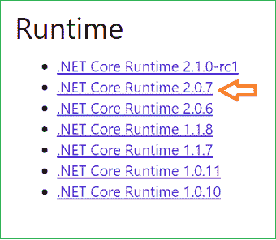

#### **第三步**

在。NET 核心运行时下载页面，向下滚动到 Windows 部分，选择“托管捆绑安装程序”链接下载。NET Core 托管捆绑包"*。*参考下图:

下载完成后，双击开始安装。您将看到一个类似如下所示的窗口:

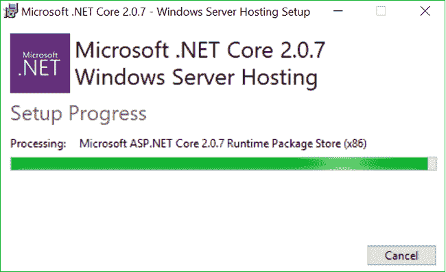

#### **重要提示**

1.  的。只有在安装 IIS 之后，才应该安装 NET Core 托管捆绑包。如果您在安装 IIS 之前安装了该捆绑包，那么您需要在安装 IIS 之后修复该捆绑包，以便它能够更新它对 IIS 的依赖关系。
2.  安装后重启机器。NET Core 托管包。

### 发布 Blazor 应用程序

一旦。NET Core hosting bundle 安装成功并且你已经重启了你的机器，使用 VS 2017 打开 Blazor 应用解决方案。

右击解决方案的服务器项目，然后单击"发布"。在这种情况下，它将是 BlazorDDL。服务器>>发布。

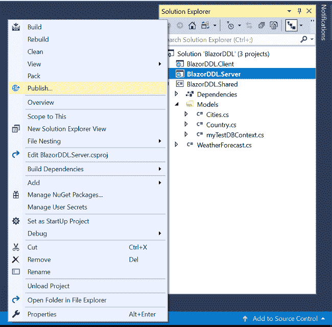

您将看到一个类似于下图的屏幕。从左侧菜单中选择文件夹，并提供文件夹路径。您可以提供想要发布应用程序的任何文件夹路径。

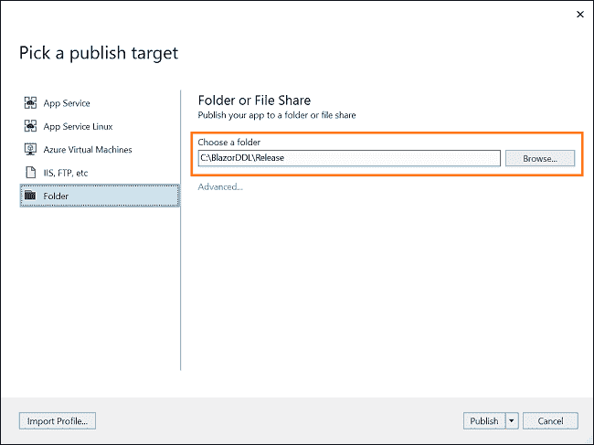

点击发布。Visual Studio 将开始发布您的应用程序。如果没有构建错误，那么您的应用程序将成功发布到您提到的文件夹中。

发布成功后，我们将继续配置 IIS。

### 配置 IIS

打开 IIS，右键单击站点>>添加网站。

将会打开一个“添加网站”弹出框。这里，我们需要在三个字段中提供详细信息

1.  网站名称:输入你选择的任何名称。这里我会放“ankitsite”。
2.  物理路径:发布应用程序的文件夹的路径。
3.  主机名:这是我们放入浏览器以访问我们的应用程序的名称。在这个演示中，我们将使用**ankitsite.com**。

单击“确定”创建网站。请参考下图:

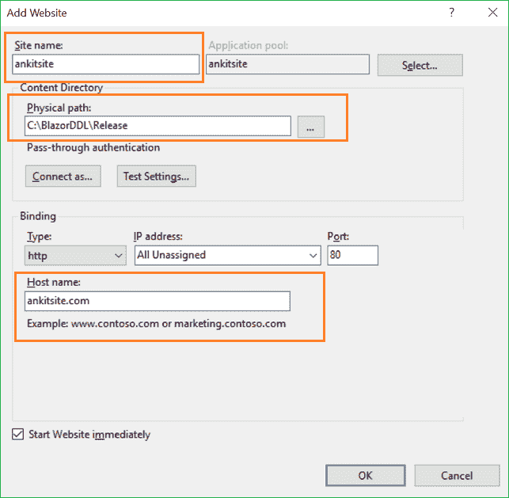

下一步是为我们的站点配置“应用程序池”。应用程序池名称将与我们在上一步中提供的“站点名称”相同。因此，在这种情况下，应用程序池的名称将是“ankitsite”。

从左侧面板中单击“应用程序池”，然后双击池“ankitsite”。它将打开一个“编辑应用程序池”窗口。选择“无托管代码”。NET CLR 版本下拉列表。请参考下图:

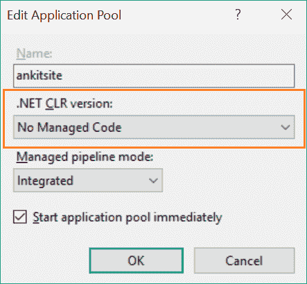

下面是用 gif 图解释的配置 IIS 的全过程。

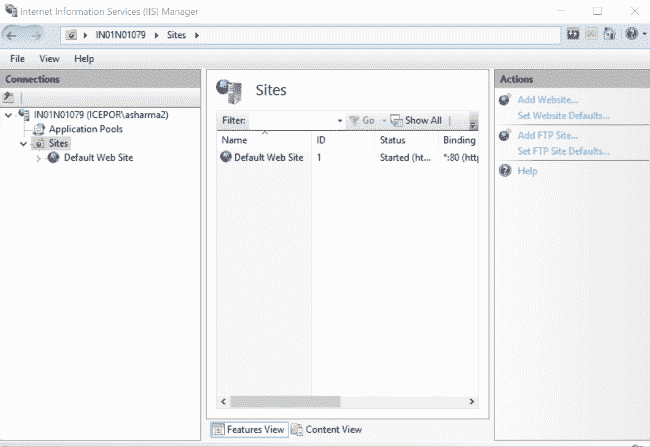

### 配置 DNS 主机

最后一步是配置我们的 DNS 主机文件。

在您的机器中导航到**C:\ Windows \ System32 \ drivers \ etc***路径，并使用任何文本编辑器打开“hosts”文件。*

*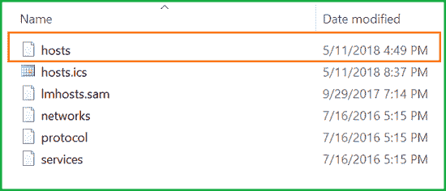*

*我们需要根据本地主机 IP 地址添加我们在 IIS 中提供的主机名。请参考下图:*

*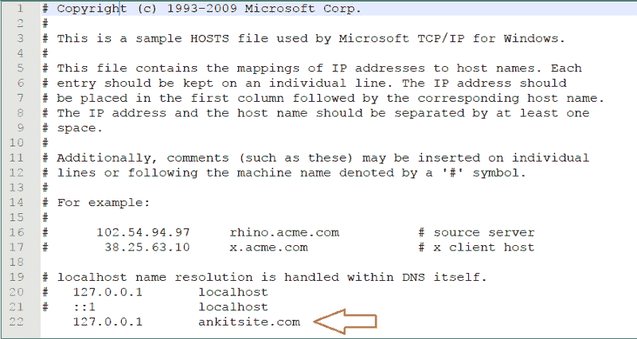*

*现在我们已经成功地在 IIS 上托管了一个 Blazor 应用程序。*

### *执行演示*

*打开机器上的任何浏览器，输入您配置的主机名。您可以看到应用程序将在浏览器窗口中打开。*

*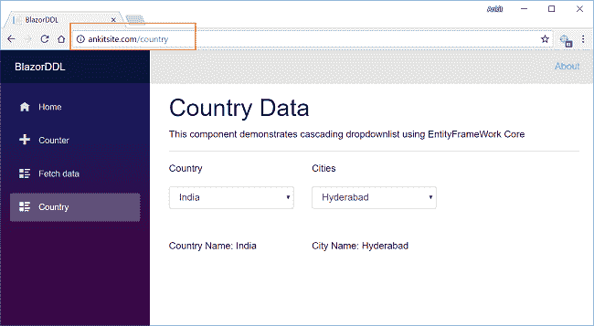*

### *常见主机问题疑难解答*

*在这一节中，我们将探讨在托管 Blazor 应用程序时可能会遇到的一些常见问题。*

1.  *您无法打开网站，并得到一个 DNS 未找到错误*

*检查主机文件中的主机名配置是否正确。确保您的机器没有连接到任何 VPN 服务器。此外，如果您正在使用任何 Web 代理，那么禁用它。*

*2.HTTP 错误 500.19-内部服务器错误-无法访问请求的页面，因为该页面的相关配置数据无效。*

*这个错误信息是清楚的。由于权限不足，发布文件夹不可访问。授予 IIS_IUSRS 组对发布文件夹的读取权限，以便它可以访问 Web.config 文件。*

*3.该网站正在加载，但数据没有得到填充，你得到一个 500 内部服务器错误*

*确保连接字符串的格式正确。您在连接字符串中指定的用户 id 应该具有 db_datareader 和 db_datawriter 权限。如果问题仍然存在，则为用户提供 db_owner 权限。*

*4.数据没有被填充，您会得到一个“不允许操作”异常。*

*当您尝试在 web API 中执行上传、发布或删除操作时，通常会出现此问题。为了缓解这个问题，我们需要改变 IIS 设置配置。*

*导航到控制面板>>打开或关闭 Windows 功能。然后导航到 Internet 信息服务>>万维网服务>>通用 HTTP 功能，取消选中“WebDAV 发布”选项，然后单击确定。请参考下图:*

*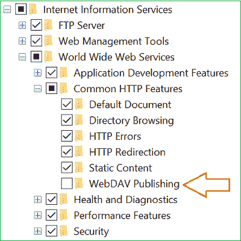*

*5.无法加载<web api="">:请求的资源上不存在“Access-Control-Allow-Origin”标头。</web>*

*该错误的原因是应用程序的客户端和服务器不在同一个端口上。由于同源策略，浏览器将限制应用程序进行 web API 调用。要解决此问题，您需要在应用程序中启用跨来源请求(CORS)。请参考微软关于在 ASP.NET 核心中[启用跨来源请求(CORS)的文档。](https://docs.microsoft.com/en-us/aspnet/core/security/cors?view=aspnetcore-2.1)*

*当您重新发布应用程序时，不要忘记刷新您的网站以及 IIS 中的应用程序池。*

### *结论*

*在本文中，我们学习了如何在 Windows 机器上的 IIS 上部署 Blazor 应用程序。我们还学习了在部署 Blazor 应用程序时如何解决一些常见的托管问题。*

*获取我的书 [Blazor 快速入门指南](https://www.amazon.com/Blazor-Quick-Start-Guide-applications/dp/178934414X/ref=sr_1_1?ie=UTF8&qid=1542438251&sr=8-1&keywords=Blazor-Quick-Start-Guide)以了解更多关于 Blazor 的信息。*

*你可以在这里查看我在 Blazor 上的其他文章。*

*你也可以在 [C#角](https://www.c-sharpcorner.com/article/deploying-a-blazor-application-on-iis/)找到这篇文章。*

### *请参见*

*   *[ASP.NET 核心 Blazor 入门](http://ankitsharmablogs.com/asp-net-core-getting-started-with-blazor/)*
*   *[ASP.NET 核心—使用 Blazor 的 CRUD 和实体框架核心](http://ankitsharmablogs.com/asp-net-core-crud-using-blazor-and-entity-framework-core/)*
*   *[ASP.NET 核心—使用 Angular 5 和实体框架核心的 CRUD】](http://ankitsharmablogs.com/asp-net-core-crud-using-angular-5-and-entity-framework-core/)*
*   *[ASP.NET 核心—带有 React.js 的 CRUD 和实体框架核心](http://ankitsharmablogs.com/asp-net-core-crud-with-react-js-and-entity-framework-core/)*
*   *[ASP.NET 岩心——使用角度为 5 的高图表](http://ankitsharmablogs.com/asp-net-core-using-highcharts-with-angular-5/)*

*最初发表于[https://ankitsharmablogs.com/](https://ankitsharmablogs.com/)*