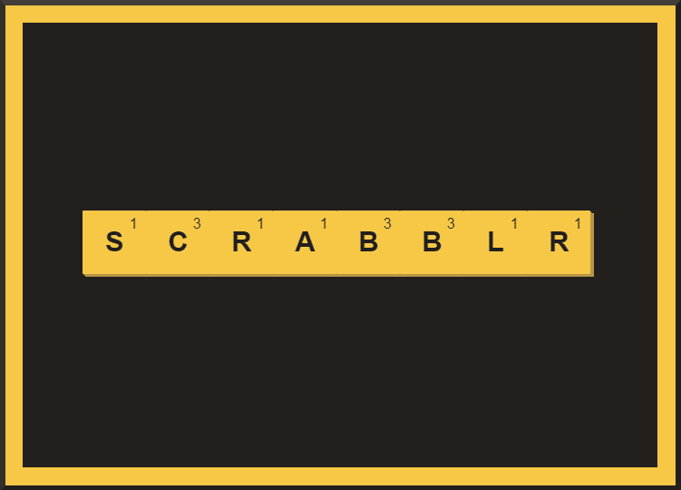
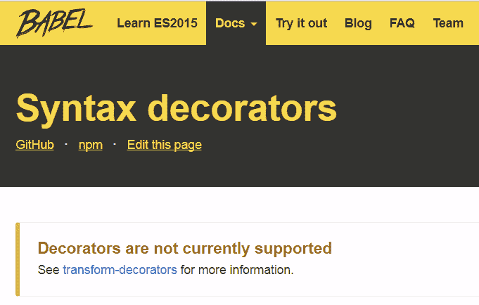
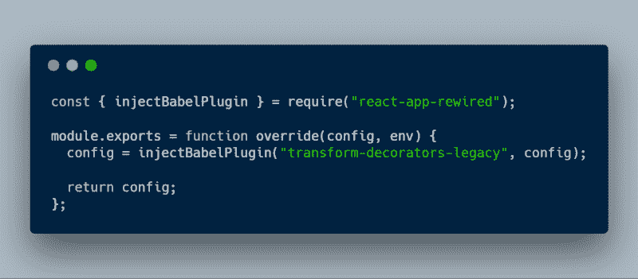
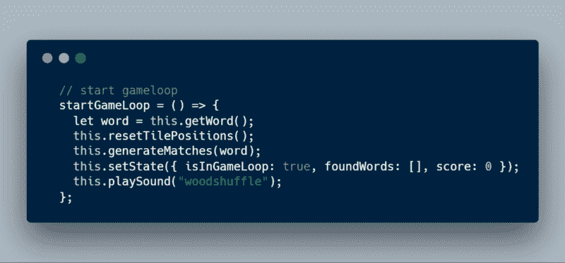
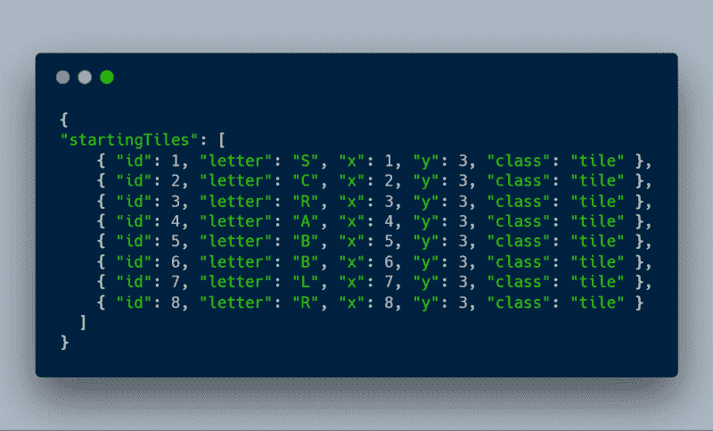
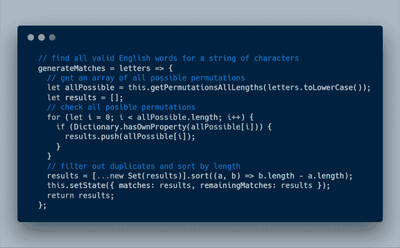

# 我如何用 react-dnd 和 react-flip-move 构建 React 游戏

> 原文：<https://www.freecodecamp.org/news/how-i-built-a-react-game-with-react-dnd-and-react-flip-move-26300156a825/>

尼古拉斯·文森特·希尔

# 我如何用 react-dnd 和 react-flip-move 构建 React 游戏

这是我在 React 中实现的一个字谜/文字游戏的高级概述。这不是有史以来最漂亮的代码，但我对我的第一个基于浏览器的游戏很满意。

这是我做的:

#### 拼字游戏(scrabbblr)—提高你的拼字技能，同时享受无穷乐趣

Click me to play Scrabblr!

### **背景**

我在 React.js 中查看动画解决方案，无意中发现了约书亚·科莫的 [react-flip-move](https://github.com/joshwcomeau/react-flip-move) [演示](http://joshwcomeau.github.io/react-flip-move/examples/#/scrabble?_k=8l9xbo)。我看到了用他酷酷的拖放和动画动作界面构建各种类似拼字游戏的潜力。

### 技术挑战

#### 装饰者与巴别塔

Joshua Comeau 的 [react-flip-move](https://github.com/joshwcomeau/react-flip-move) 需要函数装饰器，这是 create-react-app 的编译器 Babel 不支持的语言特性。

包 [react-app-rewired](https://github.com/timarney/react-app-rewired) 通过在不弹出的情况下覆盖 create-react-app Webpack 配置解决了这个问题(这对于像我这样不想处理 Webpack 的复杂性的新手来说是非常可怕的)。

config-overrides.js

上面的代码允许我注入[transform-decorators-legacy](https://github.com/loganfsmyth/babel-plugin-transform-decorators-legacy)插件(没有弹出)来处理 decorators。一个问题解决了，还有许多问题要解决。

#### 创建游戏循环

对我来说，区分酷的东西和“游戏”的是游戏循环的概念。

主游戏循环从用户输入开始(点击按钮开始新游戏)。用户洗牌并找到单词。

每当用户改变一个瓷砖的位置，游戏检查任何有效的话。如果单词有效，它会对该单词进行评分，并将总分增加该单词的分数。它还将该单词添加到“找到的单词”数组中，这样，如果将来再次找到该单词，它就不会重复计算。

当用户找到所有可能的单词(参见下面所有可能匹配问题的实现)或放弃(点击投降按钮)时，游戏循环结束，出现结果模式。

事实的数据或来源都包含在`state`中，并通过新的 React.context API 传递给我的组件(以避免[钻柱](https://itnext.io/compound-components-with-react-v16-3-6679c752bd56))。当一个新的游戏循环开始时，这些值都在`state`中被重置。

Method to initializes game loop inside the App component

#### 访问图块位置以查找字符

这个问题花了我令人尴尬的很长时间才解决。格子矩阵中图块的(x，y)位置包含在`state.tiles`中。

Tiles are created with default properties and held in state

我需要能够根据字母的位置从瓷砖上刮下字母，并组装一个字符串进行验证。我的解决方案是一个完全的黑客工作，我不会在这里展示它——它是我的 Github 上的 App.js 中的`checkForWords()`方法，急需重构。

#### 验证单词

我还需要一种快速的方法来检查字符串是否是有效的英语单词。我考虑的[免费字典 API 的](https://www.wordsapi.com/)具有非常低的每日请求数和高延迟。我需要一个解决方案，让我能够快速查看详尽的本地列表。在 270，000+键值对的字典上调用的`Object.hasOwnProperty()`方法工作得很好，也很快。

Check a single word against the Scrabble dictionary

下面的代码是我的解决方案，在给定一个字母数组的情况下，查找所有可能的有效单词。这就是我如何计算向用户显示的剩余单词数，并知道何时结束游戏循环。

我最初的尝试，在没有利用`Object.hasOwnProperty()`方法和速度优化的情况下，花了将近十秒来计算所有可能的有效单词。这个实现对用户来说几乎是即时的，并且在新的游戏循环开始时被调用。

Find all possible valid English words given an array of letters

### **结论**

我学到了很多建设这个项目，我很自豪的结果:我的游戏运行速度快，看起来很好。最后，我想添加 OAuth 和数据持久性，高分记录保存，以及用户设计的水平。

我仍然是编程和网页设计的新手——我很想在评论中听到你的评论/建议/批评。

在这里玩拼字游戏！

Thanks for reading!

> *阅读下一条:*

> [介绍和一点关于用 JavaScript 访问 IEX API 的知识](https://medium.com/coding-overload/introduction-and-a-little-about-accessing-iexs-api-with-javascript-7ae4e8af79d6)