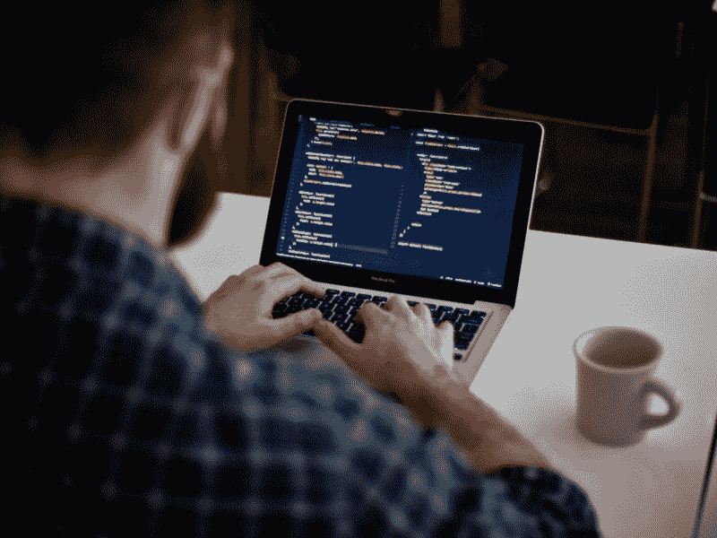

# 如何玩好自学开发的内心游戏

> 原文：<https://www.freecodecamp.org/news/how-to-play-the-inner-game-of-self-taught-development-a3a6716b2c6f/>

作者维克多·卡松

# 如何玩好自学开发的内心游戏

自学软件开发很难。任何人告诉你，否则很可能没有做过。

从新手到职业程序员是一个巨大的人生承诺。你必须牺牲很多才能实现。人们辞职有很多很好的理由。人们通常没有时间或兴趣花数小时观看教程或创建演示网站。

在思考了自己的经历后，我觉得自学成才有一个方面是人们谈得不够的。我相信有一种内在的游戏，你需要学会如何玩才能成功。学会如何玩并赢得这个内部游戏的人是那些成功到达另一边的人。

在这篇文章中，我将描述自学开发的**内心游戏**，并讨论你如何才能最终获胜。

### **不适是不可避免的**

任何时候你学习新的东西，你都必须走出你的舒适区，尝试超出你现有能力的东西。从进化的角度来看，这是有道理的。打破习惯是危险的，因为做一些新的事情会让我们的生存处于危险的境地。

因此，在学习新东西时，不舒服不是可有可无的，而是必须的。

自学成才的程序员经历了最糟糕的事情。在其他学习环境中，你有一个教练或其他同龄人来帮助你度过不适。然而，自学编程通常是孤立进行的。自学成才的程序员需要学会如何自己处理不舒服的事情。你需要同时成为教练、学生和啦啦队长。

学习编程可能是一种特别不舒服的体验，因为它通常是一个非线性的学习过程。有时候，你会觉得自己几天甚至几周都处于相同的技能水平。你仍然在学习一些信息，但是没有明显的进步。在自学 Android 开发时，我清楚地记得自己无助地被困了一个多星期，试图建立和查询我的数据库。

我喜欢把学习过程比作在没有图片指导的情况下做一个一万块的拼图。即使你找到了几个连接起来的子部分，也需要花费大量的时间和精力来弄清楚它们是如何连接在一起的。

最重要的是，不能保证你正在发展的技能会给你未来的回报。你想做的应用程序可能不够好，或者当你准备好的时候，你希望得到的工作可能还不存在。自我怀疑悄然而至，你开始问自己“这值得吗？”

### **内部游戏**

除了其他因素，上面提到的内在压力不断地对你不利，使学习过程更加困难。这些对立的力量为我喜欢认为的自学发展的内在游戏搭建了舞台。

由于每一个游戏都需要一个对手，所以这个游戏的对手用《艺术的战争》一书的作者史蒂文·普雷斯菲尔德所说的抵抗来概括最好不过了。

> 阻力看不见，摸不着，听不见，也闻不到。但是可以感觉到。我们将它体验为一个从潜在功辐射出来的能量场。这是一种排斥力。它是阴性的。它的目的是把我们推开，分散我们的注意力，阻止我们做我们的工作——史蒂文·普雷斯菲尔德的《艺术的战争》

抵抗的最终目的是让你脱离‘危险’，并处于你的舒适区。它不希望你在生活中进步，因为没有风险就不会有进步。

这就是为什么阻力在学习过程中找到了这么好的朋友。

毫不夸张地说，每个阅读这篇文章的人都确切地知道抵抗是什么感觉。当你知道你有重要的事情要做，但似乎就是不能离开沙发时，你会有这种感觉。

这种感觉本身并不危险，危险的是我们如何应对它。反抗永远不会直接出现。相反，它将通过其他方式显现。你可能熟悉它的一些最受欢迎的作品。？

1)冰网飞

2)自我怀疑

3)拖延

4)快乐时光

5)本文

这些东西本身是无害的。危险来自于让抵抗力量连续多日获胜。如果它赢的次数太多，你会发现自己放弃了，又回到了起点。

### **你怎么赢？**

这就是问题所在。你永远不会完全击败你的内部对手。阻力会一直伴随着你，试图分散你对重要工作的注意力。重要的工作是新的和不同的，反抗者讨厌新的和不同的。

这就引出了我最初的观点。那些成功自学编程的人已经接受了这个内在对手的持久性，并且已经学会了如何每天重新玩这个内在游戏。

史蒂文·普莱斯菲尔德说得好，

> “我能感觉到。我给予它最大的尊重，因为我知道它可以在任何一天击败我，就像喝酒的需要可以击败一个酒鬼一样容易”

不幸的是，没有简单的策略来赢得这场游戏。然而，你可以做一些事情来增加你的胜算。

#### **知己知彼**

不要只是意识到抗拒是什么感觉。也要意识到阻力会以不同的方式表现出来。如上所述，这并不总是显而易见的。

正如史蒂文·普莱斯菲尔德所说，

> 我非常清楚优先原则，它规定(a)你必须知道什么是紧急的和什么是重要的之间的区别，以及(b)你必须先做什么是重要的。

识别阻力的最好方法是留意你行为的根本原因。例如，如果你发现自己没有什么好理由就打扫房间，停下来问问自己为什么现在打扫很重要。一旦你理性地思考这个问题，真正的原因通常就显而易见了(你会意识到你的公寓可能没那么脏)。

保持你的第三只眼睛，时刻保持警惕。你越注意到抗拒的表现方式，你就越有准备去对抗它。

记住，任何阻碍你完成重要工作的事情，只要不是紧急的，都很可能是阻力。

#### **价值一致性高于激情**

激情是伟大的。不要误解我。但是激情是短暂的。这就像是一场糖热潮。高点很高，但总会有崩盘。长时间保持激情是困难的，也是令人疲惫的。

正如史蒂文·普雷斯菲尔德所说，

> 反抗用书中最古老的伎俩骗过了业余爱好者:它用自己的热情来对付自己。阻力让我们一头扎进一个完成时间表过于雄心勃勃且不切实际的项目中。它知道我们无法维持这种强度。我们会碰壁的。我们会坠毁的。

反抗其实喜欢激情，会用激情来对付你。你会发现自己会说这样的话，“我没有昨天那么有激情了。我应该放轻松。”阻力- 1，你- 0。

更好的策略是重视一致性而不是激情。一致性让你通过纪律找到自由。

罗马不是一天建成的，它是一砖一瓦建成的。我知道，我知道这是陈词滥调，但这是真的。学习如何成为一名软件开发人员需要时间和耐心。知识和技能不是你可以上传到大脑的东西。你需要持续施加压力，让新事物坚持下来。

习惯是人类拥有的最强大的工具之一。它们允许你不假思索地自动做事。反抗讨厌习惯。

阻力要你去想。它希望你坐在那里，考虑你可以做的所有其他事情。但是不要这样做。如果你养成了良好的学习习惯，你可以让你的习惯替你玩内部游戏。

### **结论**

如果你真的想成功，你需要接受自学程序员的艰难现实。每一天都要做好准备迎接任何阻力。注意它的技巧，并记住上面的策略。

这场比赛不容易，但它是可以赢的。我们都有能力赢得这场内心的游戏，因为我们在生活中已经有了某种能力。

所以，穿上衣服，埋头苦干，准备好迎接每一天的到来。

你喜欢这篇文章吗？ *[注册我的邮箱列表接收类似内容。](https://mailchi.mp/e8b86293ef36/victorsblog)*