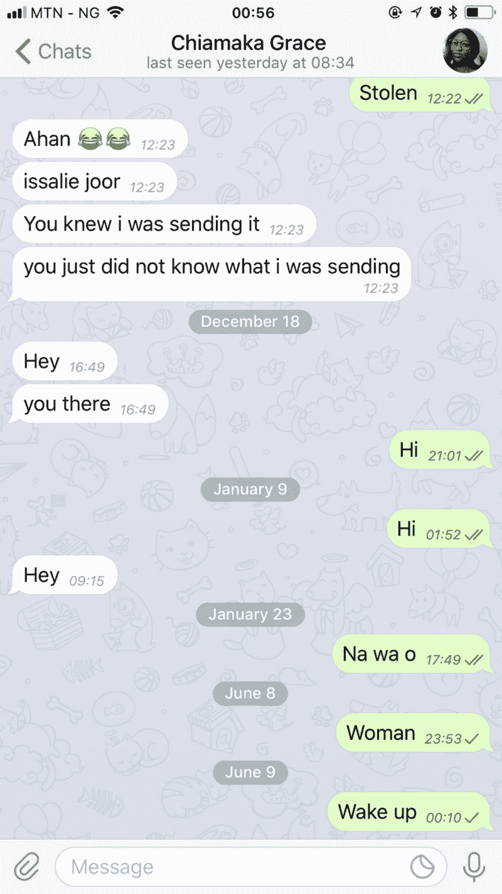
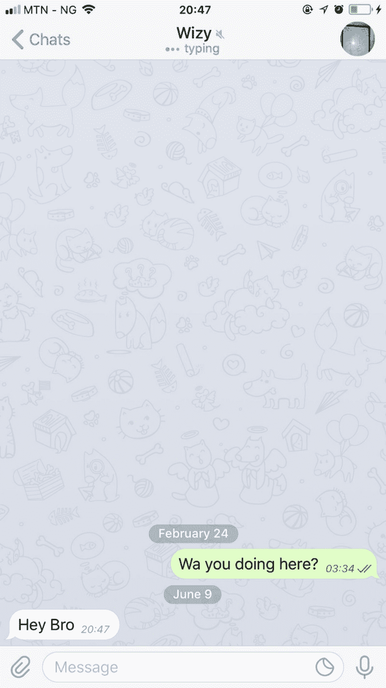

# 如何使用 Jest 和 react-testing-library 测试 Socket.io-client 应用程序

> 原文：<https://www.freecodecamp.org/news/testing-socket-io-client-app-using-jest-and-react-testing-library-9cae93c070a3/>

由大法官 Mba

# 如何使用 Jest 和 react-testing-library 测试 Socket.io-client 应用程序


Photo by [freestocks](https://www.freecodecamp.org/news/testing-socket-io-client-app-using-jest-and-react-testing-library-9cae93c070a3/undefined) on [Unsplash](https://unsplash.com/@freestocks)

测试实时 Socket.io-client 集成的质量似乎已经被遗忘了，可能是因为 ui 的可测试性问题由来已久。让我们来解决这个问题！

赶紧谷歌一下“测试 socket.io app”。

前两个结果页面(不必打开其余页面)都是侧重于测试服务器端 socket.io 集成的示例和教程。没有人谈论前端 socket.io-client 集成的质量，用户界面在接收某些事件时的外观，以及前端代码是否实际上发出了正确的事件。

但是为什么呢？这是否仅仅意味着人们并不真正关心他们的前端实时应用程序的质量——软件的核心？我不这么认为。我的猜测是:测试 ui*是* **太难了！**

用户界面的可测试性问题由来已久。ui 从来都不是稳定的。我们现有的测试工具很容易导致编写非常脆弱的 UI 测试。因此，人们倾向于将时间和精力只放在服务器端的 socket.io 应用程序测试上。

但那感觉不对。只有用户界面才能让我们的用户确信他们确实达到了使用我们应用的目的。但是，对我们来说，一个 UI 测试工具已经诞生了！

### 反应测试库

几个月前，我的朋友兼导师肯特·c·多兹 [发布了这个测试 react 应用的漂亮工具](https://blog.kentcdodds.com/introducing-the-react-testing-library-e3a274307e65)。从那以后，我不再只是喜欢测试 ui 的**想法**，而是真的喜欢测试它们。我真的挖掘并测试了所有因为复杂而放弃测试的 UI 代码:)。

根据我的经验，react-testing-library 是解决所有 UI 测试问题的灵丹妙药。它不仅仅是一个测试工具，还是一种测试方法。

注意:如果你不是 React 的人，还有 [vue-testing-library](https://www.npmjs.com/package/vue-testing-library) 、 [ng-testing-library](https://www.npmjs.com/package/ng-testing-library) 和 [others](https://www.npmjs.com/browse/depended/dom-testing-library) ，它们都构建在 [dom-testing-library](https://www.npmjs.com/package/dom-testing-library) 之上。

react-testing-library 最好的特性可能是它对 UI TDD 的支持。根据文件，[的主要指导原则](https://twitter.com/kentcdodds/status/977018512689455106)是:

> 你的测试越像你的软件被使用的方式，它们就越能给你信心。

这就是我说的“方法”。像你的非技术朋友一样测试你的用户界面。你的用户可能既不知道也不关心你的代码是什么样子。你的测试也不应该。这给了我们在 ui 上使用 TDD 的能力。

这就是我们将如何编写我们的 socket.io-client 测试——不用考虑代码就可以测试一切。现在让我们开始吧！

### 测试电报应用程序

来自我们非常有才华的 Telegram UI 设计师，以下是我们将要测试的 Telegram 应用程序的设计。



telegram chat screenshots

在设计中，我看到了几个实时功能，我们的用户希望确保应用程序执行，否则他们会关闭标签。以下是其中的一些:

*   应用程序应该获得消息
*   应用程序应该告诉当/如果一个消息被发送或没有
*   应用程序应该告诉当/如果一个消息被传递或没有
*   应用程序应该告诉朋友什么时候上线/下线
*   应用程序应该告诉当一个朋友在打字

好的，清单还在继续…但是让我们先做这些。

#### 接收消息

让我们看一个例子，用户如何知道他们是否收到了消息。首先，创建一个测试文件，然后导入 chat.js 文件及其模仿的依赖项。如果你是第一次接触嘲讽之类的东西，那么肯特·c·多兹真的应该成为你的朋友。他涵盖了 JavaScript 测试的所有内容，所以请在这里、Twitter 和其他任何地方关注他。

当我写这一行的时候，我在想他应该写一本关于 JS 测试的书，所以我在推特上写道:

希望他最终会:)

回到我们的测试文件:

```
// chat.test.jsimport React from 'react';import io from 'socket.io-client';
```

```
import Chat from './chat';
```

因为，我们在这里只是做集成测试，我们并不真的想向服务器发出 socket.io 事件。所以我们需要模拟出 socket.io-client。要了解更多关于模仿的信息，请参阅 Kent 的文章"["但是，什么是 JavaScript 模仿呢？](https://blog.kentcdodds.com/but-really-what-is-a-javascript-mock-10d060966f7d)”以及 Jest 文档中关于 [Jest 的模拟功能](https://facebook.github.io/jest/docs/en/mock-functions.html#using-a-mock-function)的这一段。

一旦你理解了如何模仿，接下来的事情就是理解你的模块在做什么，然后模仿实现。

```
// socket.io-client.js
```

```
let EVENTS = {};
```

```
function emit(event, ...args) { EVENTS[event].forEach(func => func(...args));}
```

```
const socket = { on(event, func) {  if (EVENTS[event]) {   return EVENTS[event].push(func);  }  EVENTS[event] = [func]; }, emit};
```

```
export const io = { connect() {  return socket; }};
```

```
// Additional helpers, not included in the real socket.io-client,just for out test.
```

```
// to emulate server emit.export const serverSocket = { emit }; // cleanup helperexport function cleanup() { EVENTS = {}}
```

```
export default io;
```

这样，我们的测试就有了一个足够好的 socket.io-client 模拟。让我们使用它。

```
// chat.test.jsimport React from 'react';import mockio, {serverSocket, cleanUp } from 'socket.io-client';
```

```
import Chat from './chat';
```

现在让我们编写第一个测试。传统的 TDD 方法说我们将为一个特性编写一个测试，看到它失败，然后实现这个特性来满足我们的测试。为了简洁起见，我们不打算确切地做*那件事，因为本文关注的是测试。*

遵循 react-testing-library 方法，在编写任何测试之前，您要做的第一件事就是问自己:“用户将如何测试这个特性？”对于上面列表中的第一个测试，你问自己，“用户如何知道他们收到了朋友发送的消息？”。为了测试它，他们可能会告诉旁边的人给他们发一条信息。

通常，这将如何工作是，用户的朋友发送一个消息给服务器，与用户的地址，然后服务器发出消息给用户。现在，因为我们不是测试用户此时是否能发送消息，而是测试用户是否能**接收到**的消息，所以让`socket.io server`直接给用户发送消息。

```
// chat.test.jsimport React from 'react';import mock-io, {serverSocket, cleanUp } from 'socket.io-client';import {render} from 'react-testing-library';
```

```
import Chat from './chat';
```

```
test('App should get messages', () => {  // first render the app  const utils = render(<Chat />)    // then send a message  serverSocket.emit('message', 'Hey Wizy!');})
```

上面我们从 react-testing-library 导入了`render`方法，这只是一个对`ReactDom.render`的包装。在我们的文本中，我们用它来呈现我们的聊天应用程序。render 方法返回一个 test utility 对象，该对象包含查询方法，我们可以使用这些方法来查询我们的应用程序的`container`——将我们的应用程序渲染到的 DOM 节点`render`——我们的测试感兴趣的 DOM 节点。接下来，使用我们的模拟 socket.io 服务器向用户发送消息。

既然我们已经向用户发送了消息，请再想一想:用户如何知道他们已经收到了消息？从上面的设计来看，他们肯定要看着屏幕才能看到消息出现。因此，为了测试这一点，我们必须查询我们的应用程序的容器，看看它是否有任何节点包含我们发送的消息，“嘿，Wizy！”为此，从`render`返回的实用程序对象有一个名为`getByText`的查询方法，所以我们可以简单地做:

`expect(utils.getByText('Hey Wizy!')).toBeTruthy();`

虽然这可能行得通，但不幸的是，我们做不到。原因如下:从`render`返回的所有查询方法将在整个容器中搜索指定的查询。这意味着`getByText`，如上所述，将在整个容器中搜索文本‘嘿，Wizy！’，然后返回包含该文本的第一个节点。

但是这不是我们的用户寻找文本的方式。相反，我们的用户将只在包含所有消息的“消息部分”的中查看**。只有当消息出现在那个部分，他们才会知道他们收到了一条消息。因此，为了确保我们的测试类似于用户如何使用我们的应用程序，我们需要搜索文本“嘿，Wizy！”**只在**消息区内，就像用户会做的那样。**

为此，react-testing-library 为我们提供了一个独特的查询方法调用`within`，帮助我们将查询**集中在**所呈现文档的特定部分。让我们使用它！

注意:`within`是一个受本文启发的新 API，所以请确保您拥有 react-testing-library 的最新版本。

```
// chat.test.jsimport React from 'react';import mock-io, {serverSocket, cleanUp } from 'socket.io-client';import {render, within} from 'react-testing-library';
```

```
import Chat from './chat';
```

```
test('App should get messages', () => {  // first render the app  const utils = render(<Chat />)    // then send a message  serverSocket.emit('message', 'Hey Wizy!');    // the message must appear in the message-section  const messageSection = utils.getByTestId('message-section');  // check withing messageSection to find the received message  const message = within(messageSection).getByText('Hey Wizy!');})
```

首先，我们用查询方法`getByTestId`抓取消息部分。要在您的测试中使用`getByTestId`，您必须在 DOM 中硬编码它。像这样:

`<div data-testid=”message-section”` / >

因为`getByTestId`与用户定位应用程序的方式并不十分相似，所以你应该只在特殊情况下使用它，而且只有在你确定没有更好的选择的时候。

尽管如此，我们的测试并不依赖于 DOM 结构。即使有人将`div`更改为`section`标签或者将其包装在 DOM 中的 10 层，我们的测试也不仅仅关心代码——它只关心 test-id。

最后，我们使用前面描述的`within`方法来获取接收到的消息。如果没有找到文本，`getByText`将抛出并使我们的测试失败。

这就是我们断言应用程序可以获取消息的方式。

#### 编写更多测试

让我们看看 react-test-library 给我们的更多查询方法。我们将看到如何进一步组合我们已经学习的 API 来执行更复杂的查询，而不依赖于 UI 代码。

所以现在，让我们写第二个测试:应用程序应该告诉用户消息何时/是否已经发送。此外，我认为这个测试基本上与列表中的下一个测试做同样的事情，所以让我们将两者合并成一个例子。

同样，我们问的第一个问题是…？我知道你明白了:“我们的用户将如何测试这个特性？”好吧，你如何表达你的问题可能是不同的，但你得到的想法:)。因此，要测试发送消息功能，步骤如下所示:

*   用户定位输入以输入他们的消息。然后他们输入他们的信息。最后，他们点击发送按钮。
*   消息应该出现在消息部分
*   服务器将判断消息是否到达服务器，这意味着已发送
*   UI 应该将消息标记为已发送
*   然后，服务器会告知消息何时送达
*   反过来，UI 应该在消息交付时更新消息

用户如何定位输入来输入他们的消息？从我们正在进行的 UI 设计来看，他们必须寻找带有占位符“消息”的输入。(嗯，这实际上是屏幕上唯一的输入，但即使有更多输入，用户也会通过占位符或标签来识别输入以输入他们的消息。)

react-testing-library 用一个叫做`getByPlaceholderText`的查询方法再次覆盖了我们

```
// chat.test.jsimport React from 'react';import mock-io, {serverSocket, cleanUp } from 'socket.io-client';import {render, renderIntoDocument, within, cleanup} from 'react-testing-library';
```

```
import Chat from './chat';
```

```
afterEach(cleanup);
```

```
test('App should get messages', () => {  // ...})
```

```
test('App should tell when message is sent and delivered', () => {  // first render the app  const utils= renderIntoDocument(<Chat />)    // enter and send a message  utils.getByPlaceholderText('message').value = 'Hello';  utils.getByTestId('send-btn').click()})
```

所以我们在这里引入了几个新的 API。第一种是`renderIntoDocument`法。在我们的测试中，我们应该激发真实的 DOM 事件，而不是模拟它们，因为这更类似于用户使用我们的应用程序的方式。

缺点是，`render`方法动态地创建并呈现我们的应用程序到一个任意的 DOM 节点，称为`container`。但是 React 通过事件委托来处理事件——在`document`上为所有事件类型附加一个事件，然后将事件委托给触发该事件的适当 DOM 节点。

因此，要激发真正的 DOM 事件，我们需要将我们的应用程序实际渲染到`document.body`中。这就是`renderIntoDocument`为我们做的。

因为我们呈现到文档中，所以我们希望总是确保在每次测试之后文档都被清理。你猜对了，**清理**助手函数为我们做了这件事。

在测试中，输入值后，我们单击 send 按钮发送消息。如果你注意到了，看看设计，没有发送按钮。但如果你现在打开你的电报或 WhatsApp，你会注意到只有当你在信息输入中实际输入了一些文本时，发送按钮才会出现。我们的测试只是偶然覆盖了这个特性。:)

现在我们已经点击了发送按钮，让我们做一些断言。

```
// chat.test.jsimport React from 'react';import mock-io, {serverSocket, cleanUp } from 'socket.io-client';import {render, renderIntoDocument, within, cleanup} from 'react-testing-library';
```

```
import Chat from './chat';
```

```
afterEach(cleanup);
```

```
test('App should get messages', () => {  // ...})
```

```
test('App should tell when message is sent/delivered', () => {  // first render the app  const utils = renderIntoDocument(<Chat />)    // enter and send a message  utils.getByPlaceholderText('message').value = 'Hello';  utils.getByTestId('send-btn').click();    // the message should appear on the message section  const messageSection = uitils.getByTestId('message-section');  expect(within(messageSection).getByText('Hello')).toBeTruthy();    // server tells us message is sent  serverSocket.emit('message-sent');
```

```
 // Now the UI should mark the message as sent  const message = within(messageSection).getByText('Hello');  expect(within(message).getByTestId('sentIcon')).toBeTruthy();
```

```
 // server tells us it's delivered  serverSocket.emit('message-delivered');
```

```
 // UI should mark the message as delivered  expect(within(message).getByTestId('deliveredIcon')).toBeTruthy();})
```

仅此而已。正如用户所期望的那样，我们的测试期望在发送/传递消息时，看到消息旁边出现 sent/delivered 图标。

到目前为止，我们已经看到了使用 react-testing-library 测试实时 socket.io-client 应用程序是多么容易。不管你在测试什么，当你遵循这种方法时，你会对你的应用程序的正常运行更有信心。更重要的是，我们仍然对应用程序的实现方式一无所知。就像用户一样，**我们的测试根本不关心实现！**

### 收尾工作

最后，我将让您考虑如何编写列表中最后两个剩余的测试:

*   应用程序应该告诉朋友什么时候上线/下线
*   应用程序应该告诉当一个朋友在打字

提示:您应该让服务器 socket.io 发出事件，然后断言 UI 的外观。想想**用户如何确切地**知道朋友何时在线、离线打字。

如果你觉得我做得很好，其他人也应该有机会看到这一点，请为这篇文章鼓掌，帮助传播一种测试实时 socket.io 客户端应用程序的更好方法。

如果你有一个问题没有得到回答，或者对这里的一些观点有不同的看法，请随时在这里或通过 [Twitter](https://twitter.com/Daajust) 发表评论。

你可能还想在这里和/或 Twitter 上关注我，以获得更多精彩的文章。你可能想看看我以前的文章:

*   [想更好的了解 Node.js 中的 Buffer 吗？看看这个](https://medium.freecodecamp.org/do-you-want-a-better-understanding-of-buffer-in-node-js-check-this-out-2e29de2968e8?source=user_profile---------2-------------------)
*   [功能设置状态是 React 的未来](https://medium.freecodecamp.org/functional-setstate-is-the-future-of-react-374f30401b6b)