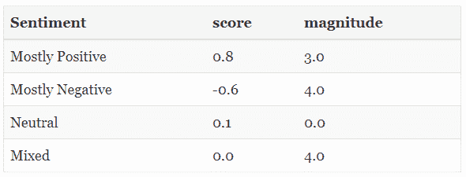
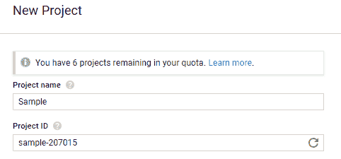
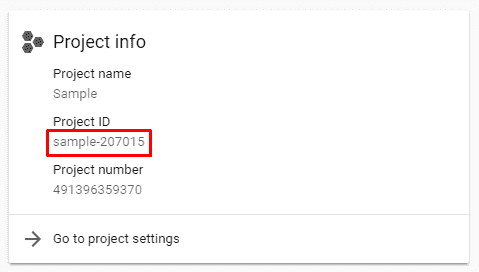
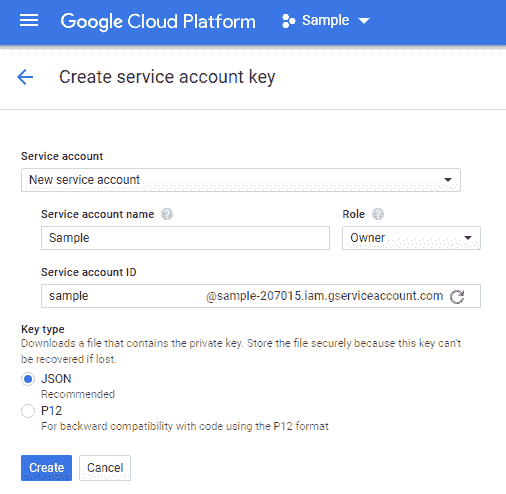
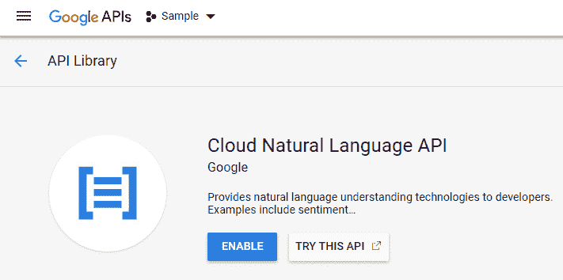
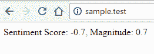

# 使用 Laravel 和 Google 自然语言 API 的情感分析

> 原文：<https://www.freecodecamp.org/news/sentiment-analysis-using-laravel-and-the-google-natural-language-api-acb70871698a/>

作者达伦·乔勒斯

# 使用 Laravel 和 Google 自然语言 API 的情感分析

#### 在 5 分钟内写下你自己的情绪检测器。


情感分析是确定一段文本是正面的、负面的还是中性的过程。

### 情感分析的真实世界应用

本文的目标是让您开始使用 Google 自然语言 API 和 Laravel。您将使用这个 API 对文本执行情感分析。

使用这些技术，您可以在现有的应用程序中构建一些强大的功能。一些想法包括:

*   检测评论或评论中的情感
*   基于社交媒体活动预测市场动向
*   通过观察前后的情绪来确定营销活动的有效性

### 解读情感分析值

Google API 获取提供的文本，对其进行分析，并确定流行的情绪观点。它决定了写作是积极的，消极的，还是中性的。

情绪由数值**分数**和**大小**值表示。

*   **得分**范围在-1.0(负)和 1.0(正)之间。
*   **量级**表示情绪的强度(积极的和消极的)。范围从 0.0 到无穷大。**幅度**没有被归一化，因此较长的文本段落总是具有较大的**幅度**。



The values above are guides only, and you’ll need to adjust according to your specific environment.

### Google 云平台设置

第一步是在 Google 云平台控制台中创建一个新项目。

前往仪表板，[创建一个新项目](https://console.cloud.google.com/projectcreate)。



一旦你的项目被创建，把**项目 ID** 放在手边。



*   一旦您有了项目，请转到[创建服务帐户密钥](https://console.cloud.google.com/apis/credentials/serviceaccountkey)页面。
*   确保您的示例项目在顶部被选中。
*   在**服务账户**下，选择**新建服务账户**。
*   在**服务帐户名称**字段中输入名称。
*   在**角色**下，选择**项目**g**t；Ow** ner。
*   最后，单击 **Create** 自动下载 JSON 凭证文件。



您可能还需要通过 [API 库](https://console.developers.google.com/apis/library/language.googleapis.com)部分启用云自然语言 API。



### Laravel 项目设置

下一步是建立一个新的 Laravel 项目。如果您已经有一个现有的 Laravel 项目，您可以跳过这一步。

我在这篇文章中使用的是 Laravel 5.5 LTS。在命令行中，运行下面的 Composer 命令来创建一个新项目(您也可以使用 [Laravel 安装程序](https://laravel.com/docs/5.5#installing-laravel)):

```
composer create-project --prefer-dist laravel/laravel sample "5.5.*"
```

如果您使用了 Composer，请将 **.env.example** 文件重命名为**。env** ，然后运行以下命令来设置应用程序密钥:

```
php artisan key:generate
```

### 添加谷歌“云语言”包

运行以下命令，将 Google Cloud 自然语言包添加到项目中:

```
composer require google/cloud-language
```

您可以将下载的 JSON 凭证文件放在您的应用程序根目录中(而不是您的公共目录中)。随意改名。永远不要将这个文件提交到您的代码库中——对于任何敏感的设置也是如此。一种选择是在初始部署后将其手动添加到服务器。

### 主要事件:将实际代码添加到项目中

我将把以下路线添加到我的 **routes/web.php** 文件中:

```
<?php 
```

```
Route::get('/', 'SampleController@sentiment');
```

我创建了一个简单的控制器来存放代码。我将在控制器中添加所有代码。在生产应用程序中，我强烈建议对任何业务逻辑使用单独的服务类。这种方式的控制器是精简的，并坚持他们的初衷:控制输入/输出。

我们将从一个简单的控制器开始，添加一个`use`语句来包含 Google Cloud `ServiceBuilder`类:

```
<?php
```

```
namespace App\Http\Controllers;
```

```
use Google\Cloud\Core\ServiceBuilder;
```

```
class SampleController extends Controller{    public function sentiment()    {        // Code will be added here    }}
```

我们要做的第一件事是创建一个`ServiceBuilder`类的实例，这样我们就可以指定我们的项目 ID 和 JSON 凭证。

```
$cloud = new ServiceBuilder([    'keyFilePath' => base_path('gc.json'),    'projectId' => 'sample-207012']);
```

使用`keyFilePath`选项指定 JSON 文件的位置。我已经使用 Laravel [base_path()](https://laravel.com/docs/5.5/helpers#method-base-path) 助手来引用完全限定的应用程序根路径。

下一个选项是`projectId`。这是您在 GCP 控制台中创建项目时获得的值。

接下来，我们将创建一个`LanguageClient`类的实例。`ServiceBuilder`类通过在 API 中公开各种授权访问服务的工厂方法来简化这一过程。

```
$language = $cloud->language();
```

现在我们有了这个类的实例，我们可以开始使用自然语言 API 了。我们将使用一些文本声明一个变量，分析情感，并输出结果:

```
// The text to analyse$text = 'I hate this - why did they not make provisions?';
```

```
// Detect the sentiment of the text$annotation = $language->analyzeSentiment($text);$sentiment = $annotation->sentiment();
```

```
echo 'Sentiment Score: ' . $sentiment['score'] . ', Magnitude: ' . $sentiment['magnitude'];
```

这就是全部了！



Output for the code above.

下面是最终的控制器类代码:

```
<?php
```

```
namespace App\Http\Controllers;
```

```
use Google\Cloud\Core\ServiceBuilder;
```

```
class SampleController extends Controller{    public function sentiment()    {        $cloud = new ServiceBuilder([            'keyFilePath' => base_path('gc.json'),            'projectId' => 'sample-207012'        ]);
```

```
 $language = $cloud->language();
```

```
 // The text to analyse        $text = 'I hate this - why did they not make provisions?';
```

```
 // Detect the sentiment of the text        $annotation = $language->analyzeSentiment($text);        $sentiment = $annotation->sentiment();
```

```
 echo 'Sentiment Score: ' . $sentiment['score'] . ', Magnitude: ' . $sentiment['magnitude'];    }}
```

### 结论

我们仅仅触及了 Google 自然语言 API 所能提供的皮毛。一旦掌握了这一点，我建议您查看该 API 中的以下附加服务:

*   **实体分析**:分析地标、公众人物等实体。
*   **内容分类**:分析文本并返回适用于内容的类别列表。

如果您有任何问题，请随时联系我们！

*最初发布于 2018 年 6 月 13 日[www.chowles.com](https://www.chowles.com/sentiment-analysis-using-laravel-and-google-natural-language-api/)。*