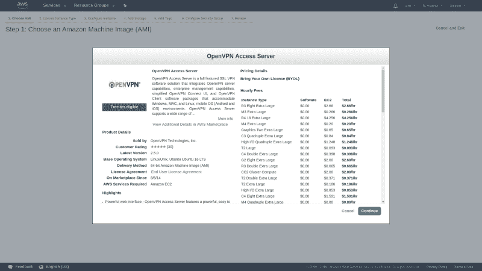
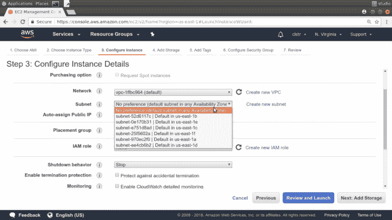
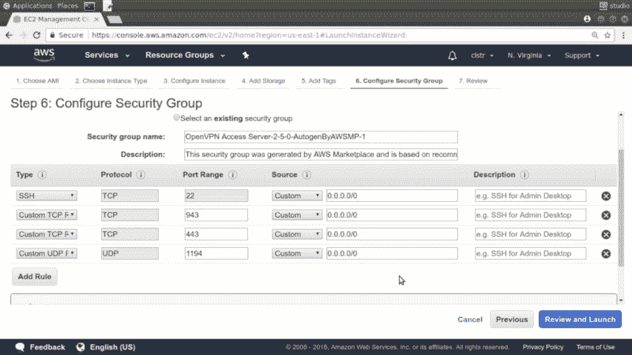
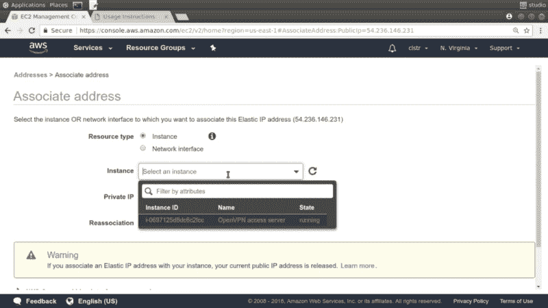
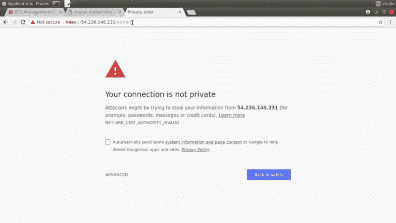
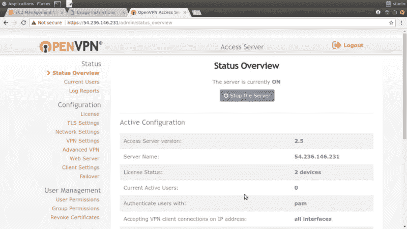
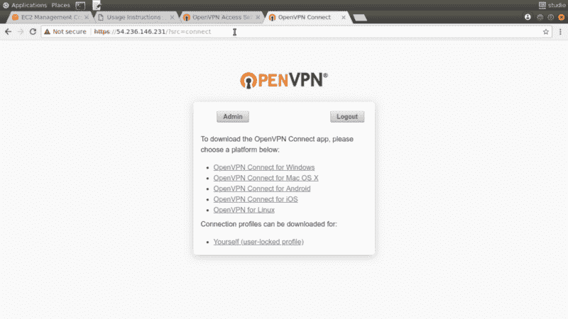

# 如何使用 OpenVPN 安全地访问私有 AWS 资源

> 原文：<https://www.freecodecamp.org/news/how-you-can-use-openvpn-to-safely-access-private-aws-resources-f904cd24f890/>

*这篇文章改编自我的新 Pluralsight 课程的一部分，“将本地资源连接到您的 AWS 基础设施*

你有时需要连接到运行在 Amazon Web Services 上的资源吗？使用 SSH 访问您的公共 EC2 实例并加密您的 S3 数据，实际上是足够安全的。但是，如何进入后端 RDS 数据库实例或处理基于 AWS 的非公开数据呢？管理员有各种各样的理由不让公众接触到这些资源。但是如果你不能在需要的时候得到它们，它们对你有什么好处呢？

因此，您需要找到一种绕过 ACL 和安全组的安全可靠的方法来保护您的东西。我在 Pluralsight 上的“将本地资源连接到您的 AWS 基础设施”课程中提到的一个解决方案是直接连接。但是，如果直接连接的价格标签是贵公司的预算克星，那么某种 VPN 隧道可能会做的伎俩。

### 什么是虚拟专用网络？

虚拟专用网络(VPN)通常用于允许受限的网络活动或匿名浏览。但这不是本文要讨论的内容。

VPN 是一种点对点连接，允许您通过公共网络在两个站点之间安全地移动数据。实际上，隧道可以设计成将两个地理上分离的私有站点结合成一个单独的私有网络。在我们的环境中，这意味着将您当地的办公网络与托管您私人资源的 AWS VPC 连接起来。

有两种方法可以做到这一点:

*   构建在 AWS 虚拟专用网关之上的托管 VPN 连接
*   用自己的 VPN。

这篇文章将重点介绍自己动手的方法。

#### OpenVPN 接入服务器

顾名思义， [OpenVPN](https://openvpn.net/) 是一个开源项目，你总是可以下载免费的社区版并在你自己的 VPN 服务器上安装。但是 OpenVPN 公司也提供了一个[专用的 OpenVPN 访问服务器作为 EC2 AMI](https://openvpn.net/index.php/access-server/on-amazon-cloud.html) ，它开箱即用，具有 AWS 友好的集成和自动化配置工具。

在我看来，在您的 AWS VPC 中启动 AMI 并为受控的远程连接开放它已经成为完成这项工作的“正确”方式。

费用是多少？如果你只是测试一下，不打算同时使用两个以上的连接来访问 VPN，那么 AMI 本身就是免费的。您仍然需要支付 EC2 实例的常规费用，但是如果您的帐户仍然符合免费等级，那么您也可以免费获得。

一旦您将 VPN 投入使用，您购买的许可证将取决于您需要的并发连接数。这一页有你需要的细节。

以下是我们在本指南中要做的事情:

*   选择、供应和启动一个 Ubuntu AMI，并在我的 VPC 中预装 OpenVPN 访问服务器
*   使用 SSH 访问服务器并配置 VPN
*   设置管理员用户
*   将本地机器设置为 OpenVPN 客户端，并连接到我的 AWS VPC 中的私有实例

准备好了吗？

### 启动 OpenVPN 访问服务器

从 EC2 仪表板—确保我们在正确的 AWS 区域—启动一个实例作为我们的 VPN 服务器。我将点击 AWS Marketplace 选项卡并搜索“openvpn access server”，而不是使用快速启动 ami。OpenVPN 提供了许多与许可证相关的官方图像，提供了越来越多的连接客户端。

我将使用这个 Ubuntu 映像，它通过“自带许可证”的方式工作。正如我之前写的，我们实际上不需要许可证来做我们要做的事情。


OpenVPN Access Server AMIs available from the AWS Marketplace

选择 AMI 会打开一个弹出窗口，告诉我们使用不同的实例类型和 EBS 存储选择，这个映像每小时会花费我们多少钱。然而，这些只是常规的 AWS 基础设施成本，不包括许可费。



OpenVPN Access Server AMI costs — billed directly by AWS

说到实例类型，我将降级到 t2.micro 以保持它在空闲层中。繁忙的生产服务器可能需要更多的电力。

因为几分钟后我将在同一个子网中启动第二个实例，所以我将从 Configure Instance Details 页面中选择“us-east-1b ”,并记下来以备后用。



Choose a subnet and note for later

现在，安全组页面是 OpenVPN AMI 设置真正闪耀的地方。一个安全小组向我们展示了我们需要的一切。端口 22 用于进入服务器的 SSH 流量，943 是我们将用来访问管理 GUI 的端口，443 是 TLS 加密的 HTTP 流量，OpenVPN 将在端口 1194 上侦听传入的客户端连接。



The Security Group that comes with the OpenVPN AMI

**注意**:如果可行的话，收紧这些规则通常是个好主意，因此只接受来自有效公司 IP 地址范围的请求，但这对于短期测试来说没问题。

在这里，我将检查我的设置，确认我已经获得了列出的 SSH 加密密钥，然后扣动扳机。

一旦实例启动，我将看到重要的登录信息——包括我们将用于 SSH 到服务器的用户帐户名为 openvpnas——和一个快速入门指南。我还会收到一封包含相同信息链接的电子邮件。

回到 EC2 实例控制台，当新机器完成引导时，我们看到了我们的公共 IP 地址。如果我们需要重新启动实例，不能保证我们会再次获得相同的 IP，这可能会造成相当大的混乱。因此，给实例分配一个弹性 IP 是个好主意。

为此，我将单击弹性 IPs，然后分配新地址。记下新地址并关闭页面。现在，选中该地址，单击操作，然后单击“关联地址”。我将在实例框中单击一次，我的 OpenVPN 实例——及其有用的标记——将会列出。我只需要选择它，点击“关联”，我就完成了。从现在开始，这将是访问我们服务器的永久公共 IP。



Associate your new Elastic IP address with your instance

### 访问服务器

我将把公共 IP 地址粘贴到终端中，作为调用我为此实例设置的密钥对的 SSH 命令的一部分。

```
ssh -i KeyPairName.pem openvpnas@<PublicIPAddress>
```

如果您从 Windows 或 macOS 机器访问，事情可能会有所不同，但文档会给您所需的所有帮助。

然而，在我离开实例控制台之前，我将执行一个更重要的功能。选择 OpenVPN 实例后，我将单击操作，然后单击网络，然后单击“更改源/目标检查”。我将确保禁用检查。除非我这样做，否则什么都不可能。

现在转到我的 SSH 会话。一开始，我就遇到了 OpenVPN EULA 许可协议，然后是设置向导。如果以后需要更改设置，您可以使用以下命令再次运行向导:

```
sudo ovpn-init — ec2.
```

该向导的大多数默认设置都可以正常工作，但是有必要快速解释一下发生了什么。以下是问题和一些必要的彩色注释:

```
primary Access Server node? yes [You’d answer no if you were setting up a backup or failover node.]
specify the network interface and IP address to be used by the Admin Web UI [1 — For all interfaces; can be changed to static later.]
specify the port number for the Admin Web UI [default]
specify the TCP port number for the OpenVPN Daemon [default]
Should client traffic be routed by default through the VPN? [no--That’s   not the kind of VPN we’re building here. What we’re doing is only about getting remote clients safely and securely into our VPC. The same applies to client DNS traffic.]
Should client DNS traffic be routed by default through the VPN? [no] 
Use local authentication via internal DB? [no — can be useful, but we’ll use Linux/AWS authentication for simplicity.]
Should private subnets be accessible to clients by default? [yes — that’s the whole point of the VPN, after all.]
login to the Admin UI as “openvpn”? [yes]
Provide OpenVPN Access Server license key [Unnecessary for testing.]
```

当向导完成时，我看到一些连接信息，并被建议安装网络时间守护程序 NTP。这在 Ubuntu 上是不必要的，因为它已经默认安装并运行了。

正如我前面提到的，我需要给 openvpn 用户一个密码，这样我就可以用它登录 web GUI。我作为 sudo 使用 passwd 命令来完成这项工作。

```
sudo passwd openvpn
```

这就是我们需要的所有服务器端的东西。现在，我将使用浏览器登录 web GUI。我使用我们服务器的公共 IP 地址，前缀是安全的 https，后跟斜杠和 admin。

```
https://<PublicIPAddress>/admin
```

您将收到“您的连接不是私人的”警告，因为我们使用的是自签名证书，而不是由证书颁发机构提供的证书。



This is normal when using self-signing certificates

这对我们来说不成问题，因为我们只向公司内部的精选用户公开我们的 VPN，他们应该能够信任我们的证书。因此，我将点击警告，登录，并同意 EULA。

请随意花些时间探索 OpenVPN 管理控制台提供的特性。



The OpenVPN admin console

### 设置 VPN 客户端

然而，现在我将使用之前显示的 web 访问地址打开客户端 UI 页面，但这次没有使用斜杠 admin。这只不过是一个登录屏幕，您可以像以前一样使用同一个 openvpn 用户进行身份验证。(您始终可以在管理控制台中创建新用户。)

在登录屏幕后面，有一组链接，上面有在这些平台上安装 OpenVPN 客户端应用程序的说明。然而，最后一个环节叫做“你自己”



The OpenVPN client page

单击它将提示您下载并保存一个名为 client.ovpn 的文件。该文件包含与服务器匹配的配置设置以及我们将用来进行身份验证的实际密钥。你一定要小心对待这个文件，以免它落入坏人之手。这将包括不通过未加密的连接通过普通电子邮件发送。

我将在本地打开文件并复制内容。然后，在本地网络中运行的 Linux 虚拟机的 shell 中，我将创建一个名为 client.ovpn 的新文件，并将内容粘贴到。如果您之前点击了客户端 UI 中的“OpenVPN for Linux”链接，您将会看到唯一需要的额外步骤是使用 Apt 软件包管理器安装 OpenVPN——如果您使用的是 CentOS 或 Red Hat 机器，则使用 Yum。那只需要一个命令。当它完成任务后，我们就都准备好了。

```
nano client.ovpnsudo apt updatesudo apt install openvpn
```

接下来，我们将打开 VPN 连接。作为 root 用户——使用 sudo——我将键入 openvpn，其中 config 标志指向我刚刚创建的 client.ovpn 配置文件。

```
sudo openvpn — config client.ovpn
```

当提示进行身份验证时，使用 openvpn 帐户以及您在服务器上为其创建的密码。

现在，我将在我的本地客户机上打开第二个 shell 会话，这样我就可以尝试使用 OpenVPN 服务器的*本地* IP 地址 ssh 到 OpenVPN 服务器——如果没有一个有效的 VPN 连接，这是不可能的。

首先，运行 ip a 列出这台机器上所有活动的网络接口。

```
ip a
```

除了你的局域网，你还应该看到一个叫 tun0 的。该接口由 OpenVPN 创建，通常位于 172.16.x.x 范围内。

我将使用我的私有密钥(当然，它需要存在于本地)和服务器的私有 IP 地址 ssh 到远程服务器。如果成功的话，你将拥有自己的虚拟专用网络！

```
ssh -i KeyPairName.pem openvpnas@<PrivateIPAddress>
```

最后，我将演示当前配置的 VPN 将允许我们访问亚马逊 VPC 中的其他私有资源。例如，如果您有一个在 VPC 运行的数据库实例，而您不能将它暴露给公共网络，那么这可能很有用。

我将发布一个标准的 Ubuntu EC2 实例，但是我不会给它一个公共 IP。为了简单起见，我将指定与 OpenVPN 服务器相同的 us-east-1b 子网。我将使用的安全组将允许通过端口 22 进行 SSH 访问，但除此之外没有其他权限。

运行之后，我会记下它的私有 IP 地址，然后返回到我的本地客户端。一旦我确定实例已经完全启动，我将使用同一个私有密钥“ubuntu”用户名——因为这是普通 Ubuntu EC2 实例的默认设置——和我刚刚复制的私有地址进行 ssh。

又来了。如果成功的话，您将拥有一个完全配置的连接到 AWS 私有资源的 VPN 连接。享受这一刻。

当你用完后，不要忘记关闭所有的服务器并释放你的弹性 IP 地址。你不想招致不必要的费用。

*这篇文章改编自我的新 Pluralsight 课程的一部分，“将本地资源连接到您的 AWS 基础设施在我的 [Bootstrap IT 网站](https://bootstrap-it.com)上还有更多，包括我的书《Linux in Action》的链接，以及一个名为 [Linux in Motion](https://www.manning.com/livevideo/linux-in-motion?a_aid=bootstrap-it&a_bid=0c56986f&chan=motion1) 的混合课程，它由两个多小时的视频和大约 40%的 Linux in Action 文本组成。*