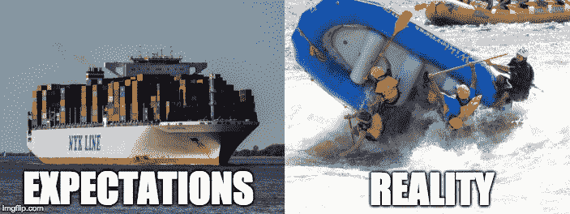
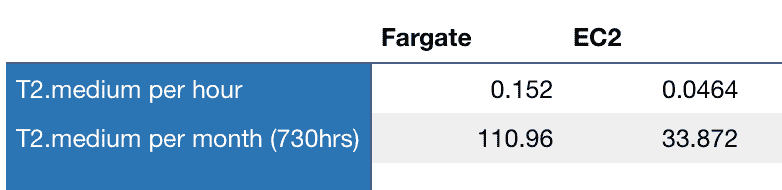

# Amazon Fargate 简介:它是什么，为什么它很棒(或者不好)，以及何时使用它。

> 原文：<https://www.freecodecamp.org/news/amazon-fargate-goodbye-infrastructure-3b66c7e3e413/>

当亚马逊[在 2017 年末的 AWS re:Invent 上宣布](https://www.youtube.com/watch?v=8i82i9QYUGs) Fargate(和 EKS 一起)时，它真的不为人知。我当时关注的博客或有影响力的人没有一个真正谈论过这个话题，除了大致如下:

> 哦，对了，还有一个新东西，它将允许 ECS 用户直接在云中运行容器。

作为一名开发人员，这真让我大吃一惊。让我们来看看为什么。

### 生产力的繁荣

我觉得在软件开发世界中已经有五次大的变革，极大地提高了开发人员的生产力和以最高效率编写和部署产品级应用程序的能力。

他们也都解决了重大问题。以下是我对革命及其解决的问题的分类:

*   云服务(IaaS)的出现
    **基础设施成本和可扩展性**
*   开源社区、会议、研讨会、技术博客、堆栈溢出等等
    **限制获取知识**
*   版本控制系统、协作工具、持续集成工具
    **并行工程系统差异和集成地狱**
*   容器化架构
    **在不一致的环境中构建应用程序的困难**
*   无服务器计算服务
    **服务器和系统管理**

每一次革命都有一个共同的特点:他们都给予软件工程师更多的 T2 控制权。他们通过鼓励良好实践和协作工作流代码共享来实现这一目标，并降低了对昂贵的专用服务器、系统管理员、开发运维、IT 支持等的需求。

很好，但是等等——Fargate 在这一切中处于什么位置？

### 你的船才是问题所在

Life jacket is advised

当 Docker 将容器带给大众时，它很快成为开发中的新标准并被广泛采用。

不久之后，随着 Kubernetes 的成功，AWS 推出了他们自己的(更基本的)容器管理服务:亚马逊弹性容器服务(ECS)。它引入了任务的概念。

任务可以是一起工作的容器的任何实例。从运行 web 服务器、几个微服务、一个数据库和一个反向代理的 web 应用程序，到定期运行的 shell 脚本批处理列表。

作为 ECS 的早期采用者，我真的很喜欢它，有一段时间它工作得非常好。但是最终，不得不管理这些**额外的层**(任务和容器)而不仅仅是 EC2 实例变得越来越复杂。

我也对它的安全性感到不舒服。你的筹码数量越多，你就越需要保持警惕。这些层中的每一层都带来了更多的复杂性，并增加了安全错误配置和漏洞的可能性。

事实上，有了 ECS，您的容器运行在集群中的 **EC2 容器实例中，您将为其配置自动伸缩。每个实例可以承载多个不同的任务。每个任务可以运行多个容器。**

因为您的任务将随机(默认)部署在具有可用资源的同类 **EC2 实例上，所以您面临以下问题:**

*   一个集群遵循相同的自动扩展规则，并自动提供相同种类的 EC2 实例。
*   一些容器将需要完全不同的资源，但仍然必须一起工作。
*   有些容器不一定遵循相同的自动缩放规则。
*   有时候，同一个任务中的几个容器需要它们自己的负载平衡器，而让多个负载平衡器用于同一个任务是不可能的。

面对这些问题时，首选的解决方法是:

*   根据需要用不同的资源手动部署一些实例
*   将这些实例附加到集群
*   按任务运行一个容器
*   将您的 EC2 实例手动链接在一起
*   在 ECS 上编写复杂的策略放置约束，以确保正确的任务在正确的机器上，该机器根据它所做的事情拥有适当的资源

那是一个**很多**的工作，相当**繁琐**，而且**难以维护。**这有点违背了使用容器的初衷。

总得有人想出一个更好的主意。

### 让他们漂浮

事实证明，AWS 团队也有同样的问题。他们在过去的一年里一直在思考这个问题，并致力于解决以下问题:

> 我们如何运行容器而不必担心服务器和集群？

**这就是 AWS Fargate 的意义**。它完全抽象了底层基础设施，您可以将每个容器视为一台机器。

您只需指定每个容器需要什么资源，它就会为您完成繁重的工作。您不必再管理多层访问规则。您可以像在单个 EC2 实例之间一样微调容器之间的权限。

containers on Fargate (artist rendering)

就像你的集装箱变成了有自己的帆、舵和船员的船，能够自己漂浮到目的地。

### 容器即服务(CaaS)

实际上，我相信**容器即服务(CaaS)是开发者们期待多年的真正的 PaaS** 。它允许开发人员直接在云中部署他们的容器，而不必担心中间的一切。

当然，已经有很多技术可以让你在云上无缝运行代码，而不必担心规模或服务器管理(比如令人惊叹的 **Heroku** 、 **Lambda、**甚至以自己的方式**谷歌应用引擎】**)。但是都有局限性。

*   你必须在失去一点灵活性
*   你必须坚持支持的语言
*   您不能使用受支持的语言，因为您的项目需要一个仅在非常特定的系统上可用的本地低级库
*   你的项目使用了一种尖端技术，但在未来几年内大众都无法使用
*   其中一些平台非常(非常)昂贵，尤其是在纵向扩展时

**Fargate(或 CaaS)** 带给你两全其美的体验。

**容器化架构**为您带来所需的灵活性和控制力。它允许你使用**的任何技术**运行在**的任何** **系统**中。容器方面将确保您在每台主机上都有相同的行为，无论是开发、测试、试运行还是生产环境。

我发现这一点对许多科技初创公司来说至关重要。事实上，有时你的竞争优势之一是使用你参与开发的最先进的技术，或者在一个全新的、革命性的环境中聪明地重用另一种技术。

**无服务器部署**让您专注于编写优秀的代码。无需资源调配，易于扩展。

### 限制

#### CaaS vs PaaS

的确，你正在放弃真实 PaaS 的一些很酷的方面。是的，你仍然需要**手动更新**你的容器的图像，有时你还需要编写自己的 Docker 图像。如果你不知道**系统管理**的基础知识，这可能会是一场斗争。

但是，这也意味着你可以做你能想到的几乎任何事情，并且在你想要使用的系统、语言、工具、库和版本方面拥有完全的**灵活性和自由度**。

#### 费用

让我们面对现实吧，云服务(IaaS)比拥有自己的基础设施**更贵**(如果你可以按需扩展的话)。出于同样的原因，不必配置、管理和扩展您的服务器也是有成本的。对于一些最简单的用例来说，这可能不是最好的解决方案。

让我们希望他们会致力于降低成本。尽管产品很好，但很难证明一个随需应变的等价 EC2 实例(例如 t2.medium)的价格是其 4 倍[。](https://aws.amazon.com/fargate/pricing/)

Comparison Fargate and EC2 prices in USD

### 我应该把我所有的 ECS 任务切换到 Fargate 吗？

还没有。如上所述，在某些情况下，你的成本会增加三倍以上。在他们降低成本之前，你最好使用标准 EC2 实例。

然而，Fargate 在以下使用案例中可能对您更有利:

*   如果您在有效地自动扩展 ECS 任务方面有困难，并且经常以大量未使用的 **CPU 或内存**而告终。使用 Fargate，您**只需为您在任务**中定义的资源付费。
*   您的任务将按需运行**或按计划运行**，并且不需要专用的 EC2 实例。有了 Fargate，你**只在你的任务运行时付费。**
*   对于具有**峰值内存和/或 CPU 使用量**的任务。因为它将节省您配置和管理此类案例的时间和麻烦。

### 奖金

对于那些更喜欢 Kubernetes(T1)而不是 T2 ECS(T3)的人来说，Fargate 很快就能为 Kubernetes(T5)运营 T4 弹性集装箱服务。