# 关于设计，勒内·笛卡尔能教给你什么

> 原文：<https://www.freecodecamp.org/news/what-rene-descartes-can-teach-you-about-design-e0eace2ca268/>

作者维沙尔·库马尔

# 关于设计，勒内·笛卡尔能教给你什么

#### 接着[古代数学如何丰富你的设计技能](https://medium.freecodecamp.org/using-ancient-mathematics-to-enrich-your-design-skills-ac360a83d297)

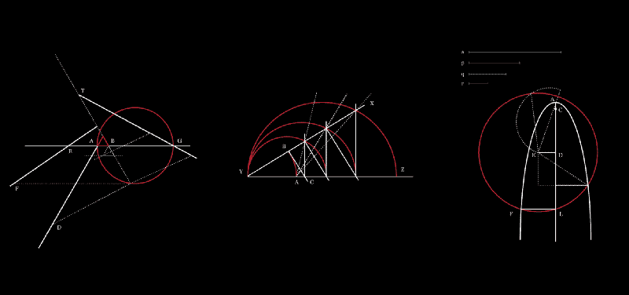

[vishalkumar.london](https://www.instagram.com/vishalkumar.london/)

> 我思故我在。

这是整个欧洲哲学中最流行的短语之一。它指的是人的意识、认知、生活。

那是一点简单的知识。但是你可能会想，“这个短语和**设计、**有什么关系，我为什么要关心这个？”

与其说是这句话，不如说是背后的人。

在这篇文章中，我将通过几个数学和编码示例来挖掘[勒内·笛卡尔](https://en.wikipedia.org/wiki/Ren%C3%A9_Descartes)***(技术上来说，[解析几何](https://en.wikipedia.org/wiki/Analytic_geometry))的知识，以解释他的见解为什么以及如何对现代设计重要。***

***当你向下滚动时，我希望我的发现能帮助你从不同的角度思考设计！***

### ***谁是勒内·笛卡尔？***

***著名的法国哲学家和数学家，推广了短语“*我思故我在”，*在他 1637 年出版的有影响力的书*关于方法的论述*中恰当地将这一思想正式化。***

***笛卡尔是一个激烈的理性主义者。他只相信人类的头脑和智力能够实现理性和逻辑。***

***然而大多数人并没有意识到，为了推理，笛卡尔会**频繁查阅古希腊关于几何证明的条约**由[欧几里得](https://en.wikipedia.org/wiki/Euclid)(公元前 325 年)和[阿基米德](https://en.wikipedia.org/wiki/Archimedes)(公元前 225 年)完成。***

***同样不太为人所知的是，笛卡尔不仅是一名哲学家，还是代数几何的创始人之一。他创造了数学语言，将几何转化为代数，反之亦然。***

***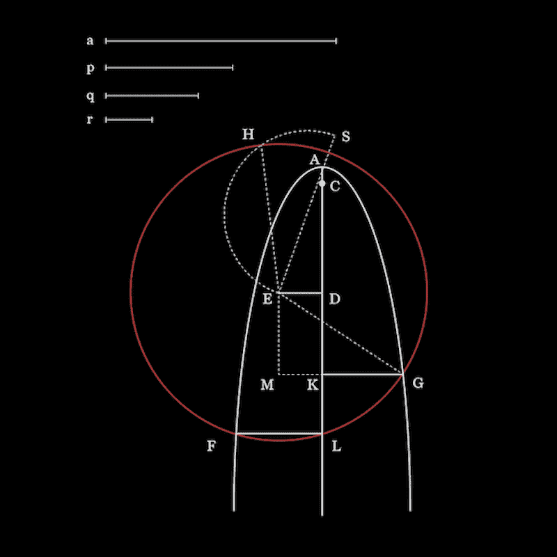

1 [vishalkumar.london](https://www.instagram.com/vishalkumar.london/) — adapted from page 206, Book 3 of La Geometrie, René Descartes*** 

### ***地理(一点上下文)***

> ***“精确科学的进步中有史以来最伟大的一步”***

***笛卡尔推崇纯几何作为逻辑和归纳的练习，但对古希腊的几何证明感到失望。随着 16 世纪来自伊斯兰世界的代数的复兴，笛卡尔试图找到一种新的语言来表达代数和几何之间的关系。***

***在 1619 年 3 月 26 日写给荷兰哲学家艾萨克·比克曼的一封著名的信中，笛卡尔宣布了他推进“全新科学”的计划。***

***作为 1637 年关于方法、[、*、几何*、*、*的*论述的附录出版的是笛卡尔的新科学。哲学家约翰·斯图亚特·米尔把它描述为:*](http://djm.cc/library/Geometry_of_Rene_Descartes_rev2.pdf)***

> ***“精确科学的进步中有史以来最伟大的一步”***

***这是 20 世纪最有影响力的哲学家之一的一个相当大的声明！***

***米尔没有被自己的判断误导。真的，《几何》是真正的革命。笛卡尔的见解为我们今天用来完成基本数学任务和计算的知识奠定了基础。观看萨尔·卡恩的精彩视频，了解更多信息。***

***笛卡尔的思想如此有影响力，以至于“笛卡尔”一词以他的名字命名——笛卡尔坐标、笛卡尔方程等等。***

***此外，他在《几何》中发明的句法被莱布尼茨复制，并在 17 世纪被牛顿采用，当时他们两人继续创建微积分。***

***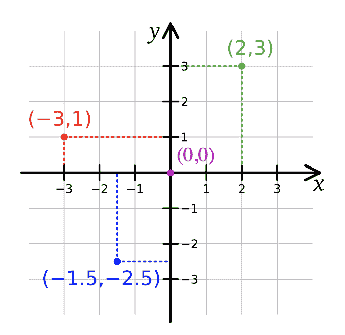

Cartesian coordinate plane — [wikipedia](https://en.wikipedia.org/wiki/Cartesian_coordinate_system)*** 

### ***为什么几何对现代设计很重要？***

***好吧，我希望我已经让你相信笛卡尔的观点过去和现在都很重要。现在，让我们来看看这些想法在设计中的应用。***

***在你设计任何东西之前，你应该从概念上思考、理解和想象这个设计在数学和几何学上是如何可行的。***

***当然，还有[许多设计决策需要做出](https://medium.com/google-design/the-meaning-of-design-44f1a82129a8)——颜色、深度、用户体验……不胜枚举。但是，任何设计的核心都始于几何、形状和形式...即使是便利贴上的小涂鸦。***

***人类往往对几何和形状有相当直观的理解。例如，你知道在下图中有一个圆，一个小的等边三角形和四条实线。***

***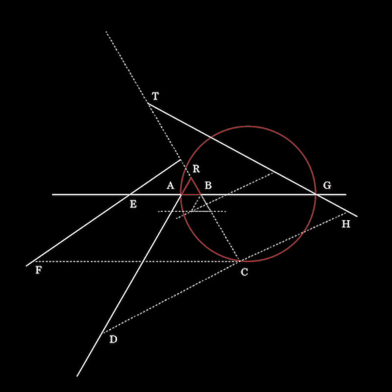

2 [vishalkumar.london](https://www.instagram.com/vishalkumar.london/) — adapted from page 61, Book 2 of La Geometrie, René Descartes*** 

***笛卡尔的洞察力来自于试图用代数来表达那些形状。***

***他的方法是这样的:首先，他给每个点一个字母——A，B，C，D，E，等等。***

***然后，他用直线或曲线连接每个点——例如，从 C 到 B 的直线表示为 CB。然后，他将另一个字母 *y* 赋给那一行。比如 CB = *y* 。***

***这些记数方法使他能够用直尺和圆规描绘出线段长度与数字的关系。这意味着他能够用代表形状的尺寸和比例来创建一个代数方程。***

***一旦你知道一个形状(或一系列形状)是如何用代数方程来表达的，你就可以通过用计算机对形状进行编码(你也可以用手来画)来将方程转换到坐标平面上。***

***Tyler Neylon 的[精彩文章](https://medium.com/@tylerneylon/how-to-write-mathematics-on-medium-f89aa45c42a0)解释了他如何使用方程和函数，然后使用 JavaScript 创建下面的 GIF。完整的代码是[这里](https://gist.github.com/tylerneylon/4d58806a2a00d6073733)。***

***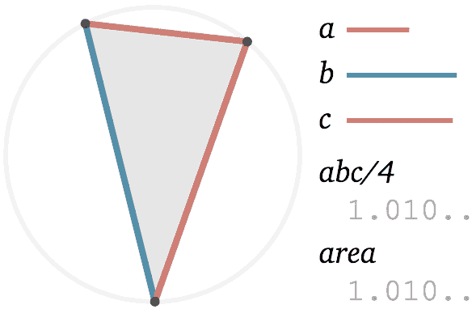

Taken from Tyler Neylon’s Medium post, [How to Write Mathematics on Medium](https://medium.com/@tylerneylon/how-to-write-mathematics-on-medium-f89aa45c42a0)*** 

### ***中胚层***

***让我们进一步探索笛卡尔的见解。***

****中盘*是笛卡尔用来寻找两条给定直线之间的两个平均比例的罗盘(下面的 **YX** 和 **YZ** )，这是解决立方体复制问题所需要的。***

***按照下面的步骤，看看笛卡尔是如何不用任何数字来创建虚线方程的。***

***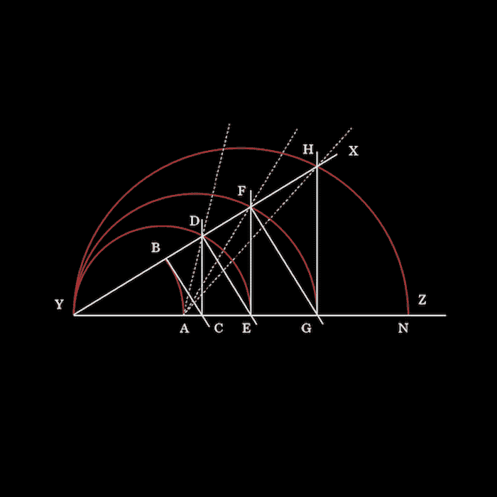******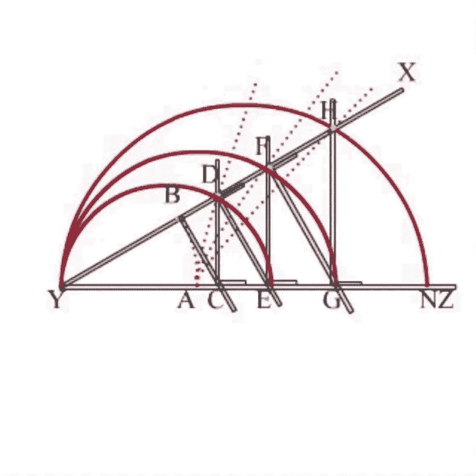

3 [vishalkumar.london](https://www.instagram.com/vishalkumar.london/) and a GIF of the mesolabe taken from [Gridmath’s video on YouTube](https://www.youtube.com/watch?v=jhwRBoOK40E&feature=youtu.be&t=3m20s)*** 

***为了描述虚线 **AD，**笛卡尔使用了以下术语:***

*****雅** = **YB** = *甲*；**YC**=*x*；**CD**=*y*； **YD** = *z* 。***

***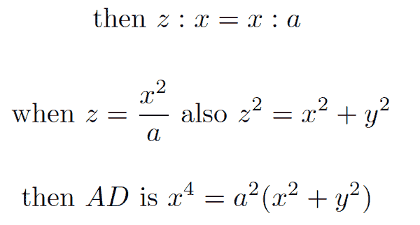***

***使用类似的逻辑，笛卡尔为 **AF** 和 **AH** 得出下面的等式。***

***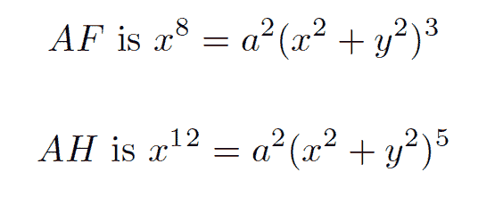***

***如果你对上面的代数和方程背后的计算感兴趣，特别是 **AF** 和 **AH** ，我建议在 3m20s 观看 Gridmath 的[视频以了解更多信息。](https://youtu.be/jhwRBoOK40E?t=3m20s)***

### ***关于曲线的性质***

***在《几何》一书中，笛卡尔对如何用曲线来解决难题进行了透彻的讨论:***

> ***“我们应该总是小心地选择可以用来解决问题的最简单的曲线”***

***事实上，*中胚层*是用来解决著名的希腊[帕普斯问题](http://www.oxfordscholarship.com/view/10.1093/acprof:oso/9780198242505.001.0001/acprof-9780198242505-chapter-2)的工具。简而言之，任务是识别一条曲线，使得曲线上的所有点满足与给定比率的特定关系。***

***在下面的图片中，我们看到笛卡尔的“几何演算”的形成。特别是下图，被称为笛卡尔的**叶子**(【叶子】)**，**促成了微积分的[起源](https://en.wikipedia.org/wiki/Folium_of_Descartes)。它有一个等式:***

***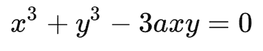******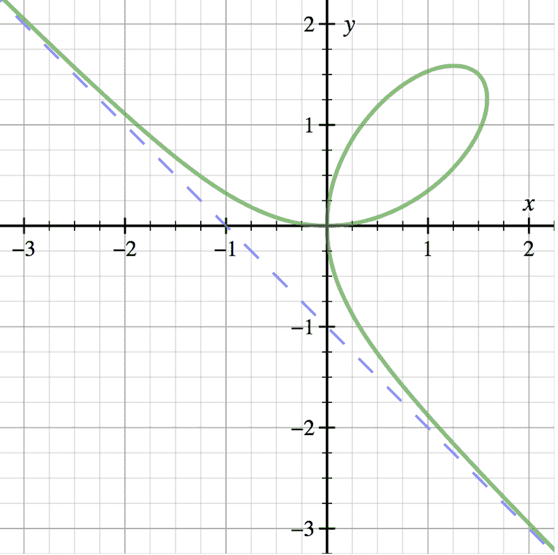******

Folium of Descartes (left) taken from [wikipedia](https://en.wikipedia.org/wiki/Folium_of_Descartes) and and an artwork of Folium of Descartes I created using an algorithm in p5js adopting [code from Fer](https://www.openprocessing.org/user/74658)*** 

***曲线，以及由此而来的几何学，可以用来**解决当今**许多极其困难的**设计问题。*****

***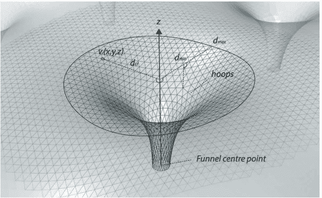

Foster and Partners design of Mexico City’s airport through geometric computation — [read the paper here](http://papers.cumincad.org/data/works/att/acadia17_620.pdf).*** 

***福斯特建筑事务所利用**的几何计算和模拟**来[设计墨西哥城的新机场](http://papers.cumincad.org/data/works/att/acadia17_620.pdf)。而且，椭圆曲线的代数结构正被用于**设计尖端密码学**，[椭圆曲线密码学](https://en.wikipedia.org/wiki/Elliptic-curve_cryptography) ( [Keeley Erhardt](https://www.freecodecamp.org/news/what-rene-descartes-can-teach-you-about-design-e0eace2ca268/undefined) ，感谢有识之士！)***

### ***结论***

***当笛卡尔试图设计整个宇宙的哲学概念时，他会参考古代的几何证明来推理。正如我在这篇文章中所展示的，他使用代数作为工具来解释几何，这有助于他理解自然世界中的现象。***

***我想强调本文中的两个要点:***

1.  ***形状和形式可以用代数和方程在坐标平面上表达，这对设计很重要。***
2.  ***理解代数几何很重要，因为当通过计算或算法进行设计时，你需要理解如何使用代数几何移动屏幕上的像素。***

***我再怎么强调理解一个给定知识子集的潜在理论的重要性也不为过。古老的数学理论让我能够在更深的层次上探索和理解设计——我希望这对你也一样。***

***感谢您的阅读！***

#### ***在你离开之前…***

***如果您觉得这篇文章很有帮助，请按住？按钮，在脸书、推特或 LinkedIn 上分享这篇文章，这样每个人都能从中受益。***

***在 Instagram 、[脸书](https://www.facebook.com/vishalkumar.london/)或他的[网站](https://vishalkumar.london/)上看到更多 Vishal 的作品。***

***好奇心是你最大的礼物。培养好奇心，永远保持好奇心"卡里姆·丹尼斯，2018 年 2 月 27 日***