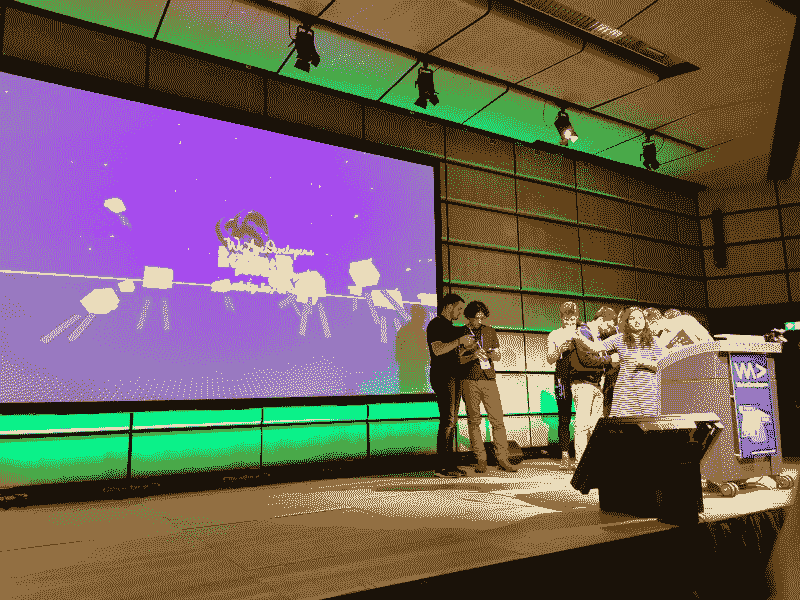
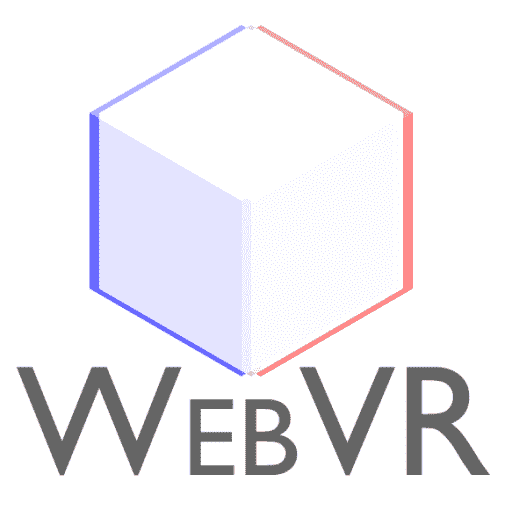
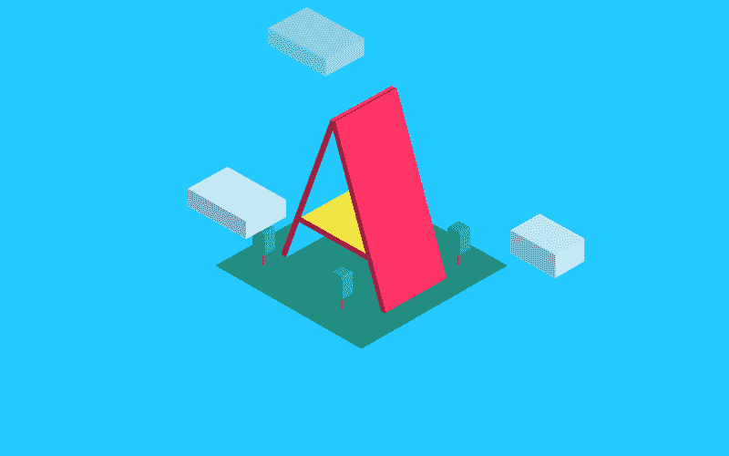
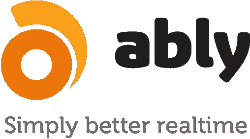
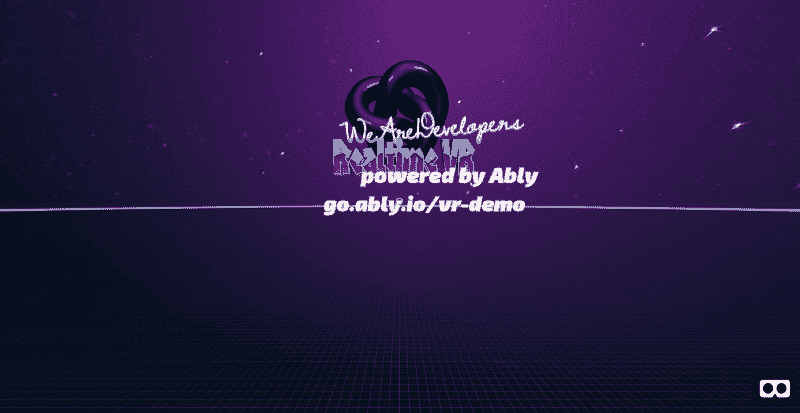

# 如何构建多人 VR web app

> 原文：<https://www.freecodecamp.org/news/how-to-build-a-multiplayer-vr-web-app-7b989964fb38/>

Srushtika Neelakantam

# 如何构建多人 VR web app

在本文中，我们将了解三个伟大的框架/库，它们允许任何 web 开发人员在几分钟内构建一个可在任何设备上工作的 VR 应用程序。它还允许来自世界各地的同行进行网络实时交互。

虚拟现实(VR)已经到了一个不需要任何介绍的惊人水平。然而，从开发者的角度来看，构建简单的 VR 应用程序似乎仍然是一项复杂的任务，更不用说联网的多人游戏了。

### 我们将建造什么？

Picture taken at [WeAreDevelopers World Congress](https://www.wearedevelopers.com/congress/) by [Martin Splitt](https://twitter.com/g33konaut/status/996753762172760065)

本教程结束时，你将拥有一个类似于上图所示的 VR 应用程序。它将有一个基本的虚拟现实场景，多个用户可以从他们的手机连接到你的应用程序，只需在他们的手机浏览器上点击一个网址。

不知道或不理解我刚才使用的许多术语？不要担心，我们很快就会看到所有的内容，很快就会明白了！

基本上，对于每个加入你的应用程序的用户，一个新的化身将出现在你的虚拟现实场景中(注意:我只是用一个奇特的术语“化身”来形容那组几乎不像真人的盒子:P)。这些化身将根据现实生活中用户手机的移动实时旋转/移动。

这款应用是我在 2018 年 [WeAreDevelopers](https://www.wearedevelopers.com/congress/) 世界大会上演讲时演示的。你可以看看下面的幻灯片。

### 跳到现场演示

完整的项目托管在 [Glitch](http://glitch.com) 上——我认为这是托管您的社区项目或演示的最简单的方式。它还允许多个开发人员就一个项目进行远程协作。你应该去看看。

[**现场演示**](http://go.ably.io/vr-demo) 说明:

*   在电脑/手机的浏览器窗口中打开链接。
*   在另一个浏览器窗口/手机中打开应用程序的另一个实例。

您可以在其他实例中看到这些实例的化身。试着在空中移动手机，你会看到在电脑浏览器上看到的相应头像也在移动。如果你有两个 VR 头戴设备(甚至纸板都可以)，你和一个朋友可以戴上它们，看到对方的头像在场景中移动，就像你在现实生活中移动头部一样。

玩一会儿或者继续读下去，了解正在发生什么以及如何发生。您还可以查看托管在 GitHub 上的完整代码。请务必阅读自述文件:

**在 GitHub 上跳转到完整的[源代码](https://github.com/ably/tutorials/tree/ably-multiplayer-vr-tutorial)。**

### 我们将使用什么？

如前所述，我们的目标是直接在浏览器中访问 VR，而不需要下载任何东西。为了达到这个目的，我们将使用 [WebVR](https://webvr.info/) 库。

WebVR 是一个 web 框架，它允许我们构建可以在 web 上直接访问的 VR 应用程序。这完全消除了繁重的下载和安装，并使 VR 应用程序独立于设备。

[WebVR](http://webvr.info) Logo

然而，即使 WebVR 让我们能够利用网络的许多优势，它仍然需要大量复杂的工作。事实上，这可能需要 WebGL 和其他库的知识，以便能够构建流畅的体验。

#### a 形框架

这又一次成为了 web 开发人员构建最终将在 web 上提供的东西的瓶颈。因此，Mozilla 的虚拟现实团队在 WebVR 的基础上构建了一个名为 [A-Frame](http://aframe.io) 的框架。

A-Frame 完全消除了 WebVR 的样板代码，允许开发者使用简单的 HTML 自定义标签来构建 VR 应用。当然，JavaScript 一如既往地让各种零碎的东西一起工作。

[A-Frame](http://aframe.io) VR logo

#### 巧妙地

此外，我们将使用 [Ably Realtime](http://ably.io) 来实现应用程序中所有的实时和多人功能。Ably 是一个实时数据交付平台，通过提供开箱即用的[发布/订阅](https://www.ably.io/documentation/realtime/channels-messages)和[在线状态](https://www.ably.io/documentation/realtime/presence)等功能来解决实时消息交付问题。

[Ably Realtime](http://ably.io) logo

**注意**:一个 Ably free 帐户(在现场演示中使用)的限制允许您在任何时候最多运行两个应用程序实例。如果你希望有更多的实例运行，看看 Ably [自助服务包](https://www.ably.io/pricing/self-service)并相应地购买更多的消息。

#### 小故障

正如你现在所知道的，每个网络虚拟现实应用程序都可以通过浏览器访问。这意味着我们需要托管我们的文件，以便能够使用 URL 在移动设备上访问它们。

Glitch 是一种非常方便的方法。您可以简单地创建一个新项目。完成后，任何平台或设备都可以立即使用 URL。

### 身份验证和分配唯一 id

重要的事情先来。我们需要设置一个认证服务器来验证我们用户的凭证，并对他们进行有效的认证，同时给每个用户分配一个随机的`clientId`。这个`clientId`将作为一种方式来分别识别这些化身中的每一个，并处理信息，例如它们各自的位置更新，以及随着用户登录/注销而出现/消失。我们将为此设置一个简单的[快速服务器](https://expressjs.com/)，如下所示:

如果您仔细观察，这个 express 服务器为项目根目录中的文件提供服务。因此，确保您进一步构建的“index.html”文件与“auth-server”在同一个文件夹中。

如果您希望在本地提供这些文件，而不是在出现故障时，用以下代码替换`listener`变量的代码:

因为这只是一个教程，所以在对客户端进行身份验证之前，我们实际上并不检查任何凭证。理想情况下，认证服务器应该有一个验证步骤。

项目结构很简单，以下文件都在同一个父文件夹中:

*   auth_server.js
*   index.html
*   主页. js

### 入门指南

让我们从构建应用程序的基本 VR 设置开始。我们将使用 A-Frame 的[实体-组件-系统](https://aframe.io/docs/0.7.0/introduction/entity-component-system.html) (ECS)。ECS 使得在场景中构建任何对象变得容易。每个对象都被视为一个实体，通过附加到它的各种组件(或属性)来区别于其他实体。

在 HTML 文件中，首先添加 HTML 框架代码:

参考资料分别指以下内容:

1.  Ably 的 JS [客户端库](https://www.ably.io/download)
2.  JQuery [框架](https://code.jquery.com/)
3.  a 型框架的 [JS 构建](https://aframe.io/docs/0.8.0/introduction/installation.html)
4.  本地 JS 文件(“main.js”)，我们将在其中添加应用程序的逻辑
5.  A-frame 的[社区贡献了](https://aframe.io/aframe-registry/)文本组件，方便地将风格化的文本添加到我们的 VR 场景中。

我们希望包含在 VR 场景中的所有对象都必须在 HTML 文件的`a-scene`标签中，如上图所示(双关语)！这类似于常规 HTML 文档中的`body`标签。

接下来，我们将在`a-assets`标签中添加我们希望使用的所有资产。将所有资源添加到此标签下，可以确保在应用程序出现之前预加载所有资源。这防止了由于部分资源加载缓慢而导致的糟糕的第一印象。

请随意使用您自己的资源，给应用程序一个定制的感觉！您可以看到，我们在上面的代码片段中添加了两个新标签，让我们深入研究一下:

`a-asset-item` —调用三个. js 文件加载器。您可以使用它来加载所有文件类型。

`a-mixin` —是一个非常有用的标签，通过让您指定一组要应用到单个实体的属性(组件)，允许代码重用。我们将会看到，你可以给它一个`id`并多次引用它。我们将有三个混合，每一个都指定了我们想要创建的化身的某些属性——眼睛、瞳孔和手臂。

现在，让我们在我们的 VR 场景中添加所有的静态视觉元素。

如您所见，我们已经使用 ECS 实现了完整的应用程序。但是，这不是将对象添加到场景中的唯一方法。A-Frame 附带了一些自定义实体，如长方体、球体等。这些自定义实体被称为[原语](https://aframe.io/docs/0.7.0/introduction/html-and-primitives.html#primitives)。

代码包含非常容易理解的注释，解释每个实体组件集试图在我们的应用程序中实现什么。

对于虚拟现实新手来说，**这里有一个有趣的事情**——天空就像是覆盖在你 360 度球体上的一层，当你体验虚拟现实应用时，你假设自己站在里面。它通常类似于现实生活中的天空，可以在顶部看到，似乎在地平线附近下降。我们在 A 帧中使用`a-sky`来添加天空，所使用的资源可以是 360 度的图像或纯色。

接下来是另一个有趣的部分。我们需要一个**相机**实体。这是由 A-Frame 提供的特殊实体。当你在浏览器中使用 A-Frame 驱动的 VR 应用程序时，它会捕捉你的手机不断变化的位置和旋转值。该实体利用手机中的各种陀螺仪传感器来实现这一功能。在计算机中，摄像机实体跟随 [WASD](https://aframe.io/docs/0.8.0/components/wasd-controls.html#sidebar) 控制来捕捉位置和旋转。

下面是我们如何添加一个相机实体。我们可以有选择地给它一个形状和动画，通过充当光标来帮助我们跟踪它的运动。

在本节结束时，你的虚拟现实应用程序应该看起来像下面这样。当然，前提是您没有将资源与您的自定义资源进行交换！

First Look

瞧啊。我们刚刚完成了基本的虚拟现实场景。

现在是时候给它添加一些功能了——当用户登录和退出你的应用程序时，让头像实时出现、消失和移动，或者只是移动他们的手机。

### 添加实时功能

是时候在我们的虚拟现实场景中加入一些魔法了。巧妙地使用，这是很容易实现的。我们将使用 [Pub/Sub](https://www.ably.io/documentation/realtime/channels-messages) 和 [Presence](https://www.ably.io/documentation/realtime/channels-messages) ，它们都是 Ably 提供的直接使用的开箱即用特性。

首先将你的客户/用户连接到 Ably。由于我们使用的是[令牌认证](https://www.ably.io/documentation/realtime/channels-messages)，我们将简单地添加一个到认证服务器的路由，如下所示:

**注**:我们指定了`echoMessage: false`。这可以防止您的客户端订阅自己发布的消息，从而确保整个应用程序的消息数量/使用率更低。默认情况下，该选项始终为真。

在成功认证客户端之后，我们将把认证服务器返回的 id 存储在一个变量中，以便以后使用。

接下来，让我们设置初始化应用程序的第一个函数。在这个函数中，我们设置了化身的初始位置。为了简单起见，我们将把化身的旋转/移动限制在 x 轴上，同时保持其他两个平面上的坐标为零。x 轴上的初始位置是随机选择的，以便多个化身不会一出现就在场景中的同一点上混乱。我们还设置了一些初始属性，如颜色和尺寸。

为了巧妙地发送这些数据，我们需要创建一个通道。我把它叫做`vr-channel`。完成之后，我们可以在这个通道上发布初始属性。

但是，我们希望持续发布这些数据，以便所有其他用户能够实时接收。换句话说，我们希望在位置和旋转属性发生变化时发布数据。这个数据是由 A 帧中的相机实体直接交给我们的。我们只需要在同一个频道上以高频率发布这些数据。在这种情况下，我每 100 毫秒发布一次。

`a-box`是 A-Frame 中的一个[图元](https://aframe.io/docs/0.7.0/introduction/html-and-primitives.html#primitives)，可以方便地用来创建一个具有基本属性(如尺寸、位置、旋转、颜色等)的 3D 盒子。

您可以看到在上面的函数中有三个子函数我们还没有讨论过。[在线状态](https://www.ably.io/documentation/realtime/presence)是实时世界中的一个常用术语，它向您提供有关用户/设备在线或连接状态的信息。在我们的案例中，我们将:

*   仅当用户在线时(点击 URL ),创建并使化身出现在场景中
*   同样，当用户退出应用程序(关闭手机或浏览器上的浏览器窗口)时，让它消失。

此外，Ably 允许您订阅在线事件。每当新用户登录或现有用户注销时，都会触发回调。这正是我们对我们的应用程序的要求。

使用`channel.presence.get()`你可以得到一个所有成员的列表，这些成员目前都在线。

使用`channel.presence.subscribe('enter')`你可以在用户连接上(上线)时得到通知。

使用`channel.presence.subscribe('leave')`你可以在用户与 Ably 断开连接(离线)时得到通知。

一个用户上线，我们就需要给其他人订阅新用户头像的属性变化。正如你所观察到的，由于位置和旋转的变化，这些变化将出现在`attr`对象中。我们的目标是随着这些属性的更新来更新头像。

在此之前，我们需要确保虚拟角色确实存在，或者是否需要创建一个新的虚拟角色。为此，我们使用一个简单的头像地图，其中存储了所有现有头像的 id，如下所示:

接下来，我们需要让所有用户订阅除他们自己之外的其他人的属性变化。为此，我们让他们在发布特定事件的同一频道上订阅该事件，如下所示:

当一个新用户进入时，我们需要创建一个具有所有必要属性的新头像。下面的函数很好地获得了所有的初始属性。它使用这些属性创建一个新的化身，并相对于主框(代表化身的头部)的位置附加其他部分，如眼睛、瞳孔和手臂。使用 A 形框架附带的[视觉检查器](https://aframe.io/docs/0.7.0/introduction/visual-inspector-and-dev-tools.html)工具，这种手动定位变得更加容易。

在我们构建了一个化身的所有不同部分之后，我们通过将它们附加到一个根化身来将它们绑定在一起。这给了我们一种方法来执行像位置更新这样的动作。你不会想要一个僵尸般的情况，头朝一个方向移动，眼睛朝另一个方向移动，对吗？；)这也使得用户注销时删除整个头像变得容易。

如果一个角色已经存在，我们只需从各个用户的`attr`对象中不断更新的数据中更新它的位置和旋转。

向上滚动回到`subscribeToAvatarChanges()`功能。您将会看到,`updateAvatar()`是一个频道订阅的回调函数，当一个现有的虚拟角色的属性发生变化时，就会调用这个函数。这使得我们很容易根据变化的数据不断更新实际的头像。我们只需用新值更新位置和旋转，如下所示:

最后，我们需要确保每当用户注销/离线时，头像都从场景中移除。这可以通过处理前面提到的`leave`事件再次使用 presence 来完成。以下是用户注销时需要做的几件事:

我们首先删除数组中相应的条目，然后从场景中删除完整的化身。

### 就是这样！

我们现在已经成功地实现了一个多人虚拟现实应用程序，它可以在网络上实时运行。去和你的朋友一起测试吧，让他们见证这种神奇的力量！如果您一直在本地环境中工作，您可能需要一个本地服务器来托管您的文件，如上所述。我个人用 [Glitch](http://glitch.com) 做我所有的 VR 项目。

现在，您已经了解了 A-Frame 和 Ably 的基础知识，允许您构建 VR 应用程序和实时应用程序，或者更好的是协作应用程序，就像我们刚刚做的那样。

想法已经在你脑子里酝酿了？继续开发你一直想要的应用程序吧！这里是这个应用程序的完整源代码。如果你遇到困难或者想了解更多，请随时在[推特](https://twitter.com/Srushtika)上给我打电话。

[Srushtika Neelakantam](http://twitter.com/Srushtika) is a Dev Advocate for [Ably Realtime](http://ably.io). Photo Credits: Radka Klein