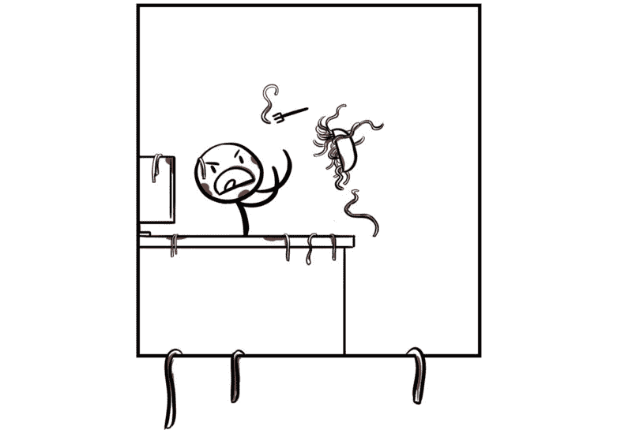
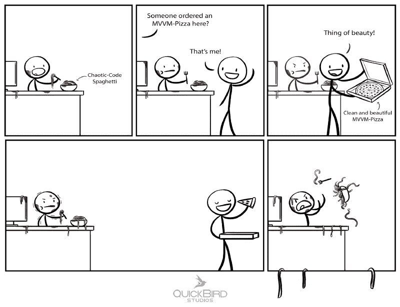
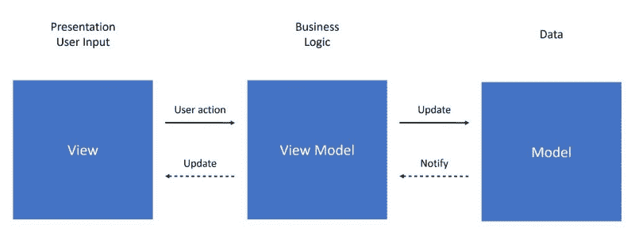
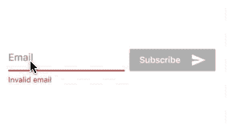

# 使用模型-视图-视图模型使你的代码在飞镖流中更整洁

> 原文：<https://www.freecodecamp.org/news/app-architecture-mvvm-in-flutter-using-dart-streams-26f6bd6ae4b6/>

快鸟工作室

# 使用模型-视图-视图模型使你的代码在飞镖流中更整洁

开发应用程序时的一个常见问题是，你最终会得到过于复杂的类。这些类包含视图逻辑和业务逻辑。这两者交织在一起，不可能独立测试它们。代码可读性受到影响，并且将来的代码更改很难实现。

因为在 Flutter 中对你的架构几乎没有限制，所以很容易遇到这个问题。一些开发人员将所有代码都写在小部件中，直到他们意识到自己造成的混乱。在其他项目中重用代码似乎是不可能的，最终，您将大部分代码编写了两次。模型-视图-视图模型(MVVM)试图通过分离业务逻辑和视图细节来解决这个问题。

在这篇文章中，我们向你展示了 MVVM 与颤振会是什么样子。我们将使用 Dart 的流 API 创建一个功能性反应视图模型。

### 模型-视图-视图模型

在我们看任何代码之前，我们应该对 MVVM 有一个基本的了解。如果你熟悉 MVVM，你可以跳过这一部分。

MVVM 背后的主要目标是将尽可能多的状态和逻辑从视图转移到一个独立的实体中。这个实体的名称是视图模型。视图模型还包含业务逻辑。它充当视图和模型之间的中介。

MVVM: Model-View-ViewModel

ViewModel 基本上有两个职责:

*   它对用户输入做出反应(例如，通过改变模型、发起网络请求或路由到不同的屏幕)
*   它提供视图可以订阅的输出数据

该视图不包含任何业务逻辑。这些是视图的责任:

*   它对视图模型的新输出状态做出反应，并相应地呈现它们(例如，通过在文本字段中显示字符串)
*   它告诉 ViewModel 新的用户输入(例如，按钮点击、文本更改、屏幕触摸)

与流行的 MVC 方法相比，片段/活动/ UIViewController 或小部件在 MVVM 中不包含业务逻辑。这是一个呈现视图模型输出状态的简单视图。视图模型不知道视图(不同于 MVP 和 MVC 的形式)。它提供了视图观察到的输出状态:

Input-Output interface of a ViewModel

### 动荡中的 MVVM

在 Flutter 中，这个小部件代表了 MVVM 的景色。业务逻辑位于单独的 ViewModel 类中。视图模型是完全独立于平台的。它不包含对 Flutter 的依赖，并且可以很容易地重用，例如在 web 项目中。

这是 MVVM 最大的权力之一。我们可以创建一个共享相同视图模型的移动应用程序和网站。你不需要重新发明和写两遍逻辑。

#### 示例:电子邮件订阅小部件

让我们看一个例子。我们将实现一个时事通讯注册表单，带有一个电子邮件文本框和一个提交按钮。该按钮被禁用，如果电子邮件无效，用户会看到一条错误消息:

#### 丑陋的方式

没有任何特定的架构，业务逻辑和当前状态都是小部件的一部分。它可能看起来像这样:

问题是视图逻辑、视图状态和业务逻辑混淆了。这导致了一些问题:

1.  单元测试很难
2.  其他 Dart 项目不能重用业务逻辑，因为它与依赖于 Flutter 的视图逻辑交织在一起
3.  这种风格很快就会变得混乱，最终会产生巨大的窗口小部件类

让我们看看如何改进这一点…

#### MVVM 的解决方案

如上所述，ViewModel 有输入和输出参数。为了清楚起见，我们将添加一个“**输入**或“**输出**前缀。

所有输入都是`Sinks`。视图可以使用它们将数据插入到视图模型中。所有输出都是`Streams`。视图可以通过订阅`Streams`来监听变化。我们的视图模型的界面如下所示:

我们使用一个`StreamController` 作为输入`Sink`。这个`StreamController`提供了一个流，我们可以在内部使用它来处理那些输入事件。

### 将视图绑定到视图模型

那么我们如何提供输入和处理输出事件呢？为了向视图模型提供输入值，我们将它们插入视图模型的`Sinks`。我们将把一个小部件绑定到视图模型。在这种情况下，每当文本字段的文本发生变化时，我们都会插入它。

您可以通过订阅 Output- **Streams** 来收听 ViewModel 输出。

Flutter 提供了一个名为`StreamBuilder`的非常酷的小部件，每当**流** 提供一个新值时，它就会更新。我们再也不会给`setState`打电话了！
**stream builder 的** `builder`方法在构建的时候给你一个快照。此快照包含有关流、其数据及其错误的信息。如果我们的流没有发出任何值，`snapshot.data`将为空。所以，要小心。

快速提示:在处理流时，尝试帮助 Dart 编译器。添加所有需要的泛型类型以避免运行时错误。

在这里你可以看到全貌:

如您所见，视图的唯一职责是呈现输出并向视图模型提供输入。因此，我们的小部件非常小巧，易于阅读。

### 结论

我们从本土世界的 MVVM 开始，想知道它是否也适用于 Flutter。在试用之后，我们可以说:MVVM 也非常适合 Flutter。

我们喜欢视图逻辑与业务逻辑分离得如此之好。我们喜欢对视图模型进行单元测试是多么容易。我们喜欢 Dart 视图模型如何与使用 Dart 的其他平台共享。

Stream-API 需要一些时间来适应，但之后感觉非常流畅。对于更复杂的任务，我们使用 RxDart。这为标准的 Stream-API 增加了功能。

如果你只是在黑一个小应用程序，那么正常的“把所有东西放在一个类中”的方法可能更简单。不过，如果你计划开发一个更大的应用程序，MVVM 可能是适合你的架构。

*最初发布于 2018 年 6 月 12 日[quickbirdstudios.com](https://quickbirdstudios.com/blog/mvvm-in-flutter/)。*