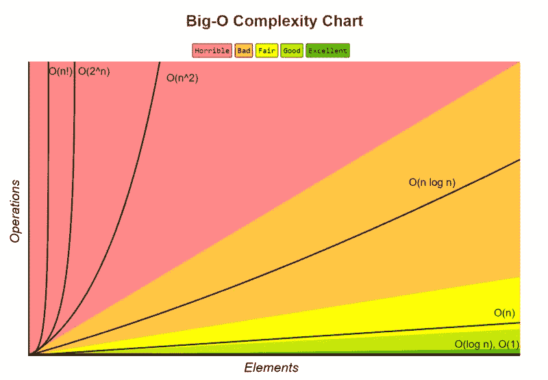
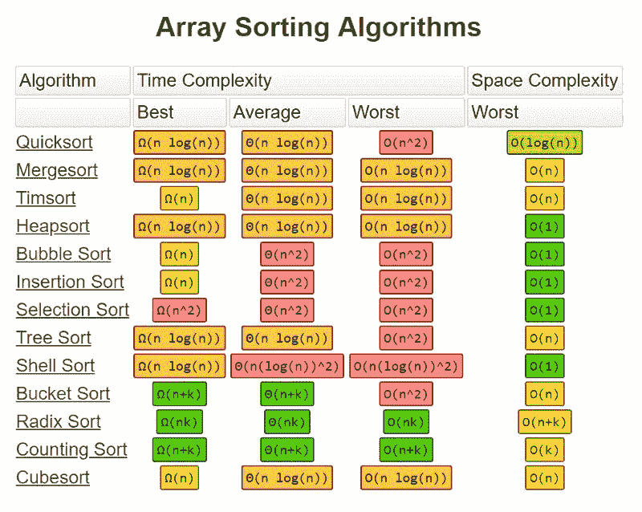

# 你所需要知道的关于“大 O 符号”的一切，将帮助你在下一次编程面试中取得成功

> 原文：<https://www.freecodecamp.org/news/all-you-need-to-know-about-big-o-notation-to-crack-your-next-coding-interview-9d575e7eec4/>

由保罗铁路

# 你所需要知道的关于“大 O 符号”的一切，将帮助你在下一次编程面试中取得成功

作为我的软件开发教育的一部分，我需要在各个领域积累技能，为我的第一个软件职位做好充分准备。任何有价值的软件教育项目都将包括相当一部分课程，为臭名昭著的编码面试做准备。

为此，在每一天的开始，**我都致力于解决算法，因为这是大多数编码面试的主要部分(对许多人来说也是最困难的部分)。**

我在研究计算机科学算法时遇到的一件事就是所谓的**“大 O 符号”**。

这是一个非常抽象和非常深奥的概念，绝大多数人都不会听说，或关心。但它被认为是**常见的编码面试问题**，因此它是我花了一些时间了解的事情之一。

### 你需要知道的是

#### 以下是我为了准备自己而吸收的内容

为了给“大 O”做好准备，我们首先需要承认**软件当然在很大程度上基于数据**。海量的数据。编码的目的就是利用这些数据。为了让程序利用数据，它通常需要从将数据按逻辑顺序排序开始。无论是按字母顺序、时间顺序、大小、日期等等。

分类不断发生，实际上**代表了所有计算机和互联网活动的很大一部分。**我听程序员说过“快速排序几乎是运行整个互联网的工具”。

他们这么说是什么意思？在计算机科学的研究中，很好地排序数据是它自己的整个子部分，并且有许多定义良好的排序算法。还有**快速排序、冒泡排序、选择排序、合并排序、堆排序**等等。每一种都有不同的方法来得到相同或相似的结果。

Source: [https://yourbasic.org/algorithms](https://yourbasic.org/algorithms)

#### 但是如果它们(几乎)都返回相同的结果，哪一个是最好的呢？

最好通常意味着哪一个最快。这就是“大 O”发挥作用的地方。

大 O 符号，有时也被称为“渐近分析”，主要是**查看一个排序算法需要多少次操作来完全排序一个非常大的数据集合。**这是对效率的一种衡量，也是您可以直接比较一种算法和另一种算法的方式。

当构建一个只有少量数据的简单应用程序时，这种分析是不必要的。但是，当处理非常大量的数据时，比如一个社交媒体网站或一个拥有许多客户和产品的大型电子商务网站，算法之间的微小差异可能会非常显著。

#### 大 O 符号对算法的效率进行排序

它对“ **O** ”和“ **n** ”，(例如:“*O(log n)”)*，其中

*   **O** 指函数的阶，或其增长率，而
*   **n** 是要排序的数组的长度。

让我们看一个例子。如果一个算法需要的运算次数公式为:

***f* (n) = 6n^4 - 2n^3 + 5**

随着“ **n** ”趋近于无穷大(对于非常大的数据集来说)，在出现的三项中， **6n^4** 是唯一重要的一项。因此，较小的术语**、2n^3** 和 **5** 实际上被省略了，因为它们无关紧要。实际上， **6n^4** 中的 **6** 也是如此。

**因此，该功能将具有订单增长率，或 O(n^4 的“大 o”评级。**

当查看许多最常用的排序算法时，****O(n log n)**的等级一般来说是可以达到的最佳等级。以这种速度运行的算法包括快速排序、堆排序和合并排序。**快速排序**是标准的，并且在几乎所有的软件语言中都是默认的。**

**

Source: [http://bigocheatsheet.com/](http://bigocheatsheet.com/)** 

**值得注意的是**没有一种算法在所有情况下都是最快的**，因为数据可以以各种状态输入到程序中。每种算法的方法都有最佳情况和最差情况，在这两种情况下，它们的性能是最好的还是最差的。**

**虽然快速排序是标准，但它也与合并排序和堆排序竞争，这是其他 O(n log n)级排序算法。有些情况下会用这些来代替。**

**快速排序最直接的竞争对手是**堆排序。**堆排序的运行时间也是 O(n log n)，但是堆排序的平均运行时间通常被认为比就地快速排序慢。**

**归并排序是一种**稳定排序**，这意味着它保留了输出中相等元素的输入顺序，不像标准的就地快速排序和堆排序。**

****以 O(n )** 运行冒泡/插入/选择排序，在处理真正的大数据时，就运算数量而言**可能比上面列出的以 O(n log n)运行的排序花费更长的时间**。但是根据数据的不同，可能会出现其他人更快的情况。**

**也有一些时候，非常简单的东西，比如计数排序，是很棒的，因为它写起来更快，更容易可视化和理解。**

**有时，您不仅需要考虑算法的时间需求，还需要考虑数据空间需求(甚至更多)。一些算法也以较小的存储空间运行。**

**

Source: [http://bigocheatsheet.com/](http://bigocheatsheet.com/)** 

### **你为什么需要知道这些？**

**所以在这一切之后，如果你总是求助于使用一种语言的内置排序算法，(这是基于快速排序)，那么为什么要关心排序算法和“大 O”呢？为什么公司会在面试中问你这个问题？**

**答案是学习大 O 符号让你掌握了代码中非常重要的效率概念。因此，当您处理庞大的数据集时，您会很好地意识到哪里的主要速度下降可能会导致瓶颈，以及哪里应该更加注意以获得最大的改进。这也叫敏感性分析，是解决问题和写出伟大软件的重要一环。**

**因此，如果你正在努力准备你的第一次面试，或者也许你在最后一次面试中挣扎，增加你的概念知识，如大 O 符号和其他计算机科学主题，将有助于你一臂之力。你会更好地展示你的潜力，给人留下深刻印象，从而得到那个职位。**