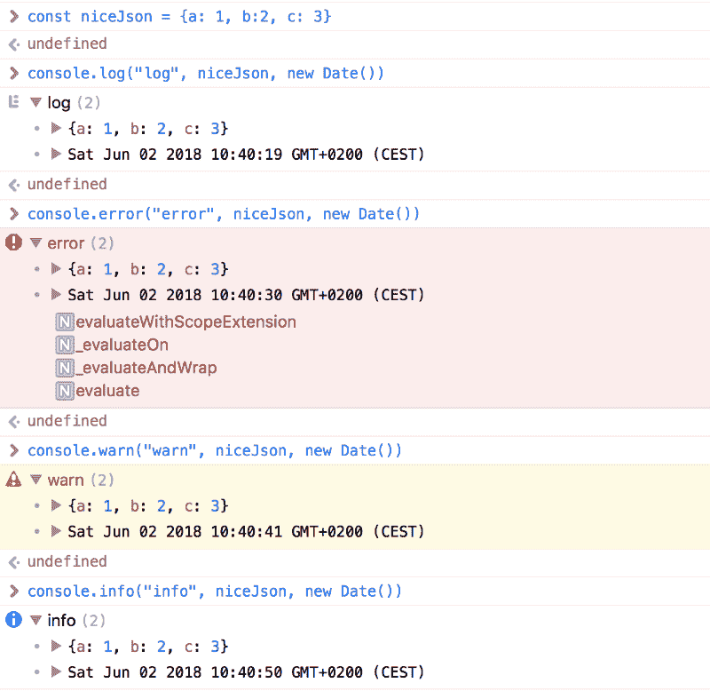
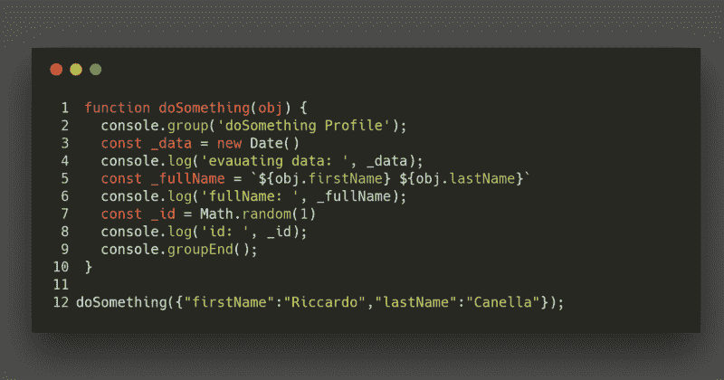
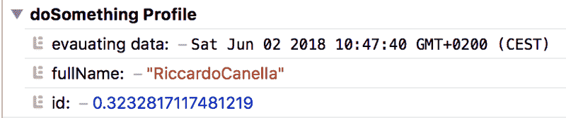
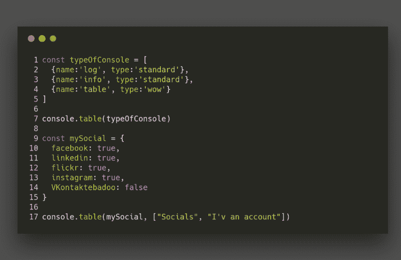
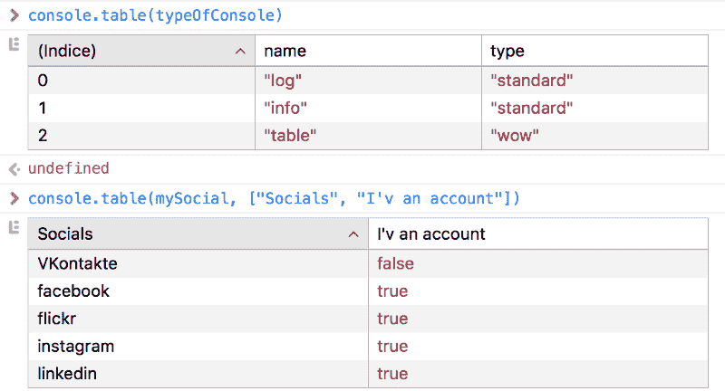
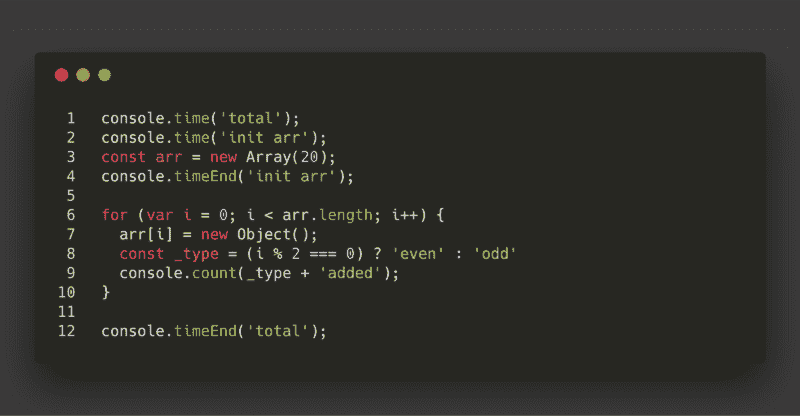
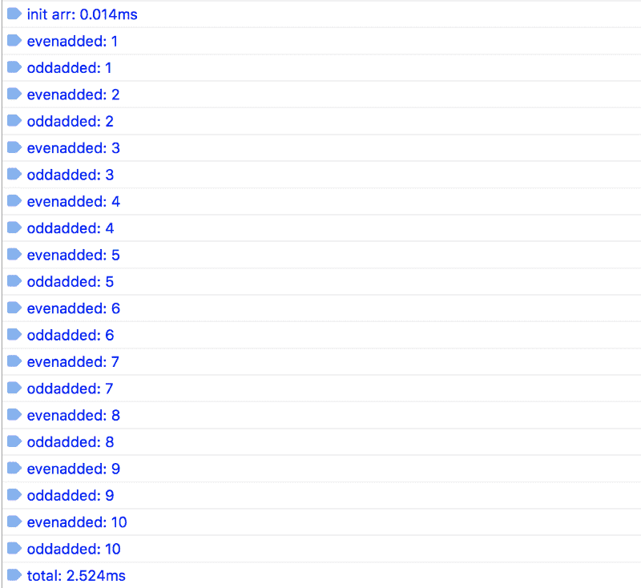
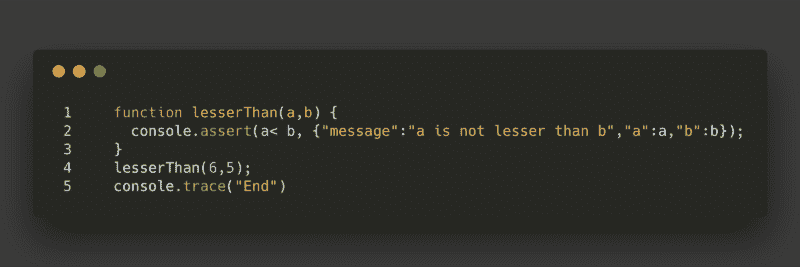
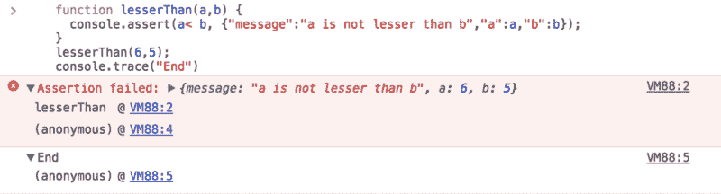

# 如何使用 JavaScript 控制台改进工作流程

> 原文：<https://www.freecodecamp.org/news/how-you-can-improve-your-workflow-using-the-javascript-console-bdd7823a9472/>

作者:里卡多·卡内拉

# 如何使用 JavaScript 控制台改进工作流程


作为一名 web 开发人员，您非常清楚调试代码的必要性。我们经常为日志使用外部库，在某些情况下格式化和/或显示它们，但是我们浏览器的控制台比我们想象的要强大得多。

当我们想到主机时，首先想到的是`console.log`，对吗？但是方法比我们想象的要多得多。现在我们将看到如何最大限度地利用控制台，我会给你一些提示，使这些方法更具可读性

### 控制台是什么？

JavaScript 控制台是现代浏览器中的一个内置特性，它在一个类似外壳的界面中提供了开箱即用的开发工具。它允许开发人员:

*   查看网页上出现的错误和警告的日志。
*   使用 JavaScript 命令与网页交互。
*   调试应用程序并直接在浏览器中遍历 DOM。
*   检查和分析网络活动

基本上，它使您能够在浏览器中编写、管理和监控 JavaScript。

#### Console.log、Console.error、Console.warn 和 Console.info

这些可能是最常用的方法。您可以向这些方法传递多个参数。每个参数都在一个由空格分隔的字符串中进行计算和连接，但是对于对象或数组，您可以在它们的属性之间导航。



#### 控制台.组

此方法允许您将一系列 console.logs(以及错误信息等)分组到一个可折叠的组下。语法非常简单:只需在一个`console.group()`前输入我们想要分组的所有`console.log`(或者如果我们想要默认关闭`console.groupCollapsed()`)。然后在末尾加一个`console.groupEnd()`关闭群。



Example of how to use the console.group

结果将如下所示:



#### 控制台.表格

自从我发现了`console.table`之后，我的生活就改变了。在一个`console.log`中显示 JSON 或非常大的 JSON 数组是一种可怕的体验。`console.table`允许我们在一个漂亮的表中可视化这些结构，在这个表中我们可以命名列并将它们作为参数传递。



Example of how to use the console.table

结果非常好，对调试非常有用:



#### Console.count、Console.time 和 Console.timeEnd

这三种方法是每个需要调试的开发者的瑞士军刀。`console.count`计算并输出`count()`在同一行和同一标签上被调用的次数。`console.time`使用作为输入参数指定的名称启动计时器，并且在给定页面上可以同时运行多达 10，000 个计时器。一旦启动，我们使用一个对`console.timeEnd`的调用来停止计时器，并将经过的时间打印到控制台。



Example of how to use the console.time and console.count

输出将如下所示:



#### 控制台. trace 和控制台. assert

这些方法只是从调用堆栈跟踪的地方打印出来。假设您正在创建一个 JS 库，并希望通知用户错误是在哪里生成的。在这种情况下，这些方法会非常有用。`console.assert`类似于`console.trace`,但是只有当通过的条件没有通过时才会打印。



正如我们所看到的，输出正是 React(或任何其他库)在我们生成异常时向我们显示的内容。



### 删除所有主机？

使用游戏机经常迫使我们消除它们。或者有时我们忘记了产品构建(只是在一天又一天之后才错误地注意到它们)。当然，我不建议任何人在不需要的地方滥用控制台(更改输入句柄中的控制台可以在你看到它工作后删除)。您应该将错误日志或跟踪日志留在开发模式中，以帮助您进行调试。我经常使用 Webpack，无论是在工作中还是在我自己的项目中。该工具允许您使用 [uglifyjs-webpack-plugin](https://github.com/webpack-contrib/uglifyjs-webpack-plugin) 从生产版本中删除所有不想保留的控制台(按类型)？

```
const UglifyJsPlugin = require('uglifyjs-webpack-plugin')var debug = process.env.NODE_ENV !== "production";.....optimization: {        minimizer: !debug ? [            new UglifyJsPlugin({                // Compression specific options                uglifyOptions: {                    // Eliminate comments                    comments: false,                    compress: {                       // remove warnings                       warnings: false,                       // Drop console statements                       drop_console: true                    },                }           })] : []}
```

配置真的很简单，它简化了工作，所以享受控制台的乐趣(但不要滥用它！)

> 如果你喜欢这篇文章，请鼓掌并关注我:)
> 谢谢，敬请期待？
> 关注我在 F [acebook 上的最新消息和提示](https://www.facebook.com/CanellaRiccardo/)