# 如何使用 Blazor 的 Razor 页面创建单页面应用程序

> 原文：<https://www.freecodecamp.org/news/how-to-create-a-single-page-application-using-razor-pages-with-blazor-9d010fd6be45/>

在本文中，我们将在 Blazor 中使用 Razor pages 创建一个单页面应用程序(SPA ),并借助实体框架核心数据库优先方法。

### 介绍

单页应用程序(SPAs)是加载单个 HTML 页面，并在用户与应用程序交互时动态更新页面 web 应用程序。我们将创建一个样本员工记录管理系统，并在其上执行 CRUD 操作。

我们将使用 Visual Studio 2017 和 SQL Server 2014。

看一看最终的应用程序。

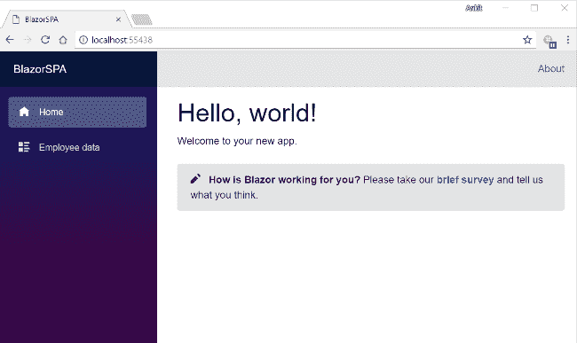

### 先决条件

*   安装。NET Core 2.1 预览版 2 SDK 从[这里](https://www.microsoft.com/net/download/dotnet-core/sdk-2.1.300-preview2)
*   从[这里](https://www.visualstudio.com/downloads/)安装 Visual Studio 2017 v15.7 或以上版本
*   从[这里](https://marketplace.visualstudio.com/items?itemName=aspnet.blazor)安装 ASP.NET 核心 Blazor 语言服务扩展
*   SQL Server 2008 或以上版本

低于 Visual Studio 2017 v15.7 的版本不支持 Blazor 框架。

### 源代码

从 [GitHub](https://github.com/AnkitSharma-007/SPA-With-Blazor) 获取源代码。

### 创建表

我们将使用一个 DB 表来存储所有员工的记录。

打开 SQL Server 并使用以下脚本创建`Employee`表。

```
CREATE TABLE Employee (  EmployeeID int IDENTITY(1,1) PRIMARY KEY,  Name varchar(20) NOT NULL ,  City varchar(20) NOT NULL ,  Department varchar(20) NOT NULL ,  Gender varchar(6) NOT NULL   )
```

### 创建 Blazor web 应用程序

打开 Visual Studio，选择“文件”>“新建”>“项目”。

选择项目后，将会打开一个“新项目”对话框。在左侧面板中，选择“”。NET Core"。然后，选择“ASP。NET 核心 Web 应用程序”。将项目名称设为“BlazorSPA”*，按“确定”。*

*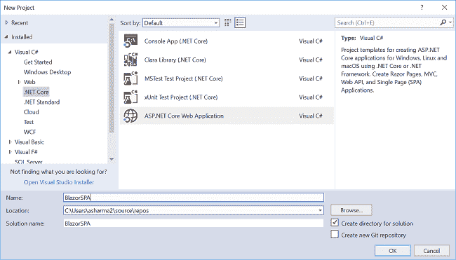*

*单击“确定”后，将打开一个新对话框，要求您选择项目模板。您可以在模板窗口的左上角看到两个下拉菜单。选择”。NET Core”和“ASP。NET Core 2.0”。然后，选择“Blazor(ASP.NET 核心主机)”模板，并按“确定”。*

*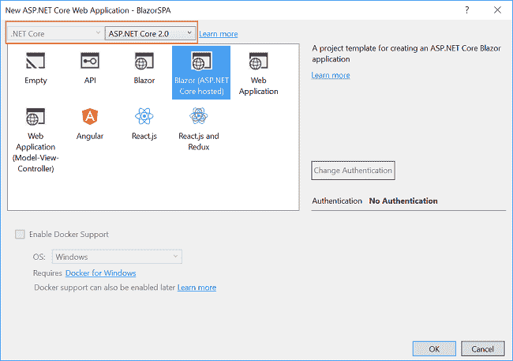*

*现在我们的 Blazor 解决方案将被创建。您可以在解决方案资源管理器中观察文件夹结构，如下图所示。*

*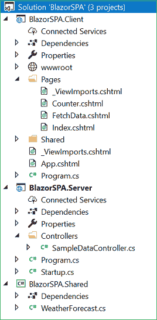*

*您可以看到，我们在这个解决方案中创建了三个项目文件。*

1.  *布拉索斯帕。客户端—具有客户端代码，并包含将在浏览器上呈现的页面。*
2.  *布拉索斯帕。服务器—具有服务器端代码，如与数据库相关的操作和 web API。*
3.  *布拉索斯帕。共享—包含客户端和服务器都可以访问的共享代码。它包含了我们的模型类。*

### *将模型搭建到应用程序*

*我们使用实体框架核心数据库优先的方法来创建我们的模型。我们将在“BlazorSPA”中创建我们的模型类。共享”项目，以便客户端和服务器项目都可以访问它。*

*导航到“工具”>“获取软件包管理器”>“软件包管理器控制台”。选择“BlazorSPA。“默认项目”下拉列表中的“共享”。请参考下图:*

*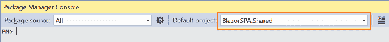*

*首先，我们将为我们的目标数据库提供者安装这个包，在这个例子中是 SQL Server。运行以下命令:*

```
*`Install-Package Microsoft.EntityFrameworkCore.SqlServer`*
```

*因为我们使用实体框架工具从现有的数据库中创建一个模型，所以我们也将安装工具包。运行以下命令:*

```
*`Install-Package Microsoft.EntityFrameworkCore.Tools`*
```

*在您安装了这两个包之后，我们将使用以下命令从数据库表中构建我们的模型:*

```
*`Scaffold-DbContext "Your connection string here" Microsoft.EntityFrameworkCore.SqlServer -OutputDir Models -Tables Employee`*
```

***不要忘记**来放置你自己的连接字符串(在`“”`里面)。在这个命令成功执行之后，您可以观察到一个“Models”文件夹已经被创建。它包含两个类文件，“mytestdbcontext . cs”*和“Employee.cs”。因此，我们已经使用实体框架核心数据库优先方法成功搭建了我们的模型。**

**此时，模型文件夹将具有以下结构:**

**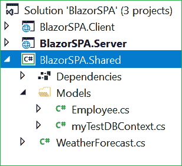**

### **为应用程序创建数据访问层**

**右键单击“BlazorSPA”。服务器”项目，然后选择“添加”>“新建文件夹”，并将文件夹命名为“DataAccess”。我们将添加我们的类来处理这个文件夹中与数据库相关的操作。**

**右键单击“数据访问”文件夹，选择“添加”>“类”。将您的类命名为“EmployeeDataAccessLayer.cs”。**

**打开“employeedataaccesslayer . cs”*并将以下代码放入其中:***

```
***`using BlazorSPA.Shared.Models;using Microsoft.EntityFrameworkCore;using System;using System.Collections.Generic;using System.Linq;using System.Threading.Tasks;namespace BlazorSPA.Server.DataAccess{    public class EmployeeDataAccessLayer    {        myTestDBContext db = new myTestDBContext();        //To Get all employees details           public IEnumerable<Employee> GetAllEmployees()        {            try            {                return db.Employee.ToList();            }            catch            {                throw;            }        }        //To Add new employee record             public void AddEmployee(Employee employee)        {            try            {                db.Employee.Add(employee);                db.SaveChanges();            }            catch            {                throw;            }        }        //To Update the records of a particluar employee            public void UpdateEmployee(Employee employee)        {            try            {                db.Entry(employee).State = EntityState.Modified;                db.SaveChanges();            }            catch            {                throw;            }        }        //Get the details of a particular employee            public Employee GetEmployeeData(int id)        {            try            {                Employee employee = db.Employee.Find(id);                return employee;            }            catch            {                throw;            }        }        //To Delete the record of a particular employee            public void DeleteEmployee(int id)        {            try            {                Employee emp = db.Employee.Find(id);                db.Employee.Remove(emp);                db.SaveChanges();            }            catch            {                throw;            }        }    }}`***
```

***这里我们定义了处理数据库操作的方法。`GetAllEmployees`将从雇员表中获取所有雇员数据。类似地，`AddEmployee`将创建一个新的雇员记录，`UpdateEmployee`将更新一个现有雇员的记录。`GetEmployeeData`将获取传递给它的员工 ID 对应的员工记录，`DeleteEmployee`将删除传递给它的员工 ID 对应的员工记录。***

### ***向应用程序添加 web API 控制器***

***右键单击“BlazorSPA。服务器/控制器”文件夹，并选择“添加”>“新项目”。将会打开“添加新项目”对话框。选择“ASP。NET”，然后从模板面板中选择“API 控制器类”，并将名称设置为“EmployeeController.cs”。点击“添加”。***

***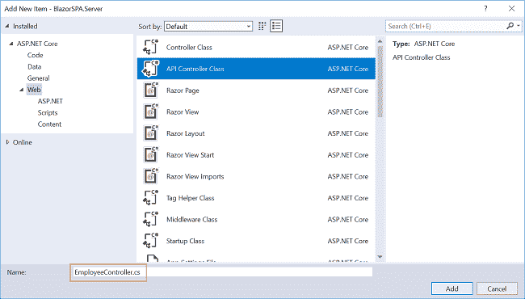***

***这将创建我们的 API `EmployeeController` 类。***

**我们将调用`EmployeeDataAccessLayer` 类的方法来获取数据并将数据传递给客户端。**

**打开“employee controller . cs”*文件，将以下代码放入其中:***

```
***`using System;using System.Collections.Generic;using System.Linq;using System.Threading.Tasks;using BlazorSPA.Server.DataAccess;using BlazorSPA.Shared.Models;using Microsoft.AspNetCore.Mvc;namespace BlazorSPA.Server.Controllers{    public class EmployeeController : Controller    {        EmployeeDataAccessLayer objemployee = new EmployeeDataAccessLayer();        [HttpGet]        [Route("api/Employee/Index")]        public IEnumerable<Employee> Index()        {            return objemployee.GetAllEmployees();        }        [HttpPost]        [Route("api/Employee/Create")]        public void Create([FromBody] Employee employee)        {            if (ModelState.IsValid)                objemployee.AddEmployee(employee);        }        [HttpGet]        [Route("api/Employee/Details/{id}")]        public Employee Details(int id)        {            return objemployee.GetEmployeeData(id);        }        [HttpPut]        [Route("api/Employee/Edit")]        public void Edit([FromBody]Employee employee)        {            if (ModelState.IsValid)                objemployee.UpdateEmployee(employee);        }        [HttpDelete]        [Route("api/Employee/Delete/{id}")]        public void Delete(int id)        {            objemployee.DeleteEmployee(id);        }    }}`***
```

***此时此刻，我们的“BlazorSPA”。服务器”项目具有以下结构。***

***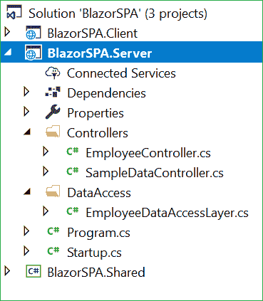***

***我们已经完成了后端逻辑。因此，我们现在开始编写客户端代码。***

### ***向应用程序添加 Razor 页面***

***我们将把剃刀页添加到“BlazorSPA”中。客户端/页面”文件夹。默认情况下，我们在应用程序中提供了“计数器”和“获取数据”页面。这些默认页面不会影响我们的应用程序，但是为了本教程，我们将从“BlazorSPA”中删除“fetch data”*和“counter”页面。客户端/页面”文件夹。****

***右键单击“BlazorSPA。客户端/页面”文件夹，然后选择“添加”>“新项目”。将会打开“添加新项目”对话框。选择“ASP。NET Core”，然后从模板面板中选择“Razor Page”并将其命名为“EmployeeData.cshtml”。点击“添加”。***

***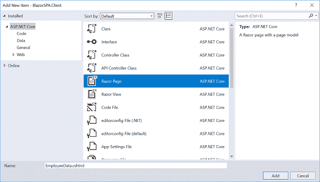***

***这将向我们的“BlazorSPA”添加一个“EmployeeData.cshtml”页面。客户端/页面”文件夹。这个 Razor 页面会有两个文件，“employee data . cshtml”*和*“*employee data . cshtml . cs”*。*****

**现在我们将向这些页面添加代码。**

### **EmployeeData.cshtml.cs**

**打开" EmployeeData.cshtml.cs" ，将以下代码放入其中:**

```
**`using System;using System.Collections.Generic;using System.Linq;using System.Net.Http;using System.Threading.Tasks;using BlazorSPA.Shared.Models;using Microsoft.AspNetCore.Blazor;using Microsoft.AspNetCore.Blazor.Components;using Microsoft.AspNetCore.Blazor.Services;namespace BlazorSPA.Client.Pages{    public class EmployeeDataModel : BlazorComponent    {        [Inject]        protected HttpClient Http { get; set; }        [Inject]        protected IUriHelper UriHelper { get; set; }        [Parameter]        protected string paramEmpID { get; set; } = "0";        [Parameter]        protected string action { get; set; }        protected List<Employee> empList = new List<Employee>();        protected Employee emp = new Employee();        protected string title { get; set; }        protected override async Task OnParametersSetAsync()        {            if (action == "fetch")            {                await FetchEmployee();                this.StateHasChanged();            }            else if (action == "create")            {                title = "Add Employee";                emp = new Employee();            }            else if (paramEmpID != "0")            {                if (action == "edit")                {                    title = "Edit Employee";                }                else if (action == "delete")                {                    title = "Delete Employee";                }                emp = await Http.GetJsonAsync<Employee>("/api/Employee/Details/" + Convert.ToInt32(paramEmpID));            }        }        protected async Task FetchEmployee()        {            title = "Employee Data";            empList = await Http.GetJsonAsync<List<Employee>>("api/Employee/Index");        }        protected async Task CreateEmployee()        {            if (emp.EmployeeId != 0)            {                await Http.SendJsonAsync(HttpMethod.Put, "api/Employee/Edit", emp);            }            else            {                await Http.SendJsonAsync(HttpMethod.Post, "/api/Employee/Create", emp);            }            UriHelper.NavigateTo("/employee/fetch");        }        protected async Task DeleteEmployee()        {            await Http.DeleteAsync("api/Employee/Delete/" + Convert.ToInt32(paramEmpID));            UriHelper.NavigateTo("/employee/fetch");        }        protected void Cancel()        {            title = "Employee Data";            UriHelper.NavigateTo("/employee/fetch");        }    }}`**
```

**让我们来理解这个代码。我们已经定义了一个类`EmployeeDataModel` ，它将保存我们将在“employee data . cshtml”*页面中使用的所有方法。***

***我们注入`HttpClient`服务来启用 web API 调用，注入`IUriHelper`服务来启用 URL 重定向。之后，我们定义了我们的参数属性— `paramEmpID`和`action`。“EmployeeData.cshtml”中使用这些参数来定义页面的路径。我们还声明了一个属性`title`来显示标题，以指定页面上正在执行的当前操作。***

***每次为页面设置 URL 参数时，都会调用`OnParametersSetAsync`方法。我们将检查参数`action`的值，以识别页面上的当前操作。***

***如果动作被设置为`fetch`，那么我们将调用`FetchEmployee`方法从数据库中获取更新的雇员列表，并使用`StateHasChanged`方法刷新 UI。***

***我们将检查参数的 action 属性是否设置为`create`，然后我们将页面的标题设置为“Add Employee”并创建一个类型为`Employee`的新对象。如果`paramEmpID`不为“0”，则不是`edit`动作就是`delete`动作。我们将相应地设置 title 属性，然后调用我们的 web API 方法来获取在`paramEmpID`属性中设置的雇员 ID 的数据。***

***方法`FetchEmployee`将标题设置为“雇员数据”,并通过调用我们的 web API 方法获取所有雇员数据。***

***`CreateEmployee`方法将检查它是被调用来添加新的雇员记录，还是编辑现有的雇员记录。如果设置了`EmployeeId`属性，那么它就是一个`edit`请求，我们将向 web API 发送一个 PUT 请求。如果没有设置`EmployeeId`，那么它就是一个`create`请求，我们将向 web API 发送一个 POST 请求。我们将根据 action 的相应值设置`title`属性，然后调用我们的 web API 方法来获取在`paramEmpID` 属性中设置的员工 ID 的数据。***

**`DeleteEmployee`方法将删除在`paramEmpID`属性中设置的雇员 ID 的雇员记录。删除后，用户被重定向到“/员工/获取”页面。**

**在`Cancel`方法中，我们将 title 属性设置为“雇员数据”，并将用户重定向到“/雇员/获取”页面**。****

### **EmployeeData.cshtml**

**打开“EmployeeData.cshtml”页面，将以下代码放入其中:**

```
**`@page "/employee/{action}/{paramEmpID}"@page "/employee/{action}"@inherits EmployeeDataModel<h1>@title</h1>@if (action == "fetch"){    <p>        <a href="/employee/create">Create New</a>    </p>}@if (action == "create" || action == "edit"){    <form>        <table class="form-group">            <tr>                <td>                    <label for="Name" class="control-label">Name</label>                </td>                <td>                    <input type="text" class="form-control" bind="@emp.Name" />                </td>                <td width="20"> </td>                <td>                    <label for="Department" class="control-label">Department</label>                </td>                <td>                    <input type="text" class="form-control" bind="@emp.Department" />                </td>            </tr>            <tr>                <td>                    <label for="Gender" class="control-label">Gender</label>                </td>                <td>                    <select asp-for="Gender" class="form-control" bind="@emp.Gender">                        <option value="">-- Select Gender --</option>                        <option value="Male">Male</option>                        <option value="Female">Female</option>                    </select>                </td>                <td width="20"> </td>                <td>                    <label for="City" class="control-label">City</label>                </td>                <td>                    <input type="text" class="form-control" bind="@emp.City" />                </td>            </tr>            <tr>                <td></td>                <td>                    <input type="submit" class="btn btn-success" onclick="@(async () => await CreateEmployee())" style="width:220px;" value="Save" />                </td>                <td></td>                <td width="20"> </td>                <td>                    <input type="submit" class="btn btn-danger" onclick="@Cancel" style="width:220px;" value="Cancel" />                </td>            </tr>        </table>    </form>}else if (action == "delete"){    <div class="col-md-4">        <table class="table">            <tr>                <td>Name</td>                <td>@emp.Name</td>            </tr>            <tr>                <td>Gender</td>                <td>@emp.Gender</td>            </tr>            <tr>                <td>Department</td>                <td>@emp.Department</td>            </tr>            <tr>                <td>City</td>                <td>@emp.City</td>            </tr>        </table>        <div class="form-group">            <input type="submit" class="btn btn-danger" onclick="@(async () => await DeleteEmployee())" value="Delete" />            <input type="submit" value="Cancel" onclick="@Cancel" class="btn" />        </div>    </div>}@if (empList == null){    <p><em>Loading...</em></p>}else{    <table class='table'>        <thead>            <tr>                <th>ID</th>                <th>Name</th>                <th>Gender</th>                <th>Department</th>                <th>City</th>            </tr>        </thead>        <tbody>            @foreach (var emp in empList)            {                <tr>                    <td>@emp.EmployeeId</td>                    <td>@emp.Name</td>                    <td>@emp.Gender</td>                    <td>@emp.Department</td>                    <td>@emp.City</td>                    <td>                        <a href='/employee/edit/@emp.EmployeeId'>Edit</a>  |                        <a href='/employee/delete/@emp.EmployeeId'>Delete</a>                    </td>                </tr>            }        </tbody>    </table>}`**
```

**在顶部，我们已经为页面定义了路径。定义了两条路线:**

1.  **`/employee/{action}/{paramEmpID}`:这将接受动作名称和员工 ID。当我们执行编辑或删除操作*时，这个路径被调用。*当我们对特定员工的数据调用`edit`或`delete`操作时，员工 ID 也作为 URL 参数传递。**
2.  **`/employee/{action}`:只接受动作名。当我们创建一个新雇员的数据时，或者当我们获取所有雇员的记录时，就会调用这个路径。**

**我们还继承了在“EmployeeData.cshtml.cs”文件中定义的`EmployeeDataModel`类。这将允许我们使用在`EmployeeDataModel`类中定义的方法。**

**在这之后，我们设置将在我们的页面上显示的标题。标题是动态的，随着页面上当前执行的操作而变化。**

**只有当操作为`fetch`时，我们才会显示“新建”链接。如果动作是`create`或`edit`，那么“新建”链接将被隐藏，我们将显示表单以获取用户输入。在表单内部，我们还定义了两个按钮“保存”和“取消”。点击“保存”将调用`CreateEmployee`方法，而点击“取消”将调用`Cancel`方法。**

**如果动作是`delete`，那么将显示一个表，其中包含调用了`delete`动作的员工的数据。我们还显示了两个按钮——“删除”和“取消”。点击“删除”按钮将调用`DeleteEmployee`方法，点击“取消”将调用`Cancel`方法。**

**最后，我们有一个表来显示数据库中的所有雇员数据。每个员工记录还将有两个操作链接:“编辑”用于编辑员工记录，而“删除”用于删除员工记录。该表总是显示在页面上，我们将在执行每个操作后更新它。**

### **将链接添加到导航菜单**

**最后一步是在导航菜单中添加指向“EmployeeData”页面的链接。打开“BlazorSPA。Client/Shared/NavMenu.cshtml "页，并将以下代码放入其中:**

```
**`<div class="top-row pl-4 navbar navbar-dark">    <a class="navbar-brand" href="/">BlazorSPA</a>    <button class="navbar-toggler" onclick=@ToggleNavMenu>        <span class="navbar-toggler-icon"></span>    </button></div><div class=@(collapseNavMenu ? "collapse" : null) onclick=@ToggleNavMenu>    <ul class="nav flex-column">        <li class="nav-item px-3">            <NavLink class="nav-link" href="/" Match=NavLinkMatch.All>                <span class="oi oi-home" aria-hidden="true"></span> Home            </NavLink>        </li>        <li class="nav-item px-3">            <NavLink class="nav-link" href="/employee/fetch">                <span class="oi oi-list-rich" aria-hidden="true"></span> Employee data            </NavLink>        </li>    </ul></div>@functions {    bool collapseNavMenu = true;    void ToggleNavMenu()    {        collapseNavMenu = !collapseNavMenu;    }}`**
```

**因此，在实体框架核心数据库优先方法的帮助下，我们使用 Blazor 成功地创建了一个 SPA。**

### **执行演示**

**启动应用程序。**

**将打开一个网页，如下图所示。左侧的导航菜单显示了员工数据页面的导航链接。**

**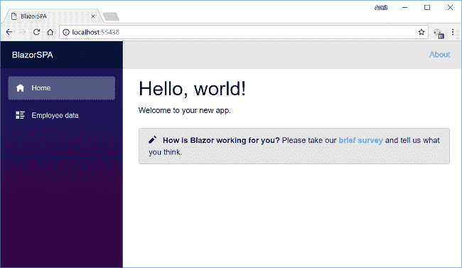**

**单击“员工数据”链接将重定向到“员工数据”视图。在这里，您可以看到页面上的所有员工数据。请注意，URL 后面附加了“employee/fetch”。**

**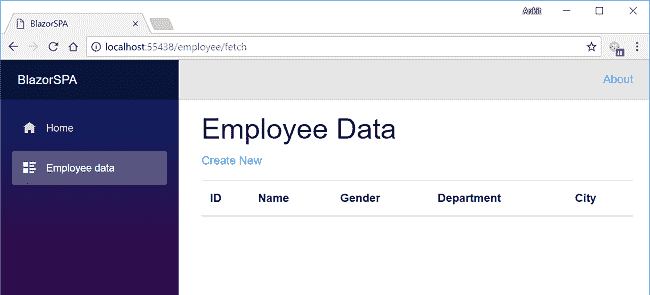**

**我们没有添加任何数据，因此它是空的。单击“新建”打开“添加员工”表单，添加新员工数据。请注意，URL 后面附加了“员工/创建”:**

**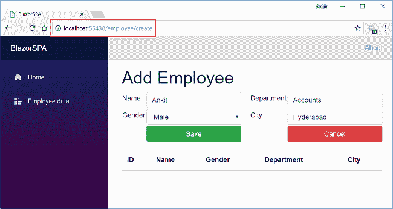**

**在所有字段中插入数据后，点击“保存”按钮。新的雇员记录将被创建，并且雇员数据表将被刷新。**

**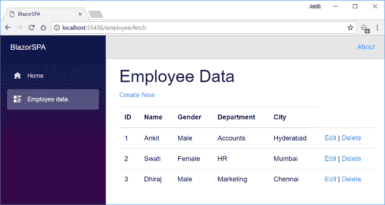**

**如果我们想编辑现有的员工记录，那么点击“编辑”操作链接。它将打开编辑视图，如下所示。在这里，我们可以更改员工数据。请注意，我们已经在 URL 参数中传递了雇员 ID。**

**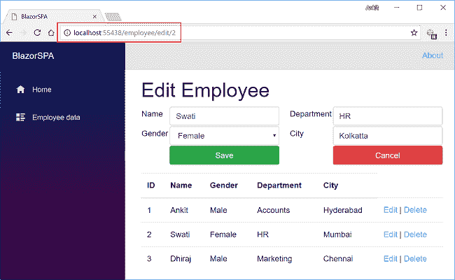**

**在这里，我们将员工所在的城市从孟买更改为加尔各答。单击“保存”刷新员工数据表，以查看下图中突出显示的更新后的更改:**

**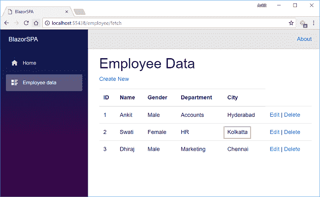**

**现在，我们将对名为 Dhiraj 的雇员执行删除操作。单击“删除”操作链接，这将打开删除视图，要求确认删除。请注意，我们已经在 URL 参数中传递了雇员 ID。**

**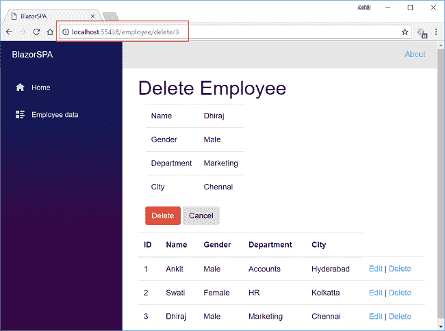**

**一旦我们单击“删除”按钮，它将删除员工记录，并且员工数据表将被刷新。在这里，我们可以看到名为 Dhiraj 的雇员已经从我们的记录中删除。**

**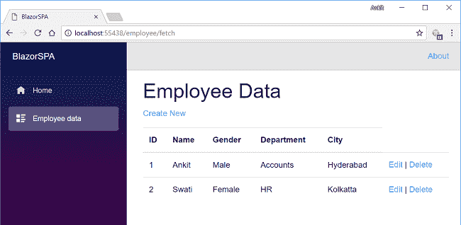**

### **部署应用程序**

**要了解如何使用 IIS 部署 Blazor 应用程序，请参考[在 IIS 上部署 Blazor 应用程序](http://ankitsharmablogs.com/deploying-a-blazor-application-on-iis/)。**

### **结论**

**在 Visual Studio 2017 和 SQL Server 2014 的帮助下，我们使用实体框架核心数据库优先方法在 Blazor 中创建了一个具有 Razor 页面的单页面应用程序。我们还在应用程序上执行了 CRUD 操作。**

**请从 [GitHub](https://github.com/AnkitSharma-007/SPA-With-Blazor) 获取源代码，并四处播放，以便更好地理解。**

**获取我的书 [Blazor 快速入门指南](https://www.amazon.com/Blazor-Quick-Start-Guide-applications/dp/178934414X/ref=sr_1_1?ie=UTF8&qid=1542438251&sr=8-1&keywords=Blazor-Quick-Start-Guide)以了解更多关于 Blazor 的信息。**

**你也可以在 [C#角](https://www.c-sharpcorner.com/article/creating-a-spa-using-razor-pages-with-blazor/)阅读这篇文章**

**你可以在这里查看我在 Blazor 上的其他文章。**

### **请参见**

*   **[ASP.NET 核心 Blazor 入门](http://ankitsharmablogs.com/asp-net-core-getting-started-with-blazor/)**
*   **[ASP.NET 核心—使用 Blazor 的 CRUD 和实体框架核心](http://ankitsharmablogs.com/asp-net-core-crud-using-blazor-and-entity-framework-core/)**
*   **[使用 EF 核心在 Blazor 中级联 DropDownList](http://ankitsharmablogs.com/cascading-dropdownlist-in-blazor-using-ef-core/)**
*   **[采用 ADO.NET 的 ASP.NET 核心的 Razor Page Web 应用](https://www.c-sharpcorner.com/article/razor-page-web-application-with-asp-net-core-using-ado-net/)**
*   **[ASP.NET 核心—使用 Angular 5 和实体框架核心的 CRUD】](http://ankitsharmablogs.com/asp-net-core-crud-using-angular-5-and-entity-framework-core/)**
*   **[ASP.NET 核心—带有 React.js 的 CRUD 和实体框架核心](http://ankitsharmablogs.com/asp-net-core-crud-with-react-js-and-entity-framework-core/)**

**最初发表于[https://ankitsharmablogs.com/](https://ankitsharmablogs.com/)**