# 从零到游戏设计师:即使你没有任何经验，如何开始构建视频游戏

> 原文：<https://www.freecodecamp.org/news/from-zero-to-game-designer-how-to-start-building-video-games-even-if-you-dont-have-any-experience-5e2f9f45f4bb/>

作者:何

# 从零到游戏设计师:即使你没有任何经验，如何开始构建视频游戏

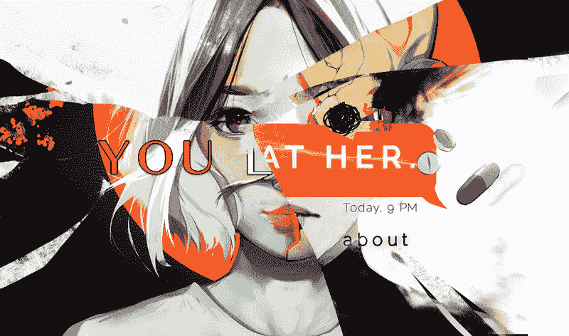

2 年前，我还是一名 17 岁的高中生，对编程一无所知。但我还是努力向前，几个月后，我在 Steam 上发布了我的第一款游戏。

现在，我已经制作了超过 10 款桌面、网络和移动游戏，总播放量超过 190 万次。

不管你的技术水平如何，你也可以做一个游戏。两年前，我认为这是不可能的，但无论如何都要尝试。这是我做过的最难的事情。但这是值得的。现在，我意识到游戏开发就像任何技能一样——只有通过实践、失败、再改进，你才能变得更好。

我自学了我所知道的一切。现在我要教你。

### 要制作一个游戏，你必须经历游戏开发的 6 个阶段:设计。艺术代码。音频。波兰人。市场。

我的文章的其余部分将把每个阶段组织成如下:

*   ？这是我从自己和他人的经历中总结出来的建议。
*   ？我发现最有帮助的资源。

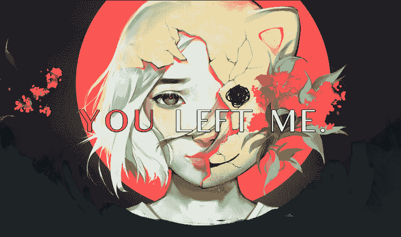

### 1.设计？

#### 建议？

你有一个好主意。*

但是你如何用文字捕捉它呢？

每个人都有自己的最佳方式。有些人撰写 60 页的设计文档。其他人，比如我，写了一页写得很糟糕的笔记，别人看不懂。我不知道什么对你最好。**但是我可以给*一些关于写*的建议:**

*   **挂钩。** *是什么让你的游戏创意伟大？*对我来说，这是写下来最重要的。一旦你抓住了这一点，你就可以更容易地写下接下来的三点。你的游戏是关于一些发人深省的东西吗？丑闻吗？它是在给一个老经典注入新的活力吗？或者说，是在做一件从来没有人做过的事情？
*   **力学。** *你的玩家是做什么的？又是为了什么目的？*这是你的玩法。它可以简单到在游戏中按 QWOP 移动 QWOP，到在神秘信使中点击按钮聊天，到在矮人要塞中大量的组合键。
*   **故事。** *玩家应该通过什么故事来记住你的游戏？他们应该带着什么情绪离开你的游戏？*每个游戏都有故事。如果故事不明显，它是由玩家创造的。一个故事可以从 2048 年不断增加的数字，文明中不断崛起的帝国，以及纪念碑谷中无声的互动中创造出来。想想你的游戏会有什么样的故事。
*   **心情。** *你的游戏给人什么印象？视觉效果如何？声音？第一印象很重要。第一印象会吸引——然后留住——玩家。也许，你会用[像素图形和 chiptune 音乐](https://www.youtube.com/watch?v=1Hojv0m3TqA)给你的游戏一个复古的氛围。或者，一个现代，干净的外观与[扁平的几何形状和仪器](https://www.youtube.com/watch?v=GatTHt8SUiA)。*


很难想出一个主意？创意街区击中我们所有人。

*   参加游戏黑客马拉松/jam。你和其他参与者的任务是在短时间内制作一个游戏。在整个过程中，以及之后，你会得到其他干扰器的支持。还有即兴表演时的兴奋和创造力？传染性。不知道从哪里入手？[试试 Ludum Dare](https://ldjam.com/) ，最大的游戏堵塞之一。
*   保留一份想法清单。我和我认识的其他开发人员记下我们的想法。这样，当我们用完了新的，我们可以参考我们的旧的。

当灵感来临时，停止你正在做的任何事情。把这个想法写下来。下一次创造力消失的时候，你就不会再去抓救命稻草了。

#### 资源？

下面所有的都是可靠的。(?)表示我目前在用。

**记笔记:**

*   Mac 的注意事项(？)
*   谷歌文档(？)
*   特雷罗

**协作(针对团队):**

*   Google Drive
*   GitHub(？).R *equires git 和 Unity .gitignore.*
*   Unity Collab。三者中最容易的。免费版有局限性。

注意——Unity 是我用来制作游戏的游戏引擎，所以我会一直提到它。请随意使用不同的引擎。

**游戏设计:**

*   杰西·谢尔的《游戏设计艺术》
*   Gamasutra

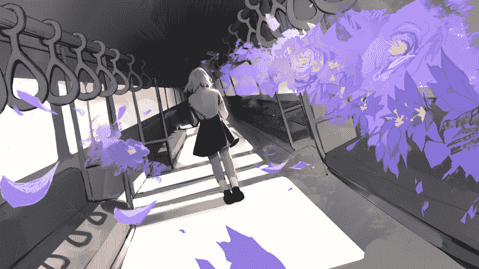

### 2.艺术？

#### 建议？

你已经计划好了你的想法；恭喜，太棒了！现在，你可以开始真正的游戏了。

如果你不知道如何编码，我建议你先做第三阶段，编码，然后再做艺术。你不会想创造出因为你不会编码而被丢弃的艺术。)

> ***不知道怎么画？*** *不烦恼。任何人都可以用 [3 个基本视觉原则](https://en.wikipedia.org/wiki/Visual_design_elements_and_principles)做出漂亮的东西:颜色、形状、空间。*

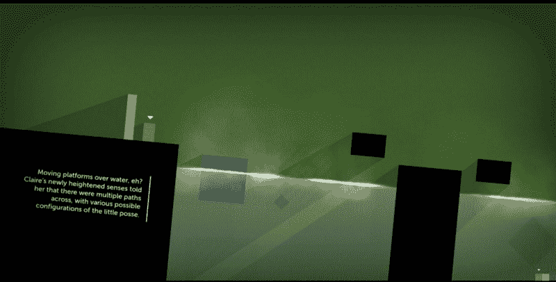

Thomas Was Alone — a beautiful yet simple game

#### **UI**

想想如何让*——拥有独特的配色方案、字体、形状和图标——而 ***功能性*** 。重要的信息是否可读和明显？颜色/字体/图标会让你分心吗？*

*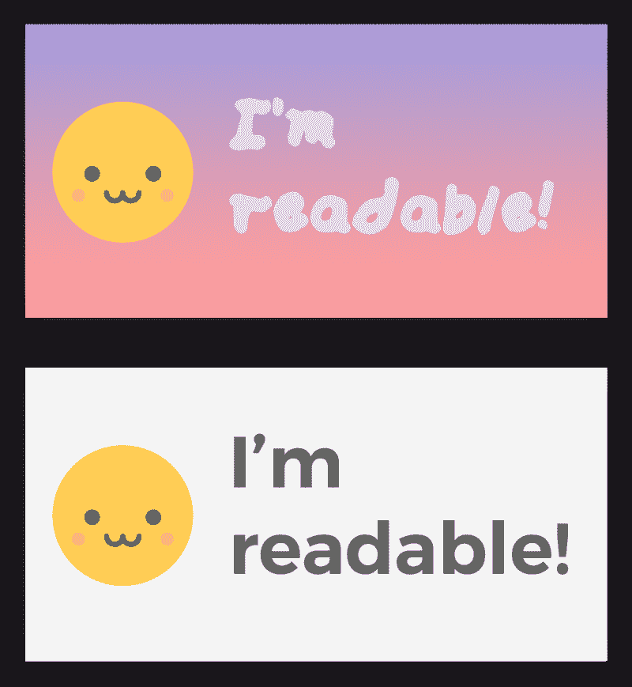

Who would win? ?* 

#### ***2D 动画***

*你有两个选择:*

*   ****逐帧拍摄。*** 画出动画的每一帧。为此，你应该使用带有 [TexturePacker](https://www.codeandweb.com/texturepacker) 的 sprite sheets(或者如果你使用 Unity， [Sprite Packer](https://docs.unity3d.com/Manual/SpritePacker.html) )。*
*   ****以骨为本。*** 画出每一个动画肢体，然后在游戏中将肢体的位置、旋转等等动画化。可以更快，更容易，并节省内存。如果你在做 2D 并使用 Unity，试着编辑精灵或 [Anima2D](https://assetstore.unity.com/packages/essentials/unity-anima2d-79840) 的枢轴。*

*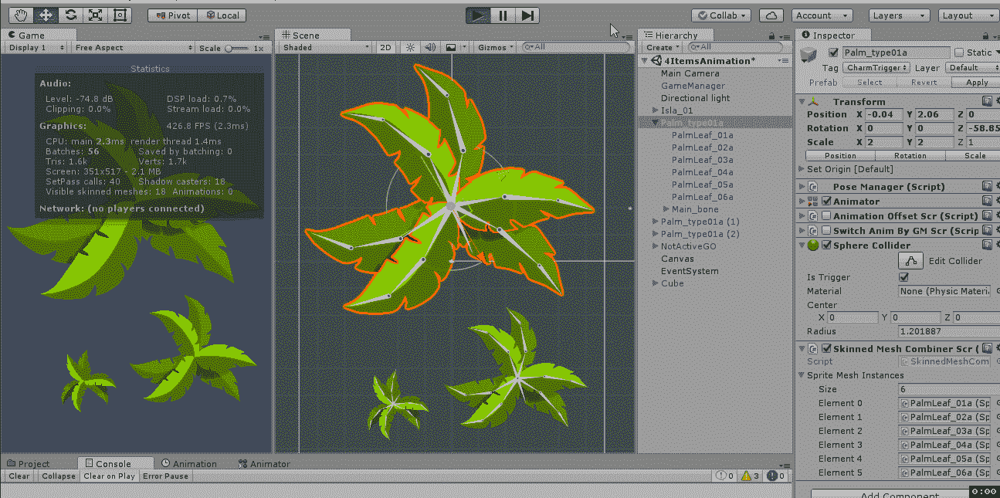*

#### ***杂项***

*这里有一些通用的美术技巧，不仅适用于游戏中的美术，也适用于其他软件。*

*   ****平铺*** 图案化资产创建平铺图像并节省内存。*

*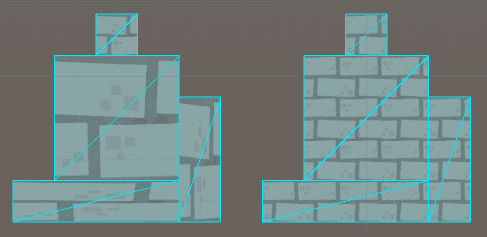

Untiled to tiled* 

*   ****9 片/9 片*** 资产具有不可扩展的边界和可扩展的中心，可创建可扩展的图像并节省内存。*

*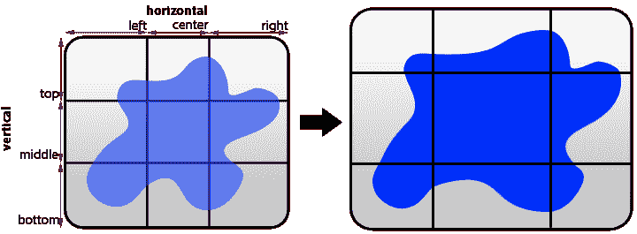

?The blue ditto grows, but its corners stay the same!* 

*   *使每个资产的维度[为 4](https://www.gamasutra.com/blogs/RobertBasler/20180202/313739/DXT_Texture_Compression_in_2018.php) 的倍数或者[为 2](https://docs.unity3d.com/Manual/HOWTO-ArtAssetBestPracticeGuide.html) 的幂以节省内存。哪一个取决于你如何压缩资产。*
*   *如果您使用的是 Photoshop，请使用“文件>导出>图层到文件”快速将每个图层导出为文件(例如 PNG、JPEG)。*

#### *资源？*

***创建用户界面:***

*   *Photoshop(？).*
*   *素描。*

***UI 原理:***

*   *[谷歌材质设计](https://material.io/design/)(？).*
*   *[苹果用户界面的注意事项](https://developer.apple.com/design/tips/)。*

***创建 2D 资产:***

*   *Photoshop(？).*
*   *瘸子。*
*   *绘画工具赛。*适合流畅/动漫风格。**

***创建 3D 资产:***

*   *搅拌机(？).强大但陡峭的学习曲线。*
*   *玛雅。*适合动画。**
*   *最大值*适于渲染。**

***自由资产:***

*   *[行为](https://www.behance.net/)(？).F *onts +图标+其他设计。**
*   *肯内尔。*总部，游戏就绪界面/2D/3D 艺术**
*   *[开放游戏开发艺术](https://opengameart.org/)。*用户生成艺术的大型图书馆**

***灵感:***

*   *[滴水不漏。](https://dribbble.com/) *来自受邀设计师的设计。**
*   *[行为](https://www.behance.net/)(？).D *从任何有帐户的人设计。**
*   *[itch.io](http://itch.io/) (？).B *漂亮的独立游戏。**

*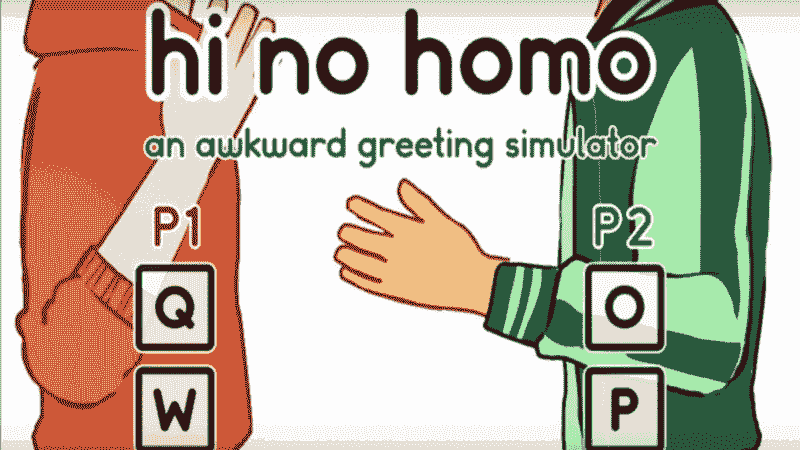*

### *3.代码？*

#### *建议？*

```
*`Debug.Log(“Oh boy! Time to code!! ^_^”);`*
```

***你的第一步？**决定一个**游戏引擎**和一个 **IDE** (集成开发环境——基本上就是一个让你编码的应用)。我推荐的游戏引擎+ide 在下面的参考资料中。*

***你的第二步？**代码。*

**

***不知道怎么编码？**无忧无虑。我抓住你了。你可以学习。*

*这些 CS 基础应该足够开始了。(这里的所有代码示例都是用 C++编写的，c++是 Unity 3D 游戏开发框架使用的主要语言之一。)*

***1)数据类型和变量。**所有代码的根源都是数据。这些数据存储在变量中。你可以这样声明一个变量:*

```
*`int i = 0;`*
```

*我们来分析一下。*

*`int`是数据类型。`i`是变量名。并且`= 0`将 0 指定为变量值。*

*这是什么？*

```
*`string s = "pusheen is best cat";`*
```

*`string`是数据类型。`s`是变量名。是的——你猜对了——`“pusheen is best cat”`是变量值。*

*一些常见的数据类型:`int`和`long`是`integers`。`float`和`double`是十进制数。字符串是任何一个句子。(即使是空的——`“”`！)*

*想了解更多？经历[这个](https://lifehacker.com/5736011/learn-how-to-code-part-i-variables-and-basic-data-types)和[这个](https://lifehacker.com/5742493/learn-to-code-part-ii-working-with-variables)。*

***2) If 语句。** If 语句评估某个条件是否为真。如果是，运行`if`语句中的代码:*

```
*`if (true){ //true is always true!

    doThings(); //I'm inside the if statement's brackets; run me!
}`*
```

*如果条件不成立，我们可以用`else if`评估其他条件:*

```
*`int i = 1;

if (i == 0){ 

   doThings(); 
}
else if (i == 1){

   doOtherThings(); //I'm gonna be run!

}`*
```

*或者，用`else`运行一些其他代码:*

```
*`int i = 60000;

if (i == 0){

  doThings(); 

} else {

  doOtherThings(); //I'm still gonna be run.

}`*
```

***3) For/while 循环。** While 循环在某个条件仍然为真时继续，反复执行相同的代码行。当条件为假时，while 循环退出。*

```
*`while (someBool == true){ //condition

   doThings(); //We'll keep doing things until someBool is false

}`*
```

*想一想:这个 while 循环会持续多久？*

```
*`while (true){

  doThings();

}`*
```

*For 循环基本上是 while 循环，其中:*

```
*`int i = 0;
while (i < condition){ 

    doThings();

    i++; //increment after doing things
}`*
```

*这相当于:*

```
*`for (int i = 0; i < condition; i++){

    doThings();
}`*
```

***4)基本数据结构。**所以，我们有数据，我们有评估和处理这些数据的方法。我们也可以将数据存储到某种结构中——数据结构。你要知道的数据结构有[数组](https://www.geeksforgeeks.org/introduction-to-arrays/)、[列表](https://www.geeksforgeeks.org/linked-list-set-1-introduction/)、[队列](https://www.geeksforgeeks.org/queue-data-structure/)、[堆栈](https://www.geeksforgeeks.org/stack-data-structure/)、[集合](https://www.geeksforgeeks.org/hashing-set-1-introduction/)。*

*下面是一个简单的数组示例:*

```
*`/*
Say you have numbers 0 through 9 that you want to store somewhere. You can store it in an array!
*/
int[] arr = new int[10]; 
/*
The [] brackets declare an array. We assign a new array to arr of size 10 - that means it can hold 10 elements. Arr now looks like this:

arr = [ 0 0 0 0 0 0 0 0 0 0 ]
*/
for (int i=0; i<10; i++){

    arr[i]=i; //We assign whatever i is to the the ith index of arr.

//Did you know data structures' indices start at 0? ? 
}

/*
After the for loop, our array data structure should look like this!
arr = [ 0 1 2 3 4 5 6 7 8 9 ]
*/`*
```

*为了巩固你的 2–4 知识，请浏览[这](https://lifehacker.com/5742494/learn-to-code-part-iii-arrays-and-logic-statements)。*

***5)功能和例外。**函数基本上是描述一大堆代码的一小段代码。例如，如果您呼叫:*

```
*`EatBread();`*
```

*EatBread()看起来像:*

```
*`void EatBread(){ //<---this is a function. 

   breadAte=true;

   printf("I CAN FEEL THE CARBS COURSING THROUGH MY BODY");

}`*
```

*那么对`EatBread()`的调用实际上是对`EatBread()`函数内两条语句的调用。*

*如果您在代码中做了一些不好的事情，可能会抛出一个异常。它们是愤怒的红色错误，告诉你，嘿，后退，你刚才做的事情不符合逻辑。去修改一下。*

*要了解更多关于函数的信息，[请点击这里](https://lifehacker.com/5742495/learn-to-code-part-iv-understanding-functions-and-making-a-guessing-game)；对于例外，[到此为止。](http://www.tutorialspoint.com/java/java_exceptions.htm)*

*然后，还有一些你应该知道的事情:*

***6)语言。**你打算用什么语言编码？C++？Javascript？C#？每种语言的写法都有些不同，可以让你做不同的事情。*

***7) API(应用编程接口)。一旦你知道了基础知识，你将不得不学习你的游戏引擎的特定 API。API 本质上是一堆包装在简单的类和函数中的强大工具，您可以调用它们。API 让生活变得更简单。简单多了。***

*最后:*

*查看你选择的游戏引擎中的一个示例项目。 [虚幻](https://docs.unrealengine.com/en-us/Resources)和[团结](https://unity3d.com/learn/resources/downloads)都有一吨免费的例子项目。这会让你发现一切是如何组合在一起的。另外，你可以从这个项目中建立你的游戏想法。(我用 Corgi 引擎构建了我的第一个游戏。)*

```
*`if (you.getThisFar()==true){
  veryProud=true;
  you.didIt(); //CURRENT MOOD: THE SH⭐⭐KEST ???

}`*
```

***一句鼓励的话:**我知道。编码一开始很吓人。没有什么是有意义的，你会遇到不断的障碍，面对失败和例外，你可能会想要放弃。这并不意味着你不擅长编码。编码很有挑战性。一开始觉得自己无能是可以理解的。*

*但是这需要时间，就像其他技能一样。会变得更容易的。它会变得有趣(至少对我来说是这样)。*

**

***重要的游戏编程概念:***

*   *[*物体方位。*](https://en.wikipedia.org/wiki/Object-oriented_programming) 让编程感觉更自然。*
*   *[*命名约定。*](https://stackoverflow.com/questions/421965/anyone-else-find-naming-classes-and-methods-one-of-the-most-difficult-parts-in-p) 将你的类、方法和变量命名为明显传达其目的的东西。例如，近战攻击函数应该命名为 meleeAttack()，而不是 mA()或 protecbutalsoattac()。你(和其他阅读你的代码的人)应该知道发生了什么。*
*   *[*分解。*](https://cs.stanford.edu/people/nick/compdocs/Decomposition_and_Style.pdf) 把重复出现的代码放入单独的函数中。调用该函数，而不是复制可重复的代码。*
*   *[*单例设计模式。*](http://gameprogrammingpatterns.com/singleton.html) 允许数据这一大堆东西需要存放在一个地方。*
*   **静态回避。*除了单件，我会避免制造静态变量——它们的生命周期就是游戏的生命周期，[它们更慢，](https://jacksondunstan.com/articles/1713)它们在编辑器中会有意想不到的行为。*
*   *[*观察者设计图案*](http://gameprogrammingpatterns.com/observer.html) *。*允许依赖于另一件事情而必须发生的事情不要浪费计算机的时间去检查另一件事情。*

***重要的 Unity 特有的东西:***

*   *[*协程。*](https://docs.unity3d.com/ScriptReference/MonoBehaviour.StartCoroutine.html)*ienumerator 和协程允许你开始做事，继续做事直到过了一段时间，然后停止。我一直使用*:*用于视觉效果的爆发；用于学习运动；用于在抓取场景对象之前等待场景加载。**
*   **[*ScriptableObject。*](https://unity3d.com/learn/tutorials/modules/beginner/live-training-archive/scriptable-objects) 这些包含的数据开销比单行为少。**

#### **资源？**

****游戏引擎:****

*   **自己做。*需要 C/C++。低水平。非常非常低。***
*   **[团结](https://t.umblr.com/redirect?z=http%3A%2F%2Funity.com&t=YTA4MGJkNmI1N2Q5MTUxODI4ZWNkOGEwZGVhMjA3ZDNiZmQ1ODJlYyxxRDFMV0V3eA%3D%3D&b=t%3AlfGQjHHkXZBrPEtOysXejA&p=http%3A%2F%2Fzephyo.tumblr.com%2Fpost%2F166397059953%2Fhello-first-off-i-want-to-say-that-i-really-love&m=1)(？).2 *D/3D。需要 Javascript/C#。中级。跨平台。***
*   **[虚幻引擎](https://t.umblr.com/redirect?z=https%3A%2F%2Fwww.unrealengine.com&t=NjMyOGZkMjcyNDA3ZmUwN2JhNGI4NzA1MTFlOTNkMWRiZWM4MTMxMSxxRDFMV0V3eA%3D%3D&b=t%3AlfGQjHHkXZBrPEtOysXejA&p=http%3A%2F%2Fzephyo.tumblr.com%2Fpost%2F166397059953%2Fhello-first-off-i-want-to-say-that-i-really-love&m=1)。 *2D/3D。需要 C++。中级。跨平台。注意:2D 的支持不是很大。***
*   **[pixi.js](http://www.pixijs.com/) (？). *2D。需要 Javascript。中级。网络。***
*   **[GameMaker 工作室](https://t.umblr.com/redirect?z=https%3A%2F%2Fwww.yoyogames.com%2Fgamemaker&t=ODE1NjZlZGViNGRlZjAyNjIwODhkNWNmYThmNmJhMDI2N2FlM2ZmYyxxRDFMV0V3eA%3D%3D&b=t%3AlfGQjHHkXZBrPEtOysXejA&p=http%3A%2F%2Fzephyo.tumblr.com%2Fpost%2F166397059953%2Fhello-first-off-i-want-to-say-that-i-really-love&m=1)。 *2D/3D。需要 GML。初级水平。跨平台。***
*   **[电晕](https://coronalabs.com/)。 *2D。需要 Lua。初级水平。跨平台。***

****IDEs:****

*   **Visual Studio 代码(？).F *或 MacOS。给我没有滞后，并有真棒，VSCode 专有的功能(如内联参考信息，快速导航(⌘T)).***
*   **Visual Studio(？).F *或 Windows。***
*   **MonoDevelop。伴随着团结。倾向于滞后。**

****免费 Unity 资产:****

**对于 Unity，Unity 资产商店、GitHub、bitbucket 和其他网站上有大量免费资产。我在每个项目中至少使用 2 个。用资产让你的生活更轻松，但要意识到它们并不完美。如果你发现了错误，不要犹豫去修复它们和/或联系开发人员。**

*   **[TextMeshPro](https://www.assetstore.unity3d.com/en/?stay#!/content/84126) (？).**
*   **[LeanTween](https://www.assetstore.unity3d.com/en/?stay#!/content/3595) (？).**
*   **[菌类](https://assetstore.unity.com/packages/templates/systems/fungus-34184)。**
*   **[柯基引擎。](http://corgi-engine.moremountains.com/)**
*   **[对话系统](http://www.pixelcrushers.com/dialogue-system/)。**
*   **[后处理堆栈。](https://assetstore.unity.com/packages/essentials/post-processing-stack-83912)**
*   **[高桥敬二郎。](https://github.com/keijiro) *在团结上下功夫。拥有*惊人的*开源 Unity 视觉特效项目！***

> **最后但同样重要的是，我解决编码问题的第一选择:Google！**

**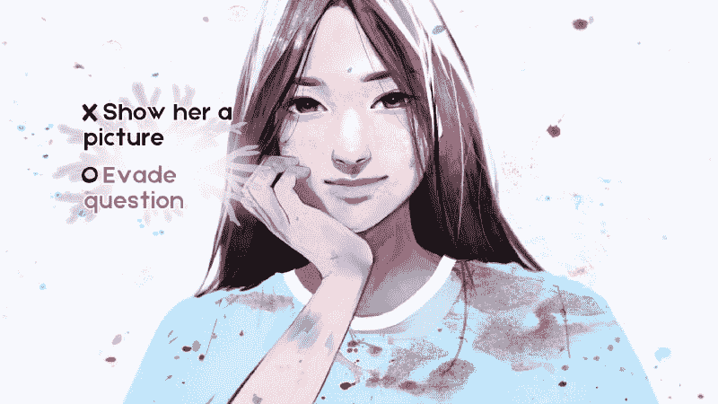**

### **4.音频？**

#### **建议？**

**第一:**要音频吗？****

**音频可以做 [*奇观*沉浸和情绪](https://dl.acm.org/citation.cfm?id=2146327)。但是，它会消耗内存。**

**如果答案是肯定的，什么音频？**

**会包括**音乐**吗？**音效**？**画外音**还是**旁白**？**

**对于以上任何一种，以符合你游戏的**情绪**的方式记录和混合它们。例如，Bastion 使用有机嘴部和乐器声音，与其游戏世界相匹配。《死灵舞者的墓穴》混合了电子音乐和 chiptune 摇滚，以配合丰富多彩的节奏游戏。**

> **“沉浸感才是王道。”
> 
> [——达伦·科布，超级巨人游戏](http://twvideo01.ubm-us.net/o1/vault/gdc2012/slides/Audio%20Track/KORB_DARREN_BUILD%20THAT%20WALL.pdf)**

**如果你的音频与游戏的**氛围不匹配，**可能会降低沉浸感。*你的*音频将如何匹配你的游戏？**

#### **资源？**

****音频工具:****

*   **Logic Pro。 *$200。仅限 MacOS。***
*   **FL 工作室(？).99–899 美元。有免费演示。**
*   **死神。60-225 美元。**
*   **胆大(？).自由。能力有限。用于清洁音频。**

****复古音效发生器:****

*   **[微芯通](http://sfbgames.com/chiptone/)。**
*   **[Bfxr](https://www.bfxr.net/) 。**
*   **Leshy SFMaker 。**
*   **[as3sfxr](http://www.superflashbros.net/as3sfxr/) 。**

****自由音:****

*   **[Soundcloud](http://soundcloud.com/) (？).S *oundcloud 在知识共享(CC)下有一个关于 o *f 华丽宝石的 t* 。这里有一个开始播放的列表。如果需要，确保提供归属。***
*   *[Incompetech](https://incompetech.com/music/) (？).C *C 音乐。必须属性。**
*   *[Bensound](https://www.bensound.com/royalty-free-music) 。 *CC 音乐。必须属性。**

*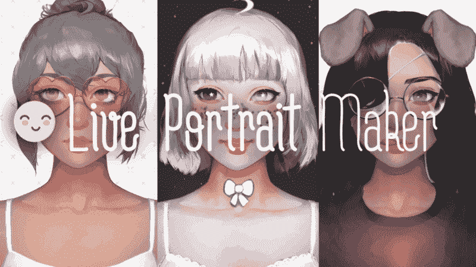*

### *5.波兰人？*

#### *建议？*

*嘿！你来了！你做到了；那就是 ***绝对不可思议*** (我是认真的，如果你走到这一步，我很想听听你的游戏；打我啊)！*

*你完了..对吗？*

*好吧。有 99.99999%的可能有 bug。*

*是时候进行 bug 测试了。*

**

#### ***测试你游戏的 Bug***

1.  *让别人——而不是你——来玩它。最好是在你面前，因为如果他们遇到一个 bug，他们可能没有意识到或者很难描述它。*
2.  *在所有目标平台上播放。它可能在编辑器中有效，但在重要的地方有效吗？特别是对于 Linux 和不同版本的 Android，我发现事情变得有点不稳定。*

*好吧。你发现了一个漏洞。现在怎么办？*

*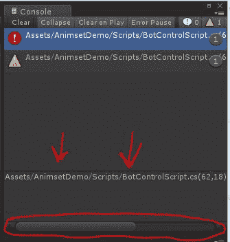*

1.  **检查控制台是否有异常。*找到一个？太好了！找到引发异常的文件和行号。如果这个例外听起来像来自火星，谷歌一下，了解一下。然后找出该行号抛出异常的原因。*
2.  **还是想不通？写入控制台。开始在你认为会给你带来麻烦的地方扔日志声明。打印变量值，并查看打印的内容是否符合预期。如果没有，就解决它。**
3.  *当情况变得更糟时，检查日志。项目的日志会给你比控制台更多的信息。读取出现异常的最后几行。谷歌一下你不知道的任何东西。你现在能修理它吗？*
4.  **睡眠。早上会修好的。这只是一个噩梦。对吗？？**

#### ***常见错误***

*   **NullReferenceException。**

```
*`var.doThing(); //throws NullReferenceException: Object reference not set to an instance of an object`*
```

**问题:*你正在对一个 **null** (不存在)变量做一件事。*

**快速修复:*做事情之前检查变量是否为空。*

```
*`if(var != null)
    {
        var.doThing(); // do the thing safely!
    }`*
```

*   **语法错误异常。**

**问题:*你的代码有无效的语法。*

**快速修复:*在异常消息中，它应该告诉你是什么字符抛出了错误。改变那个角色。*

**注意:*如果字符是双引号，确保您使用的是哑引号而不是智能引号:*

```
*`" //dumb quote
” //smart quote. I promise these'll give you trouble at some point in your life. ?`*
```

*   *粉色或黑色屏幕。*

*可能的问题:一些着色器无法渲染。*

**可能的原因:*你正在为一个 2D 游戏使用 3D 着色器。或者，您正在使用一些目标操作系统不支持的着色器功能。手机游戏一定要用移动着色器。*

*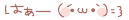*

*完成调试后，通过优化内存使用和性能来完善你的游戏。这将使它下载更快，并减少人们的设备发热。*

#### ***通用优化提示***

*   *[*设置目标帧率。*](http://resetoter.cn/UnityDoc/ScriptReference/Application-targetFrameRate.html) 视觉小说的帧率可以是 20，第一人称射击游戏的帧率可以是 60。低于默认的目标帧速率允许游戏花费更少的时间渲染帧。*
*   **动画/ [粒子](https://blogs.unity3d.com/2016/12/20/unitytips-particlesystem-performance-culling/) / [遮挡剔除](https://docs.unity3d.com/Manual/OcclusionCulling.html)。*剔除意味着摄像机看不见的东西不会被渲染。角色只会动画化，粒子只会更新，3D 模型只会在视图中渲染。*

*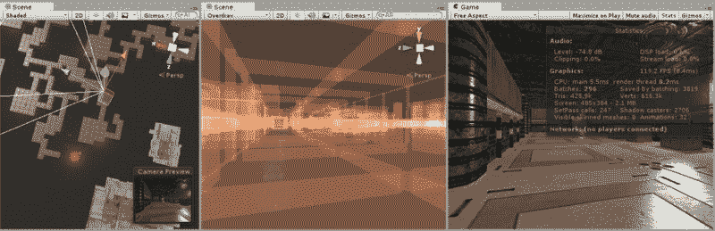**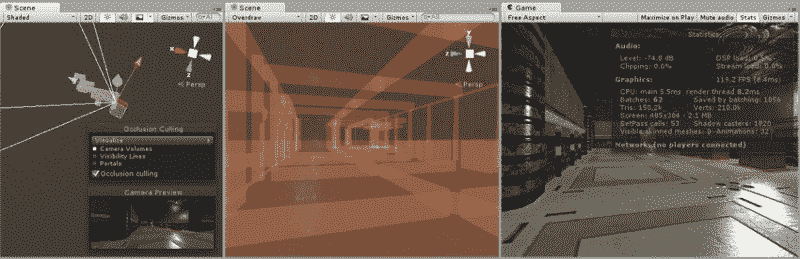*

*   **压缩纹理和音频。* [紧缩压缩纹理。](https://blogs.unity3d.com/2017/12/15/crunch-compression-of-etc-textures/) [流媒体音乐和解压音效加载。](https://medium.com/@hex3r_/making-your-unity-game-scream-and-shout-and-not-killing-it-in-the-process-673a7384693c)降低音频质量。请注意，压缩可能会也可能不会显著降低资产质量。*
*   *[*对象池。*](https://unity3d.com/learn/tutorials/topics/scripting/object-pooling) 避免一次实例化和销毁多个对象，以防止巨大的尖峰。相反，对象池将它们放在列表、队列或其他数据结构中。像项目符号这样的东西应该被对象池化。*
*   *[*不要让光线投射击中不需要输入的东西。*](https://create.unity3d.com/Unity-UI-optimization-tips) 光线投射就像每次你点击或点击时从你的手指或鼠标射出的小光线。从光线投射计算中移除对这些输入没有反应的对象。*

#### ***如果你准备好迎接挑战:***

*   **优化着色器。*给每个渲染器一个材质。这将在一开始节省资源，因为游戏不需要为每样东西都创建新的材料。让材质的着色器只包含功能上需要的内容(例如，不需要遮罩的按钮可以使用 Sprite 着色器)。*
*   **在 Unity 中，[用 AssetBundles 代替资源。](https://blogs.unity3d.com/2017/04/12/asset-bundles-vs-resources-a-memory-showdown/)* AssetBundles 会通过从线上(如 dropbox)或本地存储(如硬盘)拉取来节省内存。尽管如此，由于文档不完善，我并没有尝试太多。*

#### *资源？*

*所有这些都来自 Unity，但也适用于其他引擎。*

***脚本:***

*   *[优化 Unity 游戏中的脚本](https://unity3d.com/learn/tutorials/topics/performance-optimization/optimizing-scripts-unity-games)(？)*

***艺术:***

*   *【Unity UI 优化指南(？)*
*   *[艺术资产最佳实践指南](https://docs.unity3d.com/Manual/HOWTO-ArtAssetBestPracticeGuide.html)(？)*

***内存:***

*   *[减少构建的文件大小](https://docs.unity3d.com/Manual/ReducingFilesize.html)(？)*
*   *[内存](https://docs.unity3d.com/Manual/BestPracticeUnderstandingPerformanceInUnity2.html)*

***特定于平台:***

*   *[手机优化实用指南](https://docs.unity3d.com/Manual/MobileOptimizationPracticalGuide.html)(？)*
*   *[WebGL 性能考虑](https://docs.unity3d.com/Manual/webgl-performance.html)(？)*
*   *[针对 WebGL](https://docs.unity3d.com/Manual/webgl-memory.html) 时的内存考虑事项(？)*
*   *[Olly 对移动 VR 优化的七个阶段](https://unity3d.com/how-to/optimize-mobile-VR-games)*

*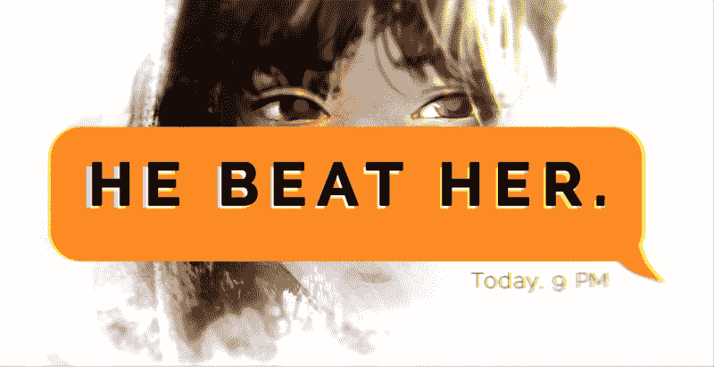*

### *6.市场？*

#### *建议？*

***祝贺你！**？？你有所成就。是时候向世界展示你的成就了。*

*就我个人而言，营销是我最容易焦虑的阶段。如果你也有疑问，游戏开发者社区会有所帮助。你并不孤单。你已经走了这么远——还是坚持到最后吧，对吗？*

> *除非你尝试，否则你永远不知道它是否会成功。*

**

1.  ***草稿。**在所有目标游戏发布平台上创建游戏页面草稿。在下面的**资源**中找到平台列表。*
2.  ***网络。**如果你走完整个网络里程，你会想给发电子邮件**游戏出版社**，在**节日**展示，参加**会议**。*

**与 game press 合作，*在发布前一周给你未列出的游戏页面发邮件。给人们一些时间来写它。很可能他们根本不会写出来。我发现媒体喜欢引人注目的开发者故事，独特/有争议的概念，最重要的是，一个[新闻包](http://dopresskit.com/)。*

*你如何找到电子邮件？您可以..*

1.  *找到你喜欢的作家，用谷歌搜索他们的名字。他们的电子邮件肯定会出现在某个地方:Twitter、LinkedIn 等。或者..*
2.  *在他们的*关于*页面上找到杂志/新闻的全公司电子邮件。通常是 tips@company.com**的格式。***

*如果你的游戏没有明确涉及你的类型/目标平台，不要给媒体发电子邮件。*

**节日*可以让你获得奖项和/或其他开发者和媒体的专业认可。*

*会议 由你决定:会议可以是与其他开发者、公司和媒体的交流(去给他们拿名片吧！);更新您最新的游戏开发知识；玩别人的游戏；或者和网友见面。*

*游戏大会门票*贵。如果你是学生，考虑为他们申请奖学金。 [IGDA 学者项目](http://scholars.igdafoundation.org/)会给你一些特别棒的社交和活动机会。**

*3.Youtubers 飘带。您可以通过以下方式获得比赛的视频报道:*

1.  **在游戏分发平台上排名靠前*。*
2.  *电子邮件。如果发邮件，不要说自己；说说游戏。保持甜蜜、简短和引人注目。使用醒目的照片和 gif。*

*你如何找到电子邮件？看他们的关于页面。如果你在那里找不到，谷歌一下他们，看看他们的其他社交媒体有没有。*

*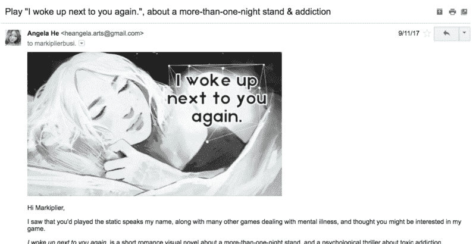

’tis an email* *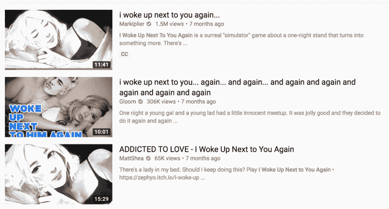

*dances in the air** 

*4.**社交媒体。***

*社交媒体是一种令人惊奇的营销工具。 [Agar.io 从 4chan](https://www.rockpapershotgun.com/2018/02/22/the-rise-and-rise-of-io-games/) 开始崛起，[蝴蝶汤从 Twitter](https://twitter.com/brii_u/status/909114732287627264?lang=en) 得到疯狂的推动，某种形式的社交媒体总是出现在我的前 4 名推荐者中:*

*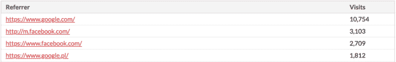**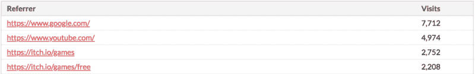

Live Portrait Maker (left), YOU LEFT ME. (right)* 

*我最喜欢的营销社交媒体平台在下面的**资源**中。*

**

***最后一句话**——**出版社还是自助出版社？**游戏营销很多。你想让出版商来处理这些事情吗？想走热线迈阿密 x 下放数字路线，还是依靠 Farmville 和 Doki Doki 文学俱乐部的口碑？*

*对于出版商，你必须做研究，找到一个好的。之后，你要签署文件并通过法律程序。另外，这是一项巨大的金融投资。*

*靠你自己，你将不得不投入大量的时间和精力来学习市场营销。你可能会喜欢。你可能会讨厌它。你可能也不会做得很好。但它是免费的，而且你学到了有价值的技能。*

*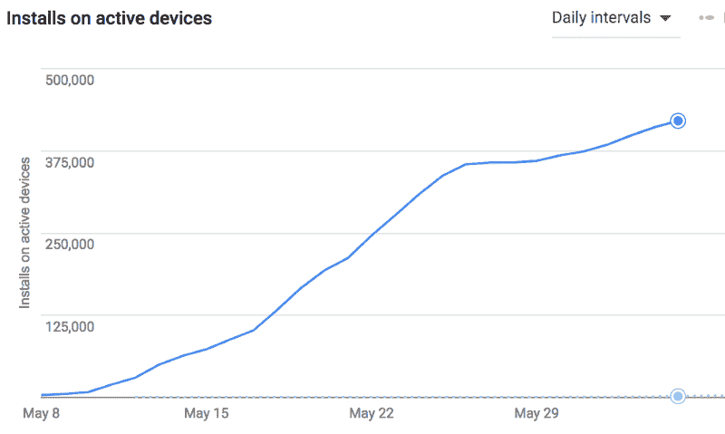

*Yay organic, self-publishing growth~ (But is it non-GMO though?)** 

*对我来说，我会一直自助出版。我喜欢学习新事物。此外，我坚信一款真正伟大的游戏无论如何都会成功，只要 T2 投入一些营销努力。*

*6.点击**发布**按钮！*

*？？唷，你已经证实了！！？现在放松，坐下来，喝一杯美味的饮料，给自己一些时间！你这么努力。你应得的。*

*记住，即使你的游戏没有得到你期望的反响，也没关系。你的第一次不会完美。我在 Steam 上的第一个游戏只有 255 次下载。*

*事实是，你做了一个游戏。你学到了很多。够了。*

*而且总有下一次！*

**

#### *资源？*

***游戏分发平台:***

*   *[蒸汽](https://store.steampowered.com/)(？).T2 要求每场比赛收取 100 美元的费用。*
*   *[缘起](https://www.origin.com/)。 *PC。**
*   *[GOG](https://www.gog.com/) 。 *PC。免费发布。游戏必须被接受。**
*   *[Mac App Store](https://developer.apple.com/macos/distribution/) 。*马科斯。需要 Apple 开发人员帐户。**
*   *[itch.io](http://itch.io/) (？).P *C/Web。免费发布。**
*   *[游戏雷震](http://gamejolt.com/)(？).P *C/Web。免费发布。**
*   *[战甲游戏](http://developers.armorgames.com/)(？).F *自由出版。必须申请成为开发者。**
*   *[Kongregate](http://www.kongregate.com/) (？).W *eb。免费发布。**
*   *[Newgrounds](http://www.newgrounds.com/) (？).W *eb。免费发布。**
*   *[GitHub](https://github.com/) (？).W *eb。免费发布在自己的站点上，域名格式为“_**_ _ . github . io”**。**
*   *[亚马逊。](https://developer.amazon.com/app-submission) *网络/手机。免费发布。**
*   *[Google Play](https://play.google.com/store) (？).M *obile。需要一次性支付 25 美元的费用。**
*   *[iOS 应用商店](https://itunes.apple.com/us/genre/ios)(？).M *obile。需要 Apple 开发人员帐户。**

***游戏压力:***

*   *印第安人。*
*   *[矽肺。](http://www.siliconera.com/)*
*   *[自由游戏星球](https://www.freegameplanet.com/live-portrait-maker-browser-game/)。*超级好的管理员。**
*   *[PCGamer.](https://www.pcgamer.com/)*
*   *[Kotaku。](https://kotaku.com/)*
*   *[摇滚纸猎枪。](https://www.rockpapershotgun.com/)*
*   *[多边形。](https://www.polygon.com/gaming/2012/9/17/3348450/zynga-a-bit-lucky-acquisition-zynga-san-francisco-john-tobias)*
*   *[巨型炸弹。](https://www.giantbomb.com/florence/3030-66441/similar-games/)*
*   *[欧洲玩家。](https://www.eurogamer.net/)*

***游戏节:***

*   *[独立游戏节(IGF)。](http://www.igf.com/) *十月左右截止。**
*   *[indi decade。](https://www.indiecade.com/) *五月/六月左右截止。**
*   *[瑞典游戏大奖。](https://www.gameawards.se/) *截止日期在七月左右。**
*   *[西南偏南节](https://gaming.sxsw.com/awards/)。*12 月左右截止。**
*   *[游戏奖项。](http://thegameawards.com/)*11 月左右截止。**

***游戏会议:***

*   *游戏开发者大会(GDC)。*旧金山。**
*   *Penny Arcade Expo (PAX)。西雅图/波士顿/费城/墨尔本。*
*   *电子娱乐博览会(E3)。*洛杉矶。**
*   *东京游戏展。*日本。**
*   *蒸汽开发日。*西雅图。仅面向 Steam 开发者。**

***电子邮件:***

*   *[按套件()](http://dopresskit.com/)*

***社交媒体:***

*   *reddit(？).选择一个合适的子编辑。我最喜欢的一些是/r/网页游戏、、T2/r/IndieGaming/、和/r/视觉小说。*

*

/r/WebGames.* 

*   *脸书(？).P *ost 在你的脸书主页上(如果你有的话)和个人 Facebook 上(如果你愿意的话)。还有大量的脸书团体，你可以在那里炫耀你的游戏！下面是一些:**

*[**游戏开发展示和测试**](https://www.facebook.com/groups/GameDevShowAndTest)
[*欢迎来到游戏开发展示和测试——独立游戏开发者团体的姐妹团体。本组的目的是……*](https://www.facebook.com/groups/GameDevShowAndTest)*

*[**独立游戏开发者**](https://www.facebook.com/groups/IndieGameDevs/)
[*独立游戏开发者群体为小公司和个人设计和发行自己的游戏。* *阅读…*](https://www.facebook.com/groups/IndieGameDevs/)*

*[**独立游戏宣传片**](https://www.facebook.com/groups/IndieGamePromo/1066211690197686/)
[*独立游戏宣传片拥有 47645 名成员。姐妹团以独立游戏开发和独立游戏聊天为目的进行推广…*](https://www.facebook.com/groups/IndieGamePromo/1066211690197686/)*

*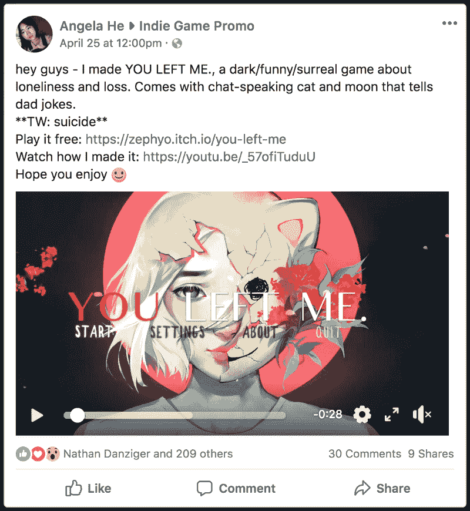

Indie Game Promo.* 

*   *Tumblr(？).*
*   *推特(？).尝试使用#gamedev、#indiedev 和#screenshotsaturday 这样的标签来被发现。*

***社区:***

*   *[/r/gamedev](https://www.reddit.com/r/gamedev) (？).*
*   *[Ludum Dare](https://ldjam.com/) (？).*
*   *[独立游戏开发者](https://www.facebook.com/groups/IndieGameDevs/)(？).*

### ***结论***

*做游戏没有作弊代码。这只是很大的决心和努力。*

> *"《《我的世界》》和《未知海域》的每一半生命背后，都是血、汗和泪的海洋."
> 
> [—肯·列文](https://medium.com/@IGLevine/so-lots-of-people-have-responded-to-my-encouragement-to-get-into-the-industry-asking-how-do-i-get-e2d0cd738733)*

*你会搞混的。你会犯错的。你甚至可能会哭(我哭过，现在还在哭)。*

*不过没关系。意味着你在成长。如果你付出了那么多努力，我相信你和你的游戏:你能做到。*

*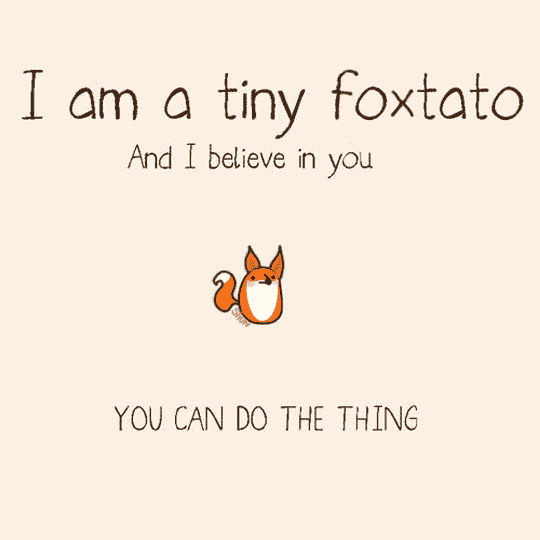

supportive foxtato by Emily’s Diary* *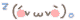*

*如果你喜欢读我的第一篇文章，一定要给一个？(或者几个——你知道你可以给不止一个吗？)这意味着整个世界？*

*你也可以在 [Twitter](https://twitter.com/zephybite) 、 [Tumblr](http://zephyo.tumblr.com/) 和 [GitHub](https://github.com/zephyo) 上关注/DM 我，如果你愿意的话[给我买杯咖啡](https://ko-fi.com/J3J6DIQC)。*