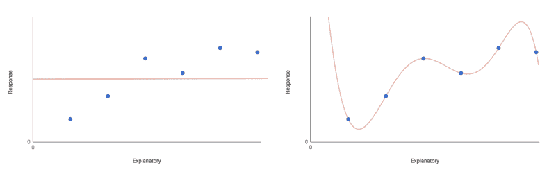

# 如何增强您的数据直觉

> 原文：<https://www.freecodecamp.org/news/how-to-develop-your-data-instincts-95d4d7fad9ba/>

随着机器学习和人工智能研究的最新进展经常成为头条新闻，数据科学成为真正主流兴趣的领域也就不足为奇了。

对于善于分析的人来说，这无疑是一个很好的职业选择，需要扎实的编程技能和深入的技术知识。

然而，在决斗神经网络和分布式计算的抢镜行为背后，是每个有抱负的数据科学家都应该非常熟悉的一些基本统计实践。

根据特定项目的需要，您可以阅读最新的编程框架或科学文献的进展。但是，要成为一名高效的数据科学家，没有捷径可走。

只有实践、耐心，也许只是一点点艰难的学习，才能真正磨砺你的“数据本能”。

### 节俭原则

在统计学入门课程中，这句话被重复到了老生常谈的地步，但英国统计学家乔治·博克斯的话在今天可能比以往任何时候都更有意义:

> “所有模型都是错的，但有些是有用的”

这句话实际上是什么意思？

这意味着当试图对一个真实世界的系统建模时，你必须以牺牲解释能力为代价来简化和概括。

真实的世界是混乱和嘈杂的，很难理解最细微的细节。**因此，统计建模并不努力实现完美的预测能力，而是用最少的必要模型实现最大的预测能力。**

对于数据世界的新手来说，这一概念可能显得有悖常理。为什么不在一个模型中包含尽可能多的术语？额外的术语肯定只会增加模型的解释力吗？

嗯，是……也不是。你只需要关心那些能带来统计上显著的解释力增加的术语。

考虑适合给定数据集的不同类型的模型。

最基本的是零模型，它只有一个参数——响应变量的总体均值(加上一些[随机分布的误差](http://www.abs.gov.au/websitedbs/a3121120.nsf/home/statistical+language+-+types+of+error) r)。

该模型假设响应变量不依赖于任何解释变量。相反，它的值完全可以用总体均值的随机波动来解释。这显然在某种程度上限制了模型的解释力。

与之截然相反的概念是饱和模型，它对每一个数据点都有一个参数。在这里，你有一个完美的模型，但如果你扔给它任何新的数据，它没有解释力。

每个数据点包含一个术语也忽略了以任何有意义的方式进行简化。再说一次——没什么用。

Fitting a null model, left, and a saturated model, right. Neither model allows for much useful interpretation.

显然，这些都是极端情况。你应该寻找一个介于两者之间的模型——一个能很好地拟合数据并具有良好解释力的模型。你可以试着拟合最大模型。该模型包括所有考虑因素的术语和交互作用术语。

例如，假设您有一个响应变量 *y* ，您想要将其建模为解释变量*x*₁*t5】和 *x* ₂的函数，并乘以系数 *β* 。最大的模型应该是这样的:*

*y =截距+β₁x₁+β₂x₂+β₃*(*x₁x₂*)*+误差*

这个最大模型有望很好地拟合数据，并提供良好的解释力。它包括每个解释变量的一个术语，以及一个交互术语， *x₁x₂.*

从模型中移除项将增加总体剩余偏差*、*或模型预测未能解释的观察到的变化的比例。

然而，并非所有条款都是平等的。你也许可以删除一个(或多个)术语，而不会看到统计上显著的偏差增加。

这样的术语可以被认为是无关紧要的，并从模型中移除。您可以逐个删除无关紧要的项(记住在每一步都要重新计算剩余偏差)。重复这一过程，直到剩下的所有术语都具有统计学意义。

现在您已经到达了最小适当模型。每项系数的估计值 *β* 明显不同于零。用于达到这一点的逐步排除法被称为“逐步”回归。

支持这种模型简化的哲学原则被称为**简约原则**。

这与中世纪哲学家威廉奥卡姆的著名启发法[奥卡姆剃刀](https://en.wikipedia.org/wiki/Occam%27s_razor)有些相似。这与“给定两个或更多同样可接受的现象解释，使用引入最少假设的解释”是一致的。

或者，换句话说:你能用最简单的方式解释复杂的事情吗？可以说，这是数据科学的定义性追求——有效地将复杂性转化为洞察力。

### 永远保持怀疑

[假设检验](https://en.wikipedia.org/wiki/Statistical_hypothesis_testing)(如 [A/B 检验](https://en.wikipedia.org/wiki/A/B_testing))是一个重要的数据科学概念。

简而言之，假设检验的工作原理是将一个问题简化为两个互斥的假设，并询问在哪个假设下给定检验统计的观察值是最可能的。当然，检验统计量是从一些适当的实验或观察数据中计算出来的。

说到假设检验，你通常会问你是接受还是拒绝零假设。

通常，你会听到人们把零假设描述为令人失望的东西，甚至是实验失败的证据。

也许这源于假设检验是如何教授给初学者的，但似乎许多研究人员和数据科学家对零假设有一种潜意识的偏见。他们试图拒绝它，转而支持更令人兴奋、更有趣的替代假设。

这不仅仅是一个轶事问题。[整篇研究论文](http://thelancet.com/journals/lancet/article/PII0140-6736(91)90201-Y/abstract)都写在关于[发表偏倚](https://en.wikipedia.org/wiki/Publication_bias) 的科学文献内。人们只能想知道这种趋势如何在商业环境中表现出来。

然而事实是这样的:对于任何适当设计的实验或足够完整的数据集，接受零假设应该和接受替代方案一样有趣。

事实上，零假设是推断统计学的基石。它定义了我们作为数据科学家的工作，即把数据转化为见解。如果我们对符合标准的发现没有高度选择性，见解就一文不值，正因为如此，在任何时候都保持高度怀疑是有好处的。

考虑到“偶然”拒绝零假设是多么容易(至少在天真地应用频率主义方法时)，情况尤其如此。

[数据挖掘](https://en.wikipedia.org/wiki/Data_dredging#Examples_in_meteorology_and_epidemiology)(或“p-hacking”)可能会抛出各种各样无意义的结果，但这些结果似乎具有统计学意义。在多重比较不可避免的情况下，没有借口不采取措施最小化[I 型错误](https://en.wikipedia.org/wiki/Type_I_and_type_II_errors)(假阳性，或“看到实际上不存在的影响”)。

*   首先，当涉及到统计测试时，选择一个本质上谨慎的测试。检查测试对你的数据的假设是否正确。
*   研究[校正方法](https://en.wikipedia.org/wiki/Family-wise_error_rate#Controlling_procedures)也很重要，例如 [Bonferroni 校正](https://en.wikipedia.org/wiki/Bonferroni_correction)。然而，这些方法有时被批评为过于谨慎。他们可以通过产生太多的第二类错误(假阴性，或“忽略实际存在的影响”)来降低[统计功效](https://en.wikipedia.org/wiki/Statistical_power) 。
*   为你的结果寻找“无效”的解释。您的采样/数据收集程序有多合适？你能排除任何系统错误吗？幸存者偏差、[自相关](https://en.wikipedia.org/wiki/Autocorrelation)、*T5、[回归均值](https://en.wikipedia.org/wiki/Regression_toward_the_mean)会有什么影响吗？*
*   最后，你发现的任何潜在关系的可能性有多大？无论 p 值有多低，都不要信以为真！

怀疑是健康的，一般来说，保持对数据的零解释的警惕是一个好习惯。

但是要避免偏执！如果你已经很好地设计了你的实验，并且谨慎地分析了你的数据，那么就去把你的发现当成真的吧！

### 了解你的方法

最近的技术和理论进步为数据科学家提供了一系列强大的新工具来解决复杂的问题，即使在一二十年前解决这些问题也是不可行的。

机器学习的这些进步令人兴奋不已，这是有充分理由的。然而，在将它们应用于给定的问题时，很容易忽略可能存在的任何限制。

举例来说，[神经网络](https://en.wikipedia.org/wiki/Artificial_neural_network)可能在分类图像和识别笔迹方面表现出色，但它们绝不是所有问题的完美解决方案。首先，他们很容易过度适应——也就是说，对训练数据太熟悉，而不能归纳到新的案例中。

把它们的不透明度也考虑进去。神经网络的预测能力往往是以透明度为代价的。由于特征选择的内在化，即使网络做出了准确的预测，你也不一定理解*它是如何得到答案的。*

在许多商业应用中，理解“如何和为什么”通常是分析项目最重要的结果。为了预测的准确性而放弃这种理解可能是也可能不是值得做的权衡。

同样，依赖复杂的机器学习算法的准确性很有诱惑力，但它们绝对不是绝对可靠的。

例如，谷歌的[云视觉 API](https://cloud.google.com/vision/)——通常令人印象深刻——[甚至可以被图像中的少量噪声轻易欺骗](https://arxiv.org/pdf/1704.05051.pdf)。相反，另一篇有趣的研究论文显示了深度神经网络[可以“看到”根本不存在的图像](https://arxiv.org/pdf/1412.1897v1.pdf)。

Humans 1 — nil Machines. Adding even a little noise to an image can fool Google’s Cloud Vision API. Via [TheRegister.co.uk](https://www.theregister.co.uk/2017/04/19/cloud_vision_api_defeated_by_noise/).

What have you been smoking…?! DNN’s can sometimes display very vivid imaginations. Images via Nguyen et al, 2014\. [Read the paper on arXiv](https://arxiv.org/pdf/1412.1897v1.pdf).

不仅仅是前沿的机器学习方法需要谨慎使用。

即使采用更传统的建模方法，也需要注意满足关键假设。总是用眼睛推断超出训练范围的数据，如果不是带着怀疑，那么至少是带着谨慎。对于你得出的每一个结论，总是要问你的方法是否值得这样做。

这并不是说完全不相信任何方法——只是要时刻意识到**为什么**你使用一种方法而不是另一种方法，以及**相对的利弊可能是什么**。

一般来说，如果你不能想出你正在考虑的方法的至少一个缺点，那么在继续之前就进一步研究它。总是使用能完成工作的最简单的工具。

知道什么时候适合和不适合使用给定的方法是数据科学中的一项关键技能。这是一种随着经验和对方法的真正理解而提高的技能。

### 沟通

通信是数据科学的本质。在学术领域，您的目标受众是您所在研究领域训练有素的专家，而商业数据科学家的受众可能是其他领域的专家。

如果沟通不畅，即使是世界上最好的见解也一文不值。许多有抱负的数据科学家来自学术/研究背景，并将习惯于与技术专业受众交流。

然而，在商业环境中，以一种普通观众能够理解和使用的方式来解释你的发现是多么重要，这一点怎么强调都不为过。

例如，您的结果可能与一个组织内的一系列不同部门相关，从营销、运营到产品开发。每个小组的成员都将是各自工作领域的专家，并将从你的发现的清晰、简明和相关的摘要中受益。

与实际结果同样重要的是你发现的已知局限性。确保您的受众了解工作流程中的任何关键假设、缺失数据或不确定性程度。

“一张图胜过千言万语”这句老话在数据科学中尤其适用。为此，数据可视化工具是非常宝贵的。

像 Tableau 这样的软件，或者像 R 的 [ggplot2 和](http://ggplot2.org/) [D3.js](https://d3js.org/) 这样的库，都是非常有效地交流复杂数据的好方法。它们和任何技术概念一样值得掌握。

对[图形设计原则](https://en.wikibooks.org/wiki/Graphic_Design/Principles_of_Design)的一些了解将会让你的图表看起来更加智能和专业。

也一定要写清楚。进化把我们人类塑造成了充满潜意识偏见的易受影响的生物，我们天生更倾向于相信更好呈现的、写得更好的信息。

有时候，理解一个概念的最好方法是自己与它互动——所以学习一些前端网络技能来制作你的观众可以玩的[交互式可视化](http://modern-art-graph.herokuapp.com/)可能是值得的。没有必要重新发明轮子。D3.js 和 R 的 Shiny 等库和工具让你的任务变得简单多了。

**感谢阅读！如果您有任何反馈或意见，请在下面留下您的回复——我期待着阅读它们！**