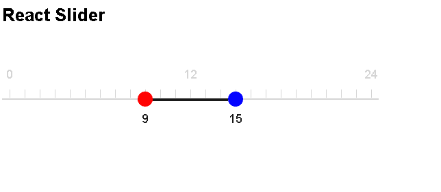
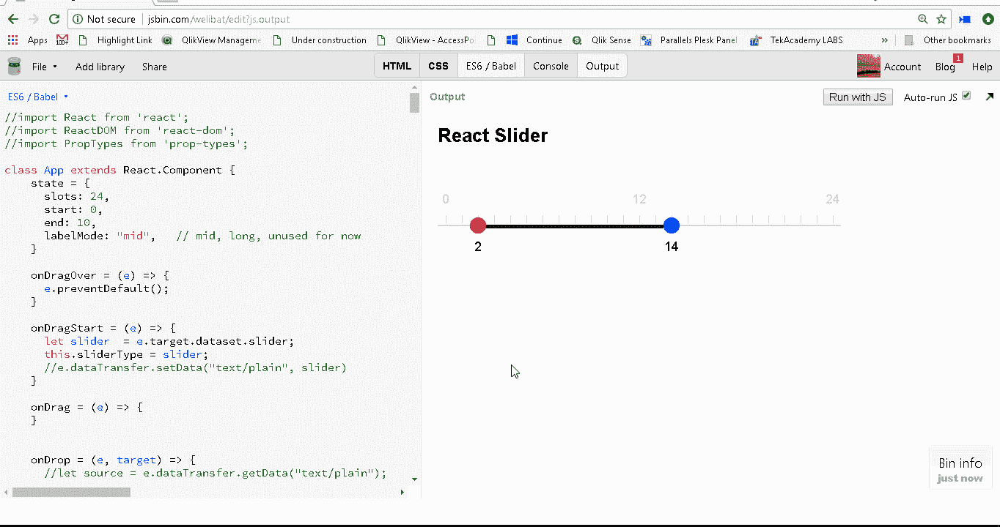
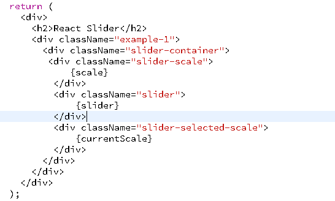
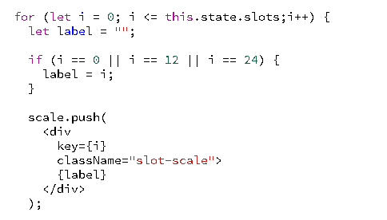
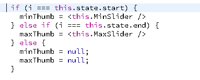
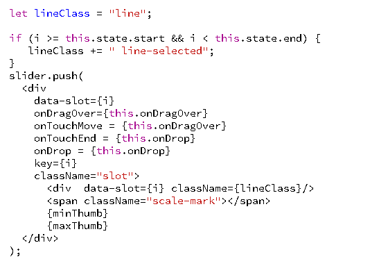
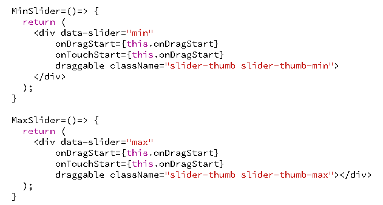
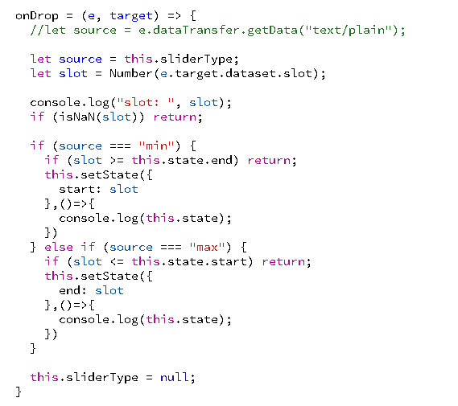

# 如何仅使用和从零开始构建 React 中的范围滑块组件

> 原文：<https://www.freecodecamp.org/news/how-to-build-a-range-slider-component-in-react-from-scratch-using-only-div-and-span-d53e1a62c4a3/>

作者:拉杰什·皮莱

# 如何仅使用和从零开始构建 React 中的范围滑块组件

在本文中，我们将只使用

逐步构建一个 React range slider 组件。我们将通过触摸支持来启用它。

一块 50 左右的

可以做什么？

从头开始构建滑块控件。如果这听起来很有趣，那就继续吧。



最终输出将看起来像下面的动画。



请注意，我开发这个组件是为了给我的 [ReactJS 的学生做一个教学练习——超越 Udemy](https://www.udemy.com/reactjs-beyond-the-basics/?couponCode=MEDIUM_500) 的基础课程，所以它可能有一些边缘情况(我会在遇到时修复)。

您可以使用 HTML5 范围控件并对其进行自定义。但我想采取不同的方法，从零开始建立一些东西。结果就是你在这里看到的。

我们的滑块组件将由以下三个元素组成:

*   滑块范围
*   实际的滑块控件
*   当前选择范围

### 定义组件的状态

让我们从定义我们的状态开始。我只是给你看代码的重要部分。完整的源代码，请参考文末的链接。

```
state = {      slots: 24,      start: 0,      end: 10,      labelMode: "mid",   // mid, long}
```

该状态包含以下属性。

*   slots:要绘制的总时间段(在这种情况下，我将它用作时间选择器，因此它将有 24 个小时的时间段)
*   开始:选择的开始值
*   end:选择的结束值
*   labelMode:当前未使用。但是可以用于定制比例标签呈现。

### render 方法的返回部分

现在让我们看看 render 方法的返回部分。render()方法将由小块功能慢慢组成。

```
return (        <div>          <h2>React Slider</h2>          <div className="example-1">            <div className="slider-container">             <div className="slider-scale">                 {scale}              </div>              <div className="slider">                  {slider}              </div>              <div className="slider-selected-scale">                  {currentScale}              </div>            </div>          </div>        </div>);
```

对于那些在手机上阅读的人来说，下图可能会很方便，因为有时 Medium 会破坏代码格式。



如果你看一下代码，只有三个重要的部分:

*   尺度变数
*   滑块变量
*   当前规模变量

上面的三个变量将负责渲染整个滑块的正确部分。

### 剖析 render()方法

让我们初始化一些变量。将在下面定义的 for 循环中创建`scale`、`slider`和`currentScale` JSX。

```
render () { let scale = []; let slider=[]; let currentScale = []; let minThumb = null; let maxThumb = null
```

```
..... // rest of the code }
```

#### 为“比例”变量创建 JSX

为比例变量创建 JSX 非常简单。我们只是循环遍历状态中的 slots 值，并将一个

推送到带有样式所需 CSS 类的 scale 数组。

if 条件确保我们只打印 i = 0、i = 12 或 i = 24(中等范围)的标签。请随意定制这个。

```
for (let i = 0; i <= this.state.slots;i++) {        let label = "";                if (i == 0 || i == 12 || i == 24) {          label = i;        }                scale.push(          <div             key={i}             className="slot-scale">            {label}          </div>        );
```

以下是图像格式的代码:



#### 为“currentScale”变量创建 JSX

现在让我们继续相同的 for 循环，并创建“current scale”JSX。我们仍然在同一个 for 循环中，因此将根据 this.state.slots 值创建大约 24 个 div。

currentScale 有一个“选定的槽刻度”类。

```
let currentLabel = "";        if (i === this.state.start || i === this.state.end) {   currentLabel = i;}        currentScale.push(   <div       key={i}       className="slot-scale-selected">            {currentLabel}    </div> );
```


该代码非常类似于我们创建的“规模”JSX。

#### 为“滑块”变量创建 JSX

让我们编写一个函数来呈现“slider”jsx。滑块需要两个拇指，一个代表最小，一个代表最大。

让我们首先根据“I”值初始化 thumb 变量。如果‘I’与 this.state.start 相同，那么我们设置 minThumb 变量。否则如果‘I’的值与 this.state.end 相同，那么我们初始化 maxThumb 变量。

```
if (i === this.state.start) {   minThumb = <this.MinSlider />} else if (i === this.state.end) {   maxThumb = <this.MaxSlider />} else {   minThumb = null;   maxThumb = null;}
```



#### 为“滑块”创建 JSX

这里重要的代码片段是 dragover 事件。这是 HTML 拖放正常工作所必需的。

```
let lineClass = "line";        if (i >= this.state.start && i < this.state.end) {   lineClass += " line-selected";}slider.push(   <div         data-slot={i}        onDragOver={this.onDragOver}         onTouchMove = {this.onDragOver}        onTouchEnd = {this.onDrop}        onDrop = {this.onDrop}        key={i}         className="slot">           <div  data-slot={i} className={lineClass}/>           <span className="scale-mark"></span>           {minThumb}           {maxThumb}    </div> );
```



滑块变量需要两个额外的特性来表示滑块上的最小和最大滑块。

滑块 JSX 有额外的事件处理程序来处理放下事件/触摸事件。我们很快就会看到事件处理程序。

“lineClass”样式化/呈现滑块上的线条,“line-selected”类样式化当前选定的范围。

现在让我们在 render 方法之外编写 MinSlider 和 MaxSlider 函数。

#### 呈现最小缩略图的 MinSlider()函数

让我们看一下代码。重要的道具是与拖动相关的事件和可拖动属性。draggable 属性将使该元素可拖动。

我们还添加了触摸事件处理程序。请参考文章底部的链接，为 HTML5 API 添加触摸支持 polyfill。

```
MinSlider=()=> {  return (     <div data-slider="min"            onDragStart={this.onDragStart}            onTouchStart={this.onDragStart}           draggable className="slider-thumb slider-thumb-min">     </div>  );}
```

#### 呈现最小缩略图的 MaxSlider()函数

除了数据和类名之外，MaxSlider 与 MinSlider 几乎相同。

```
MaxSlider=()=> {  return (      <div data-slider="max"          onDragStart={this.onDragStart}           onTouchStart={this.onDragStart}        draggable className="slider-thumb slider-thumb-max">              </div>   );}
```

下面给出代码图像供参考。



### 事件处理

现在让我们看看在我们的

中定义的拖动/触摸事件处理程序来控制滑块元素的移动。

#### dragover:

使用 HTML5 拖放 API 时，需要 dragover 事件来支持拖放区。这里我们唯一需要做的就是调用事件对象上的 preventDefault。

```
onDragOver = (e) => {    e.preventDefault();}
```

#### dragstart:

dragstart 使我们能够存储哪个滑块正在被拖动。请注意，我在这里没有使用 dataTransfer 对象，而是简单地使用一个实例变量来存储它。

```
onDragStart = (e) => {   let slider  = e.target.dataset.slider;   this.sliderType = slider;}
```

e.target.dataset.slider 的值为“min”或“max”，表示正在拖动哪个滑块。

#### ondrop:

ondrop 事件捕捉拇指被放下的位置(在哪个刻度上)。

这是 ondrop 活动中的重要流程:

*   抓取源(无论是最小/最大拇指)
*   获取插槽(放置位置)
*   确认
*   更新插槽(在状态中)
*   重置 sliderType。

```
onDrop = (e, target) => {      let source = this.sliderType;      let slot = Number(e.target.dataset.slot);           if (isNaN(slot)) return;            if (source === "min") {        if (slot >= this.state.end) return;        this.setState({          start: slot        },()=>{          console.log(this.state);        })      } else if (source === "max") {        if (slot <= this.state.start) return;        this.setState({          end: slot        },()=>{          console.log(this.state);        })      }     this.sliderType = null;}
```



#### 完整的源代码和演示可以在这里看到[http://jsbin.com/remodat/edit?output](https://jsbin.com/remodat/edit?js,console)

由于我使用 HTML5 拖放功能来添加触摸，请支持将此多填充引用添加到您的 HTML 文件中。

[**Bernardo-casti lho/dragdroptouch**](https://github.com/Bernardo-Castilho/dragdroptouch/blob/master/DragDropTouch.js)
[*dragdroptouch-poly fill 在移动(触控)设备上启用 HTML5 拖放支持。*github.com](https://github.com/Bernardo-Castilho/dragdroptouch/blob/master/DragDropTouch.js)

### 托德斯

*   将逻辑提取到单独的组件类中
*   测试它并添加自定义。

### 历史

*   2018 年 5 月 21 日—首次发布

页（page 的缩写）s:这个组件是一个非常快速的编码尝试的结果。这将被重构。

**推广**:如果你想支持我们的开源课程[在 12 到 20 周内掌握全栈工程](https://codeburst.io/mastering-front-end-engineering-in-12-to-20-weeks-for-beginners-and-experienced-alike-6dc5172e3295)，那么这里有一张特别的 10 美元优惠券，是给我即将在 udemy 上直播的[react js-Beyond the basic](https://www.udemy.com/reactjs-beyond-the-basics/?couponCode=MEDIUM_500)课程的中型读者的(MEDIUM_500 是优惠券代码，已经在上面的 URL 中标记了)