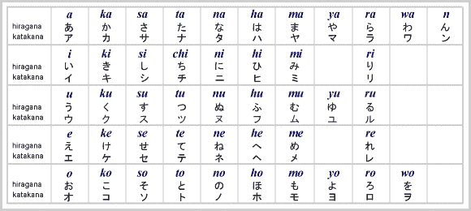
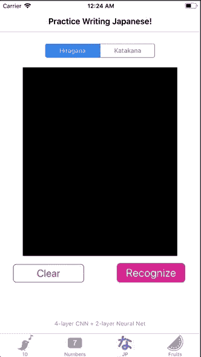
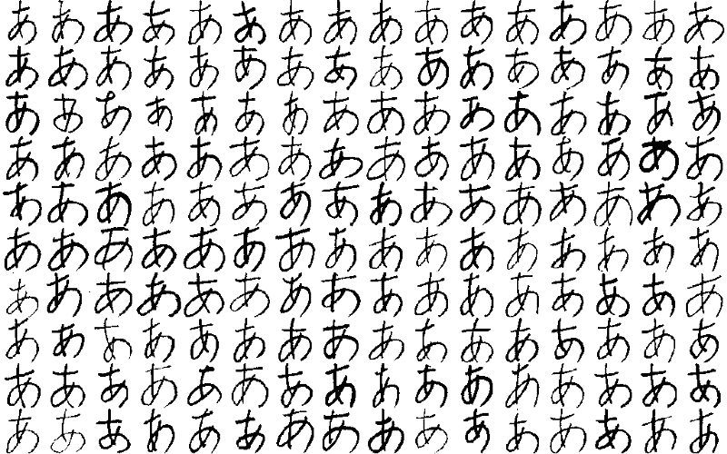
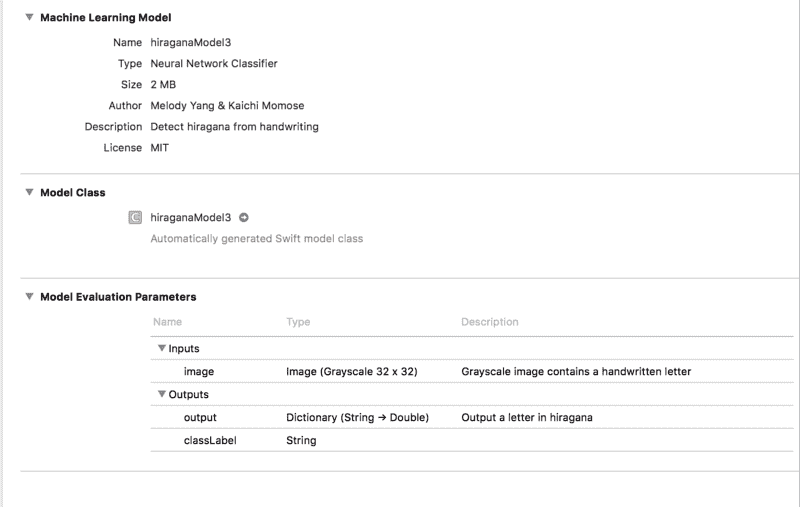
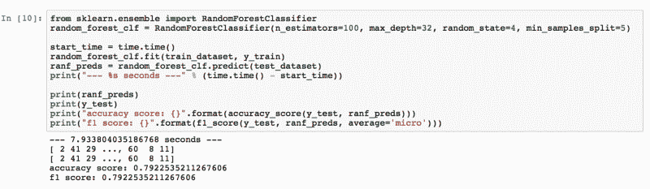

# 我是如何构建手写识别器并将其发布到 App Store 的

> 原文：<https://www.freecodecamp.org/news/build-a-handwriting-recognizer-ship-it-to-app-store-fcce24205b4b/>

#### 从构建卷积神经网络到将 OCR 部署到 iOS

### ✍️项目的动机？？

几个月前，当我在学习如何为 [MNIST 数据集](https://en.wikipedia.org/wiki/MNIST_database)创建深度学习模型时，我最终制作了一个可以识别手写字符的 iOS 应用。

我的朋友 Kaichi Momose 正在开发一款日语学习应用程序，名为 [Nukon](http://bit.ly/nukon-app) 。他碰巧想有一个类似的功能。然后我们合作建立了一个比数字识别器更复杂的东西:一个用于日文字符的 [OCR(光学字符识别/阅读器)](https://en.wikipedia.org/wiki/Optical_character_recognition)([平假名](https://en.wikipedia.org/wiki/Hiragana)和[片假名](https://en.wikipedia.org/wiki/Katakana))。



[Basic Hiragana & Katakana](http://www.kanjipower.com/jws/hiragana.php)

在 Nukon 的开发过程中，没有可用于日文手写识别的 API。我们别无选择，只能建立自己的 OCR。我们从零开始构建一个最大的好处是我们的离线工作。用户可以在没有互联网的大山深处，仍然开放 Nukon 来维持他们学习日语的日常。我们在整个过程中学到了很多，但更重要的是，我们很高兴为我们的用户推出了更好的产品。

本文将分解我们如何为 iOS 应用程序构建日语 OCR 的过程。对于那些想为其他语言/符号构建一个的人来说，可以通过改变数据集来随意定制它。

事不宜迟，让我们来看看将涵盖哪些内容:

**部分 1️⃣:获取数据集并预处理图像**
**部分 2️⃣:构建&训练 CNN**
**部分 3️⃣:将训练好的模型集成到 iOS 中**



What the final app could look like (demo comes from [Recogmize](http://bit.ly/recogmize))

### 获取数据集并预处理图像？

数据集来自于 [ETL 字符数据库](http://etlcdb.db.aist.go.jp)，其中包含九组手写字符和符号的图像。因为我们要为平假名构建一个 OCR， [ETL8](http://etlcdb.db.aist.go.jp/?page_id=2461) 是我们将使用的数据集。



Images of handwritten “あ” produced by 160 writers (from ETL8)

为了从数据库中获取图像，我们需要一些助手函数来读取和存储`.npz`格式的图像。

```
import struct
import numpy as np
from PIL import Image

sz_record = 8199

def read_record_ETL8G(f):
    s = f.read(sz_record)
    r = struct.unpack('>2H8sI4B4H2B30x8128s11x', s)
    iF = Image.frombytes('F', (128, 127), r[14], 'bit', 4)
    iL = iF.convert('L')
    return r + (iL,)

def read_hiragana():
    # Type of characters = 70, person = 160, y = 127, x = 128
    ary = np.zeros([71, 160, 127, 128], dtype=np.uint8)

    for j in range(1, 33):
        filename = '../../ETL8G/ETL8G_{:02d}'.format(j)
        with open(filename, 'rb') as f:
            for id_dataset in range(5):
                moji = 0
                for i in range(956):
                    r = read_record_ETL8G(f)
                    if b'.HIRA' in r[2] or b'.WO.' in r[2]:
                        if not b'KAI' in r[2] and not b'HEI' in r[2]:
                            ary[moji, (j - 1) * 5 + id_dataset] = np.array(r[-1])
                            moji += 1
    np.savez_compressed("hiragana.npz", ary)
```

一旦我们保存了`hiragana.npz`，让我们开始处理图像，加载文件并**将图像尺寸调整为 32x32 像素**。我们还将添加数据增强，以生成旋转和缩放的额外图像。当我们的模型从多种角度对字符图像进行训练时，我们的模型可以更好地适应人的笔迹。

```
import scipy.misc
from keras.layers import Conv2D, MaxPooling2D
from keras.layers import Dense, Dropout, Activation, Flatten
from keras.models import Sequential
from keras.preprocessing.image import ImageDataGenerator
from keras.utils import np_utils
from sklearn.model_selection import train_test_split

# 71 characters
nb_classes = 71
# input image dimensions
img_rows, img_cols = 32, 32

ary = np.load("hiragana.npz")['arr_0'].reshape([-1, 127, 128]).astype(np.float32) / 15
X_train = np.zeros([nb_classes * 160, img_rows, img_cols], dtype=np.float32)
for i in range(nb_classes * 160):
    X_train[i] = scipy.misc.imresize(ary[i], (img_rows, img_cols), mode='F')

y_train = np.repeat(np.arange(nb_classes), 160)

X_train, X_test, y_train, y_test = train_test_split(X_train, y_train, test_size=0.2)

# convert class vectors to categorical matrices
y_train = np_utils.to_categorical(y_train, nb_classes)
y_test = np_utils.to_categorical(y_test, nb_classes)

# data augmentation
datagen = ImageDataGenerator(rotation_range=15, zoom_range=0.20)
datagen.fit(X_train)
```

### 建立和训练 CNN？️

现在有趣的部分来了！我们将使用 Keras 为我们的模型构建一个 CNN(卷积神经网络)。当我第一次建立模型时，我试验了超参数并多次调整它们。下面的组合给了我最高的准确率——98.77%。您可以随意使用不同的参数。

```
model = Sequential()

def model_6_layers():
    model.add(Conv2D(32, 3, 3, input_shape=input_shape))
    model.add(Activation('relu'))
    model.add(Conv2D(32, 3, 3))
    model.add(Activation('relu'))
    model.add(MaxPooling2D(pool_size=(2, 2)))
    model.add(Dropout(0.5))

    model.add(Conv2D(64, 3, 3))
    model.add(Activation('relu'))
    model.add(Conv2D(64, 3, 3))
    model.add(Activation('relu'))
    model.add(MaxPooling2D(pool_size=(2, 2)))
    model.add(Dropout(0.5))

    model.add(Flatten())
    model.add(Dense(256))
    model.add(Activation('relu'))
    model.add(Dropout(0.5))
    model.add(Dense(nb_classes))
    model.add(Activation('softmax'))

model_6_layers()

model.compile(loss='categorical_crossentropy', 
              optimizer='adam', metrics=['accuracy'])
model.fit_generator(datagen.flow(X_train, y_train, batch_size=16), 
                    samples_per_epoch=X_train.shape[0],
                    nb_epoch=30, validation_data=(X_test, y_test))
```

如果您在培训步骤中发现**模型的性能不令人满意**，这里有一些提示:

#### 模型*过拟合*

这意味着该模型不是很通用。查看这篇[文章](https://elitedatascience.com/overfitting-in-machine-learning#overfitting-vs-underfitting)以获得直观的解释。

**如何检测过拟合** : `acc`(准确率)持续走高，而`val_acc`(验证准确率)在训练过程中却相反。

**过拟合的一些解决方法**:正则化(例如。辍学)、数据扩充、数据集质量的提高

#### 如何知道模型是否在“学习”

随着训练的进行，如果`val_loss`(验证损失)上升或不下降，则模型没有学习。

使用 [TensorBoard](https://keras.io/callbacks/#tensorboard) —它提供模型性能随时间变化的可视化。它摆脱了查看每一个时期并不断比较数值的烦人任务。

由于我们对自己的准确性感到满意，因此在将权重和模型配置保存为文件之前，我们删除了缺失层。

```
for k in model.layers:
    if type(k) is keras.layers.Dropout:
        model.layers.remove(k)

model.save('hiraganaModel.h5')
```

在进入 iOS 部分之前，剩下的唯一任务是将`hiraganaModel.h5`转换成 CoreML 模型。

```
import coremltools

output_labels = [
'あ', 'い', 'う', 'え', 'お',
'か', 'く', 'こ', 'し', 'せ',
'た', 'つ', 'と', 'に', 'ね',
'は', 'ふ', 'ほ', 'み', 'め',
'や', 'ゆ', 'よ', 'ら', 'り',
'る', 'わ', 'が', 'げ', 'じ',
'ぞ', 'だ', 'ぢ', 'づ', 'で',
'ど', 'ば', 'び',
'ぶ', 'べ', 'ぼ', 'ぱ', 'ぴ',
'ぷ', 'ぺ', 'ぽ',
'き', 'け', 'さ', 'す', 'そ',
'ち', 'て', 'な', 'ぬ', 'の',
'ひ', 'へ', 'ま', 'む', 'も',
'れ', 'を', 'ぎ', 'ご', 'ず',
'ぜ', 'ん', 'ぐ', 'ざ', 'ろ']

scale = 1/255.

coreml_model = coremltools.converters.keras.convert('./hiraganaModel.h5',
                                                    input_names='image',
                                                    image_input_names='image',
                                                    output_names='output',
                                                    class_labels= output_labels,
                                                    image_scale=scale)
coreml_model.author = 'Your Name'
coreml_model.license = 'MIT'
coreml_model.short_description = 'Detect hiragana character from handwriting'
coreml_model.input_description['image'] = 'Grayscale image containing a handwritten character'
coreml_model.output_description['output'] = 'Output a character in hiragana'
coreml_model.save('hiraganaModel.mlmodel')
```

`output_labels`都是我们稍后会在 iOS 中看到的可能输出。

有趣的事实:如果你懂日语，你可能知道输出字符的顺序与平假名的“字母顺序”不匹配。我们花了一些时间才意识到 ETL8 中的图像并不是按照“字母顺序”排列的(感谢 Kaichi 意识到这一点)。这个数据集是由一所日本大学编制的，尽管…？

### 将训练好的模型集成到 iOS 中？

我们终于把所有东西都拼在一起了！将`hiraganaModel.mlmodel`拖放到 Xcode 项目中。然后您会看到类似这样的内容:



Details of mlmodel in Xcode workspace

**注意** : Xcode 在复制模型时会创建一个工作空间。我们需要将我们的编码环境切换到**工作空间**，否则 ML 模型将无法工作！

最终目标是让我们的平假名模型通过传入图像来预测字符。为了实现这一点，我们将创建一个简单的 UI，以便用户可以书写，并且我们将以图像格式存储用户的书写。最后，我们检索图像的像素值，并将它们提供给我们的模型。

让我们一步一步来:

1.  用`UIBezierPath`在`UIView`上“画”字符

```
import UIKit

class viewController: UIViewController {

    @IBOutlet weak var canvas: UIView!
    var path = UIBezierPath()
    var startPoint = CGPoint()
    var touchPoint = CGPoint()

    override func viewDidLoad() {
        super.viewDidLoad()
        canvas.clipsToBounds = true
        canvas.isMultipleTouchEnabled = true
    }

    override func touchesBegan(_ touches: Set<UITouch>, with event: UIEvent?) {
        let touch = touches.first
        if let point = touch?.location(in: canvas) {
            startPoint = point
        }
    }

    override func touchesMoved(_ touches: Set<UITouch>, with event: UIEvent?) {
        let touch = touches.first
        if let point = touch?.location(in: canvas) {
            touchPoint = point
        }

        path.move(to: startPoint)
        path.addLine(to: touchPoint)
        startPoint = touchPoint
        draw()
    }

    func draw() {
        let strokeLayer = CAShapeLayer()
        strokeLayer.fillColor = nil
        strokeLayer.lineWidth = 8
        strokeLayer.strokeColor = UIColor.orange.cgColor
        strokeLayer.path = path.cgPath
        canvas.layer.addSublayer(strokeLayer)
    }

    // clear the drawing in view
    @IBAction func clearPressed(_ sender: UIButton) {
        path.removeAllPoints()
        canvas.layer.sublayers = nil
        canvas.setNeedsDisplay()
    }
}
```

`strokeLayer.strokeColor`可以是任何颜色。但是`canvas`的背景色必须是**黑色**。尽管我们的训练图像具有白色背景和黑色笔画，但 ML 模型对这种风格的输入图像反应不佳。

2.把`UIView`变成`UIImage`，用 [CVPixelBuffer](https://developer.apple.com/documentation/corevideo/cvpixelbuffer-q2e) 检索像素值

在扩展中，有两个助手函数。它们一起将图像转换为像素缓冲区，相当于像素值。输入`width`和`height`都应该是 **32** ，因为**我们模型的输入尺寸是 32×32 像素。**

一旦我们有了`pixelBuffer`，我们就可以调用`model.prediction()`并传入`pixelBuffer`。我们走吧！我们可以有一个`classLabel`的输出！

```
@IBAction func recognizePressed(_ sender: UIButton) {
        // Turn view into an image
        let resultImage = UIImage.init(view: canvas)
        let pixelBuffer = resultImage.pixelBufferGray(width: 32, height: 32)
        let model = hiraganaModel3()
        // output a Hiragana character
        let output = try? model.prediction(image: pixelBuffer!)
        print(output?.classLabel)
}

extension UIImage {
    // Resizes the image to width x height and converts it to a grayscale CVPixelBuffer
    func pixelBufferGray(width: Int, height: Int) -> CVPixelBuffer? {
        return _pixelBuffer(width: width, height: height,
                           pixelFormatType: kCVPixelFormatType_OneComponent8,
                           colorSpace: CGColorSpaceCreateDeviceGray(),
                           alphaInfo: .none)
    }

    func _pixelBuffer(width: Int, height: Int, pixelFormatType: OSType,
                     colorSpace: CGColorSpace, alphaInfo: CGImageAlphaInfo) -> CVPixelBuffer? {
        var maybePixelBuffer: CVPixelBuffer?
        let attrs = [kCVPixelBufferCGImageCompatibilityKey: kCFBooleanTrue,
                     kCVPixelBufferCGBitmapContextCompatibilityKey: kCFBooleanTrue]
        let status = CVPixelBufferCreate(kCFAllocatorDefault,
                                         width,
                                         height,
                                         pixelFormatType,
                                         attrs as CFDictionary,
                                         &maybePixelBuffer)

        guard status == kCVReturnSuccess, let pixelBuffer = maybePixelBuffer else {
            return nil
        }

        CVPixelBufferLockBaseAddress(pixelBuffer, CVPixelBufferLockFlags(rawValue: 0))
        let pixelData = CVPixelBufferGetBaseAddress(pixelBuffer)

        guard let context = CGContext(data: pixelData,
                                      width: width,
                                      height: height,
                                      bitsPerComponent: 8,
                                      bytesPerRow: CVPixelBufferGetBytesPerRow(pixelBuffer),
                                      space: colorSpace,
                                      bitmapInfo: alphaInfo.rawValue)
            else {
                return nil
        }

        UIGraphicsPushContext(context)
        context.translateBy(x: 0, y: CGFloat(height))
        context.scaleBy(x: 1, y: -1)
        self.draw(in: CGRect(x: 0, y: 0, width: width, height: height))
        UIGraphicsPopContext()

        CVPixelBufferUnlockBaseAddress(pixelBuffer, CVPixelBufferLockFlags(rawValue: 0))
        return pixelBuffer
    }
} 
```

3.用`UIAlertController`显示输出

这一步完全是可选的。如开头的 GIF 所示，我添加了一个 alert 控制器来通知结果。

```
func informResultPopUp(message: String) {
        let alertController = UIAlertController(title: message, 
                                                message: nil, 
                                                preferredStyle: .alert)
        let ok = UIAlertAction(title: "Ok", style: .default, handler: { action in
            self.dismiss(animated: true, completion: nil)
        })
        alertController.addAction(ok)
        self.present(alertController, animated: true) { () in
        }
}
```

瞧啊。我们刚刚构建了一个可供演示(和应用商店)的 OCR！？？

### 结论？

构建一个 OCR 并不难。正如您所看到的，这篇文章由我在构建这个项目时遇到的步骤和问题组成。我喜欢通过将 Python 与 iOS 连接来演示大量 Python 代码的过程，我打算继续这样做。

我希望这篇文章能为那些想构建 OCR 但不知道从哪里开始的人提供一些有用的信息。

你可以在这里 *找到**源代码** [。](https://github.com/melodyfs/Build_OCR)*

**奖金**:如果你有兴趣尝试浅层算法，那就继续读下去吧！

### 【可选】用浅层算法训练？

在实现 CNN 之前，Kaichi 和我测试了其他机器学习算法，以确定它们是否可以完成这项工作(并为我们节省一些计算成本！).我们选了 KNN 和兰登森林。

为了评估它们的性能，我们将基线精度定义为 1/71 = 0.014。

我们假设一个不懂日语的人有 1.4%的几率猜对一个汉字。

因此，如果模型的精度能超过 1.4%，那么它就能做得很好。让我们看看是不是这样。？

#### KNN


Trained with KNN

我们得到的最终准确率为 54.84%。已经远远高于 1.4%了！

#### 随机森林



Trained with Random Forest

准确率 79.23%，所以随机森林超出了我们的预期。在调整超参数时，我们通过增加估计器的数量和树的深度得到了更好的结果。我们认为森林中有更多的树(评估者)意味着图像中更多的特征被学习。此外，树越深，它从特征中学到的细节就越多。

如果你有兴趣了解更多，我找到了这篇用随机森林讨论图像分类的[论文](http://www.cs.huji.ac.il/~daphna/course/CoursePapers/bosch07a.pdf)。

*感谢您的阅读。欢迎任何想法和反馈！*