# 使用 Viterbi 算法深入研究词性标注

> 原文：<https://www.freecodecamp.org/news/a-deep-dive-into-part-of-speech-tagging-using-viterbi-algorithm-17c8de32e8bc/>

作者:Sachin Malhotra

# 使用 Viterbi 算法深入研究词性标注

*由[萨钦马尔霍特拉](https://medium.com/@sachinmalhotra)和[达薇亚戈达亚尔](https://medium.com/@divyagodayal)*

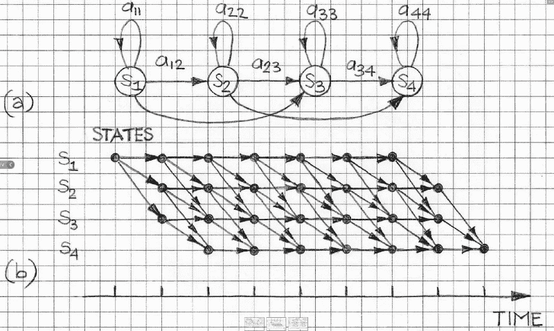

Source: [https://www.vocal.com/echo-cancellation/viterbi-algorithm-in-speech-enhancement-and-hmm/](https://www.vocal.com/echo-cancellation/viterbi-algorithm-in-speech-enhancement-and-hmm/)

欢迎回来，看守人！

如果你忘记了我们在上一篇文章中试图解决的问题，让我们为你修改一下。

有个淘气的孩子彼得，他要去纠缠他的新看护人，就是你！

作为一名看护人，你最重要的任务之一就是帮彼得掖好被子，确保他熟睡。一旦你给他盖好被子，你要确保他真的睡着了，而不是在搞恶作剧。

但是，你不能再进入这个房间，因为那肯定会吵醒彼得。你能听到的只有可能来自房间的噪音。

要么房间里很安静，要么房间里有 T2 噪音。这些是你的观察。

作为看守人你所拥有的是:

*   一组观察值，基本上是一个序列，包含随着时间推移的**噪声**或**安静**，以及
*   Peter 的妈妈提供了一个状态图，她恰好是一名神经科学家，其中包含了所有不同的概率集，您可以使用这些概率集来解决下面定义的问题。

### 问题是

给定状态图和一段时间内 N 次观察的序列，我们需要说出婴儿在当前时间点的状态。在数学上，我们在时间`t0, t1, t2 .... tN`上有 N 次观察。我们想知道彼得是醒着还是睡着了，或者更确切地说，在时间`tN+1`更有可能是哪种状态。

如果这些对你来说像是希腊语，去读一下[以前的文章](https://medium.com/@divyagodayal/part-of-speech-tagging-hmms-part-1-953d45338f24)来温习一下马尔可夫链模型、隐马尔可夫模型和词性标注。

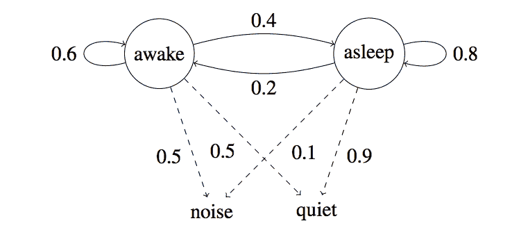

The state diagram that Peter’s mom gave you before leaving.

在那篇[以前的文章](https://medium.com/@divyagodayal/part-of-speech-tagging-hmms-part-1-953d45338f24)中，我们已经使用隐马尔可夫模型简要地模拟了词性标注的问题。

彼得是否睡着的问题只是为了更好地理解这两篇文章中涉及的一些核心概念而提出的一个示例问题。在核心，文章处理解决词性标注问题使用隐马尔可夫模型。

因此，在继续讨论**维特比算法**之前，让我们先来看看如何使用 HMMs 对标记问题建模的更详细的解释。

### 生成模型和噪声信道模型

使用监督学习方法解决了自然语言处理中的许多问题。

机器学习中的监督问题定义如下。我们假设训练例子`(x(1), y(1))`。。。`(x(m) , y(m))`，其中每个例子由一个输入 x(i)和一个标签 y(i)组成。我们用 X 表示可能的输入集合，用 Y 表示可能的标签集合。我们的任务是学习一个函数 f : X → Y，它将任何输入 X 映射到一个标签 f(x)。

在标记问题中，每个 x(i)将是一个单词序列`X1 X2 X3 …. Xn(i)`，每个 y(i)将是一个标签序列`Y1 Y2 Y3 … Yn(i)`(我们使用 n(i)来表示第 I 个训练示例的长度)。x 将指所有序列 x1 的集合。。。xn，Y 将是所有标签序列 y1 的集合。。。yn。我们的任务是学习一个函数 f : X → Y，它将句子映射到标签序列。

对这个问题进行估计的直观方法是使用条件概率。`p(y | x)`这是给定输入 x 时输出 y 的概率。将使用训练样本来估计模型的参数。最后，给定一个我们想要找到的未知输入`x`

`f(x) = arg max(p(y | x)) ∀y ∊ Y`

这是在给定训练数据的情况下解决这个一般性问题的条件模型。机器学习和自然语言处理中最常用的另一种方法是使用**生成模型*。***

在生成模型中，我们不是直接估计条件分布`p(y|x)`，而是对所有(x，y)对的联合概率`p(x, y)`进行建模。

我们可以使用贝叶斯规则将联合概率进一步分解为更简单的值:

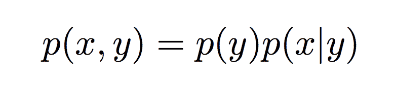

*   `p(y)`是属于标签 y 的任何输入的先验概率
*   `p(x | y)`是给定标签 y，输入 x 的条件概率。

我们可以使用这种分解和贝叶斯规则来确定条件概率。

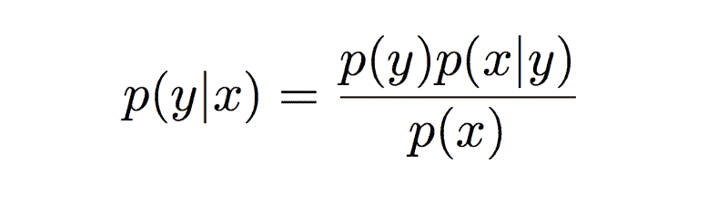

记住，我们想估计函数

```
f(x) = arg max( p(y|x) ) ∀y ∊ Y
```

```
f(x) = arg max( p(y) * p(x | y) )
```

我们在这里跳过分母的原因是因为无论考虑什么输出标签，概率`p(x)`都保持不变。因此，从计算的角度来看，它被视为一个**归一化常数，通常被忽略。**

将联合概率分解为项`p(y)`和`p(x|y)` 的模型通常被称为**噪声信道模型**。直观地说，当我们看到一个测试示例 x 时，我们假设它是分两步生成的:

1.  首先，已经以概率 p(y)选择了标签 y
2.  第二，示例 x 是从分布 p(x|y)生成的。模型 p(x|y)可以被解释为一个**“信道”**，它将一个标签 y 作为它的输入，并将其分解以产生 x 作为它的输出。

### 生成词性标注模型

让我们假设有限的单词集合 v 和有限的标签序列 k。那么集合 s 将是所有序列标签对`<x1, x2, x3 ... xn, y1, y2, y3, ...,` yn >的集合，使得`n >` 0 ∀x `∊ V a` nd ∀y ∊ K

生成标记模型是这样一种模型，其中

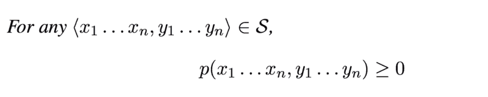

2.


给定一个生成标签模型，我们之前讨论的从输入到输出的功能就变成了

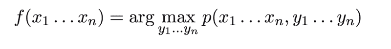

因此，对于任何给定的单词输入序列，输出是来自模型的最大概率标签序列。定义了生成模型之后，我们需要弄清楚三件不同的事情:

1.  我们如何确切地定义生成模型概率`p(<x1, x2, x3 ... xn, y1, y2, y3, ..., y` n >
2.  我们如何估计模型的参数，以及
3.  我们如何高效地计算


让我们看看如何一起回答这三个问题，一个是我们的示例问题，另一个是手头的实际问题:词性标注。

### 定义生成模型

让我们首先看看如何使用 HMM 来估计概率`p(x1 .. xn, y1 .. yn)`。

我们可以有任何 N 元模型 HMM，它考虑大小为 N 的前一个窗口中的事件。

以下提供的公式对应于一个**三元模型**隐马尔可夫模型。

#### 三元隐马尔可夫模型

三元模型隐藏马尔可夫模型可以定义为

*   状态的有限集合。
*   一系列的观察。
*   q(s|u，v)

*   e(x|s)

然后，生成模型概率将被估计为

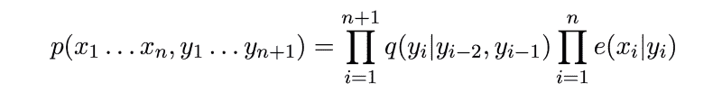

至于我们正在考虑的婴儿睡眠问题，我们将只有两种可能的状态:婴儿要么醒着，要么睡着了。随着时间的推移，看护者只能进行两次观察。要么是房间里传来噪音，要么是房间里绝对安静。观察值和状态的顺序可以表示如下:

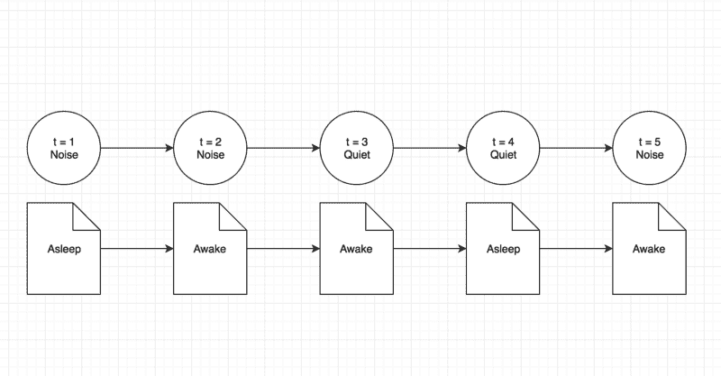

Observations and States over time for the baby sleeping problem

谈到词性标注问题，状态将由分配给单词的实际标签来表示。这些话就是我们的观察。我们之所以说标签是我们的状态，是因为在隐马尔可夫模型中，状态总是隐藏的，我们所拥有的只是对我们可见的一组观察值。类似地，词性标注问题的状态和观察值的顺序将是

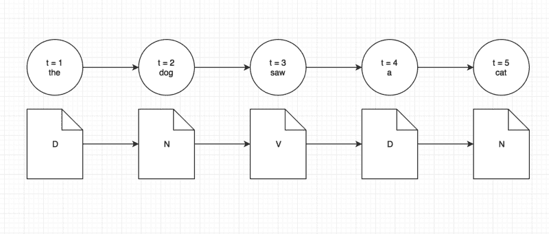

Observations and States over time for the POS tagging problem

### 估计模型的参数

我们将假设我们可以访问一些训练数据。训练数据由一组例子组成，其中每个例子是由观察值组成的序列，每个观察值与一个状态相关联。给定这些数据，我们如何估计模型的参数？

通过从我们拥有的训练语料库中读取各种计数，然后计算最大似然估计，来估计模型的参数:


Transition probability and Emission probability for a Trigram HMM

我们已经知道，第一项代表跃迁几率，第二项代表发射几率。让我们来看看上述四种不同的计数是什么意思。

1.  **c(u，v，s)** 表示状态 u，v 和 s 的三元组计数。这意味着它表示三个状态 u，v 和 s 在训练语料库中以该顺序一起出现的次数。
2.  **c(u，v)** 沿着与三元组计数类似的路线，这是给定训练语料库的状态 u 和 v 的二元组计数。
3.  **c(s → x)** 是训练集中状态 s 和观测 x 相互配对的次数。最后，
4.  **c(s)** 是被标记为状态 s 的观测值的先验概率

让我们先来看一个玩具问题的样本训练集，看看如何使用它来计算转移概率和发射概率。

蓝色标记代表跃迁概率，红色标记用于计算发射概率。

请注意，由于示例问题只有两个不同的状态和两个不同的观察值，并且假设训练集非常小，下面所示的示例问题的计算使用了**二元模型**HMM 而不是三元模型 HMM。

彼得的母亲保存着观察和状态的记录。因此，她甚至给你提供了一个训练语料库，来帮助你得到跃迁和发射概率。

#### 转移概率示例:

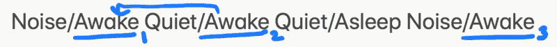

Training Corpus

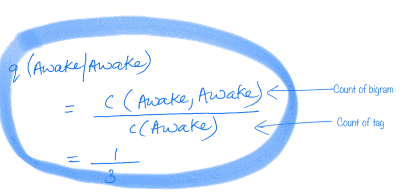

Calculations for Awake appearing after Awake

#### 排放概率示例:

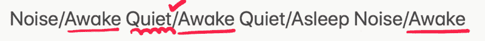

Training corpus

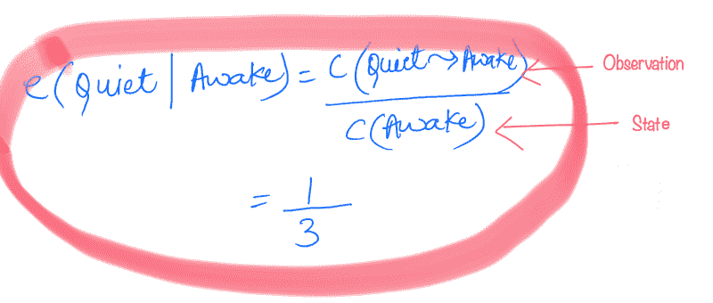

Calculations for observing ‘Quiet’ when the state is ‘Awake’

这非常简单，因为训练集非常小。让我们看一个针对词性标注实际问题的样本训练集。在这里，我们可以考虑一个三元模型 HMM，我们将显示相应的计算。

我们将使用下面的句子作为训练数据的语料库(符号 word/TAG 表示带有特定词性标签的单词)。

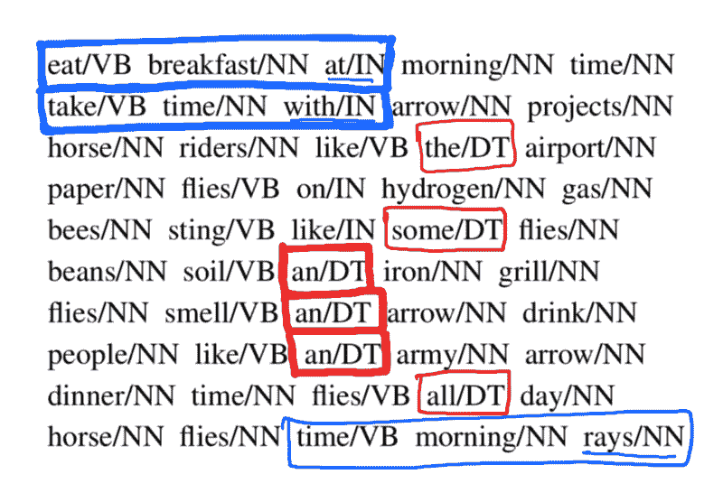

我们拥有的训练集是一个带标签的句子语料库。每个句子都由带有相应词性标签的单词组成。例如:- eat/VB 表示单词是“eat ”,在这个上下文中，这个句子的词性标记是“VB ”,即动词短语。让我们看一个计算跃迁几率和发射几率的例子，就像我们看到的婴儿睡眠问题一样。

#### **转移概率**

假设我们要计算转移概率 q(IN | VB，NN)。为此，我们看看我们在训练语料库中以该特定顺序看到三元模型(VB，NN，IN)的次数。然后我们将它除以我们在语料库中看到二元模型(VB，NN)的总次数。

#### **排放概率**

假设我们想求出发射概率 e(an | DT)。为此，我们查看单词“an”在语料库中被标记为“DT”的次数，并用它除以我们在语料库中看到标签“DT”的总次数。

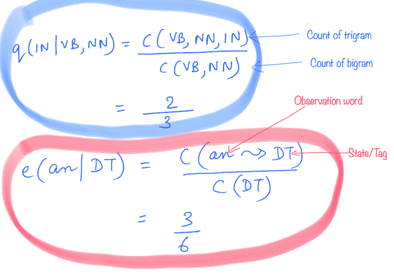

所以，如果你看看这些计算，它表明计算模型的参数并不计算昂贵。也就是说，我们不必多次遍历训练数据来计算这些参数。我们所需要的只是一堆不同的计数，对训练集的一次遍历应该能为我们提供这些。

让我们继续，看看给定生成模型后，我们需要查看的最后一步。这一步是有效的计算


我们将研究著名的维特比算法来进行计算。

### 寻找最可能的序列—维特比算法

最后，我们将解决给定一组观察值 x1 … xn，找到最可能的标签序列的问题。也就是说，我们要找出

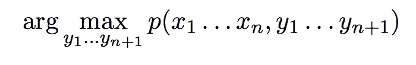

这里的概率是用跃迁和发射概率来表示的，我们在文章的前一部分已经学过如何计算了。提醒您一下，给定 n 个时间步长上的一系列观察值，一系列标签的概率公式为

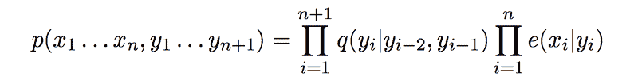

在研究解决这个问题的优化算法之前，让我们先来看看解决这个问题的一个简单的强力方法。基本上，我们需要在给定的一组观察值下，从一组有限的可能的标记序列中找出最可能的标记序列。让我们看看一个小例子中可能的序列总数，这个例子是我们的示例问题，也是词性标注问题。

假设我们对示例问题有以下一组观察结果。

```
Noise     Quiet     Noise
```

我们有两个可能的标签{睡着和醒着}。上面观察到的一些可能的标签序列是:

```
Awake      Awake     Awake
```

```
Awake      Awake     Asleep
```

```
Awake      Asleep    Awake
```

```
Awake      Asleep    Asleep
```

总共我们可以有 2 = 8 个可能的序列。这可能看起来不是很多，但如果我们随着时间的推移增加观察次数，序列的数量将呈指数增长。这是当我们只有两个可能的标签时的情况。如果我们有更多呢？如词性标注的情况。

例如，考虑这个句子

```
the dog barks
```

假设可能的标签集是{D，N，V}，让我们看看一些可能的标签序列:

```
D     D     DD     D     ND     D     VD     N     DD     N     ND     N     V ... etc
```

这里，我们有 3 = 27 个可能的标签序列。正如你所看到的，这个句子非常短，标签的数量也不是很多。在实践中，我们可以拥有比三个单词更长的句子。那么我们所能支配的独特标签的数量也会太高，以至于无法遵循这种枚举方法并以这种方式找到最佳的标签序列。

因此，序列数量的指数增长意味着，对于任何合理长度的句子，暴力方法都不会奏效，因为它需要太多的时间来执行。

代替这种强力方法，我们将看到我们可以使用称为 **Viterbi 算法的动态编程算法有效地找到最可能的标签序列。**

让我们首先定义一些对定义算法本身有用的术语。我们已经知道，给定一组观察值的标记序列的概率可以根据转移概率和发射概率来定义。从数学上来说，是的

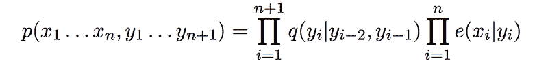

让我们来看一个截断的版本

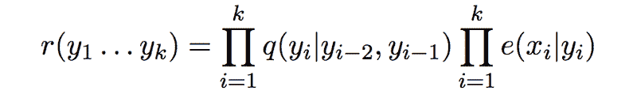

我们称之为长度为 k 的序列的成本。

所以“r”的定义只是考虑了概率定义的前 k 项，其中 k ∊ {1..n}和任何标签序列 y1…yk。

接下来，我们有集合 S(k，u，v ),它基本上是长度为 k 的所有标签序列的集合，以二元模型(u，v)结束，即

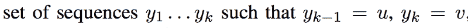

最后，我们定义了π(k，u，v)项，它基本上是代价最大的序列。

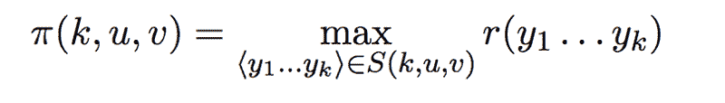

维特比算法背后的主要思想是，我们可以以递归、记忆的方式有效地计算π(k，u，v)项的值。为了递归地定义算法，让我们看看递归的基本情况。

```
π(0, *, *) = 1
```

```
π(0, u, v) = 0
```

由于我们正在考虑三元模型 HMM，我们将把所有三元模型作为维特比算法执行的一部分来考虑。

现在，我们可以从句子的前三个单词开始第一个三元模型窗口，但是然后模型会错过第一个单词或前两个单词独立出现的那些三元模型。出于这个原因，我们认为两个特殊的开始符号是`*`，所以我们的句子变成了

```
*    *    x1   x2   x3   ......         xn
```

我们考虑的第一个三元模型是(*，*，x1)，第二个是(*，x1，x2)。

现在我们已经有了所有的术语，我们终于可以看看算法的递归定义，这基本上是算法的核心。

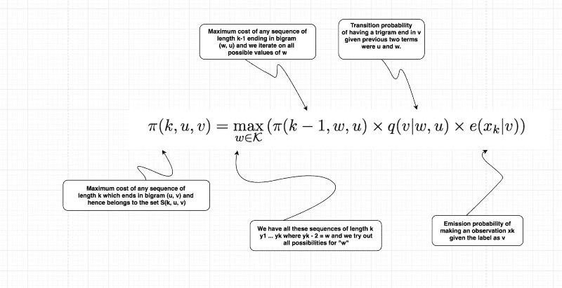

这个定义显然是递归的，因为我们试图计算一个π项，而我们在递归关系中使用另一个 k 值较低的π项。

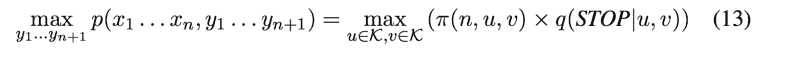

每个序列都以一个特殊的停止符号结束。对于三元模型，我们在开头也有两个特殊的开始符号“*”。

看看整个算法的伪代码。


该算法首先使用递归
定义填充π(k，u，v)值。然后，它使用前面描述的恒等式来计算任何序列的最高概率。

该算法的运行时间为 O(n|K|)，因此它与序列长度成线性关系，与标签数量成立方关系。

注意:我们将只展示基于**二元模型 HMM 的婴儿睡眠问题和词性标注问题的计算。**三元模型的计算留给读者自己去做。但是附在本文末尾的代码是基于三元模型 HMM 的。只是当考虑二元 HMM 而不是三元 HMM 时，维特比算法的计算更容易解释和描述。

因此，在展示维特比算法的计算之前，让我们看看基于二元 HMM 的递归公式。

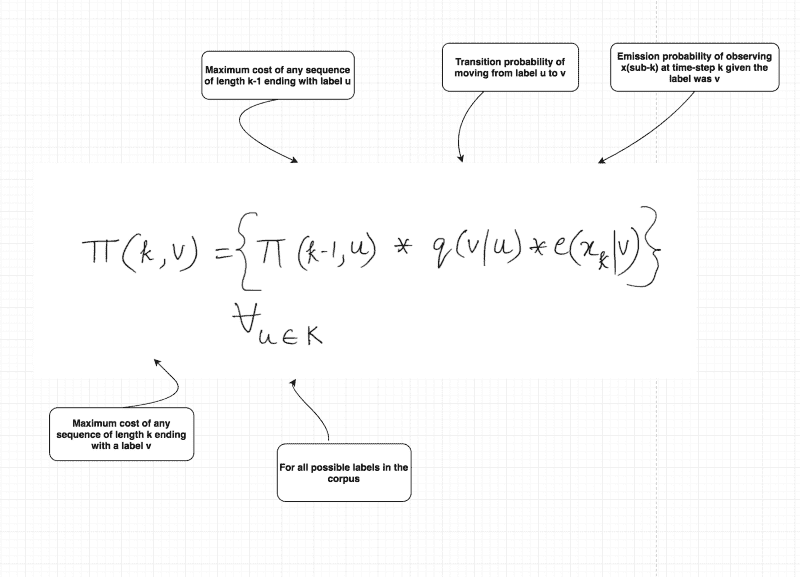

这与我们之前看到的三元模型非常相似，只是现在我们只关注当前标签和之前的标签，而不是之前的两个。算法的复杂度现在变成 O(n|K|)。

#### 婴儿睡眠问题的计算

现在，我们已经为维特比算法准备好了递归公式，让我们首先来看看我们的示例问题(即婴儿睡觉问题)的相同计算示例，然后再看看词性标注版本。

注意，当我们处于这一步骤时，即，在给定一系列时间步骤上的一组观察值的情况下，维特比算法寻找最可能的标签序列的计算，我们假设已经从给定的语料库计算了转移和发射概率。让我们来看一个婴儿睡眠问题的转移和发射概率的例子，我们将使用它来计算算法。

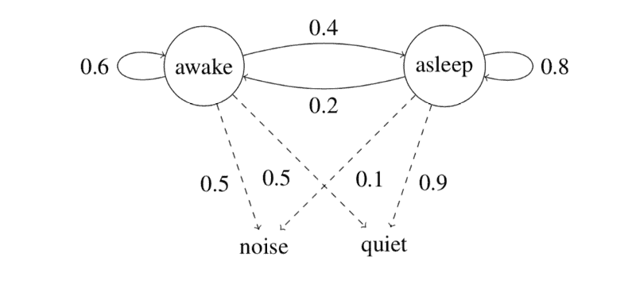

婴儿从醒着开始，在房间里呆了三个时间点，t1。。。t3(马尔可夫链的三次迭代)。观察结果是:安静，安静，噪音。请看下图，它显示了两个时间步长的计算。随后将显示包含所有最终值的完整图表。

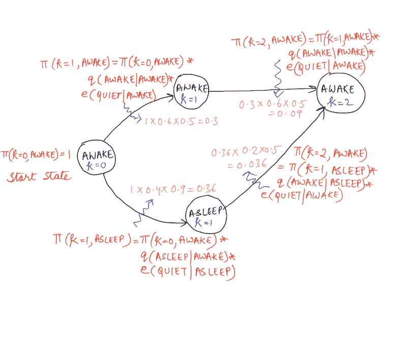

为了简单起见，我们没有在上图中显示 k = 2 时“睡眠”状态的计算和 k = 3 时的计算。

现在我们已经有了所有这些计算，我们想要计算婴儿在不同的给定时间步骤中最有可能处于的状态序列。因此，对于 k = 2 和清醒状态，我们想知道在 k = 1 时最有可能转变为 k = 2 时的清醒状态。(k = 2 表示从 0 开始的长度为 3 的状态序列，t = 2 表示时间步长 2 的状态。给定 t = 0 时的状态(即清醒)。

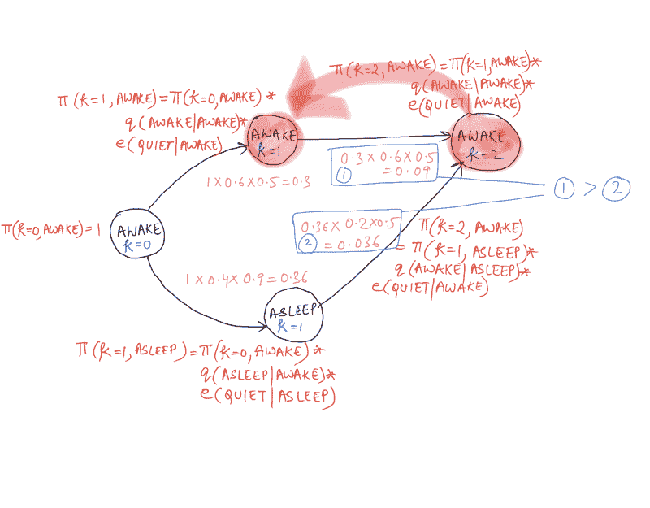

显然，正如计算指出的，如果时间步长 2 的状态是清醒的，那么时间步长 1 的状态也应该是清醒的。因此，维特比算法不仅帮助我们找到π(k)值，即使用动态规划概念的所有序列的成本值，而且还帮助我们找到给定起始状态和观察序列的最可能的标签序列。下面给出了算法以及用于存储**反向指针**的伪代码。

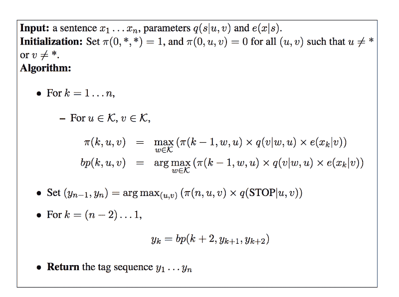

#### 词性标注问题的计算

让我们看一个稍微大一点的词性标注语料库和相应的维特比图，图中显示了维特比算法的计算和反向指针。

以下是我们将考虑的语料库:

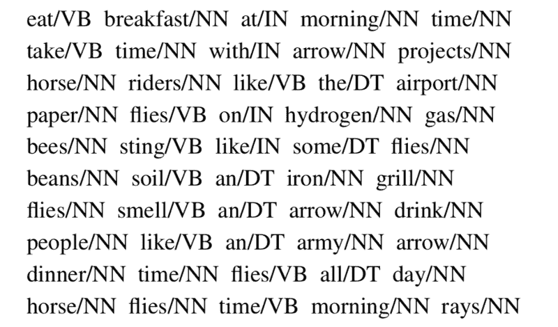

现在来看看从这个语料库中计算出来的转移概率。

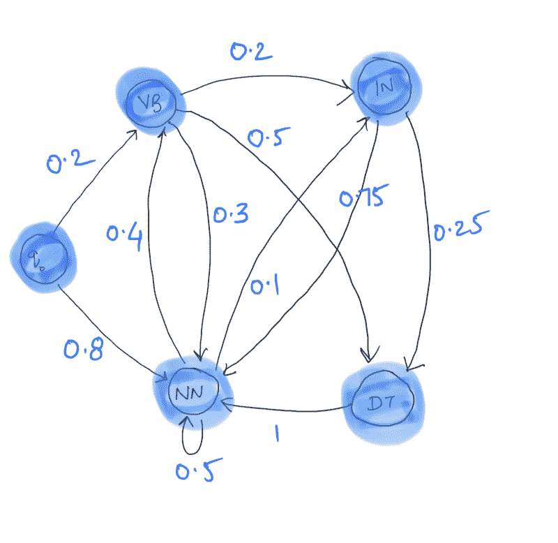

这里，q0 → VB 表示以标记 VB 开始的句子的概率，即句子的第一个单词被标记为 VB。同样，q0 → NN 表示以标签 NN 开头的句子出现的概率。请注意，在语料库中的 10 个句子中，8 个以 NN 开头，2 个以 VB 开头，因此有相应的转移概率。

至于发射概率，理想情况下，我们应该查看语料库中标签和单词的所有组合。因为那太多了，我们将只考虑用于维特比算法计算的句子的发射概率。

```
Time flies like an arrow
```

上述句子的排放概率为:

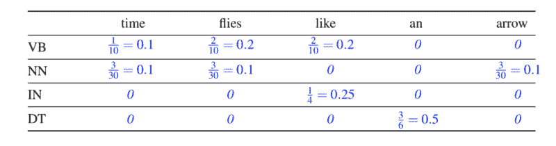

最后，我们准备好查看给定句子、转移概率、发射概率和给定语料库的计算。

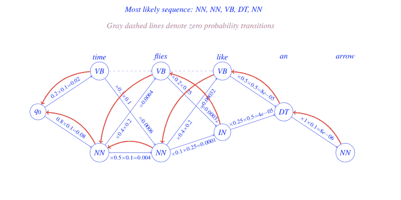

这就是维特比算法的全部内容吗？

看看下面的例子。

每个单词下面的桶填充了在训练语料库中该单词旁边看到的可能标签。根据我们选择的路径，给定的句子可以有不同的标签组合。但是有一个问题。你能弄清楚那是什么吗？

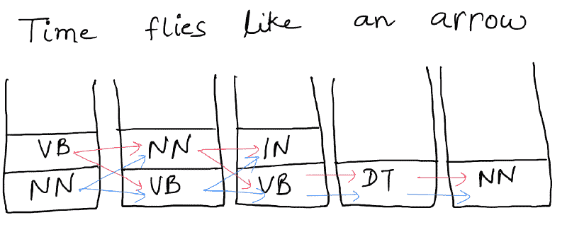

All combinations of sequence paths

你能弄明白吗？

没有吗？？

让我告诉你这是什么。

在计算图中可能有一些路径，我们不知道它的转移概率。所以我们的算法可以丢弃这条路径，选择另一条路径。

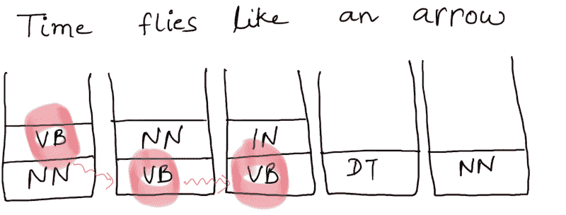

在上图中，我们放弃了用红色标记的路径，因为我们没有 q(VB|VB)。训练语料库从来没有一个 **VB** 后跟 **VB** 。因此，在维特比计算中，我们最终取 q(VB|VB) = 0。如果您一直密切关注该算法，您会发现计算中的单个 0 会使标签/标记序列的整个概率或最大成本为 0。

然而，这意味着我们忽略了在训练语料库中看不到的组合。

这是接近真实世界例子的正确方法吗？

考虑一下上面句子中的一个小调整。

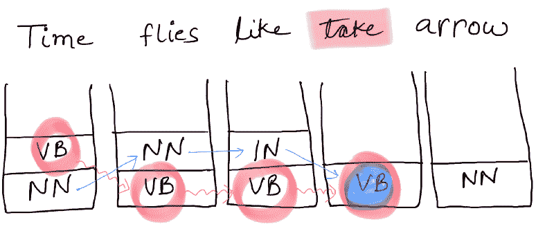

Time flies like **take** arrow

在这个句子中，我们没有任何替代路径。即使我们有维特比概率，直到我们到达“喜欢”这个词，我们也不能进一步前进。因为 q(VB|VB) = 0 和 q(VB|IN) = 0。我们现在要干嘛？

我们在这里考虑的语料库非常小。考虑任何具有大量单词的合理大小的语料库，我们有一个数据稀疏的主要问题。看看下面。

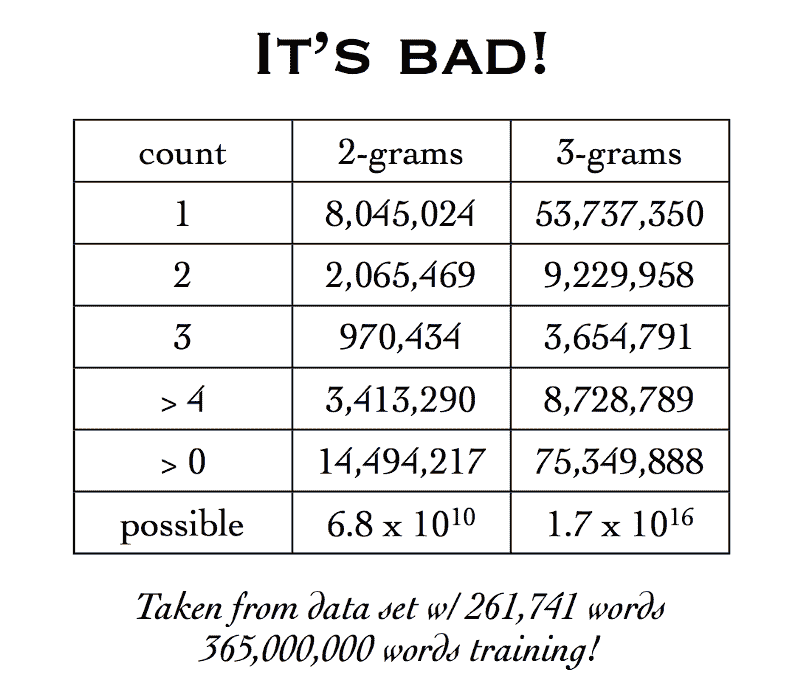

Source: [http://www.cs.pomona.edu/~kim/CSC181S08/lectures/Lec6/Lec6.pdf](http://www.cs.pomona.edu/~kim/CSC181S08/lectures/Lec6/Lec6.pdf)

这意味着我们可能有 680 亿个二元模型，但语料库中的单词数量不到 10 亿个。这是一个巨大的零转移概率的数字。在我们考虑三元模型的情况下，数据稀疏性的问题更加复杂。

为了解决数据稀疏的问题，我们求助于一种叫做平滑的解决方案。

### 缓和

平滑背后的想法是这样的:

1.  **折扣** —现有的概率值有些和
2.  **重新分配** —这个概率为零

这样，我们重新分配非零概率值来补偿看不见的转换组合。让我们考虑一种非常简单的平滑技术，称为拉普拉斯平滑。

拉普拉斯平滑也称为一次计数平滑。一会儿你就会明白它为什么叫这个名字了。让我们修改在给定训练语料库的情况下如何计算三元模型 HMM 模型的参数。

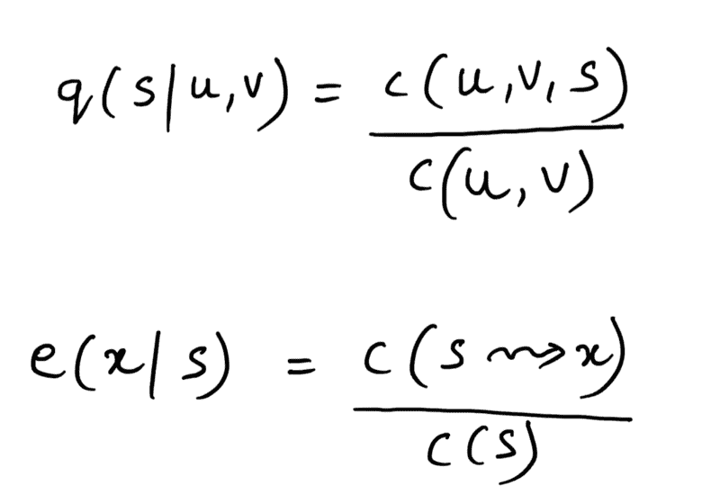

这里可能出错的值有

1.  `c(u, v, s)`为 0
2.  `c(u, v)`为 0
3.  我们在测试句子中得到一个未知单词，并且我们没有任何与之相关联的训练标签。

所有这些都可以通过平滑来解决。所以拉普拉斯平滑计数会变成

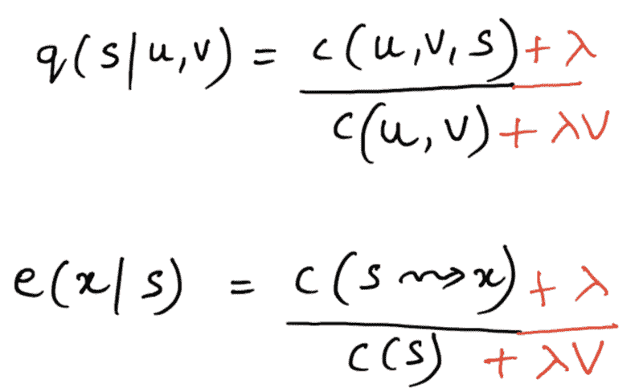

这里 V 是我们的语料库中标签的总数，λ基本上是介于 0 和 1 之间的实数值。它就像一个贴现因子。λ = 1 的值会给我们**太多概率值的重新分配。**例如:

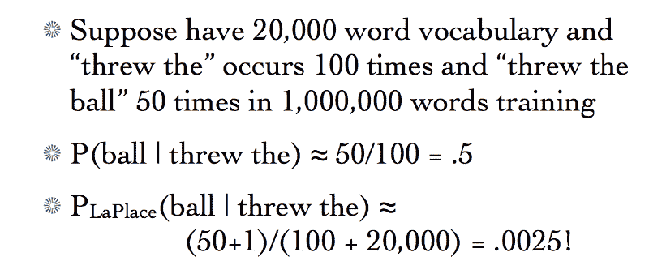

对于λ = 1，给看不见的三元模型太多的权重，这就是为什么上述拉普拉斯平滑的修改版本被考虑用于所有实际应用。贴现因子的值因应用的不同而不同。

注意，λ = 1 只会在词汇表过大时产生问题。对于一个较小的语料库，λ = 1 会给我们一个良好的性能。

关于拉普拉斯平滑需要注意的一点是，它是一种均匀的重新分布，也就是说，所有以前看不到的三元模型将具有相同的概率。假设我们得到一些数据，我们观察到

*   三元模型<gave the="" thing="">的频率为零</gave>
*   三元模型<gave the="" think="">的频率也为零</gave>
*   在看不见的事件上均匀分布意味着:
    P(thing | give，the)= P(think | give，the)

这反映了我们对英语用法的了解吗？
P(thing | give，the)>P(think | give，the)理想情况下，但使用拉普拉斯平滑的均匀分布不会考虑这一点。

这意味着，在我们的计算中，一个庞大的语料库中的数百万个看不见的三元模型将具有相同的概率。这可能不是正确的做法。然而，这比考虑 0 概率要好，这将导致这些三元模型，并最终导致维特比图中的一些路径被完全忽略。但是这仍然需要改进和完善。

然而，有许多不同类型的平滑技术改进了基本的拉普拉斯平滑技术，并有助于克服概率均匀分布的问题。这些技术包括:

*   Good-Turing 估计
*   杰利内克-默瑟平滑(插值)
*   卡茨平滑(后退)
*   威滕-贝尔平滑
*   绝对贴现
*   Kneser-Ney 平滑

要更详细地阅读这些不同类型的平滑技术，请参考[本](https://nlp.stanford.edu/~wcmac/papers/20050421-smoothing-tutorial.pdf)教程。选择哪种平滑技术在很大程度上取决于手边的应用类型、所考虑的数据类型以及数据集的大小。

如果你一直在关注这篇冗长的文章，那么我必须说


Source: [https://sebreg.deviantart.com/art/You-re-Kind-of-Awesome-289166787](https://sebreg.deviantart.com/art/You-re-Kind-of-Awesome-289166787)

让我们继续，看看我们可以对维特比算法进行的轻微优化，它可以减少计算量，并且对大量数据集也有意义。

然而，在此之前，再看一下算法的伪代码。

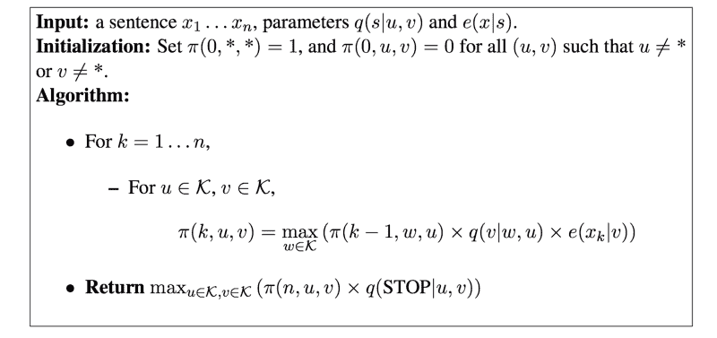

如果我们仔细观察，我们可以看到，对于每个三元组的单词，我们正在考虑所有可能的标签集。也就是说，如果标签的数量是 V，那么我们考虑|V|测试句子的每个三元组的组合数量。

暂时忽略三元模型，只考虑一个单词。我们将在上述算法中考虑给定单词的所有唯一标签。考虑一个语料库，其中我们有只与两个标签相关联的单词“kick”，比如说{NN，VB}，并且训练语料库中唯一标签的总数大约为 500(这是一个巨大的语料库)。

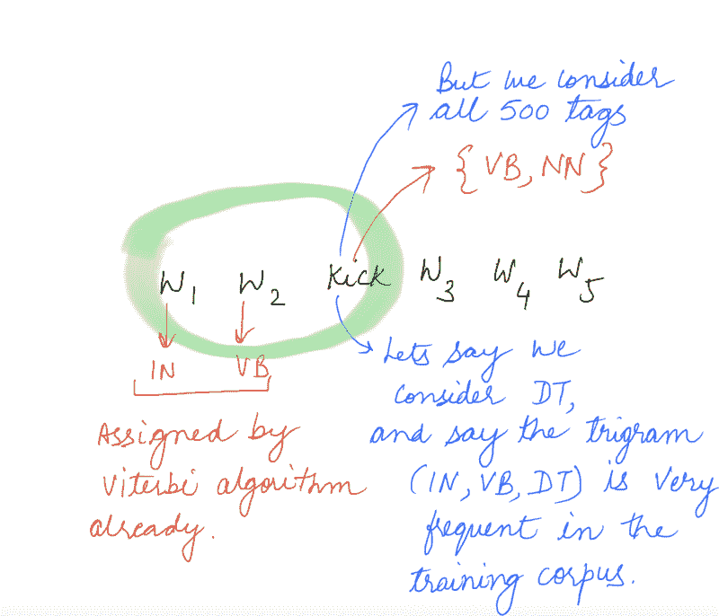

现在问题很明显了。我们最终可能会分配一个对所考虑的单词没有意义的标签，这仅仅是因为三元模型在该标签处结束的转移概率非常高，就像上面所示的例子一样。此外，如果单词“kick”在整个语料库中只出现两个唯一的标签，则考虑该单词的所有 500 个标签在计算上是低效的。

因此，我们所做的优化是，对于每个单词，不考虑语料库中所有唯一的标签，**我们只考虑它在语料库中出现的标签**。

这是可行的，因为对于一个相当大的语料库来说，一个给定的单词在理想情况下会与它可能出现的所有不同的标签集一起出现(至少大多数标签)。那么简单地考虑维特比算法的那些标签将是合理的。

就维特比解码算法而言，复杂度仍然保持不变，因为我们总是关心最坏情况的复杂度。在最坏的情况下，每个单词都与语料库中的每个唯一标签一起出现，因此三元模型的复杂度保持为 O(n|V| ),二元模型的复杂度保持为 O(n|V|)。

关于代码的递归实现，请参考

[**DivyaGodayal/HMM-POS-Tagger**](https://github.com/DivyaGodayal/HMM-POS-Tagger)
[*HMM-POS-Tagger——基于 HMM 的词性标记器实现，使用拉普拉斯平滑和三元模型 HMMs*github.com](https://github.com/DivyaGodayal/HMM-POS-Tagger)

递归实现与拉普拉斯平滑一起完成。

有关迭代实现，请参考

[**edorado 93/HMM-词性标注器**](https://github.com/edorado93/HMM-Part-of-Speech-Tagger)
[*HMM-词性标注器——基于 HMM 的词性标注器*github.com](https://github.com/edorado93/HMM-Part-of-Speech-Tagger)

这种实现是用一次计数平滑技术完成的，与拉普拉斯平滑相比，这种技术具有更高的精度。

两篇文章中很多公式和计算的快照都是从[这里](http://1\. http://www.cs.columbia.edu/~mcollins/courses/nlp2011/notes/hmms.pdf)得来的。

请让我们知道这篇博文对你有什么帮助，如果你在阅读文章时发现了一些错误，请在下面的评论部分指出。此外，如果你认为这篇文章对某人有用，请推荐(鼓掌)并尽可能地传播你的爱。