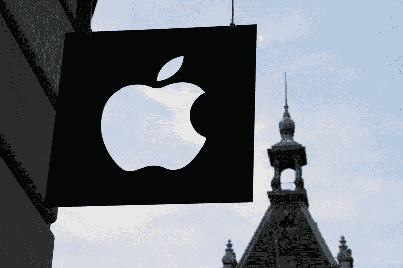
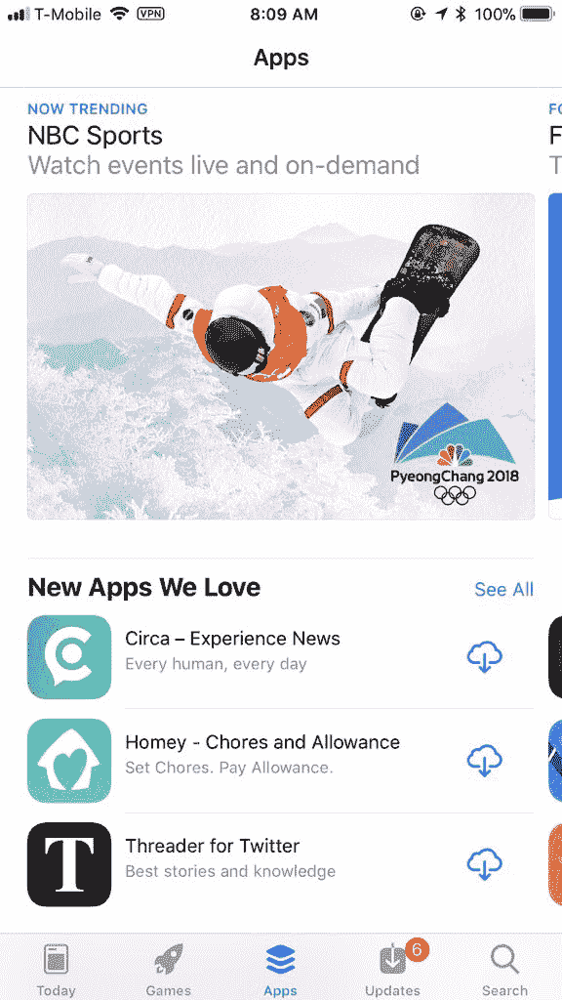
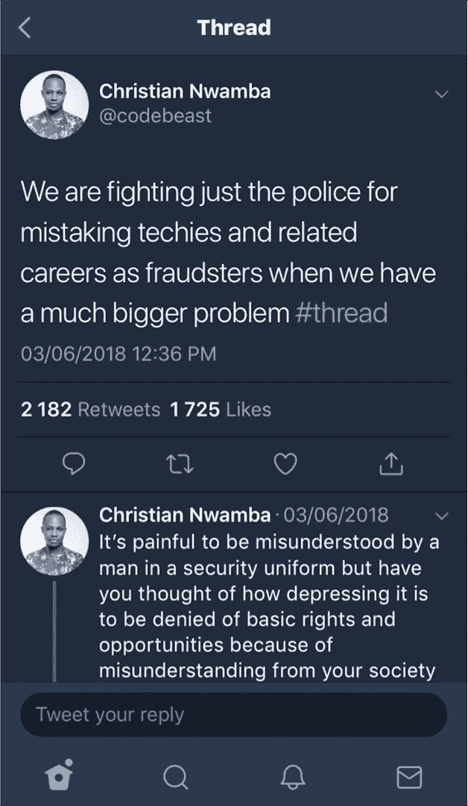
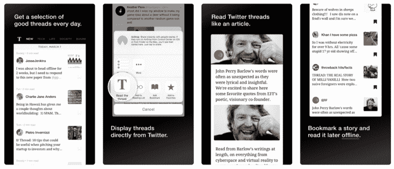
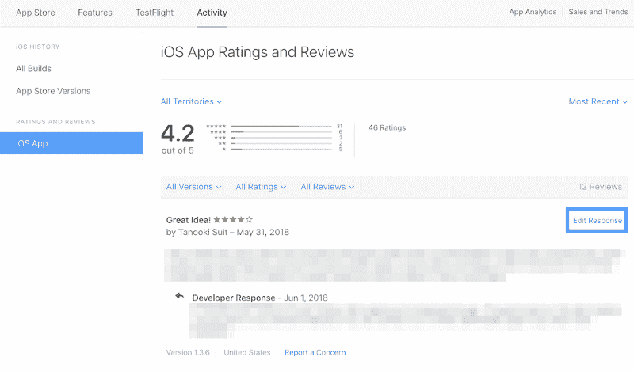
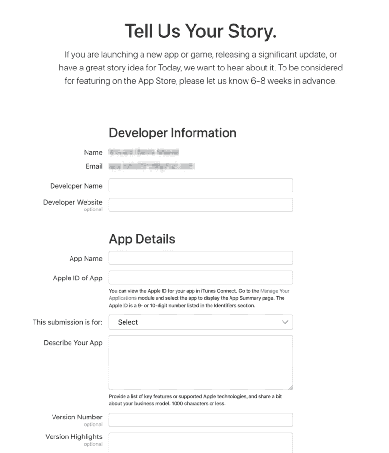
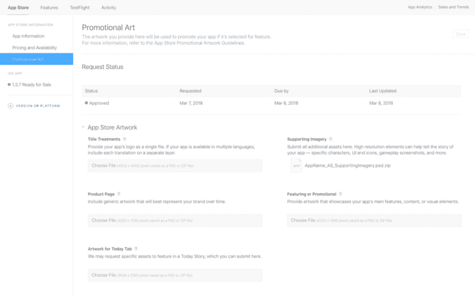
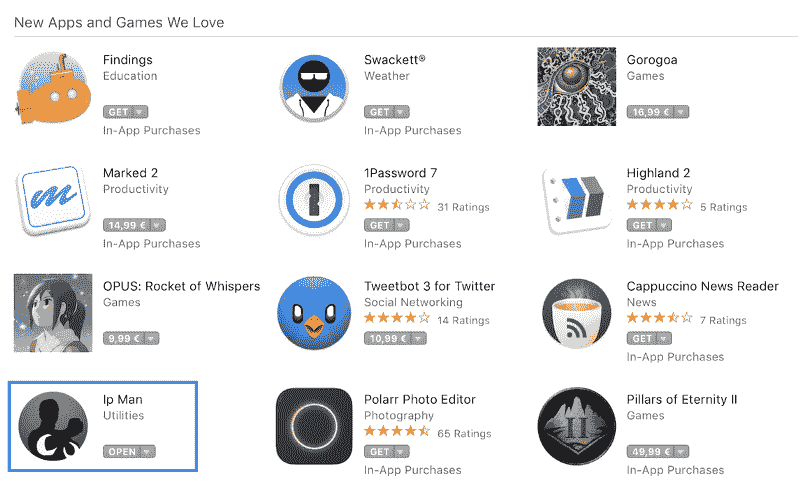
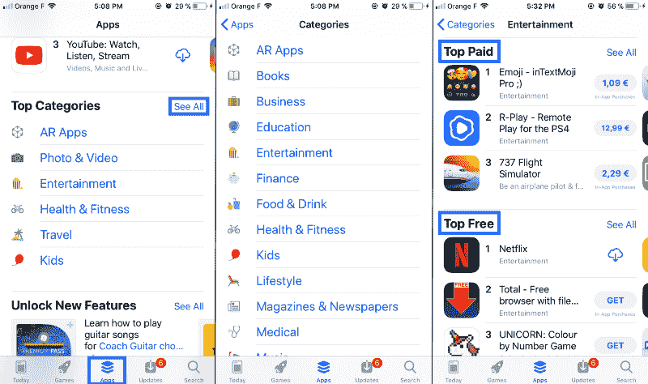
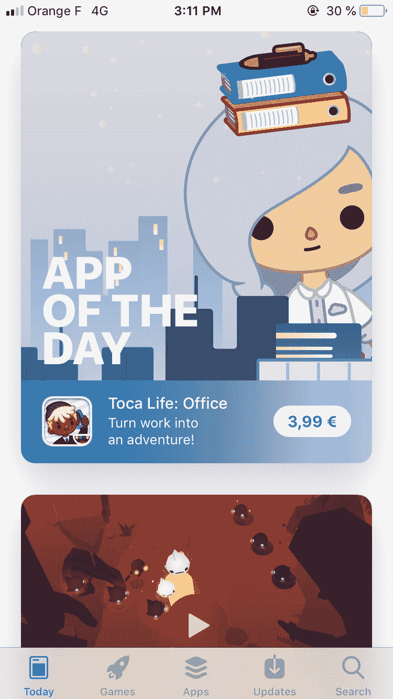

# 如何在 App Store 上展示您的应用

> 原文：<https://www.freecodecamp.org/news/how-to-get-featured-on-the-app-store-c056e62a7e7a/>

玛丽·丹尼斯

# 如何在 App Store 上展示您的应用

Photo by [Medhat Dawoud](https://unsplash.com/photos/f-3mUXFLY2o?utm_source=unsplash&utm_medium=referral&utm_content=creditCopyText) on [Unsplash](https://unsplash.com/?utm_source=unsplash&utm_medium=referral&utm_content=creditCopyText)

我是一名 Swift 开发人员和独立制作人。我做了几个应用程序，每次都出现在 App Store 上。Threader 是一个 Twitter 客户端，它收集好的线程并在一个页面上展示它们，甚至成为了今日[的特色应用](https://itunes.apple.com/us/story/id1367658799)。

根据我的经验，以下是一些建议，或许能帮助苹果考虑推广你的应用。

*注意:虽然这个建议适用于所有的应用类别，但游戏类别更具体一些。在这篇文章中，我不会特别讨论游戏应用类别。*

### 如何出现在“我们喜爱的新应用”部分

Threader featured in “New Apps We Love”

#### **一款干净的 app**

当然，首先要考虑的是如何用干净的设计做出一个无 bug 的 app。想想设计、UX 和措辞等等。别忘了测试一下(不同的设备，不同的 OS，不同的人……)。

使事物同质:在任何地方使用相同的字体和颜色。尽可能避免发短信。不要重新发明轮子，尤其是如果你不是设计师的话。使用标准的 iOS 项目:按钮、导航栏等等。

这并不总是可能的，但看到人们使用你的应用程序会很有用。如果您发现他们没有按照预期使用它，或者没有设法执行某些操作，那么您可能需要检查您的 UX。

#### 使用苹果的 API

苹果推广自己的产品。他们将更倾向于使用使用最新 Swift 版本和自己的 API 的应用程序。2017 年，他们发布了 ARKit，并在 App Store 上建立了一个特殊的类别，以推广使用它的应用程序。

#### 扩展ˌ扩张

虽然我没有确凿的证据证明这一点，但苹果喜欢你利用他们所有的平台。想想 iMessage，share & action 扩展等等。

例如，Threader 有一个 action 扩展。它允许你直接从 Twitter 上打开一个主题，在一个页面上阅读，就像在应用程序上一样。它是主应用程序的扩展。它很有用，允许在不打开它的情况下进行某些外部操作。

Threader’s action extension to read a thread directly from Twitter

#### 出色的视觉效果

关于你的应用程序的所有信息都很重要，并在获得特色中发挥作用。你可以(重新)阅读[我之前的文章](https://medium.com/@marie_dm_/submit-publish-your-app-on-the-app-store-bb4e68258c41)解释如何提交应用程序。里面有一些有用的信息(比如“准备提交”和“应用预览&截图”部分)。最重要的是你的视觉效果。让事情变得干净、简单易懂，并且用更少的词语…

Threader’s screenshots on the [App Store](https://itunes.apple.com/us/app/threader-for-twitter/id1317519091)

#### 频繁更新

苹果喜欢频繁更新。用户喜欢频繁更新。这并不意味着你需要每天创建一个新的特性。但是要修复 bug，获取用户的反馈，定期推送更新。

如果你想保持更长时间的特色并保持在应用商店的顶端，也建议经常更新。当我被推荐的时候，我每两天左右就推一次更新。我不在的时候大概一周一次。

#### 仅限 iOS

如果你的 app 只在 iOS 上可用(意思是没有 Android 版本)，建议你提一下。我怀疑苹果喜欢排他性。

#### 等级

苹果推出了一种在 iTunes Connect 上回复用户评论的方式。感谢好的邮件是有用的，但也要理解坏邮件的问题所在，并回复这些邮件。

Reply to users’ reviews

#### 本地化

将您的应用程序翻译成不同的语言。尤其是当你的应用在几个国家都可用的时候。苹果会感谢你花时间去做这件事。

这是一项令人讨厌的任务，本地化很难更新。这就是为什么你应该在你的应用程序开发的最新阶段做这件事。我希望苹果有一天会改善这一点，因为这真的很痛苦。

#### 关键词和搜索结果

> ASO(应用商店优化)是提高移动应用在应用商店中可见性的过程。— [维基百科](wiki: https://en.wikipedia.org/wiki/App_store_optimization)

这就是为什么你需要仔细选择你的关键词。我有时会使用 App Annie 来检查我的应用的关键词的质量。

#### 最后，也是最重要的一步:填写表格

实际上有一个[表格需要填写](https://developer.apple.com/contact/app-store/promote/)来联系 App Store 编辑团队以获得推广。

重要提示:“请提前 6-8 周通知我们**”。因此，在提交应用程序之前，请仔细考虑一下。例如，尤其是 iOS 市场比 macOS 市场更加拥挤。**

[Contact form](https://developer.apple.com/contact/app-store/promote/) to fill out in advance

对我来说，表单中最重要的两个字段是:

*   “应用详情/描述你的应用”部分
*   你的故事

在全球范围内，这就像把你的简历寄给苹果申请一样。推销你的应用和你自己(或你的开发团队)。

### 圣杯:如何成为每日应用

[Threader featured as App of the Day](https://itunes.apple.com/us/story/id1367658799)

如果你得到了推荐，那么苹果可能会考虑让你的应用成为当天的应用，或者在应用/游戏标签中进行推荐。如果是这样的话，你会收到一封电子邮件。你必须制作几件艺术品/视觉作品，并通过 iTunes Connect 提交。

我曾经的应用经验给了我一些建议:

*   发挥创造力，看看当今的其他应用程序，让你对它们的样子有个概念。
*   仔细按照 [**他们的指引**](https://help.apple.com/itc/appspromoart/) 进行美术作品
*   遵守截止日期
*   如果你还没有计划，考虑在全球范围内发布你的应用。如果你被选为每日应用，你将在你的应用可用的所有国家被选中。

Promotional Artwork section on iTunes Connect

你要知道，即使**你提交了你的作品，也并不意味着苹果会用**你。我知道。你为此很努力。可能不会有任何结果。

此外，在你提交你的作品后，你可能不会从苹果那里得到任何关于你的应用程序状态的消息。你就等着吧。仅此而已。

就拿我的例子来说吧:我们的应用已经被考虑过两次推广。两次我们都提供了艺术品。两次我们都等了几个星期。两次我们都没有得到任何消息。我们的电子邮件没有得到任何回复。一个应用程序没有得到特别推荐。[另一个](https://threader.app)是今日应用。没有通知。

### 其他一般建议

Photo by [G. Crescoli](https://unsplash.com/photos/82TpEld0_e4?utm_source=unsplash&utm_medium=referral&utm_content=creditCopyText) on [Unsplash](https://unsplash.com/?utm_source=unsplash&utm_medium=referral&utm_content=creditCopyText)

#### 比赛

记得 iOS 应用商店的**非常**拥挤**。每天都有很多应用程序发布。例如，我将[叶问](https://ipman.io)(一款 Mac 菜单栏应用，可以轻松复制/粘贴你的 IP)发布到 Mac 应用商店。尽管我没有遵守“提前 6-8 天”的截止日期(我知道我没有遵守我自己的指导方针)，他们还是突出了这一点。我可以告诉你这对销售很有帮助。**

Mac 应用商店是销售应用的好地方。可用的应用程序越来越少，因此竞争也就越来越少。这可能是为什么叶问得到了特色。

[IP Man](https://ipman.io/) featured in “New Apps We Love” on the Mac App Store

#### 谁是你的竞争对手

我能给你的另一个建议是**看看你的竞争对手**的特色应用，以及其他特色应用。我不是说所有的应用程序看起来都一样，但肯定有一种模式。用苹果的方式销售你的应用。使用他们的词汇和设计风格。

不过，请注意:你不必到处说你的应用程序“棒极了”。

你能做什么:在 App Store 上，点击中间底部的“应用”标签。滚动直至找到“热门类别”，然后点击“查看全部”。现在你可以看到所有的类别。选择你的应用程序所在的应用程序，浏览排名靠前的应用程序:这些是你的竞争对手。

Check your competitors on the App Store

您还可以查看“今天”标签，并查看上周的应用程序。这至少给了你 6 个例子。

The Today tab on the App Store

#### 你实际上不知道你是否/何时会被报道

苹果不通知你。所以像我们一样，你会注意到新用户的增加。你会检查他们从哪里来，不明白发生了什么。然后去 App Store 看看你有没有特色。庆祝一下。

### 成为应用商店功能大师的有用链接

Photo by [Alfons Morales](https://unsplash.com/photos/YLSwjSy7stw?utm_source=unsplash&utm_medium=referral&utm_content=creditCopyText) on [Unsplash](https://unsplash.com/search/photos/reading?utm_source=unsplash&utm_medium=referral&utm_content=creditCopyText)

*   [在全新的 App Store](https://developer.apple.com/app-store/discoverability) 上的发现，尤其是最后一部分“精选”。
*   我强烈推荐你阅读[充分利用你的产品页面](https://developer.apple.com/app-store/product-page/)。它解释了如何填写您的应用程序信息，并概述了它在 App Store 上的外观。有些版块甚至有更多的链接。
*   [使用应用程序预览展示更多内容](https://developer.apple.com/app-store/app-previews/)对于那些使用视频预览的人。
*   [优化应用商店搜索](https://developer.apple.com/app-store/search/)，有助于选择关键词。
*   [充分利用 App Store](https://developer.apple.com/app-store/planning/) ，尤其是第一部分“建立你的 App Store 存在感”。
*   为了升职而填写的表格。

总的来说，**遵循苹果的指导方针。**我觉得最重要。如果你想到任何其他规则/提示，请告诉我！我用你的名字加上:)

***

[我在 Twitter 上](https://twitter.com/marie_dm_)如果你想知道我的下一个应用程序是否会出现。？？

[订阅](https://mailchi.mp/80a197d266d6/twomakers)我的博客 [TwoMakers.io](https://twomakers.io) 以获得关于我旅程的更新。