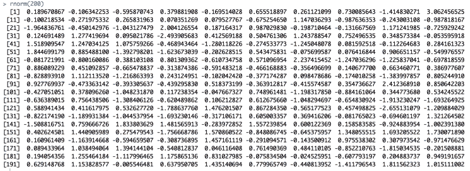

# 如何在 R 中控制你的随机数发生器

> 原文：<https://www.freecodecamp.org/news/how-to-control-your-randomizer-in-r-852ae7d8f80c/>

作者:米歇尔·琼斯

# 如何控制 R 中的随机化器

当你需要一种特殊类型的随机化时会发生什么？



200 random numbers using the normal distribution.

### R 中随机数生成概述

[R](https://cran.r-project.org) 至少有 20 个随机数发生器函数。每一种都使用特定的概率分布来产生数字。都要求你指定想要的随机数个数(上图显示 200)。所有产品均在 base R 中提供，无需封装。

常见的随机数生成器分布有:

*   [正态](http://www.statisticshowto.com/probability-and-statistics/normal-distributions/) (rnorm):默认均值为 0，标准差为 1
*   [二项式](http://www.statisticshowto.com/probability-and-statistics/binomial-theorem/binomial-distribution-formula/) (rbinom):无默认值，指定试验次数和每次试验成功的概率
*   [统一](https://www.investopedia.com/terms/u/uniform-distribution.asp) (runif):默认最小值为 0，最大值为 1

上面三个中，只有二项式随机数生成器创建整数。

### 为什么要创造随机数？

涉及随机数的问题非常普遍——在堆栈交换中，大约有 [50，000 个与随机数](https://stackoverflow.com/search?q=random+numbers)相关的问题。

但是为什么要使用它们呢？

随机数有许多实际应用。它们被用在蒙特卡洛模拟中。它们被用于[密码术](https://crypto.stackexchange.com/questions/726/what-is-the-use-of-real-random-number-generators-in-cryptography)。他们已经被用来制作[验证码内容](https://support.google.com/a/answer/1217728?hl=en)。它们用在[吃角子老虎机](http://www.casinonewsdaily.com/slots-guide/random-number-generator-hit-frequency-vs-payout-ratio/)里。它们还被用于更普通的任务，比如为一组有序数据创建随机排序。

### 随机数的问题

常见的问题包括“我的随机数实际上是随机的吗？”以及“我如何生成不重复的随机数？”

**注**:后者减少随机性，因为每抽取一个随机数，可能随机数的总体就减少一个。该方法适用于诸如彩票或宾果游戏的情况，其中每张彩票或每个球只能抽取一次。

这个问题带来了另一个问题！随机生成的无替换数字的抽样必须是整数。没有人有票 5.6932 或者宾果球 0.18967。

### 随机数问题的一个实例

举个例子，我有 20 个同龄的女学生。我想尝试四种教学方法。我只想为每个学生尝试一种教学方法。简单的数学——我需要每组五名学生。

但是我怎么做才能让每个学生都被随机分配呢？

我如何确保只产生整数呢？

我如何在不替换的情况下使用随机生成的数字完成所有这些呢？例如，我不希望一组有六个学生，而另一组有四个学生。

首先，我需要在 r 中创建一些虚拟数据。

```
FemaleStudents <- data.frame(Names=c("Alice", "Betty", "Carol", "Denise", "Erica", "Frances", "Gina", "Helen", "Iris", "Julie", "Katherine",                           "Lisa", "Michelle", "Ngaire", "Olivia", "Penelope", "Rachel", "Sarah", "Trudy", "Uma"))
```

现在我们有了 20 名学生的一维数据集。

我们知道`runif()`函数不创建整数。为什么不把随机数四舍五入，这样只得到整数，用这个函数呢？我们可以将随机数包装在一个舍入函数中。

**问题 1:** 为什么我用的是随机均匀分布，而不是另一种，比如随机正态分布？

r 中有五种类型的舍入函数，我们将使用`round()`。

为了得到相同的结果，我将为随机数生成设置一个种子。每次我们生成随机数时，我们将使用相同的种子。我决定以 5 号为种子。如果您没有设置种子，或者如果您设置的种子不是 5，您的结果将与我的不同。

```
set.seed(5)FemaleStudents$Group <- round(runif(20, 1, 5))
```

好吧，那看起来很有效。我们把每个学生分配到一个从 1 到 5 的小组。

让我们仔细检查一下我们的分配。

```
table(FemaleStudents$Group)
```

```
1 2 3 4 5 2 6 5 4 3
```

可恶。五组中只有一组有正确的学生人数(第四组)。为什么会这样？

我们可以检查由`runif()`实际输出的数字，不进行舍入，并让输出打印到控制台。这里，输出会打印出来，因为我没有将函数赋给对象(例如，赋给 data.frame 变量)。

```
set.seed(5)runif(20,1,5)
```

```
[1] 1.800858 3.740874 4.667503 2.137598 1.418601 3.804230 3.111840 4.231741 4.826001 1.441812 2.093140 2.962053 2.273616 3.236691 2.050373[16] 1.807501 2.550103 4.551479 3.219690 4.368718
```

正如我们所看到的，舍入导致了我们的问题。但是，如果我们没有四舍五入，每个学生将被分配到不同的小组。

我们该怎么办？

### 样本()

现在是我在 r 中最喜欢的函数之一。让我们看看它是如何工作的。

#### 随机分配到同等大小的组(计数很重要)

我们如何使用它将我们的 20 名学生随机分配到四个同等大小的组中呢？

如果我们正常尝试`sample()`会发生什么？

```
set.seed(5)FemaleStudents$Sample <- sample(1:5, nrow(FemaleStudents), replace=TRUE)
```

**问题 2:** 你用`table(FemaleStudents$Sample)`的时候得到了什么输出？

我们可以通过创建一个组号向量来解决这个问题，然后从这个向量中使用没有替换的采样。`rep`命令用于创建一系列重复值。你可以用它来重复系列中的每个数字，就像我在这里使用的一样。数字 1 重复四次，然后数字 2 重复四次，以此类推。你也可以用它来重复一系列的数字，如果你用这个代码来代替:`rep(1:5,4)`

```
OurGroups <- rep(1:5, each=4)set.seed(5)FemaleStudents$Sample <- sample(OurGroups, nrow(FemaleStudents), replace=FALSE)
```

我们使用我们的数字向量(`OurGroups`)将我们的学生分组。我们使用来自`OurGroups`的无替换采样(`replace=FALSE`)，因为我们需要使用那个向量中的每个值。我们需要在使用时删除每个值。

我们得到了我们想要的结果！

```
table(FemaleStudents$Sample)
```

```
1 2 3 4 5 4 4 4 4 4
```

**问题 3** :为什么我还设置了一个种子？

`sample()`的另一个优点是不在乎类型。我们可以使用字符串向量重复分配。如果你不想一直引用“1”的意思，这可能是有用的。

```
OurNamedGroups <- rep(c("Up", "Down", "Charmed", "Strange", "Top"), each=4)set.seed(5)FemaleStudents$Sample2 <- sample(OurNamedGroups, nrow(FemaleStudents), replace=FALSE)table(FemaleStudents$Sample2)
```

```
Charmed    Down Strange     Top      Up       4       4       4       4       4
```

因为我们使用了相同的种子，所以我们可以看到执行了相同的学生分配，而不管我们是使用数字数据还是字符数据进行分配。

```
table(FemaleStudents$Sample,FemaleStudents$Sample2)       Charmed Down Strange Top Up  1       0    0       0   0  4  2       0    4       0   0  0  3       4    0       0   0  0  4       0    0       4   0  0  5       0    0       0   4  0
```

#### 当组大小不受限制时随机分配

有时候我们想随机分配到组中，但是我们没有组的向量。我们仍然只将每个单位(人、羊、奶酪块)分配给一个组，我们使用完全随机分配。

假设我们学校有一个新的、特殊的图书馆。为了给学生一个更好的学习环境，它被设计成隔音的。图书馆馆长想知道那个房间里的学生的经历。唯一的问题是房间的面积有限。首席图书管理员认为大约四个学生是一个足够大的群体来提供最初的反馈。

同样，我们可以使用`sample()`来选择我们的学生群体。在这种情况下，我们有“会考房的学生”和“不会考房的学生”。我要把它们叫做“测试”和“不测试”。这些标签被选择为 1。短和 2。容易区分。

因为我们之前做了没有替换的抽样，所以我们没有指定分配给不同组的概率——我们只是从一个向量中抽取一个分配。现在我们将使用替换抽样。With replacement 指的是群体，而不是学生。

我们需要替换样本，因为我们只有两个组(“测试组”、“非测试组”)和 20 名学生。如果我们试图在没有替换的情况下采样，我们的代码就会出错。

我们的代码非常相似:

```
set.seed(5)FemaleStudents$Library <- sample(c("Test", "Not test"), nrow(FemaleStudents), replace=TRUE, prob=c(4/20,16/20))table(FemaleStudents$Library)
```

```
Not test     Test       15        5
```

如你所见，我们分配了五个学生来测试这个房间，而不是四个。处理小样本时，这种结果是意料之中的。然而，我们的学生分配是完全随机的。每个学生被分配去测试房间的概率完全相同。之前的学生是否是测试者对下一个学生的分配没有影响。

让我们浏览一下其中的一些代码。

我在`data.frame`中构造了一个新变量来收集分配(`Library`)。

我使用了前面提到的字符串，而不是用数字来表示组名。因为我使用了字符串，`c()`必须包含组名(`“Test”, “Not test”`)，每个组名由逗号分隔。

替换已被设置为`TRUE`。

必须提供分配到任一组的概率。这是`sample()`函数的`prob=c(4/20,16/20)`部分。再次注意`c()`是如何被用来包含概率的。同样有趣的是，概率可以表示为分数，而不是小数。

### 样本万岁()

我一直在用`sample()`做我正在做的工作。使用字符串以及将数字输出限制为整数(并定义所需的整数范围)的能力，为我提供了比尝试使用随机数函数更多的控制。

### 答案

**回答 1** :我用了随机均匀分布，因为我希望每个值都是等概率的。

**回答 2** :我得到了这个输出:

```
1 2 3 4 5 2 7 4 2 5
```

**答案 3:** 如果我们不设置一个种子值，或者我们用不同的，那么具体学生的分配就不一样。例如，当种子是 5 时，Alice 被分配到组 2。如果种子是 7，则 Alice 被分配到组 5。当代码需要重新运行时(例如，在测试中)，复制是很重要的。