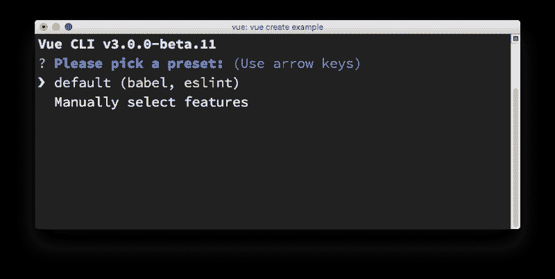
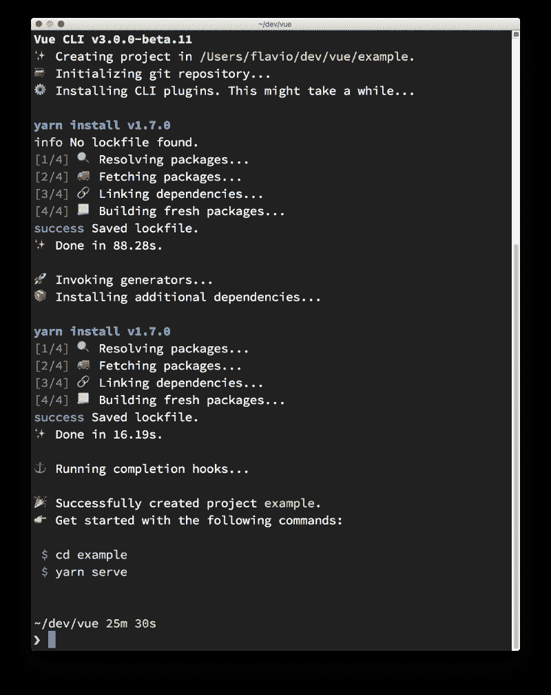
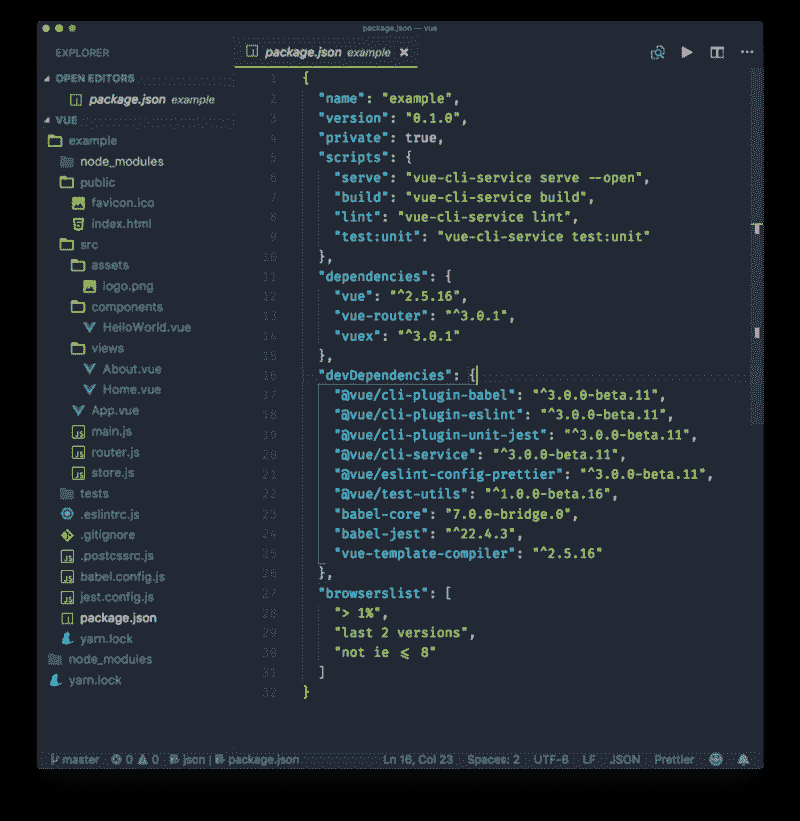
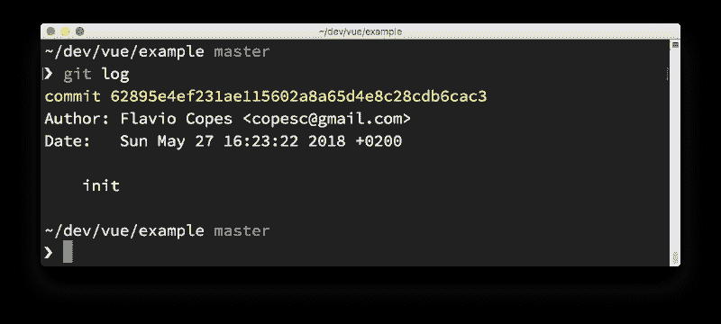
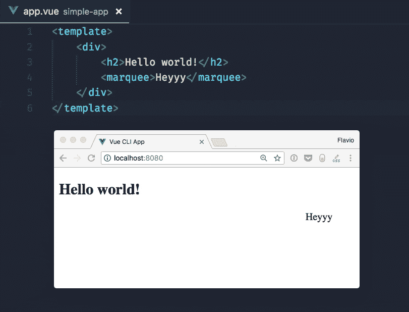
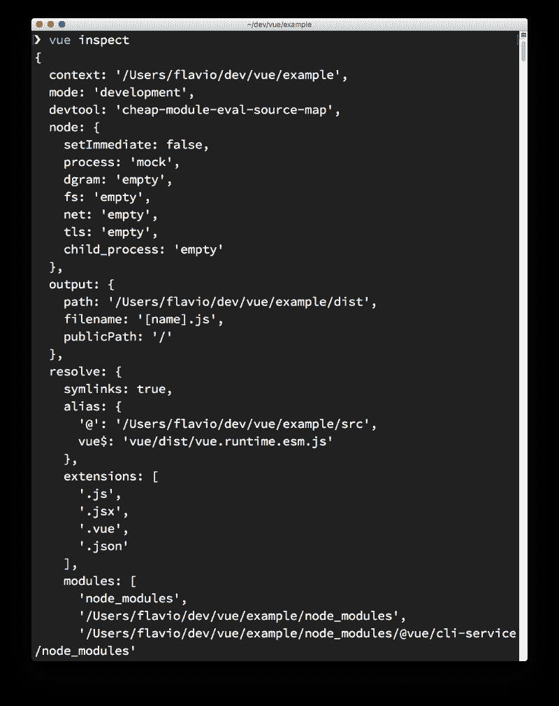

# 了解如何使用 Vue.js CLI

> 原文：<https://www.freecodecamp.org/news/learn-how-to-use-the-vue-js-cli-8349fb23a566/>

> 有兴趣学习 Vue.js？在 vuehandbook.com 获得我的电子书

其中之一就是 Vue 命令行界面(CLI)。

**注意:从版本 2 到版本 3，目前正在对 CLI 进行大规模的修改。虽然还不稳定，但我将描述版本 3，因为它比版本 2 有了巨大的改进，而且非常不同。**

### 装置

Vue CLI 是一个命令行实用程序，您可以使用 npm 全局安装它:

```
npm install -g @vue/cli
```

或者使用纱线:

```
yarn global add @vue/cli
```

一旦你这样做了，你就可以调用`vue`命令。


### Vue CLI 提供了什么？

CLI 对于快速开发 Vue.js 至关重要。

它的主要目标是确保您需要的所有工具都在一起工作，执行您需要的任务。它抽象出了独立使用每种工具所需要的所有配置细节。

它可以执行初始项目设置和搭建。

这是一个灵活的工具。一旦你用 CLI 创建了一个项目，你就可以去调整配置，而不必**弹出**你的应用程序(就像你用`create-react-app`做的那样)。您可以进行任何配置，并且仍然能够轻松升级。

在您创建和配置应用程序之后，它将作为一个运行时依赖工具，构建在 webpack 之上。

第一次接触 CLI 是在创建新的 Vue 项目时。

### 如何使用 CLI 创建新的 Vue 项目

使用 CLI 要做的第一件事是创建一个 Vue 应用程序:

```
vue create example
```

酷的是这是一个互动的过程。您需要选择一个预设。默认情况下，有一个预置提供了 Babel 和 ESLint 的集成:



我将按下向下箭头⬇️，手动选择我想要的功能:


在您需要的每个功能上按`space`键，然后按`enter`键继续。由于我选择了“Linter/Formatter”，Vue CLI 会提示我进行配置。我选择了“ESLint +更漂亮”,因为这是我最喜欢的设置:


下一步是选择如何应用林挺。我选择了“保存时使用 Lint”。


接下来:测试。我选择了测试，Vue CLI 提供了两个最流行的解决方案供我选择:“摩卡+柴”与“Jest”。


Vue CLI 询问我将所有配置放在哪里。选项在“package.json”文件中，或者在专用的配置文件中，每个工具一个。我选择了后者。


接下来，Vue CLI 询问我是否要保存这些预设，并允许我在下次使用 Vue CLI 创建新应用程序时选择它们。这是一个非常方便的功能。快速设置我的所有偏好是一种复杂性缓解:


然后 Vue CLI 问我更喜欢使用 yarn 还是 npm:


这是它问我的最后一件事。然后，它继续下载依赖项并创建 Vue 应用程序:



### 如何启动新创建的 Vue CLI 应用程序

Vue CLI 已经为我们创建了应用程序，我们可以进入“example”文件夹并运行`yarn serve`以开发模式启动我们的第一个应用程序:


starter 示例应用程序源代码包含几个文件，包括“package.json”:



这是定义所有 CLI 命令的地方，包括我们一分钟前使用的`yarn serve`。其他命令是

*   `yarn build`，开始生产构建
*   `yarn lint`、跑棉绒
*   `yarn test:unit`，运行单元测试

我将在单独的教程中描述由 Vue CLI 生成的示例应用程序。

### Git 储存库

注意到 VS 代码左下角的`master`字了吗？这是因为 Vue CLI 会自动创建一个存储库，并进行第一次提交。我们可以直接跳进去，改变事情，我们知道我们改变了什么:



这太酷了。有多少次，当你想提交结果时，你一头扎进去，改变了事情，却发现你没有提交初始状态？

### 从命令行使用预设

您可以跳过交互式面板，指示 Vue CLI 使用特定的预设:

```
vue create -p favourite example-2
```

### 预置存储的位置

预设存储在”。vuejs”文件。这是我创建第一个“最喜欢的”预置后的结果:

```
{  "useTaobaoRegistry": false,  "packageManager": "yarn",  "presets": {    "favourite": {      "useConfigFiles": true,      "plugins": {        "@vue/cli-plugin-babel": {},        "@vue/cli-plugin-eslint": {          "config": "prettier",          "lintOn": [            "save"          ]        },        "@vue/cli-plugin-unit-jest": {}      },      "router": true,      "vuex": true    }  }}
```

### 插件

从阅读配置可以看出，一个预置基本上就是插件的集合，加上一些可选的配置。

一旦创建了一个项目，您可以使用`vue add`添加更多的插件:

```
vue add @vue/cli-plugin-babel
```

所有这些插件都是可用的最新版本。您可以通过传递 version 属性来强制 Vue CLI 使用特定版本:

```
"@vue/cli-plugin-eslint": {  "version": "^3.0.0"}
```

如果一个新版本有突破性的变化或错误，并且您需要在使用它之前等待一会儿，这是非常有用的。

### 远程存储预设

通过创建一个包含“preset.json”文件的存储库，可以将预置存储在 GitHub(或其他服务)中，该文件包含一个预置配置。

从上面提取，我在[https://github . com/flavio copes/vue-CLI-preset/blob/master/preset . JSON](https://github.com/flaviocopes/vue-cli-preset/blob/master/preset.json)中做了一个样本预置，它包含以下配置:

```
{  "useConfigFiles": true,  "plugins": {    "@vue/cli-plugin-babel": {},    "@vue/cli-plugin-eslint": {      "config": "prettier",      "lintOn": [        "save"      ]    },    "@vue/cli-plugin-unit-jest": {}  },  "router": true,  "vuex": true}
```

它可用于引导新的应用程序，使用:

```
vue create --preset flaviocopes/vue-cli-preset example3
```

### Vue CLI 的另一个用途:快速原型制作

到目前为止，我已经解释了如何使用 Vue CLI 从头开始创建一个新项目，包括所有的附加功能。但是对于真正快速的原型开发，您可以创建一个真正简单的 Vue 应用程序——一个自包含在单个。vue 文件——并提供该文件，而不必下载`node_modules`文件夹中的所有依赖项。

怎么会？首先安装`cli-service-global`全局包:

```
npm install -g @vue/cli-service-global 
```

```
//or yarn 
```

```
global add @vue/cli-service-global
```

创建一个“app.vue”文件:

```
<template>    <div>        <h2>Hello world!</h2>        <marquee>Heyyy<;/marquee>    </div></template>
```

然后跑

```
vue serve app.vue
```



您可以服务于更有组织的项目，由 JavaScript 和 HTML 文件组成。默认情况下，Vue CLI 使用“main . js”/“index . js”作为其入口点。您可以设置一个“package.json”和任何工具配置。`vue serve`将它捡起来。

因为这使用了全局依赖，所以除了演示或快速测试之外，它不是最佳的方法。

运行`vue build`命令将为项目的部署做准备，并在`dist/`文件夹中生成结果 JavaScript 文件，这样它就可以投入生产了。Vue.js 在开发过程中生成的所有警告都被删除，代码也针对现实世界的使用进行了优化。

### 网络包

在内部，Vue CLI 使用 Webpack，但是配置是抽象的，我们甚至看不到文件夹中的配置文件。您仍然可以通过调用`vue inspect`来访问它:



> 有兴趣学习 Vue.js？在 vuehandbook.com 获得我的电子书

