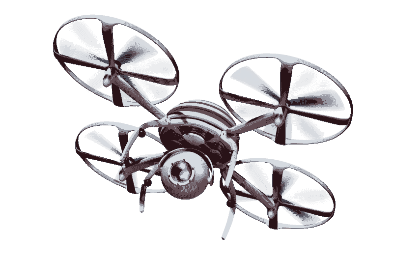
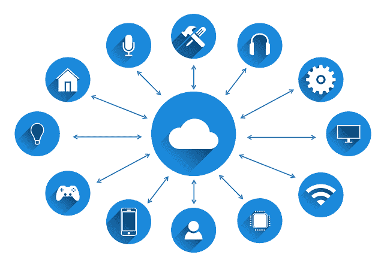

# 人工智能——超越宣传

> 原文：<https://www.freecodecamp.org/news/ai-beyond-the-hype-3fd6b4b16c3c/>

乔治·克拉萨达基斯

人工智能正在改变我们的世界，未来的影响是巨大的:在我们工作的方式上，我们作为一个社会生活、合作、决策和行动。但是风险是什么，我们如何做好准备？

**人工智能**。我们这个时代最流行的技术术语之一——经常被过度使用甚至误用。

媒体喜欢人工智能驱动的成功故事和“反乌托邦”。机器取代人类工人，AI 超越人类智能，机器人接管控制等等。

如果你超越这种炒作，你会意识到一场真正的革命正在发生。要了解人工智能的潜力，只需检查深度学习等领域的最新进展及其在计算机视觉和自然语言处理等领域的应用。

在技术组合的推动下，正在发生大规模的破坏，使机器能够理解海量数据并执行认知功能。

人工智能正在改变我们的世界，未来的影响是巨大的:在我们工作、生活、协作、决策和行动的方式上，就像一个社会。

### **1。人工智能，已定义**

人工智能可以定义为使系统能够封装认知功能以及适应和学习能力的技术，从而实现自我改善。

人工智能驱动的系统可以捕捉和“理解”它们的环境，并朝着特定目标做出最佳的实时决策。

作为人工智能的一个典型例子，“计算机视觉”使系统能够通过复杂的算法“看”。它们被训练来识别各种各样的实体，例如图片或视频中的风景、人和物体。

在应用人工智能的另一个例子中，“自然语言处理”技术能够与基于自由形式的自然语音的机器进行交互。

NLP 和相关技术可以“理解”自然语言，并以有意义的方式做出响应。一旦机器提取出“自然语音”请求的上下文，它就会合成正确的响应，并作为“自然语音”返回给用户。

人工智能的快速发展得益于人类主要活动的数据流。这些包括在线通信、社交互动、设备使用、搜索、内容消费和物联网数据流——仅举几例。

为了理解这些大量复杂的数据，人工智能系统利用云计算和专门的机器学习算法的力量。世界规模的数据中心拥有巨大的带标签的数据集，正被用于训练人工智能算法执行某些认知功能。

### 2.最先进的

#### 算法现在可以“看见”

计算机“看”的能力是一项惊人的成就。人工智能系统可以以令人印象深刻的细节水平“理解”图像或视频的上下文。他们可以识别越来越多的实体，如人、命名的个人、汽车、房屋、街道、树木等等，并获得越来越高的成功。

给定一幅图像或视频，算法可以估计其他属性，如照片中的人数、他们的性别、年龄甚至他们的情绪状态。

你可以简单地将一张全家福照片提交给一个商业认知服务网站，然后在几毫秒内得到一个回复，包括被识别的人、他们的性别、年龄和主要情绪。照片中的对象也可以被识别。例如，人工智能可以识别汽车及其制造商和型号。然后，它可以对其进行标记，以改进搜索、分组和可发现性。

> 在不久的将来，算法将能够*推断出甚至*所暗示的情况——比如*的儿童聚会*，一场*的体育赛事*，一场*的商务会议*或者公园里人们的随机安排。

计算机视觉的可能应用令人印象深刻。从可以 360 度“看”并实时了解环境及其动态的自动驾驶汽车，到像微软的[视觉人工智能](https://blogs.msdn.microsoft.com/accessibility/2016/04/07/seeing-ai/)这样的特殊应用程序，这是一个帮助视力受损或失明的人了解他们环境的原型系统！

计算机视觉正在取得巨大进展，在自动驾驶汽车、导航、机器人、模式识别、医疗诊断等领域有大量应用。人工智能系统不断学习，而且学得很快。

查看这篇文章了解更多人工智能的最新趋势。

#### 与“机器”的对话

与亚马逊 Alexa、Cortana、Siri 或谷歌助手的短暂互动足以实现自然语言处理技术的巨大进步。

微软和 IBM 宣布，在处理从体育到政治的讨论时，他们的 NLP 技术与专业转录员表现相同(或更好)

谷歌最近展示了其数字助理技术 Duplex ，它能够通过自然的对话体验来完成某些任务。例如，它可以通过与人进行自由形式的对话来安排会面或约会。

> 数字助理将变得越来越智能、有背景和主动。

在不久的将来，**你的数字助理会以对话的方式自然回应**，其风格、态度和幽默可能与你的个性和你当前的心情相匹配。

数字助理通过与用户的每次互动不断学习。它们更好地匹配用户明确陈述或隐含识别的偏好。在某个时间点，DAs 将通过无缝利用关于用户的深刻知识、来自用户环境的信号以及全球趋势和动态，变得主动和自主。

### 3.受人工智能影响的行业

人工智能已经在许多方面影响着我们的社会经济系统。我们已经进入了一个市场、企业、教育、政府、社会福利体系、公司、就业模式和社会结构剧烈变革的阶段。由于智能技术和自动化，一切都将很快被重塑。

> 人工智能的大规模采用将从根本上改变所有行业，如下所述。

#### **运输系统**

这个部门正在经历一场彻底的变革。完全自动驾驶的汽车将很快成为现实。它们将更加安全、高效和有效。自动驾驶卡车、智能集装箱、无人驾驶出租车和智能城市只是交通行业未来现实的一些例子。

人工智能在交通领域将推动巨大的变化，不仅是对车辆，也是对整个生态系统——从出租车服务到电子商务和包裹递送服务。

> 消费者习惯将受到严重影响，从拥有汽车转变为按需消费汽车服务。

由于运营服务的公司能够更好地利用汽车等因素，汽车作为服务的成本将显著降低。

由自动驾驶汽车组成的整个交通网络将由人工智能算法编排，以最佳方式实时适应需求、交通和其他条件。随着城市的扩张和发展，这将改变人们的通勤方式。

**例如**，自动驾驶汽车带来的更便宜、更快捷、更安全的运输新时代，可能会引发去城市化趋势——尤其是如果你考虑到在自动驾驶汽车上度过的时间可以充分利用现代办公室的能力。

#### **电子商务**

凭借先进的人工智能个性化、动态定价和报价生成，客户体验变得越来越智能。

履行中心变得更加自动化——机器人在空间导航以收集产品和执行客户订单——在某些情况下，是自动的。

无人驾驶的无人机和汽车可以在送货过程的最后一部分发挥作用。随着集中智能将协调整个流程，典型的销售流程、渠道、实体店网络变得不那么重要，从而扰乱了行业。

#### **金融服务**，**保险**

任何需要大量数据处理和内容处理的行业也将受益于人工智能。

金融机构将实现交易验证、欺诈识别、股票交易、推荐和咨询服务等重要流程的自动化。

保险公司将利用大量可用数据、预测和机器学习技术来获得更好的风险估计。因此，他们将能够提供更好的产品，满足特定客户的确切需求。

智能无人驾驶汽车的采用也将对汽车保险公司产生重大影响。

#### **国家和公民服务**

人工智能可以在消除官僚主义、改善公民服务、治理和社会方案方面产生巨大影响。

#### **法律服务**

甚至更多建立在牢固关系之上的传统职业，如法律职业，也将被人工智能重新定义。法律环境中的典型支持服务，处理文档处理、分类、发现、总结、比较和知识管理——这些任务是人工智能代理已经擅长的。

#### **产品开发**

人工智能引入了新的功能，改变了典型的产品开发流程——无论是数字产品还是物理产品。随着高级认知技术(通过易于消费的 API 提供基于云的商业人工智能产品)和低成本集成场景的普遍存在，人工智能驱动的创新机会呈指数级增长。

商业认知 API 和云使软件开发人员能够轻松构建由高级人工智能功能驱动的认知应用。实体产品制造流程也可以受益于人工智能驱动的生产线、质量控制系统和持续改进流程。产品将很快以完全不同的方式被制造出来；他们将会被连接起来，变得聪明。

#### **教育**

人工智能将在世界范围的数字化内容、数据以及科学和普通知识的基础上，极大地改善整个教育系统。

智能教育代理将捕捉学生的需求**以合成最佳的个性化教育计划** —匹配学生的意图、正确的水平、进度、偏好的内容类型和其他参数。

在另一种情况下，人工智能应用程序将能够主动推荐教育机会和个性化的教育内容——取决于用户职业生涯的当前状态、教育水平和以前的经历。

这可以采取永远在线的智能“教育顾问”的形式，为每个用户发现正确的学习机会。

### 4.担忧

关于大规模采用人工智能的社会、政治和伦理影响，存在严重的关切和未回答的问题。

例如，通过使用人工智能可以大规模实现的“智能自动化”有望改变我们的工作方式和所需的技能。某些角色会变得过时，一些职业最终会消失。

#### 致命自主武器

自主机器的概念令人印象深刻。想象一下一辆自动驾驶汽车，它可以捕捉环境和动态，并做出实时决策，以在特定约束下实现预定义的目标——从 A 点移动到 B 点。

然而，在军事背景下，这种自主决策令人恐惧:所谓的致命自主武器是指未来的机器人系统，可以在没有人类干预或批准的情况下打击目标。

但是，谁在控制这些“杀手机器人”的设计、操作和目标分配呢？这样的机器人如何能够理解复杂情况下的细微差别，并做出危及生命的决定？还有很多。

#### **偏见的风险和透明的需要**

人工智能系统通过分析大量数据来学习，并通过对交互数据和用户反馈的持续建模来保持适应。

我们如何确保人工智能算法的初始训练是公正的？如果一家公司通过训练数据集(有意或无意)引入偏向于特定类别的客户或用户，该怎么办？

例如，如果负责从一堆简历中识别有才华的候选人的算法继承了已知或未知的偏见，导致了多样性相关的问题，那该怎么办？

我们必须确保这些系统的决策过程是透明的。这是更好地处理边缘案件的关键，同时支持更广泛的受众和社会的普遍理解和接受。

#### **获取数据、知识、技术。**

在我们这个互联的世界里，相对少数的公司正在收集大量的数据。访问这些数据可以准确再现我们的日常生活，包括活动、互动以及明确或隐含的兴趣。能够访问这些数据的人会“知道”我们的移动历史、我们的在线搜索和社交媒体活动、聊天、电子邮件和其他在线微观行为和互动。

> 人工智能系统将能够“理解”任何在线用户——根据*兴趣*、*日常习惯*和*未来需求*；它可以得出令人印象深刻的估计和预测，从*购买兴趣*到*用户的情绪状态*。

如果你大规模地考虑这种人工智能输出——在群体层面上分析数据——这些预测和见解可以描述整个群体的合成、状态和动态。

很明显，这将为控制这些系统的人提供极大的权力。回想一下剑桥分析案例。特定个人用户的数据可能价值很低，但当进行大规模分析时——对于足够大的用户群，使用先进的分析和推理模型——它可能会产生巨大的社会政治影响。

#### **隐私权**

当你考虑未经授权访问一个人的在线历史(或其他)数据的可能性时，隐私权显然处于危险之中。但是，即使在离线用户的情况下——有人故意决定保持“断开连接”——隐私权仍然受到威胁。

想象一个断开连接的用户(没有智能手机或其他设备知道用户的位置)在未来的“智能城市”中移动。对于安全摄像头网络来说，走过几条主要街道就足以捕捉用户的踪迹，并可能通过可靠的面部识别来识别他们，而不是集中的数据存储。谁能在什么条件下获得这些信息，这显然是个大问题。

#### **未经授权的访问和控制**

安全和访问控制是一个重要方面。如果有人损害了智能系统(例如，自动驾驶汽车)，后果可能是灾难性的。智能互联系统和机器的安全性，防止未经授权的访问，是重中之重。

#### **技术失业**

这被定义为新技术应用“解释”的失业——在人工智能时代，它指的是被智能自动化取代的工作。

**在未来几年**，我们将见证劳动力和市场的重大变化。角色和工作将变得过时，行业将彻底改变，就业模式和关系将被重新定义。

例如，与客户服务/呼叫中心、文档管理、内容审核相关的任务和活动越来越多地基于技术和智能系统。

与生产线和工厂的运营和支持相关的角色也是如此。智能机器人正在取代人类，它们可以安全地在太空中导航，找到并移动物体(如产品、零件或工具)，并执行复杂的组装操作。

但事实证明，人工智能在处理更复杂的活动方面非常有效——那些需要实时处理多个信号、数据流和积累的知识的活动。一个典型的例子是自动驾驶汽车，它可以捕捉并“理解”它们的环境及其动态——它们可以实时“看到”,做出决定并采取行动。职业司机(出租车、卡车等)将会看到对他们技能的需求迅速下降。

#### **道德、社会责任和艰难的决定**

人工智能能够实时做出最佳决策。虽然在大多数情况下，最佳决策是客观确定的，并被普遍接受，但也有几个例子提出了伦理和道德问题。

例如，一辆知道自己将要撞上行人的自动驾驶汽车，必须决定它是否会通过一个危险的(对乘客而言)动作来试图避开敏感的行人。这需要在几毫秒内决定。

这些关键决策背后的逻辑必须被预先定义、充分理解和接受。同时，自动驾驶汽车的活动和决策的详细历史必须是可访问的，并可用于分析——在特定的数据保护规则下。

#### **对数据不成比例的权力和控制**

科技公司正在大力投资人工智能，包括科学/工程以及商业和产品开发层面。

与任何雄心勃勃的竞争对手相比，这些公司拥有无可匹敌的优势。大量数据集以多种不同的格式(文本、图像、音频、视频)描述了广泛的人类活动(搜索、通信、内容创建、社交互动等)。

为了保持其领先的市场地位，科技公司倾向于收购那些扰乱市场的有前途的科技/人工智能初创公司。这可能会导致超级大国，在大量积累的用户和机器数据上建立独特的人工智能技术。

### 5.承诺

在物联网(IoT)的背景下，数十亿台互联设备不断发送事件、操作和其他数据，然后通过先进的大数据、机器学习和人工智能技术进行处理。

**这些丰富的数据**，加上理解大规模复杂数据集的能力不断增强，正在为改善健康、生活方式、交通、教育以及几乎所有人类活动创造前所未有的机遇。**在某些假设下，这场技术革命将引领一个繁荣、富有创造力和幸福的新时代。**

是的，技术失业是一种风险。

但在大多数情况下，**人工智能将对人类起到支持作用**——让人类因素在处理需要判断和创造性思维的复杂和关键情况时表现得更好。

在未来，人类将不再需要从事常规的、价值有限的工作。劳动力和基本的就业模式将从长期的全职就业协议转向灵活的选择性服务。

将会出现一系列新的商业机会，增强企业家精神、创造力和创新文化。

与此同时，许多新的角色和专业将被创造出来——专注于技术和科学，让人们从单调、低价值的工作中腾出时间，从事更具创造性的活动。

教育系统将向个性化课程和终身学习模式发展。创新和创造性思维将通过智能获取世界积累的知识、想法和创造性能量来实现。

随着人工智能在交通行业的应用，我们将见证道路上的事故和死亡人数大幅减少。此外，人们将受益于更低的运输成本和更高的服务水平。

**借助智能发现工具，人们将更好地获取世界数字化知识**。“假新闻”问题，以及内容质量、安全和在线安全都将通过智能组件和人工智能服务得到改善。

**人工智能也在改善我们的卫生系统**:更准确的医疗诊断、个性化的医疗、更短的药物开发周期将显著提高整体有效性、对患者的服务水平以及卫生服务的普遍可及性。

### 6.做好准备

但是，我们如何确保人工智能的正确使用——为了个人和社会的利益？我们如何才能最好地适应已经发生的技术变革？

**人们需要对该技术、其潜力、优势和相关风险有一个总体的认识和理解**。社会需要适应新的技术环境，将人工智能作为一种“智能工具”来帮助人们实现更多目标。我们都需要认识到人类的价值，但也要看到人工智能的不良使用带来的好处。

**各国需要通过更新法律、框架、社会方案及其教育系统来适应变化**。需要新的战略——以教育为重点——以及新的市场、商业和社会体系框架；他们需要重新思考在智能自动化的新时代，市场、公司和就业协议应该如何运作；他们需要重新设计社会机制，以涵盖一系列新的场景和情况

人们需要转换到一种生活学习模式——学习掌握新技能，发掘与事物新秩序更相关的新才能。

思想领袖需要推动正确的规则、框架和全球协议，以减轻权力集中和控制数据和技术的风险。

这场技术革命为繁荣和发展带来了巨大的机遇。我们只需要以某种方式确保技术将在正确的方向上应用和使用。我们需要一个框架，用基本规则和那些保证可靠性、透明度和道德一致性的规范来指导人工智能应用的开发。

朝着正确方向迈出的关键步骤已经开始。例如，已经有禁止 ALWs 的讨论。还有向**可解释 AI**(**)和‘解释权’的运动。这些允许理解用于人工智能的模型(以及它们如何做出特定决策——这也是欧盟 GDPR——通用数据保护法规的要求)。**