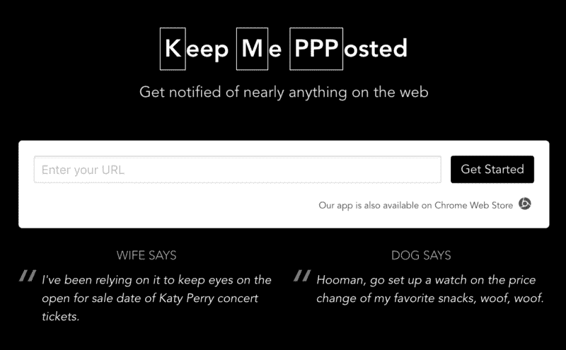

# 我在全职工作的三个月里建立了三个服务

> 原文：<https://www.freecodecamp.org/news/what-i-learned-building-three-services-in-three-months-while-working-full-time-5cf1bbf207d0/>

作者 taira

# 我在全职工作的三个月里建立了三个服务

Photo by [Lost Co](https://unsplash.com/photos/CmF_5GYc6c0?utm_source=unsplash&utm_medium=referral&utm_content=creditCopyText) on [Unsplash](https://unsplash.com/search/photos/work?utm_source=unsplash&utm_medium=referral&utm_content=creditCopyText)

为了给你一点背景，我先简单介绍一下我自己。我是一名自学成才的开发人员，目前在日本工作。我在任何方面都不特别，我没有任何互联网名人朋友，但我确实热爱编码，并有积极的能行态度。

去年年底，我决定启动一个实验项目，试图在 2018 年利用业余时间每月创建一个服务。我想看看我，一个想成为独立黑客的人，是否能想出一些办法。这是我目前为止的故事。

我将把对每项服务的讨论分成以下几个部分:

*   这个想法是如何产生的
*   服务是什么
*   技术堆栈
*   我花了多少美元
*   经验教训

### 一月:挠挠自己的痒。

#### **这个想法是如何产生的**

我想到的第一件事是制造一些我会经常使用的东西。在最坏的情况下，如果我的服务没有吸引任何人，它仍然会帮助我。

我开始审视自己的日常生活。我意识到我每天花相当多的时间去各种各样的网站。因此，如果有一个网络服务来帮我关注这些网站，并通过电子邮件向我发送更新，这不是很好吗？这将帮助我专注于重要的事情。

#### **什么是服务**

KMPPP

[Keep Me PPPosted](https://kmppp.com) 是我最终构建的东西。为了让这项服务更加人性化，我还开发了一个 [Chrome 扩展](https://chrome.google.com/webstore/detail/keep-me-ppposted/fnfioeoaippeenifnfhpblddioiaaeji?utm_source=medium)，允许用户当场订阅任何网站的更新。你可以在[关于](https://kmppp.com/about?perspective=dev)的页面上查看详细的用户故事和设计决策，我正在打开这个项目的采购，这里是 Github [回购](https://github.com/slashbit/spider-less):)

#### **技术堆栈**

我选择了我最喜欢的:前端 Vue.js 和后端 AWS Lambda 无服务器组合。在过去的一年半时间里，我在我现在的公司每天都在处理这些事情。考虑到我的大部分服务都遵循事件源模式，无服务器非常适合我的设计。

#### **我花了多少钱**

总共 22 美元:域名费 7 美元，Sendgrid 订阅费 10 美元(每月 100，000 封电子邮件，我也可以用它来提供其他服务)，以及在 Chrome 网上商店发布扩展的一次性费用 5 美元。AWS 自由层计划涵盖了所有其他内容。

#### **吸取的经验教训**

这绝对是一次宝贵的学习经历，因为这是我第一次全面的网络服务。我把它贴在独立黑客上，得到了一些用户。但更重要的是，作为一名公司的开发人员，我有机会与我的用户直接交谈。

在我的工作中，我从来没有和我的最终用户交谈来获得即时的反馈，并对我构建的产品拥有完全的控制权。仅此一点就值得我投入时间和精力。

### 二月:利用我的资源。

#### **这个想法是如何产生的**

一月很紧张，所以我决定放松一下。我想除了冰箱里的半盒鸡翅，我还能提供什么。其他人可能需要的东西。

我在日本，在这里工作可能是开发人员感兴趣的事情。最重要的是，我经常收到招聘人员发给我的工作机会。将开发者和招聘者联系起来可能是我可以努力的方向。

#### **什么是服务**

我没有直接开始编码，而是使用 MailChimp 创建了一个邮件列表。一有机会，我就开始在开发者社区分享我的经验。这很有效，我的邮件列表在一个月内增长到了 500 多个订户。

与此同时，每当招聘人员联系我时，我都会不经意地提到我的邮件列表，并问我是否可以与我的订户分享。

#### **我花了多少钱**

$0.发出的邮件由同一个 Sendgrid 帐户覆盖，用 AWS Lambda 构建的后端 cron 作业也由我的 AWS 自由层计划覆盖。

#### **吸取的教训**

似乎我花在编码上的时间越少，花在推广我的服务上的时间越多，我就能获得越多的潜在用户。在我开始后的两个星期，我收到了一封来自我的订户的电子邮件，感谢我所做的一切。

他还没有通过这项服务找到工作，他只是想感谢我分享了这些信息。那封邮件温暖了我的心，因为我知道我所做的实际上是在帮助别人。那是有史以来最好的感觉！

### 三月:从别人那里获得想法。

#### **这个想法是如何产生的**

在这一点上，我已经没什么主意了。那时我开始和我的非开发人员朋友交谈。我试图了解他们的日常生活是什么样的，如果他们有什么棘手的问题，我可以帮他们解决。

作为工作的一部分，我的一个朋友从客户那里接收 CSV 文件，然后将这些文件导入内部系统。通常，他收到的文件不符合要求，缺少列，或者包含不兼容的数据类型，等等。

他经常不得不回去让他的客户重做并重新发送文件。他尝试过使用 Excel 来自动化这个过程，但是失败了，因为大多数文件都很大(300 多 MB，1M 多行)。这听起来像是我能帮忙的事。

#### **什么是服务**

我创建了 [CSV Lint](https://csvlint.com) ，这是一个面向企业的 CSV 文件验证服务，它允许用户轻松地创建一个模式，以便在创建模式后验证 CSV 文件。它可以与他人共享(没有帐户的人也可以使用它)。这意味着一旦我的朋友创建了模式，他就可以要求他的客户在将文件发送给他之前用它来验证他们的文件。

#### **技术堆栈**

我没有使用 AWS，而是使用了谷歌云平台、Firebase 托管和数据库，以及谷歌云功能来处理后端逻辑。再次，他们的免费层涵盖了一切。

#### **我花了多少钱**

总共 17 美元。我花了 7 美元买了这个域名——这是一个非常棒的域名，我不得不说，拍拍自己的背。另外，在 Udemy 网站上花 10 美元购买了如何使用 Keynote 课程制作演示视频。这钱花得值，学到了另一项新技能。？

#### **吸取的经验教训**

我想出的主意十有八九不会有结果。与他人交谈，尤其是与我正常圈子之外的人交谈，常常能帮助我获得新的想法。然而，令人难过的是，我真的没有很多可以交谈的朋友——看起来我也需要在这方面努力。？

### 包扎

所以，这就是我到目前为止的旅程。我的项目没有一个成功过，而我目前从中赚了 0 美元。但是这些服务中的每一项都在以某种方式帮助人们，这让我每天睡觉时脸上都带着灿烂的笑容。而且，它们几乎不花我一分钱，我的冰箱里还有一些鸡翅。很好，很好。