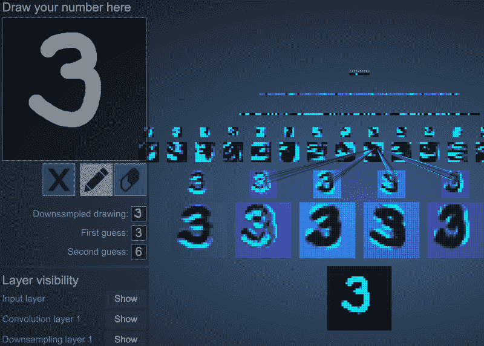
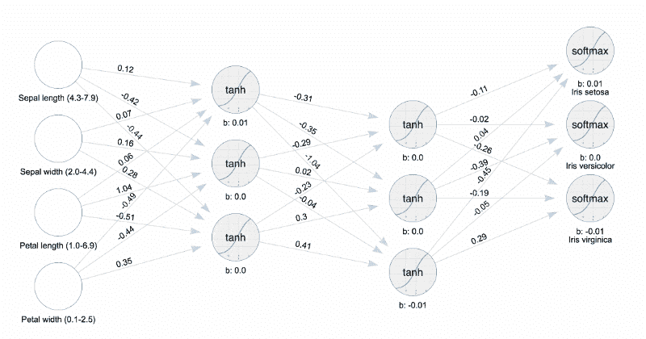

# 机器学习:如何从零到英雄

> 原文：<https://www.freecodecamp.org/news/machine-learning-how-to-go-from-zero-to-hero-40e26f8aa6da/>

#### 从“为什么”开始并以“我准备好了！”

如果你对人工智能和机器学习的理解是一个很大的问号，那么这就是给你的博文。在这里，我通过将鼓舞人心的视频和友好的文字粘在一起，逐渐增加你的*魅力*。

坐下来放松一下。这些视频需要时间，如果它们不能激发你继续下一部分，这很公平。

然而，如果你发现自己在这篇文章的底部，你已经获得了你的全面的知识和对这个新世界的热情。从那里你去哪里取决于你自己。

### 理解为什么机器学习现在如此热门

人工智能总是很酷，从在 Pong 中移动球拍到在 Street Fighter 中用连击照亮你。

人工智能一直围绕着程序员对事物应该如何表现的功能性猜测。有趣，但程序员并不总是像我们经常看到的那样在编程人工智能方面有天赋。只是谷歌“史诗游戏失败”看到人工智能，物理，有时甚至有经验的人类玩家的小故障。

不管怎样，人工智能有了新天赋。你可以教电脑玩视频游戏，理解语言，甚至如何识别人或物。这个冰山一角的新技能来自一个老概念，只是最近才获得了理论之外的处理能力。

我说的是**机器学习**。

你再也不需要想出先进的算法了。你只需要教计算机想出自己的高级算法。

那这种东西是怎么工作的呢？一个算法实际上并不像它在某种程度上……培育的那样多。我不是用育种做类比。观看这个短视频，它为创造人工智能的高层次概念提供了出色的评论和动画。

哇！对吗？那是一个疯狂的过程！

为什么当算法完成时，我们甚至不能理解它？一个很棒的视觉效果是人工智能被编写来击败马里奥游戏。作为一个人类，我们都知道如何玩侧滚，但识别产生的人工智能的预测策略是疯狂的。

印象深刻？这个想法很神奇，对吧？唯一的问题是我们不知道机器学习，我们不知道如何将它与视频游戏联系起来。

对你来说幸运的是，[埃隆·马斯克已经提供了一家非营利公司来做后一件事](https://openai.com/)。是的，在十几行代码中你可以连接任何你想要的人工智能到无数的游戏/任务中！[行动起来看看](https://www.youtube.com/watch?v=eaBYhLttETw)！

### 为什么要用机器学习？

我有两个关于你为什么应该关心的好答案。首先，机器学习(ML)是让计算机做我们以前从未让计算机做过的事情。如果你想做一些新的事情，不仅仅是对你自己，而是对这个世界，你可以用 ML 来做。

其次，你不影响世界，世界就会影响你。

现在，很多大公司都在投资 ML，我们已经看到它正在改变世界。思想领袖警告说，我们不能让这个新时代的算法存在于公众视野之外。想象一下，如果几个大公司控制了互联网。如果我们不拿起武器，科学就不会属于我们。我认为克里斯蒂安·海尔曼在他关于曼梯·里的演讲中说得最好。

> “我们可以希望其他人只用这种力量做好事。首先，我不认为这是一个好的赌注。我更愿意参与这场革命。你也可以。”

[Machine Learning Talk Video by Chris Heilmann](https://www.recallact.com/presentation/machine-learning-guided-user-interfaces)

### 好吧，现在我感兴趣了…

这个概念很有用，也很酷。我们在很高的层面上理解它，但是到底发生了什么？这是如何工作的？

如果您想直接进入主题，我建议您跳过这一部分，转到下一个“如何开始”部分。如果你想成为 ML 的实干家，你就不需要这些视频了。

如果你还在试图理解这是怎么一回事，下面的视频很适合用经典的 ML 手写问题来引导你理解其中的逻辑。

[https://www.youtube.com/embed/aircAruvnKk?feature=oembed](https://www.youtube.com/embed/aircAruvnKk?feature=oembed)

很酷吧？该视频显示，每一层都变得更简单，而不是更复杂。就像函数是将数据咀嚼成更小的片段，以抽象的概念结束。在这个网站上与这个过程互动，你可能会弄脏你的手。

[http://scs.ryerson.ca/~aharley/vis/conv/flat.html](http://scs.ryerson.ca/~aharley/vis/conv/flat.html)

看着数据通过一个经过训练的模型很酷，但你甚至可以看着你的神经网络得到训练。

机器学习在现实世界中的一个经典例子是 1936 年的 iris 数据集。在我参加的一个由 Java xpert 的关于机器学习的概述的演讲中，我学到了如何使用他的工具来可视化神经网络上神经元的权重调整和反向传播。你可以看到它训练神经模型！

Training the iris neural network with [Jim’s visualizer](https://github.com/JavaFXpert/visual-neural-net-server)

即使你不是 Java 爱好者，Jim 关于所有机器学习的演讲也是一个非常酷的关于 ML 概念的 1.5 小时的介绍，其中包括了更多关于上面例子的信息。

这些概念令人兴奋！你准备好成为这个新时代的爱因斯坦了吗？突破每天都在发生，所以现在就开始吧。

### 我如何开始？

有大量的可用资源。首先，你应该订阅一些时事通讯/twitter 账户，以保持个人炒作的势头。这个是我开始的！

[**【趣机学习(@ funmachinehlearn)|推特**](https://twitter.com/FunMachineLearn)
[*趣机学习(@ funmachinehlearn)最新推文。不适合机器学习势利者。享受美丽和……*twitter.com](https://twitter.com/FunMachineLearn)

**如果你想要一些更高级的概念，我建议你上 Coursera 上的非技术课程[AI for everybody](https://www.coursera.org/learn/ai-for-everyone/)。**这将在你前进的过程中让你的大脑记住一些术语和例子。

至于“深入学习”，我将推荐两种方法。

#### 螺母和螺栓

在这种方法中，你将理解机器学习的算法和数学。我知道这种方式听起来很难，但是如果真的能够深入细节，从头开始编写代码，那该有多好！

如果你想成为 ML 中的一股力量，并在深入的对话中保持自己的优势，那么这就是适合你的路线。

我建议你试试 Brilliant.org 的应用程序(对任何科学爱好者来说都很棒)，并参加人工神经网络课程。这个课程没有时间限制，帮助你在手机上消磨时间的同时学习 ML。

**这个 1 级后要花钱。**

结合上述内容，同时报名参加[吴恩达](https://www.freecodecamp.org/news/machine-learning-how-to-go-from-zero-to-hero-40e26f8aa6da/undefined)的斯坦福课程“11 周内的机器学习”。这是 Jim Weaver 在上面的视频中推荐的课程。我也有这个课程是由[珍·卢柏](https://www.freecodecamp.org/news/machine-learning-how-to-go-from-zero-to-hero-40e26f8aa6da/undefined)独立向我建议的。

每个人都警告说，这个过程是艰难的。对你们中的一些人来说，这是一个节目停止，但对其他人来说，这就是为什么你要让自己通过它，并收集一个证明说你做到了。

这门课程是 100%免费的。如果你想要一个证书，你只需要付钱就可以了。

有了那两门课，你将有许多工作要做。如果你成功了，每个人都会对你印象深刻，因为这并不简单。

但更重要的是，如果你真的通过了，你会对机器学习的实现有深刻的理解，这将促使你成功地以新的改变世界的方式应用它。

#### 极速赛车

如果你对编写算法不感兴趣，但你想用它们来创建下一个令人惊叹的网站/应用程序，你应该加入 TensorFlow 和速成班。

TensorFlow 是机器学习的*事实上的*开源软件库。它可以以无数种方式使用，甚至可以与 [JavaScript](https://js.tensorflow.org/) 一起使用。[这里有一个速成班。](https://developers.google.com/machine-learning/crash-course/)

在这里可以找到更多关于可用课程和排名的信息。

如果参加课程不是你的风格，你还是很幸运的。你不必为了今天使用它而学习 ML 的本质。你可以在许多方面有效地利用 ML 作为一种服务，技术巨头已经训练好了模型。

我仍然要提醒你，不能保证你的数据是安全的，甚至是你自己的，但是 ML 提供的服务非常有吸引力！

如果你感到兴奋，并且能够将你的数据上传到[亚马逊](https://aws.amazon.com/machine-learning/) / [微软](https://azure.microsoft.com/en-us/services/machine-learning-services/) / [谷歌](https://cloud.google.com/products/machine-learning/)，那么使用 ML 服务可能是你的最佳解决方案。我喜欢把这些服务看作是通向高级 ML 的入门药物。不管怎样，现在开始就好。

#### 更新！

我创建了一个为期 5 天的人工智能入门迷你课程！！！

**[https://academy . infinite . red/p/ai-揭秘-免费-5 天-迷你课程](https://academy.infinite.red/p/ai-demystified-free-5-day-mini-course)**

这里有一些我发现的很棒的教程，你应该看看

*   [BrainJS 教程—JS 中的神经网络](https://scrimba.com/playlist/pVZJQfg)
*   [TensorFlow 教程代码+视频](https://github.com/Hvass-Labs/TensorFlow-Tutorials)
*   [深度学习海洋— Kickstarter 课程](https://github.com/osforscience/deep-learning-ocean)

### 让我们成为创造者

我要对前面提到的所有人和视频说声谢谢。他们是我开始的灵感，尽管我在 ML 世界中还是个新手，但我很高兴为其他人照亮道路，因为我们拥抱这个令人敬畏的时代。

如果你开始学习这门手艺，就必须伸出手去与人交流。没有友好的面孔、答案和共鸣板，任何事情都很难。能够提出问题并得到回应是一个游戏规则的改变者。[加我](https://twitter.com/GantLaborde)，加上面提到的人。[友善的人用友善的建议帮助](https://www.reddit.com/r/MachineLearning/)！

看到了吗？

> 超级普通！Idk 学习 shell sort 是什么意思？但是，是的，知道，认识和减轻是好的
> 
> — Jennifer (@sugargreenbean) [April 8, 2018](https://twitter.com/sugargreenbean/status/983062966328348673?ref_src=twsrc%5Etfw)