# 如何在 Python 中使用 TF-IDF 处理文本数据

> 原文：<https://www.freecodecamp.org/news/how-to-process-textual-data-using-tf-idf-in-python-cd2bbc0a94a3/>

作者:马扬克·特里帕蒂


计算机擅长处理数字，但不太擅长处理文本数据。处理文本数据最广泛使用的技术之一是 TF-IDF。在这篇文章中，我们将了解它是如何工作的，它有什么特点。

从我们的直觉来看，我们认为在文本数据分析中出现频率较高的单词应该具有更大的权重，但事实并非总是如此。像“the”、“will”和“you”这样的词——称为**停用词**——在文本语料库中出现得最多，但意义非常小。相反，那些罕见的单词实际上有助于区分数据，并且更有分量。

### TF-IDF 简介

**TF-IDF** 代表“项频率—逆数据频率”。首先，我们将学习这个术语在数学上的含义。

**词频(tf)** :给出这个词在语料库中每个文档中的出现频率。它是单词在文档中出现的次数与该文档中单词总数的比率。它随着该单词在文档中出现的次数的增加而增加。每个文档都有自己的 tf。

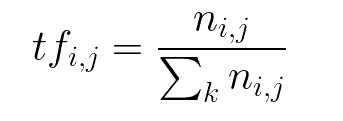

**逆数据频率(idf):** 用于计算语料库中所有文档中稀有词的权重。在语料库中很少出现的单词具有高 IDF 分数。它由下面的等式给出。

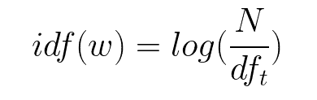

结合这两者，我们得出语料库中文档中的单词的 TF-IDF 分数(w)。它是 tf 和 idf 的产物:

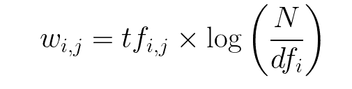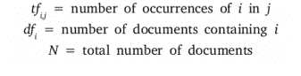

让我们举个例子来更清楚地了解一下。

第一句话:汽车在路上行驶。

句子 2:卡车在高速公路上行驶。

在这个例子中，每个句子都是一个单独的文档。

我们现在将计算代表我们的语料库的上述两个文档的 TF-IDF。

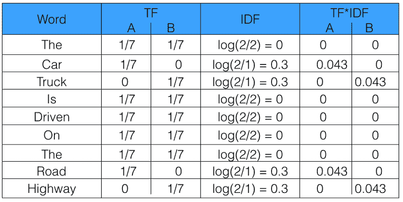

从上表可以看出，常用词的 TF-IDF 为零，说明它们不显著。另一方面，“汽车”、“卡车”、“公路”和“高速公路”的 TF-IDF 不为零。这些话有更多的意义。

### 用 Python 计算 TF-IDF

现在让我们从头开始用 Python 编写 TF-IDF 代码。之后，我们将看到如何使用 sklearn 来自动化这个过程。

函数`computeTF`按文档计算语料库中每个单词的 TF 分数。

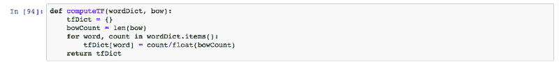

函数`computeIDF`计算语料库中每个单词的 IDF 分数。

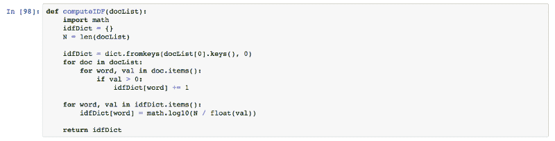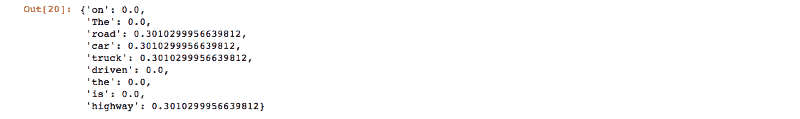

下面的函数`computeTFIDF`通过将 TF 和 IDF 得分相乘来计算每个单词的 TF-IDF 得分。

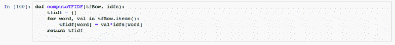

上面的代码为文档集 D1 和 D2 生成的输出与我们在上面的表中手工计算的结果相同。

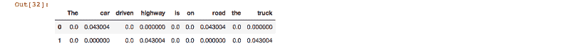

完整实现可以参考[这个链接](https://github.com/mayank408/TFIDF)。

#### sklearn

现在我们将看看如何在 Python 中使用 sklearn 实现这一点。

首先，我们将从`sklearn.feature_extraction.text`导入`TfidfVectorizer`:

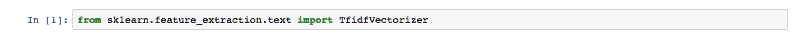

现在我们将初始化`vectorizer`,然后调用 fit 并转换它来计算文本的 TF-IDF 分数。

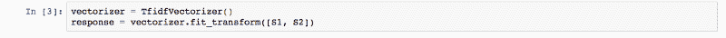

在引擎盖下，sklearn fit_transform 执行以下`fit` 和`transform`功能。这些可以在 GitHub 的官方 sklearn 库中找到。

```
 def fit(self, X, y=None):
        """Learn the idf vector (global term weights)
        Parameters
        ----------
        X : sparse matrix, [n_samples, n_features]
            a matrix of term/token counts
        """
        if not sp.issparse(X):
            X = sp.csc_matrix(X)
        if self.use_idf:
            n_samples, n_features = X.shape
            df = _document_frequency(X)

            # perform idf smoothing if required
            df += int(self.smooth_idf)
            n_samples += int(self.smooth_idf)

            # log+1 instead of log makes sure terms with zero idf don't get
            # suppressed entirely.
            idf = np.log(float(n_samples) / df) + 1.0
            self._idf_diag = sp.spdiags(idf, diags=0, m=n_features,
                                        n=n_features, format='csr')

        return self

    def transform(self, X, copy=True):
        """Transform a count matrix to a tf or tf-idf representation
        Parameters
        ----------
        X : sparse matrix, [n_samples, n_features]
            a matrix of term/token counts
        copy : boolean, default True
            Whether to copy X and operate on the copy or perform in-place
            operations.
        Returns
        -------
        vectors : sparse matrix, [n_samples, n_features]
        """
        if hasattr(X, 'dtype') and np.issubdtype(X.dtype, np.floating):
            # preserve float family dtype
            X = sp.csr_matrix(X, copy=copy)
        else:
            # convert counts or binary occurrences to floats
            X = sp.csr_matrix(X, dtype=np.float64, copy=copy)

        n_samples, n_features = X.shape

        if self.sublinear_tf:
            np.log(X.data, X.data)
            X.data += 1

        if self.use_idf:
            check_is_fitted(self, '_idf_diag', 'idf vector is not fitted')

            expected_n_features = self._idf_diag.shape[0]
            if n_features != expected_n_features:
                raise ValueError("Input has n_features=%d while the model"
                                 " has been trained with n_features=%d" % (
                                     n_features, expected_n_features))
            # *= doesn't work
            X = X * self._idf_diag

        if self.norm:
            X = normalize(X, norm=self.norm, copy=False)

        return X
```

在上面的代码中需要注意的一点是，在计算 IDF 分数时，n_samples 增加了 1，而不是 n_samples 的对数。这确保了 IDF 得分为零的单词不会被完全隐藏。

得到的输出是一个偏斜矩阵的形式，归一化后得到如下结果。

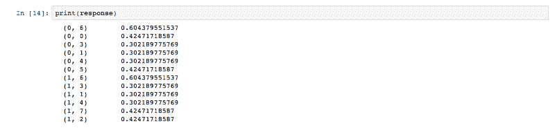

因此，我们看到了如何使用 sklearn 用 4 行代码轻松地编写 TF-IDF。现在我们理解了 TF-IDF 作为一种工具在处理语料库中的文本数据时是多么强大。想了解更多关于 sklearn TF-IDF 的信息，可以使用[这个链接](http://scikit-learn.org/stable/modules/generated/sklearn.feature_extraction.text.TfidfVectorizer.html)。

**编码快乐！**

感谢阅读这篇文章。如果觉得有帮助一定要分享出来。

想了解更多关于编程的知识，你可以关注我，这样每当我有新的帖子时，你都会得到通知。

干杯！

还有，我们来连线一下[**Twitter**](https://twitter.com/mayank_408)[**Linkedin**](https://www.linkedin.com/in/mayank-tripathi-a49563126/)[**Github**](https://github.com/mayank408)和 [**脸书**](https://www.facebook.com/profile.php?id=100001106266064) 。