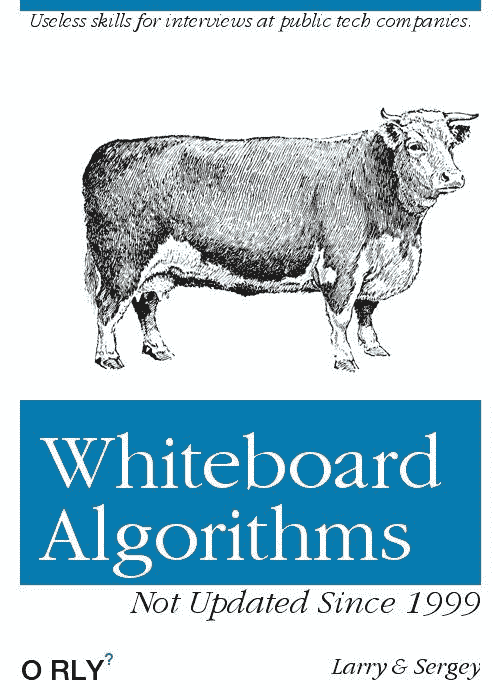
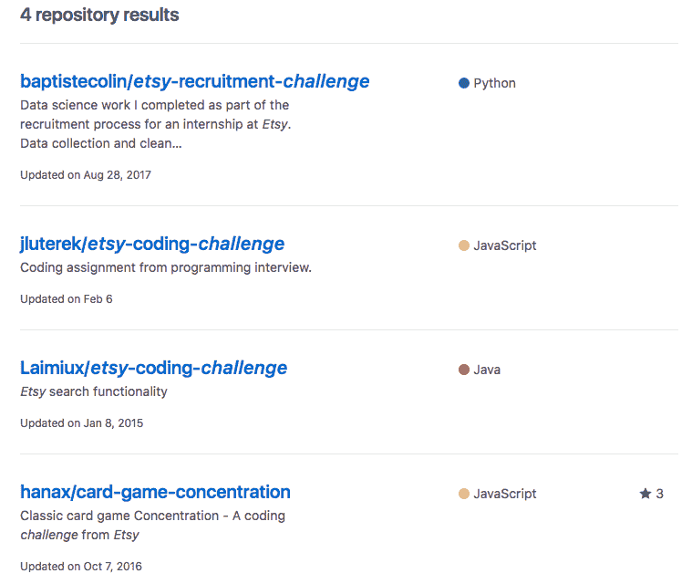
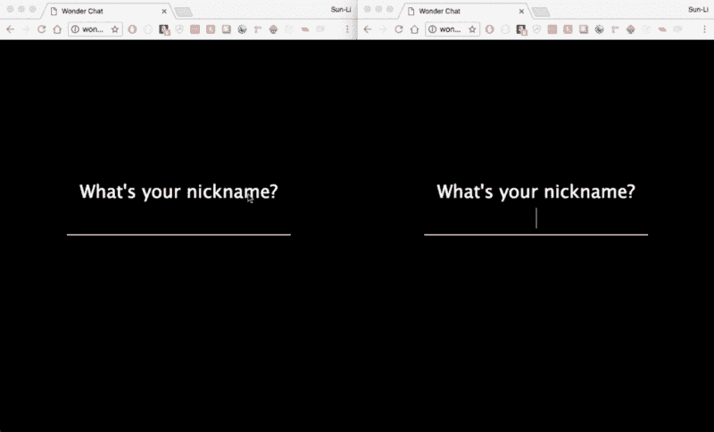

# 让我们谈谈白板面试和可能的替代方案

> 原文：<https://www.freecodecamp.org/news/lets-talk-about-whiteboarding-interviews-fed040e20cc9/>

作者:孙李贝蒂

# 让我们谈谈白板面试和可能的替代方案

Credit: [linkedin.com](https://www.linkedin.com/pulse/whiteboard-interviews-dead-adapt-get-left-behind-chaitanya-sai/)

许多工程师讨厌基于白板的面试问题，这对任何人来说都不是新闻。

无论是在 Twitter，Medium，还是 LinkedIn，都很容易找到发泄的对象。“招聘流程被破坏了”这句话被频繁使用，已经成为一种陈词滥调。

不幸的是，人们对这种挫败感充耳不闻。

尽管围绕“白板”的众怒不绝于耳，但它仍然是软件工程面试中的一个主要话题。部分原因是开发商很快表达了他们的不满，但却迟迟没有提供更好的替代方案。

#### 有更好的选择吗？

这个问题最近一直萦绕在我的脑海里。四周前，[我找到了第一份全职软件工程工作](https://hackernoon.com/what-it-took-to-land-my-dream-software-engineering-job-17c01240266b)。虽然我还没有参与招聘过程，但我最终会参与的。

就在一个月前，我还坐在桌子的另一边，我明白面试有多不精确。当轮到我提问时，我想确保我准确、公平地评估了我的潜在同事。

这种困境让我想到了两个问题:

1.  白板面试是最好的选择吗？
2.  如果没有，有什么更好的选择？

在这篇文章中，我将尝试回答这些问题。请记住，这些都是我个人的观点，是我自己的面试经验形成的。

我将尽可能客观地以真正的软件工程方式来完成这项任务:检查所有选项并权衡它们的利弊。

### 白板面试是最差的吗？

Credit: [twitter.com](https://twitter.com/mikeal/status/731549428780146688)

这个过程的第一步是仔细检查白板。

#### **优点:**

1.  快速省力
2.  不依赖于语言或领域
3.  你知道(通常)会发生什么
4.  社区支持(Glassdoor、LeetCode、Pramp 等等)

#### 缺点:

1.  运气是一个很大的因素(算法抽奖)
2.  不一定测试工程能力
3.  青睐年轻工程师和应届毕业生

对于那些要求工程师掌握 CS 基础知识、低级算法，并且不依赖于图书馆的公司来说，白板面试是完美的。

SpaceX、MacOS/Windows 和脸书的 React 都是由具备这些知识的工程师打造的。从这些公司之一获得白板面试是意料之中的。

作为求职者，我喜欢白板面试。我知道会发生什么。大多数算法问题都属于这些一般主题:

*   数组/字符串
*   二叉树
*   链接列表
*   DFS/BFS
*   追踪
*   动态规划

提前知道这一点意味着我可以为此而学习。还有就是[过剩](http://leetcode.com) [的](http://pramp.com) [学习](http://hackerrank.com) [工具](https://www.interviewcake.com/) [到](https://interviewing.io/) [从](https://www.geeksforgeeks.org/interview-preparation-for-software-developer/)中选择 [。技术面试准备是一个完整的行业。](https://www.youtube.com/results?search_query=software+engineer+interview+prep&page=&utm_source=opensearch)

因此，白板面试并不是每个公司的最佳选择。这在很大程度上取决于运气、记忆和谁花了最多时间学习。

不是每个人都能长时间学习掌握算法。

我很幸运，我能做到，并且胜过了其他不能做到的工程师。我是不是比他们都更好的工程师？也许吧，但我不确定白板面试是揭示这一点的最佳方式。

因此，如果有人怀疑白板面试是这份工作的最佳工具，还有什么比这更好的呢？

让我们来看看一些替代方案。

### 通过计算机的编码挑战

Credit: [lolboom.net](http://www.lolboom.net/photos-dog-tries-to-be-human-has-no-idea-what-shes-doing/)

#### 优点:

1.  开始使用计算机和熟悉的开发环境
2.  可以通过屏幕共享远程完成
3.  白板面试的所有其他优势

#### 缺点:

1.  对语法和运行能力更严格。
2.  编程环境和插件会起到很大的作用
3.  白板面试的相同缺点

笔记本电脑上的编码挑战是白板面试中不太严格的一个。

考生可以使用自己的电脑。它们可以远程完成，也可以在结对编程环境中完成。

我注意到这些问题的一个好处是，它们通常比白板问题更容易。我得到的大多数问题都涉及字符串操作，或者任何有经验的工程师都不需要学习的简单算法。

这样做的缺点是更加强调功能性。

在我找工作期间，我被问了两次[硬币兑换](https://leetcode.com/problems/coin-change/description/)的问题。一个是白板挑战，另一个是编辑器挑战。

对于白板挑战，我主要解释了我的解决方案。在我的笔记本电脑上，我被期望编写边缘案例测试，并保证我的解决方案有效。

我喜欢白板的部分原因是因为它的宽大。没有人会通过编译器来运行你写的函数。只要面试官明白你在想什么，而且文章写得足够好，你就能得到满分。

代码挑战就不是这样了。

有些人可能会认为强调功能更好，因为我们是靠编写工作代码赚钱的。这是真的，但是我们没有在 30-45 分钟的冲刺中获得报酬。

我们只希望你在面试时不要紧张。导致测试失败和几分钟调试的一个小错误可能是“强雇”或通过的区别。

代码挑战仍然有白板一样的缺点，因为它们中的许多是基于算法的。

尽管环境舒适，但随着功能压力的增加，问题会变得更加困难。如果你已经不喜欢算法问题，代码挑战也不会好到哪里去。

### 带回家评估

#### 优点:

1.  我可以穿着睡衣做这个
2.  通常给一周以上的时间来完成任务
3.  开始使用自己的编辑器和开发环境
4.  可以成为投资组合的新成员
5.  通常比白板更有趣

#### 缺点:

1.  难度可以有很大的不同
2.  比编码挑战耗费更多的精力和时间
3.  可以依赖于域
4.  会因为竞争而导致功能退化
5.  不代表日常工作

许多工程师喜欢把任务带回家。上交的时间表通常是灵活的，候选人可以实际编码。毫不奇怪，程序员更喜欢这样，而不是站在白板前默默接受评判。

然而，带回家考试有一些主要的缺点。

首先，它们很容易操作。

许多公司在 GitHub 上主持他们的测试。在 GitHub 搜索中输入“挑战”或“测试”，你会找到很多。这将给精明的候选人足够的时间先发制人地研究挑战。

那不是真正的抱怨。更像是专业小费。

什么是*什么是*一个问题是，找到其他人对这些挑战的答案并复制它们很容易。许多工程师在他们的 GitHub 档案中保留了将挑战带回家的答案。

你甚至可以自己测试。在 GitHub 搜索中输入“ <company name="">Challenge”，看看你能找到什么。</company>

我住在布鲁克林的 Etsy 总部旁边，很好奇我是否能找到他们一些测试的答案。“Etsy 挑战”揭示了四个。在“Etsy 测试”中甚至还有更多。

公司确实可以改变他们的评估。然而，由于细节被泄露，每隔几个月改变一次面试过程可能会很麻烦。

第二，完成这些挑战的难度和时间差异很大。

在我上次找工作的时候，我被安排了四次带回家的作业。其中三家公司表示，他们应该只需要 3-5 个小时就能完成。

他们都花了我好几天。

出现这种情况的主要原因是因为挑战通常是特定领域的。他们需要几个小时来研究 API 文档和新技术。

第四家公司接受了一个很容易花一周时间的挑战，给了我两天时间。我必须建立一个[功能聊天应用程序，支持斜线命令](https://github.com/sunny-b/WonderChat)。

这是一个有趣的项目，但是为了完成它，我需要放下两天的工作。

如果一个候选人足够幸运，可以同时面试多家公司，那么仅仅是应对这些挑战就可以成为一份全职工作。

此外，专业开发人员必须在遗留代码基础上工作，并应对最后期限。为期一周的绿地项目不会评估受访者在快节奏的环境中工作得有多好。

总来说，我喜欢把家庭作业作为候选人能力的初步筛选。也就是说，它们应该与候选人申请的工作相关，不应该花太多时间来完成。

### 基于项目/租赁合同

#### **优点:**

1.  获得与候选人/团队合作的机会
2.  获得工作报酬
3.  着手真正的项目
4.  根据您与团队和团队代码的合作程度进行评估

#### **缺点:**

1.  长期承诺
2.  没有就业保障的工作
3.  作为承包商没有健康福利
4.  会让候选人处于不利的谈判地位
5.  语言相关

基于项目的面试很少。但是相当多的公司袖手旁观他们，如 Basecamp 和 Automatic。我能理解为什么。

这些面试可能是评估某人技能和作为团队成员评价他们的最准确的方式。公司可以直接和他们一起工作，看看他们如何在团队中处理任务。

候选人也有机会评估公司，并确定它是否是他们想要的工作环境。

双赢。或者看起来是这样。

综上所述，作为一名求职者，我绝不会参与基于项目的面试或雇佣合同。负面影响远远大于正面影响。

任何工作的头几个月通常都是最艰难的。你正在适应一个新的团队，文化，代码库。现在想象一下，在一个项目中工作，不知道最后是否会有工作。

我的一个好朋友最近在 Automatic 面试，证实了压力有多大。从你与同事互动的方式到你问的问题，所有的事情都会被评判。在这些环境中，有*有*这样一个“愚蠢的问题”

更糟糕的是，三个月的合同到期后，他被解雇了。幸运的是，他没有让这件事影响到他的自尊。他知道自己的能力，正在向前冲。我不确定我或许多其他工程师是否能如此轻松地做到这一点。

此外，合同将求职者置于非常不利的谈判地位。谈判中的力量来自主动放弃的意愿。

到雇佣合同期结束时，潜在的候选人将没有任何讨价还价的筹码。他们不会有任何其他提议，而且他们已经根据合同长度在他们的项目上投入了几十或几百个小时。

他们会受到激励去接受这个职位，即使这不是他们的首选。另一种选择是从头开始加入就业市场。

沉没成本谬论的巅峰之作。

虽然白板面试可能并不理想，但在进行基于项目的面试之前，我会做上百次。

### 那么哪个最好呢？

你可能已经猜到了:这要看情况。

权衡似乎是在速度、努力和准确性之间。每种方法都会牺牲一种方法。这取决于每个公司自己来判断这些权衡。SpaceX 很可能会有一个不同于纽约小型初创公司的流程。

事实是，一家 SaaS 公司应该只要求应聘者写出动态编程算法，如果这有助于他们判断工程师的技能。不仅仅是因为谷歌这么做了。

如果我为我在 DigitalOcean 的团队设计面试流程，我会混合使用带回家评估和代码挑战/配对练习。我还会通过问答会议和系统设计挑战来评估他们对可用性和分布式系统的理解。

好消息是我的团队已经这样做了。DigitalOcean 艰难但公平的面试过程是我接受他们邀请的原因之一。它向我证明了他们已经经历了这个自我检查的过程，并且发现了如何公正地评价他们的候选人。

请在下面的评论中告诉我你喜欢什么样的面试方式！

最后，对于所有想看到面试过程改变的工程师们，开始想办法吧。我见过太多的工程师对白板面试大发雷霆，但一旦他们被录用，就会继续这个过程，因为要改变它需要做的工作太多了。

不要成为那样的人。

别抱怨了。

寻找解决方案。