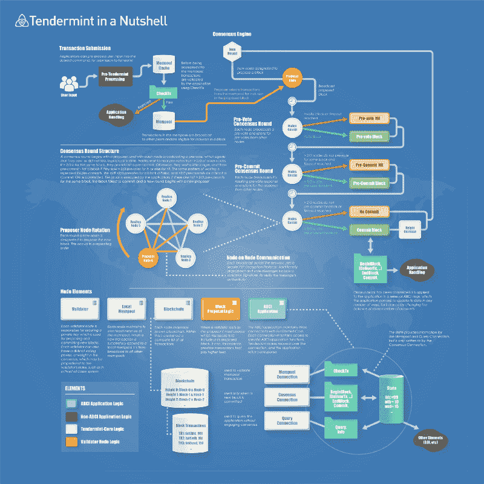
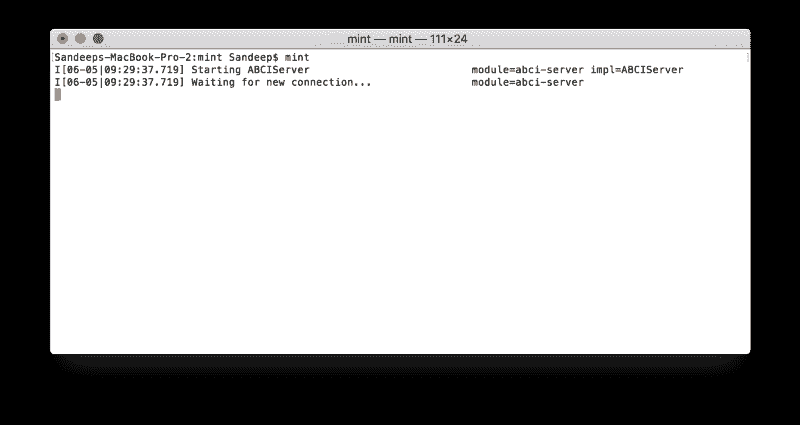
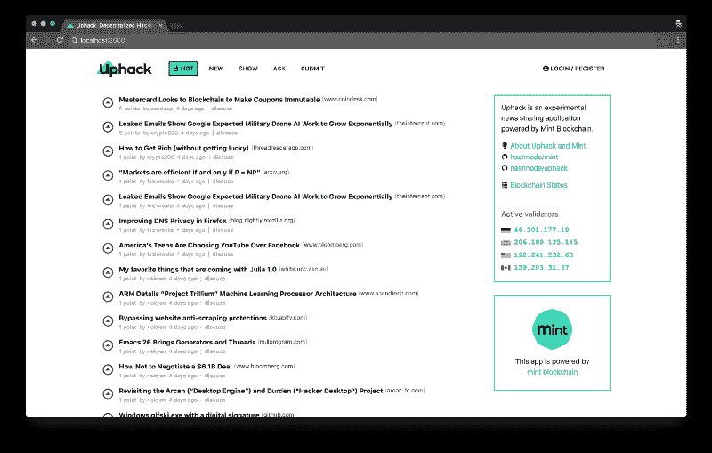
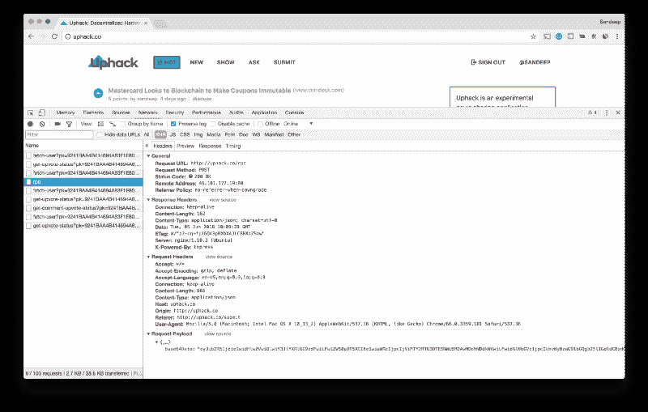

# 区块链在线社区编码综合指南

> 原文：<https://www.freecodecamp.org/news/a-comprehensive-guide-to-coding-a-blockchain-powered-online-community-f938792dbcb4/>

作者:Sandeep Panda

# 区块链在线社区编码综合指南


在 Hashnode，我们已经用区块链和它的用例做了很多实验。我们自己一直在运营一个开发者社区，而“去中心化社区”背后的理念深深吸引了我。每个人都拥有数据并控制平台，这一事实可能会催生新类型的社交应用，并破坏建立在线社区的传统方式。

像 Steemit 这样的平台已经证明了建立这样的社区并对用户的贡献进行奖励是可能的。但是，人们应该如何复制它，并推出自己的由区块链驱动的分散式社交平台呢？

为了回答这个问题，我接受了构建一个去中心化版本的 HackerNews 的挑战。

在这个过程中，我评估了多个平台，最终锁定了一个名为 [Tendermint](https://tendermint.com) 的协议。使用 Tendermint，我构建了一个名为“mint”的原型，它可以作为构建基于区块链的社交应用程序的样板。

代码库在 GitHub 上。您可以查看以下代码和演示链接:

*   [薄荷区块链](https://github.com/Hashnode/mint)
*   [网站代码(区块链前端)](https://github.com/Hashnode/Uphack)
*   [演示](http://uphack.co)

那么，如何才能建立一个区块链驱动的社交社区，让用户生成的数据去中心化呢？如果你在寻找答案，你来对地方了。请继续阅读。

### 初步观察

最初，我想到利用现有的平台来构建应用程序。像**以太坊**、 **NEM** 、 **NEO** 等智能合约平台提供资产存储，但这些并不是为存储大量数据而设计的。

HyperLedger Fabric 引人注目，但它是为部署在专用区块链网络中而设计的。Hashgraph 听起来很有趣，但目前还处于实验阶段。

其他可能的解决方案有: **Lisk Sidechains** 、 **Loom Network、**和 **BigChainDB** 。前两个在 private alpha 中(仅限邀请)，而 BigChainDB 由 [Tendermint](https://tendermint.com/) 提供支持。

所以，我没有使用 BigChainDB，而是决定直接使用 Tendermint，看看有什么可能。

### 为什么是嫩薄荷

Tendermint 是一种协议，它使用 BFT 算法处理共识层，而您只需专注于编写业务逻辑。

该协议的美妙之处在于，您可以真正自由地选择任何编程语言来构建与区块链交互的接口(应用程序区块链接口或简称为 ABCI)。

Tendermint 处理区块链最复杂的方面，例如块生产回合、对等连接、关于新块的闲聊、事务处理等等。它使用 LevelDB 将事务存储在磁盘上，还将确认的事务传递到您的 ABCI 服务器，以便您可以从中创建一个全局状态。

听起来很有趣？让我们看看如何使用 Tendermint 创建一个在 chain 上存储数据的区块链应用程序。

### 需要什么？

这是你需要的:

*   Macbook / Ubuntu 服务器
*   Golang
*   嫩薄荷
*   MongoDB
*   还有啤酒……(咖啡爱好者可以用咖啡代替这个)

### 设置机器

Tendermint 写在 [Go](https://golang.org/) 里。所以，我们需要先安装 Go 语言。访问[此链接](https://golang.org/dl/)查看一些下载选项。如果你在 Ubuntu 上，你可以跟随[这个指南](https://medium.com/@patdhlk/how-to-install-go-1-9-1-on-ubuntu-16-04-ee64c073cd79)。

默认情况下，Go 选择`$HOME/go`作为工作区。如果您想使用不同的位置作为您的工作空间，您可以在`~/.profile`中设置`GOPATH`变量。从现在开始，我们将这个位置称为`GOPATH`。

下面是`~/.profile`文件在我机器上的样子:

```
export GOPATH="$HOME/go" export PATH=~/.yarn/bin:$GOPATH/bin:$PATHexport GOBIN="$GOPATH/bin"
```

记住如上所示设置`GOBIN`变量。这是安装 Go 二进制文件的地方。

**别忘了跑源码~/。更新文件后的配置文件。**

现在我们可以安装 Tendermint 了。以下是步骤:

*   `cd $GOPATH/src/github.com`
*   `mkdir tendermint`
*   `cd tendermint`

最后，

```
git clone https://github.com/tendermint/tendermint
```

这将安装最新版本的 Tendermint。因为我已经针对`v0.19.7`测试了我的代码，所以让我们来看看具体的版本。

```
cd tendermintgit checkout v0.19.7
```

这将使您进入 v0.19.7。要继续安装，请运行以下命令:

```
make get_tools make get_vendor_depsmake install
```

恭喜你。您已经成功安装了 Tendermint。如果一切都按预期安装，命令`tendermint version`将打印出 Tendermint 版本。

现在，您应该继续安装 [MongoDB](https://docs.mongodb.com/manual/installation/) 。

### 区块链编码

如果你想了解 Tendermint 的工作原理，请浏览本指南。您可能还会发现下图很有帮助。



Source: [Tendermint Docs](http://tendermint.readthedocs.io/projects/tools/en/master/introduction.html)

我将在这里概述几个重要的概念:

*   Tendermint 核心处理共识部分。
*   您需要编写一个 ABCI 服务器来处理业务逻辑、验证等等。虽然你可以用任何语言写这篇文章，但是我们选择的语言是 Go。
*   Tendermint core 将通过套接字连接与您的 ABCI 服务器进行交互。
*   ABCI 服务器有许多方法(JS 开发人员可以将它们视为回调)，Tendermint core 将在各种事件中调用这些方法。
*   两个重要的方法是:`CheckTx`和`DeliverTx`。第一个被调用来验证交易，而第二个在`Tx`被确认时被调用。
*   `DeliverTx`帮助您根据确认的交易采取必要的行动。在我们的例子中，我们将使用它来创建和更新存储在 MongoDB 中的全局状态。
*   Tendermint 使用 BFT 共识。这意味着超过 2/3 的验证者需要达成共识才能提交交易。因此，即使 1/3 的验证器失效，区块链仍然可以工作。
*   在真实的场景中(至少在公共部署中)，除了 BFT 共识之外，您最有可能添加某种共识，例如 PoS(状态证明)。在这种情况下，我们将只进行简单的 BFT 共识。我将把添加位置留给你。

我建议你从 GitHub 克隆区块链 ABCI 服务器(代号 [mint](https://github.com/Hashnode/mint) )。但是在我们继续之前，我们需要安装一个名为 [dep](https://github.com/golang/dep) 的依赖管理工具。

如果你在 Mac 上，你可以运行`brew install dep`。对于 Ubuntu，运行以下命令。

```
curl https://raw.githubusercontent.com/golang/dep/master/install.sh | sh
```

现在你可以克隆 mint 的代码库了。

```
cd $GOPATH/srcgit clone https://github.com/Hashnode/mintcd mintdep ensurego install mint
```

太棒了。您现在已经安装了 mint，它是一个 ABCI 服务器，与 Tendermint core 一起工作。

现在，让我向您介绍整个设置和所有代码。

### 入口点

你可以在 GitHub [这里](https://github.com/Hashnode/mint/blob/master/mint.go)找到代码(和入口点)。

app 的入口点是`mint.go`。该文件最重要的部分是以下部分:

```
app = jsonstore.NewJSONStoreApplication(db)srv, err := server.NewServer("tcp://0.0.0.0:46658", "socket", app) if err != nil {  return err }
```

所有的业务逻辑、方法等等都在包`jsonstore`中定义。上面的代码只是在端口`46658`上创建了一个 TCP 服务器，它接受来自 Tendermint core 的套接字连接。

现在我们来看看`jsonstore`包。

### 业务逻辑

[这里是](https://github.com/Hashnode/mint/blob/master/jsonstore/jsonstore.go)的`jsonstore`回购。

我们的 ABCI 服务器做两件重要的事情:

*   验证传入的事务。如果交易无效，它将返回一个错误代码，交易将被拒绝。
*   一旦事务被提交(由超过 2/3 的验证者确认)并存储在 LevelDB 中，ABCI 服务器就更新其存储在 MongoDB 中的全局状态。

我们将使用 [mgo](https://labix.org/mgo) 与 MongoDB 交互。因此，`jsonstore.go`定义了 5 个模型，对应于 5 个不同的 MongoDB 集合。

代码如下所示:

```
// Post ...type Post struct {    ID          bson.ObjectId `bson:"_id" json:"_id"`    Title       string        `bson:"title" json:"title"`    URL         string        `bson:"url" json:"url"`    Text        string        `bson:"text" json:"text"`    Author      bson.ObjectId `bson:"author" json:"author"`    Upvotes     int           `bson:"upvotes" json:"upvotes"`    Date        time.Time     `bson:"date" json:"date"`    Score       float64       `bson:"score" json:"score"`    NumComments int           `bson:"numComments" json:"numComments"`    AskUH       bool          `bson:"askUH" json:"askUH"`    ShowUH      bool          `bson:"showUH" json:"showUH"`    Spam        bool          `bson:"spam" json:"spam"`}
```

```
// Comment ...type Comment struct {    ID              bson.ObjectId `bson:"_id" json:"_id"`    Content         string        `bson:"content" json:"content"`    Author          bson.ObjectId `bson:"author" json:"author"`    Upvotes         int           `bson:"upvotes" json:"upvotes"`    Score           float64       `bson:"score" json:"score"`    Date            time.Time    PostID          bson.ObjectId `bson:"postID" json:"postID"`    ParentCommentID bson.ObjectId `bson:"parentCommentId,omitempty" json:"parentCommentId"`}
```

```
// User ...type User struct {    ID        bson.ObjectId `bson:"_id" json:"_id"`    Name      string        `bson:"name" json:"name"`    Username  string        `bson:"username" json:"username"`    PublicKey string        `bson:"publicKey" json:"publicKey"`}
```

```
// UserPostVote ...type UserPostVote struct {    ID     bson.ObjectId `bson:"_id" json:"_id"`    UserID bson.ObjectId `bson:"userID" json:"userID"`    PostID bson.ObjectId `bson:"postID" json:"postID"`}
```

```
// UserCommentVote ...type UserCommentVote struct {    ID        bson.ObjectId `bson:"_id" json:"_id"`    UserID    bson.ObjectId `bson:"userID" json:"userID"`    CommentID bson.ObjectId `bson:"commentID" json:"commentID"`}
```

我们还定义了一些实用函数，如下所示:

```
func byteToHex(input []byte) string {    var hexValue string    for _, v := range input {        hexValue += fmt.Sprintf("%02x", v)    }    return hexValue}
```

```
func findTotalDocuments(db *mgo.Database) int64 {    collections := [5]string{"posts", "comments", "users", "userpostvotes", "usercommentvotes"}    var sum int64
```

```
for _, collection := range collections {        count, _ := db.C(collection).Find(nil).Count()        sum += int64(count)    }
```

```
return sum}
```

```
func hotScore(votes int, date time.Time) float64 {    gravity := 1.8    hoursAge := float64(date.Unix() * 3600)    return float64(votes-1) / math.Pow(hoursAge+2, gravity)}
```

```
// FindTimeFromObjectID ... Convert ObjectID string to Timefunc FindTimeFromObjectID(id string) time.Time {    ts, _ := strconv.ParseInt(id[0:8], 16, 64)    return time.Unix(ts, 0)}
```

这些将在随后的代码中使用。

#### 内部检查

现在让我们进入验证部分。我们如何接受或拒绝交易？假设有人试图注册，但没有选择有效的用户名。我们的应用程序如何验证这一点？

通过`CheckTx`功能完成。签名如下所示:

```
func (app *JSONStoreApplication) CheckTx(tx []byte) types.ResponseCheckTx {
```

```
 // ... Validation logic}
```

当一个 Tendermint 节点接收到一个事务时，它调用 ABCI 服务器的`CheckTx`并将`tx`数据作为`byte`数组参数传递。如果`CheckTx`返回非零代码，则交易被拒绝。

在我们的例子中，客户端通过 RPC 请求向 Tendermint 节点发送 Base64 编码的 stringified JSON 对象。因此，我们的工作是解码 tx 并将字符串解组到 JSON 对象中。

是这样做的:

```
var temp interface{}err := json.Unmarshal(tx, &temp)if err != nil {  panic(err)}message := temp.(map[string]interface{})
```

`message`对象通常如下所示:

```
{  body: {... Message body},  publicKey: <Public Key of Sender>,  signature: <message.body is signed with the Private Key>}
```

首先，我们需要确定**所说的** **人**确实已经向区块链提交了交易，而不是声称是那个人的其他人。

最好的验证方法是要求客户端用用户的私钥对消息体进行签名，并将公钥和签名都附加到有效负载上。我们将使用`ed25519`算法生成密钥，并在浏览器中对消息进行签名，然后点击 RPC 端点。在`CheckTx`函数中，我们将再次使用`ed25519`，并在用户公钥的帮助下验证消息。

是这样做的:

```
pubKeyBytes, err := base64.StdEncoding.DecodeString(message["publicKey"].(string))
```

```
sigBytes, err := hex.DecodeString(message["signature"].(string))
```

```
messageBytes := []byte(message["body"].(string))isCorrect := ed25519.Verify(pubKeyBytes, messageBytes, sigBytes)if isCorrect != true {  return types.ResponseCheckTx{Code: code.CodeTypeBadSignature}}
```

在上面的例子中，我们使用`ed25519`包来验证消息。在`code`包中定义了`code.CodeTypeBadSignature`等各种代码。这些只是整数。只要记住，如果你想拒绝一个交易，你必须返回一个非零代码。在我们的例子中，如果我们检测到消息签名无效，我们返回`CodeTypeBadSignature`，即`4`。

`CheckTx`的下一部分处理各种数据验证，例如:

*   如果用户发送除“创建用户(注册)”之外的任何交易，我们首先检查用户的公钥是否存在于我们的数据库中。
*   如果用户试图创建一个帖子或评论，它应该有有效的数据，比如非空的`title`、`content`等等。
*   如果用户试图注册，用户名应该包含可接受的字符。

代码如下所示:

```
// ==== Does the user really exist? ======if body["type"] != "createUser" { publicKey := strings.ToUpper(byteToHex(pubKeyBytes))
```

```
 count, _ := db.C("users").Find(bson.M{"publicKey": publicKey}).Count()
```

```
 if count == 0 {  return types.ResponseCheckTx{Code: code.CodeTypeBadData} }}// ==== Does the user really exist? ======
```

```
codeType := code.CodeTypeOK
```

```
// ===== Data Validation =======switch body["type"] {case "createPost": entity := body["entity"].(map[string]interface{})
```

```
 if (entity["id"] == nil) || (bson.IsObjectIdHex(entity["id"]. (string)) != true) {  codeType = code.CodeTypeBadData  break }
```

```
if entity["title"] == nil || strings.TrimSpace(entity["title"].(string)) == "" {  codeType = code.CodeTypeBadData  break }
```

```
if (entity["url"] != nil) && (strings.TrimSpace(entity["url"].(string)) != "") {  _, err := url.ParseRequestURI(entity["url"].(string))  if err != nil {   codeType = code.CodeTypeBadData   break  } }case "createUser": entity := body["entity"].(map[string]interface{})
```

```
if (entity["id"] == nil) || (bson.IsObjectIdHex(entity["id"].(string)) != true) {  codeType = code.CodeTypeBadData  break }
```

```
r, _ := regexp.Compile("^[A-Za-z_0-9]+$")
```

```
if (entity["username"] == nil) || (strings.TrimSpace(entity["username"].(string)) == "") || (r.MatchString(entity["username"].(string)) != true) {  codeType = code.CodeTypeBadData  break }
```

```
if (entity["name"] == nil) || (strings.TrimSpace(entity["name"].(string)) == "") {  codeType = code.CodeTypeBadData  break }case "createComment": entity := body["entity"].(map[string]interface{})
```

```
if (entity["id"] == nil) || (bson.IsObjectIdHex(entity["id"].(string)) != true) {  codeType = code.CodeTypeBadData  break }
```

```
if (entity["postId"] == nil) || (bson.IsObjectIdHex(entity["postId"].(string)) != true) {  codeType = code.CodeTypeBadData  break }
```

```
if (entity["content"] == nil) || (strings.TrimSpace(entity["content"].(string)) == "") {  codeType = code.CodeTypeBadData  break }}
```

```
// ===== Data Validation =======return types.ResponseCheckTx{Code: codeType}
```

代码非常简单，不言自明。所以，我就不赘述了，留给大家去进一步阅读和探索。

#### 内部 DeliverTx

一旦交易被确认并应用到区块链，Tendermint 核心调用`DeliverTx`并将交易作为字节数组传递。函数签名如下所示:

```
func (app *JSONStoreApplication) DeliverTx(tx []byte) types.ResponseDeliverTx {  // ... Code goes here}
```

我们将使用这个函数构建一个基于 MongoDB 的全局状态。我们这样做是为了让我们的网站用户可以轻松地阅读数据。

这个函数很大，有多种情况。在这一节中，我将只介绍一种情况，即“后期创建”。由于代码的其余部分是相似的，所以我将把深入研究和探索完整代码的任务留给您。

首先，我们将继续将`tx`数据解组到一个 JSON 对象中:

```
var temp interface{}err := json.Unmarshal(tx, &temp)
```

```
if err != nil { panic(err)}
```

```
message := temp.(map[string]interface{})
```

```
var bodyTemp interface{}
```

```
errBody := json.Unmarshal([]byte(message["body"].(string)), &bodyTemp)
```

```
if errBody != nil { panic(errBody)}
```

```
body := bodyTemp.(map[string]interface{})
```

对于后期创建，消息对象如下所示:

```
{body: {  type: "createPost",  entity: {    id: id,    title: title,    url: url,    text: text,    author: author  }},signature: signature,publicKey: publicKey}
```

下面是`DeliverTx`函数在提交“createPost”事务时如何在数据库中创建一个新条目:

```
entity := body["entity"].(map[string]interface{})
```

```
var post Postpost.ID = bson.ObjectIdHex(entity["id"].(string))post.Title = entity["title"].(string)
```

```
if entity["url"] != nil { post.URL = entity["url"].(string)}if entity["text"] != nil { post.Text = entity["text"].(string)}
```

```
if strings.Index(post.Title, "Show UH:") == 0 { post.ShowUH = true} else if strings.Index(post.Title, "Ask UH:") == 0 { post.AskUH = true}
```

```
pubKeyBytes, errDecode := base64.StdEncoding.DecodeString(message["publicKey"].(string))
```

```
if errDecode != nil { panic(errDecode)}
```

```
publicKey := strings.ToUpper(byteToHex(pubKeyBytes))
```

```
var user Usererr := db.C("users").Find(bson.M{"publicKey": publicKey}).One(&user)if err != nil { panic(err)}post.Author = user.ID
```

```
post.Date = FindTimeFromObjectID(post.ID.Hex())
```

```
post.Upvotes = 1
```

```
post.NumComments = 0
```

```
// Calculate hot rankpost.Score = hotScore(post.Upvotes, post.Date)
```

```
// While replaying the transaction, check if it has been marked as spam
```

```
spamCount, _ := db.C("spams").Find(bson.M{"postID": post.ID}).Count()
```

```
if spamCount > 0 { post.Spam = true}
```

```
dbErr := db.C("posts").Insert(post)
```

```
if dbErr != nil { panic(dbErr)}
```

```
var document UserPostVotedocument.ID = bson.NewObjectId()document.UserID = user.IDdocument.PostID = post.ID
```

```
db.C("userpostvotes").Insert(document)
```

实际的代码块有一个 switch 语句，以不同的方式处理每种类型的事务。您可以随意查看代码并进行尝试。如果有不清楚的地方，请在下面的评论中写下你的疑问。

现在我们已经检查了 ABCI 服务器的两个重要方面，让我们试着运行 Tendermint core 和我们的服务器，看看如何发送事务。

为了运行应用程序，从两个不同的终端运行以下命令。

首先，运行:

```
mint
```

如果该命令成功，您将在终端中看到以下输出:



Mint Output

在启动`mint`之前，确保 MongoDB 已经在运行。如果你的终端不能识别`mint`命令，一定要运行`source ~/.profile`。

然后在不同的终端中启动 Tendermint:

```
tendermint node --consensus.create_empty_blocks=false
```

默认情况下，Tendermint 每 3 秒产生一个新块，即使没有事务。

为了防止这种情况，我们使用了标志:

```
consensus.create_empty_blocks=false
```

现在 Tendermint 正在运行，您可以开始向它发送事务了。您需要一个能够生成`ed25519`密钥、签署您的请求并访问 Tendermint 公开的 RPC 端点的客户端。

一个示例请求(Node.js)如下所示:

```
const base64Data = req.body.base64Data;
```

```
let headers = {    'Content-Type': 'text/plain',    'Accept':'application/json-rpc'}
```

```
let options = {    url: "http://localhost:46657",    method: 'POST',    headers: headers,    json: true,    body: {"jsonrpc":"2.0","method":"broadcast_tx_commit","params": { "tx" : base64Data } ,"id":"something"}}
```

```
request(options, function (error, response, body) {    res.json({ body: response.body });});
```

注意，RPC 端点暴露在端口`46657`上。

手动形成和签署请求可能是乏味的。所以，我建议你使用[up back](https://github.com/Hashnode/Uphack)(一个与区块链互动的 HackerNews 风格的网站)来了解全貌。

要安装 Uphack，请按照以下步骤操作:

```
git clone https://github.com/Hashnode/Uphackcd Uphackyarngulp less // make sure gulp is installed globallynode server.js
```

您可以在`http://localhost:3000`访问网站。在我的机器上看起来是这样的:



Uphack

因为您还没有任何数据，所以最初它看起来是空的。请随意注册一个帐户，并提交一些帖子来可视化的过程。

当你使用应用程序时，打开浏览器的网络选项卡，查看 XHR 部分。`/rpc` URL 接受 base64 数据并向 Tendermint 的 RPC 端点服务器端发出请求。你可以复制 base64 数据并将其粘贴到一个 [base64 解码器](https://www.base64decode.org/)中，以查看正在发送的实际数据。



深入 Uphack 的细节超出了本教程的范围。然而，如上所述，Uphack(客户端)的代码是开源的，逻辑也很简单。如果你浏览[代码库](https://github.com/Hashnode/Uphack)并检查各种端点，你会对整个过程有更好的理解。

### 包扎

总而言之，我们构建了一个**区块链**，它在 chain 上存储 JSON 数据，并接受 base64 格式的事务。为了演示其用法，我们还简要检查了与区块链交互的,【Uphack，一个黑客新闻风格的网站。

但是，您应该注意以下几点:

*   您已经构建了一个单节点网络。这意味着您是唯一的验证者。如果您对多节点部署感兴趣，请查阅 [mint 的](https://github.com/Hashnode/mint)文档。到目前为止，我们已经部署了一个 4 节点网络，如果您希望成为一名验证者并尝试区块链，请随时联系我。
*   这种安排采用了 BFT 共识。在现实世界的场景中，您将需要一些一致的算法，如利害关系证明、委托利害关系证明等等。
*   区块链 RPC 端点在`46657`上监听，ABCI 服务器在`46658`上运行。任何时候你都可以通过访问`localhost:46657/status`来查看区块链的状态。
*   现在没有成为验证者和生产程序块的动机。在(D)PoS 设置中，每次区块生产者提出一个区块时，他们应该得到一些代币奖励。这是留给你的一个练习。
*   ABCI 服务器可以用任何语言编写。比如查 [js-abci](https://github.com/tendermint/js-abci/) 。

最后，我想澄清一下，我不是区块链问题专家。我是一个学习者，我只是分享我感兴趣的东西。在 chain 上存储数据让我着迷，我相信**分散的社交社区**是区块链的主要用例之一。

如果您发现代码库或文章中有任何不准确的地方，请随时指出来。如果您使用 [mint](https://github.com/Hashnode/mint) & [Uphack](https://github.com/Hashnode/Uphack) 并提供您的反馈，我将不胜感激。公关总是受欢迎的！

请在下面的评论中告诉我你的想法！