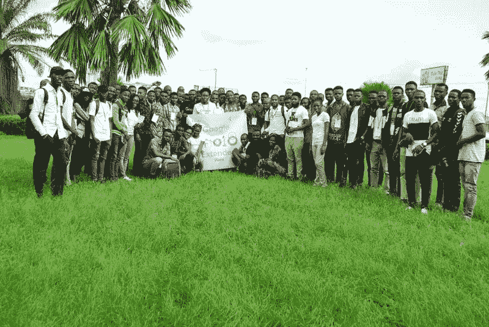

# 我从尼日利亚瓦里的谷歌 I/O Extended 2018 中学到的

> 原文：<https://www.freecodecamp.org/news/what-i-learnt-from-io18extended-warri-9e7142e7a4c5/>

开尔文·奥默索尼

# 我从尼日利亚瓦里的谷歌 I/O Extended 2018 中学到的

Attendees of #Io18Extended, Warri

大家好。我想告诉你我通过参加刚刚结束的由 GDG·瓦里主持的谷歌 I/O 扩展会议所学到的东西。组织者 Charles Freeborn Eteure 真是太棒了——竖起大拇指先生！我还遇到了一位令人惊讶的 UI/UX 设计师——T2·佩里小姐——她关于优秀设计重要性的演讲棒极了。

这句话不断浮现在脑海中:

> 培养学习的热情。如果你这样做了，你将永远不会停止成长——安东尼·j·安吉洛

所以，我很谦卑地看到相当多的年轻人来参加这个活动，尽管这在瓦里是第一次。在那次活动中，很多人向我咨询如何开始学习 web 开发或编程。

这些问题让我看到了一些有价值的教训:

1.  年轻人非常渴望了解整个科技生态系统。
2.  年轻的开发人员需要指导。
3.  对于三角洲地区的大多数人来说，开发人员的整个想法仍然是模糊的。
4.  缺乏从哪里获得资源或寻求帮助的知识。
5.  需要传播更多的意识，以重新定位三角洲地区对技术的总体认识。

考虑到所有这些教训，我想指出一些很酷的资源，并给出一些我认为对任何初学者都有帮助的建议(特别是对来自# IO18Extedended 的年轻开发人员)。

> “在变革的时代，学习者继承了地球，而有学问的人发现自己已经准备好去应对一个不复存在的世界。”

> ― [**埃里克·霍弗**](https://www.goodreads.com/author/show/9843.Eric_Hoffer)

### 给年轻开发者的建议

#### 现在是为什么，而不是如何。

这意味着你必须知道**为什么**你想进入科技行业。这不仅仅是理智上的了解，你还必须在情感上了解它(并有强烈的信念)。

这是必要的，因为就像任何值得学习的东西一样，开发通常是困难的，但却是可行的。所以我认为，有一个强有力的切实的理由是一种强大的力量，让你在那些挫折或编码车辙的艰难时刻继续编码和前进。

#### 态度决定一切

你必须保持一种学习的态度。你不知道的，去问，去读(以任何你想要的顺序)，你必须每天都做。编码是一种技能，就像任何技能一样，通过实践你会变得更好。这篇[文章](https://medium.com/career-change-coder/understanding-your-individual-learning-styles-in-relation-to-learning-to-code-3ad24ebec551)很好地指出了什么样的学习方式适合你的独特性。

#### 回到基本原则

最后也是最重要的(我认为)，发展既是一门艺术也是一门科学。像这两个领域一样，它也有雏形——学习它们。它有先驱(顶级狗、高级开发人员、导师)——找到他们并紧紧跟随他们。它具有挑战性——拥抱它(因为它让你变得更好)。它旨在促进新问题的解决方案或使旧的解决方案变得更好——关注这一点！

### 查看这些资源和文章

哦，在我忘记之前——这篇[文章](https://blog.usejournal.com/web-development-am-i-doing-this-right-ff857a22fa18)有一些有用资源的链接，可能对你的旅程有所帮助——如果你刚刚开始，一定要去看看。你也可以联系我。阅读[这个](https://medium.com/@lydiahallie/advice-from-a-19-y-o-girl-software-developer-88737bcc6be5)、[这个](https://medium.freecodecamp.org/successfully-teaching-yourself-how-to-code-f6aac23db44a)和[这个](https://medium.freecodecamp.org/how-i-went-from-programming-with-a-feature-phone-to-working-for-an-mit-startup-40ca3be4fa0f)获得更多灵感——在这个激动人心的旅程中，我们都需要它！

> "如果你知道为什么，你就能以任何方式生活."

> ― [**弗里德里希·尼采**](https://www.goodreads.com/author/show/1938.Friedrich_Nietzsche)

感谢阅读。请留下评论(非常感谢)和掌声。编码快乐！