# 理解 Redux:世界上最简单的 Redux 入门指南

> 原文：<https://www.freecodecamp.org/news/understanding-redux-the-worlds-easiest-guide-to-beginning-redux-c695f45546f6/>

这是一个全面的(但简化的)指南，适用于绝对的 Redux 初学者，或者任何想要重新评估他们对 Redux 基本概念的理解的人。

对于扩展的**目录**请[访问此链接](https://medium.com/@ohansemmanuel/table-of-contents-for-understanding-redux-ea0667e1453d)，&更多**高级 Redux** 概念查看我的 [Redux 书籍](https://thereduxjsbooks.com)。

### 介绍


如果你一直在寻找如何掌握 Redux，这篇文章(实际上是一本书)就是缺失的部分。

在开始之前，我应该告诉你，这本书首先是关于我的。是的，我。我努力学习 Redux，并寻求更好的教学方法。

几年前，我刚学会反应。我对此很兴奋，但同样，其他人似乎都在谈论另一个叫 Redux 的东西。

### 天哪！学习热潮会结束吗？

作为一名致力于个人发展的工程师，我想了解情况。我不想被遗漏。于是，我开始学习 Redux。

我检查了 Redux 文档。实际上，相当不错！出于某种原因，它并不完全适合我。我也查了一些 YouTube 视频。我找到的那些看起来很匆忙，也不详细。可怜的我。

说实话，我觉得我看的视频教程并不差。只是少了点什么。这本简单的指南是经过深思熟虑的，是为像我这样心智健全的人写的，而不是为一些虚构的人形生物写的。

看来我并不孤单。

我的一个好朋友，我当时正在指导的一个人，刚刚完成了 React 开发人员认证课程，他花了一大笔钱(超过 300 美元)来获得证书。

当我询问他对该计划的真实反馈时，他的回答大致如下:

> 课程非常好，但我仍然不认为 Redux 对像我这样的初学者解释得很好。没有解释的那么好。

你看，还有很多和我朋友一样的，都在苦苦理解 Redux。他们也许使用 Redux，但是他们不能说他们真正理解它是如何工作的。

我决定找到解决办法。我打算深入了解 Redux，并找到一种更清晰的方法来教授它。

你将要读到的内容花了几个月的时间研究，然后花了更多的时间来编写和构建示例项目，同时还要保持日常工作和其他严肃的承诺。

但是你知道吗？

我超级兴奋能和你分享这个！

如果你一直在寻找一个不会说得天花乱坠的 Redux 指南，这就是它。不要再看了。

我考虑了我和我认识的许多其他人的斗争。我会确保教你重要的东西，而且不会让你感到困惑。

现在，这是一个承诺。

### 我的 Redux 教学方法

教授 Redux 的真正问题——尤其是对于初学者——不是 Redux 库本身的复杂性。

不。我不认为是这样。它只是一个很小的 2kb 库——包括依赖项。

作为一个初学者来看看 Redux 社区，你会很快失去理智。有**而不是**只是 Redux，但有一大堆其他构建现实世界应用所需的假定“关联库”。

如果你已经花了一些时间做了一些研究，那么你已经遇到他们了。有 Redux，React-Redux，Redux-thunk，Redux-saga，Redux-promise，重新选择，重新组合等等！

似乎这还不够，还有一些路由、认证、服务器端渲染、测试和捆绑——一次完成。

天哪！这是压倒性的。

“Redux 教程”通常不是关于 Redux 的，而是它附带的所有其他东西。

应该有一种更明智的方法适合初学者。如果你是一个人形开发者，你肯定不会有这个问题。你猜怎么着？我们大多数人实际上都是人类。

所以，这是我教 Redux 的方法。

暂时忘掉所有多余的东西，让我们只做 Redux。耶！

我将只介绍你现在需要的最低限度。现在还没有 React-router、Redux-form、Reselect、Ajax、Webpack、认证、测试，一个都没有！

你猜怎么着？这就是你如何学会一些重要的生活“技能”的。

你是怎么学会走路的？

你是在一天之内开始跑步的吗？不要！

让我带你通过一个合理的方法来学习 Redux——没有麻烦。

坐着别动。

#### *“水涨船高”*

一旦你掌握了 Redux 的基本工作原理(涨潮)，其他事情就更容易推理了(它能提升所有船只)。

### 关于 Redux 学习曲线的一个注记


A Tweet on Redux’s learining curve from Eric Elliot.

Redux 确实有一个学习曲线。我不是说其他的。

学习走路也有一个学习过程。然而，通过系统的学习方法，你克服了这一点。

你确实摔了几次，但没关系。总有人在你身边支持你，帮助你重新站起来。

好吧，我希望成为你的那个人——当你和我一起学习 Redux 的时候。

### 你将学到什么

该说的都说了，该做的都做了，你会发现 Redux 并不像外表看起来那么可怕。

潜在的原则是如此简单！

首先，我将用简单易懂的语言教你 Redux 的基础知识。

然后，我们将构建几个简单的应用程序。从一个基本的 Hello World 应用开始。

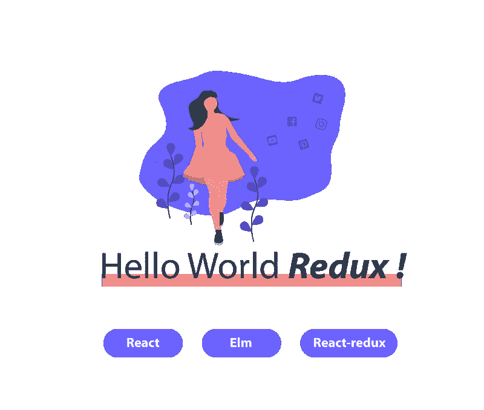

A basic Hello World Redux application.

但是这些还不够。

我会包括练习和我认为你应该解决的问题。

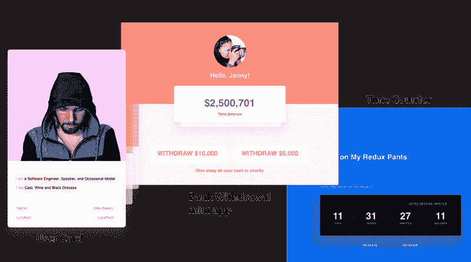

Sample exercise apps we will work on together.

有效的学习不仅仅是读和听。有效的学习主要在于实践！

把这些当成作业，但是没有生气的老师。在练习的时候，你可以[用标签#UnderstandingRedux 发微博](https://twitter.com/OhansEmmanuel)给我，我一定会去看的！

没有愤怒的老师，嗯？

练习是好的，但你也需要看我构建一个更大的应用程序。在这里，我们通过构建一个有点像 Skype 克隆版的可爱的消息应用程序 Skype 来总结事情。


Skypey: The Skype clone we will build together.

Skypey 的功能包括编辑信息、删除信息和向多个联系人发送信息。

万岁！

如果这还不能让你兴奋，我不知道还有什么能让你兴奋。给你看这些我超级兴奋！


Gif by Jona Dinges

### 先决条件

唯一的先决条件是你已经知道反应。如果你没有，戴夫·塞迪亚的[纯反应](https://daveceddia.com/pure-react/)是我个人的推荐，如果你有一些美元的话。我不是附属机构。只是一个很好的资源。


### 下载 PDF & Epub 供离线阅读

下面的视频重点介绍了获取该书的 PDF 和 Epub 版本的过程。

[https://www.youtube.com/embed/yHOPFYwlVvI](https://www.youtube.com/embed/yHOPFYwlVvI)

关键在于:

1.  访问[图书销售页面](https://gumroad.com/l/Ocgbb)。
2.  使用优惠券 **FREECODECAMP** 获得 100%的折扣，这样你就可以以 0 美元的价格买到一本 29 美元的书。
3.  如果你想说谢谢，请推荐这篇文章，分享到社交媒体上。

现在，让我们开始吧。

### 第一章:了解 Redux


几年前，开发前端应用程序对许多人来说就像一个笑话。如今，构建像样的前端应用程序的复杂性越来越高，几乎令人无法承受。

似乎为了满足日益苛刻的用户的迫切要求，这只温柔可爱的猫已经超出了家庭的范围。它变成了一只无所畏惧的狮子，有着 3 英寸长的爪子和一张能张开成人头的嘴。

是啊，这就是现代前端开发的感觉。

Angular、React 和 Vue 等现代框架在驯服这种“野兽”方面做得很好。同样，现代哲学，如 Redux 所推行的哲学，也是为了给这种“野兽”吃一颗镇静剂。

让我们一起来看看这些哲学。

### Redux 是什么？


What is Redux? As seen on the Redux Documentation

Redux 的官方文档如下:

> Redux 是 JavaScript 应用程序的可预测状态容器。

当我第一次读到这 9 个单词时，我觉得它们就像 90 个不完整的短语。我就是不明白。你很可能也不知道。

别担心。我一会儿会再讲一遍，随着你更多地使用 Redux，这句话会变得更加清晰。

从好的方面来看，如果您阅读文档的时间再长一点，您会在那里的某个地方找到更多的解释性内容。

上面写着:

> 它帮助您编写行为一致的应用程序…

你看到了吗？

用外行人的话来说，就是说，“它帮助你驯服野兽”。比喻。

Redux 消除了大型应用程序中状态管理面临的一些麻烦。它为你提供了一个很好的开发者体验，并确保你的应用程序的可测试性不会因此而被牺牲。

在开发 React 应用程序时，您可能会发现将所有状态保存在顶级组件中已经不够了。

随着时间的推移，您的应用程序中可能会有大量数据发生变化。

Redux 有助于解决这类问题。请注意，这并不是唯一的解决方案。

### 为什么要用 Redux？

正如你已经知道的，像“为什么你应该使用 A 而不是 B？”归结为你的个人喜好。

我在生产中构建过不使用 Redux 的应用。我相信很多人也这样做过。

对我来说，我担心给我的团队成员带来额外的复杂性。如果你想知道，我一点也不后悔这个决定。

Redux 的作者 Dan Abamov 也警告过早将 Redux [引入应用程序的危险。你可能不喜欢 Redux，这很公平。我有朋友不知道。](https://medium.com/@dan_abramov/you-might-not-need-redux-be46360cf367)

话虽如此，学习 Redux 还是有一些非常体面的理由的。

例如，在有许多移动部件的大型应用程序中，状态管理成为一个大问题。Redux 很好地解决了这个问题，没有性能问题，也没有牺牲可测试性。

许多开发人员喜欢 Redux 的另一个原因是它带来的开发人员体验。很多其他工具已经开始做类似的事情，但是 Redux 功不可没。

使用 Redux 可以获得一些好处，包括日志记录、热重装、时间旅行、通用应用程序、记录和回放——所有这些都不需要开发人员做太多工作。这些东西听起来可能很新奇，直到你亲自使用它们并亲眼目睹。

丹的演讲名为[热重装时间旅行](https://youtu.be/xsSnOQynTHs)会给你一个很好的感觉这些是如何工作的。

另外，[Redux 的维护者之一 Mark Ericsson](https://twitter.com/acemarke?lang=en) 表示，[生产中超过 60%](http://blog.isquaredsoftware.com/2018/03/redux-not-dead-yet/) 的 React 应用使用 Redux。太多了！

因此，这只是我的想法，许多工程师喜欢向潜在雇主展示他们可以维护 React 和 Redux 中构建的更大的生产代码库，所以他们学习 Redux。

如果你想知道更多使用 Redux 的理由，Redux 的创建者 Dan 在他的文章中有更多的理由。

如果你不认为自己是一名高级工程师，我建议你学习 Redux——很大程度上是因为它教授的一些原则。你会学到做普通事情的新方法，这可能会让你成为一名更好的工程师。

每个人拿起不同的技术都有不同的理由。最终，决定权在你。但是在你的技能组合中加入 Redux 绝对没有坏处。

### 向一个 5 岁的孩子解释 Redux

书的这一部分真的很重要。整本书都会引用这里的解释。所以准备好。

由于一个 5 岁的孩子没有时间学习技术术语，我将保持这个非常简单，但与我们学习 Redux 的目的相关。

所以，我们开始吧！

让我们考虑一个你可能很熟悉的事件——去银行取钱。即使你不经常这样做，你也可能知道这个过程是什么样子的。


Young Joe heads to the bank.

一天早上，你醒来，尽快去银行。去银行的时候，你脑子里只有一个**意图/行动**:去`WITHDRAW_MONEY.`

你想从银行取钱。


Young Joe heads to the bank with the intention to withdraw some money.

这就是事情变得有趣的地方。

当你进入银行时，你直接去收银台提出你的要求。


Young joe is at the bank! He goes straight to see the Cashier and makes his request known.

等等，你去收银台了？

你为什么不直接去银行金库拿钱？


If only Young Joe got into the Vault. He’ll cart away with as much as he finds.

毕竟是你的血汗钱。

好吧，就像你已经知道的，事情不是那样运作的。是的，银行的金库里有钱，但你必须与出纳员交谈，以帮助你按照适当的程序提取自己的钱。

收银员从他们的电脑上输入一些命令，然后把你的现金交给你。很简单。


Here’s how you get money. Not from the Vault, sorry.

现在，Redux 如何融入这个故事？

我们很快会谈到更多的细节，但首先是术语。

1.银行金库之于银行，就像`Redux Store`之于 Redux。


The bank vault can be likened to the Redux Store!

银行金库把钱存在银行，对吧？

在你的应用程序中，你不需要花钱。相反，你的应用程序的`state`就像你花的钱。应用程序的整个用户界面都是状态的函数。

就像银行金库将您的钱安全地存放在银行一样，您的应用程序的状态也通过一个叫做`store`的东西来保持安全。因此，`store`保持你的“钱”或`state`完好无损。

呃，你要记住这个，好吗？

Redux 商店可以比作银行金库。它保存您的应用程序的状态，并保证它的安全。

这就引出了第一个 Redux 原则:

> 只有一个真实的来源:整个应用程序的状态存储在一个 Redux 存储的对象树中。

不要让这些话迷惑了你。

简单地说，使用 Redux，建议将应用程序状态存储在由 Redux `store`管理的单个对象中。这就像有了`one vault`而不是沿着银行大厅到处乱扔钱。

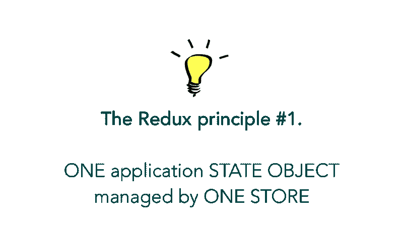

The first Redux Princple

2.带着一个`action`去银行。

如果你想从银行取钱，你必须带着某种取钱的意图或行动进去。

如果你走进银行，四处闲逛，没有人会给你钱。你甚至可能会被保安赶出去。悲伤的事情。

Redux 也是如此。

想写多少代码就写多少代码，但是如果您想更新 Redux 应用程序的状态(就像您在 React 中用`setState`做的那样)，您需要用一个`action`让 Redux 知道这一点。

以同样的方式，你遵循一个适当的过程从银行提取你自己的钱，Redux 也考虑一个适当的过程来改变/更新你的应用程序的状态。

现在，这导致了 Redux 原则#2。

> 状态为只读:

> 改变状态的唯一方法是发出一个动作，一个描述发生了什么的对象。

用通俗的语言来说，这是什么意思？

当你走向银行时，你心中有一个明确的行动。在这个例子中，您想要提取一些钱。

如果我们选择在一个简单的 Redux 应用程序中表示这个过程，那么您对银行的操作可以用一个对象来表示。

看起来像这样的一个:

```
{ 
  type: "WITHDRAW_MONEY",
  amount: "$10,000"
}
```

在 Redux 应用程序的上下文中，这个对象被称为`action`！它总是有一个描述您想要执行的动作的`type`字段。在这种情况下，它就是`WITHDRAW_MONEY.`

每当您需要更改/更新 Redux 应用程序的状态时，您都需要分派一个动作。

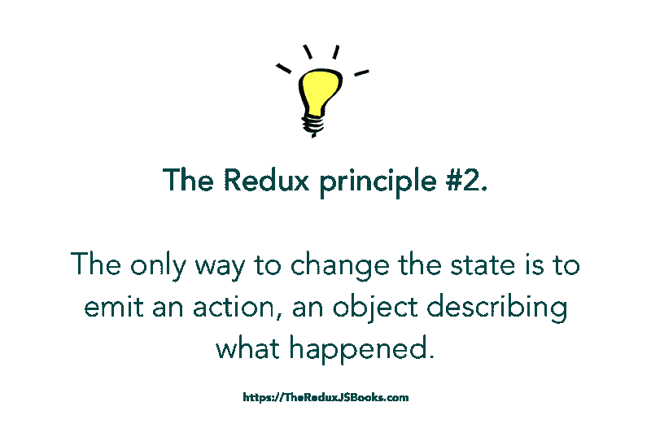

The Second Redux Principle.

先不要为如何做这件事而紧张。我只是在这里打基础。我们很快会深入研究很多例子。

3.出纳员之于银行就像`reducer`之于 Redux。

好吧，退后一步。

请记住，在上面的故事中，你不能直接进入银行金库从银行取回你的钱。不。你得先去见收银员。

好吧，你心里有一个行动，但是你必须把这个行动传达给某人——出纳员——这个人反过来(以他们所做的任何方式)与存放银行所有资金的金库进行沟通。

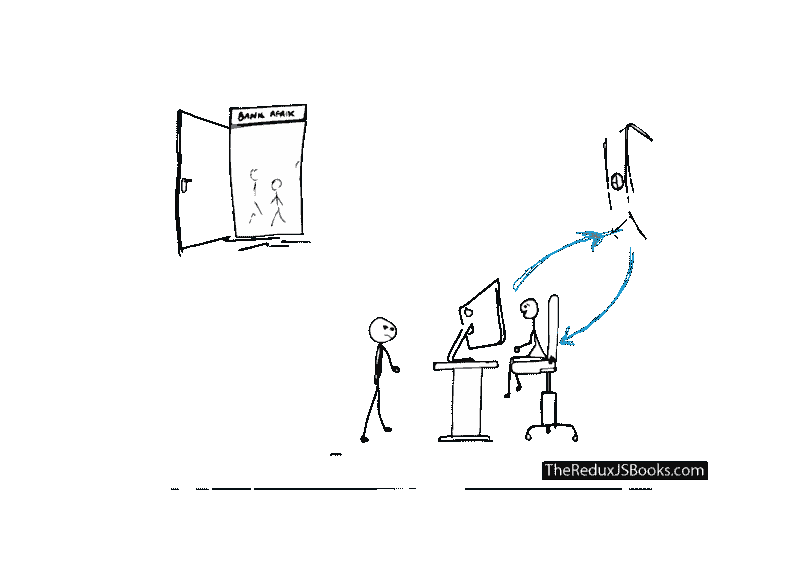

The Cashier and Vault communication!

Redux 也是如此。

就像您让收银员知道您的操作一样，您必须在 Redux 应用程序中做同样的事情。如果您想要更新您的应用程序的状态，您可以将您的`action`传递给`reducer`——我们自己的收银员。

这个过程通常被称为分派一个`action`。

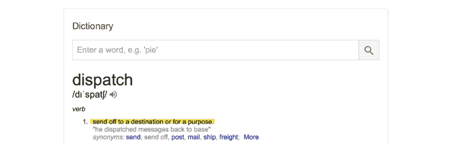

Dispatch 只是一个英文单词。在这个例子中，在 Redux 世界中，它被用来表示将动作发送给 reducers。

`reducer`知道该做什么。在本例中，它会将您的操作进行到`WITHDRAW_MONEY`，并确保您拿到您的钱。

用 Redux 的话说，你花的钱就是你的`state`。所以，你的 reducer 知道该怎么做，它总是会返回你的`new state`。

嗯。这并不难理解，对吧？

这就引出了最后一个 Redux 原则:

> 为了指定状态树是如何被动作转换的，你需要编写纯 reducers。

随着我们的继续，我将解释“纯”减压器的含义。现在，重要的是要理解，要更新应用程序的状态(就像你在 React 中对`setState`所做的那样)，你的动作必须总是被发送(分派)给 reducers 以获得你的`new state`。

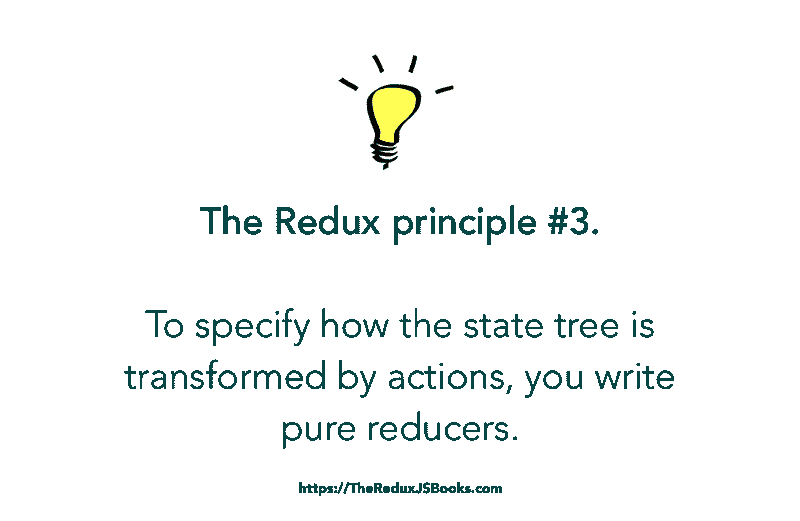

The Third Redux Principle

通过这个类比，你现在应该知道什么是最重要的 Redux 演员了:T0、T1 和 T2。

这三个角色对于任何 Redux 应用程序都是至关重要的。一旦你理解了它们是如何工作的，大部分工作就完成了。

### 第 2 章:您的第一个 Redux 应用程序


> 我们通过例子和直接经验来学习，因为口头指导的充分性是有实际限制的。
> 
> 马尔孔·格拉德威尔

尽管我已经花了大量的时间来解释 Redux 原则，以一种你不会忘记的方式，口头指示有其局限性。

为了加深你对原理的理解，我给你看一个例子。你的第一个 Redux 应用程序，如果你想这么说的话。

我的教学方法是引入难度递增的例子。因此，对于初学者来说，这个例子侧重于重构一个简单的纯 React 应用程序来使用 Redux。

这里的目的是理解如何在一个简单的 React 项目中引入 Redux，并加深您对 Redux 基本概念的理解。

准备好了吗？

下面是我们将要使用的“Hello World”React 应用程序。

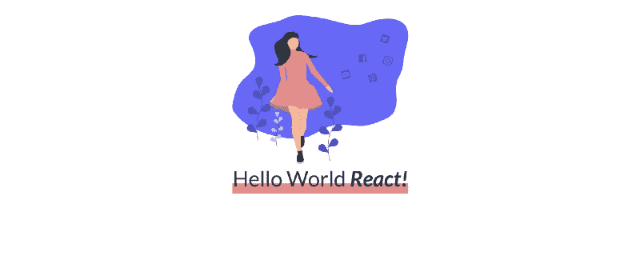

The basic Hello World App.

不要一笑置之。

你将学会从一个“已知”的概念，如 React，到“未知”的 Redux，伸展你的 Redux 肌肉。

### React Hello World 应用程序的结构

我们将要使用的 React 应用程序已经通过`create-react-app`启动。因此，应用程序的结构是你已经习惯了的。

如果你想跟进的话，你可以从 Github 获取回购——这是我推荐的。

有一个`index.js`入口文件将一个`<App />`组件呈现给`DOM`。

主`App`组件由某个`<HelloWorld />`组件组成。

这个`<HelloWorld />`组件接受一个`tech`道具，这个道具负责向用户显示特定的技术。

例如，`<HelloWorld tech="React" />`将产生以下结果:

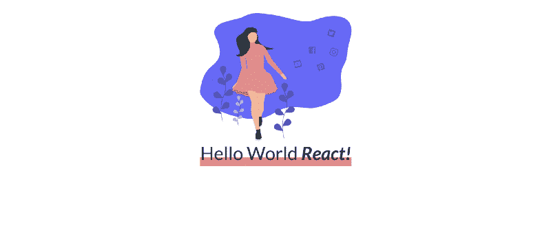

The basic Hello World App with the default state, “React”

同样，一个`<HelloWorld tech="Redux" />`将产生如下结果。


The basic Hello World App with the tech prop changed to “Redux”

现在，你知道要点了。

下面是`App`组件的样子:

`**src/App.js**`

```
import React, { Component } from "react";
import HelloWorld from "./HelloWorld";

class App extends Component {
 state = { 
  tech : "React"
}
render() {
  return <HelloWorld tech={this.state.tech}/>
}
}

export default App;
```

好好看看`state`物体。

在`state`对象中只有一个字段`tech`，它被作为`prop`传递给`HelloWorld`组件，如下所示:

```
<HelloWorld tech={this.state.tech}/>
```

暂时不要担心`HelloWorld`组件的实现。它只是接受了一个`tech`道具并应用了一些花哨的 CSS。仅此而已。

由于这主要集中在 Redux 上，我将跳过样式的细节。

所以，挑战来了。

我们如何重构我们的`App`来使用`Redux`？

我们如何去掉状态对象，让它完全由 Redux 管理？记住 Redux 是你的应用程序的状态管理器。

让我们在下一节开始回答这些问题。

### 重温你对 Redux 的了解

还记得官方文件中的引用吗？

> Redux 是 JavaScript 应用程序的可预测状态容器。

上面句子中的一个关键短语是**状态容器**。

从技术上讲，您希望应用程序的`state`由 Redux 管理。

这就是 Redux 成为**状态容器** *的原因。*

您的 React 组件状态仍然存在。Redux 不拿走。

然而，Redux 将有效地管理您的**整体**应用程序状态。就像银行金库一样，它有一个`store`来做这件事。

对于我们这里得到的简单的`<App/>`组件，状态对象是简单的。

这是:

```
{
 tech: "React"
}
```

我们需要将它从`<App />`组件状态中取出，并让 Redux 来管理它。

根据我之前的解释，您应该记得银行金库和 Redux 商店之间的类比。银行金库保存资金，Redux `store`保存应用程序状态对象。

那么，重构`<App />`组件使用 Redux 的第一步是什么呢？

是的，你说得对。

从`<App />`中删除组件状态。

Redux `store`将负责管理 App 的`state`。也就是说，我们需要从`App/>.`中移除当前状态对象

```
import React, { Component } from "react";
import HelloWorld from "./HelloWorld";

class App extends Component {
 // the state object has been removed. 
render() {
  return <HelloWorld tech={this.state.tech}/>
}
}

export default App;
```

上面的解决方案是不完整的，但是现在，`<App/>`没有状态。

请从命令行界面(CLI)运行`yarn add redux`来安装 Redux。我们需要`redux`包来做正确的事情。

### 创建 Redux 存储

如果`<App />`不管理它的状态，那么我们必须创建一个 Redux 存储来管理我们的应用程序状态。

对于一个银行保险库，几个机械工程师可能被雇来创建一个安全的货币保管设施。

为了给我们的应用程序创建一个可管理的状态保持工具，我们不需要机械工程师。我们将使用一些对我们有用的 APIs Redux 以编程方式来实现这一点。

下面是创建 Redux `store`的代码:

```
import { createStore } from "redux"; //an import from the redux library
const store = createStore();  // an incomplete solution - for now.
```

首先我们从 Redux 导入`createStore`工厂函数。然后我们调用函数`createStore()`来创建商店。

现在，`createStore`函数接受几个参数。第一个是`reducer.`

因此，一个更完整的商店创建将如下所示:`createStore(reducer)`

现在，让我解释一下为什么我们有一个`reducer`在那里。

### 存储和减速器的关系

回到银行的类比。

当你去银行取款时，你遇到了出纳员。在你让收银员知道你的意图/行动后，他们不只是把你要的钱递给你。

号码

收银员首先确认您的账户中有足够的资金来执行您寻求的取款交易。

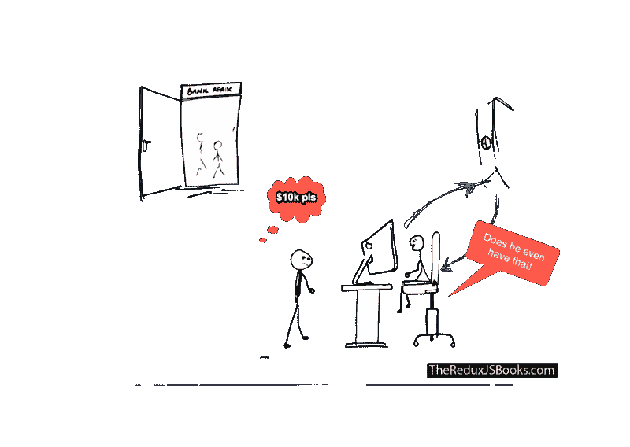

You have how much you even want to withdraw?

收银员首先要确保你有你所说的钱。

从电脑上，他们可以看到所有这些——有点像与金库通信，因为金库把所有的钱都存在银行里。

简而言之，收银台和金库总是同步的。伟大的伙伴！


The Cashier and Vault in sync!

这同样适用于 Redux `STORE`(我们自己的金库)和 Redux `REDUCER`(我们自己的出纳)

商店和减压器是很好的伙伴。永远同步。

为什么？

`REDUCER`总是与`STORE`对话。就像收银员和金库保持同步一样。

这解释了为什么商店的创建需要用一个`Reducer`来调用，并且这是强制性的。`Reducer`是传递给`createStore()`的唯一强制参数

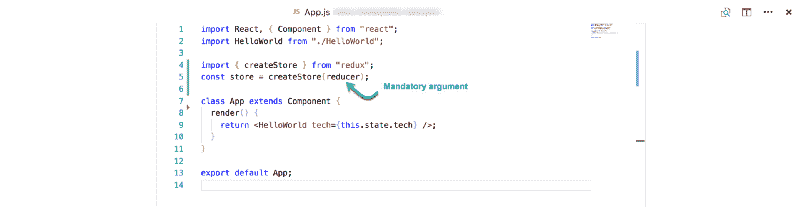

The reducer is a mandatory argument passed into “createStore”

在接下来的章节中，我们将简要介绍一下减速器，然后通过将`REDUCER`传递给`createStore`工厂函数来创建一个`STORE`。

### 该减速器

我们很快会谈到更多的细节，但现在我会尽量简短。

当你听到减速器这个词时，你会想到什么？

减少？

是的，我也是这么想的。

听起来像是 reduce。

嗯，根据 Redux 官方[文档](https://redux.js.org/glossary):

> 还原器是 Redux 中最重要的概念。

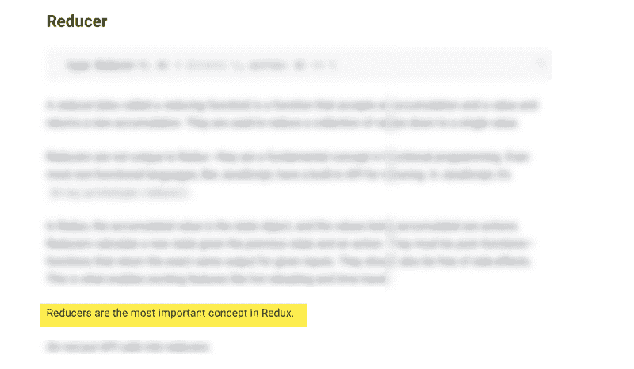

Reducers are the most important concept in Redux. A more experienced engr. may argue in favour of middlewares.

我们的收银员是个很重要的人物，对吧？

那么，减速器是怎么回事？它是做什么的？

用更专业的术语来说，缩减器也称为缩减函数。你可能没有注意到，但是你可能已经使用了减速器——如果你熟悉`[Array.reduce()](https://developer.mozilla.org/en-US/docs/Web/JavaScript/Reference/Global_Objects/Array/reduce)`方法的话。

这里有一个快速复习。

考虑下面的代码。

获取 JavaScript 数组中值的总和是一种流行的方法:

```
let arr = [1,2,3,4,5]
let sum = arr.reduce((x,y) => x + y)
console.log(sum)  //15
```

在底层，传递给`arr.reduce`的函数被称为`reducer`。

在这个例子中，减速器接受两个值，一个`accumulator`和一个`currentValue`，其中`x`是`accumulator`，而`y`是`currentValue.`

同样，Redux Reducer 只是一个函数。一个接受**两个**参数的函数。第一个是应用程序的`STATE`，另一个是`ACTION`。

我的天啊。但是传入`REDUCER`的`STATE`和`ACTION`从何而来？

我在学习 Redux 的时候，有几次问自己这个问题。

首先，再看一下`Array.reduce()`的例子:

```
let arr = [1,2,3,4,5]
let sum = arr.reduce((x,y) => x + y)
console.log(sum)  //15
```

`Array.reduce`方法负责将所需的参数`x`和`y`传入函数参数`reducer`。所以，论点不是凭空而来的。

Redux 也是如此。

Redux reducer 也被传递到某个方法中。猜猜是什么？

给你！

```
createStore(reducer)
```

`createStore`工厂功能。您很快就会看到，在这个过程中还会涉及到更多的东西。

和`Array.reduce()`一样，`createStore()`负责将参数传递给 reducer。

如果你不害怕技术上的东西，这里有 Redux 源代码中`createStore`实现的精简版本。

```
function createStore(reducer) {
    var state;
    var listeners = []

    function getState() {
        return state
    }

    function subscribe(listener) {
        listeners.push(listener)
        return unsubscribe() {
            var index = listeners.indexOf(listener)
            listeners.splice(index, 1)
        }
    }

    function dispatch(action) {
        state = reducer(state, action)
        listeners.forEach(listener => listener())
    }

    dispatch({})

    return { dispatch, subscribe, getState }
}
```

如果你没有得到上面的代码，不要自责。我真正想指出的是在`dispatch`函数内。

注意`reducer`是如何被`state`和`action`调用的

综上所述，创建 Redux `store`最简单的代码如下:

```
import { createStore } from "redux";  
const store = createStore(reducer);   //this has been updated to include the created reducer.
```

### 回到重构过程

让我们回到重构“Hello World”React 应用程序来使用 Redux。

如果我在上一节的任何一点上失去了你，请再看一遍这一节，我相信你会理解的。更好的是，你可以问我一个问题。

好了，这是我们现在所有的代码:

```
import React, { Component } from "react";
import HelloWorld from "./HelloWorld";

 import { createStore } from "redux";  
 const store = createStore(reducer);  

 class App extends Component {
 render() {
   return <HelloWorld tech={this.state.tech}/>
 }
}

export default App;
```

有道理？

您可能已经注意到了这段代码的一个问题。见第 4 行。

传递给`createStore`的`reducer`函数还不存在。

现在我们需要写一个。减速器只是一个功能，记得吗？

创建一个名为`**reducers**`的新目录，并在其中创建一个`**index.js**`文件。本质上，我们的减速器功能将在路径`**src/reducers/index.js**`中。

首先在这个文件中导出一个简单的函数:

```
export default () => {
}
```

记住，`reducer`接受两个参数——就像前面建立的那样。现在，我们将关注第一个论点，`STATE`

把它代入函数，我们就得到这个:

```
export default (state) => {
}
```

还不错。

一个 reducer 总会返回一些东西。在最初的`Array.reduce()`减速器示例中，我们返回了累加器和当前值的**和**。

对于 Redux `reducer`，您总是返回应用程序的`new state` 。

让我解释一下。

当你走进银行并成功取款后，银行金库里为你保存的当前金额就不再是原来的金额了。现在，如果你取了 200 美元，你就少了 200 美元。你的账户余额减少了 200 美元。

同样，收银员和金库对你现在有多少保持同步。

就像收银员一样，这正是`reducer`的工作方式。

像收银员一样，`reducer`总是返回你的应用程序的`new state`。以防有什么变化。即使执行了取款操作，我们也不想出具相同的银行余额。

稍后，我们将深入了解如何更改/更新状态。目前，盲目的信任就足够了。

现在，回到手头的问题。

因为此时我们不关心状态的改变/更新，我们将保持`new state`被返回为传入的同一个`state`。

下面是这个在`reducer`中的表示:

```
export default (state) => {
	    return state	
}
```

如果你没有执行任何操作就去了银行，你的银行余额保持不变，对吗？

因为我们还没有执行任何`ACTION`操作，甚至还没有将它传递给减速器，所以我们将只`return`相同的`state.`

### 第二个`createStore`论点

当你去银行拜访出纳员时，如果你问他们你的账户余额，他们会查出来并告诉你。

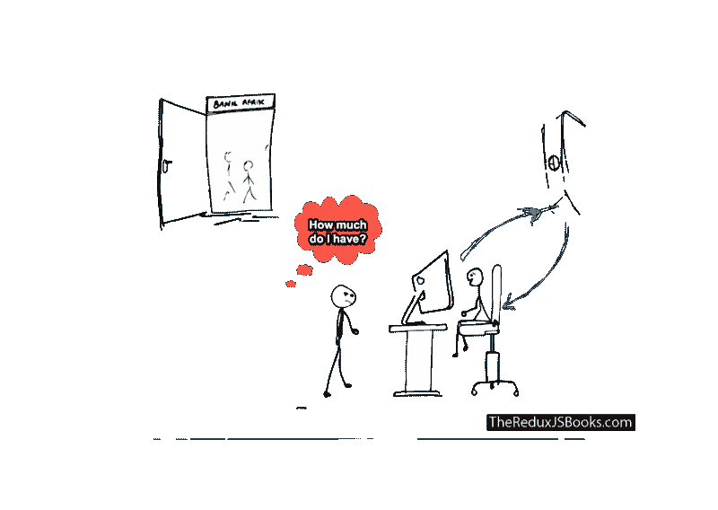

How much?

但是怎么做呢？

当你第一次在银行开立账户时，你要么有一定数量的存款，要么没有。

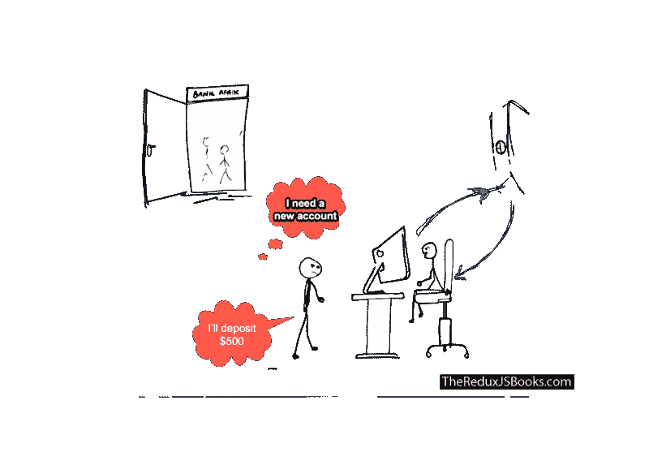

Uh, I need a new account with a $500 initial deposit

让我们称之为你账户的第一笔存款。

回到 Redux。

同样，当你创建一个 redux `STORE`(我们自己的资金保管库)时，可以选择用初始存款来做这件事。

用 Redux 的术语来说，这叫做 app 的`initialState`。

用代码思考，`initialState`是传递给`createStore`函数调用的第二个参数。

```
const store = createStore(reducer, initialState);
```

在进行任何货币交易`action`之前，如果您请求您的银行账户余额，初始存款将会返还给您。

此后，无论何时您执行任何货币操作`action`，该初始存款也会更新。

现在，Redux 也是如此。

作为`initialState`传入的对象类似于对保险库的初始存放。这个`initialState`将总是作为应用程序的`state`返回，除非您通过执行`action`来更新状态。

我们现在将更新应用程序以传入一个`initial state`:

```
const initialState = { tech: "React " };
const store = createStore(reducer, initialState);
```

请注意`initialState`只是一个对象，它正是我们开始重构之前 React 应用程序中的默认状态。

现在，这里是我们现在拥有的所有代码——其中的`reducer`也被导入到了`App.`中

`**App.js**`

```
import React, { Component } from "react";
import HelloWorld from "./HelloWorld";
import reducer from "./reducers";
import { createStore } from "redux";  

const initialState = { tech: "React " };
const store = createStore(reducer, initialState);

class App extends Component {
 render() {
   return <HelloWorld tech={this.state.tech}/>
 }
 }

export default App;
```

`**reducers/index.js**`

```
export default state  => {
	    return state	
}
```

如果你正在编写代码，并试图现在运行应用程序，你会得到一个错误。为什么？

看看传入`<HelloWorld />`的`tech`道具。上面仍然写着，`this.state.tech`。

不再有附加到`<App />`的状态对象，所以它将是`undefined`。

让我们解决这个问题。

解决办法很简单。由于`store`现在管理我们应用程序的状态，这意味着应用程序`STATE`对象必须从`store`中检索。但是怎么做呢？

每当你用`createStore()`创建一个商店时，创建的商店有三个公开的方法。

其中之一就是`getState()`。

在任何时间点，对创建的`store`调用`getState`方法都会返回应用程序的当前状态。

在我们的例子中，`store.getState()`将返回对象`{ tech: "React"}`,因为这是我们在创建`STORE`时传递给`createStore()`方法的`INITIAL STATE`。

你看到这些是怎么组合在一起的了吗？

因此`tech`属性将被传递到`<HelloWorld />`中，如下所示:

`**App.js**`

```
import React, { Component } from "react";
import HelloWorld from "./HelloWorld";
import { createStore } from "redux";  

const initialState = { tech: "React " };
const store = createStore(reducer, initialState);  

class App extends Component {
 render() {
   return <HelloWorld tech={store.getState().tech}/>
 }
 }
```

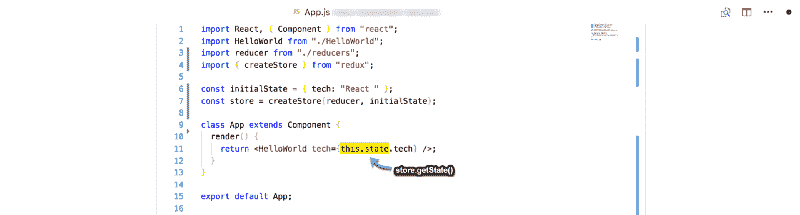

Replace “this.state” with “store.getState()”

`**Reducers/Reducer.js**`

```
export default state => {
	    return state	
}
```

就是这样！您刚刚学习了 Redux 基础知识，并成功重构了一个简单的 React 应用程序来使用 Redux。

React 应用程序现在的状态由 Redux 管理。如上所示，无论需要从`state`对象获取什么，都将从`store`对象获取。

希望你理解了整个重构过程。

为了更快地了解情况，请看一下这个 [Github diff](https://github.com/ohansemmanuel/hello-redux/compare/solution?expand=1) 。

通过“Hello World”项目，我们已经很好地了解了一些基本的 Redux 概念。尽管这是一个很小的项目，但它提供了一个很好的基础！

### 可能抓到你了

在刚刚结束的 **Hello World** 示例中，您可能已经想出了一个从`store`中抓取`state`的可能解决方案，可能如下所示:

```
class App extends Component {
  state = store.getState();
  render() {
    return <HelloWorld tech={this.state.tech} />;
  }
}
```

你怎么想呢?这能行吗？

提醒一下，下面两种方法是初始化 React 组件状态的正确方法。

(一)

```
class App extends Component {
 constructor(props) {
   super(props);
   this.state = {}
  }
}
```

(二)

```
class App extends Component {
  state = {}
}
```

所以，回到回答这个问题，是的，解决方案会很好。

`store.getState()`将从 Redux `STORE`中抓取当前状态。

然而，赋值操作`state = store.getState()`会将从 Redux 获得的状态赋值给`<App />`组件的状态。

言下之意，来自`render`如`<HelloWorld tech={this.state.tech} />`的 return 语句将有效。

注意这里写的是`this.state.tech` **而不是** `store.getState().tech`。

即使这行得通，但它违背了 Redux 的理想哲学。

如果在应用程序中，你现在运行`this.setState()`，应用程序的状态将在没有 Redux 帮助的情况下更新。

这是默认的反应机制，这不是您想要的。你希望由 Redux `STORE`管理的`state`成为真理的唯一来源。

无论是检索状态，如在`store.getState()`还是更新/更改`state`(我们将在后面介绍)，您都希望完全由 Redux 管理，而不是由`setState().`

由于 Redux 管理应用程序的 `state`，你所需要做的就是从 Redux `STORE`输入`state`作为任何所需组件的道具。

你可能会问自己的另一个大问题是“为什么我必须承受所有这些压力，只是为了让 Redux 管理我的应用程序的状态？”

减速器、商店、创建商店等等…

是的，我明白了。

我也有那种感觉。

然而，考虑到这样一个事实，你不仅仅是去银行，而且**没有**遵循一个适当的程序来提取你自己的钱。这是你的钱，但你必须遵循适当的程序。

Redux 也是如此。

Redux 有自己的做事“流程”。我们必须了解这是如何运作的——嘿，你做得还不错！

### 结论和总结

这一章令人激动。我们主要关注于为即将到来的更有趣的事情打下一个良好的基础。

以下是你在本章中学到的一些东西:

*   Redux 是 JavaScript 应用程序的一个可预测的**状态容器**。
*   Redux 中的`createStore`工厂函数用于创建 Redux `STORE`。
*   `Reducer`是传递给`createStore()`的唯一强制参数
*   一个`REDUCER`只是一个函数。一个函数接受**两个**参数。第一个是 app 的`STATE`，另一个是一个`ACTION.`
*   A `Reducer`总是返回你的应用程序的`new state`。
*   应用程序的初始状态，`initialState`是传递给`createStore`函数调用的第二个参数。
*   `Store.getState()`将返回应用程序的当前状态。其中`Store`是有效的冗余`STORE`。

### 介绍练习

拜托，拜托，拜托，不要跳过练习。特别是如果你对你的 Redux 技能没有信心，并且真的想从这个指南中得到最好的东西。

所以，拿起你的开发帽子，写一些代码:)

此外，如果你想让我在任何时候对你的任何解决方案给你反馈，请用标签 **#UnderstandingRedux** 发推特给我，我很乐意看一看。我不保证能看到每一条推文，但我一定会努力！

一旦你把练习整理好了，我们下一节见。

记住，阅读长内容的一个好方法是把它分成更短的易理解的部分。这些练习可以帮助你做到这一点。你休息一段时间，试着解决问题，然后回来继续阅读。那是一种有效的学习方法。


想看看我对这些练习的解答吗？我已经把练习题的答案放在书包里了。下载(免费)电子书(PDF & Epub)后，你会发现如何获得附带的代码和练习解决方案的说明。

这是本节的练习。

### 锻炼

**(a)重构用户卡 app 使用 Redux**

在本书附带的代码文件中，您会发现一个仅用 React 编写的用户卡应用程序。应用程序的状态通过 React 管理。您的任务是将状态转移到由 Redux 单独管理。


The exercise: User card app built with React. Refactor to use Redux.

### 第 3 章:用动作理解状态更新

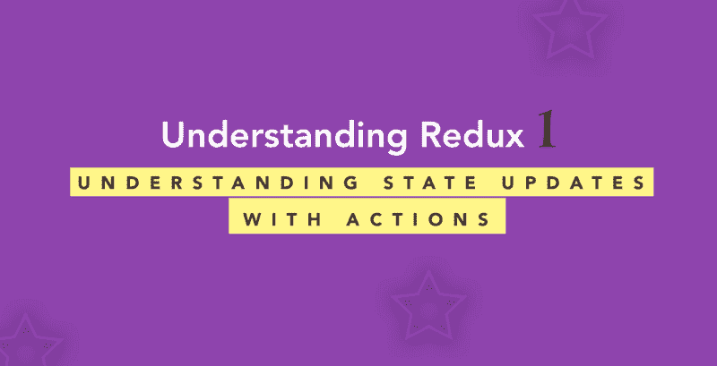

既然我们已经讨论了 Redux 的基本概念，我们将开始做一些更有趣的事情。

在这一章中，我们将在我带领你完成另一个项目的过程中继续学习，同时详细解释每个过程。

那么，这次要做什么项目呢？

我有一个完美的。

请考虑下面的模型:


Updated design of the Hello world app.

哦，它看起来就像前一个例子——但有一些变化。这一次我们将考虑用户操作。当我们单击任何按钮时，我们希望更新应用程序的状态，如下面的 GIF 所示:


The GIF!

这与前面的例子有所不同。在这个场景中，用户正在执行某些影响应用程序状态的操作。在前一个例子中，我们所做的只是显示应用程序的初始状态，没有考虑用户的动作。

### 什么是 Redux 动作？

当你走进一家银行时，出纳员会收到你的动作，也就是你进入银行的意图。在我们之前的例子中，它是`WITHDRAWAL_MONEY`。钱离开银行金库的唯一方法是你让出纳员知道你的行为或意图。

现在，Redux 减速器也是如此。

与 pure React 中的`setState()`不同，更新 Redux 应用程序状态的唯一方法是让 Redux 知道你的意图。

但是怎么做呢？

通过调度动作！

在现实世界中，您知道您想要执行的确切操作。你也许可以把它写在一张纸条上，然后交给出纳员。

这与 Redux 的工作方式几乎相同。唯一的挑战是，如何在 Redux 应用中描述一个动作？绝对不是在柜台上说或者写在纸条上。

好消息是。

一个动作用一个普通的 JavaScript 对象精确地描述。仅此而已。

只有一件事需要注意。一个动作**必须**有一个`type`字段。此字段描述操作的意图。

在银行的故事中，如果我们向银行描述您的行为，它看起来会是这样的:

```
{
  type: "withdraw_money"
}
```

仅此而已，真的。

Redux 动作被描述为一个普通对象。

请看一下上面的动作。

您是否认为只有`type`字段准确描述了您在银行取款的假设行为？

嗯。我不这么认为。你想取多少钱？

很多时候，您的操作需要一些额外的数据来完成描述。考虑下面的操作。我认为这有助于更好地描述行动。

```
{
  type: "withdraw_money",
  amount: "$4000"
}
```

现在，有足够的信息来描述这个动作。对于这个例子，忽略该操作可能包括的所有其他细节，例如您的银行帐号。

除了`type`字段，Redux 动作的结构实际上取决于您自己。

然而，一种常见的方法是具有如下所示的`type`字段和`payload`字段:

```
{
  type: " ",
  payload: {}
}
```

`type`字段描述动作，所有其他描述动作的必需数据/信息都放在`payload`对象中。

例如:

```
{
  type: "withdraw_money",
  payload: {
     amount: "$4000"
  }
}
```

所以，是的！这就是行动。

### 处理对减速器中动作的响应

现在你已经成功地理解了什么是动作，重要的是看它们如何在实际意义上变得有用。

早些时候，我说过一个缩减器接受**两个**参数。一个`state`，另一个`action`。

下面是一个简单的减速器的样子:

```
function reducer(state, action) {
  //return new state
}
```

`action`作为第二个参数传递给减速器。但是我们没有在函数内部做任何事情。

为了处理传递给缩减器的动作，通常在缩减器中编写一个`switch`语句，如下所示:

```
function reducer (state, action) {
	switch (action.type) {
		 case "withdraw_money":
			//do something
			break;
		case "deposit-money":
			 //do something
			break;
		default:
			return state;
			 }
}
```

有些人似乎不喜欢`switch`语句，但它基本上是单个字段上可能值的`if/else`。

上面的代码将`switch`覆盖动作`type`，并根据传入的动作类型做一些事情。从技术上讲，返回新状态需要*做某事*位。

让我进一步解释一下。

假设你在某个网页上有两个按钮，按钮#1 和按钮#2，你的状态对象看起来像这样:

```
{
	 isOpen: true,
	 isClicked: false,
  }
```

当点击按钮#1 时，您想要切换`isOpen`字段。在 React 应用程序的环境中，解决方案很简单。一旦单击该按钮，您应该这样做:

```
this.setState({isOpen: !this.state.isOpen})
```

另外，让我们假设当#2 被点击时，您想要更新`isClicked`字段。同样，解决方案很简单，大致如下:

```
this.setState({isClicked: !this.state.isClicked})
```

很好。

有了 Redux app，就不能用`setState()`来更新 Redux 管理的状态对象。

您必须首先分派一个操作。

让我们假设动作如下:

**#1 :**

```
{
	type: "is_open"
}
```

**#2 :**

```
{
	type: "is_clicked"
}
```

在 Redux 应用中，每个动作都流经 reducer。

全部都是。因此，在本例中，动作#1 和动作#2 将通过同一个缩减器。

在这种情况下，减速器如何区分它们中的每一个？

是的，你猜对了。

通过切换`action.type`，我们可以毫不费力地处理这两个动作。

我的意思是:

```
function reducer (state, action) {
	switch (action.type) {
		case "is_open":
			return;  //return new state
		case "is_clicked":
			return; //return new state
		default:
		return state;
	}
}
```

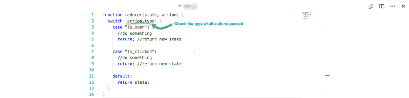

现在你明白为什么`switch`语句是有用的了。所有的动作都会流经减速器。因此，单独处理每种操作类型非常重要。

在下一部分中，我们将继续构建下面的迷你应用程序:


### 检查应用程序中的操作

正如我前面解释的那样，每当想要更新应用程序状态时，必须调度一个`action`。

无论这种意图是由用户点击、超时事件还是 Ajax 请求引发的，规则都是一样的。你必须采取行动。

这个应用程序也是如此。

因为我们打算更新应用程序的状态，所以每当任何按钮被点击时，我们必须分派一个动作。

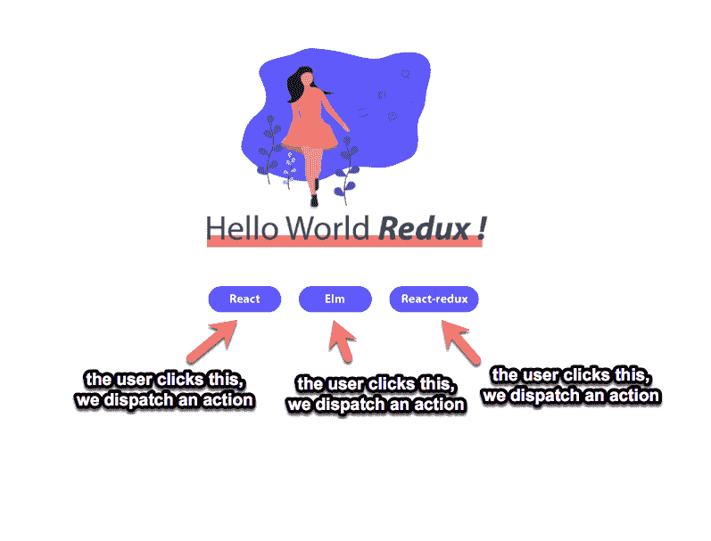

首先，让我们描述一下动作。

试一试，看看你是否明白了。

这是我想到的:

对于反应按钮:

```
{
    type: "SET_TECHNOLOGY",
    text: "React"
  }
```

对于 React-Redux 按钮:

```
{
     type: "SET_TECHNOLOGY",
     text: "React-redux"
   }
```

最后:

```
{
   type: "SET_TECHNOLOGY",
  text: "Elm"
}
```

很简单，对吧？

注意，这三个动作有相同的`type`字段。这是因为这三个按钮都做同样的事情。如果他们是银行的客户，那么他们都会存钱，但是金额不同。动作的`type`将是`DEPOSIT_MONEY`，但是具有不同的`amount`字段。

此外，您会注意到动作类型都是用大写字母书写的。那是故意的。这不是强制性的，但是在 Redux 社区中这是一种非常流行的风格。

希望你现在明白我是如何想出这些动作的。

#### 介绍动作创建者

看看我们在上面创建的动作。你会注意到我们在重复一些事情。

首先，它们都有相同的`type`字段。如果我们必须在多个地方分派这些操作，我们必须在所有地方重复它们。那不太好。尤其是因为让你的代码保持干燥是一个好主意。

我们能做点什么吗？

当然可以！

欢迎，动作创作者们。

Redux 有这些花哨的名字，嗯？减少者，动作，现在，动作创建者:)

让我解释一下这些是什么。

动作创建器只是帮助您创建动作的功能。仅此而已。它们是返回动作对象的函数。

在我们的特定示例中，我们可以创建一个函数，它接受一个`text`参数并返回一个动作，如下所示:

```
export function setTechnology (text) {
  return {
     type: "SET_TECHNOLOGY",
     tech: text
   }
}
```

现在，我们不必担心到处复制代码。我们可以随时调用`setTechnology`动作创建者，我们会得到一个动作！

函数的用途真好。

使用 ES6，我们上面创建的操作创建器可以简化为:

```
const setTechnology = text => ({ type: "SET_TECHNOLOGY", text });
```

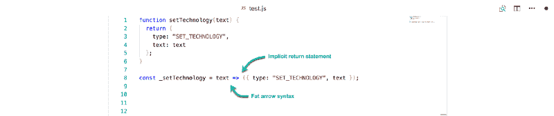

现在，已经完成了。

### 将所有东西整合在一起

在前面的小节中，我已经单独讨论了构建更高级的 Hello World 应用程序所需的所有重要组件。

现在，让我们把所有东西放在一起，构建应用程序。激动吗？

首先，让我们谈谈文件夹结构。

当你到了银行，出纳员很可能坐在他们自己的隔间/办公室里。金库也安全地保存在一个安全的房间里。有充分的理由，这样事情感觉更有条理。每个人都在自己的空间里。

Redux 也是如此。

让 redux 应用程序的主要参与者生活在他们自己的文件夹/目录中是一种常见的做法。

我说的演员是指`reducer`、`actions`和`store`。

通常在应用程序目录中创建三个不同的文件夹，并以这些角色命名。

这不是必须的——而且不可避免的是，你要决定如何构建你的项目。但是，对于大型应用程序来说，这无疑是一种相当不错的做法。

我们现在将重构现有的应用程序目录。创建一些新的目录/文件夹。一个叫`reducers`，另一个叫`store`，最后一个叫`actions`

您现在应该有一个如下所示的组件结构:

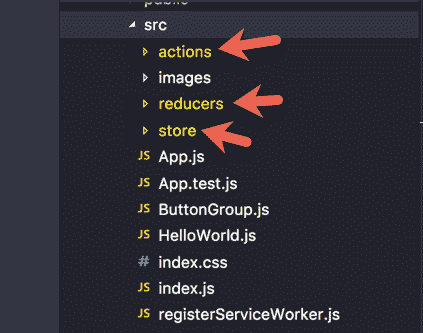

在每个文件夹中，创建一个`index.js`文件。这将是每个 Redux actor(reducer、store 和 actions)的入口点。我叫他们演员，像电影演员。它们是 Redux 系统的主要组件。

现在，我们将重构前面的应用程序，从**第二章:你的第一个 Redux 应用程序**，使用这个新的目录结构。

`**store/index.js**`

```
import { createStore } from "redux";
import reducer from "../reducers";

const initialState = { tech: "React " };
export const store = createStore(reducer, initialState);
```

这就像我们以前一样。唯一不同的是，商店现在是在自己的`index.js`文件中创建的，就像为不同的 Redux actors 提供单独的隔间/办公室一样。

现在，如果我们需要应用程序中的商店，我们可以安全地导入商店，如`import store from "./store";`所示

也就是说，这个特定示例的`App.js`文件与前者略有不同。

`**App.js**`

```
import React, { Component } from "react";
import HelloWorld from "./HelloWorld";
import ButtonGroup from "./ButtonGroup";
import { store } from "./store";

class App extends Component {
  render() {
    return [
      <HelloWorld key={1} tech={store.getState().tech} />,
      <ButtonGroup key={2} technologies={["React", "Elm", "React-redux"]} />
    ];
  }
}

export default App;
```

有什么不同？

在第 4 行，商店是从它自己的“隔间”导入的。此外，现在还有一个`<ButtonGroup />`组件，它接受一系列技术并输出按钮。`ButtonGroup`组件处理“Hello World”文本下面三个按钮的呈现。

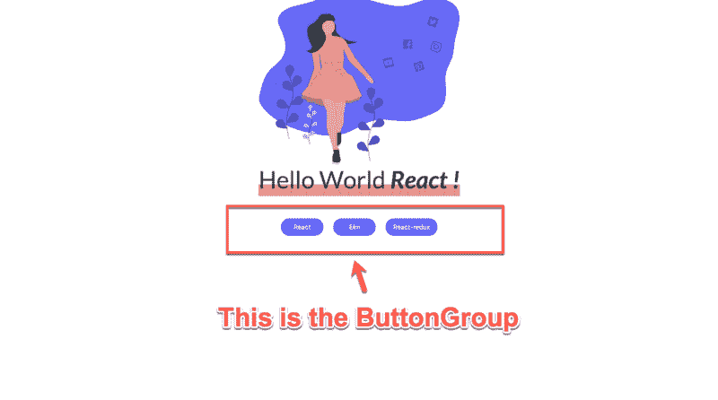

另外，您可能会注意到,`App`组件返回一个数组。那是一个`React 16`好东西。使用 React 16，您不必将相邻的`JSX`元素包装在一个`div`中。如果你愿意，你可以使用一个数组——但是要给数组中的每个元素传入一个`key`属性。


这就是`App.js`组件。

组件的实现非常简单。这是:

`**ButtonGroup.js**`

```
import React from "react";

const ButtonGroup = ({ technologies }) => (
  <div>
    {technologies.map((tech, i) => (
      <button
        data-tech={tech}
        key={`btn-${i}`}
        className="hello-btn"
      >
        {tech}
      </button>
    ))}
  </div>
);

export default ButtonGroup;
```

`ButtonGroup`是一个无状态组件，采用了一系列技术，用`technologies.`表示

它使用`map`对这个数组进行循环，并为数组中的每个技术渲染一个`<button></button`。

在本例中，传入的按钮数组是`["React", "Elm", "React-redux"]`

生成的按钮有几个属性。有明显的`className`用于造型目的。这里有`key`来防止讨厌的 React 警告显示没有关键道具的多个项目。天哪，那个错误每次都困扰着我

最后，每个`button`上还有一个`data-tech`属性。这叫做[数据属性](https://developer.mozilla.org/en-US/docs/Learn/HTML/Howto/Use_data_attributes)。这是一种存储一些没有任何视觉表现的额外信息的方式。这使得从元素中获取某些值稍微容易一些。

完全呈现的按钮将如下所示:

```
<button 
  data-tech="React" 
  key="btn-1" 
  className="hello-btn"> React </button>
```

现在，一切都正确地呈现了，但是在点击按钮时，什么也没有发生。

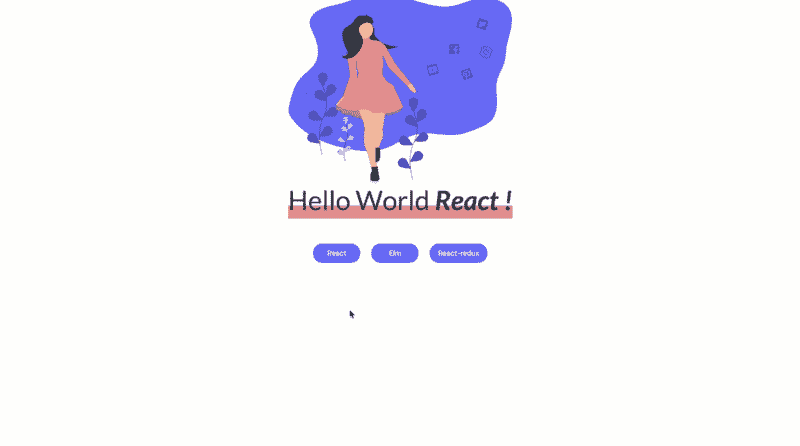

那是因为我们还没有提供任何点击处理程序。让我们现在做那件事。

在`render`函数中，让我们设置一个`onClick`处理程序:

```
<div>
    {technologies.map((tech, i) => (
      <button
        data-tech={tech}
        key={`btn-${i}`}
        className="hello-btn"
        onClick={dispatchBtnAction}
      >
        {tech}
      </button>
    ))}
  </div>
```

很好。现在就来写`dispatchBtnAction`吧。

不要忘记，这个处理程序的唯一目的是在发生点击时发出一个动作。

例如，如果您单击 React 按钮，调度该操作:

```
{
    type: "SET_TECHNOLOGY",
    tech: "React"
  }
```

如果单击 React-Redux 按钮，调度此操作:

```
{
     type: "SET_TECHNOLOGY",
     tech: "React-redux"
   }
```

所以，这里是`dispatchBtnAction`函数。

```
function dispatchBtnAction(e) {
  const tech = e.target.dataset.tech;
  store.dispatch(setTechnology(tech));
}
```

嗯。上面的代码对你有意义吗？

`e.target.dataset.tech`将获取按钮上设置的数据属性，`data-tech`。于是，`tech`就持有了文字的价值。

`store.dispatch()`是你在 Redux 中如何调度一个动作，`setTechnology()`是我们前面写的动作创建者！

```
function setTechnology (text) {
  return {
     type: "SET_TECHNOLOGY",
     text: text
   }
}
```

我已经在下图中添加了一些注释，只是为了让你理解代码。

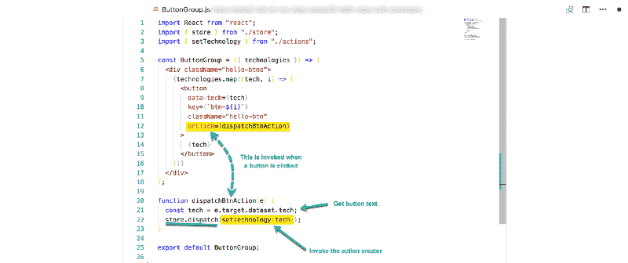

正如您已经知道的，`store.dispatch`只需要一个动作对象，而不需要其他东西。别忘了`setTechnology`动作创作者。它接受按钮文本并返回所需的动作。

同样，按钮的`tech`是从按钮的数据集中获取的。你看，这就是为什么我在每个按钮上都有一个`data-tech`属性。所以我们可以很容易地从每个按钮上取下技术。

现在我们正在分派正确的行动。我们现在能知道这是否如预期的那样工作吗？

### 已调度操作。这东西能用吗？

首先，这里有一个小问题。当点击一个`button`并因此分派一个动作时，Redux 中接下来会发生什么？哪些 Redux 演员出场？

简单。当你去抢银行的时候，你会去找谁？收银员，是的。

这里也一样。当动作被分派时，会流经缩减器。

为了证明这一点，我将记录任何进入减速器的动作。

`**reducers/index.js**`

```
export default (state, action) => {
  console.log(action);
  return state;
};
```

然后，reducer 返回应用程序的新状态。在我们的特例中，我们只是返回相同的首字母`state`。

有了减速器中的`console.log()`，我们来看看点击时会发生什么。

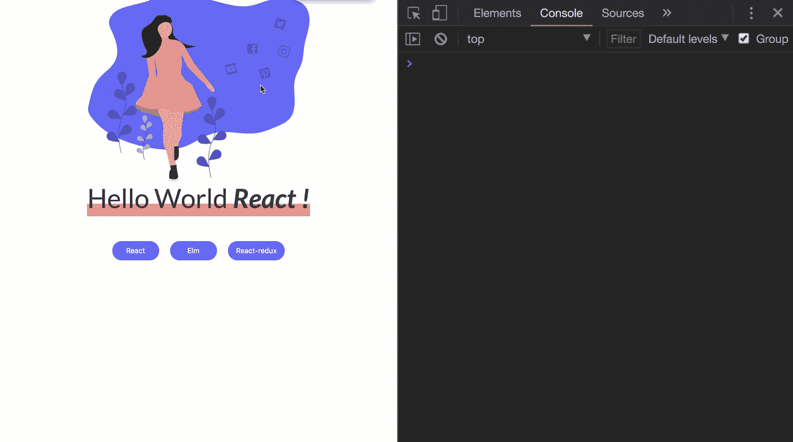

哦耶！

单击按钮时会记录操作。这证明了动作确实通过减速器。太神奇了！

不过，还有一件事。应用程序一启动，就会记录一个奇怪的动作。看起来是这样的:

```
{type: "@@redux/INITu.r.5.b.c"}
```

那是什么？

好吧，不要太担心那件事。是 Redux 自己在设置你的 app 时传递的一个动作。它通常被称为 Redux `init action`，当 Redux 用 app 的初始状态初始化你的应用时，它被传入 reducer。

现在，我们确信这些动作确实通过了减速器。太好了！

虽然这很令人兴奋，但你去收银台取款的唯一原因是因为你想要钱。如果缩减者不采取我们传递的动作，而用我们的动作做一些事情，那么它的价值是什么？

### 让减速器发挥作用

到目前为止，我们研究的减速器还没有做任何特别聪明的事情。这就像一个新来的收银员，没有按照我们的意图做任何事情。

我们到底期望减速器做什么？

现在，这是当`STORE`被创建时我们传递给`createStore`的`initialState`。

```
const initialState = { tech: "React" };
export const store = createStore(reducer, initialState);
```

当用户点击任何一个按钮，从而将一个动作传递给 reducer 时，我们期望 reducer 返回的新状态应该包含动作文本！

我的意思是。

当前状态为`{ tech: "React"}`

给定类型为`SET_TECHNOLOGY`的新动作和文本`React-Redux`:

```
{
	    type: "SET_TECHNOLOGY",
	    text: "React-Redux"
}
```

你期望新的状态是什么样的？

耶，`{tech: "React-Redux"}`

我们分派动作的唯一原因是因为我们想要一个新的应用程序状态！

正如我前面提到的，在一个 reducer 中处理不同动作类型的常用方法是使用 JavaScript `switch`语句，如下所示:

```
export default (state, action) => {
  switch (action.type) {
    case "SET_TECHNOLOGY":
      //do something.

    default:
      return state;
  }
};
```

现在我们越过了 T1。但是为什么呢？

嗯，如果你去见一个收银员，你会想到很多不同的行动。

你可以选择`WITHDRAW_MONEY`，或者`DEPOSIT_MONEY`，或者仅仅是`SAY_HELLO`。

收银员很聪明，所以他们会接受你的行为，并根据你的意图做出反应。

这正是我们对减压器所做的。

`switch`语句检查动作的`type`。

你想干嘛?取款，存款，随便什么…

之后，我们处理我们期望的已知的`cases`。目前，只有一个`case`，那就是`SET_TECHNOLOGY`。

而且默认情况下，一定要只返回 app 的`state`。


到目前为止一切顺利。

收银员现在明白了我们的行动。然而，他们还没有给我们任何钱。

让我们在`case`内做些事情。

这里是减速器的更新版本。一个真正给我们钱的:)

```
export default (state, action) => {
  switch (action.type) {
    case "SET_TECHNOLOGY":
      return {
        ...state,
        tech: action.text
      };

    default:
      return state;
  }
};
```

啊，太好了！

你看到我在做什么了吗？


我将在下一节解释这是怎么回事。

### 不要在减速器内改变状态

当从减速器返回`state`时，有些事情可能会让你开始分心。但是，如果您已经编写了很好的 React 代码，那么您应该对此很熟悉。

你不应该改变你的减速器接收到的`state`。相反，您应该总是返回状态的新副本。

从技术上讲，您永远不应该这样做:

```
export default (state, action) => {
  switch (action.type) {
    case "SET_TECHNOLOGY":
      state.tech = action.text; 
      return state;

    default:
      return state;
  }
};
```

这正是我所写的 reducer 返回这个的原因:

```
return {
        ...state,
        tech: action.text
  };
```

我返回了一个**新的**对象，而不是突变(或改变)从 reducer 收到的状态。这个对象具有前一个状态对象的所有属性。感谢 ES6 传播运营商，`...state`。然而，`tech`字段被更新为来自动作`action.text.`的内容

此外，您编写的每个 Reducer 应该是一个没有副作用的纯函数——没有 API 调用或更新函数范围之外的值。

明白了吗？

希望如此。

现在，收银员没有忽视我们的行为。事实上他们现在给我们现金了！

完成后，点击按钮。现在能用了吗？

天哪，这还是不行。文本不会更新。

这次到底是哪里出了问题？

### 订阅商店更新

当你去银行的时候，让收银员知道你的意图`WITHDRAWAL`行动，并成功地收到你的钱——那么下一步是什么？

最有可能的情况是，你会通过电子邮件/短信或其他移动通知收到一条提醒，说你已经完成了一笔交易，你的新账户余额是某某。

如果你没有收到手机通知，你肯定会收到某种“个人收据”,表明你的账户上进行了一次成功的交易。

好的，注意流程。启动了一个操作，您收到了您的钱，您收到了一个成功交易的警报。

我们的 Redux 代码似乎有问题。

一个操作已经成功启动，我们已经收到了钱(状态)，但是，嘿，成功的状态更新的警报在哪里？

我们什么都没有。

嗯，有一个解决办法。在我来的地方，你可以通过电子邮件或短信订阅接收银行的交易通知。

Redux 也是如此。如果你想要更新，你必须订阅它们。

但是怎么做呢？

Redux 存储，你创建的任何存储都有一个像这样调用的`subscribe`方法:`store.subscribe().`

如果你问我，我会说这是一个名副其实的函数！

传递给`store.subscribe()`的参数是一个函数，只要有状态更新，它就会被调用。

值得一提的是，请记住传递给`store.subscribe()`的**参数**应该是一个**函数**。好吗？

现在让我们利用这一点。

想想吧。状态更新后，我们想要或期待什么？我们期待重新渲染，对吗？

因此，状态已被更新。Redux，请用新的状态值重新渲染应用程序。

让我们来看看`index.js`中应用程序的渲染位置

这是我们得到的。

```
ReactDOM.render(<App />, document.getElementById("root")
```

这是呈现整个应用程序的行。它获取`App/>`组件并将其呈现在 DOM 中。具体来说就是`root` ID。

首先，让我们把它抽象成一个函数。

看这个:

```
const render = function() {
  ReactDOM.render(<App />, document.getElementById("root")
}
```

因为现在这是在一个函数中，我们必须调用函数来`render`应用程序。

```
const render = function() {
   ReactDOM.render(<App />, document.getElementById("root")
}
render()
```

现在，`<App />`将像以前一样被渲染。

使用一些 ES6 好东西，功能可以变得更简单。

```
const render = () => ReactDOM.render(<App />, document.getElementById("root"));

render();
```

将`<App/>`的呈现包装在一个函数中意味着我们现在可以订阅对商店的更新，如下所示:

```
store.subscribe(render);
```

其中`render`是`<App />`的完整渲染逻辑——我们刚刚重构的那个。

你知道这里发生了什么，对吗？

每当有一个对存储的成功更新时，`<App/>`就会用新的状态值重新呈现。

为了清楚起见，下面是`<App/>`组件:

```
class App extends Component {
  render() {
    return [
      <HelloWorld key={1} tech={store.getState().tech} />,
      <ButtonGroup key={2} technologies={["React", "Elm", "React-redux"]} />
    ];
  }
}
```

每当重新渲染发生时，第 4 行的`store.getState()`将获取更新后的状态。

让我们看看这个应用程序现在是否能像预期的那样工作。


耶！这行得通，我就知道我们能做到！

我们成功地调度了一个操作，从收银员那里收到了钱，然后订阅接收通知。完美！

### 关于使用 store.subscribe()的重要说明

正如我们在这里所做的，使用`store.subscribe()`有一些注意事项。它是一个低级的 Redux API。

在生产中，很大程度上是出于性能原因，在处理较大的应用程序时，您可能会使用绑定，比如`react-redux`。现在，出于我们的学习目的，继续使用`store.subscribe()`是安全的。

在我见过的最漂亮的[公关评论](https://github.com/reduxjs/redux/pull/1289)中，丹·阿布拉莫夫*，*在其中一个 Redux 应用的例子中说:

> 新的 Counter Vanilla 示例旨在消除 Redux 需要 Webpack、React、hot reloading、sagas、action creators、constants、Babel、npm、CSS 模块、decorators、流利的拉丁语、Egghead 订阅、PhD 或超出预期的 O.W.L .水平的神话。

我也这么认为。

当学习 Redux 时，尤其是如果你刚刚开始，你可以尽可能多地去掉“多余的东西”。

先学会走路，然后你就可以尽情地跑 T2 和 T3 了。

### 好了，完事了吗？

是的，技术上说，我们结束了。不过，我还想给你看一样东西。我将打开我的浏览器开发工具，并启用油漆闪烁。

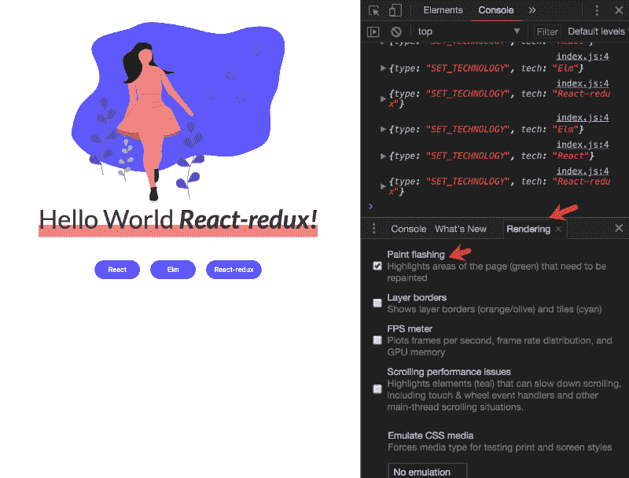

现在，当我们点击并更新应用程序的状态时，请注意屏幕上出现的绿色闪烁。绿色闪光代表浏览器引擎正在重新绘制或重新呈现的应用程序部分。

看一看:


正如您所看到的，尽管每次进行状态更新时似乎都调用了`render`函数，但并不是整个应用程序都被重新呈现。仅重新呈现具有新状态值的组件。在这种情况下，`<HelloWorld/>`组件。

还有一件事。

如果应用程序的当前状态呈现为`Hello World React`，再次单击`React`按钮不会重新呈现，因为状态值是相同的。

很好！

这里使用的是 React 虚拟 DOM `Diff`算法。如果你知道一些反应，你一定听说过这个。

所以，是的。我们完成了这一部分！我觉得解释这个很有趣。我希望你也喜欢这本书。

### 结论和总结

对于一个简单的应用程序，这一章可能比您预期的要长。但是没关系。您现在对 Redux 的工作原理有了更多的了解。

以下是你在本章中学到的一些东西:

*   与 pure React 中的`setState()`不同，更新 Redux 应用程序状态的唯一方式是调度一个动作。
*   一个动作可以用一个普通的 JavaScript 对象准确地描述，但是它必须有一个`type`字段。
*   在 Redux 应用中，每个动作都流经 reducer。全部都是。
*   通过使用一个`switch`语句，您可以在 Reducer 中处理不同的动作类型。
*   动作创建者只是返回动作对象的函数。
*   让 redux 应用程序的主要参与者生活在他们自己的文件夹/目录中是一种常见的做法。
*   你不应该改变你的减速器接收到的`state`。相反，您应该总是返回状态的新副本。
*   要订阅商店更新，请使用`store.subscribe()`方法。

### 练习

好了，现在是你做些酷事的时候了。

1.  在练习文件中，我已经建立了一个简单的 React 应用程序来模拟用户的银行应用程序。

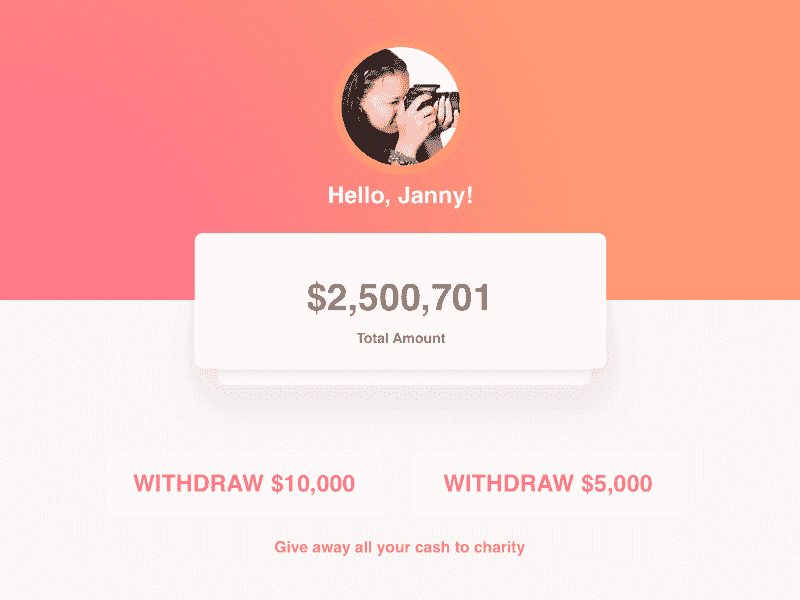

好好看看上面的模型。除了用户能够查看他们的总余额，他们还可以执行取款操作。

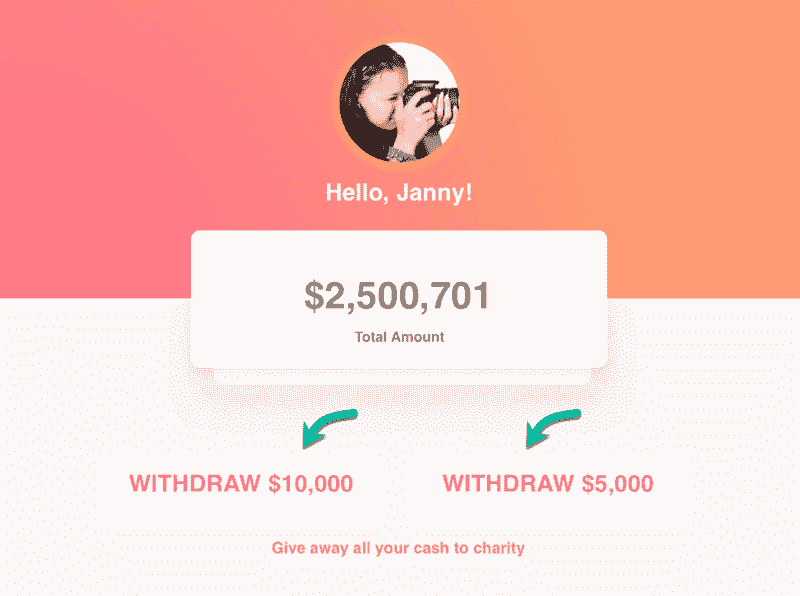

用户的`name`和`balance`存储在应用状态中。

```
{
  name: "Ohans Emmanuel",
  balance: 1559.30
}
```

你需要做两件事。

(I)重构应用程序的状态，使其仅由 Redux 管理。

(ii)处理取款操作以实际耗尽用户的余额(即，点击按钮时，余额减少)。

您必须仅通过 Redux 完成此操作。


提醒一下，下载电子书后，你会发现如何获得附带的代码文件、练习文件和练习答案的说明。

2.下图是作为 React 应用程序创建的时间计数器。

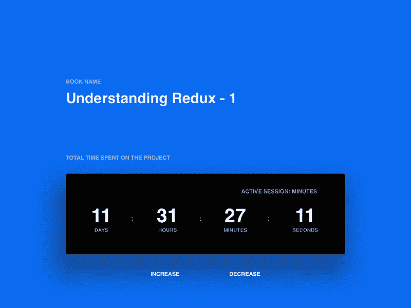

状态对象如下所示:

```
{
  days: 11,
  hours: 31,
  minutes: 27,
  seconds: 11,
  activeSession: "minutes"
}
```

根据激活的会话，单击任何“增加”或“减少”按钮应更新计数器中显示的值。

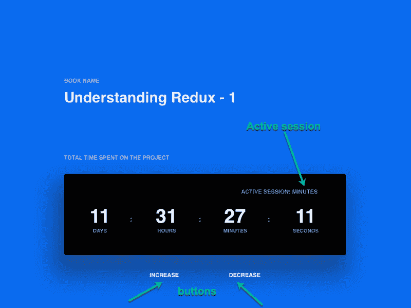

你需要做两件事。

(I)重构应用程序的状态，使其仅由 Redux 管理。

(ii)处理增加和减少动作以实际影响计数器上显示的时间。

### 第 4 章:构建 Skypey:一个更高级的例子。


我们已经走了很长一段路，我向你们致敬。

在这一节中，我将带您了解构建一个更高级的示例的过程。

尽管我们已经介绍了 Redux 的很多基础知识，但我真的认为这个例子将让您更深入地了解您所学的一些概念是如何在更广泛的范围内工作的。

我们将讨论规划您的应用程序，设计和规范化状态对象，以及更多内容。真正的应用需要的不仅仅是 Redux。你仍然需要一些 CSS 和 React。

系好安全带，因为这将是一次值得的长途旅行！

### 规划应用程序

好吧。这是个大问题。当启动一个新的 React 应用程序时，您通常首先做什么？

我们都有自己的偏好。

您是否将整个应用程序分解成组件并逐步构建？

你首先从应用程序的整体布局开始吗？

你 app 的状态对象怎么样？你也花时间思考过这个问题吗？

确实有很多要考虑的。我会给你留下你喜欢的做事方式。

在构建 Skypey 的过程中，我将采用自上而下的方法。我们将讨论应用程序的整体布局，然后是应用程序状态对象的设计，然后我们将构建更小的组件。

同样，没有完美的方法可以做到这一点。对于一个更复杂的项目，也许自底向上的方法更适合。

再一次，这是我们想要的最终结果:


The Skypey application

### 解析初始应用布局

在 CLI 中，使用`create-react-app,`创建一个新的 react 应用程序，并将其命名为`Skypey`。

```
create-react-app Skypey
```

Skypey 的布局是一个简单的 2 列布局。左边是固定宽度的侧边栏，右边是占据剩余视区宽度的主要部分。

这里有一个关于这个应用程序是如何设计的快速说明。

如果你是一个更有经验的工程师，一定要使用 JavaScript 解决方案中适合你的 CSS。为了简单起见，我将用 good 'ol CSS 来设计 *Skypey* 应用程序——仅此而已。

让我们开始吧。

在根目录下创建两个新文件，`Sidebar.js`和`Main.js`。

正如您可能已经猜到的，当我们构建出`Sidebar`和`Main`组件时，我们将在`App`组件中呈现它，如下所示:

`**App.js**`

```
const App = () => {
  return (
    <div className="App">
      <Sidebar />
      <Main />
    </div>
  );
};
```

我想你熟悉一个项目的结构。这是应用程序的入口点，`index.js`，它呈现了一个`App`组件。

在继续构建侧栏和主要组件之前，先做一些 CSS 内务处理。确保渲染应用程序的 DOM 节点`#root`占据视口的整个高度。

`**index.css**`

```
#root {
  height: 100vh;
}
```

同时，您还应该删除`body`中任何不需要的间距:

```
body {
  margin: 0;
  padding: 0;
  font-family:  sans-serif;
}
```

很好！

应用程序的布局将使用 **Flexbox** 构建。

通过使`.App`成为`flex-container`并确保其占据可用高度的 100% ，使 Flexbox juice 运行。

`**App.css**`

```
.App {
  height: 100%;
  display: flex;
  color: rgba(189, 189, 192, 1);
}
```

现在，我们可以轻松地开始构建`Sidebar`和`Main`组件了。

现在让我们保持简单。

`**Sidebar.js**`

```
import React from "react";
import "./Sidebar.css";

const Sidebar = () => {
  return <aside className="Sidebar">Sidebar</aside>;
};

export default Sidebar;
```

所呈现的只是一个`<aside>`元素中的文本`Sidebar`。另外，请注意，相应的样式表`Sidebar.css`也已经被导入。

在`Sidebar.css`中，我们需要限制侧边栏的宽度，加上一些其他简单的样式。

`**Sidebar.css**`

```
.Sidebar {
  width: 80px;
  background-color: rgba(32, 32, 35, 1);
  height: 100%;
  border-right: 1px solid rgba(189, 189, 192, 0.1);
  transition: width 0.3s;
}

/* not small devices  */
@media (min-width: 576px) {
  .Sidebar {
    width: 320px;
  }
}
```

采用移动优先的方法，侧边栏的`width`将是大型设备上的`80px`和`320px`。

好了，现在来看一下`Main`组件。

像以前一样，我们保持简单。

简单地在一个`<main>`元素中呈现一个简单的文本。

在开发应用程序时，你要确保循序渐进地构建。换句话说，一点一点地构建，并确保应用程序正常工作。

下面是`<Main>`组件:

```
import React from "react";
import "./Main.css";

const Main = () => {
  return <main className="Main">Main Stuff</main>;
};

export default Main;
```

同样，相应的样式表`Main.css`已经被导入。

有了`<Main />`和`<Sidebar />`的渲染元素，就有了 CSS 类名`.Main`和`.Sidebar`。

因为组件都是在`<App />`中呈现的，所以`.Sidebar`和`.Main`类是父类`.App`的子类。

记住`.App`是一个 flex 容器。因此，可以让`.Main`填充视口中的剩余空间，如下所示:

```
.Main {
 flex: 1 1 0;
}
```

下面是完整的代码:

```
.Main {
  flex: 1 1 0;
  background-color: rgba(25, 25, 27, 1);
  height: 100%;
}
```

那很简单:)

这是到目前为止我们编写的所有代码的结果。


The humble result with the Sidebar and Main sections laid out.

没那么刺激。耐心。我们会到达那里的。

现在，应用程序的基本布局已经设置好了。干得好！

### 设计状态对象

React 应用程序的创建方式是，你的整个应用程序主要是一个`state`对象的函数。

无论你是在创建一个复杂的应用程序，还是简单的应用程序，你都应该在如何构造应用程序的状态对象上花很多心思。

特别是在使用 Redux 时，您可以通过正确设计状态对象来降低复杂性。

那么，怎么做才是对的呢？

首先，考虑一下 Skypey 应用程序。

该应用程序的用户有多个联系人。

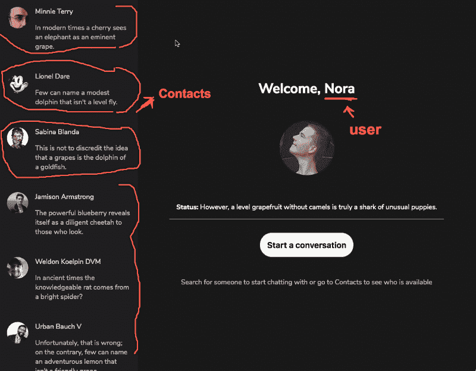

The multiple contacts a user may have.

每个联系人都有一些信息，组成了他们与主要应用程序用户的对话。当您单击任何联系人时，此视图将被激活。

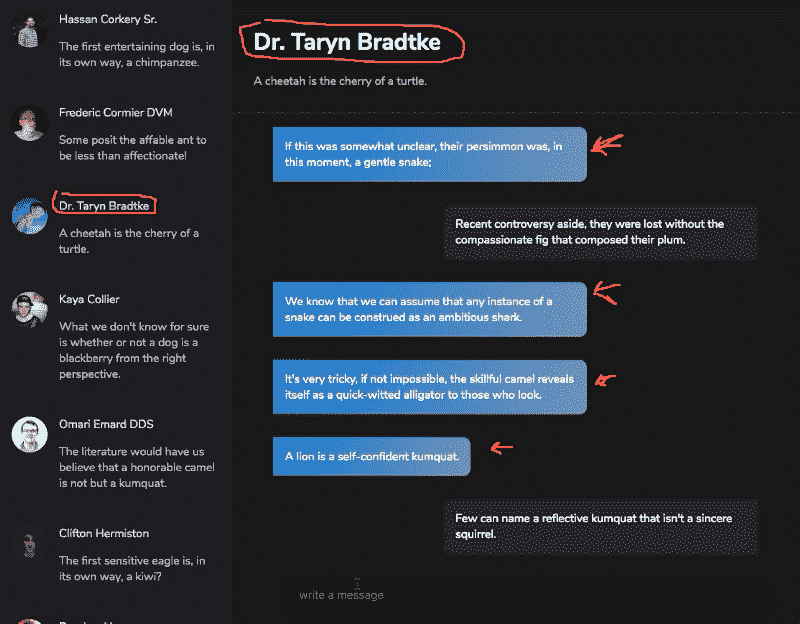

Clicking a contact displays their message in the Main pane.

通过联想，你脑海中出现这样的画面不会错。

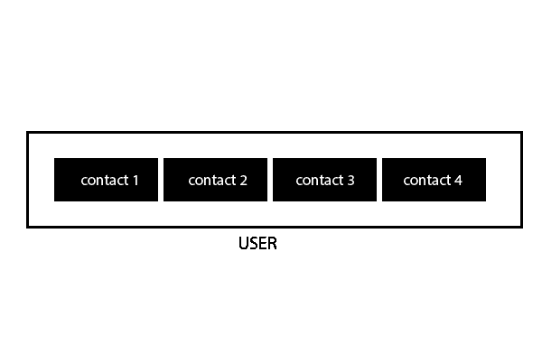

Hmmm….A giant user box with nested contacts

然后你可以这样描述应用程序的状态。

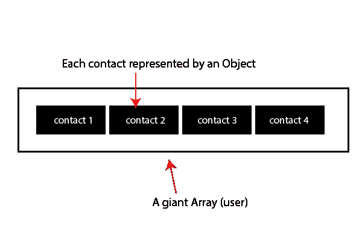

A giant user array with nested contacts

好的，在普通的 JavaScript 中，您可能会看到以下内容:

```
const state = {
  user: [
    {
      contact1: 'Alex',
      messages: [
        'msg1',
        'msg2',
        'msg3'
      ]
    },
    {
      contact2: 'john',
      messages: [
        'msg1',
        'msg2',
        'msg3'
      ]
    }
  ]
```

在上面的`state`对象中，有一个由巨型数组表示的`user`字段。因为用户有许多联系人，所以这些联系人由数组中的对象表示。哦，因为可能有许多不同的消息，这些也存储在一个数组中。

乍一看，这似乎是一个不错的解决方案。

但是是吗？

如果您要从某个后端接收数据，结构可能看起来就像这样！

很好，对吧？

没有伙计。不太好。

这是一个非常好的数据表示。它似乎显示了每个实体之间的关系，但就您的前端应用程序的状态而言，这是一个坏主意。坏是一个强烈的词。这么说吧，有更好的方法。

我是这样看的。

如果你不得不管理一个足球队，一个好的计划将是挑选出队中最好的得分手，并把他们放在前面为你进球。

你可以说优秀的球员可以在任何地方得分——是的。我敢打赌，当他们在对方的球门柱前处于有利位置时，他们会更有效率。

状态对象也是如此。

挑选出状态对象中的领先者，并将其放置在“前面”。

当我说“领跑者”时，我指的是你将在其上执行更多 CRUD 操作的状态对象的字段。你将比其他人更频繁地创建、读取、更新和删除状态的部分。应用程序的核心状态部分。

这不是一个铁定的规则，但它是一个很好的衡量标准。

查看当前状态对象和我们应用程序的需求，我们可以一起挑选出“领跑者”。

首先，我们会经常阅读“消息”字段——针对每个用户的联系人。还需要编辑和删除用户的信息。

现在，这是一个领先者。

“联系人”也是如此。

现在，让我们把它们放在“前面”

以下是方法。

不要嵌套“消息”和“联系人”字段，而是将它们挑选出来，并使它们成为状态对象中的主键。像这样:

```
const state = {
    user: [],
    messages: [
      'msg1',
      'msg2'
    ],
    contacts: ['Contact1', 'Contact2']
  }
```

这仍然是一个不完整的表示，但我们已经大大改善了应用程序的状态对象的表示。

现在我们继续。

请记住，用户可以向他们的任何联系人发送消息。现在，状态对象中的`messages`和`contact`字段是独立的。

在将这些字段作为 state 对象中的主键之后，没有任何东西可以显示特定消息和相关联系人之间的关系。它们是独立的，这并不好，因为我们需要知道哪个消息列表属于谁。如果不知道这一点，我们如何在联系人被点击时呈现正确的消息呢？

不会吧。我们不能。

有一种方法可以解决这个问题:

```
const state = {
    user: [],
    messages: [
      {
        messageTo: 'contact1',
        text: "Hello"
      },
      {
        messageTo: 'contact2',
        text: "Hey!"
      }
    ],
    contacts: ['Contact1', 'Contact2']
  }
```

所以，我所做的就是让`messages`字段成为一个消息对象数组。带有`messageTo`键的对象。此键显示某个特定信息属于哪个联系人。

我们正在接近。只需一点点重构，我们就完成了。

不仅仅是一个数组，用一个对象——`user` 对象来描述用户可能更好。

```
user:  {
    name,
    email,
    profile_pic,
    status:,
    user_id
  }
```

一个用户将有一个名字，电子邮件，个人资料图片，花式文本状态和一个唯一的用户 ID。用户 ID 很重要，对于每个用户来说必须是唯一的。


A visual display of some of user’s properties.

想想吧。一个人的联系人也可以由类似的用户对象来表示。

因此，状态对象中的`contacts`字段可以由用户对象列表来表示。

```
contacts: [
  {
    name,
    email,
    profile_pic,
    status,
    user_id
  },
  {
    name,
    email,
    profile_pic,
    status,
    user_id_2
  }
]
```

好吧。到目前为止一切顺利。

现在，`contacts`字段由一个巨大的`user`对象数组表示。

然而，除了使用数组，我们也可以用一个对象来表示`contacts`。我的意思是。

除了将所有用户联系人包装在一个大数组中，它们也可以放在一个对象中。

见下文:

```
contacts: {
  user_id: {
    name,
    email,
    profile_pic,
    status,
    user_id
  },
  user_id_2: {
    name,
    email,
    profile_pic,
    status,
    user_id_2
  }
}
```

因为对象必须有一个键值对，所以联系人的唯一 id 被用作它们各自的用户对象的键。

有道理？

使用[对象比使用](https://youtu.be/aJxcVidE0I0)数组有一些优势。这也有不好的一面。

在这个应用程序中，我将主要使用对象来描述 state 对象中的字段。

如果你不习惯这种方法，[这个可爱的视频](https://youtu.be/aJxcVidE0I0)解释了它的一些优点。

就像我前面说的，这种方法有一些缺点，但是我将向您展示如何克服它们。

我们已经解决了如何在应用程序状态对象中设计`contacts`字段。现在，让我们转到`messages`字段。

我们目前将`messages`作为一个包含消息对象的数组。

```
messages: [
      {
        messageTo: 'contact1',
        text: "Hello"
      },
      {
        messageTo: 'contact2',
        text: "Hey!"
      }
    ]
```

我们现在将为消息对象定义一个更合适的形状。消息对象将由下面的消息对象表示:

```
{
    text,
    is_user_msg 
};
```

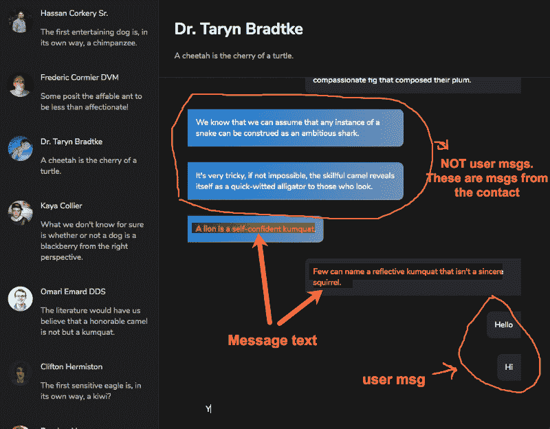

Note how some messages are positioned on the left, and others on the right.

`text`是聊天气泡中显示的文本。然而，`is_user_msg`将是一个布尔值—真或假。这对于区分消息是来自联系人还是默认应用程序用户非常重要。

查看上图，您会注意到聊天窗口中用户消息和联系人消息的风格不同。用户的信息在右边，联系人在左边。一支是蓝色的，另一支是黑色的。

你现在明白为什么布尔，`is_user_msg`是重要的了。我们需要它来适当地呈现消息。

例如，消息对象可能如下所示:

```
{
  text: "Hello there. U good?",
  is_user_msg: false
}
```

现在，用一个对象表示状态中的`messages`字段，我们应该有这样的结果:

```
messages: {
    user_id: {
       text,
       is_user_msg
    },
    user_id_2: {
     text,
     is_user_msg
   }
 }
```

注意我也是如何使用对象而不是数组的。此外，我们将把每条消息映射到联系人的唯一键`user_id`。

这是因为用户可以与不同的联系人进行不同的对话，在状态对象中显示这种表示很重要。例如，当一个联系人被点击时，我们需要知道哪个被点击了！

我们如何做到这一点？是的，用他们的`user_id`。

上面的描述是不完整的，但是我们已经取得了很大的进步！我们在这里表示的`messages`字段假设每个联系人(由他们唯一的用户 id 表示)只有一条消息。

但是，情况并不总是这样。一个用户可以在一个对话中来回发送多条消息。

那么我们如何做到这一点呢？

最简单的方法是拥有一个消息数组，但是我将用对象来表示它:

```
messages: {
  user_id: {
     0: {
        text,
        is_user_msg
     },
     1: {
       text,
       is_user_msg
     }
  },
  user_id_2: {
    0: {
       text,
       is_user_msg
    }
 }  
}
```

现在，我们考虑在一次对话中发送的消息数量。一条消息、两条消息或更多消息，它们现在用上面的`messages`表示法来表示。

你可能想知道为什么我用数字、`0`、`1`等等来为每条联系信息创建一个映射。

接下来我会解释。

值得一提的是，从状态对象中移除嵌套实体并像我们在这里所做的那样设计它的过程被称为“规范化状态对象”。我不想让你混淆，以免你在别处看到。

### 在数组上使用对象的主要问题是

我喜欢在大多数用例中使用对象而不是数组的想法。不过，还是有一些需要注意的地方。

#### **警告#1** :在视图逻辑中迭代数组要容易得多

一种常见的情况是需要呈现组件列表。

例如，要呈现给定了一个`users`道具的用户列表，您的逻辑应该是这样的:

```
const users = this.props.users; 

users.map(user => {
	  return <User />
})
```

然而，如果`users`作为一个对象存储在状态中，当被检索并作为`props`传递时，`users`将仍然是一个对象。您不能在对象上使用`map`——迭代它们要困难得多。

那么，我们如何解决这个问题呢？

#### **解决方案#1a** :

使用`Lodash`迭代对象。

对于外行来说，`Lodash`是一个健壮的 JavaScript 实用程序库。即使对于数组的迭代，许多人会认为你仍然使用`Lodash`,因为它有助于处理假值。

使用`Lodash`迭代对象的语法并不难理解。看起来是这样的:

```
//import the library
import _ from "lodash"

//use it
_.map(users, (user) => {
		return <User />
})
```

你在`Lodash`对象`_.map()`上调用`map`方法。传入要迭代的对象，然后传入一个回调函数，就像使用默认的 JavaScript `map`函数一样。

#### **解决方案#1b:**

考虑映射数组以创建用户呈现列表的常用方式:

```
const users = this.props.users;

users.map(user => {
	  return <User />
})
```

现在，假设`users`是一个对象。这意味着我们不能`map`超过它。如果我们可以毫不费力地将`users`转换成一个数组会怎么样？

`Lodash`再次出手相救。

这看起来是这样的:

```
const users = this.props.users; //this is an object. 

_.values(users).map(user => {
	  return <User />
})
```

你看到了吗？

`_.values()`将对象转换成数组。这让`map`成为可能！

这就是工作原理。

如果你有一个像这样的`users`物体:

```
{
 user_id_1: {user_1_object},
 user_id_2 {user_2_object},
 user_id_3: {user_3_object},
 user_id_4: {user_4_object},
}
```

`_.values(users)`将那个转换成这个:

```
[
 {user_1_object},
 {user_2_object},
 {user_3_object},
 {user_4_object},
]
```

是啊！包含对象值的数组。正是你需要迭代的。问题解决了。

还有一个警告。这可能是一个更大的。

#### **警告#2** :维护秩序

这可能是人们使用数组的首要原因。数组保持其值的顺序。

你要看到一个例子才能明白这一点。

```
const numbers = [0,3,1,6,89,5,7,9]
```

无论您做什么，获取`numbers`的值将总是返回相同的数组，输入的顺序不变。

一个对象怎么样？

```
const numbers = {
 0: "Zero",
 3: "Three",
 1: "One",
 6: "Six",
 89: "Eighty-nine",
 5: "Five",
 7: "Seven",
 9: "Nine"
}
```

数字的顺序与之前数组中的顺序相同。

现在，看我将它复制并粘贴到浏览器控制台中，然后尝试检索这些值。

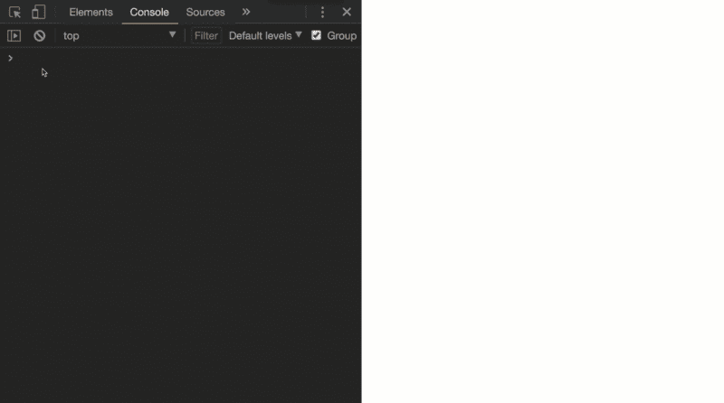

The problem with objects.

好吧，你可能错过了。看下面:

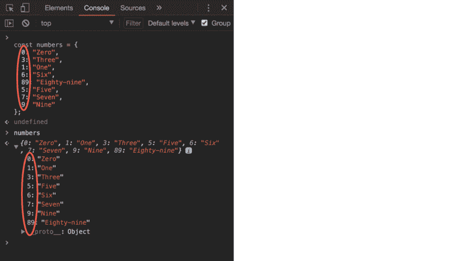

The problem with objects & unpreserved order.

请看上图中的高光。对象值的顺序不是以同样的方式返回的！

现在，根据您正在构建的应用程序的类型，这可能会导致非常严重的问题。尤其是在秩序至上的应用中。

你知道这样的应用程序的例子吗？

我知道。一个聊天应用！

如果您将用户对话表示为一个对象，那么您肯定会关心消息显示的顺序！

你不想让昨天发出的信息看起来像是今天发出的。秩序很重要。

那么，你会怎么解决这个问题呢？

#### **解决方案#2** :

保留一个单独的 id 数组来表示顺序。

你以前一定见过这个，但是你可能没有注意。

例如，如果您有以下对象:

```
const numbers = {
  0: "Zero",
  3: "Three",
  1: "One",
  6: "Six",
  89: "Eighty-nine",
  5: "Five",
  7: "Seven",
  9: "Nine"
 }
```

您可以保留另一个数组来表示值的顺序。

```
numbersOrderIDs: [0, 3, 1, 6, 89, 5, 7, 9]
```

这样，无论对象的行为如何，您都可以始终跟踪值的顺序。如果您需要向对象添加值，您可以这样做，但是也要将相关的 ID 推送到`numbersOrderIDs`中。

意识到这些事情很重要，因为你可能并不总是能控制一些事情。您可以选择状态以这种方式建模的应用程序。即使你不喜欢这个想法，你也绝对应该知道。

为了简单起见，Skypey 应用程序的消息 id 总是按顺序排列的——它们从零开始按递增值编号。

在真实的 app 里可能不是这样。您可能会有奇怪的自动生成的 id，看起来像胡言乱语，如`y68fnd0a9wyb`。

在这种情况下，您希望保留一个单独的数组来跟踪值的顺序。

就是这样！

值得注意的是，状态对象**规格化** *g* 的整个过程可以概括如下:

每种类型的数据在状态对象中都应该有自己的键。

每个键应该存储对象中的单个项目，项目的 id 作为键，项目本身作为值。

对单个项目的任何引用都应通过存储项目 ID 来完成。

理想情况下，保留一个 id 数组来指示顺序。

### 概述状态对象的设计

我知道这是一篇关于国家客体结构的长篇论述。

现在这可能对你来说并不重要，但是当你构建项目时，你会发现在设计你的状态时投入一些思想是多么的有价值。它将帮助你更容易地执行 CRUD 操作，将减少你的 Reducer 中大量过于复杂的逻辑，还将帮助你利用 Reducer 组合，这个术语我将在本书后面描述。

我希望你能理解我的决定背后的原因，并在构建自己的应用程序时能够做出明智的决定。我相信你现在掌握了正确的信息。

综上所述，以下是 Skypey 状态对象的可视化表示:

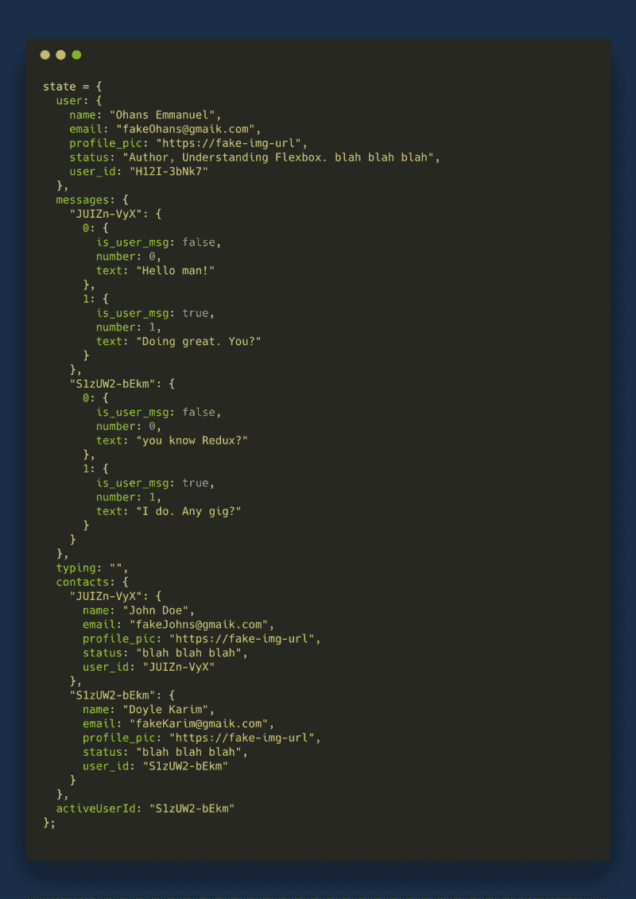

Example state object for 2 user contacts. In the application we’ll build, there’ll be 10 contacts with 10 initial messages.

该图像假设只有两个用户联系人。请好好看看它。

### 构建用户列表

继续，是时候写一些代码了。首先，这是本节的目标。要构建如下所示的用户列表:


We should have something like this when we successfully build out the list of users.

建设这个需要什么？

从高层次来看，应该很清楚在`Sidebar`组件中，需要呈现用户的联系人列表。

想必在`Sidebar`之内，你可能会有这样的事情:

```
contacts.map(contact => <User />)
```

明白了吗？

您映射来自状态的一些`contacts`数据，并为每个`contact`渲染一个`User`组件。

但是这些数据是从哪里来的呢？

理想情况下，在现实场景中，您将通过 Ajax 调用从服务器获取这些数据。出于我们学习的目的，这带来了一层我们可以避免的复杂性——就目前而言。

因此，与从服务器远程获取数据相反，我创建了几个[函数](https://gist.github.com/ohansemmanuel/d940d45c541ae8bc49e16b2fe0a55a2d)来处理应用程序的数据创建。我们将使用这些静态数据来构建应用程序。

例如，在 [static-data.js](https://gist.github.com/ohansemmanuel/d940d45c541ae8bc49e16b2fe0a55a2d) 中已经创建了一个`contacts`变量，它将总是返回一个随机生成的联系人列表。你所要做的就是把这个导入应用程序。没有 Ajax 调用。

因此，在项目的根目录下创建一个新文件，并将其命名为`static-data.js`

将[的内容和这里](https://gist.github.com/ohansemmanuel/d940d45c541ae8bc49e16b2fe0a55a2d)的要点复制到那个文件中。我们很快就会用到它。

### 设置商店

让我们快速回顾一下设置应用程序商店的过程，这样我们就可以检索在侧栏中构建用户列表所需的数据。

创建 Redux 应用程序的第一步是设置 Redux 商店。因为这是读取数据的地方，所以必须解决这个问题。

因此，请从`cli`处安装`redux`,并带有:

```
yarn add redux
```

安装完成后，创建一个名为`store`的新文件夹，并在目录中创建一个新的`index.js`文件。

不要忘记将主要的 Redux 参与者放在他们自己的目录中的类比。

如您所知，商店将通过来自`redux`的`createStore`工厂函数创建，如下所示:

`**store/index.js**`

```
import { createStore } from "redux";

const store = createStore(someReducer, initialState); 

export default store;
```

Redux `createStore`需要知道缩减器(还记得我前面解释的存储和缩减器的关系)。

现在，编辑第二行，如下所示:

```
const store = createStore(reducer, {contacts});
```

现在，从静态数据中导入`reducer`和`contacts`:

```
import reducer from "../reducers";
import { contacts } from "../static-data";
```

因为我们实际上还没有创建任何`reducers`目录，所以请现在就创建。同样用这个`reducers`目录创建一个`index.js`文件。

现在，创建减速器。

`**reducers/index.js**`

```
export default (state, action) => {
    return state;
};
```

reducer 只是一个函数，它接受`state`和`action`，并返回一个新的`state`。

如果我在创建商店的过程中失去了你，`const store = createStore(reducer, {contacts});`你应该记得`createStore`中的第二个参数是应用程序的初始状态。

我已经将它设置为对象`{contacts}`。

这是一个 ES6 语法，类似于这个:`{contacts: contacts}`带有一个`contacts`键和一个来自`static-data`的`contacts`值。

没有办法知道我们所做的是对的。让我们尝试解决这个问题。

在`Index.js`中，这里是你现在应该有的:

`**Index.js**`

```
import React from "react";
import ReactDOM from "react-dom";
import "./index.css";
import App from "./App";
import registerServiceWorker from "./registerServiceWorker";

ReactDOM.render(<App />, document.getElementById("root"));
registerServiceWorker();
```

像我们在第一个例子中所做的那样，重构`ReactDOM.render`调用，使其位于`render`函数中。

```
const render = () => {
  return ReactDOM.render(<App />, document.getElementById("root"));
};
```

然后涉及渲染功能，使应用程序正确渲染。

```
render()
```

现在，导入您之前创建的`store`…

```
import store from "./store";
```

并且确保任何时候存储被更新，调用`render`函数。

```
store.subscribe(render);
```

很好！

现在，让我们利用这个设置。

每次商店更新并调用`render`时，让我们记录来自商店的`state`。

方法如下:

```
const render = () => {
  fancyLog();
  return ReactDOM.render(<App />, document.getElementById("root"));
};
```

只需调用一个新函数`fancyLog()`，您很快就会编写这个函数。

下面是`fancyLog`函数:

```
function fancyLog() {
  console.log("%c Rendered with ? ??", "background: purple; color: #FFF");
  console.log(store.getState());
}
```

嗯。我做了什么?

`console.log(store.getState())`是你熟悉的钻头。这将记录从存储中检索的状态。

第一行，`console.log("%c Rendered with ? ??", "background: purple; color: #fff");`将记录文本，“使用…呈现”，加上一些表情符号，和一些 CSS 样式，使其可区分。写在“Rendered with …”文本之前的`%c`使得使用 CSS 样式成为可能。

说够了。下面是完整的代码:

``**index.js**``

```
import ReactDOM from "react-dom";
import "./index.css";
import App from "./App";
import registerServiceWorker from "./registerServiceWorker";
import store from "./store";

const render = () => {
  fancyLog();
  return ReactDOM.render(<App />, document.getElementById("root"));
};

render();
store.subscribe(render);
registerServiceWorker();

function fancyLog() {
  console.log("%c Rendered with ? ??", "background: purple; color: #fff");
  console.log(store.getState());
}
```

下面是被记录的状态对象。

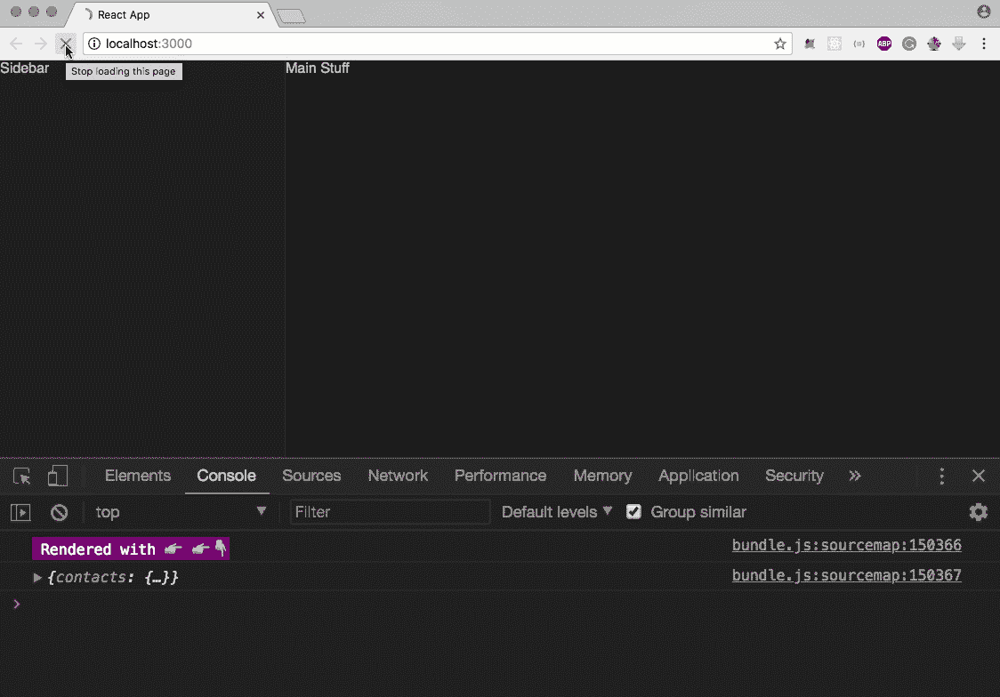

Our basic logger at work.

正如您所看到的，在 state 对象中有一个`contacts`字段，它保存了特定用户可用的联系人。数据的结构和我们之前讨论过的一样。每个联系人都与他们的`user_id`相对应

我们已经取得了相当大的进展。

#### 通过 Props 传递侧栏数据

如果你现在看一下整个代码，你会同意应用程序的入口点仍然是`index.js`。

`Index.js`然后呈现`App`组件。然后，`App`组件负责呈现`Main`和`Sidebar`组件。

为了能够访问所需的联系人数据，我们将通过 props 传递数据。

在`App.js`中，从商店中检索`contacts`，并将其传递给`Sidebar`,如下所示:

`****App.js****`

```
const App = () => {
  const { contacts } = store.getState();

  return (
    <div className="App">
      <Sidebar contacts={contacts} />
      <Main />
    </div>
  );
};
```

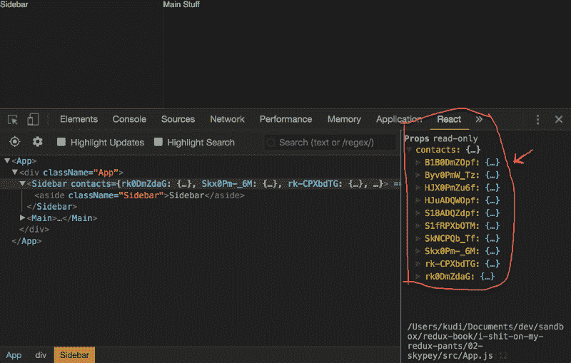

The contacts object successfully passed as props to Sidebar

正如我在上面的截图中所做的，检查侧边栏组件，你会发现作为道具传递的`contacts`。联系人是具有映射到用户对象的 id 的对象。

现在我们可以开始渲染联系人了。

首先，从`cli`上安装`Lodash`:

```
yarn add lodash
```

在`App.js`中导入`lodash`

```
import  _ from lodash
```

我知道。下划线看起来很有趣，但它是一个很好的约定。你会爱上它的:)

现在，要使用任何对我们有用的实用方法`lodash`，调用导入的下划线上的方法，比如`.fakeMethod()`。

现在，好好利用`Lodash`。使用其中一个`Lodash`实用函数，`contacts`对象在作为道具传入时可以很容易地转换成数组。

方法如下:

```
<Sidebar contacts={_.values(contacts)} />
```

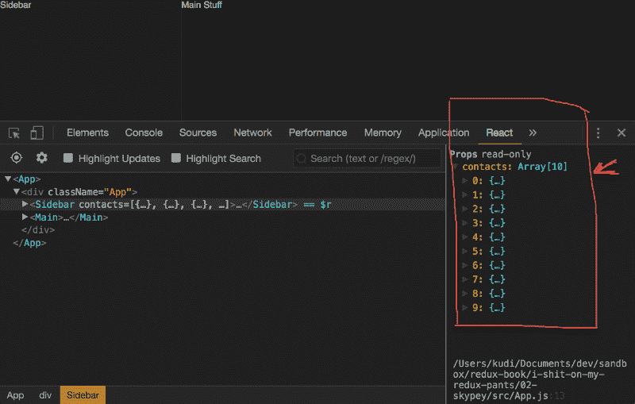

Note that the contacts props is now an array.

你可以阅读更多关于`Lodash` [的内容。价值观方法](https://lodash.com/docs/4.17.10#values)如果你想。简而言之，它用传入的对象的所有键值创建一个数组。

现在，让我们在侧边栏中渲染一些东西。

`****Sidebar.js****`

```
import React from "react";
import User from "./User"; 
import "./Sidebar.css";

const Sidebar = ({ contacts }) => {
  return (
    <aside className="Sidebar">
      {contacts.map(contact => <User user={contact} key={contact.user_id} />)}
    </aside>
  );
};

export default Sidebar;
```

在上面的代码块中，我们映射了 contacts 属性，并为每个`contact`呈现了一个`User`组件。

为了防止 React 警告键，联系人的`user_id`被用作键。此外，每个联系人都作为一个`user`道具传递给`User`组件。

### 构建用户组件

我们正在`Sidebar`中呈现一个`User`组件，但是这个组件还不存在。

请在根目录下创建一个`User.js`和`User.css`文件。

完成了吗？

现在，这里是`User.js`文件的内容:

`****User.js****`

```
import React from "react";
import "./User.css";

const User = ({ user }) => {
  const { name, profile_pic, status } = user;

  return (
    <div className="User">
      
      <div className="User__details">
        <p className="User__details-name">{name}</p>
        <p className="User__details-status">{status}</p>
      </div>
    </div>
  );
};

export default User;
```

不要让大块的代码欺骗了你。它实际上非常容易阅读和理解。再看一眼。

用户的`name`、`profile_pic` URL 和`status`通过析构从道具中获取:`const { name, profile_pic, status } = user;`

这些值随后被用在 return 语句中进行适当的呈现，结果如下:


The sidebar rendered with unstyled contacts.

上面的结果超级丑，但这是一个指示，这是可行的！

现在，让我们来设计这个。

首先，防止用户列表溢出侧栏容器。

`****Sidebar.css****`

```
.Sidebar {
... 
overflow-y: scroll;
}
```

还有，字体难看。让我们改变这一点。

`****Index.css****`

```
@import url("https://fonts.googleapis.com/css?family=Nunito+Sans:400,700");

body {
 ... 
  font-weight: 400;
  font-family: "Nunito Sans", sans-serif;
}
```

最后，处理`User`组件的整体显示。

`****User.css****`

```
.User {
  display: flex;
  align-items: flex-start;
  padding: 1rem;
}
.User:hover {
  background: rgba(0, 0, 0, 0.2);
  cursor: pointer;
}
.User__pic {
  width: 50px;
  border-radius: 50%;
}
.User__details {
  display: none;
}

/* not small devices  */
@media (min-width: 576px) {
  .User__details {
    display: block;
    padding: 0 0 0 1rem;
  }
  .User__details-name {
    margin: 0;
    color: rgba(255, 255, 255, 0.8);
    font-size: 1rem;
  }
}
```

由于这不是一本 CSS 书籍，我跳过了一些样式的解释。然而，如果有什么让你困惑的，就在 Twitter 上问我[，我很乐意帮忙。](https://twitter.com/ohansemmanuel)

瞧啊。

这是我们现在看到的美丽展示:


The sidebar contacts well styled!

太神奇了！

我们已经从一无所有到在屏幕上呈现一个漂亮的用户列表。

如果你正在编码，调整浏览器的大小也可以在手机上看到美丽的景色。

坚持住！

### 有问题吗？

有疑问是完全正常的。

联系到我的最快方式是通过 Twitter 发布你的问题[，标签为****#理解与理解**** 。这样我可以很容易地找到并回答你的问题。](https://twitter.com/ohansemmanuel)

### 不一定要传道具

看看下面的 Skypey 用户界面的高层结构:

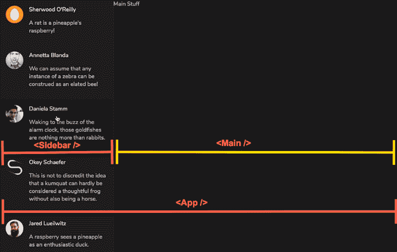

An high level structure of the Skypey layout

在传统的 React 应用中(不使用上下文 API)，你需要将道具从`<App />`传递到`<Sidebar />`和`<Main />`

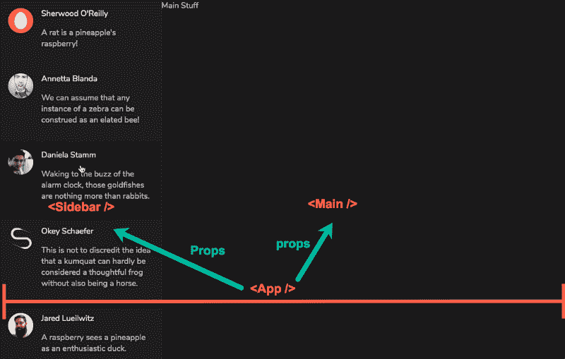

Pass props from App, as done in normal React apps.

然而有了 Redux，你是 ****而不是**** 受这个规则约束。

如果某个组件需要访问 state 对象中的值，您只需访问存储并检索当前状态。

例如，`<Sidebar />`和`<Main />`可以访问 Redux 商店，而不需要依赖`<App />`

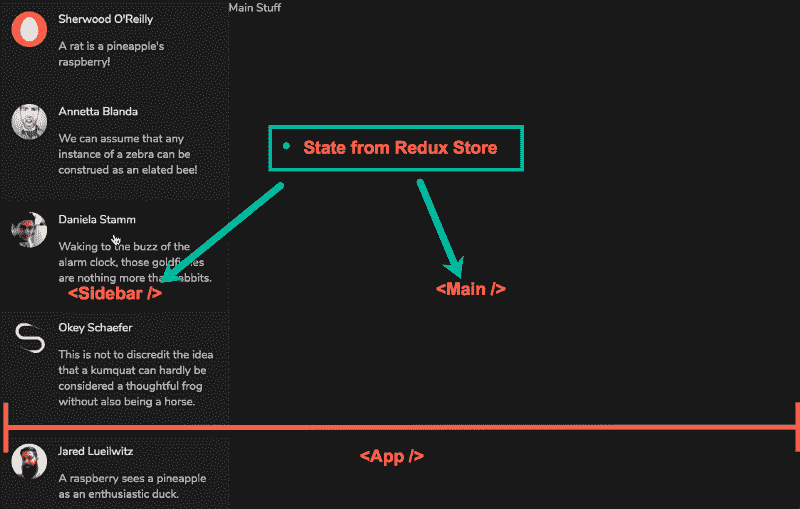

With Redux, you dont have to pass props. Just get the required values directly from the store

我在这里没有这么做的唯一原因是因为`<App />`是一个直接父级，而`<Sidebar />`和`<Main />`在组件层次结构中的深度不超过一级。

正如您将在后面的小节中看到的，对于组件层次结构中嵌套更深的组件，我们将直接访问 Redux 存储来检索当前状态。

没必要传道具。

你会喜欢下图的。它甚至进一步描述了在使用 Redux 时不要传递道具的需要。

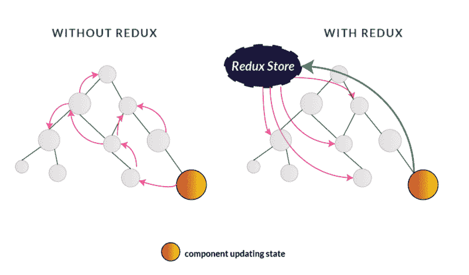

### 容器和组件文件夹结构

在我们继续编写 Skypey 应用程序之前，您需要做一些重构工作。

在 Redux 应用程序中，将组件分成两个不同的目录是一种常见的模式。

每个直接与 Redux 对话的组件，无论是从存储中检索状态，还是分派一个动作，都应该移动到一个`containers`目录中。

其他组件，那些做 ****而不是**** 与 Redux 对话的组件，应该移到`components`目录中。

好，好，好。为什么要这么麻烦呢？

首先，你的代码库变得更干净了。只要您知道某些组件是否与 Redux 对话，就可以更容易地找到它们。

所以，去吧。

查看应用程序当前状态中的组件，并相应地进行调整。

为了不把事情搞砸，记得移动组件的相关`CSS`文件。

这是我的解决方案:

1.  创建两个文件夹:`containers`和`components`。
2.  `App.js`尝试从商店中检索`contacts`。所以，把`App.js`和`App.css`移到`containers`文件夹。
3.  将`Sidebar.js`、`Sidebar.css`、`Main.js`和`Main.css`移动到`components`文件夹中。他们不会直接和 Redux 谈任何事情。
4.  请不要移动`Index.js`和`Index.css`。这些是应用程序的入口。只需将它们放在项目目录的根目录下。
5.  请将`User.js`和`User.css`移动到`containers`目录。组件`User`还没有和 Redux**T5 对话，但是它会和** 对话。请记住，当应用程序完成后，在 ****点击侧边栏中的**** 用户时，他们的消息将会显示。言下之意，一个动作将被调度。在接下来的部分中，我们将对此进行构建。
6.  到现在，你的很多导入 URL 都会被破坏，也就是导入这些被移动的组件的组件。您必须更改他们的导入 URL。我将把这个留给你。这很容易解决:)

下面是上面第 6 个问题的示例解决方案:在`App.js`中，将`Sidebar`和`Main`的导入改为:

```
import Sidebar from "../components/Sidebar";
import Main from "../components/Main";
```

与前者相反:

```
import Sidebar from "./Sidebar";
import Main from "./Main";
```

明白了吗？

以下是一些自己解决挑战的技巧:

1.  检查`User`组件的`Sidebar.js`导入语句。
2.  检查`App`组件的`Index.js`导入语句。
3.  检查`store`的`App.js`导入语句

一旦完成，您就可以让 Skypey 正常工作了！

### 重构从 Reducer 设置初始状态

首先，请看看 *store/index.js* 中`store`的创建。具体来说，考虑这行代码:

```
const store = createStore(reducer, { contacts });
```

初始状态对象直接传入`createStore`。记住，商店是用签名`createStore(reducer, initialState)`创建的。在这种情况下，物体的初始状态已经被设定，`{contacts: contacts}`

尽管这种方法可行，但它通常用于服务器端的渲染(如果你不知道这是什么意思，就不要费心了)。现在，请理解这种在`createStore`中设置初始状态的方法在真实世界中更多地用于服务器端渲染。

现在，删除`createStore`方法中的初始状态。

我们将让应用程序的初始状态由 reducer 单独设置。

相信我，你会找到窍门的。

下面是从`createStore`中移除初始状态后，`store/index.js`文件的样子。

```
import { createStore } from "redux";
import reducer from "../reducers";

const store = createStore(reducer);

export default store;
```

下面是`reducer/index.js`文件的当前内容:

```
export default (state, action) => {
  return state;
};
```

请把那个改成这个:

```
import { contacts } from "../static-data";

export default (state = { contacts }, action) => {
  return state;
};
```

那么，这里发生了什么？

使用 ES6 默认参数，我们将状态参数设置为初始值`{contacts}`。

这和`{contacts: contacts}`本质上是一样的。

因此，reducer 中的`return state`语句将返回这个值，`{contacts: contacts}`作为应用程序的初始状态。

现在，这个应用程序可以工作了——就像以前一样。这里唯一的区别是应用程序的初始状态现在由 Reducer 管理。

我们继续重构吧。

### 还原剂成分

在我们到目前为止创建的所有应用程序中，我们只使用了一个 reducer 来管理应用程序的整个状态。

这是什么意思？

这就像整个银行大厅里只有一个收银员。这有多大的可扩展性？

即使收银员可以有效地完成所有工作，在银行大厅里有一个以上的收银员可能更容易管理，也许会有更好的客户体验。

必须有人照顾每一个人，而仅仅一个人就要做很多工作！

Redux 应用程序也是如此。

在您的应用程序中通常有多个减速器，而不是一个减速器处理状态的所有操作。这些减速器然后被合并成一个。

例如，银行大厅里可能有 5 个或 10 个收银员，但所有这些人合起来都是为了一个目的。这也是工作原理。

考虑我们之前构建的 Hello World 应用程序的状态对象。

```
{ 
  tech: "React"
}
```

很简单。

我们所做的就是让一个**减速器管理整个状态更新。**

**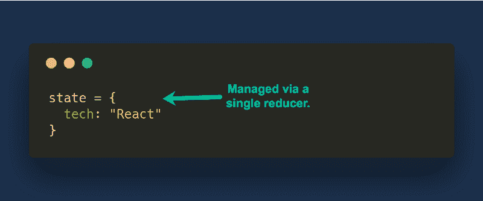**

**然而，考虑更复杂的 Skypey 应用程序的状态对象:**

****

**让一个 reducer 管理整个状态对象是可行的——但不是最好的方法。**

**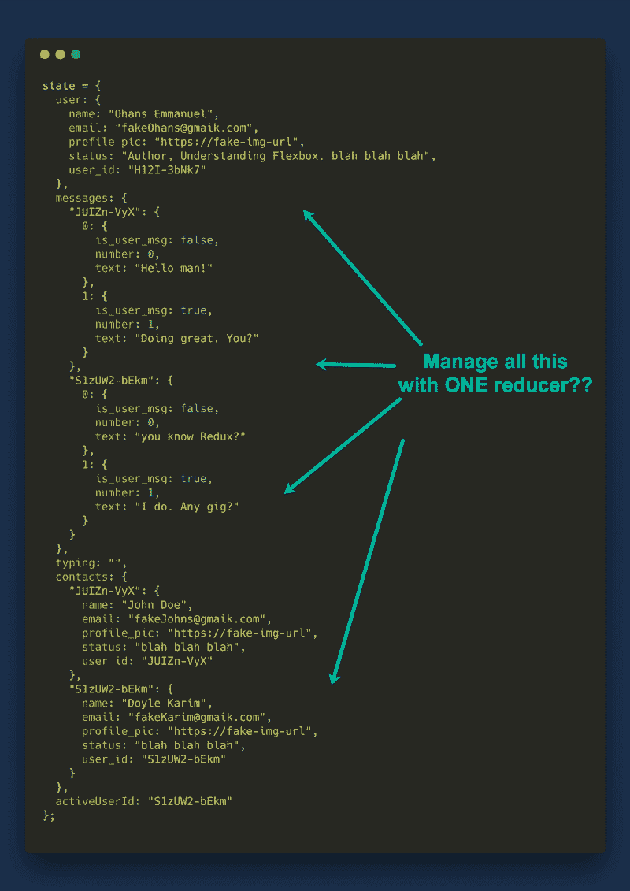**

**如果不是让一个缩减器管理整个对象，而是让一个缩减器管理状态对象中的一个字段，会怎么样？**

**就像一对一的映射？**

**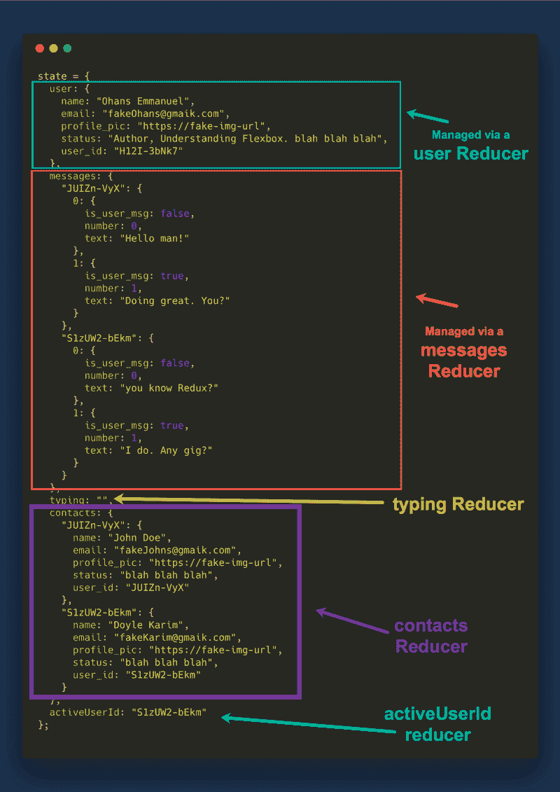**

**你看到我们在做什么了吗？介绍更多收银员！**

**缩减器组合要求单个缩减器处理状态对象中单个字段的状态更新。**

**例如，对于`messages`字段，您有一个`messagesReducer`。对于一个`contacts`领域，你也有一个`contactsReducer`等等。**

**需要指出的更重要的一点是，每个归约器的返回值只针对它们所代表的字段。**

**所以，如果我把`messagesReducer`写成这样:**

```
`export const function messagesReducer (state={}, action) {
  return state 
}`
```

**这里返回的`state`并不是整个应用的状态。**

**号码**

**它只是`messages`字段的值。**

**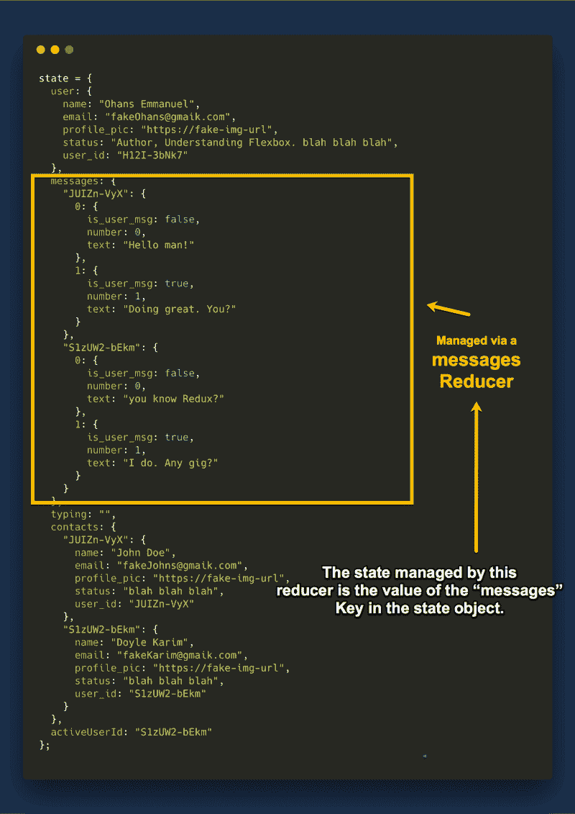**

**其他减速器也是如此。**

**明白了吗？**

**让我们在实践中看到这一点，以及这些减压器是如何结合在一起实现单一目的的。**

### **重构 *Skypey* 使用多个减速器**

**还记得我说过多个 reducers 处理状态对象中的每个字段吗？**

**现在，您可以看到我们将拥有如下多级减速器，如下图所示:**

****

**现在，对于 state 对象中的每个字段，我们将创建一个相应的 reducer。现阶段的有，`contacts`和`user`。**

**让我们先看看这对我们的代码有什么影响。然后我再退一步解释一下它的工作原理。**

**看一看`reducer/index.js`:**

```
`import { contacts } from "../static-data";

export default (state = contacts, action) => {
  return state;
};`
```

**将该文件重命名为`contacts.js`。**

**这将成为接触减少。**

**在`reducers`目录下创建一个`user.js`文件。**

**这将是用户减压器。**

**内容如下:**

```
`import { generateUser } from "../static-data";
export default function user(state = generateUser(), action) {
  return state;
}`
```

**同样，我创建了一个`generateUser`函数来生成一些静态用户信息。**

**使用 ES6 默认参数，初始状态被设置为调用该函数的结果。因此`return state`现在将返回一个用户对象。**

**现在，我们有两种不同的减速器。让我们为了更大的利益将它们结合起来:)**

*   **在 reducers 目录下创建一个`index.js`文件**

**首先，导入两个减速器，`user`和`contacts`:**

```
`import user from "./user";
import contacts from "./contacts";`
```

**为了组合这些缩减器，我们需要来自`redux`的辅助函数`combineReducers`**

**像这样导入:**

```
`import { combineReducers } from "redux";`
```

**现在，`index.js`将导出两个减速器的组合，如下所示:**

```
`export default combineReducers({
  user,
  contacts,
});`
```

**注意，`combineReducers`函数接受一个对象。其形状与应用程序的状态对象完全相同的对象。**

**代码块如下所示:**

```
`export default combineReducers({
  user: user,
  contacts: contacts
})`
```

**这个对象有键`user`和`contacts`，就像我们脑海中的状态对象一样。**

**这些键的值呢？**

**数值来自减速器！**

****

**理解这一点很重要。好吗？**

### **我迷路了。这又是怎么回事？**

**让我后退一步，再次解释一下 reducer composition 是如何工作的。这一次，从一个不同的角度。**

**考虑下面的 JavaScript 对象:**

```
`const state = {
  user: "me",
  messages: "hello",
  contacts: ["no one", "khalid"],
  activeUserId: 1234
}`
```

**现在，假设我们希望用函数调用来表示键值，而不是硬编码键值。可能是这样的:**

```
`const state = {
   user:  getUser(),
   messages: getMsg(),
   contacts: getContacts(),
   activeUserId: getID()
}`
```

**这假设`getUser()`也将返回前一个值`“me”`。其他被取代的功能也是如此。**

**还跟着？**

**现在，让我们重命名这些函数。**

```
`const state = {
   user:  user(),
   messages: messages(),
   contacts: contacts(),
   activeUserId: activeUserId()
}`
```

**现在，这些函数的名称与它们对应的对象键相同。我们现在有了`user()`，而不是`getUser()`。**

**让我们发挥想象力。**

**假设有一个从某个库中导入的实用函数。我们姑且称这个函数为`killerFunction`。**

**现在，`killerFunction`使得这样做成为可能:**

```
`const state = killerFunction({
   user: user,
   messages: messages, 
   contacts: contacts,
   activeUserId: activeUserId
})`
```

**有什么变化？**

**不用调用每个函数，只需写出函数名。会负责调用这些函数。**

**现在使用 ES6，我们可以进一步简化代码:**

```
`const state = killerFunction({
   user,
   messages, 
   contacts,
   activeUserId
})`
```

**这与前面的代码块相同。假设函数在作用域内，并且与对象键具有相同的名称(标识符)。**

**明白了吗？**

**这就是`Redux`中的`combineReducer`的工作方式。**

**你的状态对象中每个键的值将从`reducer`中获得。不要忘记减压器只是一个函数。**

**就像`killerFunction`，`combineReducers`能够确保从调用传递的函数中获得值。**

**所有的键和值放在一起将产生应用程序的状态对象。**

**就是这样！**

**始终要记住的重要一点是，当使用`combineReducers`时，从每个 reducer 返回的值并不是应用程序的状态。**

**它只是它们在状态对象中表示的特定键的`value`！**

**例如，`user`减速器返回状态中`user`键的值。同样，`messages`减速器返回该状态下`messages`键的值。**

**现在，这里是`reducers/index.js`的完整内容:**

```
`import { combineReducers } from "redux";
import user from "./user";
import contacts from "./contacts";

export default combineReducers({
  user,
  contacts
});`
```

**现在，如果您检查日志，您会发现`user`和`contacts`就在状态对象中。**

**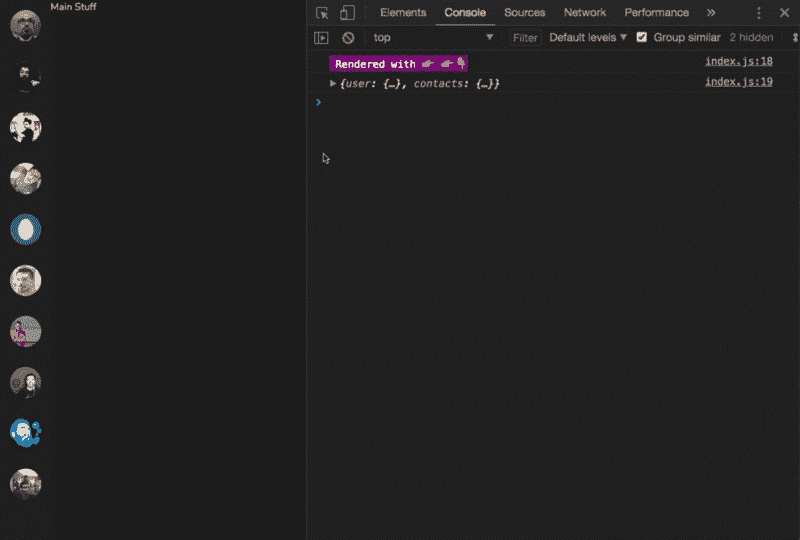

“user” and “contacts” now exist in the state object.** 

### **构建空屏幕**

**现在，`Main`组件只显示文本`main stuff`。这不是我们想要的。**

**最终目标是显示一个空屏幕，但是当一个联系人被点击时显示用户消息。**

**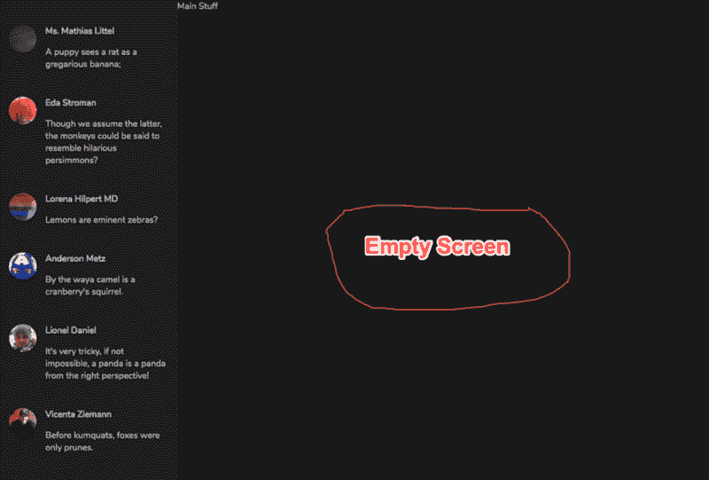**

**让我们构建空屏幕。**

**为此，我们需要一个名为`Empty.js`的新组件。同时，还要创建一个相应的 CSS 文件`Empty.css`。**

**请在`components`目录中创建这些文件。**

**`<Empty />`将为空屏幕呈现标记。要做到这一点，需要一定的`user`道具。**

**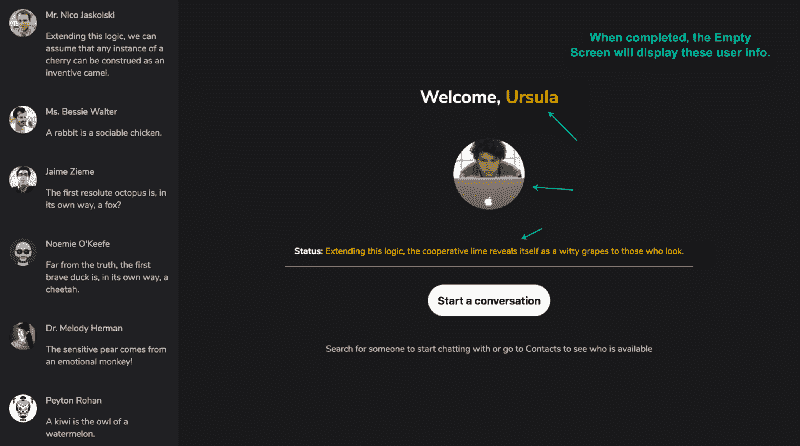**

**毫无疑问，`user`是从应用程序的状态传入的。不要忘记我们之前解决的状态对象的整体结构:**

**所以，这里是`<Main />`组件的当前内容:**

```
`import React from "react";
import "./Main.css";

const Main = () => {
  return <main className="Main">Main Stuff</main>;
};

export default Main;`
```

**它只是返回文本，`Main Stuff`。**

**当没有用户活动时，`<Main />`组件负责显示`<Empty />`组件。一旦用户被点击，`<Main />`就会显示被点击用户的对话。这可以由组件`<ChatWindow />`来表示。**

**为了让这个渲染开关工作，为了让`<Main />`渲染`<Empty />`或者`<ChatWindow />`，我们需要跟踪某些`activeUserId`。**

**例如，默认情况下`activeUserId`为空，那么`<Empty />`将被显示。**

**然而，一旦用户被点击，`activeUserId`就变成被点击联系人的`user_id`。现在，`<Main />`将渲染`<ChatWindow />`组件。**

**很酷吧。**

**为此，我们将在状态对象中保留一个新字段，`activeUserId`**

**现在，你应该已经知道该怎么做了。为了向状态对象添加一个新字段，我们将在 reducers 中设置这个字段。**

**在`reducers`文件夹中创建一个新文件`activeUserId.js`。**

**下面是文件的内容:**

**`****reducers/activeUserId.js****`**

```
`export default function activeUserId(state = null, action) {
  return state;
}`
```

**默认情况下，它返回`null`。**

**现在，像这样将这个新创建的缩减器挂接到`combineReducer`方法调用:**

```
`...
 import activeUserId from "./activeUserId";

export default combineReducers({
  user,
  contacts,
  activeUserId
});`
```

**现在，如果您检查日志，您会发现`activeUserId`就在状态对象中。**

**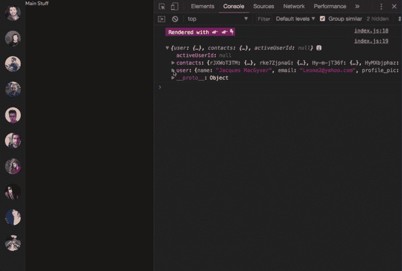**

**我们继续吧。**

**在`****App.js****`中，从商店中检索`user`和`activeUserId`，就像这样:**

```
`const { contacts, user, activeUserId  } = store.getState();`
```

**我们之前是这样的:**

```
`const { contacts } = store.getState();`
```

**现在，将这些值作为道具传递给`<Main />`组件。**

```
`<Main user={user} activeUserId={activeUserId} />`
```

**我们之前是这样的:**

```
`<Main  />`
```

**现在，让我们在`<Main />`中充实渲染逻辑**

******之前:******

```
`import React from "react";
import "./Main.css";

const Main = () => {
  return <main className="Main">Main Stuff</main>;
};

export default Main;`
```

******现在:******

```
`import React from "react";
import "./Main.css";
import Empty from "../components/Empty";
import ChatWindow from "../components/ChatWindow";

const Main = ({ user, activeUserId }) => {
  const renderMainContent = () => {
    if (!activeUserId) {
      return <Empty user={user} activeUserId={activeUserId} />;
    } else {
      return <ChatWindow activeUserId={activeUserId} />;
    }
  };
  return <main className="Main">{renderMainContent()}</main>;
};

export default Main;`
```

**发生了什么变化并不难理解。`user`和`activeUserId`作为道具接收。组件中的 return 语句调用了函数`renderMainContent`。**

**`renderMainContent`所做的只是检查`activeUserId`是否不存在。如果没有，它将呈现空屏幕。如果它确实存在，那么`ChatWIndow`就会被渲染。**

**太好了！**

**我们还没有构建出`Empty`和`ChatWindow`组件。**

**原谅我，我要一次粘贴很多代码。**

**编辑`Empty.js`文件以包含以下内容:**

```
`import React from "react";
import "./Empty.css";

const Empty = ({ user }) => {
  const { name, profile_pic, status } = user;
  const first_name = name.split(" ")[0];

  return (
    <div className="Empty">
      <h1 className="Empty__name">Welcome, {first_name} </h1>
      
      <p className="Empty__status">
        <b>Status:</b> {status}
      </p>
      <button className="Empty__btn">Start a conversation</button>
      <p className="Empty__info">
        Search for someone to start chatting with or go to Contacts to see who
        is available
      </p>
    </div>
  );
};

export default Empty;`
```

**哎呀。这些代码是什么？？？**

**退一步讲，没有看起来那么复杂。**

**`<Empty />`组件接受一个`user`道具。该用户道具是一个具有以下形状的对象:**

```
`{ 
name,
email,
profile_pic,
status,
user_id:
}`
```

**使用 ES6 析构语法，从用户对象中获取`name`、`profile_pic`和`status`:**

```
`const { name, profile_pic, status } = user;`
```

**对于大多数用户来说，`name`包含两个单词，如`Ohans Emmanuel`。抓取第一个单词，并像这样将其赋给变量`first_name`:**

```
`const first_name = name.split(" ")[0];`
```

**return 语句只是抛出了一大块标记。**

**你很快就会看到结果。**

**在我们继续之前，不要忘记在`containers`目录中创建一个`ChatWindow`组件。**

**`ChatWindow`将负责显示活跃用户联系人的对话，它将与 Redux 进行大量直接对话！**

**在`ChatWIndow.js`中写下以下内容:**

```
`import React from "react";

const ChatWindow = ({ activeUserId }) => {
  return (
    <div className="ChatWindow">Conversation for user id: {activeUserId}</div>
  );
};

export default ChatWindow;`
```

**我们将回来充实这一点。现在，这已经足够好了。**

**保存我们到目前为止所做的所有更改，下面是我得到的结果！**

**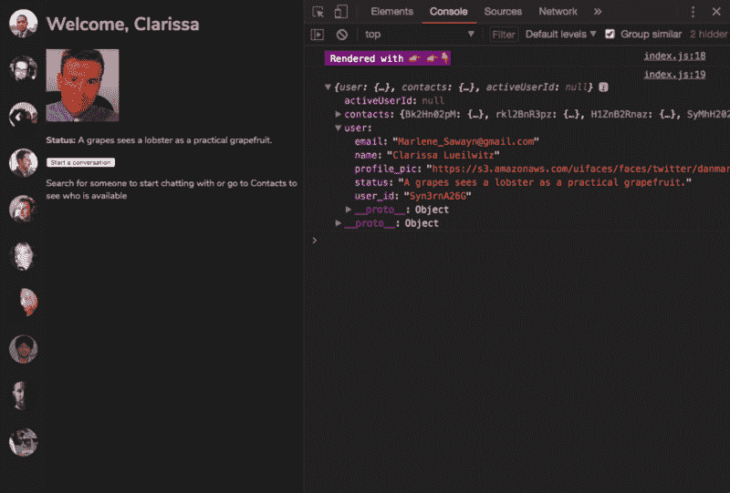

The unstyled Empty screen being displayed.** 

**你也应该有一些非常相似的东西。**

**空屏管用，但是丑，丑的 app 没人爱。**

**我已经为`<Empty />`组件编写了 CSS。**

**`****Empty.css****`**

```
`.Empty {
  display: flex;
  flex-direction: column;
  align-items: center;
  justify-content: center;
  height: 100%;
}
.Empty__name {
  color: #fff;
}
.Empty__status,
.Empty__info {
  padding: 1rem;
}
.Empty__status {
  color: rgba(255, 255, 255, 0.9);
  border-bottom: 1px solid rgba(255, 255, 255, 0.7);
}
.Empty__img {
  border-radius: 50%;
  margin: 2rem 0;
}
.Empty__btn {
  padding: 1rem;
  margin: 1rem 0;
  font-weight: bold;
  font-size: 1.2rem;
  border-radius: 30px;
  outline: 0;
}
.Empty__btn:hover {
  background: rgba(255, 255, 255, 0.7);
  cursor: pointer;
}`
```

**只是好的老 CSS。我打赌你能找出这些款式。**

**现在，这是结果:**

**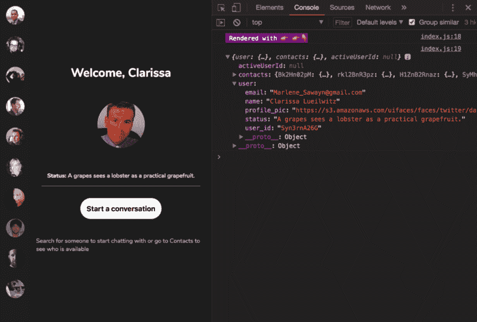

With some CSS, the Empty screen quickly comes to life.** 

**以下是 devtools 停靠后的结果:**

**

Looking good? The result so far!** 

**现在，这看起来绝对不错！**

### **构建聊天窗口**

**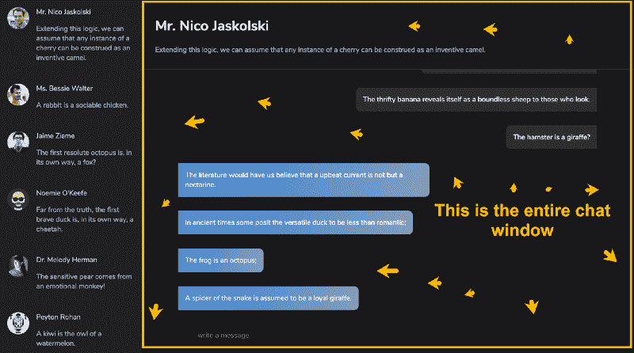

Here’s the entire chat window.** 

**看看`<Main />`组件中的逻辑。只有当`activeUserId`出现时`<ChatWindow />`才会显示。**

**此时，`activeUserId`被设置为`null`。**

**我们需要确保每当一个联系人被点击时`activeUserId`被设置。**

**你怎么想呢?**

**我们需要采取行动，对吗？**

**耶！**

**让我们定义动作的形状。**

**请记住，动作只是一个带有`type`字段和`payload`的对象。**

**`type`字段是必填的，而您可以随意称呼`payload`。`payload`是个好名字。也很常见。**

**因此，这是动作的表示:**

```
`{
  type: "SET_ACTION_ID",
  payload: user_id
}`
```

**动作的类型或名称将被称为`SET_ACTION_ID`。**

**如果你想知道，在动作类型中使用大写字母的蛇格是很常见的，比如`SET_ACTION_ID`而不是`setactionid`或`set-action-id`。**

**此外，动作有效载荷将是被设置为活动的用户的`user_id`。**

**现在让我们根据用户交互分派动作。**

**因为这是我们第一次在这个应用程序中调度动作，所以创建一个新的`actions`目录。同时，还要创建一个`constants`文件夹。**

**在`constants`文件夹中，创建一个新文件`action-types.js`。**

**这个文件有保持动作类型常量的唯一责任。我将很快解释为什么这很重要。**

**在`action-types.js`中写下以下内容。**

**`****constants/action-types.js****`**

```
`export const SET_ACTIVE_USER_ID = "SET_ACTIVE_USER_ID";`
```

**那么，为什么这很重要？**

**为了理解这一点，我们需要研究在 Redux 应用程序中的什么地方使用动作类型。**

**在大多数 Redux 应用程序中，它们会出现在两个地方。**

**1.该减速器**

**当您对减速器中的动作类型进行`switch`操作时:**

```
`switch(action.type)  {
  case "WITHDRAW_MONEY":
     doSomething();
     break;
}`
```

**2.动作创建者**

**在操作创建器中，您还可以编写类似如下的代码:**

```
`export const seWithdrawAmount = amount => ({
  type: "WITHDRAW_MONEY,
  payload: amount
})`
```

**现在，看一下上面的 reducer 和 action creator 逻辑。两者的共同点是什么？**

**`”WITHDRAW_MONEY”`字符串！**

**随着应用程序的增长，你有很多这样的字符串，你(或其他人)可能有一天会犯错误，写`”WITDDRAW_MONEY”`或`”WITHDRAW_MONY”`而不是`”WITHDRAW_MONEY_”`**

**我想说的是，像这样使用原始字符串更容易出现打字错误。从经验来看，错别字来的 bug 超级讨厌。您可能最终搜索了这么久，却发现问题是由您这边的一个非常小的失误造成的。**

**防止自己不得不处理这种麻烦。**

**一个好的方法是将字符串作为常量存储在一个单独的文件中。这样，不用在多个地方编写原始字符串，只需从声明的常量中导入字符串。**

**您可以在一个地方声明常量，但是可以在尽可能多的地方使用它们。没有错别字！**

**这正是我们创建`constants/action-types.js`文件的原因。**

**现在，让我们创建动作创建者。**

**`****action/index.js****`**

```
`import { SET_ACTIVE_USER_ID} from "../constants/action-types";

export const setActiveUserId = id => ({
  type: SET_ACTIVE_USER_ID,
  payload: id
});`
```

**如您所见，我已经从 constants 文件夹中导入了 action 类型字符串。就像我之前解释的那样。**

**同样，动作创建器只是一个函数。我已经调用了这个函数`setActiveUserId`。它将接受一个用户的`id`,并返回正确设置了类型和有效负载的动作(即对象)。**

**有了这些，剩下的就是当用户点击一个用户时调度这个动作，并在我们的 reducers 中对调度的动作做一些事情。**

**让我们继续前进。**

**看一下`User.js`组件。**

**`return`语句的第一行是一个带有类名`User`的`div`:**

```
`<div className="User">`
```

**这是设置单击处理程序的正确位置。一旦这个`div`被点击，我们将分派我们刚刚创建的动作。**

**所以，变化是这样的:**

```
`<div className="User" onClick={handleUserClick.bind(null, user)}>`
```

**`handleUserClick`功能就在这里:**

```
`function handleUserClick({ user_id }) {
  store.dispatch(setActiveUserId(user_id));
}`
```

**从哪里进口的`setActiveUserId`？动作创造者！**

```
`import { setActiveUserId } from "../actions";`
```

**现在，下面是此时你应该有的所有`User.js`代码:**

**`****containers/User.js****`**

```
`import React from "react";
import "./User.css";
import store from "../store";
import { setActiveUserId } from "../actions";

const User = ({ user }) => {
  const { name, profile_pic, status } = user;

  return (
    <div className="User" onClick={handleUserClick.bind(null, user)}>
      
      <div className="User__details">
        <p className="User__details-name">{name}</p>
        <p className="User__details-status">{status}</p>
      </div>
    </div>
  );
};

function handleUserClick({ user_id }) {
  store.dispatch(setActiveUserId(user_id));
}

export default User;`
```

**为了分派动作，我还必须导入`store`并调用方法`store.dispatch()`。**

**还要注意，我使用了 ES6 析构语法从`handleUserClick`中的`user`参数中获取`user_id`。**

**如果您正在编写代码，正如我所建议的，单击任何一个用户联系人并检查日志。您可以向`handleUserClick`添加一个控制台日志，如下所示:**

```
`function handleUserClick({ user_id }) {
  console.log(user_id);
  store.dispatch(setActiveUserId(user_id));
}`
```

**您将找到用户联系人的登录用户 id。**

**您可能已经注意到，动作正在被调度，但是屏幕上没有任何变化。状态对象中没有设置`activeUserId`。这是因为现在，reducers 对分派的动作一无所知。**

**让我们解决这个问题，但是不要忘记在检查完日志后删除`console.log(user_id)`。**

**看一下`activeUserId`减速器:**

```
`export default function activeUserId(state = null, action) {
  return state;
}`
```

******reducer/active userid . js******

```
`import { SET_ACTIVE_USER_ID } from "../constants/action-types";
export default function activeUserId(state = null, action) {
  switch (action.type) {
    case SET_ACTIVE_USER_ID:
      return action.payload;
    default:
      return state;
  }
}`
```

**你应该明白这是怎么回事。**

**第一行导入字符串`SET_ACTIVE_USER_ID`。**

**然后我们检查传入的动作是否属于`type` `SET_ACTIVE_USER_ID`。如果是，则将`activeUserId`的新值设置为`action.payload`。**

**不要忘记动作有效载荷包含用户联系人的`user_id`。**

**让我们来看看实际情况。是否按预期工作？**

**是啊！**

**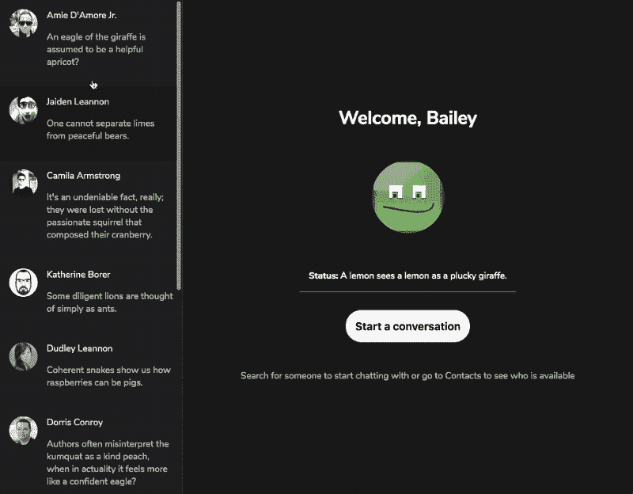

Hurray! We’ve got this working for now ;)** 

**现在，`ChatWindow`组件是用正确的`activeUserId`集合呈现的。**

**提醒一下，重要的是要记住，使用 reducer 组合，每个 reducer 的返回值是它们所代表的状态字段的值，而不是整个状态对象。**

### **将聊天窗口分成更小的组件**

**看看完成后的聊天窗口是什么样子的:**

**

Here’s the entire chat window.** 

**为了更合理的开发方法，我将它分成了三个子组件，`Header`、`Chats`和`MessageInput`:**

**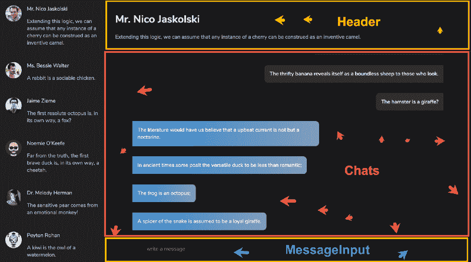

The sub components, Header, Chats and MessageInput** 

**因此，为了完成`chatWindow`组件，我们将构建这三个子组件。然后我们将它们组合起来形成`chatWindow`组件。**

**准备好了吗？**

**让我们从头部组件开始。**

**`chatWindow`组件的当前内容如下:**

```
`import React from "react";

const ChatWindow = ({ activeUserId }) => {
  return (
    <div className="ChatWindow">Conversation for user id: {activeUserId}</div>
  );
};

export default ChatWindow;`
```

**不是很有帮助。**

**将代码更新为:**

```
`import React from "react";
import store from "../store";
import Header from "../components/Header";

const ChatWindow = ({ activeUserId }) => {
  const state = store.getState();
  const activeUser = state.contacts[activeUserId];

  return (
    <div className="ChatWindow">
      <Header user={activeUser} />
    </div>
  );
};

export default ChatWindow;`
```

**什么变了？**

**记住，`activeUserId`是作为道具传递给`ChatWindow`组件的。**

**现在，不呈现用户 id: … 的文本 *Conversation，而是呈现`Header`组件。***

**在不知道被点击的用户的情况下，不能正确地呈现标题组件。为什么？**

**在`Header`中呈现的`name`和`status`是被点击用户的。**

**

The information in the header are those of the clicked contact.** 

**为了跟踪活动用户，创建了一个新变量`activeUser`，从状态对象中检索的值如下:`const activeUser = state.contacts[activeUserId]`。**

**这是如何工作的？**

**首先，我们从 Redux 存储中获取状态:`const state = store.getState()`。**

**现在，记住应用程序用户的每个联系人都存储在`contacts`字段中。此外，每个用户都通过他们的`user_id`进行映射。**

**因此，可以通过从`contacts`对象:`state.contacts[activeUserId]`中获取具有相应 id 字段的用户来检索活动用户。**

**一切都好吗？**

**此时，我们需要构建呈现的`Header`组件。**

**在`components`目录下创建文件`Header.js`和`Header.css`。**

**`Header.js`的内容很简单。这是:**

```
`import React from "react";
import "./Header.css";

function Header({ user }) {
  const { name, status } = user;
  return (
    <header className="Header">
      <h1 className="Header__name">{name}</h1>
      <p className="Header__status">{status}</p>
    </header>
  );
}

export default Header;`
```

**它是一个无状态的功能组件，呈现一个`header`元素和`h1`和`p`标签来保存活动用户的*名称*和*状态*。**

**请记住，活动用户是侧边栏中被点击的用户。**

**`<Header />`组件的样式同样简单。他们在这里:**

```
`.Header {
  padding: 1rem 2rem;
  border-bottom: 1px solid rgba(189, 189, 192, 0.2);
}
.Header__name {
  color: #fff;
}`
```

**现在，我们让这宝贝踢起来了！**

**

Looking good!** 

**太神奇了。如果你还在这里，你做得真的很好！**

**让我们继续构建`<Chats />`组件。**

**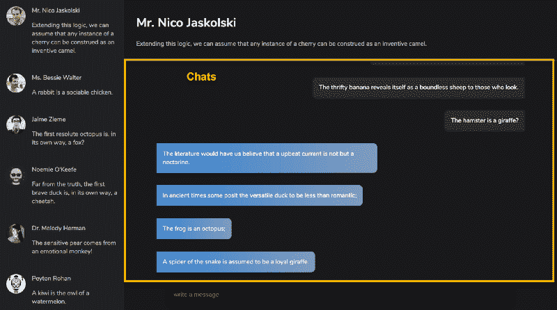

The Chats component to be built** 

**组件本质上是一个用户对话的列表。**

**那么，我们从哪里得到这些对话呢？**

**是的，从申请的状态来看。**

**正如我之前解释的，一个真实的应用程序将从服务器获取用户对话。然而，我学习 Redux 的方法是，在学习基础知识时，尽可能地消除复杂性。**

**为此，这里没有服务器获取资源。我们将使用我为随机用户数据生成创建的一些帮助函数来连接数据。**

**让我们首先将所需的数据与应用程序的状态联系起来。**

**这个过程和我们已经做过多次的一样。**

1.  **创建一个减速器**
2.  **使用 ES6，向减速器添加默认参数值**
3.  **在`combineReducers`函数调用中包含减速器。**

**在进入我的解决方案之前，您能先尝试一下吗？**

**不管怎样，我的解决方案来了。**

**在`reducers`目录下创建一个新文件`messages.js`。这将是消息缩减器。**

**以下是消息缩减器的内容。**

**`****reducers/messages.js****`**

```
`import { getMessages } from "../static-data";

export default function messages(state = getMessages(10), action) {
  return state;
}`
```

**为了生成随机消息，我从`static-data`导入了`getMessages`函数**

**这个函数接受一个数量，用一个数字表示。然后,`getMessages`函数将为每个用户联系人生成相应数量的消息。**

**例如，`getMessages(10)`将为每个用户联系人生成 10 条消息。**

**现在，将减速器包含在`reducers/index.js`中的`combineReducers`函数调用中**

**`****reducers/index.js****`**

```
`import messages from "./messages";

export default combineReducers({
  user,
  messages,
  contacts,
  activeUserId
});`
```

**这样做将在状态对象中包含一个`messages`字段。**

**这是日志。您现在会发现如下图所示的`messages`:**

**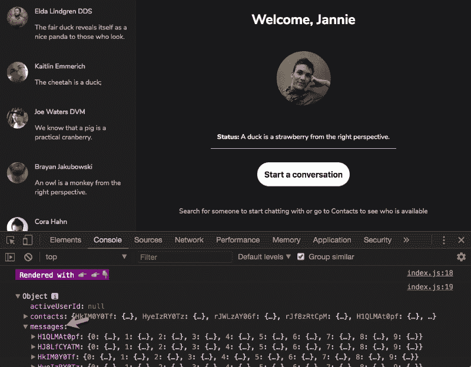

Messages now exist in the state object.** 

**有了这些，我们就可以安全地继续构建`Chats`组件了。**

**如果还没有，在 components 目录中创建文件`Chats.js`和`Chats.css`。**

**现在，导入`Chats`并在`ChatWindow`中的`<Header />`组件下渲染。**

**`****containers/ChatWindow.js****`**

```
`... 
import Chats from "../components/Chats"; 
... 
return (
    <div className="ChatWindow">
      <Header user={activeUser} />
      <Chats />
    </div>
  );`
```

**`<Chats/>`组件将从状态对象中获取消息列表，映射这些消息，然后漂亮地呈现它们。**

**记住传入`Chats`的消息是专门给活动用户的消息！**

**鉴于`state.messages`保存每个用户联系人的所有消息，`state.messages[activeUserId]`将获取活动用户的消息。**

**这就是为什么每个对话都映射到用户的用户 id——就像我们所做的那样，以便于检索。**

**抓取活跃用户的消息，在`Chats`中作为道具传递。**

**`****containers/ChatWindow.js****`**

```
`... 
import Chats from "../components/Chats"; 
... 
const activeMsgs = state.messages[activeUserId];

return (
    <div className="ChatWindow">
      <Header user={activeUser} />
      <Chats messages={activeMsgs} />
    </div>
  );`
```

**现在，记住每个用户的消息是一个巨大的对象，每个消息都有一个数字字段:**

**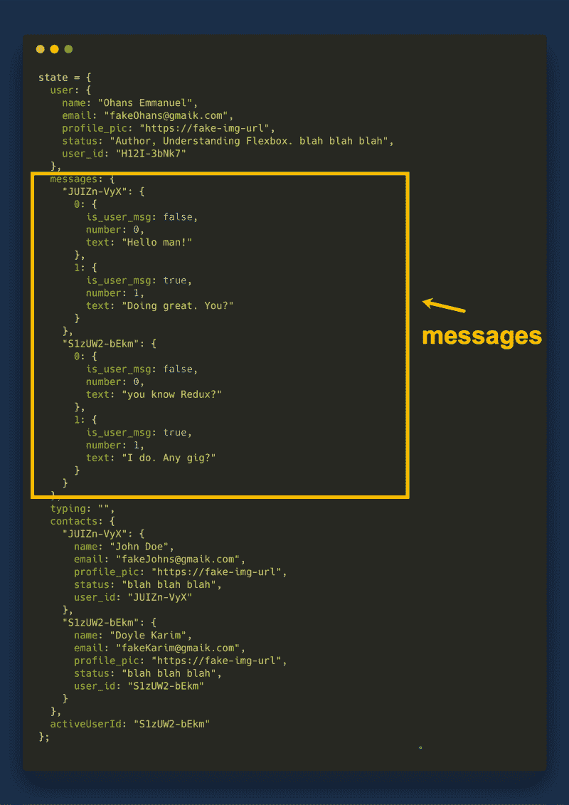

Have a look at the messages field one more time** 

**为了更容易迭代和渲染，我们将把它转换成一个数组。就像我们在侧边栏中处理用户列表一样。**

**为此，我们需要`Lodash.`**

**`****containers/ChatWindow.js****`**

```
`... 
import _ from "lodash";
import Chats from "../components/Chats"; 
... 
const activeMsgs = state.messages[activeUserId];

return (
    <div className="ChatWindow">
      <Header user={activeUser} />
      <Chats messages={_.values(activeMsgs)} />
    </div>
  );`
```

**现在，我们传入的不是`activeMsgs`，而是`_.values(activeMsgs)`。**

**在我们查看结果之前，还有一个重要的步骤。**

**组件`Chats`尚未创建。**

**在`Chats.js`中，写下以下内容。事后我会解释的。**

**`****containers/Chat.js****`**

```
`import React, { Component } from "react";
import "./Chats.css";

const Chat = ({ message }) => {
  const { text, is_user_msg } = message;
  return (
    <span className={`Chat ${is_user_msg ? "is-user-msg" : ""}`}>{text}</span>
  );
};

class Chats extends Component {
  render() {
    return (
      <div className="Chats">
        {this.props.messages.map(message => (
          <Chat message={message} key={message.number} />
        ))}
      </div>
    );
  }
}

export default Chats;`
```

**这并不难理解，但我会解释这是怎么回事。**

**首先，看看`Chats`组件。您会注意到我在这里使用了一个基于类的组件。你以后会明白为什么。**

**在渲染函数中，我们用`map`覆盖`messages`道具，对于每个`message`，我们返回一个`Chat`组件。**

**`Chat`组件非常简单:**

```
`const Chat = ({ message }) => {
  const { text, is_user_msg } = message;
  return (
    <span className={`Chat ${is_user_msg ? "is-user-msg" : ""}`}>{text}</span>
  );
};`
```

**对于传入的每条消息，消息的`text`内容和`is_user_msg`标志都是使用 ES6 析构语法`const { text, is_user_msg } = message;`获取的**

**return 语句更有意思。**

**呈现一个简单的`span`标签。**

**去掉一些魔法，下面是渲染的简单形式:**

```
`<span> {text} </span>`
```

**消息的文本内容包装在一个`span`元素中。简单。**

**然而，我们需要区分应用程序用户的消息和联系人的消息。**

**不要忘记，一场对话至少需要两个人相互发送信息。**

**如果呈现的消息是用户的消息，我们希望呈现的标记是这样的:**

```
`<span className="Chat  is-user-msg"> {text} &lt;/span>`
```

**如果没有，我们想要这个:**

```
`<span className="Chat  is-user-msg"> {text} </span>`
```

**注意，改变的是被切换的`is-user-msg`类。**

**这样，我们就可以使用如下所示的 css 选择器来专门设计用户消息的样式:**

```
`.Chat.is-user-msg {

}`
```

**所以，这就是为什么我们有一些花哨的`JSX`来根据`is_user_msg`标志的存在或不存在来呈现类名。**

```
`<span className={`Chat ${is_user_msg ? "is-user-msg" : ""}`}>{text}</span>`
```

**真正的调味汁是这样的:**

**`${is_user_msg ? "is-user-msg" : “”`**

**这就是三元运算符！**

**你现在可以理解`containers/Chats.js`中的所有代码了，是吗？**

**这是目前为止的结果。**

**

The current result of our iterations. Still needs some work.** 

**消息被渲染，但是看起来不太好。这是因为所有消息都呈现在`span`标签中。**

**由于`span`标签是行内元素，所有的消息都呈现在一条连续的线上，看起来很拥挤。**

**这就是我的 homeboy CSS 大放异彩的地方。**

**让我们撒上一些 CSS 的好处，让这个派对开始:)**

**从聊天窗口开始，在`containers`目录下创建一个新文件`ChatWindow.css`。**

**不要忘记像这样在`ChatWindow.js`中导入它:`import "./ChatWindow.css"`**

**把这个写在那里:**

```
`.ChatWindow {
    display: flex;
    flex-direction: column;
    height: 100vh;
}`
```

**这将确保`ChatWindow`占据所有可用高度`100vh`。我还把它做成一个 flex 容器，这样我就可以在对齐它的项目时使用一些 flex 好东西，即`Header`、`Chats`和`Message`。**

**你可以看到下面有红色边框的`ChatWindow`:**

**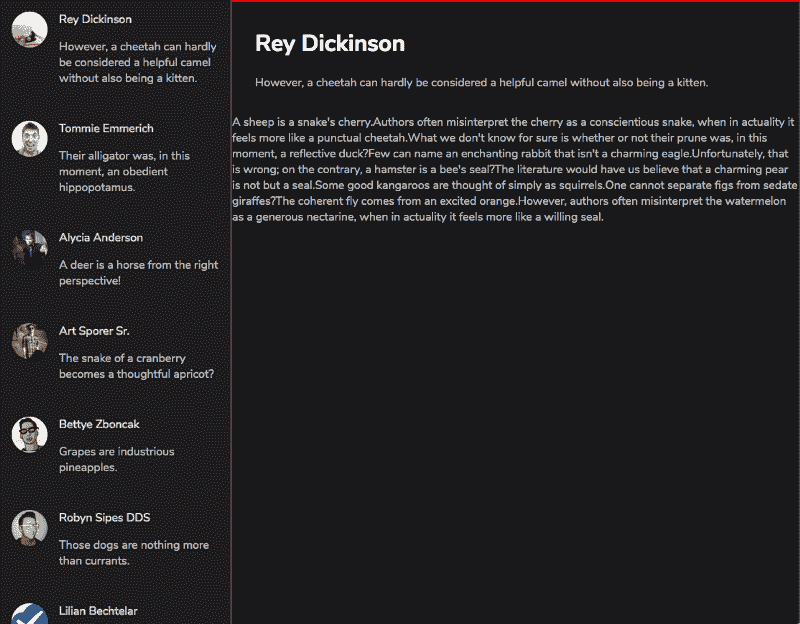

ChatWindow — not the best of looks yet.** 

**让我们继续设计`Chat`消息的样式。**

**`****components/Chats.css****`**

```
`.Chats {
  flex: 1 1 0;
  display: flex;
  flex-direction: column;
  align-items: flex-start;
  width: 85%;
  margin: 0 auto;
  overflow-y: scroll;
}
.Chat {
  margin: 1rem 0;
  color: #fff;
  padding: 1rem;
  background: linear-gradient(90deg, #1986d8, #7b9cc2);
  max-width: 90%;
  border-top-right-radius: 10px;
  border-bottom-right-radius: 10px;
}
.Chat.is-user-msg {
  margin-left: auto;
  background: #2b2c33;
  border-top-right-radius: 0;
  border-bottom-right-radius: 0;
  border-top-left-radius: 10px;
  border-bottom-left-radius: 10px;
}

@media (min-width: 576px) {
  .Chat {
    max-width: 60%;
  }
}`
```

**天哪！这看起来已经很好了！**

**

How beautiful is that :)** 

**让我解释一些重要的风格声明。**

**使用`flex: 1 1 0`，`.Chats`在`ChatWindow`内相应地增长(占用可用空间)和收缩。**

**`.Chats`也是由带`display: flex`的柔性容器制成。通过设置`flex-direction: column`,所有的聊天信息都是垂直排列的。它们不再是内联元素，而是 flex 项目！**

**不是用户的聊天被赋予了带有`background: linear-gradient(90deg, #1986d8, #7b9cc2);`的*蓝色*背景渐变**

**如果消息是用户的，此选项将被覆盖:**

```
`.Chat.is-user-msg {
  background: #2b2c33;
}`
```

**我相信你能理解其他的一切。**

**到目前为止一切顺利！**

**我真的很兴奋我们已经走了这么远。最后一步，聊天窗口就完成了！**

**让我们构建消息输入组件。**

**我们不得不制造更难的组件。这个不会很难造。**

**然而，有一点需要考虑。**

**输入部件将是受控部件。因此，我们将把输入值存储在应用程序状态对象中。**

**为此，我们需要在 state 对象中添加一个名为`typing`的新字段。**

**让我们把它放进去。**

**出于我们的考虑，每当用户输入时，我们将分派一个`SET_TYPING_VALUE`动作类型。**

**确保在`****constants/action-types.js****`文件中添加该常量:**

```
`export const SET_TYPING_VALUE = "SET_TYPING_VALUE";`
```

**此外，调度操作的形状如下所示:**

```
`{
   type: SET_TYPING_VALUE,
   payload: "input value"
}`
```

**其中动作的`payload`是在输入中键入的值。让我们创建一个动作创建者来处理这个动作的创建:**

**`****actions/index.js****`**

```
`import {
  SET_ACTIVE_USER_ID,
  SET_TYPING_VALUE
} from "../constants/action-types";

…
export const setTypingValue = value => ({
  type: SET_TYPING_VALUE,
  payload: value
})`
```

**现在，让我们创建一个新的`typing`减速器，它将考虑这个创建的动作。**

**`****reducers/typing.js****`**

```
`import { SET_TYPING_VALUE } from "../constants/action-types";

export default function typing(state = "", action) {
  switch (action.type) {
    case SET_TYPING_VALUE:
      return action.payload;
    default:
      return state;
  }
}`
```

**键入字段的默认值将被设置为空字符串。**

**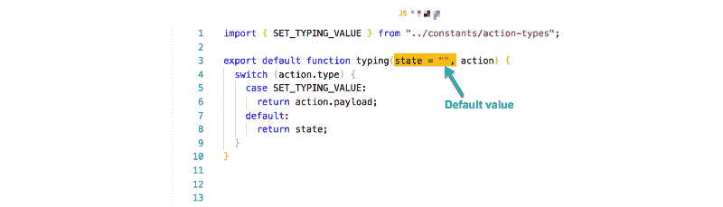**

**然而，当调度类型为`SET_TYPING_VALUE`的动作时，将返回有效负载中的值。**

**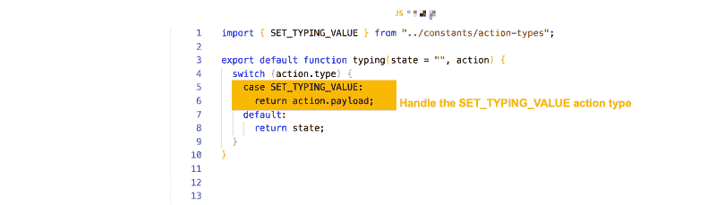

handle the SET_TYPING_VALUE type** 

**否则，将返回默认状态`""`。**

**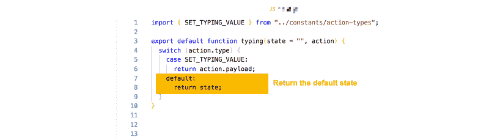

As a default, return the same state** 

**在我忘记之前，一定要在`combineReducers`函数调用中包含这个新创建的 reducer。**

**`****reducers/index.js****`**

```
`...
import typing from "./typing";

export default combineReducers({
  user,
  messages,
  typing,       
  contacts,
  activeUserId
});`
```

**请务必检查日志，并确认一个`typing`字段确实附加到了状态对象。**

**好吧。现在让我们创建实际的`MessageInput`组件。由于这个组件将直接与 Redux store 对话来设置和获取它的类型值，所以应该在`containers`目录中创建它。**

**同时，还要创建一个`MessageInput.css`文件。**

**`****containers/MessageInput****`**

```
`import React from "react";
import store from "../store";
import { setTypingValue } from "../actions";
import "./MessageInput.css";

const MessageInput = ({ value }) => {

  const handleChange = e => {
    store.dispatch(setTypingValue(e.target.value));
  };

  return (
    <form className="Message">
      <input
        className="Message__input"
        onChange={handleChange}
        value={value}
        placeholder="write a message"
      />
    </form>
  );
};

export default MessageInput;`
```

**上面没什么神奇的事情发生。**

**每当用户在输入框中输入内容时，就会触发`onChange`事件。这是轮流触发`handleChange`功能。`handleChange`依次分派我们之前创建的`setTypingValue`动作。这一次，`e.target.value`号通过了要求的有效载荷。**

**我们已经创建了组件，但是要在聊天窗口中显示，我们需要将它包含在`ChatWindow.js`的返回语句中:**

```
`...
import MessageInput from "./MessageInput";
const { typing } = state;

return (
    <div className="ChatWindow">
      <Header user={activeUser} />
      <Chats messages={_.values(activeMsgs)} />
      <MessageInput value={typing} />
    </div>
  );`
```

**现在，我们成功了！**

**呃，但是真的很丑**

**让我们把它变漂亮。**

**`****containers/MessageInput.css****`**

```
`.Message {
  width: 80%;
  margin: 1rem auto;
}
.Message__input {
  width: 100%;
  padding: 1rem;
  background: rgba(0, 0, 0, 0.8);
  color: #fff;
  border: 0;
  border-radius: 10px;
  font-size: 1rem;
  outline: 0;
}`
```

**这应该足够施展魔法了！**

**

The results so far!** 

**更好看了？**

**我打赌是！**

### **提交表单**

**现在，当你输入一条信息并按下回车键时，它不会出现在对话列表中，页面会重新加载。**

**可怕！**

**让我们来处理表单提交。**

**在`MessageInput.js`中，添加一个`handleSubmit`事件处理程序，如下所示:**

```
`...
<form className="Message" onSubmit={handleSubmit}>
...
</form>
...`
```

**想一分钟。要更新对话中的消息列表…我们需要分派一个动作！**

**这个动作需要在输入框中输入`value`，并将其添加到活动用户的消息中。**

**好的，这看起来是一个很好的动作形状:**

```
`{
  type: "SEND_MESSAGE",
  payload: {
    message,
    userId
  }
}`
```

**明白了吗？**

**现在，让我们编写`handleSubmit`函数:**

```
`//first retrieve the current state object
const state = store.getState();  

const handleSubmit = e => {
    e.preventDefault();
    const { typing, activeUserId } = state;
    store.dispatch(sendMessage(typing, activeUserId));
  };`
```

**下面是在`handleSubmit`函数中发生的事情:**

**对于`e.preventDefault()`，我想你已经知道它的作用了。从`state`中获取`typing`值和`activeUserId`,因为它们都将用于创建被分派的动作。**

**最后，用`store.dispatch(sendMessage(typing, activeUserId))`分派动作。**

**哎呀，但是有了动作创建者，`sendMessage`。**

**在`****actions/index.js****`中，创建`sendMessage`动作创建者:**

```
`import {
  ...
  SEND_MESSAGE
} from "../constants/action-types";

export const sendMessage = (message, userId) => ({
  type: SEND_MESSAGE,
  payload: {
    message,
    userId
  }
})`
```

**这也意味着需要在`****constants/action-types.js****`中创建`SEND_MESSAGE`动作类型常量。**

```
`export const SEND_MESSAGE = "SEND_MESSAGE";`
```

**在测试代码之前，您不应该忘记更新 action creator 在`****MessageInput.js****` 中导入的内容，以包含`sendMessage`。**

```
`import { setTypingValue, sendMessage } from "../actions";`
```

**所以试试吧。代码有效吗？**

**呃，不，不是的。**

**表单被提交，页面由于表单提交而没有重新加载，动作被调度，但是仍然没有更新。**

**我们没有做错什么，除了动作类型没有在任何一个 reducers 中被迎合。**

**reducers 对这个新创建的动作类型`SEND_MESSAGE`一无所知。**

**接下来我们来解决这个问题。**

### **更新消息状态**

**这是我们目前所有减速器的列表:**

```
`activeUserId.js
contacts.js
messages.js
typing.js
user.js`
```

**您认为以下哪一项应该与更新用户对话中的消息有关？**

**是的，`messages`减速器。**

**下面是`messages`减速器的当前内容:**

```
`import { getMessages } from "../static-data";

export default function messages(state = getMessages(10), action) {
  return state;
}`
```

**里面没什么动静。**

**导入`SEND_MESSAGE`动作类型，让我们开始在这个`messages`缩减器中处理它。**

```
`import { getMessages } from "../static-data";
import { SEND_MESSAGE } from "../constants/action-types";

export default function messages(state = getMessages(10), action) {
  switch (action.type) {
    case SEND_MESSAGE:
      return "";
    default:
      return state;
  }
}`
```

**现在，我们正在处理动作类型，`SEND_MESSAGE`,但是返回了一个空字符串。**

**这不是我们想要的，但我们会从这里开始。同时，你认为在这里返回一个空字符串的后果是什么？**

**让我展示给你看。**

****

**所有的信息都消失了！但是为什么呢？这是因为只要我们按下 enter 键，就会调度`SEND_MESSAGE`动作。这个动作一到达减速器，减速器就返回一个空串`“”`。**

**因此，状态对象中没有消息。全没了！**

**这肯定是不能接受的。**

**我们想要的是保留状态中的任何消息。但是，我们想在活跃用户的消息中只添加一条新消息**。****

****好吧。但是怎么做呢？****

****请记住，每个用户都有映射到其 ID 的消息。我们需要做的就是瞄准这个 ID，只更新其中的消息。****

****这是它的图像:****

****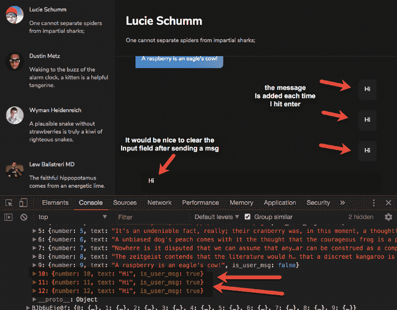

an overview of what’s to be done.**** 

****请查看上图中的控制台。该图假设用户已经提交了三次带有文本`Hi`的表单输入。****

****不出所料，`Hi`在特定联系人的聊天对话中出现了三次。****

****现在，看一下控制台。这会让你知道我们在未来的代码解决方案中的目标是什么。****

****在这个应用程序中，每个用户有 10 条消息。每条消息都有一个从`0`到`9`的编号。****

****因此，每当用户提交新消息时，我们都希望添加一个新的`message`对象，但是数量会越来越多！****

****在上图的控制台中，您会注意到数字增加了。`10`、`11`和`12`。****

****同样，消息形状保持不变，具有`number`、`text`和`is_user_msg`字段。****

```
**`{ 
  number: 10,
  text: "the text typed",
  is_user_msg: true
}`**
```

****`is_user_msg`对于这些消息将永远是真实的。他们来自用户！****

****现在，让我们用一些代码来表示它。****

****我将很好地解释这一点，因为代码一开始可能看起来很复杂。****

****总之，下面是`messages`减速器的`switch`块内的表示:****

```
**`switch (action.type) {
    case SEND_MESSAGE:
      const { message, userId } = action.payload;
      const allUserMsgs = state[userId];
      const number = +_.keys(allUserMsgs).pop() + 1;

      return {
        ...state,
        [userId]: {
          ...allUserMsgs,
          [number]: {
            number,
            text: message,
            is_user_msg: true
          }
        }
      };

    default:
      return state;
  }`**
```

****让我们一行一行地过一遍。****

****就在`case SEND_MESSAGE:`之后，我们保留一个对从动作中传入的`message`和`userId`的引用。****

```
**`const {message, userId } = action.payload`**
```

****要继续下去，抓住活跃用户的消息也很重要。这是在下一行完成的:****

```
**`const allUserMsgs = state[userId];`**
```

****您可能已经知道，`state`这里不是应用程序的整体状态对象。否。这是由`messages`字段的缩减器管理的状态。****

****因为每个联系人的消息都与他们的用户 ID 对应，所以上面的代码获得了从动作中传递的特定用户 ID 的消息。****

****现在，每条消息都有一个`number`。这就像某种唯一的 ID。对于具有唯一 ID 的传入消息，`_.keys(allUserMsgs)`将返回用户消息的所有键的数组。****

****好吧，让我解释一下。****

****`_.keys`就像`Object.keys()`。这里唯一的不同是我使用了来自`Lodash`的助手。想用的话可以用`Object.keys()`。****

****另外，`allUserMsgs`是包含所有用户消息的对象。它看起来会像这样:****

```
**`{
  0: {
    number: 0,
    text: "first message"
    is_user_msg: false
  },
  1: {
     number: 0,
     text: "first message"
     is_user_msg: false
  }
}`**
```

****这将持续到第 10 条消息！****

****当我们执行`_.keys(allUserMsgs)`或`Object.keys(allUserMsgs)`时，这将返回所有键的数组。大概是这样的:****

```
**`[ 0, 1, 2, 3, 4, 5]`**
```

****`Array.pop()`函数用于检索数组中的最后一项。这是联系人消息的最大数量。有点像最后一个联系人的消息 ID。****

****一旦检索到，我们就给它加上`+ 1`。确保新消息获得可用消息中最高数量的`+ 1`。****

****这是负责这个的所有代码:****

```
**`const number = +_.keys(allUserMsgs).pop() + 1;`**
```

****如果您想知道为什么在`_.keys(allUserMsgs).pop() + 1`之前有一个`+`，这是为了确保结果被转换成一个数字而不是一个字符串。****

****就是这样！****

****关于代码块的内容:****

```
**`return {
        ...state,
        [userId]: {
          ...allUserMsgs,
          [number]: {
            number,
            text: message,
            is_user_msg: true
          }
        }
      };`**
```

****仔细看看，我相信你会明白的。****

****`...state`将确保我们不会弄乱应用程序中之前的消息。****

****因为我们使用了对象表示法，所以我们可以很容易地用特定的用户 ID 和`[userID]`来获取消息****

****在对象中，我们确保用户的所有消息都没有被触动:`...allUserMsgs`****

****最后，我们用之前计算的数字添加新的消息对象！****

```
**`[number]: {
  number,
  text: message,
  is_user_msg: true
}`**
```

****这看起来可能很复杂，但事实并非如此。希望您在 React 开发中有过这种非变异状态计算的经验。****

****还在迷茫？****

****再看一下退货单。这一次，用一些代码颜色。这可能有助于为代码注入活力:****

****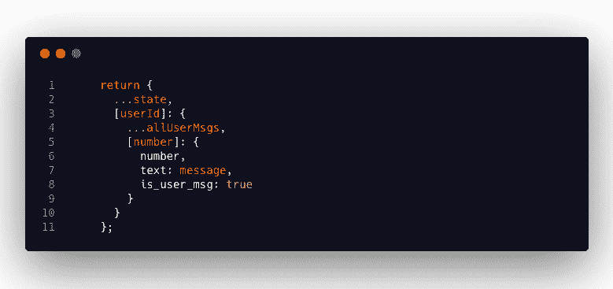

have another look at the return statement. Can you make sense of this now?**** 

****我的朋友，这就是当输入一个输入时更新对话的结束！****

****我们只有一些调整要做。****

### ****使聊天体验更加自然的调整****

****下面是我写`Hello!`并提交三次时事情的当前状态。****

****

DEMO so far.**** 

****你会很快注意到两个问题。****

1.  ****即使输入被提交，消息被正确地添加到对话中，我也必须向下滚动才能看到消息。聊天应用不是这样的。聊天窗口应该会自动向下滚动。****
2.  ****最好在提交时清除输入的值。通过这种方式，用户可以立即得到反馈，他们的输入已经被提交。****

****第二种方法更容易解决。让我们从那个开始。****

****我们已经在派遣一个`SEND_MESSAGE`行动。我们可以监听这个动作并清除`typing.js`减速器中的输入值。****

****我们就这么做吧。****

****将此添加到`typing.js`减速器的开关块内:****

```
**`case SEND_MESSAGE:
      return "";`**
```

****这就带来了所有的代码:****

****`****reducer/typing.js****`****

```
`import { SET_TYPING_VALUE, SEND_MESSAGE } from "../constants/action-types";

export default function typing(state = "", action) {
  switch (action.type) {
    case SET_TYPING_VALUE:
      return action.payload;
    case SEND_MESSAGE:
      return "";
    default:
      return state;
  }
}`
```

**现在，一旦动作到达这里，`typing`值将被清除，并返回一个空字符串。**

**这就是实际情况:**

****

**有用！**

**正如所料，输入值现在被清除。**

**好的，让我们确保聊天窗口在更新时滚动。**

**为此，我们需要一些 DOM 操作。这就是我坚持让`<Chats />`成为一个类组件的原因。**

**好吧，我们来谈谈代码。**

**首先，我们需要创建一个`Ref`来保存 Chats DOM 节点。**

```
`constructor(props) {
    super(props);
    this.chatsRef = React.createRef();
  }`
```

**如果你不熟悉`React.createRef()`，这是完全正常的。这是因为 React 16 引入了一个[新方法来创建裁判](https://reactjs.org/docs/refs-and-the-dom.html)。**

**我们通过`this.chatsRef`保持对这个`Ref`的引用。**

**在呈现的 DOM 中，我们像这样更新 ref:**

```
`<div className="Chats" ref={this.chatsRef}>`
```

**我们现在有了对保存所有聊天对话的`div`的引用。**

**让我们确保在更新时总是滚动到底部。**

**向生命周期方法问好！**

```
`componentDidMount() {
    this.scrollToBottom();
  }
  componentDidUpdate() {
    this.scrollToBottom();
  }`
```

**因此，一旦组件安装完毕，我们就调用一个`scrollToBottom`函数。每当应用程序更新时，我们也会这样做！**

**现在，这里是`scrollToBottom`函数:**

```
`scrollToBottom = () => {
    this.chatsRef.current.scrollTop = this.chatsRef.current.scrollHeight;
  };`
```

**我们所做的就是更新`scrollTop`属性来匹配`scrollHeight`**

**没那么难。`this.chatsRef.current`指的是正在讨论的 DOM 节点。**

**这里是目前为止`Chats.js`的所有代码。**

```
`...

class Chats extends Component {
  constructor(props) {
    super(props);
    this.chatsRef = React.createRef();
  }
  componentDidMount() {
    this.scrollToBottom();
  }
  componentDidUpdate() {
    this.scrollToBottom();
  }
  scrollToBottom = () => {
    this.chatsRef.current.scrollTop = this.chatsRef.current.scrollHeight;
  };

  render() {
    return (
      <div className="Chats" ref={this.chatsRef}>
        {this.props.messages.map(message => (
          <Chat message={message} key={message.number} />
        ))}
      </div>
    );
  }
}

export default Chats;`
```

**嘿！这样，我们就可以让 Skypey 像预期的那样工作了！**

**这里有一个演示。请注意组件安装后滚动位置是如何更新的，当输入消息时，组件也会更新。**

**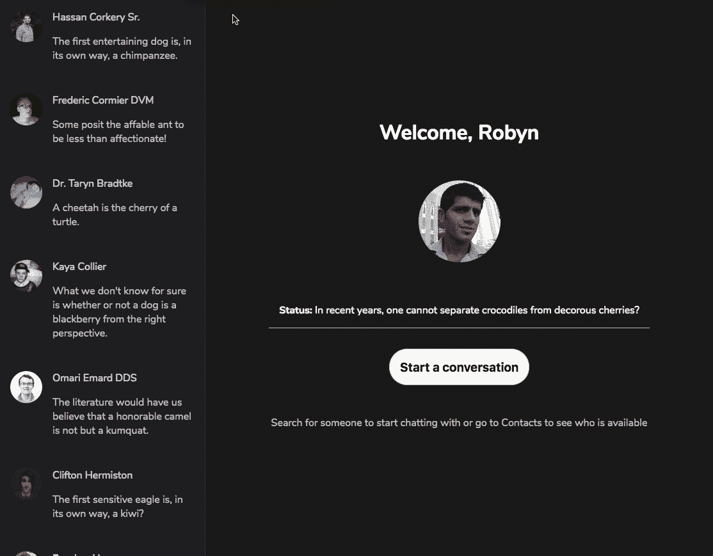

Final results looking all good! Gorgeous!** 

**太棒了。**

**所以，激动！**

**我们已经走了这么远:)**

### **结论和总结**

**我的天啊。这对我来说是一次很棒的经历。建造 Skypey 很有趣。**

**你喜欢吗？我想看看你自己版本的 Skypey。改变颜色，调整设计，并建立更好的东西！**

**当你完成后，[给我发一条推特](https://twitter.com/OhansEmmanuel)，我会很高兴让你振作起来。**

**以下是我们到目前为止学到的一些东西的总结:**

*   **在开始编写代码之前，始终规划您的应用程序开发过程是一个很好的实践。**
*   **在你的状态对象中，尽一切可能避免嵌套实体。保持状态对象规范化。**
*   **将状态字段存储为对象确实有一些好处。同样要注意使用对象的问题，主要是缺乏秩序。**
*   **如果您选择在状态对象中使用对象而不是数组，那么`lodash`实用程序库会非常方便。**
*   **不管有多少，总要花些时间来设计应用程序的状态对象。**
*   **有了 Redux，就不用老是传道具了。您可以直接从存储中访问状态值。**
*   **在你的 Redux 应用中总是保持一个整洁的文件夹结构，比如让所有主要的 Redux 参与者都在他们自己的文件夹中。除了整洁的整体代码结构，这使得其他人更容易在您的项目中协作，因为他们可能熟悉相同的文件夹结构。**
*   **Reducer 组合真的很棒，尤其是当你的应用程序增长的时候。这增加了可测试性，减少了难以跟踪的错误。**
*   **对于减速器组合，使用`redux`库中的`combineReducers`。**
*   **传递给`combineReducers`函数的对象被设计成类似于应用程序的状态，每个值都是从相关的 reducers 中获得的。**
*   **总是将较大的组件分成较小的易于管理的部分。这样更容易建立自己的路。**

**回头见！**

### **练习**

**我们在这里建立的 Skypey 应用程序并不是这个应用程序的全部。你还有两项任务。**

*   **如下所示，扩展我们构建的 Skypey 应用程序以处理用户消息的编辑。**

**

Include the edit message functionality shown here.** 

*   **扩展我们构建的 Skypey 应用程序，使其也能处理用户消息的删除。如下图所示。**

**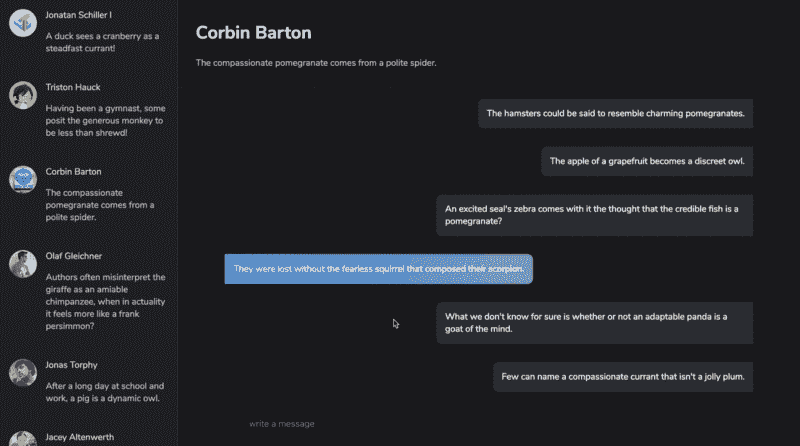

Include the delete message functionality shown here.** 

**这些实现起来应该很有趣！**

### **第五章:下一步是什么？**

**

The sequel to this current book** 

**你正在读的这本书是 Redux 三重奏续集的三分之一。**

**在第二本书《理解 Redux 2》中，我详细解释了复杂的高级 Redux 概念，比如中间件、高阶组件、Ajax 调用等等。**

**这还没有结束。**

**我还将向您展示一些最受欢迎的社区 Redux 库，用于解决常见问题。重新选择、还原形式、还原形式、重新组合等等。**

**以下部分节选自，[了解 Redux 2](http://thereduxjsbooks.com/) *。***

> **每次你需要从账户上提款时，都要去银行，这真是一件痛苦的事。好吧，别担心。这是 2018 年。我们有网上银行，对吗？
> 
> *回 Redux。*
> 
> *设置 Reducer，订阅 Store，监听并重新渲染状态变化…我们可以减少一些麻烦。*
> 
> *就像网上银行给从你的账户中取款的过程带来了一股新鲜空气一样，React-redux 这样的“绑定”也使 redux 与 React 一起使用变得稍微容易一些——而没有性能问题。***

**多甜蜜啊。**

**准备好了吗？**

**我在后续的书《理解 Redux 2 *中深入探讨了这一点。***

**还有更多！**

**在那之前，我一会儿来找你！**

**嘿，继续编码！**

**很爱吗？？**