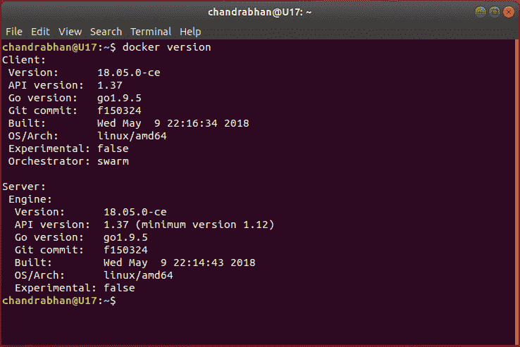
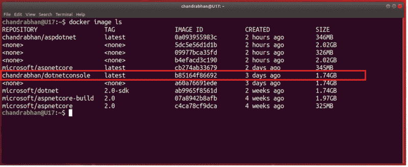
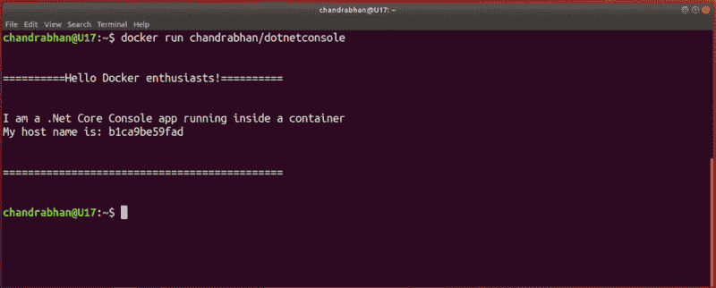
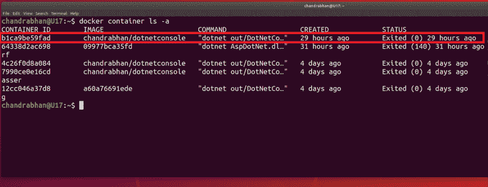
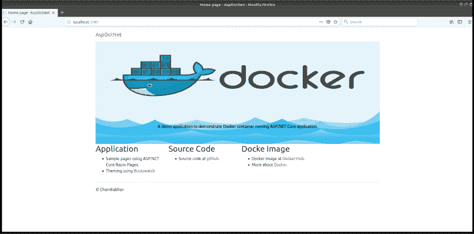
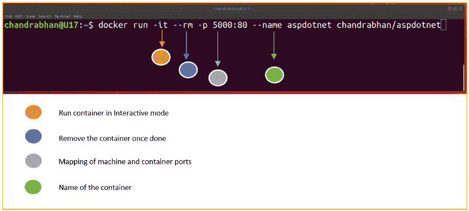

# 让我来指导你和 Docker 的第一次约会

> 原文：<https://www.freecodecamp.org/news/let-me-guide-you-through-your-first-date-with-docker-f03f35567d95/>

#### 安装 Docker，创建你的第一个容器，等等

你可能在网上的某个地方见过 Docker，你可能会对它感到好奇。现在你想更进一步。和 Docker 约会怎么样？不——我不是在开玩笑！

但是，你如何计划一次完美的初次约会呢？你该怎么办？去哪里找合适的资源？你可能需要什么先决条件？

问题层出不穷。遵循这些第一次约会的指导方针，你会很快找到第二次约会。

### 计划你的约会

在你开始计划之前了解你的约会对象对于打造难忘的第一次经历至关重要。这也会在会议中提升你的自信。

打招呼永远不嫌晚。如果你感兴趣的话，这里有一个关于我第一次见 Docker 的简短介绍。

好吧！因此，我们今天要遵循的路线图如下所示:

1.  设置场地
2.  皮卡
3.  对话

### **前奏**

我们安排约会的地方是 Docker engine。

Docker 引擎与任何其他引擎没有什么不同。它是各种组件协同工作的组合。

我们将在本文后面看到其中的一些组件。但是现在，让我们用 Docker 来装饰我们的机器。安装过程取决于您的操作系统。

不间断执行的关键是始终参考一个官方网站。Docker 有这个神奇的[指南](https://docs.docker.com/install/)，在这里你可以找到更多关于安装的信息。

Docker 有两种版本:Docker 社区版(CE)和 Docker 企业版(E.E .)。出于演示的目的，我们必须坚持使用社区版。企业版是付费的。此外，为第一次约会做昂贵的预订不是个好主意？

### 场地

任何吉祥日期的核心咒语是选择合适的见面地点。Meeting Docker 也不例外。首先要定平台。云？麦克。Linux？还是 Windows？一旦我们了解了我们的环境，我们就可以选择最简单的方式来设置会场。

#### Windows 操作系统

如果您选择的是 Windows，安装过程非常简单。记住我们最喜欢的过程:下一个，下一个，下一个，然后结束。

跳转到下载[页面](https://store.docker.com/editions/community/docker-ce-desktop-windows)，选择“边缘频道”Edge 具有实验特性，最适合我们的学习目的。

**注意！** Docker for Windows 需要“Hyper-V”功能，但没什么好担心的——Docker 会为你开启。但是，这意味着你不能使用虚拟盒子。

#### Linux 操作系统

当我第一次开始在 Linux 机器上做实验时，我认为这将是一场噩梦。但是让我欣慰的是，在 Linux 发行版上安装 Docker 非常简单。同样，在 Linux 发行版上安装 Docker 有很多方法。

我最喜欢的是:“使用方便的脚本安装。”我们从互联网上获取一个很长的 shell 脚本，然后通过管道将其传输到 shell 终端。

怎么会？像这样:

```
sudo wget -qO- https://get.docker.com |sh
```

**搞定**！是的，你机器上的 Docker 已经启动并运行了。

既然场地都布置好了，我们准备开始了。但首先，让我们做一些调查，以确保这里一切正常。就像你在预定餐桌前询问餐馆一样？。

让我们在终端中执行下面的命令:

```
docker version
```

您应该可以看到安装细节。它给你关于**客户端**和**服务器**版本、 **Go-lang** 版本等等的信息。

如果您的命令输出像下面这样，那么阳光灿烂，世界美好。**下一个**:是时候准备“接人”了



Command output

### **皮卡**

您可能已经知道，Docker 使用**图像**来创建容器。这些图像是大型二进制不可变文件。

映像包含应用程序二进制文件及其依赖项。它还可能包含其他组件，如 web 服务器甚至操作系统。

我们将需要这样的图像来创建一个容器，并在其中运行应用程序。

那么，这些图像生活在哪里？简单的问题，简单的答案:在主机上。这个主机可以是你的机器，也可以是互联网上某个地方的注册表。Docker 的注册中心叫做 Docker-Hub。

#### 为了避免走神，你应该知道约会的正确地点。

为了让你的第一次约会更顺利，我找到了一张照片的确切位置，可以和你分享。够兴奋了吧？给你！

```
docker pull chandrabhan/dotnetconsole
```

让我们确认我们是在正确的位置。？

```
docker image ls
```



command output

在这里，您可以看到机器上图像的各种属性。酷，目前看来一切都很顺利。

在继续之前，让我们分解前面的两个命令，了解这里发生了什么。

使用`Docker pull`，我们请求 Docker 守护进程为我们拉一个图像。这个守护进程在本地注册表中找不到这个映像，所以它从 Docker-Hub 中提取了一个远程副本。

通过`docker image ls`,我们看到了所有可用的图像及其属性。

我必须承认，我越来越兴奋。到目前为止，我们做得很好。接下来，让互动开始。

### 对话

#### 开始对话，事情会变得对你有利。

所以，为了让你更顺利，我想给你一些破冰的方法。

我们将为创建一些容器。Net 核心框架应用程序。第一个是一个简单的控制台应用程序。另一个会更丰富一些——一个网络应用程序。

```
docker run chandrabhan/dotnetconsole
```



command output

宏伟！你看到那里发生了什么吗？这东西太棒了。一个. Net 核心应用程序正在一个容器中运行。Docker 创建了一个容器，并在其中执行应用程序。控制台应用程序一结束，容器就存在了！

让我们看看我们的机器中有多少容器:

```
docker container ls -a
```



command output

你在这里看到的是你机器上的容器列表。您可以通过容器的`**ID**`来识别容器。输出告诉我们容器什么时候是`**CREATED**`以及它当前的`**STATUS**` 是什么。我们创建的容器处于`**Exited**`状态。记得吗？我们的应用程序已退出！容器也是。

看起来谈话进展顺利，所以让我们继续下去。

```
docker run -it --rm -p 5000:80 --name app chandrabhan/aspdotnet
```

去你最喜欢的浏览器浏览`http://localhost:5000`。你应该看到更多令人惊奇的东西。

一个 ASP.Net 核心 web 应用程序正在一个容器内运行:



containerized - sample ASP.Net application

在进一步讨论之前，我们先来看一下上面命令的结构。



command anatomy

你注意到了吗？这一次我们没有提取图像，但是我们仍然能够从中创建一个容器。当您执行`docker run`时，Docker 守护进程试图找到映像的本地副本。如果找不到，它会继续尝试在默认注册表中找到它(在本例中是 Docker-Hub)。

我相信我们的计划非常好，执行也非常好。让我们回顾一下我们所做的，回顾一下我们是如何与 Docker 计划一个吉祥的约会的？。

### **倒带**

1.  首先，我们安装了 Docker。我们看到了安装过程如何因操作系统而异。
2.  然后我们从 Docker-Hub 注册表中提取了一个图像，这是一个简单的。Net Core 控制台应用程序。
3.  一旦我们的机器上有了这个图像，我们就使用 Docker 从这个图像中创建一个容器。
4.  我们还了解了如何通过一个命令获取图像和运行容器。

这里有一个插图，可以帮助你理解一个高层次的画面。


illustration: Docker client and daemon

### 追踪

#### 眼不见心不烦

跟进和约会中的其他阶段一样重要。现在我应该离开你和你的约会，想听听进展如何。以下是一些可能有用的链接:

*   [Github](https://github.com/SinghChandrabhan/DockerSamples)
*   坞站枢纽