# 如何在学习编码的同时学习 Git 和 GitHub

> 原文：<https://www.freecodecamp.org/news/how-you-can-learn-git-and-github-while-youre-learning-to-code-7a592ea287ba/>

伊阿古·罗德里格斯

# 如何在学习编码的同时学习 Git 和 GitHub


The great nova representing the explosion of knowledge.

在本文中，我会给你一些如何成为 Git/GitHub 忍者的提示。另外，作为奖励，我将向您展示如何在编码时使用**终端** (shell) 。所以如果你是一个初学者，这篇文章可以帮助你理解这项技术。如果你已经是一个忍者了，看一下可以帮助你记起你可能已经忘记的事情。

### 简短的介绍

作为软件开发人员，Git 和 GitHub 是我们日常工作中极其重要的工具。但是，当我们学习代码的时候，我们有太多的事情要做，我们如何学习它们呢？

我是埃古·罗德里格斯，巴西人。我是系统信息专业的学生，软件开发实习生，自由职业者。我正处于职业生涯的开端，我想与你分享我获得的一些知识。所以，拿上你的咖啡，让我们开始吧！

如果你是葡萄牙语读者，请点击[这里](https://medium.com/trainingcenter/plano-para-estudar-git-e-github-enquanto-aprende-programa%C3%A7%C3%A3o-f5d5f986f459)。

你可以用这个计划来学习任何编程语言，比如 JavaScript、Python、Node，还有 HTML 和 CSS。你正在学习什么技术并不重要——用 Git 版本化你的工作是编程的默认方式。

### 准备环境

在开始之前，我们需要设置环境来保存我们的代码和我们正在学习的例子。

为此，我们必须完成一些要求:

*   在我们的机器上安装 Git
*   创建 GitHub 帐户
*   在我们的机器上创建一个工作空间

如果你已经这样做了，你可以直接进入 **GitHub 的工作流程和终端**部分。

#### 在您的机器上安装 Git

Git 在每个操作系统上的安装是不同的。查看 [Git 的](https://git-scm.com/downloads)官方网站，看看哪种方式适合你。

但是如果你用的是 Windows(并且会说葡萄牙语)，我推荐[这篇](https://woliveiras.com.br/posts/instalando-o-git-windows/)文章。

一旦安装了 Git，我们需要创建一个 GitHub 帐户并在我们的机器上配置它。

#### 在 GitHub 上创建帐户

要创建帐户，请访问 GitHub 网站并填写主表单。

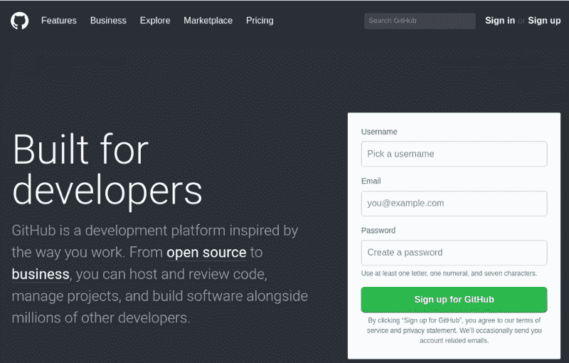

This form is the first thing that appears if you enter the website without being logged in

我建议你在这里选择一个真实、好听的用户名，这样你就可以使用简历上的账户或者你的 [LinkedIn](https://www.linkedin.com/in/iago-rodrigues/) 账户。

你需要通知 GitHub 你想用哪个方案。选择**自由**选项。唯一的区别是，你可以用付费计划设置私人存储库。

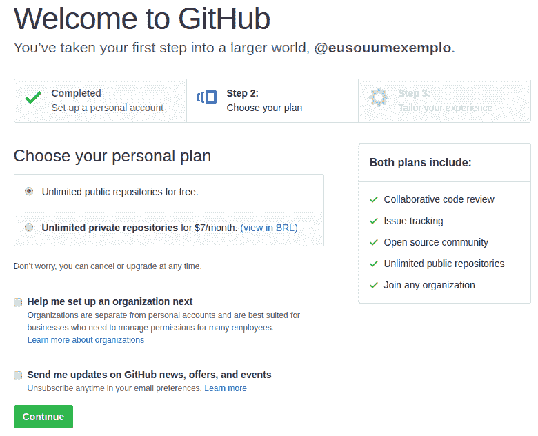

Choosing your GitHub account’s plan.

GitHub 会在完成你的帐户设置之前询问一些事情。您现在可以回答这些问题，或者直接跳到下一个屏幕。

一切都完成了，我们可以开始我们的项目了。

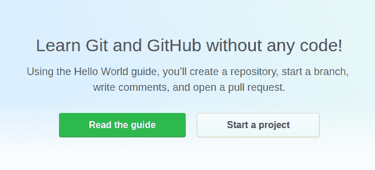

Confirmation screen.

不过，在我们创建存储库之前，让我们在机器中设置 GitHub 电子邮件和用户名。

#### 用 GitHub 数据建立我们的系统

打开你的终端。在 Windows 中，你必须打开**开始菜单**并输入 **cmd。**然后点击回车。

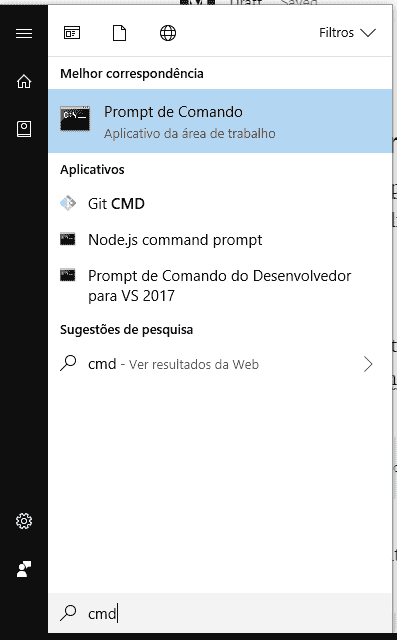

Acessing the CMD via start menu on Windows

或者，你可以安装 [cmder](http://cmder.net/) (这是一个不错的选择)来使用它，而不是默认的 Windows 终端 **cmd** 。

这样，我们必须在 cmder 中执行以下 shell 命令:

```
git config --global user.name "our_GitHub_user_name"
```

现在输入您的 GitHub 电子邮件地址:

```
git config --global user.email "our_GitHub_user_email"
```

#### 设置您的 GitHub 访问密钥

无论何时通过 shell 访问存储库，您都需要拥有访问权限。这是在您登录 GitHub 帐户时授予的。但是，每次向存储库(repo)发送东西时，都必须传递凭证。

要避免这种情况，请使用 SSH 密钥。这是 GitHub 与我们机器上配置的密钥交换的访问密钥。

要创建这个密钥，请遵循 GitHub [文档](https://help.github.com/articles/adding-a-new-ssh-key-to-your-github-account/)中概述的过程。

所有的一切都配置好了，您可以开始了！


### GitHub 的工作流程和终端

让我们在这里建立一个**规则**:

每次你创建一个项目来研究某样东西，比如用 Node.js 制作一个 HTML 页面或命令行游戏或任何东西，你将创建一个存储库，在你的机器上克隆它，使用分支来处理它，并进行小的提交以发送到 GitHub *。*

成交？！

这将保证你获得一些掌握这些工具所需的经验。

所以让我们开始吧。

#### **创建新项目**

让我们回到你的 GitHub 页面，点击页面顶部的加号图标(+)。

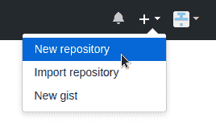

Creating a new repo.

点击**新建存储库**。

假设您正在创建一个项目来研究 HTML，那么将您的存储库命名为 **learning-html** 。它可以是正在创建的页面或任何项目的名称，例如:**html 课程**、**小蛇**、**井字游戏**、或其他什么*、*好吗？

项目描述是可选的。但是我认为在那里输入一些有用的文本是很重要的，因为它将确定你的项目的范围。如果其他人想帮助你，他们可以通过描述简单了解你的项目。对于您的情况，您可以输入类似于 **HTML 语言学习资源库**的内容。

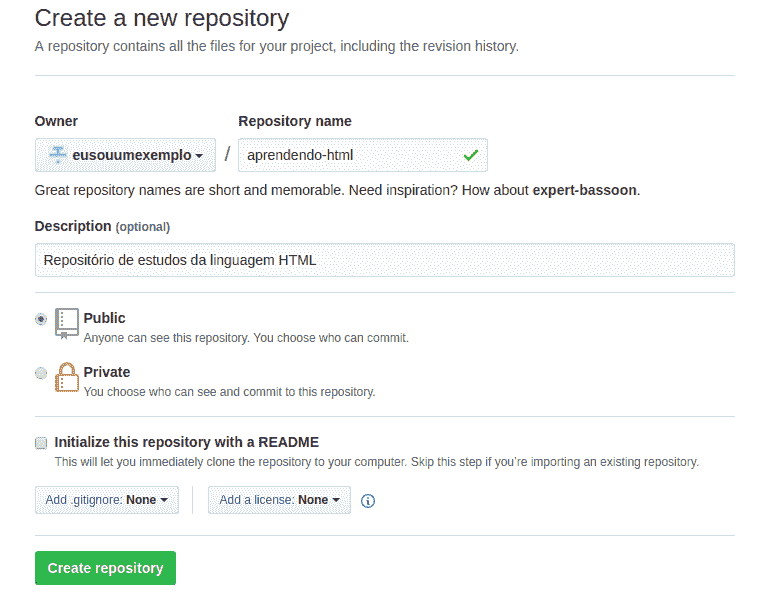

Creating a repository.

您还应该创建一个自述文件，并定义您将在项目中使用的许可类型。看看 READMEs 的这些好的[例子](https://gist.github.com/PurpleBooth/109311bb0361f32d87a2)，以及在这个项目上使用的[许可](https://choosealicense.com/)。

自述文件是对项目的更完整的描述，所以在其中放一些有用的信息是个好主意。遵循链接中的示例。

虽然许可证是可选的，但是定义它是一个好的做法。许可证会说明其他人可以对你的代码做什么。麻省理工学院许可证是最受欢迎的许可证之一，它允许你(和其他人)用这个项目做很多事情。如果你愿意，花些时间搜索其他类型的许可证。

#### **创建您的工作空间**

一旦创建了存储库，就可以在您的机器上克隆它。但是在此之前，您需要创建一个文件夹，您将在其中克隆您将来工作的所有存储库。

使用终端创建一个文件夹，作为您的**工作空间**。你这样做是为了保持一个有组织的系统，否则你最终会将你的项目分散开来(你可能会丢失它们，就像你丢失了你保存在电脑上的小猫 gif 图片一样……)。

假设你已经安装了 cmder，我们现在可以打开它(如果你没有，现在是一个好时机)，我们将在`C:/Users/your_computer_name`。

如果您不在此路径上，请使用以下命令:

```
cd %home%
```

运行命令`mkdir folder_name`创建工作空间。例如:

```
mkdir workspace
```

就是这样！现在您有了项目的默认文件夹，您可以在那里克隆您的存储库。

#### **克隆您的存储库**

克隆一个资源库意味着您将把 GitHub 服务器上的所有文件和目录复制到您的机器上，这样您就可以使用它们了。

现在您需要将您在 GitHub 上创建的项目克隆到您的**工作区。**为此，请转到您刚刚创建的文件夹。在 cmder 上，键入:

```
cd workspace\
```

**提示**:如果你创建了一个文件夹或者想要访问一个已经存在的文件夹，你可以开始输入它的名字并点击 TAB，cmder 会自动为你完成这个名字。

然后，进入 GitHub 上的项目页面，获得克隆资源库所需的链接。

链接在名为**绿色按钮中，克隆或下载**:

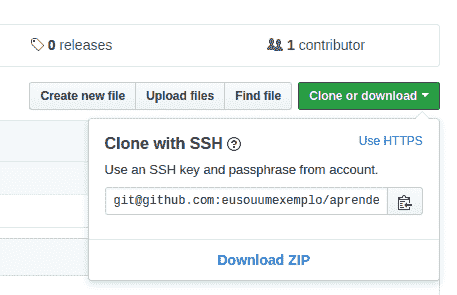

Getting the link to clone our repo.

从 HTTPS 更改为 SSH，因为您已经在帐户中配置了访问密钥。

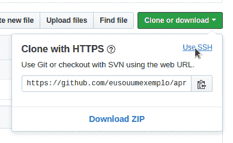

Changing https to ssh link.

现在您可以运行`git clone`命令并传递您得到的链接。就这样:

```
git clone git@github.com:our-username/learning-html.git
```

您的存储库将被克隆，如下图所示:

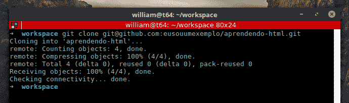

Clone confirmation message.

您可以访问克隆时在工作区中创建的存储库文件夹。

键入命令:`cd learning-html/`

**注意**:我假设你现在在`workspace`仓库里。如果不是，上面的命令将不起作用。使用`cd %home%\workspace\`，然后使用上述命令。

#### **创建分支**

每次你在一个用 Git 版本化的项目中改变一些东西，你应该用你正在处理的任务的名字创建一个**分支**。这可以防止你弄乱位于**主**分支上的“主”代码。为此，您可以使用以下命令:

```
git checkout -b task_name
```

一个**分支**就像一个树枝。这是树干的一部分。因此，您可以在不影响项目主要部分的情况下，对其进行并行更改。

例如:

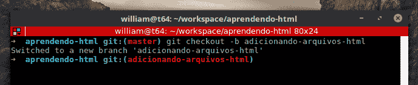

Changing branch.

一旦你做到了这一点，你就可以自动切换到新创建的分支，现在可以疯狂地编码了。


A kitty coding.

#### **提交更改**

一旦你完成了对项目的变更，你应该**提交**变更到你的远程存储库(GitHub 服务器上的那个)。

提交是为了告诉 Git 您正在将您的更改放入队列中，以便推送(发送)到您的远程存储库。

假设您刚刚创建了一个 HTML 页面，并向其中添加了一些标题和文本。现在您有了这个文档的第一个版本，所以您应该提交它。

要做到这一点，运行一些命令，让 Git 理解我们想要将我们的更改发送到远程 repo。运行`git add file_name`来告诉 Git 暂存文件。

或者，您可以运行`git add --all`来发送您做了一些更改的所有文件。使用`git status`命令，您可以看到哪些更改的文件将提交给服务器。

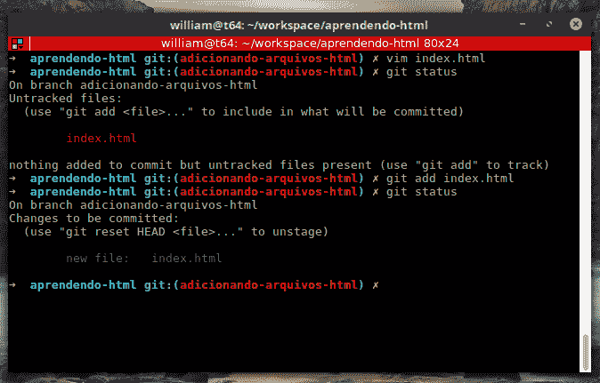

Example of the first version of a file.

在上面的例子中，创建了**index.html**文件，并运行了 **git status** 命令来查看发生了什么变化。然后使用 **git add** 添加文件，并再次运行 **git status** 来查看哪个文件被添加到 git 工作区。

现在你可以**提交**修改了。只需运行 **git commit** 命令，就像`git commit -m "commit_message"`一样。记住要包含一条描述性消息，说明提交中添加了什么内容。

#### **合并变更**

在您提交了更改之后，您现在拥有了一个在**主**分支之前进行了修改的分支。这意味着您有一个不同版本的项目，并且您需要将那些变更与项目的主版本合并。在此之前，验证分支之间的差异。在您的分支上，执行命令:

```
git diff master
```

输出将类似于:

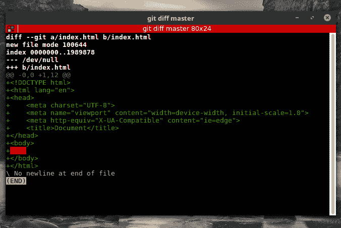

Git diff output.

Git 向您展示了最新的提交，添加或更改了哪些文件，以及更改了哪些内容。

既然你知道你的分支和主分支之间有差异，你需要**合并**它们**加入**你在分支中做出的新提交，以及主分支中的代码。为此，您需要转到 cmder 上的主分支，并运行命令`git merge`。

要回到主程序，运行`git checkout master`。要合并提交，运行`git merge our_branch_name`。

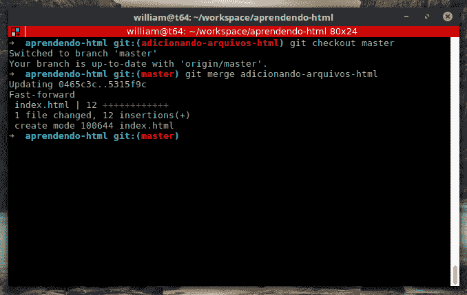

Merging example.

Git 将显示一个确认添加内容的输出。

#### **发送到 GitHub**

在您完成并合并了所有的更改之后，您现在可以将它们发送到您在 GitHub 上的远程存储库。

您将使用`git push origin master`来完成这项工作。

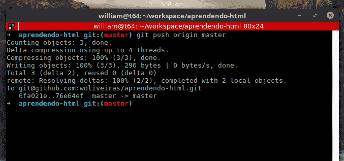

Push our changes to the remote repo.

也可以只用`git push`。会有同样的结果。但是当您第一次在您的工作空间上推送更改时，您需要做`git push origin master`以便 Git 知道您的工作空间是推送的起点。

现在，您的提交将出现在 GitHub 存储库的页面上:

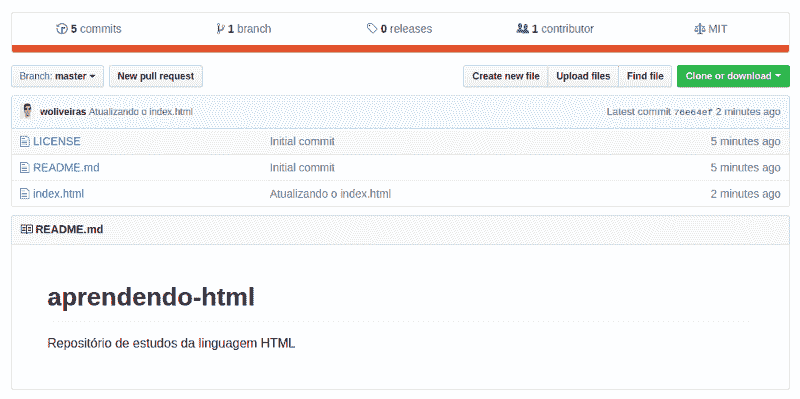

The last commit which we just did is showed on the project’s page on github.

### 结论

在本教程中，您学习了如何在 GitHub 上创建一个项目，这样您就可以在每次学习新东西时跟踪自己的进度。这将帮助您了解命令行(终端)、Git 命令和 GitHub。除此之外，它将帮助你创建一个不错的文件夹，你可以在工作面试中展示。

像这样练习还会帮助你更好地理解如何将 **Git 用于远程存储库**(存储库托管在像 **GitHub** 这样的平台上)。您还将在终端上提升自己的知识和技能。

不要忘记你制定的基本规则:

*   总是创建一个新的学习项目
*   在树枝上工作
*   提交更改，直到将它们推送到 GitHub

好吗？:)

每当你忘记一些事情的时候，回到这里，按照这个一步一步的指导去做！

我叫伊阿古·罗德里格斯。我在巴西的贝伦市实习。

你可以在社交媒体上关注我。我很乐意尽我所能帮忙。

[**伊阿古罗德里格斯(@iagokv) |推特**](https://twitter.com/iagokv)
[*伊阿古罗德里格斯最新推文(@iagokv)。前端开发者| Vue.js 学徒| Noob on life。巴西贝伦*twitter.com](https://twitter.com/iagokv)

耶！我知道。我的推特照片有点…