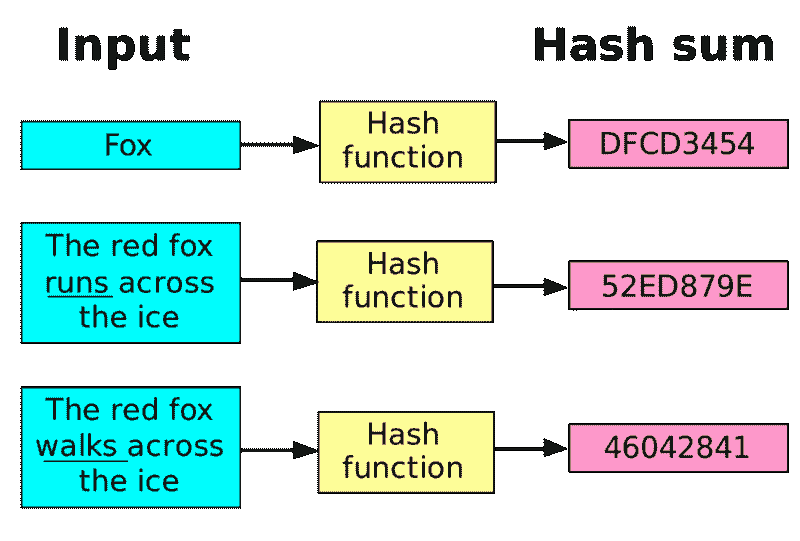
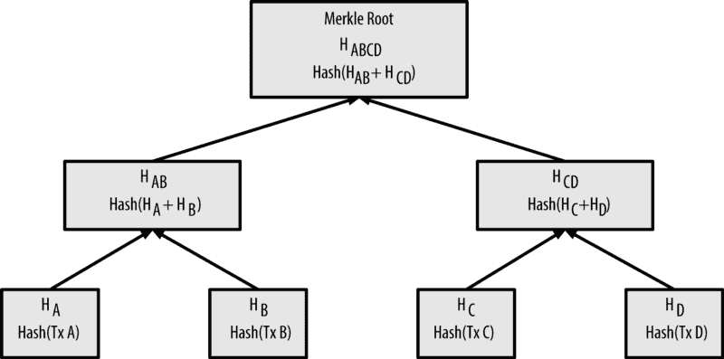
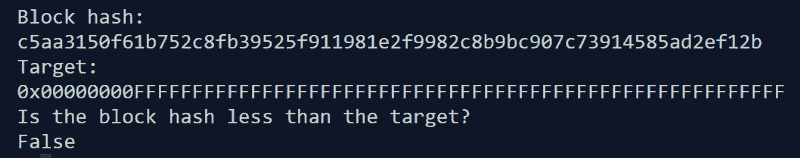
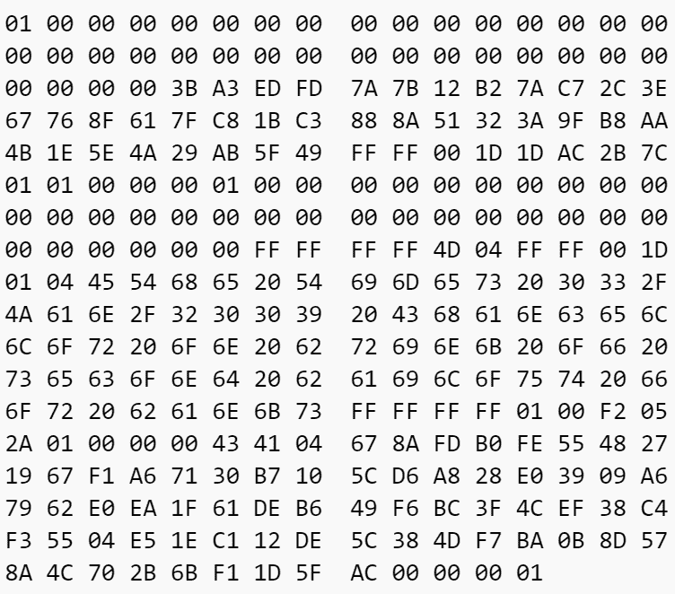
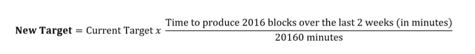
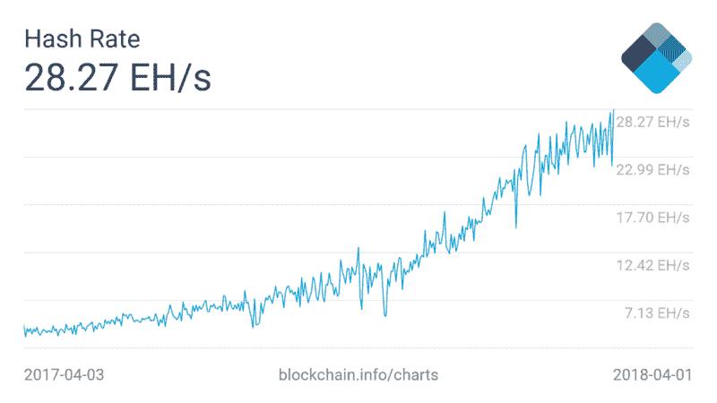

# 比特币挖矿是如何运作的

> 原文：<https://www.freecodecamp.org/news/how-bitcoin-mining-really-works-38563ec38c87/>

Subhan Nadeem

# 比特币挖矿是如何运作的


随着比特币接近主流采用和认可，其被称为挖掘的基本安全模型正日益受到关注和审视。

人们越来越关注和感兴趣的是比特币开采的环境影响、底层模型的安全性和去中心化程度，甚至是一项量子计算的突破对比特币和其他加密货币未来的潜在影响。

通常，工作证明被描述为“密码难题”，但是这个难题到底是什么呢？

为了真正理解这些问题(以及任何可能的答案)，你需要对比特币挖矿本身及其演变有一个基本的了解。

本文将探索工作证明的所有技术组件和移动部分，以及它们如何无缝地相互同步，以使比特币成为今天的去中心化平台。

### 为什么挖掘有效:加密单向散列

比特币区块链通常被描述为一个加密安全的数据库，因此是不可变的。增强这种不变性和安全性的底层技术是**加密散列。**

简单地说，加密散列函数是一种数学函数，它接受任何输入并将其映射到固定大小的字符串。

然而，这些函数有四个特殊属性，使它们对比特币网络来说非常宝贵。它们是:

1.  **确定性—** 对于加密哈希函数的任何输入，结果输出总是相同的。
2.  **快速** —在给定任何输入的情况下，计算散列函数的输出是一个相对快速的过程(不需要大量计算)
3.  **唯一—** 函数的每个输入都应该产生一个完全随机且唯一的输出(换句话说，没有两个输入会产生相同的输出)
4.  **不可逆—** 给定哈希函数的输出，无法获得原始输入

这些规则为比特币挖矿提供了保障网络安全的基础。

特别是比特币协议的创建者 Satoshi Nakomoto 选择使用 [SHA-256 哈希函数](https://en.wikipedia.org/wiki/SHA-2)作为比特币挖矿的基础。这是一个特定的加密哈希函数，已经从数学上证明了它具有上述特性。它总是输出一个 **256 位数**(最基本的计算单位)，为了便于阅读，通常用 64 个字符的十六进制数字系统表示。

SHA-256 函数的输出通常被称为其输入的**散列**。



A hash function’s input results in a completely unique output

下面是一个阿沙-256 函数输入输出的例子(你可以自己试试[这里](http://www.xorbin.com/tools/sha256-hash-calculator)):

```
Input to SHA-256:
<Bitcoin Transaction>
Output to SHA-256:
77077b1f4c3ad44c83dc0bdb8d937e9b71c0ef07a35c2664bb7da85be738eacf
```

有趣的是，在比特币协议中使用哈希的大多数地方，都使用了**双重哈希**。这意味着原始 SHA-256 函数的输出被放回 SHA-256 函数以获得另一个输出。这个过程是这样的:

```
Input to SHA-256(first round):
<Bitcoin Transaction>
Output (first round):
77077b1f4c3ad44c83dc0bdb8d937e9b71c0ef07a35c2664bb7da85be738eacf

Input to SHA-256 (second round):
77077b1f4c3ad44c83dc0bdb8d937e9b71c0ef07a35c2664bb7da85be738eacf
Output (second round and final result):
3c6c55b0e4b607b672b50f04e028a6951aed6dc97b91e103fb0f348c3f1dfa00
```

双重散列被用来防止生日攻击。生日攻击是一种情况，攻击者能够通过使用完全不同的输入产生与另一个输入相同的散列(称为**冲突**)。这打破了**唯一性的第三个属性。**如果没有它，两个完全不同的比特币块可能会由完全相同的哈希来表示，从而允许攻击者潜在地切换块。

根据 SHA-256 函数，这种攻击发生的概率是无限小的。如果不是近乎不可能，SHA-256 将被视为破产。

然而，其他散列函数在过去已经被“破坏”了。为了防止这种情况在未来发生在 SHA-256(并有效地打破比特币的安全模式)，最好的办法是**散列哈希**。这使冲突发生的概率减半，使协议更加安全。

在非常高的层面上，比特币挖矿是一个所有比特币交易都发送给比特币矿工的系统。挖掘者选择一兆字节的交易，将它们作为输入捆绑到 SHA-256 函数中，并试图找到网络接受的特定输出。第一个发现这一产出并将区块发布到网络的矿工将获得交易费和创造新比特币的奖励。

让我们更进一步，深入比特币区块链本身，看看矿工们到底是如何确保网络安全的。

### 比特币挖矿:技术介绍

采矿被引入作为解决重复花费问题的方法。如果我有 1 个比特币，我将它发送给鲍勃，然后尝试将相同的比特币发送给爱丽丝，网络将确保只接受一笔交易。这是通过众所周知的挖掘过程实现的。

在深入研究技术细节之前，理解为什么挖掘对于保护网络是必要的是很重要的。由于法定货币已经存在，我们持有的货币是由联邦储备系统创造和验证的。由于比特币是在去中心化和共识的严格假设下运行的，因此不存在中央权威机构来验证该货币的发行并加盖时间戳，以及验证使用该货币进行的任何交易。

中本聪提出了当时唯一已知的在共识导向系统中解决这一验证问题的解决方案。在比特币白皮书中被称为**工作证明**的这种方案优雅地证明了交易是由那些愿意花费足够的物理计算能量和时间来这样做的人验证的，同时引入了一种激励来诱导市场竞争。这种竞争使得去中心化的属性在生态系统中有机地出现并茁壮成长。

### 街区内部的一瞥

比特币区块主要由两部分组成:

#### 1.以 **merkle 树**的形式进行交易

采矿计算机收集足够的事务来填充一个块，并将它们捆绑成一棵 merkle 树。

merkle 树是一个相对简单的概念:事务作为树叶位于树的底部，并使用 SHA-256 函数进行哈希运算。使用 SHA-256 函数再次散列两个叶事务的组合，以形成叶的双亲。该父事务与散列事务的其他父事务一起不断向上散列，直到创建了单个**根**。这个根的散列实际上是它下面的事务的唯一表示。



A visualization of how a merkle tree is built — the leaves at the very bottom of the tree are transactions

merkle 树的根是树中每个事务的散列的组合。

回想一下，对于散列函数的任何输入，输出完全是唯一的。因此，一旦网络上的大多数节点接收到挖掘的块，merkle 树散列的根就充当该给定块中所有事务的不可改变的摘要。

如果一个恶意的参与者试图改变一个块中的事务的内容，它的散列将被改变。散列的这种改变将沿着事务的 merkle 树向上传播，直到根的散列被改变。然后，任何节点都可以通过将已更改块的 merkle 树的根与有效块的 merkle 树的根进行比较来快速捕捉这种恶意行为。

#### 2.块标题

块头是块本身内容的总结。它包含以下**六个组件**:

*   比特币客户端运行的软件版本
*   块的时间戳
*   其包含事务的 merkle 树的根
*   它前面的块的哈希
*   一个随机数
*   **目标**

请记住，事务 merkle 树的根充当块中每个事务的有效摘要，而不必查看每个事务。

允许网络按照时间顺序正确放置块之前的前一个块的散列。这就是术语**区块链**的来源——每个块都链接到前一个块。

当前值和 T2 目标是采矿成功的关键。它们是解决矿工们需要解决的 SHA-256 难题的基础。

请注意，块头中的所有数据都使用一种叫做 [little-endian](https://bitcoin.stackexchange.com/questions/2063/why-does-the-bitcoin-protocol-use-the-little-endian-notation) 的符号压缩成 80 个字节，这使得在节点之间传输块头成为一个非常高效的过程。出于解释的目的，我们将忽略这种压缩，并假设数据是其原始形式。

### 解释采矿问题

存储在块头中的**目标**只是一个以位存储的数值。在传统的以 10 为基数的记数法中，这个目标的范围在 0 到 2 ⁴(一个 **67+数字**数)之间的任何地方，取决于有多少矿工同时在竞争解决这个问题。

回想一下，SHA-256 的产量只是一个数字。挖掘器的目标是获取当前块的头，给它添加一个名为 **nonce** 的随机数，并计算它的散列值。这个哈希值必须小于目标值。

这就是全部了。但是说起来容易做起来难。

回想一下 SHA-256 的第一个特性:一个散列函数的输入将总是产生相同的输出。因此，如果挖掘者获取块头，对其进行哈希运算，并意识到哈希值不小于目标值，那么他们必须以某种方式改变输入，以便尝试找到低于目标值的哈希值。

这就是**随机数**的用武之地。

挖掘器将一个名为 **nonce** 的数字(从 0 开始)添加到块头，并对该值进行哈希运算。如果哈希值不小于目标值，挖掘器会将 nonce 增加 1，再次将其添加到块头，并对更改后的值进行哈希处理。这个过程不断重复，直到找到小于目标值的散列。

#### 采矿的例子

下面是组成第一个块头的大致情况:

*   Genesis 块中事务的 merkle 根:

```
Merkle Root:
4a5e1e4baab89f3a32518a88c31bc87f618f76673e2cc77ab2127b7afdeda33b
```

*   已知的第一个比特币版本:`0.1.0`
*   块的时间戳:`2009–01–03 18:15:05`
*   目标(这也是最高的目标):

```
Target:
0x00000000FFFFFFFFFFFFFFFFFFFFFFFFFFFFFFFFFFFFFFFFFFFFFFFFFFFFFFFF
```

*   没有以前的块哈希—这是第一个块，因此这是一个独特的情况

将组件相加后的最终块标题:


The Genesis block data (this includes the nonce, but lets pretend it doesn’t), source: [bitcointalk](https://bitcointalk.org/index.php?topic=52706)

让我们用这个大的头来计算双重散列:

```
SHA-256 of header:
7d80bd12dfdccbdde2c41c9f406edfc05afb3320f5affc4f510b05a3394e1c91

SHA-256 of the previous result (final result):
c5aa3150f61b752c8fb39525f911981e2f9982c8b9bc907c73914585ad2ef12b
```

当转换为基数 10 时，目标和输出散列都是非常大的数字(记住，超过 67 位)。下面的 Python 函数没有尝试在这里演示两者的比较，而是处理比较:

```
def isBlockHashLessThanTarget(blockHash, target):
    return int(blockHash, 16) < int(target, 16)
```

如果哈希值小于目标值，则返回 True，否则返回 false。

以下是我们的目标和块哈希的结果:



现在，我们将原始的块十六进制值加 1。以下是结果:



Notice how the very last digit is now 1, due to the addition of the nonce

然后，我们对这些更改的数据运行相同的哈希算法并进行比较。如果没有低于目标，继续重复。

一旦找到成功的散列，用于找到该解决方案的最新 nonce 被保存在块中。

[创世块](https://blockchain.info/block-index/14849)上列出的随机数是 2，083，236，893。

这意味着 Satoshi Nakomoto 在找到可接受的哈希之前，重复了 20 亿次这一过程。

我写了一个这个 Genesis 块挖掘过程的小 Python 实现，可以在我的 [GitHub](http://github.com/subhan-nadeem/bitcoin-mining-python) 上找到。

[**subhan-nadeem/比特币-挖矿-python**](http://github.com/subhan-nadeem/bitcoin-mining-python)
[*比特币-挖矿-Python-Python 实现的比特币挖矿算法*](http://github.com/subhan-nadeem/bitcoin-mining-python)
[github.com](http://github.com/subhan-nadeem/bitcoin-mining-python)

看看你需要多长时间才能成功开采创世纪区块！

#### 一个警告:`extraNonce`

块报头中的随机数值存储为 32 位数字。这意味着任何人能够达到的最高随机数是 **2** (大约 40 亿)。经过 40 亿次迭代后，nonce 耗尽，如果找不到解决方案，矿工将再次陷入困境。

对此的解决方案是在 **coinbase** (一个块的事务内容，存储为 merkle 树)中添加一个名为 **extraNonce 的字段。**这个 extraNonce 的大小只受块本身大小的限制，因此只要块大小在协议限制内，它就可以是矿工希望的大小。

如果随机数的所有 40 亿个可能值都用完了，则添加 **extraNonce** 并递增到 **coinbase。**计算新的 merkle 根和随后的新块头，并且再次迭代**随机数**。重复这个过程，直到找到足够的散列。

最好避免在耗尽**随机数**之前添加 **extraNonce** ，因为对 extraNonce 的任何更改都会改变 merkle 树。这需要额外的计算，以便向上传播变化，直到计算出 merkle 树的新根。

#### 矿工奖励

最快成功发布区块的矿工将获得全新的比特币奖励，这是凭空创造的。该奖励目前为 12.5 BTC。这些比特币是如何产生的？

在开始开采区块之前，每个矿工只需向他们的区块添加一个新的输出交易，该交易将 12.5 个比特币归属于他们自己。一旦接收到新确认的块，网络协议将接受该特殊事务为有效。这种特殊的事务被称为**生成事务。**

采矿者的责任是在开采之前将该交易添加到区块中。已经有[至少一个案例](https://www.reddit.com/r/Bitcoin/comments/7n1ie5/someone_destroyed_125_newly_mined_bitcoins/)矿工在开采一个区块之前忘记在交易中加入奖励，实际上破坏了 12.5 BTC！

### 验证工作证明

假设我们的挖掘器发现了一个小于目标值的散列。这个挖掘器所要做的就是将挖掘出的块和最初的六个组件发布到任何连接的节点上。

接收该块的节点将首先验证事务集，确保所有事务都是有效的(例如，所有事务都经过适当的签名，并且硬币没有被重复花费和/或凭空产生)。

然后，它将简单地对块头进行**双散列**，并确保该值低于该块包含的目标值。一旦该块被认为是有效的，新节点将继续在网络上传播该块，直到每个节点都有最新的分类帐。

如您所见，任何给定的节点都可以轻松验证新发布的块。然而，向网络发布一个有效的块需要非常大的计算能力(因此，电力和时间)。这种不对称使得网络安全，同时允许希望在网络上进行经济活动的个人以相对无缝的方式进行经济活动。

### 封锁时间和调整目标

当第一批矿工开始采矿时，他们每个人都监控着**阻塞时间**。每个比特币区块都有一个 10 分钟的设定区块时间。这意味着给定网络上当前的计算能力水平(**网络**哈希拉特)，节点将总是期望平均每 10 分钟产生新验证的块。

我们可以合理地期望在 10 分钟内产生块，因为给定网络散列，找到块的概率是已知的。

例如，让我们以比特币中最简单的目标为例:创世纪区块。任何单个散列小于最容易的目标的概率是 1/2。那是四十亿分之一。因此，我们可以合理地期望有人运行 2 次挖掘问题的迭代，以便找到一个合适的散列。网络上的节点期望每 10 分钟在网络上的所有 矿工中运行 40 亿次这样的迭代。

如果在大样本大小的数据块中，数据块开始以快于 10 分钟的速度出现，这非常清楚地表明网络上的节点正在以远快于 10 分钟的速度遍历 40 亿个散列。这种情况会提示每个节点根据网络功率的增加(或减少)按比例调整目标，以确保每 10 分钟继续产生数据块。

实际上，网络上的节点监控跨越 **2016** 个块的块时间，精确到两周。每两周，将总阻塞时间与预期阻塞时间(20160 分钟)进行比较。

要获得新目标，只需将现有目标乘以过去两周的总实际阻塞时间的比率，即可获得预期的阻塞时间。这将根据进入或退出网络的计算能力的数量成比例地调整目标。



The formula to calculate the new target, run every 20160 minutes (two weeks) by each Bitcoin node

阻塞时间和轻松计算找到有效块的概率的能力使节点能够轻松地监控和确定网络上的总散列功率并调整网络。无论网络增加了多少计算能力或增加得多快，平均而言，阻塞时间将始终保持在 10 分钟。

网络上当前的总哈希速率为每秒 28.27 艾哈希。那就是 ***28.27 x 10 ⁸*** 哈希每秒在网络上的所有计算机上运行。



### 概括起来

我们现在已经全面涵盖了以下内容:

*   为什么加密单向散列对工作证明至关重要
*   一个比特币区块的构造分解
*   实际的挖掘过程和迭代本身
*   节点如何轻松验证其他块
*   网络如何通过监控阻塞时间和调整目标来维持算法和竞争力

现在，您应该能够理解并解释工作证明实际上是如何工作的，以及为什么它被认为是一种完全安全的算法，能够实现分散化和共识！

如果你将来对这些更深入、信息更丰富的文章感兴趣，请在 [Twitter](https://twitter.com/SubhanNadeem19) 和 Medium 上关注我！