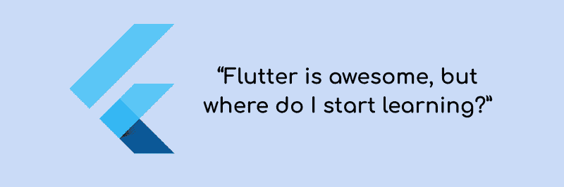

# “Flutter 很牛逼，但是我从哪里开始学呢？”

> 原文：<https://www.freecodecamp.org/news/learn-flutter-best-resources-18f88346ed0f/>

作者 Rohan Taneja

# “Flutter 很牛逼，但是我从哪里开始学呢？”

Flutter 是谷歌的移动应用 SDK，用于在创纪录的时间内在 iOS 和 Android 上制作高质量的原生界面。Flutter 支持现有代码，被世界各地的开发者和组织使用，并且是免费和开源的。

很长一段时间以来，我一直在考虑创建一个可以帮助任何人开始使用 Flutter 的优秀资源列表。如果你已经知道什么是 Flutter，为什么它很棒，请继续阅读。

如果你想了解更多关于 Flutter 的知识，我建议你在这里[和这里](https://flutter.io/)[阅读。一旦你接受了 Flutter 的想法，你可以回到这篇文章。](https://hackernoon.com/whats-revolutionary-about-flutter-946915b09514)

我已经尝试了下面提到的大多数资源，它们帮助我快速熟悉了 Flutter。下面提到的其他几个在 Flutter 社区非常受欢迎。

### 1.片段化广播

这个是金的吗？。在你开始编写 Flutter 应用程序之前，你应该仔细阅读下面两集。它们将帮助您了解 Flutter 是如何出现的，以及它的功能:

[**118:与 GDE·欧亨尼奥·马莱蒂共舞—第一部分**](http://fragmentedpodcast.com/episodes/118/)
[*在这一集里，我们将深入探讨我们最期待的话题之一——共舞。为了帮助我们…*fragmentedpodcast.com](http://fragmentedpodcast.com/episodes/118/)[**第 119 期:与 GDE·欧亨尼奥·马莱蒂共舞——第二部分**](http://fragmentedpodcast.com/episodes/119/)
[*在本系列的第二部分中，为了帮助我们深入了解旋舞，我们采访了旋舞的 GDE·欧亨尼奥·马莱蒂。第一部分……*fragmentedpodcast.com](http://fragmentedpodcast.com/episodes/119/)

如果我没有在三月份听这些，我可能不会兴奋地立即尝试 Flutter。这两集包括你需要知道的关于 Flutter 的“什么”和“如何”的一切。

### 2.Flutter 文档

这似乎是显而易见的，但官方文档是真的，真的很好，很全面。它包括易于掌握的基本用例示例。最棒的是，它还包括面向经验丰富的 Android、iOS、React Native 和 Web 开发人员的文档，以便您可以轻松地将 Flutter 与您当前的知识联系起来:

*   【Android 开发的颤振
*   [iOS 开发的颤振](https://flutter.io/flutter-for-ios/)
*   [为反应原生设备而颤动](https://flutter.io/flutter-for-react-native/)
*   [Web 开发的颤振](https://flutter.io/web-analogs/)

### **3。谷歌代码实验室**

一步一步的指南，以建立真棒颤振应用？什么样的初学者会不希望这样呢？这是每个初学者的必经之路。

[***谷歌 Codelabs***T5](https://codelabs.developers.google.com/?cat=Flutter) [谷歌 Codelabscodelabs.developers.google.com](https://codelabs.developers.google.com/?cat=Flutter)

### 4.awesome-flutter: Github 资源库

[**Solido/awesome-flutter**](https://github.com/Solido/awesome-flutter)
[*【awesome-Flutter——所有的 Flutter 资源来启动和开发您的项目！*github.co](https://github.com/Solido/awesome-flutter)

****终极指南**去扑资源。对初学者来说有点难，但看看“视频系列”部分，“博客”部分，以及“模板”下的应用程序。一旦你用 Flutter 开始了你的旅程，你将利用其他部分！**

### **5.Udacity 课程**

**[**使用 Flutter 构建原生移动应用| Udacity**](https://in.udacity.com/course/build-native-mobile-apps-with-flutter--ud905)
[*在…*in.udacity.com](https://in.udacity.com/course/build-native-mobile-apps-with-flutter--ud905)向谷歌的专家学习如何使用 Flutter 在 iOS 和 Android 设备上制作高质量的原生界面**

**谷歌 Flutter 团队提供的免费课程。我已经在 Udacity 学习了三年多，我强烈建议你在开始的时候学习这门课程。你大概需要两个星期来完成它(或者两天，如果你真的对 Flutter 有热情的话)。你会对 Flutter 的工作原理和编写 Flutter 应用程序的最佳实践有更好的理解。**

**即使您以前没有使用 Dart 的经验，您也可以继续学习这门课程，因为它非常容易掌握，尤其是如果您已经有了 Java 或 JS 的经验。**

### **6.颤动周刊**

**Flutter Weekly 是一份时事通讯，每周将热门的 Flutter 帖子、博客、教程等直接发送到您的收件箱**。所以你不需要到处寻找最好的博客。只要在一周内实践动手，并在周末学习最新的颤振资源。你写一个也可以提交你的。****

**[**【旋舞周刊】**](https://flutterweekly.net/)
[*由旋舞迷提供给旋舞迷的每周简讯。*flutterweekly.net](https://flutterweekly.net/)**

### ****7。@r_FlutterDev: Twitter****

**这个 twitter 机器人发布了从 [r/FlutterDev](https://www.reddit.com/r/FlutterDev/) Flutter 子 reddit 的所有内容。要在最新更新发布后立即获取它们，请为此帐户使用 Twitter 上的“打开移动通知”功能。**

**[**FlutterDev(@ r _ FlutterDev)| Twitter**](https://twitter.com/r_flutterdev?lang=en)
[*FlutterDev(@ r _ FlutterDev)的最新推文。来自 r/FlutterDev 的新帖子，一个关于谷歌新用户界面的子编辑…*twitter.com](https://twitter.com/r_flutterdev?lang=en)**

### **8.MTechViral: YouTube**

**MTechViral 是 YouTube 的一个频道，为移动应用程序提供教程。该频道包含一个颤振教程播放列表。教程真的很好，新的教程经常出现。有一个相应的脸书小组叫做“ [Let's Flutter](https://www.facebook.com/groups/425920117856409/) ”，你会发现那里有很多 Flutter 爱好者在互相回答问题。**

**[**MTechViral**](https://www.youtube.com/channel/UCFTM1FGjZSkoSPDZgtbp7hA)
[*充分利用现在。痴迷于完美的软件开发人员、教师和顾问，目前居住在法里达巴德…*www.youtube.com](https://www.youtube.com/channel/UCFTM1FGjZSkoSPDZgtbp7hA)**

### **包扎**

**如果您已经有了关于 Flutter 的想法，并且已经使用了一段时间，那么如果您在实现某个特定功能时遇到困难，有几个地方可以立即为您提供帮助:**

1.  **[Gitter Chat](https://gitter.im/flutter/flutter) **:** 你会在这里找到 Flutter GDEs、Googlers 和其他 Flutter 爱好者回答你的问题。**
2.  **懈怠**:**[minworks](https://mindorks.com/join-community)。**
3.  **Twitter **:** 你可以找到[尤金尼奥·马莱蒂](https://twitter.com/workingkills)(旋舞 GDE) **，** [塞斯·拉德](http://twitter.com/@sethladd) (产品经理，谷歌)和[尼莱·耶纳](http://twitter.com/nlycskn)(旋舞开发者关系团队)在 Twitter 上传播旋舞之爱，帮助旋舞社区成长。关注他们的推文，了解最新的颤振事件、会议、直播等。**
4.  **脸书 **:** [颤振手机 App 开发者](https://www.facebook.com/groups/392934177836346/)，[让我们颤振](https://www.facebook.com/groups/425920117856409/)**

**如果你想和一群 Flutter 爱好者一起学习，你也可以联系离你[最近的 Google 开发者小组](https://developers.google.com/programs/community/gdg/directory/)，请他们举办一个#FlutterExtended 活动。**

**那么……你觉得 Flutter 怎么样？**

***这样想。***