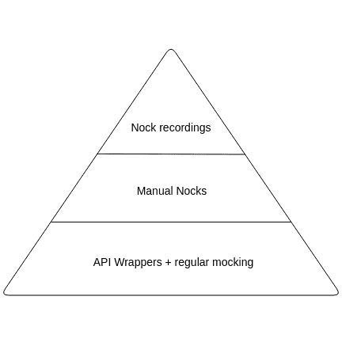
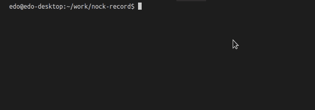

# 如何在节点中模拟单元测试请求

> 原文：<https://www.freecodecamp.org/news/how-to-mock-requests-for-unit-testing-in-node-bb5d7865814a/>

作者 Edo Rivai

# 如何在节点中模拟单元测试请求


“An old Philips cassette player and tape laying on a wooden floor in Italy” by [Simone Acquaroli](https://unsplash.com/@simoacqua?utm_source=medium&utm_medium=referral) on [Unsplash](https://unsplash.com?utm_source=medium&utm_medium=referral)

假设您已经[决定测试您的代码库](ttps://blog.kentcdodds.com/write-tests-not-too-many-mostly-integration-5e8c7fff591c)，并且您已经了解到[单元和集成测试不应该执行 I/O](https://medium.com/@_ericelliott/yes-i-am-clearly-saying-dont-unit-test-i-o-but-not-just-in-js-in-any-language-ca8ce5016942) 。您已经意识到需要模拟应用程序发出的出站 HTTP 请求，但是您不确定从哪里开始。

我决定在 twitter 上问问肯特·c·多兹(Kent C. Dodds)他是如何看待 HTTP 嘲讽的:

很公平，肯特！我想这个话题值得更详细的讨论。

#### TL；速度三角形定位法(dead reckoning)

当您需要测试发送 HTTP 请求的代码时，请尝试以下方法。

1.  从处理响应的业务逻辑中分离出 HTTP 请求。处理 HTTP 层协议的代码通常不是很有趣，并且可以说不需要测试。使用您选择的模仿工具来模仿您的 API 包装器。
2.  如果您确实需要测试特定于 HTTP 的代码，并且来自外部 API 的响应相对简单，请使用 Nock，并手动模拟请求。
3.  如果您需要测试的响应相当复杂，使用`nock-record`记录一次响应，并使用该记录进行后续测试。

由于测试社区痴迷于金字塔，这里你去:



HTTP Mocking pyramid. “API Wrappers + regular mocking” at the base. “Manual Nocks” in the middle. “Nock recordings” at the top.

### 输入`Nock`

我会说，NodeJS 领域的普遍共识是使用`[nock](https://github.com/node-nock/nock)`，它通过修补 Node 的本机`http`模块来工作。这真的很有效，因为即使你不直接使用`http`模块，大多数用户域库像`axios`、`superagent`和`node-fetch`仍然使用`http`。

编写和使用一个`Nock`看起来像这样:

```
// Set up an interceptornock('http://www.example.com')  .post('/login', 'username=pgte&password=123456')  .reply(200, { id: '123ABC' });
```

```
// Run your code, which sends out a requestfetchUser('pgte', '123456');
```

在上面的例子中，`fetchUser`将向`example.com/login`发送一个 POST 请求。Nock 将拦截请求，并立即响应您的预定义响应，而不会实际攻击网络。厉害！

### 没那么简单

当我第一次开始使用 Nock 时，我急切地开始在我的单元测试中使用它。然而，我很快感觉到我花在编写 Nocks 上的时间比实际测试业务逻辑的时间还多。对此的一个解决方案是**将你的请求代码从你的业务逻辑**中分离出来。让我们看一些代码。

```
async function getUser(id) {  const response = await fetch(`/api/users/${id}`);    // User does not exist  if (response.status === 404) return null;
```

```
 // Some other error occurred  if (response.status > 400) {    throw new Error(`Unable to fetch user #${id}`);  }    const { firstName, lastName } = await response.json();  return {    firstName,    lastName,    fullName: `${firstName} ${lastName}`  };}
```

上面的代码向`/api/users/<user` id >发出一个请求，当找到一个用户时，它接收一个包含`ing a fir` stNam `e and la` stName 的对象。最后，它构造了一个对象，该对象有一个额外的`field fu` llName，它是根据从请求中收到的名字和姓氏计算出来的。

此功能的测试套件如下所示:

```
it('should properly decorate the fullName', async () => {  nock('http://localhost')    .get('/api/users/123')    .reply(200, { firstName: 'John', lastName: 'Doe });    const user = await getUser(123);  expect(user).toEqual({    firstName: 'John',    lastName: 'Doe,    fullName: 'John Doe'  });});
```

```
it('should return null if the user does not exist', async () => {  nock('http://localhost')    .get('/api/users/1337')    .reply(404);    const user = await getUser(1337);  expect(user).toBe(null);});
```

```
it('should return null when an error occurs', async () => {  nock('http://localhost')    .get('/api/users/42')    .reply(404);    const userPromise = getUser(42);  expect(userPromise).rejects.toThrow('Unable to fetch user #42');});
```

如您所见，这些测试中进行了大量工作。让我们把这个功能分成两部分:

*   发送和处理 HTTP 请求的代码
*   我们的商业逻辑

我们的例子有点做作，因为我们仅有的业务逻辑是“计算”`fullName`。但是你可以想象一个真实世界的应用程序会有多复杂的业务逻辑。

```
// api.jsexport async function getUserFromApi(id) {  const response = await fetch(`/api/users/${id}`);    // User does not exist  if (response.status === 404) return null;
```

```
 // Some other error occurred  if (response.status > 400) {    throw new Error(`Unable to fetch user #${id}`);  }
```

```
 return response.json();}
```

```
// user.jsimport { getUserFromApi } from './api';
```

```
async function getUserWithFullName(id) {  const user = await getUserFromApi(id);  if (!user) return user;
```

```
 const { firstName, lastName } = user;  return {    firstName,    lastName,    fullName: `${firstName} ${lastName}`  };}
```

为了不让您厌烦，我只向您展示我们业务逻辑的测试。现在，您可以使用您选择的模拟库来模拟我们自己的 API 包装器，而不是使用 Nock 来模拟 HTTP 请求。我更喜欢 [Jest](https://facebook.github.io/jest/) ，但是这种模式并不局限于任何特定的嘲讽库。

```
// The function we're testingimport { getUserWithFullName } from './user';
```

```
// Only imported for mockingimport { getUserFromApi } from './api';
```

```
jest.mock('./api');
```

```
it('should properly decorate the fullName', async () => {  getUserFromApi.mockResolvedValueOnce(    { firstName: 'John', lastName: 'Doe }  );    const user = await getUserWithFullName(123);  expect(user).toEqual({    firstName: 'John',    lastName: 'Doe,    fullName: 'John Doe'  });});
```

```
it('should return null if the user does not exist', async () => {  getUserFromApi.mockResolvedValueOnce(null);    const user = await getUserWithFullName(1337);  expect(user).toBe(null);});
```

如您所见，我们的测试看起来更干净一些。所有的 HTTP 开销现在都包含在 API 模块中。我们有效地做的是最小化知道 HTTP 传输的代码表面。通过这样做，我们在测试中最小化了使用 Nock 的需求。

### 但是 HTTP 逻辑正是我要测试的！

我听到了。有时候，到外部 API 的连接正是您想要测试的。

我已经展示了如何使用 Nock 模拟一个非常基本的 HTTP 请求。为这种简单的请求/响应对编写显式的 Nocks 非常有效，我建议尽可能坚持这样做。

然而，有时请求或响应的内容会变得相当复杂。为这种情况编写手动 Nocks 很快变得乏味而且脆弱！

这种情况的一个非常明显的例子是测试刮刀。scraper 的主要职责是将原始 HTML 转换成有用的数据。然而，当测试你的 scraper 时，你不希望手动构造一个 HTML 页面来输入 Nock。此外，您打算抓取的站点已经有了您想要处理的 HTML，所以让我们利用它吧！想想笑话快照，对 HTTP 的嘲讽。

#### 从媒体抓取主题

假设我想知道媒体上所有的话题。


Screenshot of medium.com homepage, showing the list of available topics

我们将使用`scrape-it`请求媒体主页，并从所有匹配`.ds-nav-item`的元素中提取文本:

```
import scrapeIt from "scrape-it";
```

```
export function getTopics() {  return scrapeIt("https://medium.com", {    topics: {      listItem: ".ds-nav-item"    }  }).then(({ data }) => data.topics);}
```

```
// UsagegetTopics().then(console.log);// [ 'Home', 'Tech', 'Culture', 'Entrepreneurship', 'Self', 'Politics', 'Media', 'Design', 'Science', 'Work', 'Popular', 'More' ]
```

？看起来不错！

现在，我们如何在测试中模拟实际的请求呢？实现这一点的一个方法是在我们的浏览器中进入 medium.com，查看源代码，然后手动将其复制/粘贴到 Nock 中。这既繁琐又容易出错。如果我们真的想要整个 HTML 文档，我们还不如让计算机替我们处理。

原来 [Nock 有一个内置的机制](https://github.com/node-nock/nock#recording)叫做“记录”。这让您可以使用 Nock 拦截器来拦截实际的 HTTP 流量，然后将请求/响应对存储在一个文件中，并使用那个**记录** 用于将来的请求。

就个人而言，我发现 Nock 录音的功能非常有用，但它的人体工程学可以改进。因此，这里是我的[无耻插头`nock-record`](https://github.com/edorivai/nock-record) ，一个更符合人体工程学的图书馆来利用录音:



Screencast of nock-record in action. Showing how an initial test run sends out actual HTTP requests, and subsequent runs will use the recordings of the first run to prevent future requests.

让我们看看如何使用`nock-record`测试我们的刮刀:

```
import { setupRecorder } from 'nock-record';import { getTopics } from './index';
```

```
const record = setupRecorder();
```

```
describe('#getTopics', () => {  it('should get all topics', async () => {    // Start recording, specify fixture name    const { completeRecording } = await record('medium-topics');
```

```
 // Our actual function under test    const result = await getTopics();        // Complete the recording, allow for Nock to write fixtures    completeRecording();    expect(result).toEqual([      'Home',      'Tech',      'Culture',      'Entrepreneurship',      'Self',      'Politics',      'Media',      'Design',      'Science',      'Work',      'Popular',      'More'    ]);  });});
```

我们第一次运行这个测试时，它会发出实际的请求来获取 Medium 主页的 HTML:

```
✓ should get all topics (1163ms)
```

第一次运行后，`nock-record`在
`__nock-fixtures__/medium-topics.json`将记录保存到文件中。对于第二次运行，`nock-record`将自动加载录音，并为您设置一个 Nock。

```
✓ should get all topics (116ms)
```

如果你以前使用过 Jest 快照，你会觉得这个工作流程非常熟悉。

通过利用录音，我们现在获得了三样东西:

1.  确定性:您的测试将总是针对同一个 HTML 文档运行
2.  快速:后续测试不会影响网络
3.  人体工程学:无需手动调整响应装置

### 让我知道你的想法

我在本文中概述的方法对我来说很有效。我很想在评论里或者推特上听到你的经历: [@EdoRivai](https://twitter.com/EdoRivai) 。

同样适用于`nock-record`；欢迎[问题](https://github.com/edorivai/nock-record/issues)和[公关](https://github.com/edorivai/nock-record/pulls)！