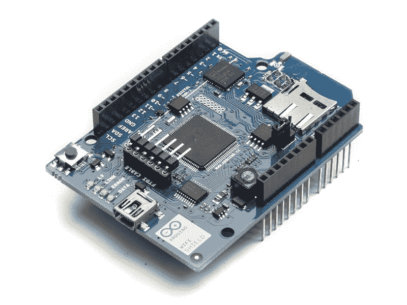
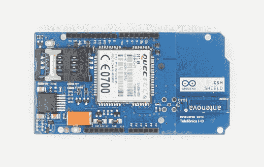
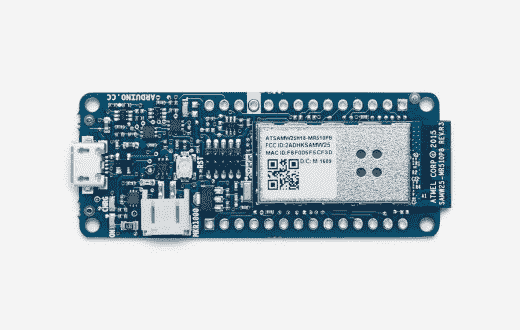
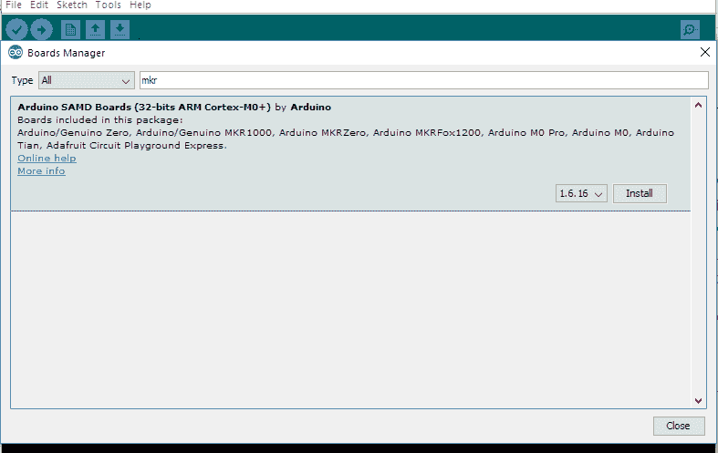
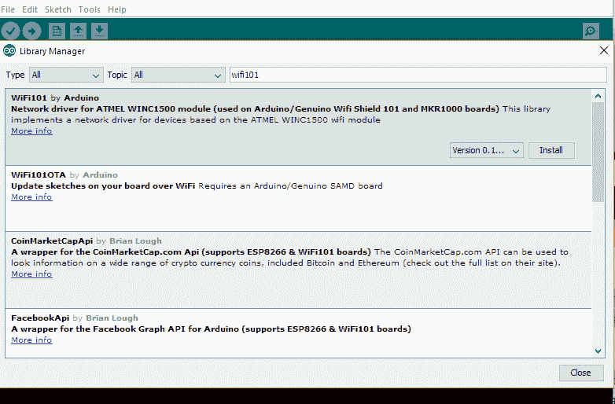
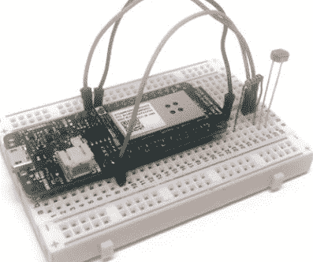
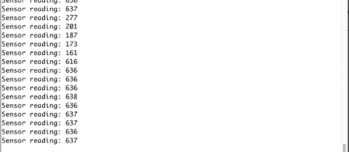
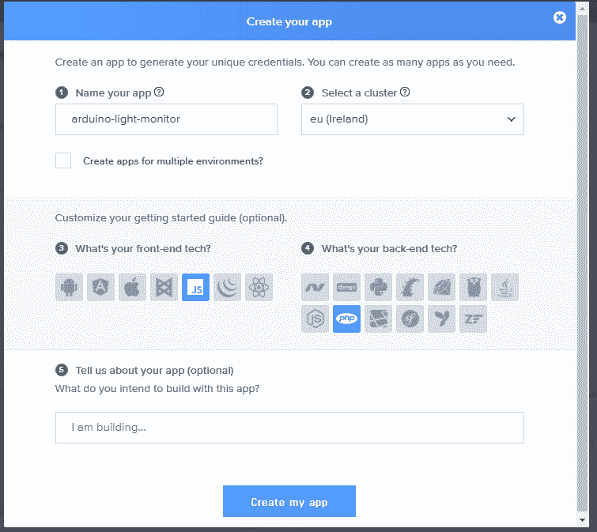
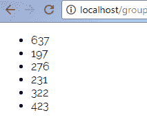

# 如何使用 Arduino 和 Pusher 制作实时灯光监视器

> 原文：<https://www.freecodecamp.org/news/how-to-make-a-realtime-light-monitor-using-arduino-and-pusher-2ec01524ec6a/>

作者:尼奥·伊戈达罗

# 如何使用 Arduino 和 Pusher 制作实时灯光监视器


Photo by [Mikael Kristenson](https://unsplash.com/photos/MYXf7tGEntk?utm_source=unsplash&utm_medium=referral&utm_content=creditCopyText) on [Unsplash](https://unsplash.com/search/photos/light?utm_source=unsplash&utm_medium=referral&utm_content=creditCopyText)

从可穿戴技术到智能家居设备，物联网正在改变我们的生活方式。物联网听起来可能很复杂，但实际上它是一个很容易理解的概念。使用传感器和致动器，日常物品不断被转化为智能设备。

在本文中，我们将构建一个实时 Arduino 环境光监视器，它将传感器读数发送到一个 web 应用程序。我们将介绍将 Arduino 板连接到网络以及使用 Pusher 将数据作为实时通知发送到 web 应用程序的基础知识。

本文将介绍 Arduino 和 Pusher 可以实现的功能。它是为那些对硬件行业好奇，想深入有趣的物联网世界的人准备的。

### 构建 Arduino 和 Pusher 集成的要求

在这个过程中，我用了:
—一块 Arduino 板。MKR1000 板。
—[Arduino IDE](https://www.arduino.cc/en/Main/Software)。
—光电池(此处[可用](https://www.sparkfun.com/products/9088))。
— 10k 欧姆电阻(此处[可用](https://www.sparkfun.com/products/8374))。
—试验板和跳线。
—推送应用程序— [在此处创建一个](https://pusher.com/developers)。
— Composer(可从 [https://getcomposer.org 下载)。](https://getcomposer.org).)
—PHP 知识。

试验板是用于临时制作硬件项目原型的板。它有传导电流的节点。

跳线用于确保试验板上默认情况下未连接的各点之间的连续性。

### Arduino 入门

在本节中，将设置 Arduino IDE 并为我们的开发板添加互联网连接。我们将了解如何选择合适的主板并为其添加互联网连接。

许多主板没有互联网连接，而互联网连接是制造物联网设备所需要的。要为我们的主板添加互联网连接，我们有多种选项可供选择:shield、微芯片或具有内置无线功能的 Arduino 主板。

注意:屏蔽基本上是一个扩展板，可以放置(安装)在 Arduino 板上。

有多种类型的屏蔽:

```
1\. Ethernet Shield.
```


[Ethernet shield](https://www.digikey.com/en/articles/techzone/2012/jan/networking-options-for-arduino-based-systems)

```
2\. WiFi Shield.
```



[WiFi shield](https://store.arduino.cc/usa/arduino-wifi-shield)

```
3\. 3G or LTE Shields.
```



[Arduino GSM Shield](https://store.arduino.cc/usa/arduino-gsm-shield)

我们将使用内置 WiFi 芯片的 Arduino MKR1000。该板在 [Arduino 商店有售。](https://store.arduino.cc/usa/arduino-mkr1000)



[Arduino MKR1000 WIFI](https://store.arduino.cc/usa/arduino-mkr1000)

接下来，从[这里](https://www.arduino.cc/en/Main/Software)下载 Arduino IDE 并安装在你的电脑上。

安装完成后，通过启动 IDE 继续安装**板定义**。然后转到`Tools > Boards > Board M`管理器，在那里我们搜索并安装 MKR1000 的定义。



Board Manager

一旦**板定义**安装完毕，转到`Tools | Boards`并选择新安装的板定义。

为了将我们的 Arduino 板连接到互联网，我们必须安装一个名为`wifi101`的库。为了安装库，请转到`Sketch` `&` g `t; Include Libr` a `r` y `> Manage Lib` raries，然后在`stall w` ifi101 中搜索和。



Install WiFi101 library

我们可以通过访问`Files > Examples > WiFi > Conne` ctWithWpa 来测试它是否有效。这应该会在我们的草图中生成一些代码。接下来，`edit``ssid`并传递给我们路由器的 SSID 和密码:

```
char ssid[] = "yourNetwork";     //  your network SSID (name)    char pass[] = "secretPassword";  // your network password    int status = WL_IDLE_STATUS;     // the Wifi radio's status
```

### 在 Arduino 构建灯光监视器

在本节中，我们将了解如何设置电路并测量来自 MKR1000 板上传感器的数据。除了 Arduino MKR1000 和通常的试验板和跳线，我们还需要一些额外的组件。

*   [光电池](https://www.sparkfun.com/products/9088)
*   [10k 欧姆电阻](https://www.sparkfun.com/products/8374)

光电池是一种能让我们探测光线的传感器。它们通常被认为是光敏电阻(LDR)、光敏电阻或 CdS 电池。

光电池基本上是一个电阻器，它根据照射到弯曲表面的光量来改变电阻值(单位为欧姆)。

#### **组装部件**

首先，将电阻与光电管串联放置在试验板上，靠近 Arduino 板。

现在，将电阻的另一端连接到 Arduino 板上的 GND，将光电管的另一端连接到 Arduino 板的 VCC 引脚。

最后，将电阻器和光电池之间的中间引脚连接到 Arduino 板的模拟引脚 A0。最终结果应该是这样的:



完成后，我们可以继续配置电路板，以读取来自光电池的数据。现在，我们将从模拟引脚 A0 获取读数，并将其打印在串行端口上。这部分的草图非常简单，应该是这样的:

我们将把这个草图复制并粘贴到我们的 Arduino IDE 中，然后上传到板上。

确保选择了正确的板和串行端口。

```
// Pins    int sensorPin = A0;    void setup() {      // Serial      Serial.begin(115200);    }
```

```
 void loop() {      // Reading      int sensorValue = analogRead(sensorPin);      // Display      Serial.print("Sensor reading: ");      Serial.println(sensorValue);      // Wait      delay(500);    }
```

您可以**将 Arduino 草图文件保存到您的机器**中，这样您可以在以后引用它们。只要上传到 Arduino 板上，你可以给它们起任何你喜欢的名字。

运行后，我们打开串行监视器，立即观察传感器的读数:



如果我们把手放在传感器上，我们会看到它测得的数值有所下降。现在让我们集中精力创建 web 应用程序。

### 设置 web 应用程序

在这一节中，我们将创建一个基本的 web 应用程序，该应用程序收集数据作为一个`GET`请求，并将其实时显示给订阅该频道的用户。对于实时显示，我们将使用[推杆](http://pusher.com)。

Pusher 是一个简单的托管 API，用于通过 WebSockets 将实时双向功能快速、轻松、安全地集成到 web 和移动应用程序或任何其他互联网连接设备。

第一步将是创建一个免费的推手帐户。如果您没有，那么在[仪表板](https://dashboard.pusher.com)上创建您的应用程序。

#### **创建推送应用**

创建一个推送帐户，然后进入您的应用程序>创建新应用程序。填写您的应用程序名称，选择一个集群，选择 JavaScript 和 PHP，然后我们就可以开始了。

应用程序设置屏幕应该如下所示:



完成后，您将获得应用程序密钥。

#### **建立我们的项目**

我们将在我们的`localhost`根目录中创建一个名为`arduino-light-monitor`的文件夹。

然后，打开你的终端，输入`composer require pusher/pusher-php-server`。这将在我们的目录中生成几个文件。

创建一个名为`notification.html`的文件。然后添加下面的 HTML 和 JavaScript:

```
<!DOCTYPE html>    <html>    <head>      <title>Notifications From Light monitor</title>      <script src="https://js.pusher.com/4.1/pusher.min.js"></script>      <script>        //Enable Pusher Logging - don't include this in production        Pusher.logToConsole = true;
```

```
 //Create a new instance of pusher with your credentials        var pusher = new Pusher('APP_KEY', {            cluster: 'PUSHER_CLUSTER',//if you chose a different cluster replace it here            encrypted: true          });
```

```
 //subscribe to a channel you will listen on        var channel = pusher.subscribe('light-monitor-channel');
```

```
 //What happens when light-readings-sent is fired        channel.bind('light-readings-sent', function(data){          //gets the ul in the dom          var ul = document.querySelector('ul');          //creates a li          var li = document.createElement('li');          //Attaches the data received to the text node          var itemText = document.createTextNode(data.value);          //Append the data to the li          li.appendChild(itemText);          //Append the li to the ul          ul.appendChild(li);        });      </script>    </head>    <body>      <ul></ul>    </body>    </html>
```

这里发生的事情是，我们订阅一个名为`light-monitor-channel`的频道，然后等待，直到我们收到一个名为`light-readings-sent`的事件。每当事件被触发时，我们将收到的数据追加到我们的列表中。

我们还将创建另一个名为`index.php`的文件。这是将事件发送到通知通道的文件。我们将把下面的 PHP 代码添加到文件中:

```
<?php      require __DIR__ . '/vendor/autoload.php';
```

```
 $options = array(        'cluster' => 'PUSHER_APP_CLUSTER',        'encrypted' => true      );      $pusher = new Pusher\Pusher(        'PUSHER_APP_KEY',// replace with yours        'PUSHER_APP_SECRET',//replace with yours        'PUSHER_APP_ID', //replace with yours        $options      );
```

```
 //checks if there is any data sent      if(isset($_GET['value'])){        $data['value'] = $_GET['value'];        //triggers the event on the channel        $pusher->trigger('light-monitor-channel', 'light-readings-sent', $data);      } else {        echo "Nothing to do";      }    ?>
```

如果你需要一个地方来存放你的内容，你可以去[000webhost.com](http://000webhost.com)创建一个免费的子域，在那里你可以上传你的 arduino-light 文件夹的内容。

我们将通过在两个不同的浏览器中打开`notification.html`和`index.php`来测试它。当我们重新加载`index.php`时，我们应该得到一个添加了值“空请求”的新列表项。如果我们尝试`index.php?value=123`，我们应该会将`value 123`实时添加到我们的通知列表中。

这不是很棒吗？

### 将传感器读数发送到 web 应用程序

最后，我们将看看如何将数据从 Arduino 板发送到服务器。

继续我们之前的草图，我们只需记下重要的部分:

```
// Pins    int sensorPin = A0;
```

```
 char ssid[] = "wifi_name"; //your wifi name    char pass[] = "wifi_pass"; // your wifi password    int status = WL_IDLE_STATUS;
```

```
 char server[] = "yourexampleserver.com"; //replace with your localhost or domain
```

```
 // Create an instance of WiFiClient    WiFiClient client;
```

```
 // We define the interval on which we want to send the data    unsigned long lastConnectionTime = 0;    const unsigned long postingInterval = 60L * 1000L; //this implies 60,000L the L represents the long datatype
```

```
 void setup() {      // Serial      Serial.begin(115200);
```

```
 // Attempt to connect to Wifi network:      while ( status != WL_CONNECTED) {
```

```
 Serial.print("Attempting to connect to WPA SSID: ");        Serial.println(ssid);
```

```
 // Connect to WPA/WPA2 network:        status = WiFi.begin(ssid, pass);
```

```
 // Wait 10 seconds for connection:        delay(10000);      }
```

```
 // you're connected now      Serial.print("You're connected to the network");    }
```

```
 void loop() {      if(millis() - lastConnectionTime > postingInterval) {        //Measure the light level        int sensorValue = analogRead(sensorPin);
```

```
 //Send the value to the server        sendHTTPRequest(sensorValue);      }    }
```

```
 void sendHTTPRequest(int sensorValue){      // Close existing connection      client.stop();
```

```
 // Connect & send request      if (client.connect(server, 80)) {
```

```
 Serial.println("connecting...");
```

```
 // Send the HTTP GET request:        client.println("GET /light/?value=" + String(sensorValue) + " HTTP/1.1");        client.println("Host: yourexampleserver.com");        client.println("User-Agent: ArduinoWiFi/1.1");        client.println("Connection: close");        client.println();
```

```
 // Note the time that the connection was made:        lastConnectionTime = millis();      }      else {        // if you couldn't make a connection:        Serial.println("connection failed");      }    }
```

在上面的代码中，我们使用`WiFiClient`的实例创建了一个到指定 WiFi `ssid`的连接。我们将使用这个连接与我们的远程服务器进行交互。

在`setup``()`函数中，我们处理[序列](https://www.arduino.cc/reference/en/language/functions/communication/serial/)的初始化，并连接到由上面的`ssid`和`pass`变量指定的 WiFi 网络。

在`loop``()`功能中，我们检查我们是否处于过账区间。然后，如果是，我们获取读数并调用它下面定义的`sendHTTPRequest`函数。

在`sendHTTPRequest``()`函数中，我们接受一个名为`sensorValue`的参数。因为 Arduino 在循环中运行代码，所以首先要做的是用语句`client.stop()`停止任何之前打开的客户端连接。这将阻止创建连接，并防止它们在使用后被丢弃。

接下来，我们尝试连接到变量`server[]`中定义的服务器。我们检查是否可以建立连接，如果不能，我们打印到串行“连接失败”。一旦连接了客户端，我们就通过 URL 将传感器 pin 值发送到我们的 web 应用程序。

如果我们现在测试这个，我们会让光传感器每分钟都在读取数据。



### 结论

我们已经使用 Arduino 和 Pusher 成功地构建了一个光监视器。如果你喜欢这个教程，并想在物联网世界中从零到英雄，你应该看看 Marco Schwartz 的书[“Arduino Cookbook 的物联网”。它包含超过 60 种配方，将帮助您构建智能物联网解决方案，并为您带来您认为只存在于詹姆斯·邦德电影中的迷人物联网项目。](https://www.packtpub.com/hardware-and-creative/internet-things-arduino-cookbook)

如果您对物联网与 Pusher 的集成有任何问题或其他想法，请在下面留下评论！

这篇文章最初发表在我们的博客上。