# 如何用递归实现映射、过滤和归约

> 原文：<https://www.freecodecamp.org/news/implement-array-map-with-recursion-35976d0325b2/>

### Array.map

我们大概都知道`Array.map`。它根据给定的函数转换一个元素数组。

```
double = (x) => x * 2;
map(double, [1, 2, 3]);
// [2, 4, 6] 
```

我总是看到它是按照以下思路实现的:

```
map = (fn, arr) => {
  const mappedArr = [];

  for (let i = 0; i < arr.length; i++) {
    let mapped = fn(arr[i]);

    mappedArr.push(mapped);
  }

  return mappedArr;
}; 
```

[这个视频](https://youtu.be/XcS-LdEBUkE?t=4m16s)让我看到了另一个`Array.map`实现。它来自 2014 JSConf——在我加入函数式编程潮流之前。

**编辑:** [大卫·西泽克](https://medium.com/@dadc)和[斯蒂芬·布莱克斯通](https://medium.com/@steveb3210)友好地指出了关于此`map`实施的边缘案例和次优性能。我不建议任何人在真正的应用程序中使用它。我的意图是，我们欣赏并学习这种发人深省的递归方法。？

最初的例子在 CoffeeScript 中，这里有一个 JavaScript 的等价物。

```
map = (fn, [head, ...tail]) =>
  head === undefined ? [] : [fn(head), ...map(fn, tail)]; 
```

你可能会使用大卫·西泽克更安全的实现。

```
map = (_fn_, [_head_, ..._tail_]) _=>_ (
  head === undefined && tail.length < 1
    ? []
    : [fn(head), ...map(fn, tail)]
); 
```

使用 [ES6 的析构赋值](https://developer.mozilla.org/en-US/docs/Web/JavaScript/Reference/Operators/Destructuring_assignment)，我们将数组的第一个元素存储到变量`head`中。然后我们将*所有其他的*数组元素存储到`tail`中。

如果`head`是`undefined`，那意味着我们有一个空数组，所以只返回一个空数组。我们*没有绘制*任何东西。

```
map(double, []);
// [] 
```

如果`head` *不是* `undefined`，我们返回一个以`fn(head)`为第一个元素的新数组。我们现在已经映射了数组的第一个元素。旁边的`map(fn, tail)`再次调用`map`，这次少了一个元素。

由于`map`返回一个数组，我们使用 ES6 的[扩展语法](https://developer.mozilla.org/en-US/docs/Web/JavaScript/Reference/Operators/Spread_syntax)将它与`[head]`连接起来。

让我们在调试器中逐步完成。将它粘贴到浏览器的 JavaScript 控制台中。

```
map = (fn, [head, ...tail]) => {
  if (head === undefined) {
    return [];
  }

  debugger;

  return [fn(head), ...map(fn, tail)];
}; 
```

现在让我们`map(double, [1, 2, 3])`。

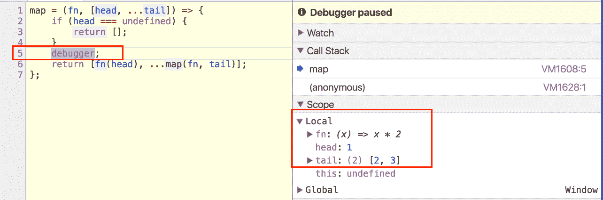

我们看到我们的局部变量:

```
head: 1
tail: [2, 3]
fn: double 
```

我们知道`fn(head)`是`2`。成为新数组的第一个元素。然后我们用`fn`和数组的其余元素`tail`再次调用`map`。

所以在最初的`map`调用返回之前，我们将继续调用`map`,直到数组被清空。一旦数组为空，`head`将会是`undefined`，允许我们的基础用例运行并完成整个过程。

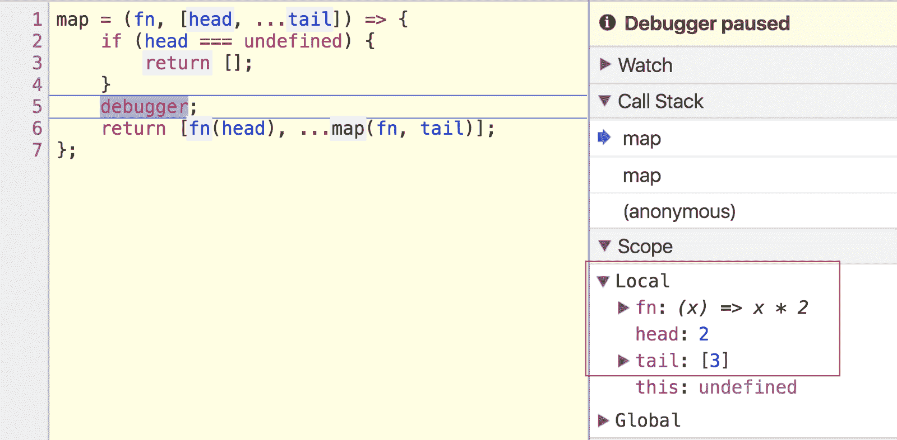

在下一次运行时，`head`是`2`，`tail`是`[3]`。

因为`tail`还不为空，所以点击下一个断点再次调用`map`。

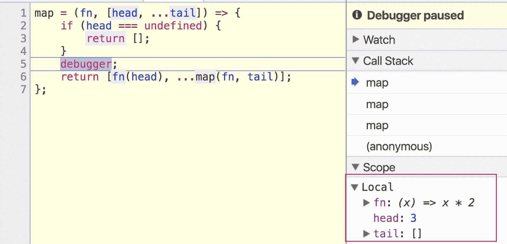

`head`是`3`，`tail`是空数组。下一次这个函数运行时，它将在第 3 行停止，并最终返回映射的数组。

这是我们的最终结果:

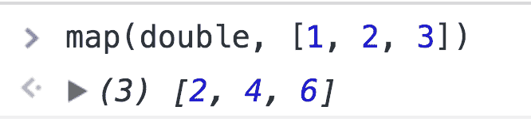

### 数组.过滤器

`Array.filter`基于满足给定谓词函数的元素返回一个新数组。

```
isEven = (x) => x % 2 === 0;
filter(isEven, [1, 2, 3]);
// [2] 
```

考虑这个递归解决方案:

```
filter = (pred, [head, ...tail]) =>
  head === undefined
    ? []
    : pred(head)
    ? [head, ...filter(pred, tail)]
    : [...filter(pred, tail)]; 
```

如果有意义，这就容易了。

我们仍然在名为`head`的变量中捕获数组的第一个元素，其余的在名为`tail`的单独数组中。

并且用同样的基例，如果`head`是`undefined`，返回一个空数组，完成迭代。

但是我们有另一个条件语句:只有当`pred(head)`是`true`时，才把`head`放入新数组，因为`filter`通过测试谓词函数的每个元素来工作。只有当谓词返回`true`时，我们才会将该元素添加到新数组中。

如果`pred(head)`不回`true`，不回`head`只调用`filter(pred, tail)`。

让我们在 Chrome 控制台中快速展开并逐步完成。

```
filter = (pred, [head, ...tail]) => {
  if (head === undefined) return [];

  if (pred(head)) {
    debugger;

    return [head, ...filter(pred, tail)];
  }

  debugger;

  return [...filter(pred, tail)];
}; 
```

并寻找≤ 10 的数字:

```
filter(x => x <= 10, [1, 10, 20]);
```

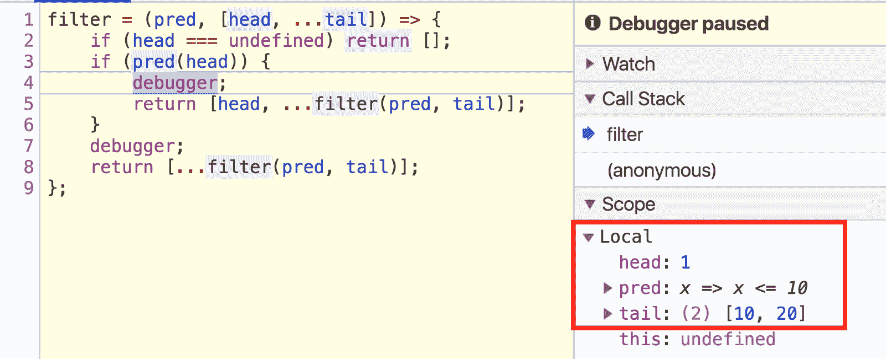

由于我们数组的`[1, 10, 20]`，`head`是第一个元素，1，`tail`是其余:`[10, 20]`的数组。

谓词测试`x` ≤ 10，所以`pred(1)`返回`true`。这就是为什么我们在第 4 行的`debugger`语句上停顿了一下。

由于当前的`head`通过了测试，它被允许进入我们的过滤数组。但是我们还没有完成，所以我们用同样的谓词再次调用`filter`，现在是`tail`。

移动到下一个`debugger`。

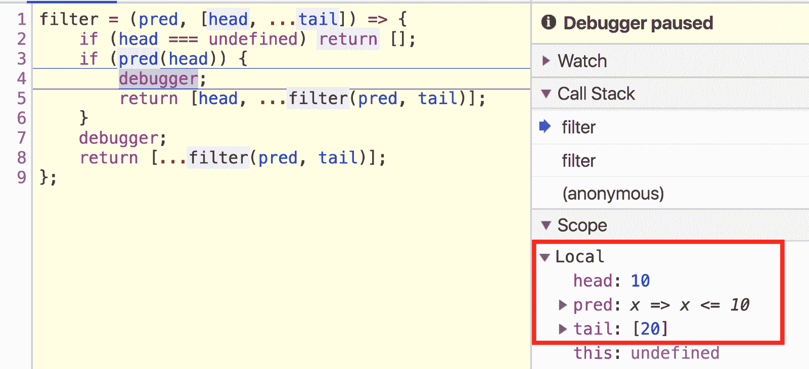

我们用`[10, 20]`来称呼`filter`，所以`head`现在是 10，`tail`是`[20]`。那么`tail`是如何随着每次迭代变小的呢？

我们又在第 4 行的`debugger`上，因为因为 10 ≤ 10。移动到下一个断点。

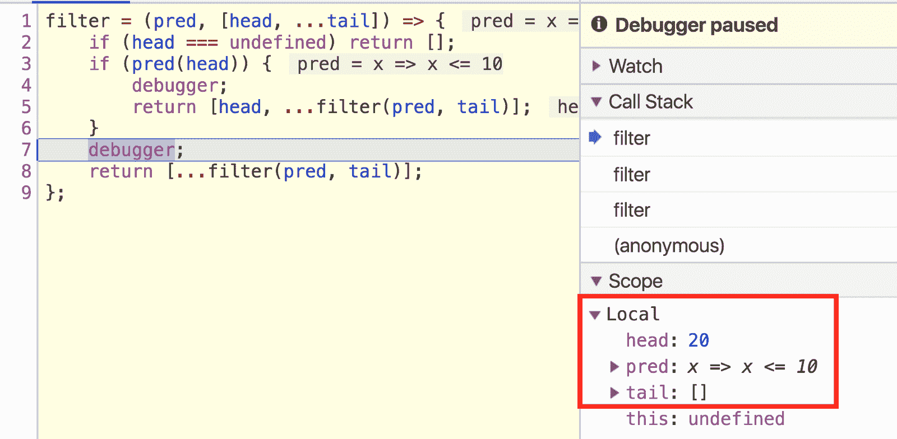

`head`现在 20 了，`tail`空了。

由于 20 > 10，`pred(head)`返回`false`，我们过滤后的数组不会包含它。我们将在没有`head`的情况下再次呼叫`filter`。

然而，这下一次，`filter`将在 2 号线上保释。[析构](https://developer.mozilla.org/en-US/docs/Web/JavaScript/Reference/Operators/Destructuring_assignment#Array_destructuring)空数组给你`undefined`个变量。继续越过此断点以获取返回值。


在我看来那是正确的！

### Array.reduce

最后但同样重要的是，`Array.reduce`非常适合将数组浓缩为单个值。

下面是我的天真的`reduce`实现:

```
reduce = (fn, acc, arr) => {
  for (let i = 0; i < arr.length; i++) {
    acc = fn(acc, arr[i]);
  }

  return acc;
}; 
```

我们可以这样使用它:

```
add = (x, y) => x + y;
reduce(add, 0, [1, 2, 3]); // 6 
```

这个递归实现会得到相同的结果:

```
reduce = (fn, acc, [head, ...tail]) =>
  head === undefined ? acc : reduce(fn, fn(acc, head), tail); 
```

我发现这个比递归的`map`和`filter`更容易阅读。

让我们在浏览器控制台中浏览一下。以下是带有`debugger`语句的扩展版本:

```
reduce = (fn, acc, [head, ...tail]) => {
  if (head === undefined) {
    debugger;

    return acc;
  }

  debugger;

  return reduce(fn, fn(acc, head), tail);
}; 
```

然后我们在控制台中称之为:

```
add = (x, y) => x + y;
reduce(add, 0, [1, 2, 3]); 
```

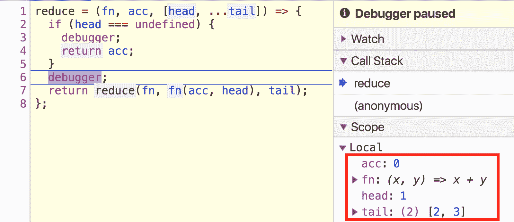

#### 第一轮

我们看到我们的局部变量:

`acc`:我们的初始值`0`

`fn`:本方`add`功能

`head`:数组的第一个元素`1`

`tail`:数组的其他元素打包成一个*单独的*数组，`[2, 3]`

由于`head`不是`undefined`，我们将递归调用`reduce`，**并传递其所需的参数**:

`fn`:明明`add`功能又来了？

`acc`:调用`fn(acc, head)`的结果。由于`acc`是`0`，而`head`是`1`，`add(0, 1)`返回`1`。

`tail`:数组的剩余元素。通过始终使用 tail，我们不断地削减数组，直到什么都没有了！

移动到下一个`debugger`。

#### 第二轮

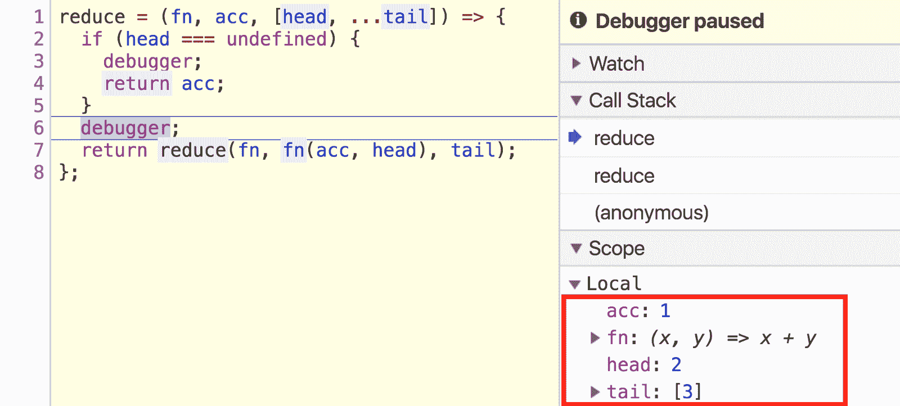

局部变量:

`acc`:现在是`1`，因为我们用`fn(acc, head)`称呼`reduce`，当时是`add(0, 1)`。

`fn`:还是`add`！

`head`:还记得我们是怎么把之前的`tail`传给`reduce`的吗？现在它已经被析构了，用`head`代表它的第一个元素`2`。

`tail`:只剩下一个元素了，所以`3`被单独打包到一个数组中。

我们知道下一个`reduce`调用将采用一个函数、累加器和数组。我们可以使用控制台评估下一组参数**。**

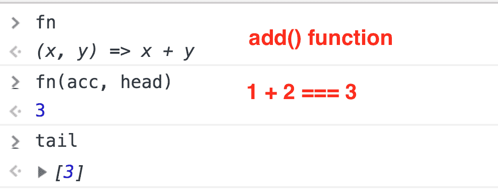

这些值将出现在下一个断点上。

#### 第三轮

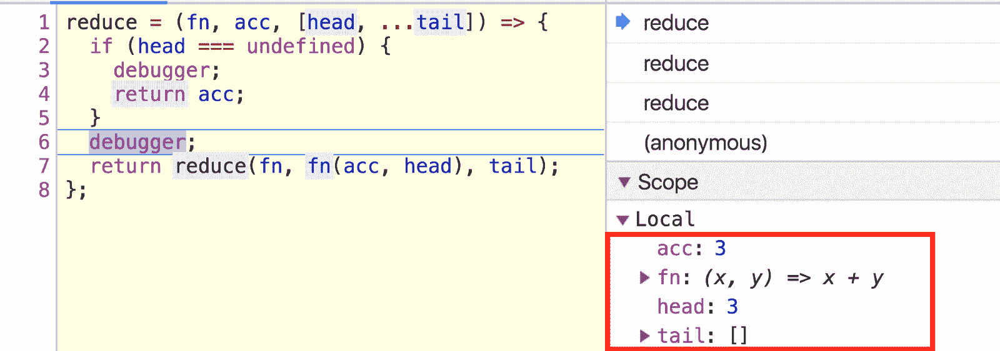

我们的局部变量和预期的一样。`head`的第一个也是唯一的元素是`3`。

而我们的数组只剩下一个元素，`tail`是空的！这意味着下一个断点将是我们的最后一个。

让我们快速评估一下未来的局部变量:

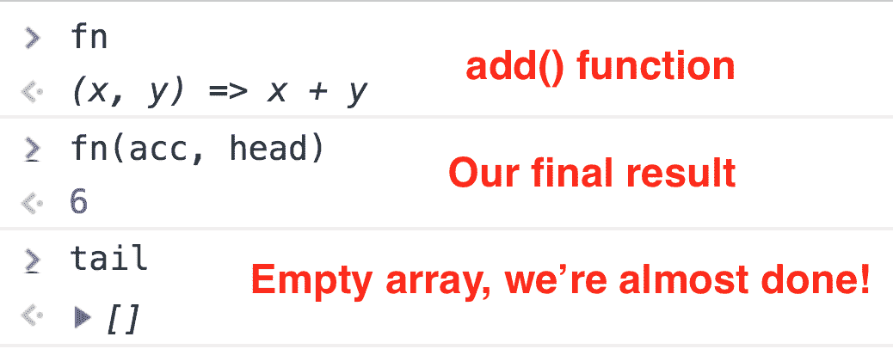

移动到最后一个断点。

#### 第 4 轮

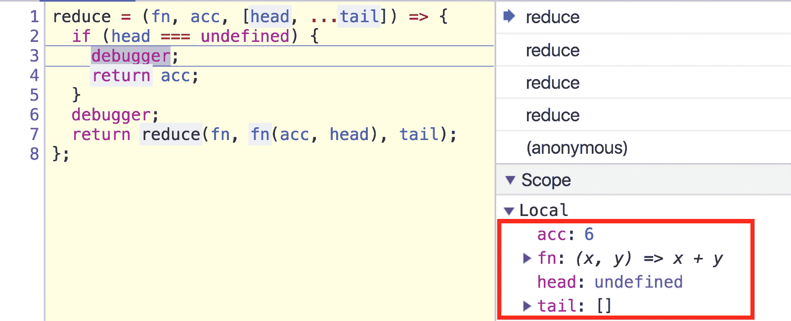

看看吧，我们这次停在第三行而不是第六行！`head`是`undefined`所以我们要返回决赛，`6`！如果你移动到下一个断点，它会弹出。

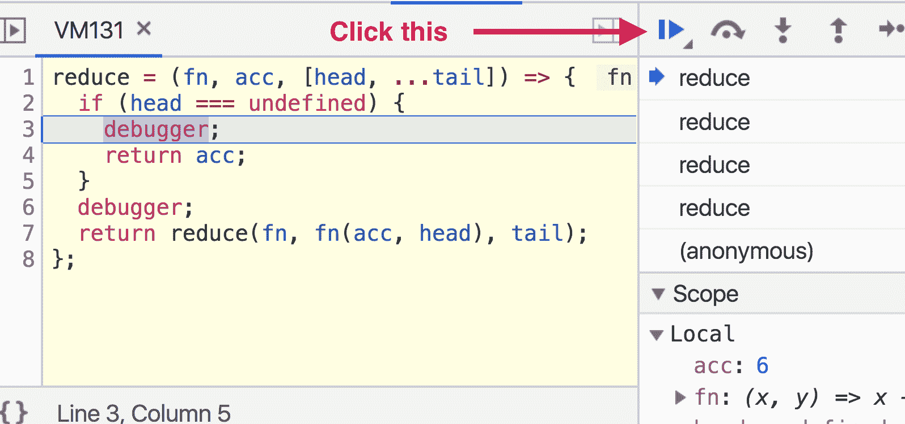 

我看不错！非常感谢你阅读这篇文章。