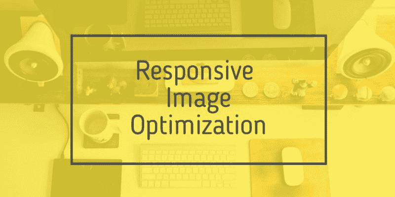
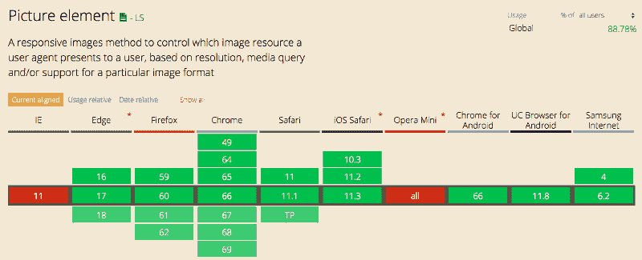
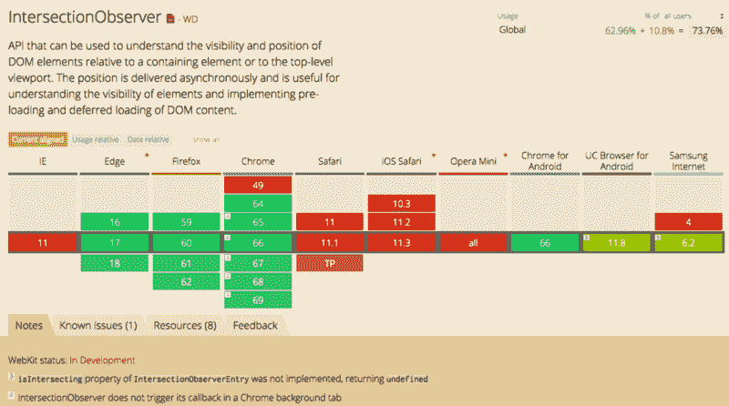

# HTML5 和交叉点观察器响应图像优化介绍

> 原文：<https://www.freecodecamp.org/news/an-intro-to-responsive-image-optimization-with-html5-and-intersection-observer-2a4fbe1473c1/>

作者:里卡多·卡内拉

# HTML5 和交叉点观察器响应图像优化介绍



图像通常占网页上下载字节的大部分，并且通常占据大量的视觉空间。因此，优化图像通常可以为您的网站带来最大的字节节省和性能提升。浏览器下载的字节越少，用户等待有用内容在屏幕上显示的时间就越少。

图像优化既是一门科学也是一门艺术。它之所以是一门科学，是因为有许多成熟的技术和算法可以显著减小图像的大小。这是一门艺术，因为没有一个明确的答案。

但是，除了使用 image magic 或任何其他 web 优化工具之外，我们如何从移动表单优化我们的图像呢？

### img 元素

HTML5 元素的设计是为了让开发者能够根据屏幕分辨率优化图像。这是通过两个属性完成的，`srcset`和`sizes`。通过一个非常简单的语法，您可以指示浏览器决定需要哪种不同的图像大小:

```

```

在这种情况下，浏览器将选择最适合其分辨率的图像。但是，假设图像应该全屏显示(100vw)。这通常不是一个可怕的假设。

`sizes`属性用于避免这个问题，从而帮助浏览器为这种情况选择最佳的图像。您可以使用大小来精确匹配您的 CSS 布局，并告诉浏览器该图像在每个屏幕大小上将有多大，以匹配您的设计中断点的工作方式。

这可能会变得有点复杂，老实说，这可能有点危险。你把 CSS 的东西放在标记中，你知道那是怎么回事。它可以是自动化的，也可以是在服务器端注入的。即使在这种情况下，语法也非常简单:

```

```

### 图片元素

有不同的格式为网页优化图像，如`webp`和`jpg2000`。但是并不是所有的浏览器都支持它们，例如 Internet Explorer。这不应该阻止我们使用最现代浏览器的最佳格式。

图片元素是为图像文件提供替代来源的好方法，因此浏览器可以根据设备功能进行选择。语法非常类似于元素，并允许您使用我第一次向您展示的元素的属性。

```
<picture>
  <source type="image/webp" srcset="the-death-star.webp">
  <source media=”(min-width: 320px)” srcset=”the-death-star-mn.jpg”>
  <source media=”(min-width: 465px)” srcset=”the-death-star-sm.jpg”>
  <source media=”(min-width: 650px)” 
          srcset=”the-death-star-md.jpg, 
                 the-death-star-lg.jpg 1.5x”
          sizes="(min-width: 800px) 50vw, 100vw"
  >
  
</picture>
```

但是我可以在任何地方使用<图片>元素吗？

不幸的是，没有。像 Internet Explorer 11 这样的浏览器不支持此元素。



Image [source](https://caniuse.com/#search=picture).

**但是有一个解决方案**。[一个非常小的 JS 库](https://github.com/scottjehl/picturefill)允许你使用这个元素，甚至在不支持的浏览器上。

### 延迟加载图像

我遇到的最普遍和最有用的建议之一是避免浏览器在加载页面时下载所有的图片。只下载必要的图片，其他资源可以轻松加载。懒加载有很多技巧。这取决于页面如何滚动，或者用户可以访问的下一部分。

如果您以前编写过延迟加载代码，您可能已经通过使用事件处理程序如`scroll`或`resize`完成了您的任务。这种方法是跨浏览器最兼容的。然而，现代浏览器提供了一种更高效的方式来检查元素的可见性。这是通过交叉点观察器 API 执行的。

交叉点观察器比依赖各种事件处理程序的代码更容易使用和阅读。开发者只需要注册一个观察者来观察元素，而不是编写繁琐的元素可见性检测代码。开发人员剩下要做的就是决定当一个元素可见时做什么。

```

```

这个标记的三个相关部分是:`class`属性，以及`data-src`和`data-srcset`属性。最后两个是占位符属性，包含元素在视口中后我们将加载的图像的 URL。

```
document.addEventListener("DOMContentLoaded", () => {
 var lazyImages =[].slice.call(
  document.querySelectorAll("img.lazy")
 )
 if ("IntersectionObserver" in window) {
    let lazyImageObserver = 
      new IntersectionObserver((entries, observer) => {
        entries.forEach(function(entry) {
          if (entry.isIntersecting) {
            let lazyImage = entry.target;
            lazyImage.src = lazyImage.dataset.src;
            lazyImage.srcset = lazyImage.dataset.srcset;
            lazyImage.classList.remove("lazy");
            lazyImageObserver.unobserve(lazyImage);
          }
        });
      });

    lazyImages.forEach(function(lazyImage) {
      lazyImageObserver.observe(lazyImage);
    });
  } else {
    // Possibly fall back to a more compatible method here
  }
});
```

代码非常简单，很容易调试([这是一个 codepen 来看看这个代码的运行](https://codepen.io/malchata/pen/YeMyrQ))，但是有一个很大的问题。不太支持交叉点观察器 API。



Image [source](https://caniuse.com/#search=IntersectionObserver).

您将需要使用一个[多填充](https://github.com/w3c/IntersectionObserver/tree/master/polyfill)，或者基于`resize`和`scroll`事件实现一个延迟加载。

### 渐进图像加载

**这是一个小提示:**当你导出你的图片(JPEG，GIF，PNG)时，你可以勾选渐进选项(例如在 Photoshop 或 Sketch 上)。图像已经在网络浏览器中逐渐渲染。但是渐进图像从低分辨率开始，并随着时间的推移逐渐增强。

这种技术现在几乎每个人都在使用，因为它允许你立即向用户显示图像的预览，然后慢慢上传各种细节(例如 Instagram)。这种方法允许您防止慢速连接的用户离开您的站点，因为它会显示白屏。

### 最终药丸

在网上，我看到了一篇精彩的文章，作者是 [José M. Pérez](https://www.freecodecamp.org/news/an-intro-to-responsive-image-optimization-with-html5-and-intersection-observer-2a4fbe1473c1/undefined) ，讲述了 Medium 如何优化和实现渐进式图像加载。

如果你喜欢这篇文章，请鼓掌并关注我:)
谢谢，敬请期待？
关注我在[脸书](https://www.facebook.com/CanellaRiccardo/)的最新消息和提示