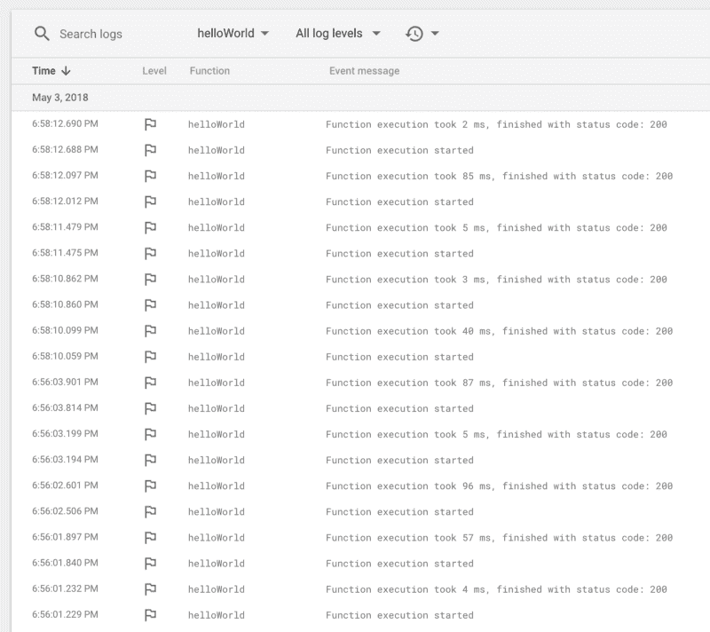

# 火基地云功能:伟大的，meh 的，丑陋的

> 原文：<https://www.freecodecamp.org/news/firebase-cloud-functions-the-great-the-meh-and-the-ugly-c4562c6dc65d/>

皮尔·博弗

# 火基地云功能:伟大的，meh 的，丑陋的


当我去年回顾 Firebase 时，我抱怨它并不是完全无服务器的。发送电子邮件或创建缩略图等常见功能仍然需要节点服务器。

Firebase 云功能在几个月后公布。该服务仍处于测试阶段，但我已经在生产中愉快地使用了几个月。

让我们看看它做得怎么样。

### 什么是 Firebase 云函数？

如果你以前从未听说过云函数，这个概念非常简单。将简洁的逻辑以函数的形式部署到服务器上，一些勤奋的小精灵就可以被神奇地从中间地带调用来为你完成任务。所有这些都不需要关心基础设施，只需要为执行资源付费。

在许多情况下，这种新的范例可以简化后端代码的编写、维护和运行。

特别是 Firebase 云功能就像乐高积木，你可以连接到任何 Firebase 服务。例如，当一个图像被上传到 Firebase 存储器以创建缩略图时，可以触发一个函数，或者当一个节点在实时数据库中被删除时，可以清除一些用户数据。Firebase 中发生的任何有趣的事情都可以触发一个函数。

如果这还不够，您还可以使用 HTTP 来触发 GET、POST 等函数。请观看这段精彩的视频，了解如何将 Firebase 主机与云功能相结合来创建一个完整的 Express 应用程序:

### 伟大的

#### 基础设施没有比这更简单的了

基础设施是完全抽象的，就像 Firebase 的其他部分一样。每当一个功能被触发，一个新的虚拟服务器就开始工作，并返回到休眠状态。谷歌云的魔力会不断触发你的功能，并根据工作负载自动扩展基础设施。

#### 定价

云功能总体来说非常划算。很难比较云提供商的定价，但我可以说，根据我的经验，Firebase 云功能已经*便宜得离谱*。很难相信谷歌会因此赚钱。

#### 使用方便

和往常一样，Firebase 和谷歌的文档都很棒，你不用绞尽脑汁就能得到它。Github 上也有[成吨的样本让你入门。部署授权由 Firebase CLI 处理，因此启动并运行 hello world 实际上是:](https://github.com/firebase/functions-samples)

```
firebase init functionsfirebase deploy
```

我认为使用 Firebase 和 Google Cloud 的简单性非常棒，特别是与竞争对手相比。

#### 灵活的

就像我之前写的，这些功能可以被各种事件触发。我敢打赌，你不会想不出如何将它们与你的 Firebase 项目甚至是你的堆栈的其余部分集成在一起的主意。

以下是我们使用 Firebase 云函数解决的一些问题:

*   使用 Phantom.js 为在线发票服务生成 pdf，并与一些政府服务签署这些发票
*   将 Go 服务连接到第三方 SOAP 提供者(ugh)
*   从我们堆栈中的任何位置通过 HTTP 发送电子邮件

### Meh

#### 冷启动

可伸缩性很好，但是运行时间会波动很大。一个简单的 hello world 函数可能需要 3 毫秒或 100 毫秒才能完成工作。

```
functions.https.onRequest((request, response) => {    response.send(“Hello from Firebase!”);});
```



这些波动是由虚拟服务器启动时间引起的。如果运行您的功能的虚拟服务器被唤醒，该功能将立即触发。但是如果服务器必须从中间状态启动，它显然需要更多的时间来开始工作。在云函数行话中，这被称为热启动和冷启动。

在实践中，你不能依赖一致的响应时间，除非你缓存你的数据，如前一个视频中所述，或者使用黑客来保持你的功能温暖。

不幸的是，冷启动是处理云功能不可避免的一个方面(来自任何提供商)。当你决定使用云函数来解决问题时，你必须考虑到这一点。

#### 无调度程序(cron)

云功能非常适合完成低流量任务，如生成报告或在凌晨 2 点进行定期备份，但使用 Firebase 或谷歌云，没有简单的方法来根据计划触发您的功能。

[Firebase 团队建议](https://github.com/firebase/functions-cron)创建一个应用引擎项目来协调这些触发器。这项服务确实需要类似于 [Heroku 调度器](https://devcenter.heroku.com/articles/scheduler)的东西。

#### 仅 JavaScript

呃，我对 JavaScript 没问题，但是 Azure 和 AWS 都支持更多的语言。具有讽刺意味的是，谷歌的云功能服务中不支持 Go，而 AWS 却支持。

#### 节点 6

再说一次，竞争越来越激烈。AWS Lambda 和 Azure 函数都已经在 Node 8 上运行了。这里最大的缺点是回到没有 async/await 的承诺，或者必须在你的项目上配置 Babel。

### 丑陋的

#### 开发工作流

除了 [HTTP 触发的函数](https://firebase.google.com/docs/functions/local-emulator#use_firebase_serve_for_https_functions)，您不能在本地运行您的函数。由 Firebase 服务触发的功能必须部署到云中。

这有许多丑陋的含义:

*   小错误最终会耗费大量时间，因为新功能需要几分钟才能开始工作。
*   部署的功能没有明显的版本。同一功能的所有日志似乎来自同一版本。从来不清楚新功能何时真正工作，所以您唯一的选择是手动触发这些功能，看看会发生什么。
*   没有回滚

#### 环境

除了以上几点之外，管理环境是…复杂的。

您可以使用 [Firebase CLI](https://firebase.google.com/docs/functions/config-env) 将环境变量添加到您的函数项目中，但是，像 Firebase 的其他方面一样，这是一种幼稚的方法，不能很好地扩展。

您将需要凭证来访问 Firebase 沙盒之外的几乎任何东西。对于其他谷歌云服务，这些凭证以`.json`文件的形式出现。再乘以每一个环境(开发、生产、试运行),你最终会得到一个巨大的混乱。

我最终在部署之前手动重命名凭证文件，或者更糟，部署所有凭证并在运行时选择合适的凭证。如果你找到了解决这个问题的方法，请在评论中告诉我。

我希望在 Firebase 控制台中看到一个*环境*标签，在那里我可以轻松地管理整个 Firebase 项目的这些设置。环境之间的切换应该和`firebase use production`一样简单。

### 结论

除了开发阶段的一些摩擦，我对 Firebase 云函数的体验是积极的。一旦部署，这些东西是可靠的，并要求零维护承诺。所以是的，Firebase 终于完全没有服务器了。万岁！

如果你已经在使用 Firebase，这真的很容易。Firebase 云功能是您项目的一个很好的补充，即使该服务仍处于测试阶段。

另一方面，公平地说，竞争对手有更成熟的产品。如果你没有投资 Firebase 或 Google Cloud，并考虑在你的堆栈中使用云功能，你可能也应该看看 AWS 或 Azure 提供了什么。

老实说，我有点担心这项服务仍处于测试阶段。自宣布以来已经一年多了，进展缓慢得令人痛苦。竞争对手似乎更致力于其云产品，即使根据谷歌云业务首席执行官 Diane Greene 的说法，谷歌云是[“增长最快的云”](https://techcrunch.com/2018/02/01/googles-diane-greene-says-billion-dollar-cloud-revenue-already-puts-them-in-elite-company/)。

仅此而已。

**注意:**在本文的前一个版本中，我声称不可能为非 HTTP 函数编写测试。这是错误的，[这里有关于如何做的文件](https://firebase.google.com/docs/functions/unit-testing#testing_background_non_http_functions)。