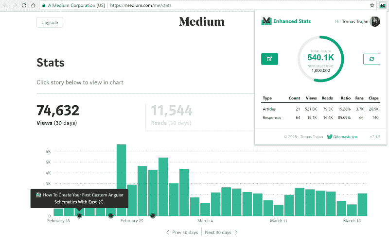
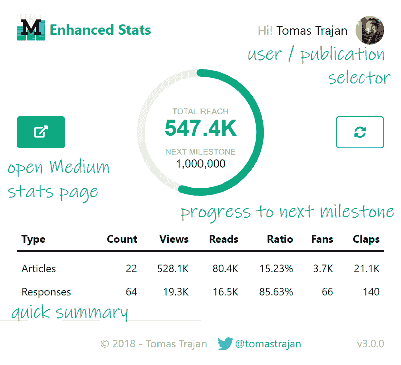
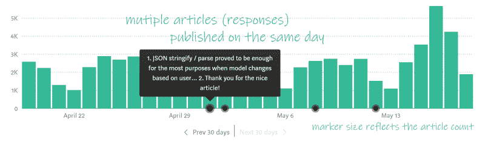
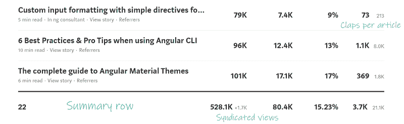
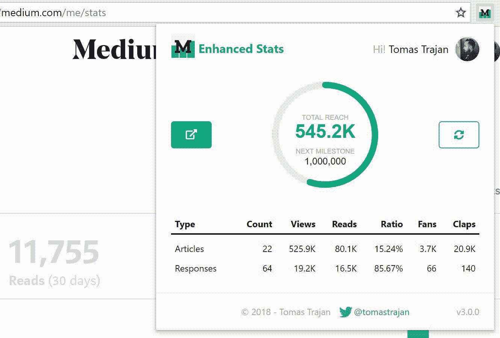
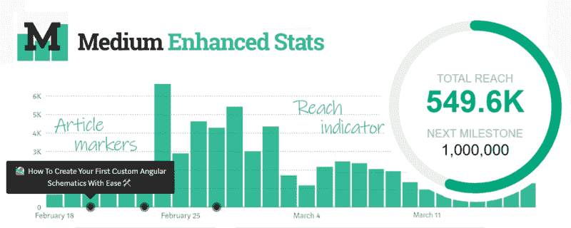

# 灵媒讨厌他！看看他是如何用这个简单的技巧改进统计页面的

> 原文：<https://www.freecodecamp.org/news/medium-hates-him-see-how-he-improved-their-stats-page-with-this-one-simple-trick-1ce0898381a8/>

托马斯·图拉真

# 灵媒讨厌他！看看他是如何用这个简单的技巧改进统计页面的

Medium Stats has so much space for improvement, and that’s just the beginning…

是的，标题，我知道…但我一生中至少要尝试一次？？

对我们许多人来说，Medium 是在线写作和发布内容的首选平台。它提供了极其流畅的写作体验，老实说，我再也无法想象使用其他任何东西了…

> 我使用 Medium 已经很多年了，我总是对我的文章的总覆盖范围感到好奇

不幸的是，中等统计只能被描述为非常基本的，或者坦率地说，在功能部门完全缺乏。甚至连简单的东西都没有，比如在表的底部有一个视图和读取总数的汇总行。

唯一的解决方案是手动添加数字，这是一个枯燥、容易出错的过程。随着文章数量的增加，它变得越来越乏味，所以你基本上因为是一个多产的作家而受到惩罚…

但是，嘿，还有希望…

…至少对于那些使用[谷歌 Chrome](https://chrome.google.com/webstore/detail/medium-enhanced-stats/jnomnfoenpdinfkpaaigokicgcfkomjo) 和 Opera 这个惊人的 [Opera 插件](https://addons.opera.com/en/extensions/details/install-chrome-extensions/)然后安装[标准 Chrome 扩展](https://chrome.google.com/webstore/detail/medium-enhanced-stats/jnomnfoenpdinfkpaaigokicgcfkomjo)的人来说。

> 介绍中等增强状态

### 这对你有什么好处？？？？？

简单来说，中等增强状态有四个主要特征:

1.  总延伸指示器
2.  条形图文章标记
3.  统计表汇总行和附加信息
4.  对用户和出版物的支持
5.  ？如果你不怕卷起袖子探索来源，一个复活节彩蛋会被发现吗？？？

> 现在就给你的谷歌浏览器添加[中等增强状态](https://chrome.google.com/webstore/detail/medium-enhanced-stats/jnomnfoenpdinfkpaaigokicgcfkomjo)！是的，100%免费！

或者安装 Chrome 扩展插件。

### 总延伸指示器

总浏览量是你的文章和回复的所有浏览量的总和。

指示器不是一个简单的数字，而是包含一个下一个里程碑和一个进度条，显示你已经完成了多少。

里程碑计算为下一个 10x“回合”数。

例如，一公里以下的人会很快达到他们的一公里里程碑，但从 100 万到 1000 万可能需要更多时间…

> 话说回来，如果你证明我的假设是错的，我会很高兴？

> 我要感谢 [Johann Gyger](https://www.freecodecamp.org/news/medium-hates-him-see-how-he-improved-their-stats-page-with-this-one-simple-trick-1ce0898381a8/undefined) 在调试扩展弹出窗口时给予的帮助！？？？？？？

### 条形图文章标记

你有没有想过 3 个月前浏览量激增的原因是什么？我也是！幸运的是，中型增强统计的最新功能开始解决这个问题…

Check out article markers in the bar chart and discover effect of their publishing on the overall performance…

Medium 的原始条形图现在增强了文章标记。它也适用于回复，每天可以显示多篇文章。

Markers can handle also multiple articles per day and the marker size reflects amount of articles… Yes, bigger IS better ?

### 汇总行和附加信息

这是扩展的初始特性，也是它最初的基本方式:有一个简单的汇总行，显示每列值的总和。

> 你知道，Excel sum ∑之类的东西…

事实证明，检索到的数据还包含每篇文章的点击数。如今，这是一个更有用的指标，因为 Medium 转而在文章本身的 UI 中显示掌声。

Summary row is exactly what it sound it is ? Besides that, there is also an additional claps column for every article…

### 对用户和出版物的支持

一开始，中等增强统计只能显示单个当前登录作者的统计。第一批用户的反馈来得相当快:他们要求能够为他们的出版物做同样的事情。

> 刚刚安装了一个新的 chrome 扩展[http://goo.gl/XBvNFu](https://t.co/azWSmxsnFY)由 [@tomastrajan](https://twitter.com/tomastrajan) 。非常方便。上面说我联系了 100 多万人！它现在鼓励我瞄准 1000 万:)。干得好， [@tomastrajan](https://twitter.com/tomastrajan) ！它能显示出版物的统计数据吗？ —

提出要求，你就会得到满足！

Click on the user avatar and select from available users and publications

#### 我的开发伙伴的技术背景

中等增强统计是一个 Chrome 扩展。Chrome 扩展对于丰富现有网站的自定义功能非常有用，因为我们有可能以一种安全的方式注入自定义脚本。

自定义脚本可以访问和利用原始页面上所有可见和不可见的数据。更重要的是，因为他们现在属于原始站点，他们也可以代表它发出请求。让我告诉你，从 JSON 数据中计算总数要比抓取一个 HTML 表容易得多。

我打算再写一篇文章，更详细地介绍如何实现 Chrome 扩展，所以[敬请关注](https://twitter.com/tomastrajan) …

> **有趣的事实—** 中等增强统计检索并显示总统计，对吗？嗯，几乎是全部:如果你发表了超过 **10 万篇文章，**这是目前分页请求的极限，你可能需要担心了？

在我忘记之前，中等增强统计在 GitHub 上也是完全开源的，所以请随意[查看一下](https://github.com/tomastrajan/medium-enhanced-stats)。实际上还没有可用的文档，但是我将来一定会添加更多的文档来支持社区驱动的工作！

### 将来的

从一开始，这个扩展就已经经历了几次大的迭代和改进。

目前，有一个计划，试图可视化的文章，主要贡献者的意见，每天。在有许多文章而个人贡献很小的情况下，这可能会变得相当棘手。重要的是要找到一个好的平衡点，让它有用而不是分散注意力。

另一个值得探索的机会是增加一种下载和分享风格化总到达指标的方法，该指标包含作者姓名、媒体用户名和其他社交媒体句柄。这可能是有用的，因为作者将获得一种简单的方式来交流他们的贡献，作为他们社区新成员的可信度的代理。

### 这就是结局！

我希望你尝试一下 [**中等增强状态**](https://chrome.google.com/webstore/detail/medium-enhanced-stats/jnomnfoenpdinfkpaaigokicgcfkomjo) ，并让我知道你的经验和可能的增强想法！

请将这篇文章传播给更多的读者。？？跟在我后面？️ Twitter to 获得关于我最新博客文章的通知？

> 永远不要忘记，未来是光明的。

Obviously the bright future (? by S[asha • Stories)](https://unsplash.com/@sanfrancisco)

如果您已经做到了这一步，请随意查看我的其他一些关于前端软件开发的文章…

[**如何与流行框架的发布保持同步**](https://medium.com/@tomastrajan/how-to-stay-up-to-date-with-releases-of-popular-frontend-frameworks-with-twitter-bot-release-butler-86af7b734706)
[*介绍发布管家——一个帮助你与流行前端的发布保持同步的 Twitter 机器人…*medium.com](https://medium.com/@tomastrajan/how-to-stay-up-to-date-with-releases-of-popular-frontend-frameworks-with-twitter-bot-release-butler-86af7b734706)[**如何用 Bootstrap 4 和 Angular 6 构建响应式布局？**](https://medium.com/@tomastrajan/how-to-build-responsive-layouts-with-bootstrap-4-and-angular-6-cfbb108d797b)

Don’t forget ! ?