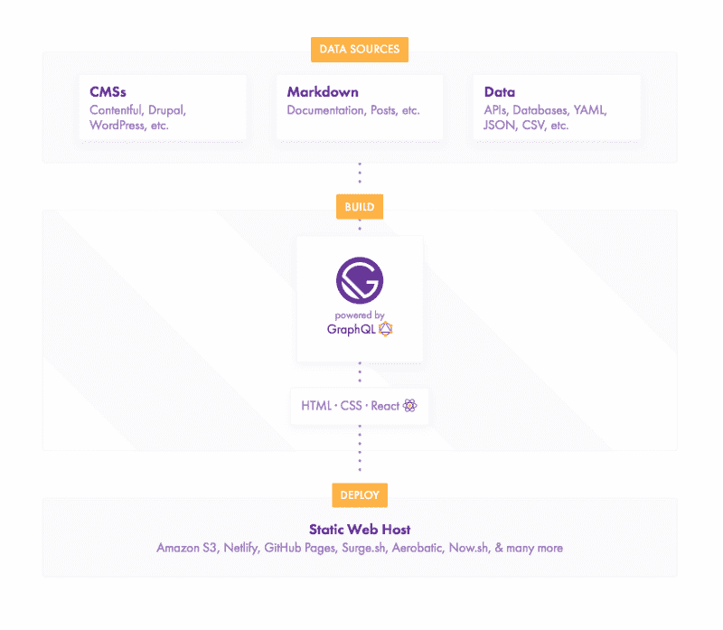
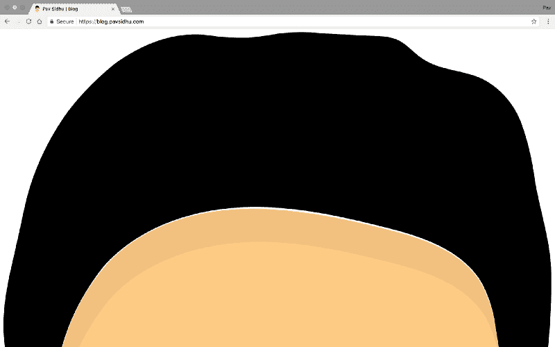

# 我如何用盖茨比和 Netlify 建立我的博客

> 原文：<https://www.freecodecamp.org/news/how-i-built-my-blog-using-gatsby-and-netlify-f921f1a9f33c/>

作者 Pav Sidhu

# 我如何用盖茨比和 Netlify 建立我的博客


Photo by [Stanley Dai](https://unsplash.com/photos/73OZYNjVoNI?utm_source=unsplash&utm_medium=referral&utm_content=creditCopyText) on [Unsplash](https://unsplash.com/search/photos/typing?utm_source=unsplash&utm_medium=referral&utm_content=creditCopyText)

#### 你能说出一个更有代表性的组合吗？？

多年前，每当我构建一个静态网站时，我都不会使用任何花哨的框架或构建工具。我在项目中引入的唯一东西是 jQuery，或者如果我觉得特别有趣，我会使用 Sass。

现在我们有了 Gatsby、Netlify 这样的工具，大大改善了搭建静态网站的体验。不用考虑样板文件和配置(看看你的 Webpack)，你可以只关注你的应用程序。

我可以毫不犹豫地说，《盖茨比和 Netlify》是我经历过的最好的编程体验。我来解释一下原因。

### 盖茨比（姓）

Gatsby 是一个使用 React 的静态站点生成器。一切都是现成的，包括 React、Webpack、appellister 等等。

由于 Gatsby 是建立在 React 之上的，所以你获得了 React 的所有好处，比如它的性能、组件、JSX、React 库生态系统以及一个庞大的社区(React 在 GitHub 上已经接近 10 万颗星了？).

如果你之前没有用过 React，有一个学习曲线。但是有很多写得很好的教程使得 React 非常容易理解。[官方 React 文档](https://reactjs.org/)也写得很好。

对于许多静态网站，比如我的博客，我需要在构建过程中使用外部数据源(我实际的博客帖子)。Gatsby 支持多种形式的数据，包括 Markdown、API、数据库和像 WordPress 这样的 CMS。为了访问这些数据，Gatsby 使用了 GraphQL。



*Taken straight from the Gatsby website*

我所有的博客文章都在 Markdown 中，所以我使用了一个 Gatsby 插件([Gatsby-transformer-remark](https://www.gatsbyjs.org/packages/gatsby-transformer-remark/?=gatsby-transformer-remark))，它允许我使用 GraphQL 查询我的 Markdown 文件。它还像变魔术一样直接将 Markdown 文件转换成 HTML。我只需要使用下面的 GraphQL 查询来访问一个特定的帖子:

```
query BlogPostByPath($path: String!) {  markdownRemark(frontmatter: { path: { eq: $path } }) {    frontmatter {      title      date(formatString: "Do MMMM YYYY")    }    html  }}
```

使用这个查询，我通过我的 props 访问数据，如下所示:

```
const BlogPost = ({ props: { data: { markdownRemark } } }) => (  <div>    <h1>{markdownRemark.title}</h1>    <p>{markdownRemark.date}<p>    <div dangerouslySetInnerHTML={{ __html: markdownRemark.html }} />  </div>)
```

如果您理解 GraphQL，那么使用 Gatsby 从 Markdown 访问数据就像在家里一样。如果 GraphQL 对您来说是新的，它确实增加了另一个需要学习的东西。但是在 Gatsby 中使用 GraphQL 的文档中有大量的信息和代码片段可供您使用。

如果您正在构建一个只有一两个查询的简单博客，有 Gatsby starter kits 可以为您设置 gatsby-transformer-remark 和所有查询。为了加快开发速度，我使用了一个名为[Gatsby-starter-blog-no-styles](https://github.com/noahg/gatsby-starter-blog-no-styles/)的工具。

我是样式组件的超级粉丝，所以我在建这个博客的时候尝试使用它。我确实遇到了一个问题，因为我没有办法向 gatsby-transformer-remark 指定如何设计我的组件的样式。相反，我不得不使用普通的 CSS 样式。我希望在`gatsby-config.js`中看到如下内容:

```
import styled from 'styled-components'
```

```
const Header = styled.h1`  font-size: 24px;  color: #333333;`
```

```
module.exports = {  plugins: [    {      resolve: 'gatsby-transformer-remark',      options: {        h1: Header      }    }  ]}
```

除了易于实际使用 Gatsby 之外，[官方文档](https://www.gatsbyjs.org/docs/)写得非常好，并且是最新的。文档中的每个指南都很好地解释了 Gatsby 的概念，很可能在大多数情况下，你不需要检查任何第三方信息来源。

我在 Gatbsy 上遇到的唯一困难是在部署我的网站时。我有一个 FOUC(非风格内容的闪现)。我发现将 Gatsby 从 1.8.12 升级到 1.9.250 解决了这个问题。我不太清楚为什么会这样，我想这一定是盖茨比的内部问题。



*I mean who really wants to see my forehead?*

### Netlify

通常，当建立一个静态网站时，我会使用 GitHub pages，因为它是免费的，而且相当容易设置。虽然我仍然认为 GitHub pages 是一个很棒的工具，但 Netlify 将这一过程向前推进了一步，使开发人员的体验更加高效。

一旦你[将 Netlify 与你的 repo](https://www.netlify.com/blog/2016/02/24/a-step-by-step-guide-gatsby-on-netlify/) 连接起来，每次推送至你的 GitHub 库都会根据你正在使用的静态站点生成器自动构建你的网站，并将其部署到生产中。

我目前只使用 Netlify 进行静态网站托管。但是它也支持云功能、域管理(使用 SSL)、表单提交、a/b 测试等等。

Netlify 的 web 界面也很干净，易于使用。和 AWS 的区别就是白天和黑夜。虽然 AWS 是高度可配置的，但许多开发人员并不使用这一功能。当我第一次使用 S3 或 Lambda(亚马逊的静态文件和云功能服务)时，我花了相当多的时间查找亚马逊的困难且有时过时的文档。在使用 AWS 时，有很多不必要的复杂性和亚马逊术语。相比之下，网络生活是一股新鲜空气。这是那些服务中的一种，只需要***就可以了。***

***网络生活最大的好处是它是免费的。如果你在一个大型团队中，或者需要更多的云功能、表单提交等资源，他们确实有付费选项。如果你像我一样计划建立一个小博客，你不太可能需要支付任何费用。***

### ***TL；速度三角形定位法(dead reckoning)***

***Gatsby 和 Netlify 是建立和发布静态网站最简单的方法。句号。***

***如果你想要一个如何使用 Gatsby 建立博客的例子，我的博客的代码在 GitHub 上可以找到。***

***这篇文章最初发表在我的博客上:[我如何用盖茨比和 Netlify 建立我的博客](https://blog.pavsidhu.com/how-i-built-my-blog-using-gatsby-and-netlify)***

***谢谢阅读，好吗？如果你觉得这有用！我很想在评论中听到你们对盖茨比和 Netlify 的看法。***