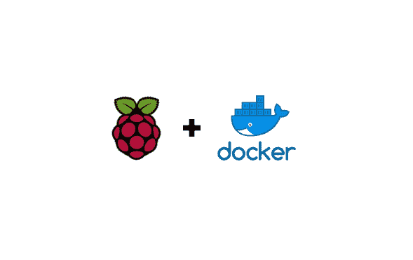
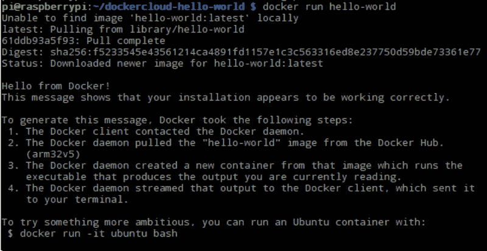

# 在 Raspberry Pi 上设置 Docker 的简单方法

> 原文：<https://www.freecodecamp.org/news/the-easy-way-to-set-up-docker-on-a-raspberry-pi-7d24ced073ef/>

瑞安·戈登

# 在 Raspberry Pi 上设置 Docker 的简单方法

Docker 是一个非常有用的工具，可以运行流行应用程序(如数据库)的容器化版本，或者在联网设备上设置一些物联网服务。

但是，如果需要在不同的计算机上多次安装 Docker，有时会很麻烦。然而，令人欣慰的是，在 Docker 文档中隐藏了一个方便的技巧，详细说明了如何在终端中安装只有两行代码的 Docker。



是的，你没听错！只需两行代码，您就可以加载和安装 Docker。

安装 Docker 可以由 bash 脚本来处理，它将自动完成整个安装。Docker 在`get.docker.com`提供了这样一个脚本。第一个命令将使用这个 URL，寻找一个名为`get-docker.sh`的文件。一旦得到，我们就运行脚本。这两个命令可以链接在一起，形成如下语句:

```
curl -fsSL get.docker.com -o get-docker.sh && sh get-docker.sh
```

现在您已经安装了 Docker，安装只需要两行代码。

正如您刚才看到的，上面的两个命令使用' && '操作符连接在一起。这意味着这些命令将一个接一个地运行，但是可以在同一行中键入。

不过，有一个小问题，如果没有 sudo，运行 Docker 命令可能会有困难。这个可以修好，但是需要多加几行。

### 如何设置 Docker 运行而不用一直使用 sudo

遇到问题后在 [AskUbuntu](https://askubuntu.com/questions/477551/how-can-i-use-docker-without-sudo) 上发现了这个解决方案。让我们现在过一遍。

#### 有 3 个步骤:

1.  如果 Docker 组不存在，请添加它:

```
sudo groupadd docker
```

2.将连接的用户“$USER”添加到 docker 组。如果不想使用当前用户，请更改用户名以匹配您的首选用户:

```
sudo gpasswd -a $USER docker
```

3.从这里您有两个选择:注销然后重新登录，或者运行`newgrp docker`以使更改生效。

你现在应该可以不用 sudo 运行 Docker 了。要测试，请尝试以下方法:

```
docker run hello-world
```

如果成功了，您应该会看到来自 Docker 的一条可爱的消息:



同样，这个解决方案的所有功劳都归于我找到的这个伟大的 AskUbuntu 答案。不需要一直输入 sudo，使用命令会容易得多。

### 但是等等，还有呢！

如果你也想要 docker-compose 呢？您可以尝试安装 docker-compose 源代码，就像我们安装 docker 一样。我在 Google Cloud Engines 文档中发现了一个有趣的方法，那就是你可以将 docker-compose 作为一个容器来运行！

这样做意味着您有一个 docker-compose 的一次性安装，它将用于组合您的服务。在任何时候，你都可以把它扔掉，然后重复这些步骤重新编写。

第一步是将 docker-compose 作为一个容器运行，并允许它访问卷。

```
docker run \    -v /var/run/docker.sock:/var/run/docker.sock \    -v "$PWD:/rootfs/$PWD" \    -w="/rootfs/$PWD" \    docker/compose:1.13.0 up
```

接下来，为 docker compose 创建一个别名:

```
echo alias docker-compose="'"'docker run \    -v /var/run/docker.sock:/var/run/docker.sock \    -v "$PWD:/rootfs/$PWD" \    -w="/rootfs/$PWD" \    docker/compose:1.13.0'"'" >> ~/.bashrc
```

然后重新加载 bash:

```
source ~/.bashrc
```

现在您可以完全访问 docker-compose 了。上面定义的别名意味着，当您想要使用 compose 容器时，不必键入 docker 命令，您可以像平常一样使用' docker-compose'。

### 关于 RPi 上 Docker 的重要通知

Raspberry Pi 使用 ARM 架构，因此不能兼容所有开箱即用的容器。图像将需要从一个 ARM 基础图像构建。

您可以通过在 Raspberry Pi 上运行一个容器化的 Redis 实例来看到这一点(这与我即将撰写的系列文章非常相关)。这样做将需要使用基础映像。如果我们使用 ARM 兼容的映像，应该不会出现问题。问题是找到一个维护良好的。

如果你喜欢这篇文章，给它一个掌声。

我的页面上还有其他与微服务、Ionic 等相关的帖子。