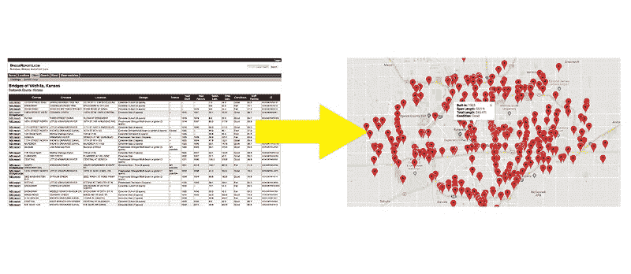
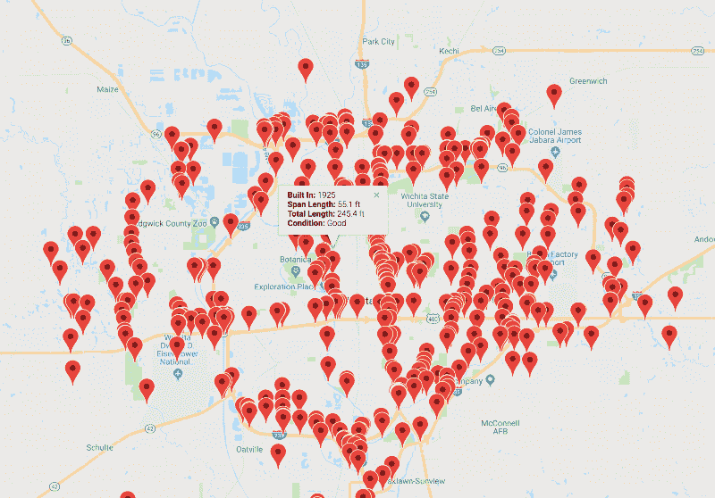

# 如何用 Ruby 和 Nokogiri 刮和映射数据

> 原文：<https://www.freecodecamp.org/news/how-to-scrape-with-ruby-and-nokogiri-and-map-the-data-bd9febb5e18a/>

作者安德鲁·贝尔斯

# 如何用 Ruby 和 Nokogiri 刮和映射数据


Ruby, JSON, & Nokogiri

有时候你想从一个网站获取数据用于你自己的项目。那你用什么？鲁比，诺吉里和杰森来营救了！

最近，我在做一个项目，绘制关于桥梁的数据。使用 Nokogiri，我能够从一个表格中获取一座城市的桥梁数据。然后，我使用该表中的链接来抓取相关页面。最后，我将抓取的数据转换成 JSON，并用它来填充 Google 地图。

本文将带您了解我使用的工具以及代码是如何工作的！

在我的 [GitHub](https://github.com/agbales/wichita-bridges) repo 上查看完整代码。

现场地图演示[这里](https://agbales.github.io/wichita-bridges/)。

### 该项目

我的目标是从一个桥梁数据网站获取一个表格，并把它转换成一个带有地理定位针的谷歌地图，为每座桥梁生成信息弹出窗口。



The Idea: HTML Table to Map

为此，我需要:

1.  从原始网站上抓取数据。
2.  将数据转换成一个 [JSON 对象](https://www.w3schools.com/js/js_json_objects.asp)。
3.  应用这些数据制作一个新的交互式地图。

你的项目肯定会有所不同——有多少人在尝试绘制古桥地图？—但我希望这个过程对你的背景有用。

### Nokogiri

Ruby 有一个惊人的刮网宝石，叫做 [Nokogiri](https://github.com/sparklemotion/nokogiri) 。除其他功能外，它还允许您通过 CSS 选择器搜索 HTML 文档。这意味着，如果我们知道数据存储在 DOM 中的元素的 id、类甚至类型，我们就能够将其提取出来。

#### 刮刀

如果你跟随 [GibHub repo](https://github.com/agbales/wichita-bridges) ，你可以在 bridges_scraper.rb 中找到我的刮刀

```
require 'open-uri'require 'nokogiri'require 'json'
```

Open-uri 让我们像打开文件一样打开 HTML，并把它交给 Nokogiri 来处理。

在下面的代码中，我将带有桥数据的 URL 中的 DOM 信息传递给 Nokogiri。然后，我找到保存数据的 table 元素，搜索它的行，并遍历它们。

```
url = 'https://bridgereports.com/city/wichita-kansas/'html = open(url)
```

```
doc = Nokogiri::HTML(html)bridges = []table = doc.at('table')
```

```
table.search('tr').each do |tr|  bridges.push(    carries: cells[1].text,    crosses: cells[2].text,    location: cells[3].text,    design: cells[4].text,    status: cells[5].text,    year_build: cells[6].text.to_i,    year_recon: cells[7].text,    span_length: cells[8].text.to_f,    total_length: cells[9].text.to_f,    condition: cells[10].text,    suff_rating: cells[11].text.to_f,    id: cells[12].text.to_i  )end
```

```
json = JSON.pretty_generate(bridges)File.open("data.json", 'w') { |file| file.write(json) }
```

Nokogiri 有很多方法(这里有一个[小抄](https://github.com/sparklemotion/nokogiri/wiki/Cheat-sheet)和一个入门[指南](https://readysteadycode.com/howto-parse-html-with-ruby-and-nokogiri)！).我们只用了几个。

找到带有**的表。at('table')** ，返回 DOM 中第一个出现的 table 元素。这对于这个相对简单的页面来说很好。

手拿桌子，**。search('tr')** 提供了一个我们用**迭代的行元素的数组。每个**。在每一行中，数据都被清理并放入桥数组的单个条目中。

收集完所有行后，数据被转换成 JSON 并保存在一个名为“data.json”的新文件中。

### 组合来自多个页面的数据

在这种情况下，我需要来自其他相关页面的信息。具体来说，我需要每座桥的纬度和经度，这在表格上没有显示。然而，我发现每一行的第一个单元格中的链接指向一个页面，这个页面上的*的确*提供了这些细节。

我需要编写代码来做一些事情:

*   从表中的第一个单元格收集链接。
*   从该页面的 HTML 中创建了一个新的 Nokogiri 对象。
*   抽出经纬度。
*   睡眠程序，直到该进程完成。

```
cells = tr.search('th, td')  links = {}  cells[0].css('a').each do |a|    links[a.text] = a['href']  end    got_coords = false    if links['NBI report']    nbi = links['NBI report']    report = "https://bridgereports.com" + nbi    report_html = open(report)    sleep 1 until report_html    r = Nokogiri::HTML(report_html)        lat = r.css('span.latitude').text.strip.to_f    long = r.css('span.longitude').text.strip.to_f
```

```
 got_coords = true  else    got_coords = true  end    sleep 1 until got_coords == true
```

```
 bridges.push(        links: links,        latitude: lat,        longitude: long,        carries: cells[1].text,        ..., # all other previous key/value pairs  )end
```

这里还有几件事值得指出:

*   我使用“got_coords”作为一个简单的二进制。默认设置为 **false** ，当数据被捕获或根本不可用时切换。
*   纬度和经度位于具有相应类别的跨度中。这使得保护数据变得简单。css('span.latitude') 接下来是**。文本，。剥离**和**。to_f** ,它 1)从 span 中获取文本，2)去掉多余的空格，3)将字符串转换成浮点数。

### **JSON →谷歌地图**

新形成的 JSON 对象必须稍加修改以适应 Google Maps API。我在 **map.js** 中用 JavaScript 做了这个

jsON 数据可以在 **map.js** 中访问，因为它已经被移动到 JS 文件夹中，分配给一个名为“bridge_data”的变量，并包含在 index.html 的<脚本>标签中。

好吧！我们现在将把 JSON 文件(分配给变量 bridge_data)转换成一个新的数组，供 Google Maps 使用。

```
const locations = bridge_data.map(function(b) {  var mapEntry = [];  var info = "<b>Built In: </b>" + b.year_build + "<br>" +             "<b>Span Length: </b>" + b.span_length + " ft<br>" +             "<b>Total Length: </b>" + b.total_length + " ft<br>" +             "<b>Condition: </b>" + b.condition + "<br>" +             "<b>Design: </b>" + b.design + "<br>";  mapEntry.push(    info,    b.latitude,    b.longitude,    b.id  )  return mapEntry;});
```

我用的是[。映射](https://developer.mozilla.org/en-US/docs/Web/JavaScript/Reference/Global_Objects/Array/map)创建一个名为“locations”的新维度数组。每个条目都有信息，如果用户点击地图上的大头针，这些信息将出现在我们的谷歌地图弹出窗口中。我们还包括纬度、经度和唯一的网桥 ID。



Bridge map from JSON data

结果是一个谷歌地图，它为每座桥绘制了一系列位置，并弹出了信息丰富的弹出窗口！

这对你有帮助吗？给它几下掌声，跟着来！