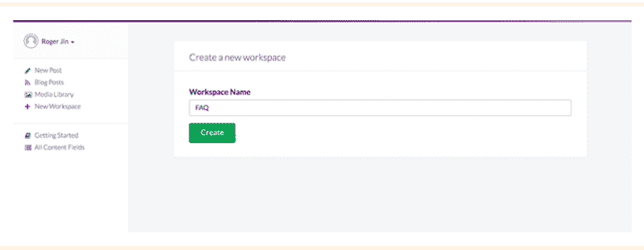

# 如何建立一个无服务器的 CMS 驱动的 Angular 应用程序

> 原文：<https://www.freecodecamp.org/news/how-to-build-a-serverless-cms-powered-angular-app-3eb76605799f/>

杰克·卢梅塔

# 如何建立一个无服务器的 CMS 驱动的 Angular 应用程序

这篇教程是我上一篇关于如何构建一个无服务器的 CMS 驱动的 Vue.js 应用程序的教程的后续，并向你展示如何构建一个无服务器的 CMS 驱动的 Angular 应用程序。


[Helloquence](https://unsplash.com/@helloquence?utm_source=medium&utm_medium=referral) on [Unsplash](https://unsplash.com?utm_source=medium&utm_medium=referral)

Angular 由 Google 工程师开发和维护，已经在动态 web 应用程序中找到了一席之地，并且是一种越来越受欢迎的语言。对于前端开发来说，它是一种健壮而全面的语言，可以进行单元测试，这使得它成为许多开发人员的首选语言。Angular 通过扩展 HTML 的语法来允许您快速创建内容管理功能，从而简化了前端开发体验。

由于 Angular 的简单性，开发人员越来越多地利用它来为网站添加 CMS 功能。

对于 Wordpress 用户来说，集成内容管理功能的一种流行方式是使用 wp-api-angular 库，它允许你与 Wordpress API 和 angular 应用程序进行交互。如果你使用 Wordpress 作为 CMS 平台，使用 Angular 和 Wordpress API 可以减少页面内容的加载时间。

对于那些不使用 Wordpress 的人来说，有一种新的基于 API 的 CMSs 大大简化了事情。我们将在这里讨论一个例子。

在本文中，我们将使用 [ButterCMS](https://buttercms.com/) 作为 Wordpress 的替代方案，以及一个基于 SaaS 的 headless CMS 的例子，它提供了一个托管 CMS 仪表板和内容 API，您可以从 Angular 应用程序中查询。这意味着您不需要启动任何新的基础设施来将 CMS 添加到 Angular 应用程序中。

本教程将演示如何构建一个基于 CMS 的 Angular 应用程序，它包含营销页面(客户案例研究)、博客和 FAQ，所有这些都是通过 API 实现的。不需要服务器！

### 装置

首先，您将从安装 Angular cli 开始。

```
npm install -g @angular/cli
```

使用 Angular cli 设置新的角度项目。默认情况下，angular-cli 使用 CSS 样式，因此添加`—-style=scss`标志告诉 Angular CLI 使用 s CSS。

```
ng new hello-buttercms-project --style=scsscd hello-buttercms-project
```

安装角形材料和角形材料相关包装。

```
npm install --save @angular/material @angular/cdknpm install --save @angular/animations
```

安装 ButterCMS。在命令行中运行以下命令:

```
npm install buttercms --save
```

黄油也可以用 CDN 装载:

```
&lt;script src="https://cdnjs.buttercms.com/buttercms-1.1.1.min.js">&lt;/script>
```

### 快速开始

在您选择的代码编辑器中打开项目。在 src/app 下，创建一个名为`_services`的目录

我们将创建一个名为`butterCMS.service.js`的文件。这允许您将 API 令牌放在一个地方，而不会意外地更改它。

```
import * as Butter from 'buttercms';
```

```
export const butterService = Butter('b60a008584313ed21803780bc9208557b3b49fbb');
```

您将把这个文件导入到任何想要使用 ButterCMS 的组件中。

对于快速入门，请转到`src/app/hello-you/hello-you.component.ts`并导入`butterService`

```
import {butterService} from '../_services';
```

在`HelloYouComponent`里面，创建方法:

```
fetchPosts() {  butter.post.list({    page: 1,    page_size: 10  })  .then((res) => {    console.log(‘Content from ButterCMS’)    console.log(res)  })}
```

现在，通过将组件添加到`OnInit`生命周期挂钩来加载组件时，调用此方法:

```
ngOnInit() {  this.fetchPosts();}
```

这个 API 请求获取一篇示例博客文章。您的帐户附带了一个示例帖子，您将在回复中看到。如果您得到响应，这意味着您现在能够连接到 API 了。

### 添加营销页面

设置 CMS 支持的页面需要三个步骤:

1.  定义页面类型
2.  创建页面
3.  集成到您的应用中

#### **定义页面**

首先，创建一个页面类型来表示您的客户案例研究页面。接下来，定义您的客户案例研究所需的字段。定义好页面类型后，您现在可以创建第一个案例研究页面。指定页面的名称和 URL，然后填充页面的内容。


定义好页面后，ButterCMS API 将以 JSON 格式返回页面，如下所示:

```
{    "data": {      "slug": "acme-co",      "fields": {        "facebook_open_graph_title": "Acme Co loves ButterCMS",        "seo_title": "Acme Co Customer Case Study",        "headline": "Acme Co saved 200% on Anvil costs with ButterCMS",        "testimonial": "<p>We’ve been able to make anvils faster than ever before! — <em>Chief Anvil Maker</em></p>\r\n<p></p>",        "customer_logo": "https://cdn.buttercms.com/c8oSTGcwQDC5I58km5WV",        }     }  }
```

本指南使用 Angular 框架和 Angular CLI 来生成所有组件并打包我们的应用程序。

让我们来看看代码。

#### 创建新项目

```
ng new buttercms-project --style=scsscd buttercms-projectnpm install --save @angular/material @angular/cdknpm install --save @angular/animationsnpm install -S buttercmsng serve
```

您的 localhost:4200 应该准备好为您的 Angular page 提供服务了。

#### 创建 typescript 以导出 ButterCMS 服务

在`src/app`下创建一个名为`_services`的目录。创建一个名为`butterCMS.service.js`的文件。

```
import * as Butter from 'buttercms';export const butterService = Butter('your_api_token');
```

#### 更新组件路线

这些分量由 Angular CLI 使用以下内容生成:

`ng g component <my-new-compone` nt >

在`src/app`下创建一个名为`app-routing.module.ts`的文件

```
import {NgModule} from '@angular/core';import {RouterModule, Routes} from '@angular/router';import {CustomerComponent} from './customer/listing/customer.listing.component';import {FaqComponent} from './faq/faq.component';import {BlogPostComponent} from './blog-post/listing/blog-post.component';import {HomeComponent} from './home/home.component';import {CustomerDetailsComponent} from './customer/details/customer.details.component';import {BlogPostDetailsComponent} from './blog-post/details/blog-post.details.component';import {FeedComponent} from './feed/feed.component';import {HelloYouComponent} from './hello-you/hello-you.component';
```

```
const appRoutes: Routes = [    {path: 'customer', component: CustomerComponent},    {path: 'customer/:slug', component: CustomerDetailsComponent},    {path: 'faq', component: FaqComponent},    {path: 'blog', component: BlogPostComponent},    {path: 'blog/:slug', component: BlogPostDetailsComponent},    {path: 'rss', component: FeedComponent},    {path: 'hello-you', component: HelloYouComponent},    {path: 'home', component: HomeComponent},    {path: '**', redirectTo: 'home'}];
```

```
@NgModule({    imports: [RouterModule.forRoot(appRoutes)],    exports: [RouterModule]})export class AppRoutingModule {}
```

### 设置客户列表页面

在`apps/customer`下键入:`ng g component`

在文件`apps/customer/listing/customer.listing.component.ts`中:

1.  导入`butterService`
2.  在`OnInit` hook 中，使用`butterService`获取客户列表
3.  将结果存储在 pages 变量和标记(HTML)中，并用数据进行更新

```
import {Component, OnInit} from '@angular/core';import {butterService} from '../../_services';
```

```
@Component({    selector: 'app-customer',    templateUrl: './customer.listing.component.html',    styleUrls: ['./customer.listing.component.scss']})
```

```
export class CustomerComponent implements OnInit {  public pages: any[];  constructor() { }
```

```
ngOnInit() {  butterService.page.list(‘customer_case_study’)    .then((res) => {      this.pages = res.data.data;  }); }}
```

在`customer.listing.component.html`中显示结果

```
&lt;mat-card&gt;  <mat-card-title class="page-title">;Customers</mat-card-title&gt;  <mat-divider></mat-divider>  <mat-card-content class="page-body">    <mat-card *ngFor="let page of pages">      <mat-card-title&gt;        <div class="container">          <a [routerLink]="[page.slug]">            <div fxLayout="row" fxLayout.xs="column"                 fxFlex class="content">            <div class="blocks">                          </div>            <div class="blocks"&gt;              {{page.fields.headline}}            </div>          </div>        &lt;/a>      </div>    </mat-card-title>  </mat-card></mat-card-content>&lt;mat-divider></mat-divider><mat-card-footer>  <div class="page-footer">    <mat-icon>whatshot</mat-icon>  </div></mat-card-footer></mat-card>
```

### 设置客户详细信息页面

在`apps/customer`下，输入`ng g component details`。

```
apps/customer/details/customer.details.component.ts
```

#### 创建客户页面

1.  导入`butterService`
2.  在`OnInit`钩子中，使用`butterService`获取 URL 路径中给定的用户页面
3.  将使用客户数据更新页面变量和标记(HTML)中的存储结果

```
import {Component, OnInit} from '@angular/core';import {Observable} from 'rxjs/Observable';import {ActivatedRoute} from '@angular/router';import {butterService} from '../../_services';import {map, take} from 'rxjs/operators';
```

```
@Component({  selector: 'app-customer-details',  templateUrl: './customer.details.component.html',  styleUrls: ['./customer.details.component.scss']})
```

```
export class CustomerDetailsComponent implements OnInit {  constructor(protected route: ActivatedRoute) { }
```

```
 protected slug$: Observable<string>;  public page: any;
```

```
 ngOnInit() {    this.slug$ = this.route.paramMap    .pipe(      map(params => (params.get('slug')))   );
```

```
 this.slug$.pipe(      take(1))        .subscribe(slug => {          butterService.page.retrieve('customer_case_study', slug)            .then((res) => {              this.page = res.data.data;            }).catch((res) => {            console.log(res);          });        });      }    }
```

在`customer.details.component.html`中显示结果

```
&lt;mat-card&gt;  <div class="container"&gt;    <div fxLayout="column" class="details">      <div class="blocks">              </div>
```

```
 &lt;h1 class="blocks">        {{page.fields.headline}}      </h1&gt;      <h3 class="is-size-3"&gt;Testimonials</h3>      <div [innerHTML]="page.fields.testimonial"></div>      &lt;div [innerHTML]="page.fields.body"></div>    </div>  </div></mat-card>
```

现在，您可以通过所有客户页面的列表或直接通过 URL 导航到客户页面。

### 添加知识库

#### 设置内容字段

让我们假设您想要向一个静态 FAQ 页面添加一个 CMS，该页面带有一个标题和一个带有答案的问题列表。

用 Butter 让你的内容动态化是一个两步的过程:

1.  在 Butter 中设置自定义内容字段
2.  将字段集成到您的应用程序中

要设置自定义内容字段，请先登录 Butter dashboard。

创建一个新的工作区或单击现有的工作区。工作区允许您以对内容编辑者友好的方式组织内容字段，并且对开发或 API 没有影响。例如，一个房地产网站可能有一个名为“属性”的工作区和一个名为“关于页面”的工作区。



进入工作区后，单击按钮创建新的内容字段。选择“对象”类型，并将字段命名为“常见问题标题”


保存后，添加另一个字段，但这次选择“集合”类型，并将字段命名为`FAQ Items`。

在下一个屏幕上，为集合中的项目设置两个属性。

现在回到你的工作区，更新你的标题和常见问题。

### 集成您的应用

#### 创建常见问题组件

在`apps`下键入:`ng g component faq`

```
apps/faq/faq.component.ts
```

#### 设置 onInit 挂钩以加载 FAQ

```
import {Component, OnInit} from '@angular/core';import {butterService} from '../_services';
```

```
@Component({  selector: 'app-faq',  templateUrl: './faq.component.html',  styleUrls: ['./faq.component.scss']})
```

```
export class FaqComponent implements OnInit {  constructor() {}
```

```
 public faq: any = {      items: [],      title: 'FAQ' };
```

```
ngOnInit() {  butterService.content.retrieve(['faq_headline', 'faq_items'])    .then((res) => {      console.log(res.data.data);      this.faq.title = res.data.data.faq_headline;      this.faq.items = res.data.data.faq_items;    });  }}
```

#### 显示结果

```
&lt;mat-card&gt;  <mat-card-title class="page-title"></mat-card-title&gt;  <mat-divider></mat-divider>  <mat-card-content class="page-body">    <mat-card *ngFor="let item of faq.items">      <mat-card-content>        <h3>;          {{item.question}}       &lt;/h3>       <div&gt;         {{item.answer}}       </div>     </mat-card-content>   <;/mat-card&gt; </mat-card-content> <mat-divider&gt;</mat-divider&gt;   &lt;mat-card-footer&gt;     <div class="page-footer">       <mat-icon>whatshot</mat-icon>     </div>   </mat-card-footer> </mat-card>
```

在 Butter dashboard 中输入的值将立即更新我们应用程序中的内容。

### 博客

要显示帖子，您需要在应用程序中创建一个`/blog`路径，从 Butter API 获取博客帖子，以及一个`/blog/:slug`路径来处理单个帖子。

有关其他选项，如按类别或作者过滤，请参见 API 参考。响应还包括一些我们将用于分页的元数据。

#### 设置博客主页

在`apps/blog-post`下，键入:`ng g component listing`。

```
apps/blog-post/listing/blog-post.listing.component.ts
```

更新组件以获取所有帖子:

1.  导入`butterService`
2.  获取所有帖子`onInit`

```
import {Component, OnInit} from '@angular/core';import {butterService} from '../../_services';
```

```
@Component({  selector: 'app-blog-post',  templateUrl: './blog-post.component.html',  styleUrls: ['./blog-post.component.scss']})export class BlogPostComponent implements OnInit { public posts: any[];
```

```
 constructor() { }
```

```
ngOnInit() {  butterService.post.list({  page: 1,  page_size: 10}).then((res) => {  console.log(res.data)  this.posts = res.data.data;  }); }}
```

显示结果:

```
&lt;mat-card&gt; <mat-card-title class="page-title">Blog Posts</mat-card-title>; <mat-divider></mat-divider> <mat-card-content class="page-body">   <mat-card *ngFor=”let post of posts”>     <mat-card-title>
```

```
 &lt;a [routerLink]="[post.slug]">       <div class="container">;         <div fxLayout="row" fxLayout.xs="column"           fxFlex class="content"&gt;          <div class="blocks">            ;          </div>          <div class="blocks"&gt;            {{post.title}}          <;/div>        </div>;      </div>      <div class="container"&gt;        <div fxLayout="column" class="summary">          &lt;div [innerHTML]="post.summary"></div>        </div&gt;      </div>    </a>  </mat-card-title></mat-card></mat-card-content><mat-divider></mat-divider>
```

```
&lt;mat-card-footer&gt;  <div class="page-footer">    <mat-icon>whatshot&lt;/mat-icon>  &lt;/div> </mat-card-footer></mat-card>
```

#### 设置博客文章页面

在`apps/blog-post`下，键入:`ng g component details`

```
apps/blog-post/details/blog-post.details.component.ts
```

要显示单个帖子:

1.  导入`butterService`
2.  在`OnInit` hook 中，使用`butterService`获取给定 URL 路径中 slug 的博客文章
3.  将使用客户数据更新 post 变量和标记(HTML)中的存储结果

```
import {Component, OnInit, ViewEncapsulation} from '@angular/core';import {Observable} from 'rxjs/Observable';import {ActivatedRoute} from '@angular/router';import {butterService} from '../../_services';import {map, take} from 'rxjs/operators';
```

```
@Component({  selector: 'app-blog-post-details',  templateUrl: './blog-post.details.component.html',  styleUrls: ['./blog-post.details.component.scss'],  encapsulation: ViewEncapsulation.None})
```

```
export class BlogPostDetailsComponent implements OnInit {
```

```
 constructor(protected route: ActivatedRoute) {    }
```

```
 protected slug$: Observable<string>;    public post = {      meta: null,      data: null};
```

```
ngOnInit() {  this.slug$ = this.route.paramMap      .pipe(        map(params => (params.get('slug')))      );
```

```
 this.slug$.pipe(      take(1))      .subscribe(slug => {        butterService.post.retrieve(slug)          .then((res) => {            this.post = res.data;          }).catch((res) => {          console.log(res);       });   }); }}
```

显示结果:

```
<mat-card&gt;  <div class="container"&gt;    <div fxLayout="column" class="blog-details">      <div class="container">        <div fxLayout="row">          <h1 class="blocks">            {{post.data.title}}          </h1>          <div *ngIf="post.meta.previous_post">&lt;a [routerLink]="post.meta.previous_post">&lt;</a></div>          <div *ngIf="post.meta.next_post">;&lt;a [routerLink]="post.meta.next_post">></a></div>        </div>;        <;h4>          {{post.data.author.first_name}}     {{post.data.author.last_name}}        </h4>        <div class="post-body" [innerHTML]="post.data.body"></div>      </div>    </div>  </div></mat-card>
```

现在，您的应用程序有了一个工作博客，可以在 ButterCMS 仪表板中轻松更新。

### 类别、标签和作者

使用 Butter 的类别、标签和作者 API 来突出和过滤你博客上的内容。

#### 列出所有类别并按类别获取帖子

在`onInit()`生命周期挂钩上调用这些方法:

```
methods: { ... getCategories() {   butter.category.list()     .then((res) => {       console.log('List of Categories:')       console.log(res.data.data)     }) }, getPostsByCategory() {   butter.category.retrieve('example-category', {       include: 'recent_posts'     })     .then((res) => {       console.log('Posts with specific category:')       console.log(res)     })   } }, created() { ... this.getCategories() this.getPostsByCategory()}
```

```
 getCategories() {  butter.category.list()  .then((res) => {   console.log(‘List of Categories:’)   console.log(res.data.data)  }) }, getPostsByCategory() {  butter.category.retrieve(‘example-category’, {   include: ‘recent_posts’  })  .then((res) => {   console.log(‘Posts with specific category:’)   console.log(res)  }) }},created() { … this.getCategories() this.getPostsByCategory()}
```

### 包裹

恭喜你，你已经成功地将你的静态 Angular 应用程序变成了一个使用内容 API 的 CMS 驱动的应用程序，从而维护了一个无服务器架构。您的开发团队可以利用 Angular 节省时间的优势，通过使用无服务器 CMS，您甚至可以节省更多的时间。

如果你喜欢这篇文章，请在下面鼓掌帮助它传播！更多类似的内容，请在 [Twitter](https://twitter.com/ButterCMS) 上关注我们，在[订阅](https://buttercms.com/blog/)我们的博客。

*如果你想在你的网站上添加博客或 [Angular CMS](https://buttercms.com/angular-cms/) 而不去摆弄 Wordpress，[你应该试试 Butter CMS](https://buttercms.com/) 。*