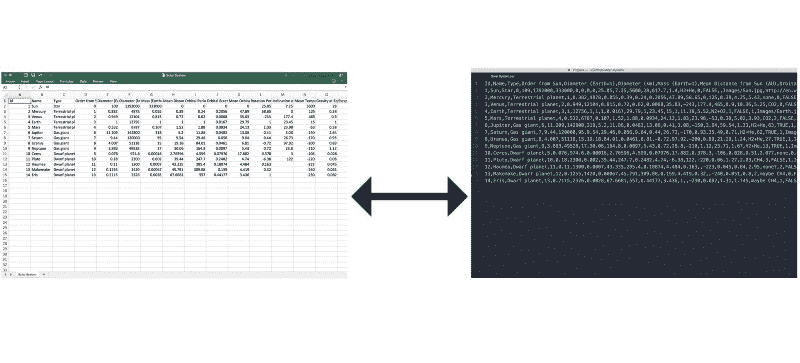
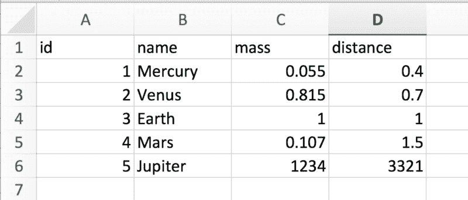

# 如何用 CSV 和 Ruby 构建一个终端游戏

> 原文：<https://www.freecodecamp.org/news/how-you-can-build-a-terminal-game-with-csv-and-ruby-a269f17b88b0/>

作者安德鲁·贝尔斯

# 如何用 CSV 和 Ruby 构建一个终端游戏

在本文中，您将学习如何用 CSV 和一些 Ruby gems 构建一个终端游戏！看上面视频里的演示，在 [GitHub](https://github.com/agbales/solar-system) 上找代码。

这个项目来自我在西雅图 Ada 开发者学院的一次演讲。主题是 Ruby CSV 库，我想用一种有趣的方式来展示它的方法和潜力。

在课堂上，我们讨论了大多数人如何使用 Excel 等程序来创建和编辑 CSV。他们通过点击单元格和改变值来进行更新。但是对我们来说，问题变成了:如果我们像对待**程序员**一样对待 CSV，我们能做什么？使用像 Ruby 这样的编程语言，如何打开、读取和操作这些值呢？那些有序的行和列能成为应用程序的数据库吗？

本文分三个部分讨论这些问题:

1.  逗号分隔的值
2.  Ruby 的 CSV 库:创建、打开、追加、使用头文件
3.  构建游戏

### 逗号分隔的值

CSV 代表逗号分隔值，听起来就是这个意思。如果您曾经在 Excel 之类的程序中打开过这些文件中的一个，您就会看到这些值呈现在电子表格中。

但是，如果您在 Atom 或 Sublime 这样的文本编辑器中打开同一个文件，您会发现一系列逗号分隔的值。如下所示，Excel 使用这些原始值来呈现用户友好的表格。



### 快速设置

如果你下载了这个 [GitHub 库](https://github.com/agbales/solar-system)，就很容易理解了。完成后，在终端中导航到该文件夹。这个回购包括下面例子中的**所有** ，所以请知道你需要注释掉你不想运行的部分。

此外，您会想要安装[令人敬畏的打印](https://github.com/awesome-print/awesome_print)，它美化了终端输出:

```
gem install awesome_print
```

### Ruby 的 CSV 库

Ruby 附带了一个 [CSV 库](http://ruby-doc.org/stdlib-2.0.0/libdoc/csv/rdoc/CSV.html)，允许我们打开、读取和操作 CSV 文件。

#### **创建 CSV**

让我们从制作自己的 CSV 开始。在 Github repo 中，您可以找到 planets.rb。该文件首先将变量 planets 设置为一个二维数组(数组的数组)。

在每一个中，我们都有行星的属性:id、名称、质量和距离。我们已经将属性名作为另一个数组赋给了 headers 变量。

```
require 'csv'require 'awesome_print'
```

```
planets = [  [1, "Mercury", 0.055, 0.4],  [2, "Venus", 0.815, 0.7],  [3, "Earth", 1.0, 1.0],  [4, "Mars", 0.107, 1.5]]headers = ["id", "name", "mass", "distance"]CSV.open("planet_data.csv", "w") do |file|  file << headers  planets.each do |planet|    file << planet  endend
```

上面，CSV.open 最多接受三个参数:

```
CSV.open(file name, mode, options)
```

我们给它一个文件名(planet_data.csv)。因为我们也给了模式“w”(只写)，它为我们创建了一个新文件，即使它还不存在。这次没有传递任何选项。

下面的块做一些事情:

1.  它将 headers 数组添加到我们创建的文件中。这将创建一个包含四列的单行—每一列都有一个属性名称的字符串条目。
2.  我们使用 planets.each 遍历 planet 数组(填充了关于它的 id、名称等信息),并将每个条目作为单独的一行追加。

如果您运行这段代码，您会发现已经创建了以下 CSV:



#### 模式

上面，我们使用“w”作为我们的模式来编写一个新文件。根据手头的任务，您还有许多其他选择。要考虑的最大因素是你是否想读和/或写，以及你想在 CSV 的哪里开始你的工作。

例如，如果您使用该文件来填充您的网站列表，“r”(只读)将是一个合适的模式。如果您想在 CSV 中添加新的行星，那么“a”模式(追加读写)将从文件末尾开始，并立即让您追加这些行。

以下是模式的完整列表:

```
“r”  Read-only, starts at beginning of file (default mode).“r+” Read-write, starts at beginning of file.“w”  Write-only, truncates existing file to zero length.“w+” Read-write, truncates existing file to zero length.“a”  Append write-only, starts at end of file if file exists.“a+” Append read-write, starts at end of file if file exists.“b”  Binary file mode.“t”  Text file mode.
```

#### **追加**

我们可以向 planet_data.csv 追加一个新行星，如下所示:

```
CSV.open("planet_data.csv", "a") do |file|  file << [5, "Jupiter", 1234, 3321]end
```

在上面的模式列表中，“a”是“只写”和“从文件末尾开始”所以木星的信息会被插入到现有 CSV 的末尾。

#### 重复

因为。用“r”模式打开会返回一个数组的数组，我们可以用。每个循环遍历这些行。下面的代码将在终端中打印 CSV 的每一行。

```
CSV.open("planet_data.csv", "r").each do |row|  ap rowend
```

你可以更进一步创造插入的句子！

```
CSV.open("planet_data.csv", "r").each do |row|  ap "#{row[1]} has a mass of #{row[2]} and distance of #{row[3]}."end
```

这很好，但还可以做得更好。我们必须使用索引(1，2，3)来访问数据。这很容易出错，通常也不好玩。接下来，我们将看到如何通过传入选项来解决这个问题。

#### 使用标题

当您添加 headers 为 true 的选项时，您将得到一个新的 CSV::Table 对象。

```
csv_with_headers = CSV.open("planet_data.csv", "r", headers: true, header_converters: :symbol)csv_with_headers.each do |row|  ap rowend
```

读取头并将这些头转换成符号，我们将得到一个独特的对象:一个散列数组。这意味着可以像以前一样遍历每一行，但是我们也可以使用散列中的符号来隔离关键数据。

如果我们回到句子的例子，它变成了:

```
CSV.open("planet_data.csv", "r", headers: true, header_converters: :symbol).each do |row|  ap "#{row[:name]} has a mass of #{row[:mass]} and distance of #{row[:distance]}."end
```

这比我们之前使用的数字索引更具可读性！

当 headers 设置为 true 时，库给了我们 CSV::Table 对象，这也给了我们一些方便的方法。下面，。阅读是同义词。在“r”模式下打开:

```
csv = CSV.read("planet_data.csv", headers: true, header_converters: :symbol)ap csv               # <CSV::Table mode:col_or_row row_count:6>ap csv.headers       # Returns an array of headersap csv.by_col[:id]   # Array of id column dataap csv.by_col[:name] # Array of name column dataap csv.by_row[0]     # Entire row at 0 (or any position)ap csv[:name][3]     # Name of the 3rd entry => "Mars"ap csv[3][:name]     # 3rd row's name => "Mars"
```

### 建造一个太阳系游戏！

我们知道如何用 Ruby 打开和使用 CSV 文件中的数据，所以让我们用这些方法来制作一个太阳系游戏。


Via [SUPERNOVA](https://imahimesama.tumblr.com/post/164924479335)

#### **设置**

你需要安装 Catpix 和 Launchy。Catpix 允许在终端中显示插图，而 Launchy 允许我们控制浏览器窗口。在终端中:

```
gem install catpix gem install launchy 
```

#### **CSV 作为数据库**

您可能希望在 Excel 中打开“Solar System.csv ”,以便直观地了解每个条目的属性。一旦您对数据感到满意，我们将使用 Ruby 读取 CSV 文件，并将其赋给一个全局变量($solar_system_data)。这将作为我们的数据库。

随着游戏的开始，我们欢迎玩家来到太阳系！并像这样创建数据库:

```
require 'catpix'require 'launchy'$solar_system_data = CSV.read("Solar System.csv", headers: true, header_converters: :symbol)
```

```
ap "WELCOME TO THE SOLAR SYSTEM!"
```

当我们调用 explore_planet 方法时，游戏才真正开始。该方法包含以下代码:

```
ap $solar_system_data.by_col[:name]prompt = "Where would you like to start? 0 - #{$solar_system_data.length}"
```

```
ap promptinput = gets.chomp
```

```
until $selected_planet && /\d/.match(input)  ap prompt  input = gets.chomp  $selected_planet = $solar_system_data[input.to_i]end
```

```
ap $selected_planet
```

上面，终端打印出“name”列中的所有名字。然后，它要求用户在第一个(0-索引)到最后一个(我们的数据长度)之间选择一个条目。这是停下来考虑以下问题的好时机:

**问题:**如果我们已经使用了头来获得散列，那么 solar_system_data.length == 14？

**回答:**这个 CSV::Table 可能**看起来**像一个散列，但它实际上是一个散列数组。因此，它有一个长度，我们可以遍历每个哈希。为了选择正确的记录，我们只需要将输入从字符串转换为整数(。to_i)

您还会看到我们使用了一个 until 语句。这验证了选择——请求响应，直到用户给我们一个有效的数字。一旦做出正确的选择，终端就会打印出行星信息。

然后，用户可以选择他们是否想了解或看到这个星球:

```
prompt = "Do you want to LEARN or SEE?"ap prompt
```

```
while input = gets.chomp  case input.downcase  when "learn"    Launchy.open($selected_planet[:uri])    return  when "see"    Catpix::print_image $selected_planet[:image]    return  else    ap prompt  endend
```

与前面类似，while 语句用于确保我们得到一个有效的条目。这一次，它要么使用 Launchy 打开行星的相关 URI，要么使用 Catpix 在终端中打印图像。

这个游戏还有一个功能。这保存在 select_attribute 方法中。我们使用刚刚介绍过的 CSV 方法返回数据库中每个星球的特定属性。

```
ap "Which attribute do want to see for each planet (ex: number_of_moons)?"
```

```
ap $solar_system_data.headers.to_sattribute = gets.chomp
```

```
ap "Here are the #{attribute} findings:"
```

```
$solar_system_data.each do |row|  ap "#{row[:name]} --> #{attribute}: #{row[attribute.to_sym]}"end
```

首先，我们将所有的标题打印成字符串。这为用户提供了一个可供选择的属性列表。有了用户响应，我们可以列出行星名称以及请求的属性及其值。

最后，他们可以选择另一个属性或重新开始并探索各个行星:

```
prompt = "SELECT another attribute or EXPLORE another planet?"ap prompt
```

```
while input = gets.chomp  case input.downcase  when "select"    select_attribute()  when "explore"    explore_planet()  else    ap prompt  endend
```

我希望这有助于阐明 CSV 方法，并让你对制作自己的游戏感到兴奋。

如果你扩展了这个或者设计了新的东西，请留下评论。我很想看看你能想出什么！