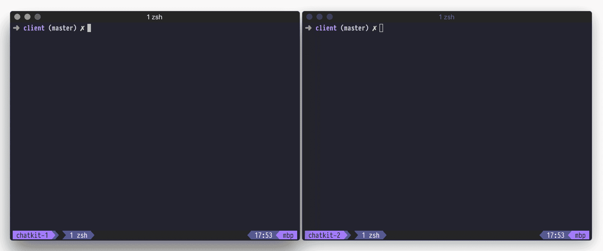
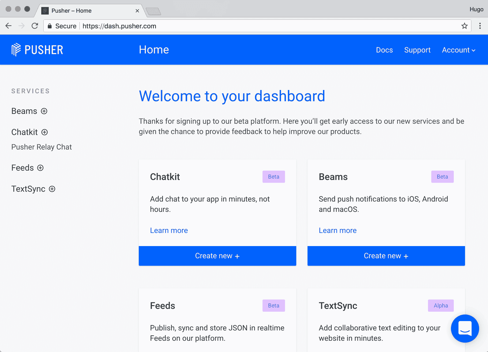
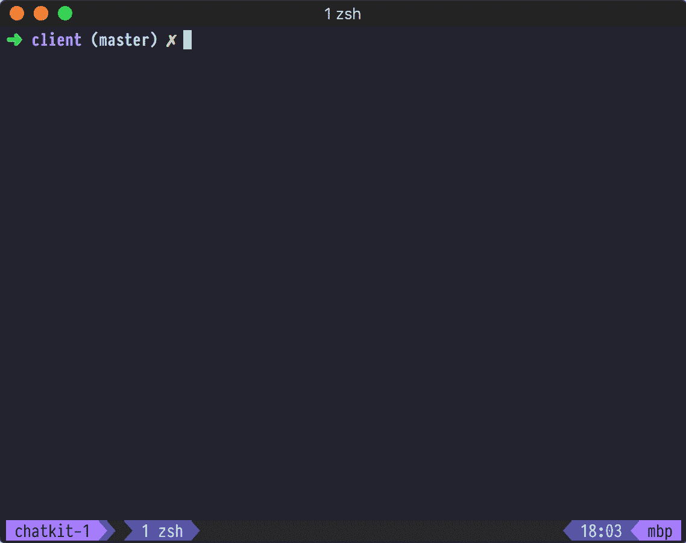
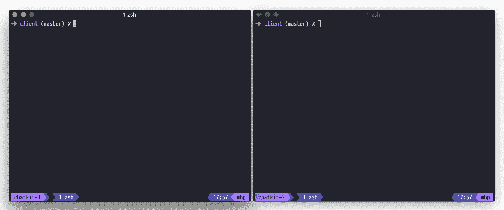
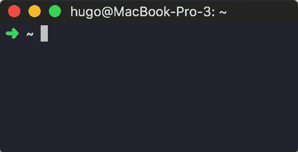

# 使用 Chatkit 构建 Node.js 命令行聊天应用程序

> 原文：<https://www.freecodecamp.org/news/build-a-node-js-command-line-chat-application-with-chatkit-8d0c4546085e/>

雨果

# 使用 Chatkit 构建 Node.js 命令行聊天应用程序

在你的应用中建立聊天可能相当复杂。然而，使用 [Chatkit](http://pusher.com/chatkit) ，实现全功能聊天只需要几行代码。

在本教程中，我将指导您如何构建命令行聊天，如下所示:



完整的代码可以在 [GitHub](https://github.com/pusher/chatkit-command-line-chat) 上找到。

### 什么是聊天工具？

你可能想知道，“什么是聊天工具？”

简而言之，Chatkit 是一个 API，可以帮助你在应用程序中构建聊天功能。功能包括:

*   房间
*   在线状态
*   打字指示器
*   阅读指示器(未读邮件计数、已读回执)
*   富媒体消息
*   更多

此外，Chatkit 处理构建实时聊天时出现的棘手细节，如可靠性和规模。

对我来说，使用 Chatkit 意味着不必处理滚动 web socket 服务器、管理它的基础设施，以及处理大规模的聊天管理！

在本教程中，我们将只触及 Chatkit 所能做的表面。为了让您了解可以构建什么，请查看这个由 Chatkit 提供支持的开源 Slack 克隆:

很漂亮，对吧？

### 创建 Chatkit 实例

在开始学习本教程之前，您应该设置一个 Chatkit 实例。只需要一秒钟。

要创建一个，前往[pusher.com/chatkit](http://pusher.com/chatkit)，点击**注册**。在仪表板中的“聊天工具”下，点击**创建新+** ，然后输入实例的名称。我把我的叫做“我的超赞聊天工具应用程序！”：



在**键**选项卡中，记下您的**实例定位器**和**密钥**。我们一会儿需要这些。

### 创建一个聊天室

Chatkit 使我们能够创建公共或私人聊天室，甚至支持一对一的聊天。

通常，您会动态创建房间，例如，当最终用户创建一个新房间时，但是在本教程中，我们将使用**检查员**手动创建一个房间:


### 创建认证服务器

认证是证明用户就是他们所说的那个人的行为。通常，这涉及到密码。

在本教程中，我们不会验证用户——我们不会要求他们输入密码——但是我们仍然需要编写一个返回 [Chatkit 令牌](https://docs.pusher.com/chatkit/authentication#define-a-token-provider)的`/authenticate` route。

此外，我们需要定义一个名为`/users`的路由来创建一个 Chatkit 用户。

为此，创建一个新的文件夹，我称之为 mine `terminal-chat`。然后，安装`@pusher-chatkit-server`、`express`，以及一些快递中间件:

```
mkdir terminal-chat
```

```
cd terminal-chat
```

```
npm init -y
```

```
npm install --save @pusher/chatkit-server npm install --save express npm install --save body-parser cors
```

然后，创建一个名为`server.js`的新文件，并粘贴以下代码:

记得把 `YOUR_INSTANCE_LOCATOR`和`YOUR_CHATKIT_KEY`换成自己的。

### 设置我们的客户

现在我们有了一个服务器和一个 Chatkit 实例，我们可以开始构建命令行客户端了。

在同一项目中，安装`@pusher/chatkit`和`jsdom`:

```
npm install --save @pusher/chatkitnpm install --save jsdom
```

为了清楚起见，在上一步中，我们安装了 Chatkit *服务器* SDK ( `@pusher/chatkit-server`)，在这里，我们安装了*客户端* Chatkit SDK ( `@pusher/chatkit-client`)。我们还安装了`jsdom`，稍后会详细介绍。

在名为`client.js`的新文件中，粘贴以下内容:

从顶部开始，我们首先从`@pusher/chatkit`导入`ChatManager`和`TokenProvider`。我们很快会提到这些。

我们还导入了`jsdom`，我之前提到的依赖项。

简而言之，`@pusher/chatkit-client`在浏览器中有效，但在 Node 中无效。在一个名为`makeChatkitNodeCompatible`的函数中，我们使用`jsdom`来“欺骗”Chatkit，让它认为自己正在浏览器中运行？。这是一个临时的*解决方法，但是效果很好。*

在模块的底部，我们定义了一个名为`main`的`async`函数，这使我们能够在调用异步函数时使用`await`。

如果`await`对你来说是一个新概念，这里有一个[很棒的介绍](https://www.youtube.com/watch?v=DwQJ_NPQWWo&feature=youtu.be)。

### 提示用户输入用户名

在允许用户加入房间之前，我们需要提示他们输入姓名。为此，我们可以使用`prompt.`

首先，安装`prompt`:

```
npm install --save prompt
```

然后，导入它:

然后，更新我们的主函数:

现在，如果我们用命令`node client.js`运行应用程序，我们应该得到提示:


呜？！

### 创建用户

在连接到 Chatkit 之前，我们必须首先通过我们之前编写的服务器创建一个 Chatkit 用户。

为此，我们将使用`axios`向`/users`路由发送一个请求，这是一个 HTTP 客户端:

```
npm install --save axios
```

安装`axios`后，导入它:

然后，定义一个名为`createUser`的函数:

我们现在可以用提示的用户名调用这个函数:

让我们来测试一下。

打开两个终端窗口。一种是用`node server.js`启动服务器，另一种是用`node client.js`运行客户机。如果一切正常，您*应该会提示*输入用户名，您将在服务器输出中看到`User created: <userna` me >。

如果您看到类似于`Failed to create a user, connect ECONNREFUSED`的错误，那么您的服务器可能没有运行，所以请仔细检查。

### 设置聊天工具 SDK

此时，我们有了用户名，并且能够创建用户。接下来，我们希望以该用户的身份连接到 Chatkit。

为此，在您刚刚对`createUser`的调用下，粘贴以下内容:

同样，记得用您之前提到的**实例定位器**替换您的`YOUR_INSTANCE_LOCATOR`。

这段代码初始化聊天工具，然后连接到服务，返回`currentUser`。注意我们如何提供一个指向我们的认证服务器的`TokenProvider`。

### 列出房间

现在我们有了一个经过身份验证的用户，我们可以向他们显示他们可以加入的房间列表。

为此，我们应该更新`client.js`中的 main 函数来获取可加入的房间(`getJoinableRooms`)，并将它们与用户已经*(`user.rooms`)加入的房间一起列出:*

*那里的`...`语法被称为[析构](https://developer.mozilla.org/en-US/docs/Web/JavaScript/Reference/Operators/Destructuring_assignment)，它提供了一种简洁的方法来合并两个或更多的数组。*

*运行`node client.js`现在应该会打印出一个房间列表:*

**

*一开始你可能只会看到一个房间。要创建额外的房间，请返回检查器或使用`[createRoom](https://docs.pusher.com/chatkit/reference/server-node#creating-a-room)`功能。*

### *预订房间*

*接下来，我们应该提示用户选择一个房间，代码如下:*

*关于`prompt`的一件很酷的事情是你可以创建验证规则。上面，我们创建了一个来确保用户的输入在`0`和可加入房间的数量之间。*

*一旦我们有了用户的房间选择，我们可以将其设置为`room`并订阅房间:*

*订阅后，我们添加一个`**onNewMessage**` *挂钩*。*

*你可以把钩子想象成一个每当事件发生时就被调用的函数。在这种情况下，这是当一个新的信息收到。*

*每当“用户”发送新消息时，`onNewMessage`将在**实时**中被调用。当我说“一个用户”时，*包括当前用户*，所以在这个函数中，我们只打印由其他人发送的消息。*

### *从用户输入发送消息*

*如果我们现在不能发送信息，那么能够接收信息也没有多大用处，不是吗？*

*幸运的是，使用 Chatkit 发送消息只是一行代码。*

*首先，安装`[readline](https://nodejs.org/api/readline.html)`来读取用户的输入:*

```
*`npm install --save readline`*
```

*然后，导入它:*

*最后，参考下面:*

*如果您运行客户端的两个实例，您应该能够发送和接收消息:*

**

### *添加一个加载微调为一个有趣的✨*

*像往常一样，通过网络发送数据可能需要一两秒钟。为了好玩，也为了让我们的应用程序*感觉*更快，让我们添加一个漂亮的加载微调器:*

**

*首先，安装`ora`，一个装载旋转模块:*

```
*`npm install --save ora`*
```

*那么，在`client.js`中，我们可以调用`start`、`succeed`等。这取决于命令的状态。*

*下面是完整的`client.js`文件，突出显示了新的微调器相关代码:*

### *结论*

*太棒了，我们完成了！*

*概括地说，您学习了如何:*

*   *提示并验证用户*
*   *连接到聊天工具*
*   *列出用户可用的房间*
*   *加入一个房间*
*   *从房间发送和接收消息*
*   *而且，为了好玩，添加一个装载旋转器*

*在本教程中，我们几乎没有触及 Chatkit 的表面。我们还可以构建更多，包括:*

*   *在房间之间切换*
*   *创建新房间*
*   *显示用户离线/离线状态*
*   *显示打字指示器*
*   *显示已读回执*

*想学怎么做？请在评论中告诉我，我们将撰写第二部分。*

*[亚历克斯·布克](https://www.freecodecamp.org/news/build-a-node-js-command-line-chat-application-with-chatkit-8d0c4546085e/undefined)根据这篇文章创作了一个视频教程。看看吧！*