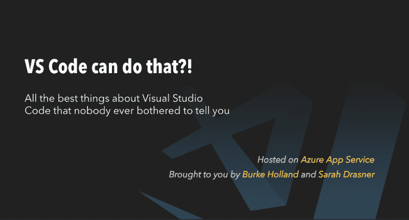

# 如何使用 Vue、Docker 和 Azure 进行持续交付

> 原文：<https://www.freecodecamp.org/news/how-you-can-do-continuous-delivery-with-vue-docker-and-azure-2f1e31fff832/>

几周前，在 [ng-conf](https://www.youtube.com/watch?v=Xco-TEI-HU4) 大会上，我宣布启动【vscodecandothat.com】T2——这是我与[莎拉·德拉斯纳](https://twitter.com/sarah_edo)合作的一个项目，旨在将我最喜欢的 VS 代码技巧集中到一个简短无声的视频剪辑集中。它就像一个充满 gif 的网站，除了没有 600 兆字节的有效载荷和崩溃的浏览器标签。

Sarah 使用 Vue 设计并构建了该网站。我把视频剪辑与过多的哈巴狗参考放在一起。

[https://www.youtube.com/embed/drXu4L-4Q3I?feature=oembed](https://www.youtube.com/embed/drXu4L-4Q3I?feature=oembed)

Sarah 和我都在 Azure 团队工作，所以这是我们在微软使用自己的工具来开发真正的应用程序的好机会。在这篇文章中，我将分解我们如何与 vscodecandothat.com 进行连续交付，以及您如何使用我们使用的相同工具来自己完成。

在我们讨论设置之前，我想确切地定义一下我所说的“连续交付”是什么意思

### 连续的某物或其他

术语连续交付指的是使发布变得简单、快速和流畅。我们可以争论这个术语的确切定义，但是请记住我是一名前端开发人员，所以我的眼睛可能会变得呆滞无神。我可能会打鼾。但是继续。我发誓我在听。

出于我们的目的，“连续交付”意味着构建和部署站点的过程是完全自动化的。现实生活中是这样的:

*   开发人员将代码签入 Github 主分支
*   构建服务器从 Github 提取代码
*   生成服务器运行生成(npm 脚本)
*   构建服务器创建一个 Docker 容器
*   构建服务器将 Docker 容器推送到注册表
*   伯克在他的办公室找到了花椰菜气味的来源
*   网站拉入更新的容器

明白了吗？基本上，我们将把你作为开发人员通常会做的所有事情自动化，这样你只需要担心把代码签入 Github。上帝知道那已经够难的了，因为它是 T1。

> 在我编程和使用 git 的大约 4 年时间里，我第一次正确地进行了 git rebase - interactive，而不必擦除、隐藏或强制破坏东西。[#人生目标](https://twitter.com/hashtag/LifeGoals?src=hash&ref_src=twsrc%5Etfw)
> 
> — Sean Larkin (廖肖恩) (@TheLarkInn) [April 29, 2018](https://twitter.com/TheLarkInn/status/990464006962982912?ref_src=twsrc%5Etfw)