# 阿帕奇风暴太棒了。这就是为什么(以及如何)你应该使用它。

> 原文：<https://www.freecodecamp.org/news/apache-storm-is-awesome-this-is-why-you-should-be-using-it-d7c37519a427/>

usana ashraf

# 阿帕奇风暴太棒了。这就是为什么(以及如何)你应该使用它。


Source: [https://pxhere.com/en/photo/77064](https://pxhere.com/en/photo/77064)

持续的数据流无处不在，随着越来越多的物联网设备被使用，这种情况变得更加普遍。当然，这意味着要存储、处理和分析大量数据，以提供可预测、可操作的结果。

但是数十亿字节的数据需要很长时间来分析，即使使用工具如 [Hadoop](http://hadoop.apache.org/) (可能和 MapReduce 一样好)或 [Spark](https://spark.apache.org/) (对 MapReduce 局限性的一种补救)。

通常，我们不需要长期推断模式。对于几个月来收集的数 Pb 的传入数据，在任何给定的时刻，我们可能不需要考虑所有的数据，只需要一个实时快照。也许我们不需要知道五年来最长的流行标签，只需要知道现在的一个。

这就是 [Apache Storm](https://storm.apache.org/) 的构建目的，接受可能来自各种来源的极快的大量数据，对其进行分析，并将实时更新发布到 UI 或其他地方……*而不存储任何实际数据*。

本文不是 Apache Storm 的最终指南，也不打算是。风暴是相当巨大的，只是一个长期阅读可能无法做到这一点。当然，任何补充，反馈或建设性的批评将非常感谢。

好了，现在这个问题已经解决了，让我们来看看我们将要讨论的内容:

*   风暴的必要性，它的“为什么”,它是什么和它不是什么
*   它是如何工作的鸟瞰图。
*   Storm 拓扑在代码(Java)中大致是什么样子
*   在 Docker 上设置和使用值得生产的 Storm 集群。
*   关于消息处理可靠性的一些话。

我还假设你至少对码头工人和集装箱化有所了解。

### 它是如何工作的

Apache Storm 的架构可以比作连接一组检查点的道路网络。交通从某个检查站(称为**喷口**)开始，并通过其他检查站(称为**门闩**)。

流量当然是数据流，它由 **spout** 检索(例如从数据源、公共 API)并被路由到各种**螺栓**，在那里数据被过滤、净化、聚合、分析，并被发送到用户界面供人们查看(或发送到任何其他目标)。

由喷嘴和螺栓组成的网络被称为**拓扑**，数据以**元组**(可能具有不同类型的值列表)的形式流动。

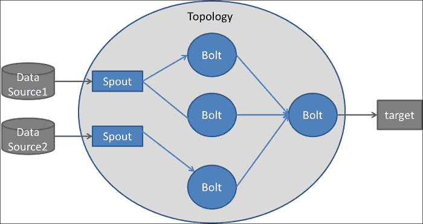

*Source*: [https://dzone.com/articles/apache-storm-architecture](https://dzone.com/articles/apache-storm-architecture*)

需要讨论的一件重要事情是数据流量的方向。

通常，我们会有一个或多个从 API、排队系统等读取数据的 spouts。然后，数据将单向流向一个或多个螺栓，这些螺栓可以将数据转发给其他螺栓，依此类推。Bolts 可以将分析的数据发布到 UI 或另一个 bolts。

但是流量几乎总是单向的，就像[有向无环图](https://en.wikipedia.org/wiki/Directed_acyclic_graph) (DAG)。虽然当然有可能形成循环，但我们不太可能需要如此复杂的拓扑结构。

安装一个 Storm 版本需要很多步骤，你可以在你的机器上自由操作。但是稍后我将使用 Docker 容器进行 Storm 集群部署，映像将负责设置我们需要的一切。

### 一些代码

虽然 Storm 确实提供了对其他语言的支持，但是大多数拓扑都是用 Java 编写的，因为这是我们拥有的最有效的选择。

一个非常基本的喷口，只是发出随机数字，可能看起来像这样:

以及一个简单的 bolt，它接收随机数字流，只发出偶数数字:

另一个简单的 bolt 将从`EvenDigitBolt`接收过滤后的流，并将每个偶数数字乘以 10，然后向前发送:

将它们放在一起形成我们的拓扑:

### 风暴拓扑中的并行性

完全理解 Storm 中的并行性可能会令人望而生畏，至少在我的经验中是这样。一个拓扑至少需要一个进程来操作。在这个过程中，我们可以使用线程并行执行我们的喷口和螺栓。

在我们的例子中，`RandomDigitSpout`将只启动一个线程，从那个线程中喷出的数据将分布在`EvenDigitBolt`的两个线程中。

但是这种分布发生的方式，称为**流分组**，可能很重要。例如，您可能有一个来自两个城市的温度记录流，其中由 spout 发出的元组如下所示:

```
// City name, temperature, time of recording
```

```
(“Atlanta”,       94, “2018–05–11 23:14”)(“New York City”, 75, “2018–05–11 23:15”)(“New York City”, 76, “2018–05–11 23:16”)(“Atlanta”,       96, “2018–05–11 23:15”)(“New York City”, 77, “2018–05–11 23:17”)(“Atlanta”,       95, “2018–05–11 23:16”)(“New York City”, 76, “2018–05–11 23:18”)
```

假设我们只连接了一个螺栓，它的工作是计算每个城市平均温度的变化。

如果我们可以合理地预期，在任何给定的时间间隔内，我们将从这两个城市获得大致相等数量的元组，那么为我们的螺栓分配两个线程是有意义的。我们可以把亚特兰大的数据发给其中一个，把纽约的数据发给另一个。

一个**字段分组**将服务于我们的目的，它通过分组中指定的字段的值在线程之间划分数据:

```
// The tuples with the same city name will go to the same thread.builder.setBolt(“avg-temp-bolt”, new AvgTempBolt(), 2)       .fieldsGrouping(“temp-spout”, new Fields(“city_name”));
```

当然，还有其他类型的分组。然而，在大多数情况下，分组可能并不重要。你可以把数据混洗一下，然后随机扔进螺栓螺纹中(**混洗分组**)。

现在还有另一个重要的组成部分:我们的拓扑将运行的工作进程的数量。

我们指定的线程总数将在工作进程中平均分配。因此，在我们的随机数字拓扑示例中，我们有一个喷口螺纹、两个偶数数字螺栓螺纹和四个乘以 10 的螺栓螺纹(总共七个)。

两个工作进程中的每一个都将负责运行两个乘以 10 的 bolt 线程，一个偶数的 bolt，并且其中一个进程将运行一个 spout 线程。

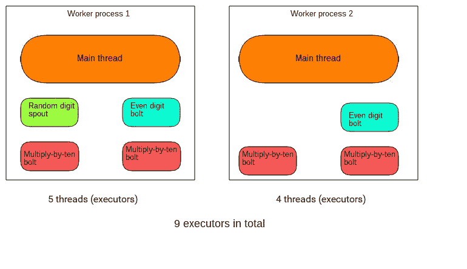

当然，这两个 worker 进程将有它们的主线程，它们将依次启动 spout 和 bolt 线程。所以我们总共有九个线程。这些统称为**执行人**。

重要的是要认识到，如果你设置一个 spout 的并行性提示大于 1(多个执行器)，你可能会多次发出相同的数据。

假设 spout 从公共 Twitter 流 API 中读取数据，并使用两个执行器。这意味着从 spout 接收数据的螺栓将获得两次相同的 tweet。只有在之后的*，spout 发出元组，数据并行性才开始发挥作用。换句话说，元组根据指定的流分组在螺栓之间划分。*

在一个节点上运行多个工作线程是毫无意义的。但是，稍后，我们将使用一个适当的分布式多节点集群，并了解不同节点上的工作人员是如何分配的。

### 构建我们的拓扑

下面是我建议的目录结构:

```
yourproject/            pom.xml             src/                jvm/                    packagename/                          RandomDigitSpout.java                          EvenDigitBolt.java                          MultiplyByTenBolt.java                          OurSimpleTopology.java
```

[Maven](https://maven.apache.org/) 通常用于构建风暴拓扑，它需要一个`pom.xml`文件(POM)[定义各种配置细节、项目依赖关系等等](https://maven.apache.org/guides/introduction/introduction-to-the-pom.html)。在这里进入 POM 的[细节可能有点矫枉过正。](https://maven.apache.org/pom.html)

*   首先，我们将在`yourproject`中运行`mvn clean`来清除我们可能有的任何编译文件，确保从头开始编译每个模块。
*   然后`mvn package`编译我们的代码，并将其打包到一个可执行的 JAR 文件中，放在一个新创建的`target`文件夹中。这第一次可能要花几分钟，尤其是如果您的拓扑有许多依赖项的话。
*   提交我们的拓扑:`storm jar target/packagename-{version number}.jar packagename.OurSimpleTopology`

希望到现在为止，Storm 中概念和代码之间的鸿沟已经在某种程度上被弥合了。然而，任何严重的风暴部署都不会是在一台服务器上运行单个拓扑实例。

### 风暴群是什么样子的

为了充分利用 Storm 的[可伸缩性](http://storm.apache.org/about/scalable.html)和[容错性](http://storm.apache.org/releases/current/Fault-tolerance.html)，任何生产级拓扑都将被提交给一个机器集群。

Storm 发行版安装在主节点(Nimbus)和所有副本节点(Supervisors)上。

主节点运行风暴[光轮](https://github.com/apache/storm/blob/exclamation/storm-server/src/main/java/org/apache/storm/daemon/nimbus/Nimbus.java)守护进程和风暴 UI。*副本*节点运行风暴[管理程序](https://github.com/apache/storm/blob/exclamation/storm-server/src/main/java/org/apache/storm/daemon/supervisor/Supervisor.java)守护进程。独立节点上的 [Zookeeper](http://zookeeper.apache.org/) 守护进程用于主节点和副本节点之间的协调。

顺便说一下，Zookeeper 只用于集群管理，从不用于任何类型的消息传递。这不像喷口和螺栓通过它或类似的东西互相发送数据。Nimbus 守护进程通过 ZooKeeper 找到可用的监管程序，监管程序守护进程向 ZooKeeper 注册。它还执行其他管理任务，其中一些将很快变得清晰。

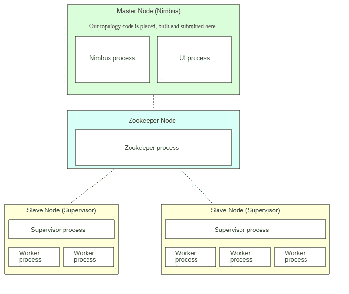

Storm UI 是一个用于管理集群状态的 web 界面。我们稍后再谈这个。

我们的拓扑被提交给主节点上的 Nimbus 守护进程，然后分布在运行在副本/管理节点上的工作进程中。多亏了 Zookeeper，最初运行多少副本/管理节点并不重要，因为您总是可以无缝地添加更多。Storm 会自动将它们整合到集群中。

每当我们启动一个监控器时，它都会分配一定数量的工作进程(我们可以配置)。提交的拓扑可以使用这些。所以在上图中，总共有五个分配的工人。

记住这句台词:`conf.setNumWorkers(5)`

这意味着该拓扑将尝试使用总共五个工作线程。由于我们的两个管理节点总共有五个分配的工作进程，这五个分配的工作进程中的每一个都将运行拓扑的一个实例。

如果我们运行了`conf.setNumWorkers(4)`，那么一个工作进程将保持空闲/未使用。如果指定的工作线程数量是 6 个，分配的工作线程总数是 5 个，那么由于限制，只有 5 个实际的拓扑工作线程可以工作。

在我们使用 Docker 设置这一切之前，有几件关于容错的重要事情需要记住:

*   如果任何副本节点上的任何工作线程死亡，Supervisor 守护程序将重启它。如果重新启动反复失败，该工人将被重新分配到另一台机器。
*   如果整个副本节点死亡，它的工作份额将交给另一个管理机/副本节点。
*   如果光轮关闭，工人们不会受到影响。然而，直到光轮恢复，工人不会被重新分配到其他副本节点，如果说，他们的节点崩溃。
*   雨云和主管本身是无国籍的。但是有了 Zookeeper，一些状态信息被存储起来，这样如果一个节点崩溃或者一个守护进程意外死亡，事情就可以从中断的地方开始。
*   光轮，监管和动物园管理员守护进程都是故障快速。这意味着它们本身对意外错误的容忍度不是很高，遇到一个就会关机。由于这个原因，它们必须在使用看门狗程序的监督下运行，该程序不断地监视它们，并在它们崩溃时自动重启它们。super visor 可能是最受欢迎的选项(不要与 Storm Supervisor 守护进程混淆)。

注意:在大多数 Storm 集群中，Nimbus 本身从不作为单个实例部署，而是作为一个集群部署。如果不包含这种容错，并且我们唯一的光轮出现故障，[我们将失去提交新拓扑、优雅地终止正在运行的拓扑、在一个管理节点崩溃时将工作重新分配给其他管理节点的能力，等等](https://hortonworks.com/blog/fault-tolerant-nimbus-in-apache-storm/)。

为了简单起见，我们的说明性集群将使用单个实例。类似地，Zookeeper 经常被部署为一个集群，但是我们将只使用一个集群。

### 对集群进行分类

启动单个的容器以及随之而来的一切可能会很麻烦，所以我更喜欢使用 [Docker Compose](https://docs.docker.com/compose/) 。

我们最初将使用一个 Zookeeper 节点、一个 Nimbus 节点和一个 Supervisor 节点。它们将被定义为组合服务，开始时都对应于一个容器。

稍后，我将使用 [Compose scaling](https://docs.docker.com/compose/reference/scale/) 来添加另一个主管节点(容器)。下面是[的完整代码](https://github.com/UsamaAshraf/coincident-hashtags-with-apache-storm/tree/exclamation)和项目结构:

```
zookeeper/          Dockerfilestorm-nimbus/          Dockerfile          storm.yaml          code/               pom.xml               src/                   jvm/                       coincident_hashtags/                                  ExclamationTopology.java storm-supervisor/          Dockerfile          storm.yamldocker-compose.yml
```

还有我们的`docker-compose.yml`:

请随意探索 docker 文件。他们基本上只是在相关容器上安装依赖项(Java 8、Storm、Maven、Zookeeper)。

`storm.yaml`文件会覆盖 Storm 安装的某些默认配置。Nimbus 和 Supervisor Dockerfiles 中的行`ADD storm.yaml /conf`将它们放入 Storm 可以读取的容器中。

`storm-nimbus/storm.yaml`:

`storm-supervisor/storm.yaml`:

这些选项对于我们的集群已经足够了。如果你很好奇，可以在这里查看所有的[默认配置。](https://github.com/apache/storm/blob/exclamation/conf/defaults.yaml)

在项目根目录下运行`docker-compose up`。

在所有的图像都已经建立并且所有的服务都已经启动之后，打开一个新的终端，输入`docker ps`，您将会看到类似这样的内容:

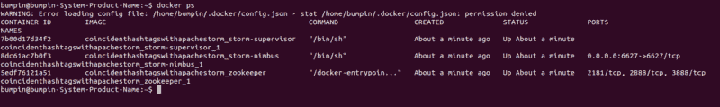

### 启动光轮

让我们使用名称 SSH 到 Nimbus 容器:

`docker exec -it coincidenthashtagswithapachestorm_storm-nimbus_1 bash`

然后启动光轮守护进程:`storm nimbus`

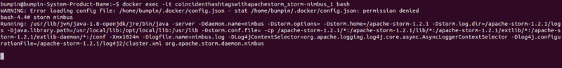

### 启动 Storm UI

类似地，打开另一个终端，再次 SSH 到 Nimbus 并使用`storm ui`启动 UI:

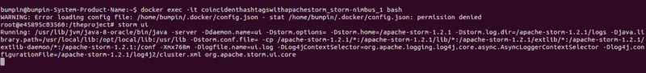

在您的浏览器上转到`localhost:8080`，您会看到我们集群的一个很好的概述:


集群摘要中的“空闲槽”表示(所有 Supervisor 节点上)总共有多少工作线程可用，并等待拓扑消耗它们。

“已用插槽”表示总数中有多少插槽当前正忙于拓扑。由于我们还没有推出任何主管，所以他们都是零。稍后我们将讨论*执行者*和*任务*。此外，正如我们所看到的，还没有提交拓扑。

### 启动 Supervisor 节点

SSH 到一个监管器容器中，并启动监管器守护进程:

```
docker exec -it coincidenthashtagswithapachestorm_storm-supervisor_1 bashstorm supervisor 
```

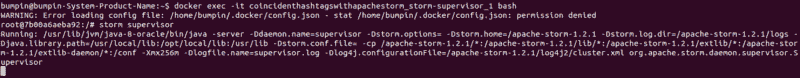

现在让我们刷新一下我们的用户界面:


注意:集群中的任何更改可能需要几秒钟才能反映在 UI 上。

我们有一个新的运行主管，配有四名工作人员。这四个 workers 是在我们的`storm.yaml`中为 Supervisor 节点指定四个端口的结果。当然都是免费的(四个免费槽)。

让我们向 Nimbus 提交一个拓扑，并让它们工作。

### 向 Nimbus 提交拓扑

SSH 在新的终端上进入光轮。我已经编写了 [Dockerfile](https://github.com/UsamaAshraf/coincident-hashtags-with-apache-storm/blob/exclamation/storm-nimbus/Dockerfile#L65) ，这样我们就可以登陆到我们的工作(登陆)目录`/theproject`。这里面是我们的拓扑所在的`code`。

[我们的拓扑非常简单](https://github.com/UsamaAshraf/coincident-hashtags-with-apache-storm/blob/exclamation/storm-nimbus/code/src/jvm/coincident_hashtags/ExclamationTopology.java)。它使用了一个生成随机单词的喷口和一个仅仅附加三个感叹号(！！！)到的话。其中两个符号是背对背添加的，所以在这个流的末尾，我们会看到有六个感叹号的单词。它还指定需要三个工人(`[conf.setNumWorkers(3)](https://github.com/UsamaAshraf/coincident-hashtags-with-apache-storm/blob/exclamation/storm-nimbus/code/src/jvm/coincident_hashtags/ExclamationTopology.java#L76)`)。

运行这些命令:

1.`cd code`
2。`mvn clean`
3。`mvn package`
4。`storm jar target/coincident-hashtags-1.2.1.jar coincident_hashtags.ExclamationTopology`

拓扑成功提交后，刷新 UI:

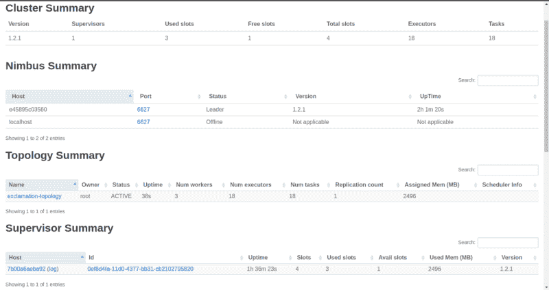

我们一提交拓扑，动物园管理员就收到了通知。动物园管理员又通知管理员从雨云下载代码。我们现在可以看到我们的拓扑以及三个被占用的工作线程，只剩下一个空闲。

以及十个字喷口螺纹+三个惊呼螺栓螺纹+两个惊呼螺栓螺纹+来自工人的三个主螺纹=总共 18 个执行者。

你可能已经注意到一些新的东西:任务。

### 什么是任务？

任务是 Storm 并行中的另一个概念。但是不要担心，任务只是一个执行者使用的喷口或插销的实例。它们是真正进行处理的东西。

默认情况下，任务的数量等于执行者的数量。在极少数情况下，您可能需要每个执行器实例化更多的任务。

```
// Each of the two executors (threads) of this bolt will instantiate// two objects of this bolt (total 4 bolt objects/tasks).builder.setBolt(“even-digit-bolt”, new EvenDigitBolt(), 2)       .setNumTasks(4)        .shuffleGrouping(“random-digit-spout”);
```

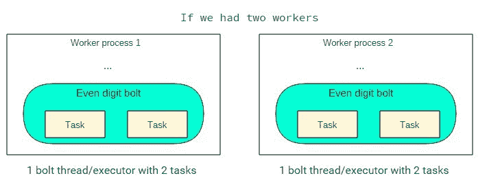

这是我的一个缺点，但是我想不出一个好的用例，在这个用例中，我们需要每个执行者有多个任务。

也许如果我们自己添加一些并行性，比如在 bolt 中生成一个新线程来处理一个长时间运行的任务，那么主 executor 线程将不会阻塞，并且能够使用另一个 bolt 继续处理。

然而，这会使我们的拓扑难以理解。如果有人知道多任务带来的性能提升超过了增加的复杂性，请发表评论。

不管怎样，从这个小弯路回来，让我们看看我们的拓扑结构的概况。单击拓扑摘要下的名称，向下滚动到工作人员资源:

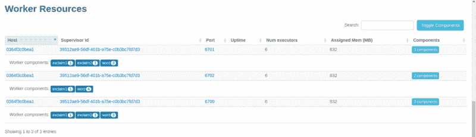

我们可以清楚地看到我们的执行者(线程)在三个工人之间的划分。当然，这三个工人都在我们运行的同一个管理节点上。

现在，让我们说横向扩展！

### 添加另一个主管

让我们从项目根添加另一个主管节点/容器:

```
docker-compose scale storm-supervisor=2
```

SSH 到新容器中:

```
docker exec -it coincidenthashtagswithapachestorm_storm-supervisor_2 bash
```

又火了起来:`storm supervisor`

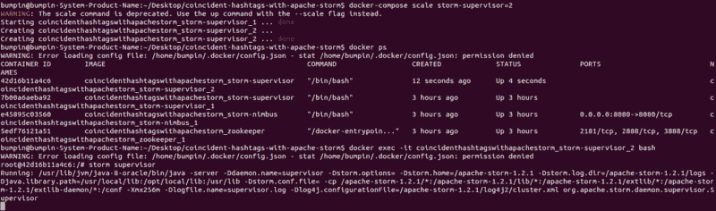

如果您刷新 UI，您将看到我们已经成功添加了另一个主管和四个工人(总共八个工人/插槽)。为了真正利用新主管，让我们增加拓扑的工作人员。

*   先干掉跑路的:`storm kill exclamation-topology`
*   将[这一行](https://github.com/UsamaAshraf/coincident-hashtags-with-apache-storm/blob/exclamation/storm-nimbus/code/src/jvm/coincident_hashtags/ExclamationTopology.java#L77)改为:`conf.setNumWorkers(6)`
*   更改您的`pom.xml`中的项目版本号。尝试使用合适的方案，比如语义版本控制。我还是坚持 1.2.1 吧。
*   重建拓扑:`mvn package`
*   重新提交:`storm jar target/coincident-hashtags-1.2.1.jar coincident_hashtags.ExclamationTopology`

重新加载用户界面:

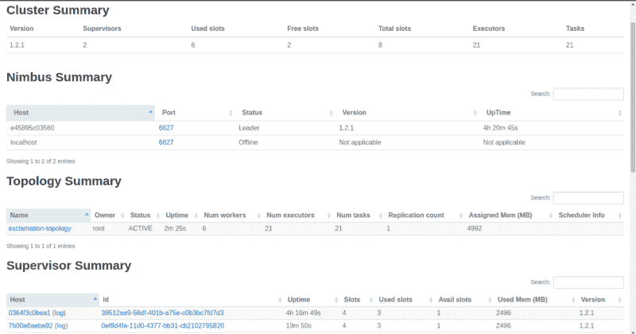

您现在可以看到新主管和总共八个可用工作人员中的六个忙碌的工作人员。

同样需要注意的是，这六个忙碌的人被平均分配给了两个主管。再次单击拓扑名称并向下滚动。

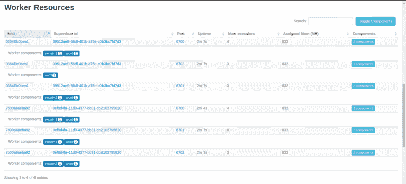

我们看到两个唯一的监督者 id，它们都运行在不同的节点上，并且我们所有的执行者在它们之间平均分配。这太棒了。

但是在拓扑运行时，Storm 提供了另一种很好的方法——重新平衡。

我们在光轮上奔跑:

```
storm rebalance exclamation-topology -n 6
```

或者更改特定组件的执行者数量:

```
storm rebalance exclamation-topology -e even-digit-bolt=3
```

### 可靠的消息处理

我们还没有解决的一个问题是，如果一个 bolt 不能处理一个 tuple 会发生什么。

Storm 为我们提供了一种机制，通过这种机制，发起的 spout(特别是*任务*)可以重放失败的元组。这种处理保证不会自己发生。这是一个有意识的设计选择，并且确实增加了延迟。

Spouts 将元组发送到 bolt，bolt 将从输入元组导出的元组发送到其他 bolt，依此类推。一个原始元组刺激整个元组树。

如果原始元组的任何子元组失败，那么任何补救步骤(回滚等)都必须在多个螺栓上进行。这可能会变得非常棘手，因此 Storm 所做的就是允许原始元组从源(喷口)再次发出。

因此，由作为传入元组的函数的螺栓执行的任何操作应该是[幂等的](https://en.wikipedia.org/wiki/Idempotence)。

当一个元组的树中的每个元组都已经被处理时，该元组被认为是“完全处理的”，并且每个元组都必须被 bolts 明确地确认。

然而，这还不是全部。还有一件事需要明确完成:维护原始元组和其子元组之间的链接。然后，Storm 将能够跟踪子元组的来源，从而能够重放原始元组。这叫做*锚定*。[这已经在我们的惊叹号](https://github.com/UsamaAshraf/coincident-hashtags-with-apache-storm/blob/exclamation/storm-nimbus/code/src/jvm/coincident_hashtags/ExclamationTopology.java#L44)中实现了:

```
// ExclamationBolt
```

```
// ‘tuple’ is the original one received from the test word spout.// It’s been anchored to/with the tuple going out._collector.emit(tuple, new Values(exclamatedWord.toString()));
```

```
// Explicitly acknowledge that the tuple has been processed._collector.ack(tuple);
```

调用`ack`将导致调用 spout 上的`ack`方法，如果它已经被实现的话。

因此，假设您正在从某个队列中读取元组数据，并且只有在元组已经被完全处理的情况下才能将其从队列中取出。`ack`方法就是你要做的。

您也可以在不锚定的情况下发出元组:

```
_collector.emit(new Values(exclamatedWord.toString())) 
```

放弃可靠性。

元组可能以两种方式失败:

1.  一个螺栓失效，一个元组超时。或者，由于其他原因而超时。默认超时为 30 秒，可使用`config.put(Config.TOPOLOGY_MESSAGE_TIMEOUT_SECS, 60)`更改
2.  在 bolt: `_collector.fail(tuple)`中的 tuple 上显式调用`fail`方法。在例外情况下，您可以这样做。

在这两种情况下，都会调用 spout 上的`fail`方法，如果它被实现的话。如果我们想重放元组，就必须通过调用`emit`在`fail`方法中显式完成，就像在`nextTuple()`中一样。当跟踪元组时，每个元组都必须进行`ack`或`fail`运算。否则，拓扑最终会耗尽内存。

同样重要的是要知道，在编写定制的喷口和螺栓时，您必须自己完成所有这些工作。但是风暴核心可以帮忙。例如，一个实现 [BaseBasicBolt](https://storm.apache.org/releases/1.2.1/javadocs/org/apache/storm/topology/base/BaseBasicBolt.html) 的 bolt 会自动打包。或者像 [Kafka](https://github.com/apache/storm/blob/master/external/storm-kafka/src/jvm/org/apache/storm/kafka/KafkaSpout.java) 这样的流行数据源的内置喷口负责确认和失败后的排队和重放逻辑。

### 临别赠言

设计 Storm 拓扑或集群总是要调整我们拥有的各种旋钮，并在结果看起来最佳的地方安顿下来。

在这个过程中有一些事情会有所帮助，比如使用一个配置文件来读取并行性提示、工作线程数量等等，这样您就不必重复编辑和重新编译代码了。

逻辑地定义你的螺栓，每个不可分割的任务一个，并保持它们轻便高效。同样的，你的方法也应该被优化。

有效地使用 Storm UI。默认情况下，它没有向我们展示完整的图片，只显示了总元组数的 5%。要监控所有这些，使用`config.setStatsSampleRate(1.0d)`。

通过用户界面关注单个螺栓和拓扑的**确认**和**延迟**值。这是您在调整参数时想要查看的内容。