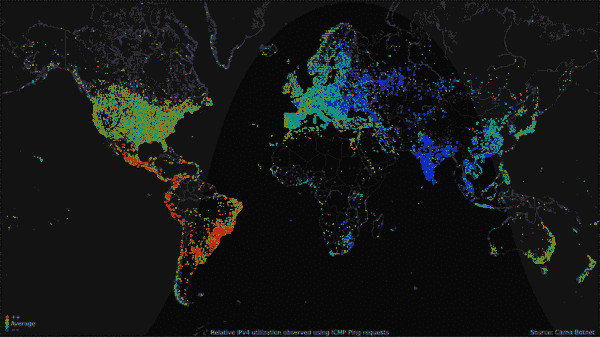
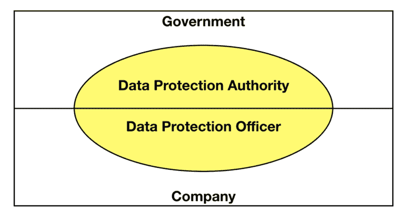

# 简明英语中的 GDPR 术语

> 原文：<https://www.freecodecamp.org/news/gdpr-terminology-in-plain-english-6087535e6adf/>

我的团队为瑞典和挪威一些访问量最大的新闻编辑室开发技术。部分收入来自销售广告。个性化的广告卖得最好，而个性化需要数据。互联网的默认商业模式是基于广告的。GDPR 对像新闻编辑室这样的在线业务有很大的影响。

但有趣的是——《通用数据保护条例》( GDPR)对可以收集哪些数据、如何使用以及可以存储多长时间做出了限制。

这篇文章旨在揭开 GDPR 核心术语的神秘面纱，让每个人都能理解这个有趣的话题。如果你是欧洲人或者有欧洲用户，你需要了解 GDPR。

> TL；DR；这是个人数据收集方式从“默认”到“选择加入”的巨大转变。外加一些其他的额外津贴。

下面是一段视频，从基本层面总结了这一点:

在我们开始之前，快速声明:我在我的个人博客上不代表我现在/以前的雇主。此处提供的信息纯粹基于我自己的研究，并不一定反映我公司的政策、战略或 GDPR 的实施。

### 一点背景知识

GDPR 于 5 月 25 日生效。尽管这让开发商和营销人员的日子更加难过，但对于最终用户来说，这实际上是一笔非常划算的交易。GDPR 阻止公司收集他们不需要的信息(严格来说)。

尽管以“一般”一词开头，但 GDPR 实际上是一部适用于的欧盟(EU)法律:

1.  总部位于欧盟的公司
2.  收集欧洲公民个人数据的公司。

也许“一般”是好的，因为互联网的很大一部分是欧洲的！

Global internet usage during 24 hours ([wikipedia](https://en.wikipedia.org/wiki/Global_Internet_usage))

在 GDPR,“监管”一词意味着它必须在整个欧盟范围内全面适用。

从长远来看，这导致了**隐私被设计**。这一原则要求从设计系统的一开始就包括数据保护，而不是事后才想到。

### 常用术语

以下是最常见的 GDPR 术语:

*   一个**数据主体**是一个人(比如你和我)，他的个人数据由一个数据控制者(比如我们使用的一个公司或服务)处理。
*   数据管理员是一个从欧盟居民那里收集数据的组织。它决定了处理个人数据的目的、条件和方法。
*   进行实际数据处理的实体被称为**数据处理器**——一个例子可能是云服务提供商。
*   **处理**涉及对个人数据进行的任何操作，无论是否通过自动化手段。这包括收集、使用、记录、将其馈送给机器学习算法(阅读[ML 如何受到 GDPR](https://www.oreilly.com/ideas/how-will-the-gdpr-impact-machine-learning) 的影响)等等。

### 用户的 GDPR

您的**个人数据**是可用于直接或间接识别您*的任何信息。*例如:您的姓名、家庭住址、照片、电子邮件地址、银行详细信息、社交网站上的帖子、医疗信息，或者计算机或移动 IP 地址。

这些数据通常用于**剖析**，其中自动过程评估、分析或预测你的行为。举个例子，知道你的年龄意味着你会接触到针对你年龄组的广告。对于那些你没有明确提供给公司的数据也是如此，比如你的 IP 地址，它将被用来猜测你的位置。

现在 GDPR 生效了，公司可以收集什么样的个人数据以及可以保存多长时间都有了限制。他们应该证明为什么他们需要它。

#### 当公司需要用户同意时

数据控制者(公司)不能只是去收集用户数据。他们必须首先征求你的许可或同意。

对于收集的数据和数据的使用目的，必须明确表示同意。同意是自由给出的(如果你说‘不’，公司应该在没有你的数据的情况下仍然尽可能好地为你服务)。如果数据主体没有真正或自由的选择，或者无法在不造成损害的情况下拒绝或撤回同意，则不应将同意视为自愿给予。同意书应该具体明确地说明收集什么数据以及如何处理这些数据。用户有权**在任何时候**撤回他或她的同意，但更重要的是**撤回同意应该和给予同意一样容易。**

公司不能再强迫你勾选一个复选框，上面写着“我接受所有条款和条件以及隐私政策”。这就是为什么你会在 5 月 25 日截止日期前收到许多网站的电子邮件，通知你他们的政策。

GDPR 同意的范围对那些习惯性地记录电话的企业有很多影响。典型的“出于培训和安全目的对通话进行录音”的警告将不再足以获得对录音通话的假定同意。

#### 当公司不需要用户同意时

收集准确的数据必须有合理的法律依据。根据 [GDPR 的网站](https://www.gdpreu.org/the-regulation/key-concepts/legitimate-interest/)，这些都可以当:

*   处理对于履行数据主体作为一方的合同或在签订合同前应数据主体的要求采取措施是必要的。
*   为了遵守控制者必须遵守的法律义务，处理是必要的。
*   处理是保护数据主体或其他自然人的重大利益所必需的。
*   为了公共利益或行使财务主任的官方权力而执行任务时，处理是必要的。
*   出于控制者或第三方追求合法利益的目的，处理是必要的，除非此类利益被数据主体的利益或[基本权利](https://en.wikipedia.org/wiki/Charter_of_Fundamental_Rights_of_the_European_Union)和自由所超越，这需要保护个人数据，特别是如果数据主体是儿童。

GDPR 最重要的好处是它[为用户提供控制](https://gdpr-info.eu/chapter-3/),以便:

1.  随时删除他们的数据(也被称为[被遗忘权](https://en.wikipedia.org/wiki/Right_to_be_forgotten))。**数据擦除**请求不会在数据控制器处停止。如果涉及到第三方数据处理者，他们也必须停止处理数据并删除它。我猜想会有一个事实上的标准 API，但到目前为止，它更多的是临时的，取决于服务如何相互通信。我相信在未来会有这样的服务，你给他们你的个人信息，他们会检查成千上万的在线服务，给你一个汇总报告，哪些网站有你的信息。公司应该提供一种方法来查询他们是否有特定用户的数据(不需要注册)*。*花絮:这和区块链的工作原理本质上是矛盾的！点击阅读更多关于[GDPR 对区块链的影响。](https://medium.com/@alexewerlof/gdpr-for-blockchain-f73744b9be34)
2.  拥有他们的数据！数据主体(用户)可以下载并查看他们的数据以及数据是如何处理的。此外，数据控制者必须告知数据主体有关处理的细节，例如处理的目的、与谁共享数据以及如何获取数据。这被称为**访问权限**或**主体访问权限**。个人数据[不能转移到欧盟以外的国家](http://ec.europa.eu/justice/data-protection/international-transfers/index_en.htm)，除非他们保证同样的数据保护水平。
3.  把他们的数据转移给竞争对手。这有利于竞争，最终用户会赢。控制器必须以结构化且常用的标准电子格式提供数据。不再被锁定！这被称为**数据可移植性**。这可能会开辟一个全新的业务领域，将数据格式从一个控制器转换到另一个控制器。
4.  更新/更正他们的数据。数据主体有权要求数据控制者立即纠正无效的(公共或私人)数据。

我个人认为**数据泄露**的公告令人惊讶。

数据控制者有法律义务向相关监管机构通报任何数据泄露情况，不得无故拖延，除非这种泄露有可能对受影响个人的权利和自由造成风险。

如果确定有不利影响，必须通知个人。在意识到数据泄露后，最多有 72 小时的时间进行报告。此外，数据处理者在意识到个人数据泄露后，必须立即通知数据控制者。

你还记得雅虎对其漏洞保密两年的时间吗？嗯，不再是了！

### 政府的 GDPR

由于 GDPR 是一个相当大的事情，政府参与保护他们的公民和执行法规。有两个术语需要理解:

*   国家**数据保护机构** ( [DPA](https://www.whitecase.com/publications/article/chapter-14-data-protection-authorities-unlocking-eu-general-data-protection) )由每个欧盟国家指定，以实施和执行数据保护法，并提供指导。**监察机关** (SA) [是 DPO 的别称](https://www.i-scoop.eu/supervisory-authorities-consistency-and-data-protection-authorities-dpas/#What_is_a_Data_Protection_Authority_or_DPA_in_the_scope_of_the_GDPR)。如第 16 章所述,《达尔富尔和平协议》拥有重大的执行权力，包括开出巨额罚单的能力。如果出现违反数据保护立法的情况(在欧盟公民 GDPR 的范围内)，以及从组织的角度寻求建议和具体问题和/或帮助，他们也是可以去的地方。
*   **数据保护官** ( [DPO](https://www.whitecase.com/publications/article/chapter-12-impact-assessments-dpos-and-codes-conduct-unlocking-eu-general-data) )是数据控制者(公司)的雇员，其正式任务是确保组织了解并遵守其数据保护责任。下一节将详细介绍这一点。

DPA & DPO

每个欧盟成员国都有一个主要机构，在那里做出有关数据处理的关键决策。

### 公司的 GDPR

违反 GDPR 的罚款上限相当昂贵:高达 2000 万欧元，或上一财年全球年营业额的 4%……以较高者为准！

收集数据的公司有责任和义务实施并证明他们遵守 GDPR。这叫做**顺应**。

当当局要求审计时，这些公司应该记录谁访问了哪些信息。必须保留处理活动的记录，包括处理的目的、涉及的类别和设想的时限。

根据要求，必须向监管机构提供这些记录。有趣的是，即使实际处理是由另一家公司(代表数据控制者的数据处理者)进行的，承担主要责任的仍然是收集数据的公司。

这一系列全新的要求复杂到足以创造一个新的职位:数据保护官(DPO)！这是一个企业安全领导角色，负责监督数据保护战略和实施，以确保合规性。

他们还:

*   就重要的合规要求对公司和员工进行教育
*   是公司和监管机构之间的联系点
*   监控整个公司的数据保护工作并提供建议
*   记录公司的所有数据处理活动，包括所有处理活动的目的，这些活动必须应要求公开
*   回答用户关于他们的数据如何被使用、数据擦除权利的询问，以及关于公司采取了什么措施来保护他们的个人信息的询问
*   通过分析处理的个人数据和保护数据的政策来识别和降低实体的隐私风险，这被称为**数据隐私影响评估**。GDPR [要求在数据处理可能对自然人的权利和自由造成高风险的情况下进行 DPIA](https://www.itgovernance.co.uk/privacy-impact-assessment-pia) 。

DPO 必须有一个支持团队，还将负责持续的专业发展，以独立于雇佣他们的组织，实际上是一个“迷你监管者”

如果一个企业在欧盟有多个机构，则根据主要数据处理活动的发生地，它将有一个监管机构作为其领导机构。

### 开发商的 GDPR

由于 GDPR 通过设计强制实施**隐私，它影响了软件架构及其实现。例如，我们不能再记录敏感信息(如前所述，IP 地址被视为个人信息)。这使得追踪 bug 变得更加困难。**

因此，默认情况下，隐私设置必须设置为高级别。因此，我们必须确保暴露个人数据的复选框在默认情况下没有被勾选。

如果云用于数据存储，只有数据所有者，而不是云服务，应该持有解密密钥。

我们不能存储数据超过必要的时间。数据库列应该有一个**数据保留期限**,指定数据应该何时删除。

个人身份信息应**假名化**，在不使用额外数据的情况下，不能再将其与单个数据主体关联(或“归属”)。

在我的新帖中阅读更多关于[技术中的假名化。](https://medium.com/@alexewerlof/gdpr-pseudonymization-techniques-62f7b3b46a56)

### GDPR 的例外

如果法律不是用来破坏的，那它还有什么用？不要对你的权利过于兴奋，因为以下情况不在该条例的涵盖范围内:

*   合法监听、国家安全、军队、警察、司法
*   研究的统计和科学分析
*   死者受国家立法管辖
*   有一部关于雇主-雇员关系的专门法律。GDPR 的开发重点是社交网络和云提供商，但没有考虑处理员工数据的足够需求。
*   自然人在纯粹的个人或家庭活动中处理个人数据

### 确认

感谢我的同事 [Ioana Norgen](https://www.linkedin.com/in/ioanadodu/) 在发表前校对了这篇文章。任何可能的错误仍然是我的。

### 来源

*   GDPR 术语词汇表
*   [伪匿名技术](https://gdpr.report/news/2017/11/07/data-masking-anonymisation-pseudonymisation/)
*   [维基百科](https://en.wikipedia.org/wiki/General_Data_Protection_Regulation)
*   [数据保护官](https://digitalguardian.com/blog/what-data-protection-officer-dpo-learn-about-new-role-required-gdpr-compliance)

### 有趣的阅读

*   与 GDPR 同时实施的一系列相关法规。它的目标是提供任何形式的在线通信服务、使用在线跟踪技术或从事电子直接营销的任何企业(如电信运营商和在线通信服务，如 Skype 和 WhatsApp)。其最重要的方面是防止垃圾短信/电子邮件和营销电话。
*   一份优秀的开发者 GDPR 指南和一些漂亮的幻灯片
*   Belitsoft 为 GDPR 的企业制作了一份很好的清单，尽管清单中的项目并非都是 GDPR 的要求，有些像双因素认证更像是一种最佳实践。
*   [GDPR 如何影响用于跟踪的 cookies】](https://techblog.bozho.net/tracking-cookies-gdpr/)
*   数据保护改革方案还包括针对警察和刑事司法部门的单独的数据保护指令，该指令规定了国家、欧洲和国际层面的个人数据交换规则。
*   [脸书和谷歌在 GDPR 的第一天就打了 88 亿美元的官司](https://www.theverge.com/2018/5/25/17393766/facebook-google-gdpr-lawsuit-max-schrems-europe)
*   [隐私设计](https://en.wikipedia.org/wiki/Privacy_by_design)

> 底线是:GDPR 是一个明显的右翼。欧洲率先建立了这一制度，但这应该是一项全球权利。如果你想享受和欧洲人一样的保护和选择，那就和你的朋友、同事和立法者谈谈吧。

如果你喜欢这个，你可能会喜欢:[编程是有史以来最好的工作](https://medium.com/@alexewerlof/what-s-cool-about-being-a-programmer-5a1e58efeee6)和[我如何跟上技术](https://medium.com/@alexewerlof/how-i-learn-new-tech-cb79db19c818)。