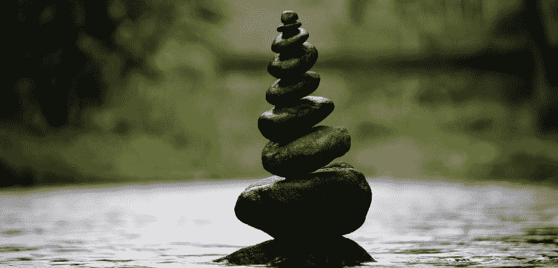
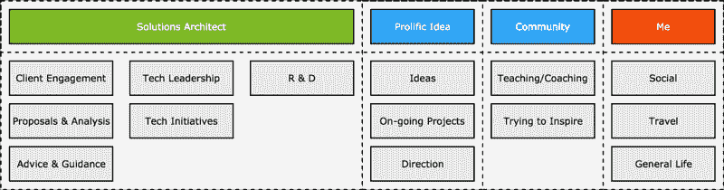
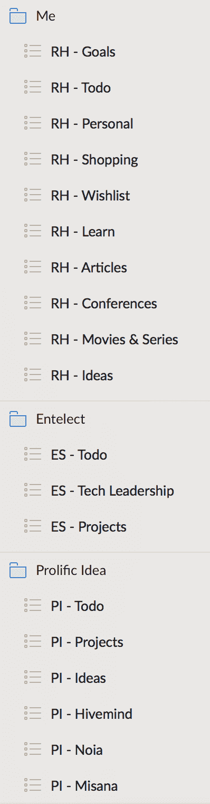
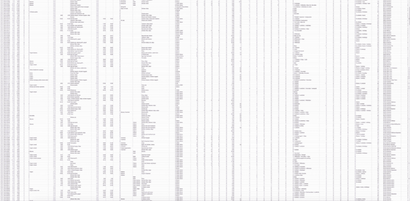

# 用数据分析了一年的生活后我学到了什么

> 原文：<https://www.freecodecamp.org/news/what-i-learned-after-analyzing-my-life-for-a-year-with-data-90c1d49c73cf/>

由 rishal 丈夫

# 用数据分析了一年的生活后我学到了什么

为了寻找一种不那么焦虑、更有意义、有希望更快乐和成功的生活，我决定记录我整整一年的行为和习惯。我称之为生命行动。它来自于一个能感知你的目标和行为的系统的想法。该系统将提供建议和意见，以更好地实现这些目标，建立积极的习惯，并取得更大的成功。

这个想法是，看似与目标无关的行为仍然影响着他们——而我们甚至没有注意到或意识到这种影响。此外，通过认识到我们的行为，我们总是知道不足之处，并能相应地调整。通过记录和分析数据，并改变我的行为，我能够实现目标并更多地了解自己。

### 日常生活

#### 白天工作

我的日常生活非常忙碌，而且不仅仅是普通的忙碌——有很多环境转换。我是一家定制软件开发公司的解决方案架构师，这本身就要求我在一天内将注意力分散在不同的事情上。

作为一名解决方案架构师，我在没有太多时间研究业务领域和技术前景的情况下，立即处理我所遇到的问题，或者成为该领域中经验丰富的专家。这需要快速了解业务领域和手头的问题。我必须利用我现有的技术知识和经验，然后为这些问题设计可能的解决方案。这一方面涉及大量的交流、合作和高层次的思考。

该角色的另一个方面包括与团队合作解决更具体的问题，并为未来的最佳结果设计解决方案。这方面涉及许多技术问题的解决和与开发团队的合作。

思想/技术领导力是我工作的另一个方面。我需要制定战略和战术(并花费大量时间来执行这些战略和战术),以提高组织内的技术领导力。这意味着从一个高层次的角度工作，但是是在一个组织层次上，而不是在一个特定的业务领域上。我必须运用对人们及其目标的理解来加强本组织的信誉。我还需要指导和激励人们执行战略，以加强组织，并帮助他们作为个人成长。

我工作的最后一个方面是研发。我需要了解最新的技术趋势，并亲自了解新技术是如何工作和配合的。作为解决方案架构师，这有助于我更好地为客户和团队提供建议，而且这很有趣。

#### 梦想

抛开这一切，我在 2015 年创立了多产创意。我的目标是为个人、企业和整个世界建立一个更有生产力和更多产的未来(是的，听起来很俗气)。

我一直相信，为使用技术做有用的事情的人创造非凡的体验是成功的关键。我仍然这样认为，但在这个旅程中，我意识到拥有一个开发良好的产品是不够的。思想和努力也需要放在战略、营销、财务管理和其他业务相关的领域。在这个领域，我仍在不断学习和尝试。

#### 更多激情

除了我已经提到的一切，我对教育和授权人们有着强烈的热情。我每月举办人工智能会议/黑客马拉松，以增强当地技术人员的能力，使他们能够通过理解人工智能技术来推进他们的个人和专业项目。

我也经常在会议和聚会上分享我的知识，这对结识新朋友和学习完全不同的东西很有帮助。

此外，我喜欢游戏开发。这是我进入科技领域的很大一部分原因，所以当我有时间的时候，我会尝试尝试我的想法。

#### 经历

我生活的另一部分包括娱乐和自我召唤活动，比如旅行和体验新的文化、人物和动态。我一直想去世界上不同的有趣的地方旅行，探索各种可能性。

最后，我是一个社会人。我希望能够享受和朋友在一起的时光，讨论想法，合作，认识新朋友。但是，随着我的工作、梦想目标和激情，这变得更加困难。

#### 自发的

我前几年的目标之一是变得更自然。当我发现一些有趣或不同的事情要做时，我总是评估所有的可能性，我会花的时间，以及做任何事情的影响。

我想放下这一切，去做感觉正确的事情。这意味着我会做新的事情，和不同的人在一起，这打乱了我的计划。但这种结果可能比想太多、错过很多有趣的经历要好，可能会让我的心态变得更好。

从你到目前为止读到的，你可以知道我的生活真的很忙。这还不包括每天占据我头脑的所有个人挑战和任务。健康和情感幸福是我一直在努力解决的大问题，但也值得努力和关注。

重要的一点是，这不仅仅是因为忙碌——这是我试图实现的所有这些不同事情的精神开销。许多人可能会说“你把自己铺得太薄了”，我完全同意。然而，我对迄今为止我提到的每一件事都充满热情。他们都有一种渴望，我需要找到一种方法让它工作，而不会耗尽精力，憎恨我的生活，或者一直感到焦虑。

这让我开始利用数据来了解自己，这样我就可以尝试优化我的生活。

### 我记录的指标

对我来说，记录我的生活指标并不新鲜。我和一个朋友想到了这个平台，它知道你的目标和行为，然后提供建议、支持和见解来帮助你实现这些目标。它致力于一些行为改变，并使用游戏化技术——这是在 2013 年。

在开发了一个基本的原型之后，我意识到要使它变得可用和有用，还需要做更多的工作。几年过去了，在此期间我几乎没有时间投入到项目中，开发也停止了。

但是在 2016 年的 12 月，我意识到 app 并不是最有价值的部分。这个想法和它能实现的是。所以我决定通过在电子表格上模拟来把自己当作一只小白鼠。

#### 收集正确的数据

我创建了一个电子表格，其中包括我每天所做事情的指标，以更深入地了解我的行为和我朝着目标的进展。

我的主要问题是:

*   背景转换(Context switching )( T1)——区分任务的优先次序，把其他的事情从我的脑海中移除，直到它们被安排到需要关注的时候。
*   渴望做更多事情 —在完成之前的一个项目之前，我经常有开始一个新项目或开始一个新想法的冲动。有太多的想法和问题了！
*   **学习新事物** —我有一个我想学的东西的清单，而且这个清单还在不断增长，而我实际上并没有学到清单上的任何东西。
*   **关闭** —理解大脑需要休息一段时间才能正常工作。
*   失眠——导致睡眠不足，在大多数早晨感觉很糟糕。
*   垃圾食品——我喝了太多软饮料和能量饮料。
*   **食物** —我不会做饭(我真的应该学学)，所以我经常在外面吃饭，或者从当地的商店买饭。
*   正确饮食——我通常不吃早餐和午餐，然后吃一顿大餐，有时吃垃圾食品来弥补。
*   自我照顾 —这有点包罗万象，但包括花时间照顾自己，我的健康，并明白什么都不做也没关系。

我为自己制定了一个“固定”的时间表作为指导方针。时间表将每天的一部分时间划分为围绕某个主题进行生产。我决定每天最多选择两个主题。这让我有意识地知道在某一天我会对什么说**是**，对什么说**不**。

时间表和主题每周都会稍有变化，但是有了一些指导方针，我就可以把其他日子有专门时间的事情从我的脑海中清除出去。

#### 变得有条理

待办事项列表一直是我活动的中心。现在我有了集中的主题，当一项任务不是当天主题的一部分时，我可以从列表中消除干扰。Wunderlist 真的很有帮助，因为它可以让你在特定的一天里，通过对任务进行排序，将它们集中在不同的部分。

在概述了我的问题，心中有了目标和激情之后，我开始记录以下内容:

*   我该醒来了。
*   我有时间照顾自己吗？
*   我吃早餐了吗，如果吃了，我吃了什么？
*   我该离家去上班了——在我居住的地区，交通相当拥挤。
*   我该去上班了。
*   我吃午饭了吗，如果吃了，我吃了什么？
*   工作中的学习或成就。
*   我该下班回家了。
*   我该回家了。
*   我白天去过的地方。
*   多产的想法，学习或成就的时间。
*   我吃晚饭了吗，如果是，我吃了什么？
*   闲暇时间。我做了什么休闲活动，花了多长时间——通常是游戏或电视。
*   各种练习的重复次数。例如俯卧撑、深蹲、仰卧起坐、平板运动等等。
*   消耗的水量。
*   食用垃圾食品。
*   饮酒。
*   香烟数量——试图减少(或戒烟)。
*   体重——努力变得更加健康和健美。
*   情绪——感觉积极、感觉消极或感觉不好。
*   日志—一天的描述。

我从 2017 年 1 月 10 日开始记录我一天中的每一个特征。我确保这是我每天晚上都要完成的一个仪式:当我上床睡觉时，我会在谷歌表上记录这些观察。我还设置了一些计算来给我一些指导，告诉我什么是对的，什么是错的。

几乎很快，获取数据就成了第二天性。我可以在漫长的一天或一夜外出后很晚才回家，但仍然可以捕获数据。这也让我反思我的一天，并决定我那天的行为是否有助于我实现目标。它也指引着我第二天的目标。

我也审视了自己前几周的行为和趋势，以决定下周需要关注的地方。

### 我所做的改变

通过评估数据和设定短期目标，我能够做出一些改变。这些改变帮助我通过使用关于我行为的知识实现了一小部分目标。

以下是其中的一些:

*   通过确保我在日历上分配的时间得到充分利用，我能够在特定的环境下完成更多的工作。
*   专注:因为我强迫自己在任何给定的时间专注于一件特定的事情，这增加了对手头任务的专注，从而提高了工作效率。
*   水的消耗量:通过了解我消耗的水的确切升数，我能够改变我的行为并消耗足够的水。我每天都带着一瓶 1.5L 的水，并且确保喝完。
*   垃圾食品消费:我做了一个明智的决定，在决定吃点什么或喝点什么之前，先停下来想一想。这帮助我从饮食中去除了大多数软饮料和典型的垃圾食品。
*   健康:通过记录我喝的水量、吃的食物和吃的垃圾食品，我能够了解我可以减少和改善的地方。我决定吃少量的早餐，但我通常时间很紧。所以我每周都会买酸奶和牛奶什锦早餐，准备和食用都不需要太多时间。别误会，因为我不习惯早上吃东西，所以有些日子我吃不下。但是我强迫自己为了更大的利益。水也是一个大问题。我一整天都没有喝软饮料，而是挑战自己至少喝 1.5 升水。我的饮食也在改变。当我在外面吃饭或从商店买食物时，我没有得到最满意的一餐，而是强迫自己吃一些更无聊和健康的东西。
*   我注意到我的睡眠有很大的不规律。睡不着的时候，什么事情都想很多，所以我决定想办法改善这一点。我购买了一个睡眠跟踪应用程序，并在睡觉前创建了一个例程。我会洗个热水澡，避开我的手机或笔记本电脑。这已经产生了影响，但是还有很长的路要走。数据还显示，睡眠可能是影响我一天计划的关键因素。它影响能量、情绪和动机。

### 从数据中吸取教训

我一直在对我的日子进行时间划分，捕捉我生活中的数据，并根据每天的主题只关注待办事项列表中的一部分事情。这是我从分析的角度学到的:

*   睡眠:我平均睡 5.5 个小时。这需要改进。
*   **水:**达到的摄入量为 1.5 升。
*   食物:强迫自己按时吃饭对我的情绪没有影响，但在减肥方面对健康有益。
*   垃圾食品:我一直在减少，但当我作弊的时候，我会拼命作弊。
*   能量饮料:几乎所有喝能量饮料的日子都让我产生了负面情绪。扰乱睡眠，造成有毒循环。
*   学习:我学到更多东西或有所成就的日子是我最快乐的日子，不管其他目标是否实现。
*   **体重:**通过增加水分摄入，戒掉常规垃圾食品，轻度运动，我瘦了 9 斤。
*   旅行:更长的旅行时间意味着更糟糕的日子，但当我旅行并看到新的地方时，我的情绪更高。
*   工作效率:将我一周的工作分成不同的主题，提高了工作效率，减少了焦虑。这是这项工作最大的成功之一。通过让我的大脑每天花几个小时专注于一项任务，而不是试图处理多个特别的主题，我变得更加专注和有效。

#### 走向

在分析了我一年的生活数据后，我明白了有几件事是我最需要的，以进一步优化我的生活，实现我的目标，并尽可能表现出色:

**更细化的目标**:我不能只有微观层面的数据和高层目标。我需要创建每周的主题和目标，以及每月的主题和目标，以创建完成具体工作所需的焦点。

思考和构思是很棒的(我一直都在这么做)，但是把它变成有意义的东西总是在待办事项列表上，永远不会到来——这需要改变。

快速完成任务:我经常把琐碎的任务推迟到以后——像倒垃圾或清理我的笔记本电脑这样的小事。一个大的游戏改变者是尽快完成琐碎的任务。回复邮件、做家务、购买必需品等等。

通过尽快完成这些任务，你减少了记住去做它们的精神负担。即使你认为它们没有占据你的大脑空间，它们确实占据了。不管你是否知道，这些任务都会引起焦虑。尽可能快地完成琐碎的任务，这会让你感觉不那么懒惰，更有效率，总体上有一个积极的结果。

**更多数据**:我需要每天记录更多数据，以便更好地了解我参与的确切活动、我消耗的东西以及我使用的时间。

**易于捕获**:在电子表格上捕获数据很麻烦。Misana(软件系统)的目标是让获取这些数据变得容易。理想情况下，我会通过手机传感器和机器学习来实现自动化。

**实时分析和处方**:我目前需要捕获一天的所有数据，以便通过电子表格中的一些奇特公式了解每日、每周、每月和整体分析。如果有东西可以为我提供实时分析和指导，我就可以轻松地实现我的目标，而无需管理开销。

除了这几点，我还学到了一些无法完全描述或量化的东西。我明白了，通过承认我可以改进，并努力分析自己(以及我做的事情和我做这些事情的原因)并将其与我的目标进行比较，可以取得一些小的改进。通过对我自己和我的生活做一些小小的改变，我能够实现那些在我看来只是“未来目标”的事情。我能够通过有意识的小改变来改变我的生活方式。

### 今后

#### 我

在我为之奋斗的所有目标和每天的琐事之间，我的脑海中仍然有关于做什么，什么时候做，以及它有什么价值的噪音。虽然它在进步，但是每一个新的想法都会破坏它。有时候我觉得我在和所有这些想法做斗争。

我坚信不要做一只羊(一个符合社会规范并满足于平庸的人)。例行公事让我觉得自己像只绵羊，但这也是我们人类渴望的东西。在极端的一面，自由可能意味着混乱和不确定性。但对我来说，这意味着压力的消除和无所畏惧地做感觉正确的事情的能力。

我明白了改善我的健康对我的事业至关重要。通过努力做有益于健康的事情，包括睡好觉、合理饮食和锻炼，其他目标会变得更容易。你感觉更好，更有精力，有时更有动力。

当面对让你感到不舒服的新事物时，考虑去做。做让你走出舒适区的新事物是成长的最好方式之一。

这个练习的底线是做一些不同的事情，原谅小错误，并不断朝着你热爱的事情努力。不要抱怨或感到无能为力，做一些改变你生活、思考、工作和生存方式的小事。

#### 技术

我使用以下应用程序来帮助我区分优先级、理解和完成有助于实现目标的任务。在试图保持生产力的同时在它们之间切换是困难的。

*   Outlook 标记的电子邮件。
*   收件箱固定电子邮件。
*   日历事件。
*   日历焦点块。
*   特雷罗是各种项目的董事。
*   松弛消息。
*   分类待办事项列表。
*   日常习惯电子表格。
*   包含周目标和月目标的电子表格。

毫无疑问，这可以整合到一个单一的平台上，这个平台抓住了高效和无缝实现目标的本质。这就是 *Misana* 的未来，一个我希望未来开发出货的 app。

#### 你们

我希望你能吸取我在这个过程中学到的一些教训，反省一下自己。我挑战你改变你的生活方式。在你的日常生活、你的每月目标和你的总体生活目标中，试着自发地创造秩序。

对我来说，收集数据并从中学习是有效的。你可能需要更少的结构，在日常生活中做一些小但有意义的事情来帮助你实现目标，或者做一些目前对你来说似乎超出现实范围的事情。

认识到你的行为和目标会带来巨大的不同。不管用什么方法，做一些让你走出舒适区的事情，迫使你提升自己，做一些有助于你努力实现的事情。

在这篇文章发表后，为了回应一个请求，我整理了一个示例电子表格，您可以使用和试验。[点击此处进入 Google Sheets](https://docs.google.com/spreadsheets/d/1GnEbfeRs7PlcmMR-a6fx8G7wPA9voWLbV_K3VHezFIs/edit?usp=sharing) 。

我总是对你的经历感兴趣。如果你有任何建议或意见，请告诉我。保持联系✌️

我在推特上很活跃: [@RishalHurbans](https://twitter.com/RishalHurbans)

我会写更多，所以如果你感兴趣，请在 Medium 上关注我。

我可以通过 rishal[at]prolificidea[dot]com 的电子邮件联系

你也可以在下面评论，我会努力回复。

#### 如果你喜欢这篇文章，请给它一个或七个掌声，同样，如果你有任何问题，意见或评论，请留下评论。