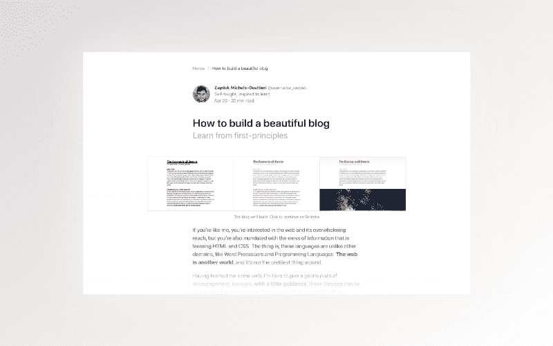
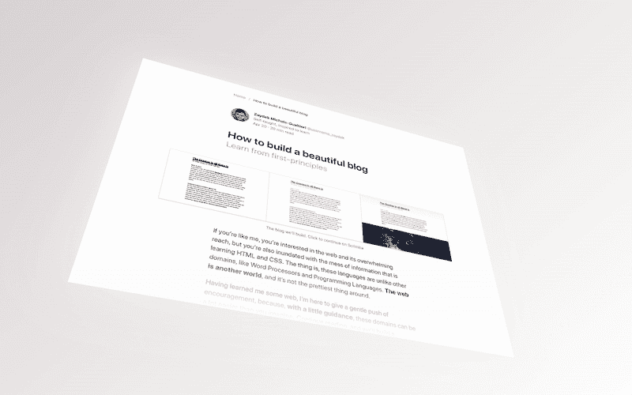
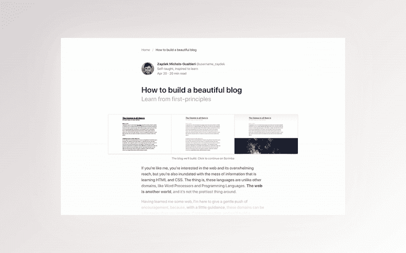
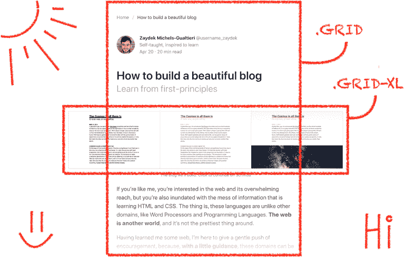
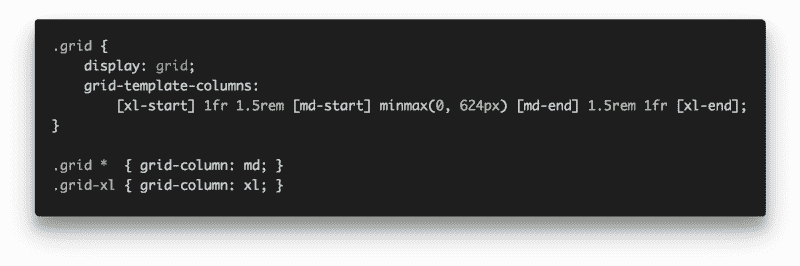

# 如何构建一个？基于布尔玛 CSS 的响应式博客设计

> 原文：<https://www.freecodecamp.org/news/how-to-build-a-responsive-blog-design-with-bulma-css-c2257a17c16b/>

作者 ZAYDEK

#### 哦哦

# 如何构建一个？基于布尔玛 CSS 的响应式博客设计

#### ?‍‍ Thanks, Bulma!

在我开始写这篇文章之前，我只想分享我正在开发一个产品，我很想收集一些关于如何更好地为 web 开发人员服务的数据。我创建了一个[简短问卷](https://twitter.com/username_ZAYDEK/status/1103914471267790854)在阅读这篇文章之前或之后进行检查。请检查一下，谢谢！现在，回到我们的常规节目。

### 你好互联网！

我来这里是为了消除你认为建立网站很难的想法。此外，在短短的几分钟内，我们凡人将学会如何建立一个美丽的和(！)使用布尔玛的响应性博客设计。

#### **布尔玛？！** [布尔玛](https://bulma.io/)是一个 CSS 框架，是 [@jgthms](https://jgthms.com/) 的创意。？

#### 我还在 Scrimba.com 教了一门免费的全长 Bulma CSS 课程，我们在那里建造这些️？设计。点击这里免费注册！？

#### [Scrimba.com](https://scrimba.com/g/gbulma)是一个下一代平台，前端开发人员可以通过互动截屏录制和分享他们的网站！？

### 布尔玛？\_(ツ)_/

布尔玛解决了很多问题——很多。无论你是需要一个可视化组件，还是想了解如何用最佳实践和[最佳文档来编写组件](https://bulma.io/documentation/)，布尔玛都可以帮你！？‍?

布尔玛甚至不是 1.0 版本，但在 GitHub 上每月有 [15 万+的下载量](https://github.com/jgthms/bulma/)和[26 万+的星级](https://github.com/jgthms/bulma)被广泛采用。把布尔玛想象成 Bootstrap 的竞争对手，尽管事实上它只是 CSS。？看马，没有 Y [的 avaScript！](https://www.destroyallsoftware.com/talks/the-birth-and-death-of-javascript)

### 布尔玛是如何工作的？

布尔玛使用几种技术为开发人员创建一个内聚的界面。我们只需要关注使用语义类来描述我们的网站设计——而不是元素——或者换句话说，[惯用模板](https://bulma.io/documentation/overview/start)。

这些语义模板可以被认为是我们用来快速构建网站的互连构件。⚡️:这些组件也是开箱即用的，这意味着我们可以更专注于内容而不是代码。

#### 迷茫？开始？我们先来学习布尔玛的基本知识。

### 那又怎么样？设计？

Want to learn how to build this 3D graphic in HTML and CSS? ? L[et me know!](http://bit.do/subscribe-d82dcb4b980a) ?

这个设计可以更好的理解为**三个** **部分**:

**☝️CSS 电网**
**✌️布尔玛组件**
**？内容**

[**CSS 网格**](https://en.wikipedia.org/wiki/CSS_grid_layout) 规范是我们如何创建一个定制的响应式设计，其中**布尔玛组件**给我们有用的模板和部分来划分我们的内容，而**内容**当然是……我们的内容！？

### ☝️ CSS 网格

尽管[布尔玛是响应式的](https://bulma.io/documentation/overview/responsiveness/)开箱即用，我们还是会选择 CSS Grid，这样我们就能保持对响应式设计的完全控制。害怕？不要！这里有一个秘密:这只是 8 行人类可读的代码！？

事情是这样的:我们为一般用途创建一个选择加入的`.grid`类，因此在特定情况下，当我们希望我们的内容突出并且更广泛时，我们创建一个特殊的`.grid-xl`类，我们可以在每个元素的基础上使用它:

Whoa…that’s it? CSS Grid *is* magical! ??

首先，我们用标识符`xl`和`md`模板化一个响应性的 5 列网格。然后我们告诉`.grid *`跨越`md`列，例如内容列，告诉`.grid-xl`跨越`xl`列，例如所有列。？️

现在，想象创建不同的`.grid-sm`、`.grid-lg`等等。类来扩展不同的警告宽度。想想看…这不仅仅是简洁或酷，这是 100%的现代响应式设计。听着，妈，不准媒体提问！

#### 迷茫？可以进一步了解 CSS 网格？h [ere](https://scrimba.com/g/gR8PTE) with Per！

### Bulma 组件

[**布尔玛组件**](https://bulma.io/documentation/) 是我们设计的核心。尽管这很有趣，但我们不需要从头开始写 CSS 来创造一个漂亮的设计。相反，我们可以依靠成功的框架来仲裁组件。

因为布尔玛可能很简洁，或者乍一看很难理解？我用 ASCII 艺术再现了这个设计，展示了我们如何使用不同的布尔玛组件来模拟这个设计:

What if we could write code like this…??

事实是，布尔玛更简洁，但这是可以理解的，因为它是 HTML。注意，我还混淆了一些细节，以更好地强调布尔玛是如何工作的。然而，你可以[观看这个互动截屏](https://scrimba.com/p/pV5eHk/cdkVWhq)来看完整的代码。？

再看一眼；注意`.container (.grid)`和`.columns (.grid-xl)`？例如，第一个将翻译成`
。这就是我们如何用布尔玛分量来插值网格！

你可以了解更多关于布尔玛的组件？这里。在这个博客设计中，我们使用了 s[ect、](https://bulma.io/documentation/layout/section/) c [ontainer、](https://bulma.io/documentation/layout/container/) b [readcrumb、](https://bulma.io/documentation/components/breadcrumb/) m [edia、](https://bulma.io/documentation/layout/media-object/) i [mage、](https://bulma.io/documentation/elements/image/)c[columns、](https://bulma.io/documentation/columns/)和 c[content。](https://bulma.io/documentation/elements/content/)而且，尽管我已经混淆了，我们还是使用了 m 个[修饰符，](https://bulma.io/documentation/modifiers/helpers/)也是！？

#### 把 HTML 想象成塑料，把 CSS 想象成颜料，把布尔玛想象成乐高。？

### ？内容

按照约定，最后是我们网站的**内容**。其中一个属于我们的`.content`组件。记得我说过布尔玛依赖选修课吗？嗯——这是 99%的情况；在`.content`中，布尔玛将 CSS 应用于:

`p`段
`ul``ol``dl`列出
`h1`至`h6`标题
`blockquote`引用
`em``strong`
`table``tr``th``td`表格
[等。](https://bulma.io/documentation/elements/content/)

布尔玛·shine️s✨在哪里`.content`可以和修饰语连用。其中包括`.is-small`、`.is-medium`、`.is-large`换`.content`的孩子的`font-size`！你可以在这里了解更多`.content` [。](https://bulma.io/documentation/elements/content/)

### 恭喜你。感谢阅读！6(^ω^)9

现在是进入前端开发的绝佳时机。随着像 [Flexbox](https://en.wikipedia.org/wiki/CSS_flex-box_layout) 和 [CSS Grid](https://en.wikipedia.org/wiki/CSS_grid_layout) 这样的 CSS 规范和像[布尔玛](https://bulma.io/)这样的框架的引入，web 构建变得前所未有的容易！

#### 喜欢这篇文章？！还有一篇文章跟它一模一样！点击？这里！

